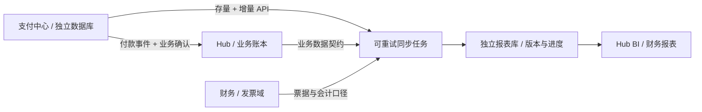

# 跨集群、跨数据库的数据同步与财务报表

2026-10-02。现已实现 mx-pay 数据出口、可复用 PostgreSQL 消费组件，以及可选的 Hub 报表同步和管理员查询。当前 Hub 仍使用既有充值路径；没有迁移钱包、租户或 Launcher 账户，也没有开放公网入口。部署配置、数据新鲜度与接口见 [Hub 报表接入手册](../../../mx-insight-hub/docs/operations/payment-reporting.md)。

## 1. 业务归属与报表归属

各中心可以部署在不同 Kubernetes，使用不同 PostgreSQL 实例甚至不同数据库产品。把稳定的数据契约作为集成边界，无需把它们的生产表放进同一个库。mx-common 复用连接池/迁移等代码，也不意味着必须共享数据库实例。

| 中心 | 权威事实 | 对外提供 | 汇总后由谁解释 |
| --- | --- | --- | --- |
| mx-pay | 付款状态、金额、渠道、商户引用；未来退款执行事实 | 应用隔离的业务 API、付款交付事件、只读报表同步 | 财务制定收款/退款/费用的口径 |
| Hub／业务应用 | 租户钱包、充值交付、消费、商品报价、优惠、业务授权 | 业务账本、订单与交付的数据契约（后续实现） | 业务运营指标与财务映射 |
| 财务域／发票域 | 凭证、主体归属、发票、对账差异、关账版本 | 受权限控制的报表、调整与核对结果（规划） | 财务负责人 |
| Hub 数据平台 | 同步任务、数据血缘、清洗与分析读模型 | 已实现支付事实同步/管理员明细及日汇总 API；统一 BI 页面后续接入 | 对应业务域保留口径所有权 |
| Launcher／未来运维入口 | 人类身份与中心入口、部署/运行信息 | 统一导航和运维入口 | 不把其他中心的生产数据迁入 Launcher |



跨中心 JOIN 主要在报表库内完成。订单详情、付款确认、退款可退额度等资金决策仍查各自权威服务；报表延迟不能被当成“没付款”或“还能退款”。充值额、实际收款、业务消费、手续费和收入指标分别建模，不把一笔充值直接当作全部业务收入。

## 2. 网络与服务发现

- 同集群可用 Service DNS；跨集群不能直接使用另一个集群的 `.svc.cluster.local`。由部署环境提供可达的稳定域名，经 HTTPS 网关或受控专网连接，数据库本身不必跨集群暴露。
- SDK 的 `baseUrl` 已支持 HTTP(S) origin，跨网络应使用验证证书的 HTTPS。服务凭据只放在调用服务端；浏览器通过所属中心的后端查询。
- 部署时发现并固定已确认的服务入口。未来总 `manage.sh`/服务目录发布 endpoint、契约版本、环境与健康状态；消费者保留经过验证的配置，不能每次支付都依赖运维中心在线。
- 不根据相似服务名、库名或备份目录自动选择数据源。新 endpoint 上的数据源 UUID 不同，或数据库落后于已保存进度时，同步停止并要求核对。
- Launcher 人类会话、业务 API Key、支付机器凭据分开。现有影子账户/Hub 租户绑定无需为报表同步改变。统一登录和中心导航不要求统一数据库。

当前没有自动创建跨集群网关、证书、Ingress 或公网注册，也没有让支付服务调用 Launcher/Hub 完成自身事务。

## 3. 已实现的支付报表数据契约 v1

### 权限与接口

报表消费者使用独立 `reports.read` 凭据，仅允许固定 `appId + environment` 的读取，无下单、核实收款、设置或业务 ACK 权限。多个报表消费者各有自己的凭据与持久化进度；没有共享的“已消费”标记。

```sh
# 在 mx-pay 目录，给 Hub BI 建一个只读调用方；不会旋转已有业务密钥
node scripts/add-reporting-credential.mjs mx-insight-hub live hub-bi-live
bash scripts/manage.sh deploy
```

密钥留在私有 `secrets/credentials.json`，日志不输出。部署后再把该只读密钥配置给消费端 Secret。已有同名、同归属只读凭据会保留；同名但权限/归属不同则拒绝覆盖。此命令不创建外部账号、不更改 Launcher 登录。

| 接口 | 用途 |
| --- | --- |
| `GET /v1/reporting/snapshot?limit=100&after=...` | 首次存量引导，按订单 ID 游标分页；首次不传 after |
| `GET /v1/reporting/changes?limit=100&after=...` | 从存量接口给出的起点读取可重放增量；after 必填 |

单页 1–200 条。响应含 `version`、`source`（源 UUID、应用、环境）、`observedAt`、`items`、`hasMore`、`nextCursor`、`changesCursor` 和 `highWaterCursor`。游标不透明，调用方存储原串；不能自行按数字/时间跳过。序号在协议中保持字符串，不经过 JavaScript 浮点数转换。

订单明细采用字段白名单：支付 ID、业务单号、customerRef、revision、状态、渠道、商户引用、币种、订单金额、实收金额、手续费、创建/更新时间、到账/确认时间。金额为整数分。未知手续费保持 `null`，不能当作零费用。没有付款人姓名、原始渠道流水、核实备注、二维码或发票税号。

下游数据主键至少为 `(source_id, app_id, environment, payment_id)`。业务关联使用 `(app_id, business_order_id)` 与明确维护的 customerRef/租户映射，不能按姓名、邮箱或不同中心的裸 `user_id` 合并账户。Hub 的租户标识不因接入统一身份而重编号。

### 首次引导与增量续传

1. 第一页存量读取记录起始水位和订单 ID 上界；后续存量页沿用它们，不按服务器时间过滤，以免时钟回拨或导入数据的时间差造成漏单。每次只开启一个短的只读数据库事务，不在多次 HTTP 调用之间保留事务。
2. 存量页是在线引导，不是跨所有页面冻结的历史快照。同步期间新发生的变化由增量补齐，后面的存量页可能已经看到更新版本。
3. 存量结束后，必须从**第一页起始水位**重放变化，不能改用最后一页的最新水位。
4. 消费者在自己的一个事务中完成：按订单 revision 只接受更新版本、保存投影、保存下一页 checkpoint。同版本重放应得到同样结果，旧版本不能覆盖新版本。
5. 断网、超时或本地事务失败，保留原 checkpoint 重试。消费进度没有提交就不能先前移游标；无需调用支付业务事件的 ACK。

SDK 已提供：

```js
import { PaymentClient } from '@qpjoy/mx-pay/client'

const pay = new PaymentClient({
  baseUrl: process.env.PAY_REPORTING_URL,
  token: process.env.PAY_REPORTING_TOKEN,
})
// checkpoint 从消费者自己的数据库加载，首次为 null。
const result = await pay.syncReportingPage(async page => {
  await reportingDb.transaction(async tx => {
    for (const order of page.items) {
      // 主键包含 page.source；只有 incoming.revision > stored.revision 才更新。
      await tx.upsertPaymentIfNewer(page.source, order)
    }
    await tx.saveCheckpoint('mx-pay', page.source, page.nextCheckpoint)
  })
}, checkpoint)
// result.hasMore 或 result.initialCatchupRequired 为 true 时继续读下一页。
// 否则按同步任务的间隔轮询；SDK 不隐式启动常驻任务。
```

示例中的 reportingDb/tx 由消费端实现，不是当前 SDK 自带数据库。每个源/应用/环境同一时刻只运行一个消费任务，或对保存的 checkpoint 加消费者本地锁/CAS，防止两个任务把进度写回旧值。一个报表系统重建不会影响业务入账和其他报表系统。

需要现成 PostgreSQL 实现时，可使用新增的 `@qpjoy/mx-pay/reporting`：`PaymentReportingStore`、`PaymentReportingWorker`、`parseReportingSources` 与 `reportingMigrationsDir`。Hub 已使用这套组件；原轻量 client 不引入 PostgreSQL 依赖。消费者 schema 和进度归消费端，mx-pay 的 deploy 不替其他中心迁库或重启。

### 提交顺序与迁移

付款业务交付继续使用原 outbox。新增报表日志由数据库触发器在订单事务内记录，可覆盖滚更期间旧 API 副本的写入，也不会因业务已经 ACK 而消失。事件记录只存字段白名单的订单投影。

普通 `bigserial` 不代表事务提交顺序。本实现按应用和环境更新一个事务计数行，行锁保留到提交；后一个序号不能先提交，回滚也不留下已发布水位。每次读取的水位与数据页使用同一 Repeatable Read 视图。该行为依据 [PostgreSQL 事务隔离及 sequence 特例](https://www.postgresql.org/docs/16/transaction-iso.html)；触发器固定 search_path，使用 [受约束的 SECURITY DEFINER](https://www.postgresql.org/docs/16/sql-createfunction.html) 写入日志，API 运行角色不获得日志修改权限。

`pay_002_reporting.sql` 为增量迁移，不重写已发布的 001。迁移不扫描/回填历史日志；历史订单由存量接口读取。新增索引/触发器受 3 秒取锁、30 秒语句超时保护；无法完成则回滚这次迁移，不继续 API 发布。大表环境应在上线前检查索引构建时间，安排受控的在线索引方案，不能把当前测试当作任意大表的无停顿证明。

## 4. 性能、失败与长期维护

- 生产进程单独使用最多 2 个报表连接和默认只读事务；每个 API 副本最多同时处理 2 个报表请求，单条查询超时 2 秒，超量返回 `429 reporting_busy`。支付连接池不会被报表直接占满，但 CPU/磁盘仍是共享资源，仍需监测并压测。
- 分页采用索引游标，无深 OFFSET、全表总数或在线月度 GROUP BY。报表中心完成日/月汇总、跨中心 JOIN 和大文件导出，不把聚合塞进支付事务。
- 计数行按应用/环境隔离，代价是同一应用环境写入的短时串行点；当前人工充值适用。未来高吞吐渠道接入须先压测，再评估按源分区或 WAL/CDC，而不是宣称本实现支持未经验证的 TPS。
- Hub/财务消费者离线时，支付继续提交事实；恢复后从原进度续传。日志与源身份包含在支付数据库备份里，目前不自动裁剪日志。后续归档须先实现保留范围、最小可读水位和明确的重新引导协议，不能直接删除慢消费者未读数据。
- 源 UUID 变化返回 `409 reporting_source_changed`；源落后于 checkpoint 返回 `409 reporting_source_rewound`。不能自动清空报表进度。相同源 UUID 的物理备份可能足够旧或发生分叉，单靠 UUID/序号不能证明全部历史正确；恢复仍需明确选定数据源并做业务对账。
- 报表展示最近同步成功时间、每个源的水位、延迟和失败状态。跨多个中心没有天然的同一提交时刻；月结报表应记录所有源的截止水位/业务时间及口径版本。修正数据产生新版本与差异说明，不能静默覆盖已经确认的财务报表。

## 5. 后续落地顺序

1. **本次完成**：支付只读数据契约、存量与增量 API、SDK 单页同步、独立读取凭据与连接池、真实 PG 并发/迁移/隔离测试。
2. **Hub 后端已接入**：可选的独立 reporting schema/数据库、同步任务、幂等投影、持久化 checkpoint 与管理员明细/状态/日汇总 API。尚未制作报表页面、自动关联旧 Hub 充值或切换充值业务。配置和迁移跟随 Hub 的 deploy。
3. **运营与对账**：下一步接既有租户/业务单的明确映射，呈现支付成功但未交付、账单差异及销售主体。主体映射必须由业务配置确定，不从 merchantAccountId 的展示文字推断。先核对内嵌充值与独立 mx-pay 的权威边界，不能对同一笔收款双重入账。
4. **财务扩展**：退款执行、业务冲正、优惠金额、供应商成本、发票状态各由其权威中心发布。报表统一关联，不让支付中心承担所有业务口径。
5. **规模化**：独立报表只读资源或数仓、数据质量监控、权限审计、关账快照、恢复演练。源库/镜像/部署的运维仍归各中心，不因有统一看板而变成单一故障点。
