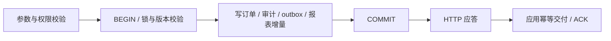
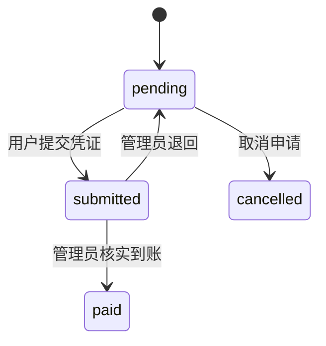

# 支付事务、异常矩阵与恢复协议

2026-10-03。适用于独立 mx-pay；现有 Hub 同库充值继续按原路径运行。

本文把「已实现并有测试」「已有设计但未实现」「必须在目标环境验收」分开。实现依据为 `server/service.mjs`、`src/index.mjs`、迁移 `pay_001`–`pay_004`、服务端 SDK 和对应测试。总体业务边界见 [支付中心架构](../../../mx-insight-hub/docs/architecture/payment-center-service-boundaries-and-reliability.md)。支付宝当前能力与验收边界见[多渠道接入](alipay-channels.md)。这不是已经完成生产资金安全或高可用验收的声明。

## 1. 成功条件与不可破坏的约束

对客户，一笔充值完成的条件是：**真实收款成立、支付事实持久化、对应业务钱包恰好增加一次，而且金额、币种、租户、环境全部一致。**浏览器跳转、提交凭证、HTTP 200、消息已送达，都不能单独证明上述条件成立。

分开记录三件事：

| 维度 | 权威方 | 含义 |
| --- | --- | --- |
| 付款是否成功 | mx-pay；依据渠道事实或授权人工核实 | 钱是否已收、金额/商户/流水是什么 |
| 本次 API 调用结果是否明确 | 调用方与 API 协议 | 请求未执行、已执行或结果暂不明；超时属于此维度 |
| 业务是否已交付 | 应用自己的账本/inbox | 充值已入账、订阅已开通，或仍在处理/异常处理中 |

必须长期保持的约束：

1. 金额用整数最小货币单位，币种明确；不得用浮点金额或从报表合计反推应付金额。
2. 应用/环境/业务单、支付单、渠道流水、事件身份和业务入账身份可追溯；test 不得增加 live 钱包或权益。
3. 同一请求身份和参数只产生一次业务效果；同一请求身份换参数拒绝。重试保留原身份，不换订单来“试一下”。
4. 同一渠道、收款账户、环境的真实流水不能归给两笔支付；该收款账户的稳定标识不能因改显示名称而重建。
5. 确认付款时，支付状态、收款证据、审计、付款 outbox 与报表增量在同一个本地事务内提交。任何必需写入失败，整笔本地事务回滚。
6. 已确认付款不能因为通知失败、业务停机、客户端断线而改成失败。退款、冲正和对账调整追加关联事实，不删除原付款。
7. 业务接收方必须在自己的事务内完成去重、业务账本写入和交付证据持久化，之后才能 ACK。ACK 丢失允许重送，但不能重复入账。
8. 未知结果不是明确失败。结果未查清前，禁止换渠道/商户重发、解除退款占用、要求客户再次付款或以 TTL 擅自结案。
9. 数据库、报表、缓存不可用时不得回退到内存记账；恢复不是挑选一份“能打开”的备份。
10. 对无法归类的新异常，默认停止该笔自动资金动作、保留证据并进入查证，不自动归为失败或成功。

第 5 条在独立服务已实现。第 7 条是应用接入的强制契约；**独立 mx-pay 到 Hub 原钱包的消费适配现已实现并通过临时双库测试**，不能拿报表同步替代它。默认仍保留原内嵌同库充值；测试或无正式历史的新接入可审核启用，存量交接及生产部署尚未执行。

## 2. 事务边界

### 2.1 现有人工收款路径

| 本地事务 | 加锁/唯一性 | 必须一起提交的内容 |
| --- | --- | --- |
| 建支付单 | 请求范围事务 advisory lock；应用/环境/请求键与业务单双唯一约束 | 订单、下单审计、报表增量 |
| 提交、退回、取消 | 支付单事务 advisory lock、expectedRevision | 状态、版本、操作审计、报表增量 |
| 确认付款 | 同上，加渠道流水唯一约束 | paid 状态、settlement、审计、payment.paid outbox、报表增量 |
| 业务 ACK | 事件事务锁与行锁；原回执比对 | ACK 时间、稳定业务回执及调用凭据身份 |
| 报表消费 | 消费端 stream 行锁与版本比较 | revision 保护的订单投影及 checkpoint；与钱包无关 |

短事务内不调用 Hub、Launcher、支付机构、邮件或财务系统。进程重启后的正确性来自数据库中的身份、约束与证据，不依赖进程内互斥锁。

一般写事务使用 PostgreSQL 默认 Read Committed，特定对象的竞争通过明确锁和唯一约束处理；报表分页使用 Repeatable Read 读取一致的页与水位。不能用“所有地方加事务”或“一律 Serializable”代替具体竞争对象分析。[PostgreSQL 16 事务隔离](https://www.postgresql.org/docs/16/transaction-iso.html)

### 2.2 提交窗口

- A/B/C 明确失败且事务未提交：回滚本地变化；不得输出成功。
- D 已发出但数据库响应丢失：调用结果未知；先按原业务单/支付单查询或以完全相同请求重试。
- D 已成功而 E 丢失：真实付款事实已经成立，调用方仍只能显示确认中；不能根据断线撤销事实。
- E 完成而 F 失败：付款仍为 paid，业务显示待交付/异常处理中；重试业务消费，不重做付款。

现在 `atomic()` 对 COMMIT 阶段的异常返回 `payment_outcome_unknown`，SDK 对写请求的传输/应答解析异常也返回未知。**未知目前是调用结果分类，不是新增的订单数据库状态。**实际订单仍应从权威库查回。

### 2.3 官方渠道现状与后续跨库业务交付

支付宝 page-pay 现已实现：先提交本地单，再本地签名收银台链接，没有服务端远程创建扣款的请求；通知验签后与主动查单统一核验，在同一事务提交付款与不可变观察记录后应答。观察记录仅包含核验字段及报文哈希，并非完整原始签名报文。独立 Hub 钱包消费者现已实现；远程写入型渠道的 attempt、退款执行和自动案件解决尚未实现。进一步的目标协议：

1. 本地事务保存稳定渠道请求身份和待执行 attempt，提交后才发渠道网络请求。
2. 请求可能已经到达渠道时，用原渠道订单号查单；只有证明未执行且渠道协议允许，才以原身份重试。不同渠道的幂等保证逐个验收。
3. 渠道通知先验签并核对环境、商户、订单、金额/币种；持久化原始通知 inbox 及处理状态。重复/乱序通知通过持久唯一身份和状态约束处理。
4. 只有所需记录可靠提交后，才按渠道协议应答接收成功。接收成功表示已可靠接收；不等于已完成钱包交付。
5. 业务消费端核对 app/environment/paymentId/businessOrderId/customerRef/金额/币种；在同一事务插入 inbox、增加原钱包、记录稳定业务流水。对异步权益，先持久化不可丢失的交付任务，另报最终结果。
6. 业务回执 ACK 发生在上述事务之后。重复事件通过已有 inbox 返回同一业务流水；不得再加余额。

不尝试让支付数据库、业务数据库和支付机构参加一个长分布式事务。外部资金动作不能由 SQL ROLLBACK 撤销；资金已移动时的纠正是单独、授权、有证据的退款/调整流程。

## 3. 当前状态机与待补状态

现有人工支付状态机：

paid/cancelled 为当前独立支付单的终态，禁止直接重写；提交凭证不等于收款成功。已展示的静态收款码不随取消失效，所以 cancelled 只说明当前申请被取消，**不证明外部不可能继续收到钱**。

后续扩展分轴建模，不把所有失败堆进一个 `failed` 字段：

| 对象 | 拟增加状态/结果 | 关键约束 |
| --- | --- | --- |
| 渠道尝试 attempt | prepared / sending / processing / succeeded / failed_confirmed / unknown | unknown 只能查证，不盲目重发 |
| 来款事实与分配 | unmatched / allocated / exception | 已收但不匹配订单的钱也必须有记录；分配不能重复 |
| 业务交付 | pending / processing / delivered / blocked | paid 不随此状态下降；blocked 需要明确处置 |
| 异常案件 | open / investigating / awaiting_evidence / resolved | 金额、源证据、负责人、原因、处置关联不可丢 |
| 退款 | requested / reserved / processing / succeeded / failed_confirmed / unknown | 在途与未知退款一直占用可退额度 |

失败的渠道 attempt 不一定使支付单最终失败。订单关闭/过期需按渠道能力确认，并与迟到付款协调；不能仅按本机超时清理订单或释放资金占用。

## 4. 异常矩阵

标记：**已做** = 当前代码已有保护；**部分** = 能阻止错误写入，后续处置尚不完整；**待做** = 只设计、没有该能力；**环境验收** = 必须在真实预发布拓扑验证。具体测试引用见第 8 节。

### 4.1 申请与本地交易

| 编号 | 异常 | 正确结果与恢复动作 | 当前状态 |
| --- | --- | --- | --- |
| O01 | 应用尚未持久化业务单就调用支付，随后应用崩溃 | 禁止该调用顺序；用业务持久单与稳定意图重试/查回 | 应用独立接入待做 |
| O02 | 金额非法、请求字段/身份/环境不符、权限不足 | 写入前拒绝，不猜金额/租户、不扩权限 | 已做 |
| O03 | 双击/代理重试，同键同参 | 返回同一支付单或当前状态，不重复效果 | 已做；F02/F04 |
| O04 | 同键改金额/动作，同业务单换新请求键 | 返回冲突；查原单，不能新建第二笔以绕过 | 已做；F04/F07 |
| O05 | 订单插入后审计/后续写入失败 | 本地整笔回滚，无孤立订单/报表事实 | 已做；F01 |
| O06 | COMMIT 成功但应答丢失 | 保持未知语义，按原单查回；原键重试不重复创建 | 已做；F02 |
| O07 | 连接池满、锁等待/语句超时、死锁 | 有界失败/回滚，调用者保留原身份重试；不得改为未付款结论 | 超时/回滚已做；容量和死锁实测待补 |
| O08 | 用户刷新/关闭页面或登录会话失效 | 不取消付款事实；重新鉴权后查原单 | 服务端独立事实已做；独立收银台待做 |
| O09 | 报价/优惠修改后复用原支付单 | 原应收不可变；新报价由应用明确新建业务意图，旧单依关闭规则处置 | 应收保护已做；报价快照/关闭协调待做 |

### 4.2 人工收款与资金事实

| 编号 | 异常 | 正确结果与恢复动作 | 当前状态 |
| --- | --- | --- | --- |
| P01 | 用户点“已付款”但实际没付、上传伪凭证 | 只能 submitted；独立核实后才 paid | 已做；不等于已自动核验渠道 |
| P02 | 两人同时确认，或确认与退回竞争 | 按同一支付单串行，版本失配返回冲突；只提交一套匹配副作用 | 已做；F06 |
| P03 | 一条渠道流水被不同订单/应用同时认领 | 数据库商户范围唯一约束；仅一单成功，另一单保持原状态 | 已做；F07 |
| P04 | paid/audit/outbox 任一步写入失败 | 一起回滚，不能有 paid 无可交付事件 | 已做；F03 |
| P05 | 确认已提交，API/浏览器断线 | 查回 paid；同请求重放返回已有事实 | 已做；F04/F05 |
| P06 | 少付、多付、同单分多次付款 | 不把差额强行确认为应付；保存真实来款与分配，转差异案件 | 部分：现仅拒绝金额不符；来款/差异案件待做 |
| P07 | 已取消/将来已过期的单收到迟到款 | 保留取消事实和真实来款，进入待认领/异常处置；不得静默丢弃或自动复活权益 | 待做；当前静态码的重要缺口 |
| P08 | 用户重复付两笔不同流水 | 两笔外部来款都保留；业务只交付一次，额外来款走核对/退款 | 部分：原单不重复 paid；额外来款登记待做 |
| P09 | 找不到订单、付错商户/币种、租户归属不明 | 不凭相似金额/姓名自动匹配；保留受控证据待认领 | 待做；现行依赖人工线下核对 |
| P10 | 收款码关闭/更换后仍有人用旧码付款 | 新单按当前开关，已产生的真实来款继续核对；保留原商户/码版本证据 | 下单开关/订单快照已做；统一来款处置待做 |
| P11 | 管理员误确认或凭据被滥用 | 不删 paid；冻结相关后续业务，查证并走授权调整/退款，保留复核证据 | 部分：paid 不可改；人类身份、双人复核/调整案件待做 |
| P12 | 先收到款，很久后才新建订单申请认领 | 以真实渠道到账时间核对，不能为了通过校验伪造时间 | 部分：当前到账时间不能早于下单超过五分钟，这类认领须走待补案件流程 |

当前人工确认使用独立 `receipts.confirm` 机器凭据，审计 actor 是 credential ID。SQL 约束证明的是记录一致性，不能证明该管理员真的看过支付宝账单；将来的人类操作需要可信身份、复核权限和渠道证据，不能接受应用任意填写一个用户名就当作审计证明。

### 4.3 渠道、业务交付、报表与恢复

| 编号 | 异常 | 正确结果与恢复动作 | 当前状态 |
| --- | --- | --- | --- |
| C01 | 调用渠道前网络不可用，能证明尚未发送 | 原 attempt 有界退避，不新建资金身份 | page-pay 只在本地签名；远程写入型渠道仍待做 |
| C02 | 请求已发出，超时/连接中断/响应无法解析 | 保留未知结果，原渠道号查单；不能切渠道再收一次 | 支付宝查单错误不改状态；其他远程写入 attempt 待做 |
| C03 | 通知重复、乱序、比前端返回更早 | 持久去重、验签、身份核对、单调状态；前端不决定 paid | 支付宝已做；paid/audit/outbox/观察记录同事务 |
| C04 | 验签失败、商户/环境/金额不符、伪造重放 | 不产生资金成功；受控留证及告警；不同渠道按自己的验签契约验收 | 支付宝拒绝无效签名/身份；有效但异常的订单/金额留 review；自动告警与案件解决待做 |
| C05 | 已收款但回调丢失/长期不来 | 主动查单与渠道账单对账补证据；不能因回调少一条就判未付 | 已提供支付宝有界主动查单；定时补单与日账单对账待做 |
| D01 | 应用离线/网络分区 | paid/outbox 保留，其他应用照常；应用恢复后补交付 | outbox 与 Hub 消费适配已做；跨服务 HTTP + 两个临时 PG 已测 |
| D02 | 应用入账过程中失败 | inbox、钱包和业务流水一起回滚；事件不 ACK | Hub inbox + 原钱包 ledger + 交付审计同事务已做；晚期 SQL 故障回滚已测 |
| D03 | 应用已入账但 ACK 丢失 | 重送事件命中 inbox，返回同一业务流水；再次 ACK 不再加钱 | Hub inbox 稳定回执、ACK 丢失/重启/并发重放已测 |
| D04 | 金额/客户/业务单不匹配，租户停用或业务单缺失 | 保持 paid，交付 blocked，隔离该笔；不自动换租户、恢复权限或吞事件 | Hub 归属/金额校验与持久异常记录、隔离重试已做 |
| D05 | 某个异常事件长期失败 | 保留事件、告警和隔离处置；其他事件可继续；人工重投仍用原事件 ID | SDK 可跳过本轮失败项；持久重试/案件/监控待做 |
| D06 | 消费者将分页 after 当永久进度或提前 ACK | 禁止；after 仅本轮扫描，下一轮从未 ACK 首页再扫，覆盖晚提交和失败项 | 当前 SDK/文档已约束；接入验收必测 |
| R01 | 报表库离线、追赶未完成、重复页/多副本抢写 | 不影响付款；本地投影+checkpoint 原子提交，保留原进度，明确 provisional/stale | 已做，独立双库测试通过 |
| R02 | 换支付源、回退到较旧数据库、同版本内容冲突 | 暂停该页自动推进并保留证据，不自动清空重建 | 源 UUID/水位/版本保护已做；同 UUID 分叉仍需对账 |
| I01 | API 在事务前/中/后被杀或滚更 | 未提交回滚；已提交可查；不确定的调用按原单恢复 | 事务测试/排空代码已做；真实节点故障/滚更待验收 |
| I02 | 支付库不可写、磁盘满、只读、连接断开 | 不伪报成功、不切内存；恢复后查询原身份与对账 | 代码失败路径已做；基础设施故障注入待验收 |
| I03 | HA 晋升丢了已确认事务或出现双主 | 禁止自动开放资金写入；隔离旧主，核对渠道/业务账，确认权威数据 | 专用单 PG 目前不具备该 HA 能力 |
| I04 | 主机重启挂错盘/挂载丢失/选中旧备份 | 拒绝普通启动/部署自动另找数据，不新建空库 | 卷/磁盘/PG 身份保护已做；同身份旧备份新鲜度靠对账 |
| I05 | 迁移失败、rollout 超时或程序回退 | 停止继续发布，保留原资金数据；回退兼容程序，不回退业务数据库 | 脚本保护已做；真实生产演练待验收 |

## 5. 退款必须单独设计

当前没有退款执行 API。以后实现时至少覆盖：

- 应用先原子冻结可退实付余额/权益，并保存稳定退款业务单；不得先调用退款再试图扣钱包。
- 支付中心锁定原付款，校验 `已退款 + 在途退款 + 未知退款 + 本次申请 <= 已确认可退实付`。赠送额度、折扣原价不能算进可退现金。
- 并发部分退款、重复请求、应用冻结后请求丢失，都通过原退款身份查回；不能重建第二笔退款。
- 渠道退款结果未知时继续保留两端占用；查询、告警时间上限只触发查证升级，不能自动释放钱。
- 渠道明确成功后，本地结果、退款流水、退款事件一起提交；应用依事件幂等冲正。冲正失败时显示“退款成功，业务调整待完成”，不能再退款一次。
- 明确未执行/失败/安全撤销后才释放冻结；释放本身也需幂等与持久事件。
- 原路退回失败、商户余额不足、重复渠道退款、拒付/争议、发票需红冲等，进入独立案件，不篡改原付款来凑账。

## 6. 错误分类与调用方动作

| 分类 | 例子 | 调用方动作 |
| --- | --- | --- |
| 输入/权限拒绝 | 400/401/403 | 修正输入或授权；不自动扩大权限、不换租户重试 |
| 业务并发冲突 | revision/state/idempotency/receipt conflict | 查询原单及原操作；原身份含义不能改，确需新动作时由操作者明确发起 |
| 服务暂不可用 | 连接/锁/查询/资源失败 | 保留身份，有界退避并查询；单凭错误应答不能推断账户中没收钱 |
| 结果未知 | 写超时、COMMIT 应答丢失 | 显示核实中，按原身份查回；不自动宣布失败、再付款或解除冻结 |
| 财务差异 | 多付、少付、错付、迟到付款 | 建异常案件，保存真实来款；受权限控制的处置 |

当前只有前四类的部分 API/SDK 机制。`payment_outcome_unknown` 与 `payment_unavailable` 不是退款、取消或未付款的证明。对同键重试，当前服务可能返回订单的**最新状态**，不是原应答的字节级副本；幂等保证的是业务效果不重复。

## 7. 对账、持久性与恢复放行

正确性需要三类证据核对：渠道真实收退款、mx-pay 资金事实、应用业务入账/冲正。报表是查询投影，不能替任意一方创造事实。每日对账和按需对账至少识别：渠道有款本地无单、本地 paid 无渠道证据、已付未交付、重复业务入账、退款金额/状态不一致、手续费/结算差异。

支付数据库必须核验 fsync、WAL、同步提交和备份策略；不能为提速关闭同步提交却仍承诺成功应答后绝不丢记录。PostgreSQL 的异步提交允许故障后丢失最近已返回成功的事务。[PG16 异步提交说明](https://www.postgresql.org/docs/16/wal-async-commit.html)

本地事务持久化也不等于跨机器 RPO=0。主备复制与晋升策略必须明确同步持久化边界、仲裁和旧主隔离；当前一个 PG StatefulSet 加两个 API 副本不构成数据库 HA。[PG16 主备与同步复制](https://www.postgresql.org/docs/16/warm-standby.html)

恢复时先停止自动资金写入，保留所有候选数据，确认磁盘/卷/PG/source 身份和恢复点；完成渠道与应用账核对、识别 unknown/未交付/在途退款，再按明确权威源恢复。禁止把本地状态回到昨天就视作渠道的钱也回到了昨天。普通 deploy/restart 不执行恢复。

待补的业务维护开关应分别控制新建单、收款核实、渠道任务认领和退款受理；已提交事实查询、必要回调留证与查证能力按维护原因保留。现有脚本 stop 仅停止进程，不是业务维护协议。

## 8. 测试证据与尚缺验证

现有测试映射：

| 证据 | 覆盖 |
| --- | --- |
| `tests/core.test.mjs` | 金额、状态、版本、核实权限、提交不等于付款 |
| `tests/service.test.mjs` | 并发幂等、重复流水、审计失败回滚、ACK 丢失、环境/权限隔离、迁移校验和与排空 |
| `tests/client.test.mjs` | 写响应丢失返回 unknown、不隐式重发、业务提交失败不 ACK |
| `tests/alipay.test.mjs` | 官方 SDK 签名/验签、重复与乱序通知、金额/身份错误、通知事务回滚/提交应答丢失、人工/官方流水重复、查询失败与竞争、最小权限和独立报表库 |
| `tests/transaction-faults.test.mjs` F01–F07 | 真实 PG 的语句执行后注入错误，验证 COMMIT 及 HTTP 应答丢失、outbox 写后失败、并发动作与跨应用流水竞争 |
| `tests/reporting.test.mjs` 与 Hub `payment-reporting.test.mjs` | 已提交游标、回滚、存量重放、多消费者、双库投影、checkpoint 原子性和恢复保护 |
| `tests/deploy.test.mjs` / `bootstrap-postgres.test.mjs` | 命令替身部署顺序/身份保护，以及真实 PG 初始化、权限、归档恢复 |

F01–F07 的故障是可重复的软件注入，**没有真的断网、拔盘、杀工作节点或切换 PostgreSQL 主库**。这些环境级故障需要预发布演练。测试覆盖按业务断言验收：金额守恒、记录唯一、关联完整、未提交无残留、已提交可恢复，而不是只看接口是否返回了预期错误码。

2026-10-03 本地临时 PostgreSQL 16 验证：F01–F07 阶段 33 项通过，加入支付宝后支付全套 **47 项通过、0 失败、0 跳过**（包括 UTC 时区）；Hub 31 项兼容回归通过。没有改写原已发布迁移、启用正式收款或连接生产库。

随后与 Java 后端/官方 SDK 对照修正后，最新支付全套 **51/51**、Hub **31/31**，均无跳过。新增证据包括官方 SDK 真实 HTTP 验签、新旧渠道编号精确关联、历史 schema 升级、特殊资金状态拦截与绝对付款窗口。部署替身验证先完成兼容副本替换再恢复官方新收款；相关限制见[核对与升级记录](alipay-java-reference-review.md)。

每个新渠道、新退款动作、新交付类型上线前，必须补齐：发送前/发送中/对端已执行/本地提交前后/应答丢失各断点，重复与乱序输入，并发相反动作，重启恢复，身份/金额错误，依赖离线和恢复后的重复执行。无法定义恢复动作的异常，不以泛化 `catch` 作为闭环。

## 9. 下一阶段顺序与上线门槛

1. **人工收款先补异常资金入口**：不可变来款记录、明确订单分配、取消后到账/多付少付/重复来款案件、人类操作与复核审计。当前 API 拒绝错误确认只是保护，不代表这些钱已经有了完整去向。
2. **存量 Hub 支付交接**：独立 inbox + 原钱包事务 + 稳定回执和异常重试已实现，见 [交付说明](../../../mx-insight-hub/docs/operations/payment-delivery.md)。继续补存量渠道流水与历史交付迁移、联合恢复核对和上线演练；不能让旧新两库同时认领同一实款账户。
3. **对账与运维闭环**：最老未交付时间、unknown 年龄、异常金额与件数、失败重试/人工负责人、备份恢复演练。重试预算耗尽只升级异常，不丢弃资金事实。
4. **完善官方渠道与退款**：支付宝 page-pay/通知/主动查单已加入；仍须补关单、定时补单、日账单、案件解决及其他渠道契约。退款冻结、占用、未知结果、冲正与票据联动单独建设。
5. **真实部署放行**：数据库持久性参数、双节点滚更、故障恢复和三方对账有证据后，才给出可用性/RPO/RTO 和正式资金上限。

对“所有失败都考虑到位”的验收方式是：每条已支持资金路径都有确定的事实归属、失败分类、重试身份、补偿边界、人工出口与可复现实验；新发现的场景补入矩阵和回归。当前不能宣称全渠道、退款及全部生产故障已经覆盖。
