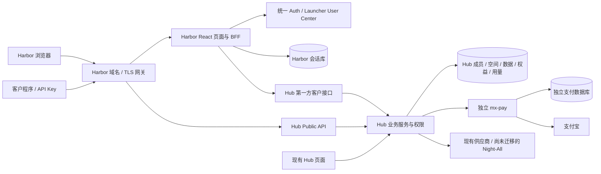
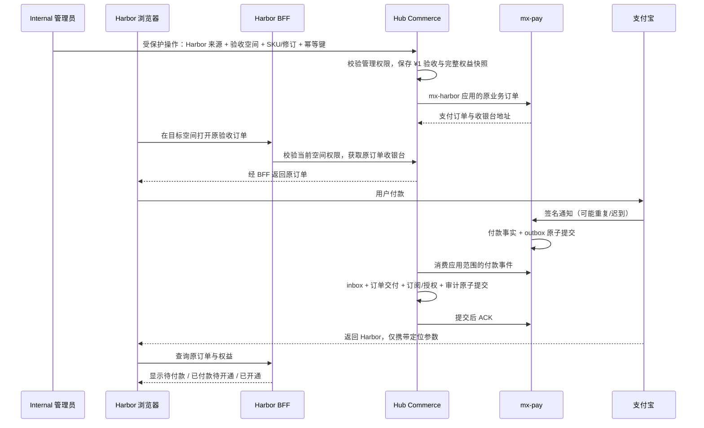

# MX Harbor 全局架构与实施计划

日期：2026-10-11。本文保留完整目标架构。第一批已实现 UI、邀请准入、SSO、受限客户读取与部署工具，实际状态见 [实施与部署说明](implementation-and-operations.md)。支付、查询与商业上线闭环仍未完成；没有生产部署。

## 1. 产品定位与决定

建议项目名 `mx-harbor`，放在 `electron-dock/mx-harbor`；对外品牌为「数港 Data Harbor」，DataPort 作为当前设计原型的名称。最终展示名和域名可通过 Harbor 自己的发布配置确定，不用改业务 ID。

Harbor 是 Hub 面向客户的独立产品入口：独立页面、域名、发布和回滚，使用同一套业务数据与权限。Hub 保留自己的界面和管理能力。首期不复制 Hub 后端、不把 Harbor 当 Launcher demo、不建立第二套账号或支付账本。

核心决定：

1. 从 `/tmp/dataport` 抽取 Harbor 设计组件与页面布局，再接真实业务。类似 Neon Void 的「组件库 + 独立演示页」，但不修改 Neon Void 本身。
2. 前端采用 Hub 已使用的 React + Vite，后端采用现有 Node.js ESM 与 mx-common；保留原型需要的 Tailwind/无样式交互组件。Luopan 的 Quasar 和 H2I 的 Electron 不是 Harbor 的运行依赖。
3. Harbor 用独立 Auth client、audience、会话 Cookie 和会话库。密码、账号创建和账户安全仍归 Launcher User Center。
4. Hub 新增受限的第一方客户接口，服务 Harbor BFF（浏览器后端），复用 Hub 的成员、租户、文档过滤、商品、权限、计量和交付事务。
5. 外部机器调用使用 Harbor 域名下的原 `/api/v1/...` 数据合同，经受限网关到 Hub Public API；不经人的 SSO 校验，不增加第二次计费。
6. Harbor 订单走独立 `mx-pay` 应用标识与返回目标，业务权益仍由 Hub Commerce 发放；这需要增量改造，不是仅增加 Nginx 域名。
7. 首个真实闭环是「邀请/管理员开通 → Harbor 登录 → 管理员创建 ¥1 IP 画像验收订单 → 支付中心收款 → 原子发放完整年度权益 → 页面查询和 Harbor API 调用」。其余客户能力按合同逐项接入。

用户已确认以下业务要求，生产开启与付款仍需完成后续闭环验收：

- **所有账号首次进入 Harbor 都需要邀请或管理员开通**。已有 MX 账号不另注册，但不能通过先在开放的 Hub 注册来绕过 Harbor 准入。
- **¥1 仅用于管理员付款验收，沿用完整年度权益**。不新增面向普通客户的 ¥1 试用 SKU、不改变正式商品售价；普通用户只能支付管理员为其目标空间创建的验收订单，不能自行指定验收价。

## 2. 已核实能力与缺口

| 部分 | 源码/当前文档证据 | 对 Harbor 的影响 |
| --- | --- | --- |
| 原型 | `/tmp/dataport` 是 Next.js App Router + React + Tailwind，含自有 PostgreSQL 账号/订单；README 明确真实支付、数据源未接通 | 复用视觉与交互，不迁入原型账号、模拟数据或 pending_config 支付实现 |
| 原型实际页面 | 首页 IP 输入、`/pricing`、控制台新建查询、侧栏账户上拉菜单；最新原型已隐藏数据商城入口 | 首批保留这些已确认页面；新增 Hub 能力沿用该设计语言，不能声称原型已有对应页面 |
| Hub 技术栈 | `mx-insight-hub/package.json`：React 19、Vite、Node >=22.18、pg、mx-common、mx-pay | 无需因视觉原型重建 Next.js 业务后台，也无需迁为 Quasar |
| 设计库模式 | Neon Void 源码在 `mx-launcher/ui-design`，`demos/ui-design-neon-void` 是展示入口 | Harbor 建独立设计包和 gallery，避免给 Hub 注入蓝色主题/CSS |
| 共用 SSO | `mx-common/src/identity/sso.mjs` 已实现 OIDC、PKCE/state/nonce、原生账号页、加密会话与 CSRF | 可以做与图 4 类似、完全属于 Harbor 样式的登录界面 |
| 注册策略 | Launcher `registration/repository.ts` 只有默认 mode + 特例 `hubMode`；Hub 注册的新账号默认拒绝 H2I/Luopan | 需要按可信应用扩展策略，保留原 Hub 特例的升级兼容和旧网络准入 |
| 邀请码 | 已有 `appGrant` 控制注册后应用授权；并非对注册来源应用的完整限制 | 需要增加独立的邀请码可兑换应用约束，不能把 appGrant 当作来源验证 |
| 身份关联 | Hub 绑定包含 issuer + subject + audience；SSO provision 还关联 OIDC clientId | 新 Harbor audience 需要显式绑定到原 member，不能直接 JIT 创建另一份成员和空间 |
| 客户权限 | Hub 本地 membership、consumer、Key 交集、产品作用域和受保护文档已存在 | 复用服务器判断，前端菜单不能代替接口鉴权 |
| 客户/管理路由 | 商城、账单、文档等仍在 `/internal/v1/admin/...`；Hub Public listener 拒绝这些路由及 `/auth/sso` | 不把整个 Admin listener 代理给 Harbor；增加客户专用 adapter |
| IP 商品 | 当前年度种子 ¥33,999 / 12 个月 / 100,000 次，空间共享；当前 ¥1 acceptance 发放同商品完整权益 | 直接复用管理员验收价；原型三档价格不能直接作为正式价格 |
| Hub → Pay | 支付来源按 test/live 一环境一条；已激活来源不可直接覆盖 | 需要支持多个业务入口的支付绑定，保留 Hub 原绑定与订单 |
| Pay 返回地址 | returnUrl 在渠道配置；同环境同支付宝 APPID 不允许复制为多个渠道 | 不能复制一个同 APPID 渠道只为了换 returnUrl；需要应用/订单级返回目标 |
| Night-All | Hub 部分操作已接管，其他形状仍可能通过 Night-All；历史 docs 中存在已被后续实施替代的结论 | Harbor 只接稳定 Hub 合同，Night-All 迁移继续在 Hub 内分批完成 |

上述是当前工作区能力，不等同于这些版本已全部部署到线上。用户截图证明了界面与需求背景，无法单独证明全部后端合同或支付环境已就绪。

## 3. 运行拓扑与数据归属



| 所有者 | 保存和执行 | 不复制的内容 |
| --- | --- | --- |
| Launcher/Auth | 账号凭据、统一用户、可信应用登记、注册策略、应用准入、注册邀请、账号安全审计 | 不发产品订阅，不判断收款，不改数据权限 |
| Harbor | 品牌、页面、路由、BFF、自己的加密浏览器会话及最少展示配置 | 不存密码，不直读 Hub DB，不建商品/余额/权益第二真相 |
| Hub | member、tenant、consumer、Key、目录、文档授权、数据、订单、订阅、用量与业务交付 | 不持有支付宝商户私钥，不把外观变更传播到旧 Hub |
| mx-pay | 支付应用凭据、渠道、支付订单、支付事实、验签、事件 outbox 和支付审计 | 不写 Hub 钱包或订阅，不从浏览器返回判定到账 |
| mx-common | 可复用 SSO/PG/迁移基础，以及现有共享基础设施 | 不成为新的身份服务或商业规则中心 |

Harbor 会话库可由 mx-common 在共享 PostgreSQL 上分配**独立 database/role**。这提供权限与迁移边界，不表示物理高可用隔离。Hub 原库保持唯一业务写者；Pay 继续使用它自己的独立数据库。

Harbor 与 Hub 独立发布，但共享业务服务仍意味着存在共同故障域。Harbor BFF 故障不应让 Hub 失效；Hub 数据面故障时 Harbor 不能假装仍可查询。Pay 暂停时保留订单与“支付/交付处理中”状态，已购产品调用不依赖 Pay 在线。

## 4. 设计抽取和技术落地

拟议目录（除本文档外尚未创建）：

```text
electron-dock/mx-harbor/
  apps/web/                 React + TypeScript + Vite 页面
  apps/server/              Node ESM BFF、SSO 与客户接口适配
  ui-design/                @qpjoy/ui-design-harbor
  demos/ui-design-harbor/    纯 UI gallery，无真实账号/付款/数据依赖
  packages/hub-client/      客户合同、请求层、错误与分页类型
  migrations/              仅 Harbor 会话和自身元数据
  deploy/k8s/               Harbor 独立工作负载和最小 Secret
  scripts/manage.sh         未来 dev/build/deploy/status 合同
  docs/                    设计、接口矩阵、上线验收记录
```

首期沿用已安装/锁定的依赖版本完成兼容验证，不在复刻视觉时顺便升级 Hub 或全仓工具链。静态官网可预渲染；不为首期账户工作台引入第二套 SSR 业务系统。

抽取顺序：

1. 固定 `/tmp/dataport` 文件哈希、页面截图、视口、字体和素材清单，作为设计基线；其历史技术约束与旧计价是参考材料，不覆盖本轮用户要求。
2. 提取颜色、字体、间距、圆角、阴影、表格密度、浅蓝渐变和网格。保留主色 `#165DFF`；Harbor 样式限定在独立应用/根容器，不改 Neon Void token。
3. 抽取 Button/Input/Dialog/Tabs/Table/Pagination/Badge，以及 PublicHeader、Sidebar、SidebarAccountMenu、IP 查询框、风险资料/标签、订阅卡、订单摘要、Cookie 卡片等实际用到的组件。无需先搬全部 UI 文件。
4. 把组件中的请求、登录状态、金额计算、付费动作移出，改为 props/events。路由/图片等 Next 专属依赖由 Harbor 路由和静态资源适配，不能把原型 route handler 带入生产。
5. 将授权、租户切换、请求幂等、错误状态放在业务层。长久可共享的是业务合同和无主题逻辑，不复制 Hub 的大页面，也不强迫 Hub 改成 Harbor 组件。
6. 受保护文档从 Hub 同一合同源生成 Harbor 主题的内容模型和示例；过滤先在 Hub 完成。避免直接嵌入带 Hub 导航/域名/CSS 的完整 HTML，也不手工维护第二份接口正文。

三份对照可同时运行：原版 DataPort（其既有开发端口 4277）、Harbor UI gallery、真实合同驱动的 Harbor 测试实例。后两者在实施时分配空闲端口。原版若需登录则使用隔离数据库/演示配置，不接生产；如果原版无法启动，以固定截图加纯 UI fixture 对照，不伪称已启动。

视觉验收至少覆盖桌面 1440×1000、短屏 1100×650、手机 390×844，以及空数据、长文本、加载、无权限、查询失败、支付未完成、菜单上拉与移动侧栏。已有页面比较几何布局/字体/颜色/交互；新增功能用同一组件语言设计，商品价格与状态以 Hub 真实合同为准。

## 5. 统一账号、应用策略与准入

### 5.1 Harbor 原生账号页

在 Internal「统一认证 → 接入应用」登记 `appId=mx-harbor`，使用独立 clientId、audience、clientSecret、sessionKey 和固定回调。Harbor BFF 使用 `@qpjoy/mx-common/identity/sso` 及 PostgreSQL 会话适配器。原生页面通过现有 application surface 协议访问 `/auth/sso/form`、`/auth/sso/account`、interaction/callback 等流程。

客户端只持 Harbor 的 Secure/HttpOnly Cookie，账户服务和应用密钥在后端。不同域名不共享 Cookie；跨应用免重复登录由 Auth 会话完成。Harbor 用户建立在原 User Center 中，因此在 Launcher 用户中心可见，无需同步两份用户库。

沿用现有 SDK 的故障语义：Auth 明确失效时拒绝；服务故障时返回暂不可验证并保留应用会话；不能自行改为离线放行。机器 API Key 的数据调用保持独立于人的 SSO 可用性。

OIDC 回调、issuer、audience 与 subject 要按协议校验；不能把其他应用的 ID Token 当成 Harbor 登录凭据。[OpenID Connect Core](https://openid.net/specs/openid-connect-core-1_0.html#IDTokenValidation)

### 5.2 按应用扩展，保留旧行为

拟议策略按受信任登记的 appId（并约束 clientId/origin）保存，而不是依赖浏览器传 `platform=harbor`：

| 应用 | 新账号注册 | Harbor 类应用准入 | 身份入口 |
| --- | --- | --- | --- |
| Hub | 保持当前独立 open 设置 | 保留现状 | 保持账号密码、飞书等现有能力 |
| Harbor | 初始 closed；管理员准备后切 invite_code，或管理员开户 | invited / explicitly_granted，适用于所有账号 | 账号密码；不展示也不允许本应用发起飞书注册/绑定流程 |
| Launcher | 保持当前默认策略 | 原管理权限 | 原逻辑 |
| MX-H2I / Luopan | 原 SDK/飞书/业务入口 | 原 appAccess 与网络策略 | 原逻辑 |

新增应用策略映射，例如 `applicationPolicies[appId]`，包含 registrationMode、可用身份方式和 admissionMode；具体持久化沿用现有版本化策略记录。保留 `hubMode` 读写兼容、旧客户端省略字段不覆盖新值、同一策略版本冲突检测。迁移把**已保存**的 Hub 设置映射到新模型，不猜测生产默认值，不自动开放 Harbor。

现有默认 `closed` 是统一新注册总关闭，应保留这个语义并在管理界面标成“总暂停”。总暂停关闭新注册但不禁止已有账号登录；普通“某应用关闭注册”只影响该应用。常态可继续默认 invite_code、Hub open、Harbor invite_code，避免一刀切。新增策略必须覆盖原生账号页、托管 Auth 页、飞书入口/回调与签名注册通道，不能只隐藏按钮。

现有 MX 账号可能已经绑定飞书或通过另一个应用建立统一会话；默认不因历史身份来源注销该账号。Harbor 仍检查准入。若业务进一步要求每次 Harbor 登录都必须重新验密码，应作为明确的 step-up 策略单独实现。

### 5.3 注册邀请、应用准入与租户邀请是三件事

- **注册邀请**：允许建立统一账号。为 Harbor 新邀请码增加允许兑换的应用/client 范围、名额、有效期、撤销和用途；通过真实 Auth interaction 确定来源。现有 appGrant 保留为注册后的授权选项，不代替兑换范围。
- **Harbor 准入**：允许已有或新账号使用 Harbor。沿用 User Center 应用访问机制扩展显式授权，禁止以注册来源当作权限。新账号兑换邀请码与应用授权在账号写者事务中完成；已有账号兑换不再创建用户，幂等授予 Harbor 访问。
- **Hub 空间成员关系**：决定进入哪个 tenant 和拥有什么角色。不能因邀请码默认加入任意企业空间；创建个人空间或接受企业邀请走 Hub 的显式幂等流程。

现有 Web Auth 的部分准入仅检查 deniedAppIds；实现 Harbor 白名单准入时必须补到服务端，不能以 UI/AppCenter 已隐藏作为完成依据。推荐先只对 Harbor 启用“显式 grant 才可进入”，其他应用保持原判断。

避免“必须先开通才能登录、必须先登录才能兑换”的循环：在 Auth 的可信登录事务中先验证账号，再兑换 Harbor 邀请/核对已有授权，满足准入后才完成 Harbor 授权码流程。已在 Hub 登录的用户同样经过准入检查。未开通用户只可完成这段受限身份验证/邀请处理，不能取得 Hub 客户 principal 或 Harbor 业务会话。管理员预先开通的账号可直接完成登录。撤销 Harbor 准入后，旧会话也要在当前身份验证中受限，不能仅检查第一次登录。

新 Harbor 账号默认最小普通身份，沿用新 Hub 账号拒绝 H2I/Luopan 的创建默认；不批量回填历史用户。管理员开户也要显式选 Harbor 并应用同样默认，不能因从管理台创建而意外取得网络或平台管理员权限。之后管理员可按原机制独立授权 H2I/Luopan。

邀请码不附带订阅、钱包余额或无限 API 权限。复用一个邀请码在其他客户端注册、已过期/撤销兑换、并发最后名额、重复回调都要验证。邀请来源和审计可见，邀请码明文不进日志。

## 6. 同一个用户、同一个空间、同一份权益

不能简单让 Harbor 走当前 Hub `provision()`：它使用 `(canonical issuer, subject, audience)` 查原绑定。Harbor 的独立 audience 可能新建 member，随后新建空间，导致用户看不到原购买或产生两份余额。

新增 Hub 第一方应用接入边界：

1. 在 Hub 固定登记受信任的 Auth issuer、Harbor clientId/audience 与后端调用方；保留 Hub 原登记。
2. Harbor BFF 验证自己的登录流程，再通过受限内网客户接口携带其后端凭据及用户的 Auth access token。Hub 使用固定 Auth endpoint 获取已验证 UserInfo，校验稳定 subject、可信 canonical issuer、Harbor audience 与调用应用；不能接收浏览器自报 memberId/roles/scopes 作为身份。具体客户端绑定校验需在合同测试中确认，若现有协议缺少可核验字段，应补服务端验证合同而非放宽 audience。
3. 在 Hub 中增加显式、受审计的「统一身份 → 原 member」映射，绑定依据是已验证且属同一账号权威的稳定用户 ID。保留每个客户端的独立绑定。对现有唯一对应成员可幂等关联；历史冲突/多个候选必须停止自动绑定。禁止按邮箱、昵称、组织名或任意同名 subject 跨 issuer 合并。
4. 并发 Hub/Harbor 首次登录使用共同身份锁和唯一约束，避免各建一个 member；在批准的权威与应用集合内才允许共享映射。旧绑定不重写，不复活 suspended member/membership。
5. Harbor 客户 principal 每次读取 Hub 当前 membership 与权限。它不会获得 platformAdmin，也不会调用会同步/撤销 Hub 平台管理员授权的旧副作用路径。管理员用同一个账号进入 Harbor 时也只有实际所属空间的客户视角，不自动跨租户。
6. 个人空间复用已有 `iam.personal_accounts` 与开通逻辑；新空间的幂等创建不发 Key、余额或产品授权。确无空间时由现有个人开户规则/明确动作完成。

该客户接口验证是本次必须新增的合同，并非声称 mx-common 已提供跨应用业务 token exchange。优先直接验证原 Auth 凭据，不额外建设通用 STS 或永久“超级代理 token”。机器凭据只有有限客户操作权限，不能充当 Hub Admin Token；原 Auth access token 全程不进入浏览器/localStorage/日志。

业务共用的含义：同一 member 的同一 tenant 看到相同订单、余额、权益和授权，但记录仍受原 consumer/Key/tenant 范围限制。IP 历史目前按真实 Key 等范围过滤，Harbor 不自动扩大为全空间历史。跨入口自动选择同一唯一可用 Key，存在多个时明确选择，不制造另一把默认全能 Key。

新订单额外记可信入口来源 `salesChannel=harbor` 用于品牌、支付路由、审计与报表；它不构成新的 tenant，不成为授予数据权限的依据。

同一空间下跨入口的订单可按当前角色读取，但支付动作仍服从订单原应用/返回快照。Harbor 新建订单在 Harbor 完成付款闭环；已有 Hub 未完成订单在 Harbor 首期只读，继续由原入口处理，不为切换展示域名重写它的支付身份或返回地址。已付款权益在两个入口按相同授权使用。

## 7. 客户接口、权限和功能范围

建议新增 Hub 内部路由族 `/internal/v1/portal/...`，只允许受信任 Harbor BFF 调用；浏览器使用同源 `/bff/v1/...`。这些名称为提案，不是已有接口。

| Harbor 功能 | 权威和约束 | 首批安排 |
| --- | --- | --- |
| 登录、账户与邀请 | Auth 应用策略 + Harbor 准入；密码仍由 Auth 处理 | P1 |
| 空间/成员身份 | Hub member/membership；不把 Launcher org 等同 tenant | P1 |
| 商品/价格 | Hub Commerce 商品和入口可售配置；展示不代表调用授权 | P2 |
| 购买、订阅、用量 | Hub 订单/权益/计量，当前目标空间角色 | P2 |
| IP 单个/批量、历史 | 既有 product API、原 Key 交集、订阅年度额度、运行策略 | P2 |
| 文档/目录/OpenAPI | 同一调用者内满足组合授权；tenant 客户投影；无权限直链拒绝 | P2 |
| API Keys | 当前租户 apikey.read/write；短期受限网页访问身份复用现有规则 | P2 |
| 充值/余额/发票申请 | 复用 Hub 原账本与申请流程；单独于商品购买 | P3 |
| 已发布其他数据服务 | 按 Hub 客户级合同逐项移植页面：小红书/新闻/数据搜索/企业等 | P3 |
| 空间邀请与成员管理 | 原租户角色与邀请合同，不能复用成注册授权捷径 | P3 |
| 供应商/切换渠道/诊断/采购/清洗/索引管理 | 留在原管理面；Harbor 客户 API 不存在这些动作 | 不进入 Harbor |
| Admin Token 登录、全局身份演示 | 不构建或暴露 | 不进入 Harbor |
| RAG/Agent 等管理功能 | 目前部分仍为 Admin-only，需要独立客户授权/计费合同 | 后续产品化，不自动开放 |

权限执行链保持：应用准入 → 当前成员和目标空间角色 → 产品/操作授权 → 当前 consumer 与 Key scope 交集 → 订阅或钱包规则 → Key/consumer/全局容量与服务运行条件。展示授权、执行授权、价格和运行健康是不同判断。

受保护文档包括 HTML、直链、下载 OpenAPI 与示例；入口范围再取 Harbor 已发布客户能力的交集，不从其他调用者拼凑权限。公共官网可以有产品介绍和接入概览，完整受保护合同仍登录后按权显示。客户投影屏蔽采购、运维证据、供应商凭据和内部路由，但不改历史数据响应的合同字段。

首期抽取 Hub 服务方法和授权 helper，原 `/internal/v1/admin/...` 行为保持；不做把所有路由一次改名的大重构。依赖适配层按明确操作映射，禁止任意 path/URL 透传。涉及验收价、订单、Key 的字段允许列表在服务端校验。

API Key 的完整展示继续遵守既有“同成员新鲜密码验证 + 当前 apikey.write + 审计”的合同，不能因为 BFF 已登录而放宽；历史只有哈希的 Key 仍无法恢复。普通网页查询使用受限临时引用，原真实 Key 不进入持久浏览器存储。

## 8. 域名与 API 兼容

正式域名尚未提供。规划中的 `harbor.example` 为占位符，不是需要购买的具体域名。

| 外部路径 | 路由到 | 要点 |
| --- | --- | --- |
| `/`、`/pricing`、`/console`、静态资源 | Harbor Web | 无 Hub CSS 或跳转依赖 |
| `/auth/sso/*` | Harbor BFF | 独立 client/cookie；固定 HTTPS callback |
| `/bff/v1/*` | Harbor BFF → Hub Portal API | 同源 Cookie、Origin/CSRF、当前空间授权 |
| `/api/v1/...` | Hub Public API 的已发布客户路由 | 相同 Key、路径/参数/响应、幂等/游标/计量语义 |
| `/docs/...` | Harbor BFF 的受保护文档 | 不走 Hub 匿名 `/admin/` 跳转 |
| `/checkout/return` | Harbor 订单返回页面 | 仅定位订单，实际状态来自服务端 |
| `/internal/*`、供应商/运维路径 | 外部拒绝 | 网关与后端双层边界 |

Nginx 可以承担域名与路径分发；它不能替代应用的 SSO 回调、CSRF、权限和支付返回合同。这是基于当前代码结构的判断，代理行为参考 [Nginx proxy module](https://nginx.org/en/docs/http/ngx_http_proxy_module.html)。

外部只需知道 Harbor API 地址，不必知道 Hub 域名。页面、OpenAPI servers、cURL、下载、邀请链接、Location、支付 returnUrl、客服入口和资源 URL 使用 Harbor 发布配置。配置必须来自固定可信域名表，不能根据用户伪造 Host/X-Forwarded-Host 生成支付或登录地址。

网关清除客户端伪造的转发/内部身份头，再写可信值；真实 IP 与限速沿用受控代理链。限制请求体、连接、方法和路径，保留业务所需超时，禁止对可能付费请求自动重试。Cookie BFF 不开放通配 credentialed CORS。鉴权/订单/文档响应不进共享 CDN 缓存。

相同 Key 跨 Hub/Harbor 域名调用同一接口时，共用原幂等与用量身份；域名不能成为绕过额度或重复扣费的原因。浏览器 SDK 含会话的流程由各自 BFF 执行；机器 Key 不自动受新增 Harbor 人员邀请码策略控制，其业务权限仍由 Hub 管理。

首期不改 API Key 前缀、既有 `x-mx-insight-*` 头、错误码、历史业务 ID 或签名游标；这些是兼容合同。对外产品文案和 URL 可以是 Harbor，但不能承诺抓包看不到任何历史技术名称。敏感内部主机地址/堆栈必须在新错误和客户 DTO 中去除，不能对不可变历史响应做全局字符串替换。

## 9. ¥1 管理员验收与独立支付中心

### 9.1 复用现有验收价与完整年度权益

用户明确选择“仅管理员付款验收，沿用完整年度权益”。复用现有商品 `ip-risk-baidu-annual-100k` 的 acceptance 路径：该笔订单为 CNY 100 分，保存 purpose=acceptance 和原商品价格快照，支付后发放该商品完整年度权益。当前种子为 12 个日历月 / 100,000 次；实际以创建时服务端读取的已发布商品修订为准。

验收订单只能由受保护的管理员操作创建，显式绑定 Harbor 支付来源和验收空间。客户页面可在“我的订阅/订单”打开并支付这笔原订单，不能发起 acceptance 或提交任意金额。Harbor 无 Admin Token 登录、验收订单创建、商品编辑或供应商管理页面。

管理员使用 Internal 中 Harbor 产品的受保护接入/验收入口（拟新增窄操作入口），由受控服务调用 Hub 的管理员商业合同。Hub 保留现有 Admin-only 校验；普通 Auth 管理员角色或 Harbor 会话不能直接当作 Hub Admin Token。若需要委托管理员角色，应显式限定“指定空间创建验收订单”能力并测试，而非授予全局业务代理权限。既有 Hub 页面布局、样式和默认操作保持原样。

这会产生真实、完整的年度权益，应选择专用验收空间并记录原价格与管理员。已有有效订阅时沿用现有顺延规则，不能为了显示立即可用而重置当前次数或到期时间。首轮用没有既有订阅的验收空间，更容易验证从零开通。

不新增试用次数、按天有效期、试用限购或转正式计算。正式商品和历史订单价格不变；DataPort 原型中的三档套餐只是视觉示例，未经另行发布不能作为真实商品。超时和重复操作保留原验收订单；退款、迟到、多付仍按 Pay/Hub 已有证据与人工处理边界执行，不声称已有自动退款。

### 9.2 支付应用与来源扩展

建议在 mx-pay 中登记机器支付应用 `mx-harbor`（与 OIDC clientId、支付宝数字 APPID 是不同概念），为 test/live 分别授权。凭据交给 Hub 商业适配层，不发给浏览器；Harbor BFF 不直接执行收款或权益发放。

当前 `hub_recharge.routes` 以 environment 为主键，且已激活绑定不可更改。采用**新增来源维度的绑定表/记录**支持 `(salesChannel, environment)`；新订单持久引用准确 route/source/app/channel，旧订单空来源继续解析原绑定。来源切换不覆写原 Hub live 行，不绕过旧账交接门槛。

交付 worker 按 source/app/environment 独立消费和恢复，inbox、游标、错误隔离与多副本竞争一起校验。机器 API、事件 ACK、历史查询、支付报表保持应用范围，禁止一个 Harbor 凭据查询/确认 Hub 其他订单。Hub 数据库中共享 tenant 权益，Pay 数据库中按应用隔离支付事实；两者并不矛盾。

### 9.3 付款返回不暴露 Hub

mx-pay 同一环境的同一个支付宝 APPID 不能重复建渠道，不能为 Harbor 复制同商户渠道后硬改 returnUrl。保留现有渠道、商户身份、notifyUrl 与旧 returnUrl，增加受信任应用返回目标配置。

新订单选择服务器登记的 returnTargetId，服务端据 appId/environment 校验，将 Harbor HTTPS 返回地址作为不可变快照，再用于支付宝签名请求。浏览器不能传任意 returnUrl。旧订单继续原返回规则；新 Hub 订单维持 Hub 返回；新 Harbor 订单返回 Harbor。

渠道通知仍发给 Pay 的固定 HTTPS 验签入口，不经过 Harbor 业务前端。用户可以经过统一 Auth 和支付宝域名；“不暴露 Hub”指客户交互、接口、文档、支付返回无需 Hub 域名，不表示隐藏支付商户真实信息或重写 Auth issuer。

### 9.4 订单与权益流



校验 sourceId、appId、environment、businessOrderId、paymentId、customerRef、amount/currency、channel、initiatorRef。浏览器返回、取消、超时和手工按钮均不能构成付款事实。重试沿用原业务订单/幂等键；提交后 ACK 丢失只回传既有回执，不再次发权益。

图中浏览器返回与通知/交付并无先后保证：可能先返回、后通知，也可能永不返回。两条路径分别处理，回跳页面只读取服务端状态。

¥1 验收购买直接发年度商品权益，不先充值再隐式买商品。后续独立钱包充值仍沿用同 tenant 原钱包与原子 credit/inbox 合同。Pay 中断不影响已交付 IP 调用；Hub 交付中断时 Pay 保留事件，恢复后交付，不伪造“购买失败可重买”。

## 10. 部署、运维与相邻项目

- Harbor 使用独立 namespace/Deployment/Service/镜像与 Secret；运行、发布、回滚不联动重启 Hub、Launcher 或 Pay。SSO 应用首次登记的 Auth 发布属于单独明确步骤，先兼容测试再增量发布。
- 若沿用现有公网 edge → 受限内部网络 → Hub 的拓扑，只新增 Harbor 的精确 Host/path 规则；不重新配置 H2I 的 WG、DNS、PAC、路由或租约。跨集群不能照抄另一集群的 Service DNS。
- 当前 Hub NetworkPolicy 仅允许既有 namespace，新增 Harbor/Portal 调用需要精确来源/端口规则，并实测 hostNetwork 场景的有效隔离，不能只看到 YAML 就宣布隔离有效。
- 部署前迁移先行，旧客户端/旧字段可继续用；旧 Auth 不支持新 app 策略时不能混合发布后就开放注册。禁用 Harbor 准入/销售可以作为发布期间的窄范围保护，不使用影响 Hub 的总关闭代替正常灰度。
- 保留现有密钥、issuer、Cookie、DB/PVC 身份和备份；每个产品只执行自身迁移。先安装兼容后端，再启 Harbor，再由管理员开放邀请并创建指定空间的验收订单。
- 回滚优先关闭 Harbor 新销售/新准入或回退 Web；已创建支付订单仍可查询，支付通知与 Hub 交付继续运行。不可因回滚丢弃已经登记的 app、支付路由、事件处理或执行破坏性 down migration。
- Launcher AppCenter 增加 Harbor 产品入口与只读健康/版本信息；Internal 保持注册和运维入口。用户在 Harbor 看自己的商业资料；供应商、执行器与故障排查留在现有管理中心。
- mx-rig 承担独立测试中心，可登记 Harbor 测试包/旅程；Harbor 运行不依赖 Rig 可用。先本地/CI 跑同一用例，再接 Rig。
- mx-embedding 继续经 Hub 提供受控检索；不把模型服务地址或管理员 RAG 直接开放。mx-static 上线前使用 Harbor 构建静态资源，受保护媒体继续走 Hub 授权合同；不阻塞首发等待 NAS 项目。mx-ocr 另列后续文档处理能力，不因已部署就自动加入产品或收费。
- Night-All 迁移独立推进：按平台/操作/请求形状验证兼容响应、游标、权限、计费与原始证据，再在 Hub 内切换。Harbor 始终调用同一 Hub 合同，不能直接代理 Night-All 或为了首发重跑历史付费采集。

## 11. 实施阶段和改动范围

| 阶段 | 交付 | 主要改动 | 退出条件 |
| --- | --- | --- | --- |
| P0 设计基线 | 原型清单、UI 包、gallery、独立 Harbor 页面壳 | 仅 mx-harbor；保留原型作为对照 | 桌面/手机视觉和交互验收；无真实业务依赖 |
| P1 身份与准入 | Harbor 原生账号、按应用策略、邀请码、原成员/空间绑定 | Launcher registration/Auth 管理页；mx-common 必要扩展；Hub portal identity；Harbor BFF | Hub open + Harbor invite 并存，已有用户/ H2I/Luopan 回归，真实隔离 HTTPS/OIDC/PG 验证 |
| P2 商业闭环 | 受保护文档/产品/IP、原年度商品与验收价、多入口支付、Harbor return | Hub portal/commerce/payment route；Pay 应用返回目标；Harbor 页面 | 隔离支付失败边界、并发额度、跨入口数据一致、无 Hub 域名依赖通过 |
| P2-live 受控上线 | 管理员开邀请，创建 Harbor ¥1 验收订单，单次真实付款验收 | 已确认域名/TLS/应用/商户配置与发布清单 | 用户付款，事件交付，网页/API 查询、文档与年度权益对账 |
| P3 客户功能扩展 | 充值/发票、更多数据产品、目录/文档、成员与用量 | 按客户合同逐项接入 | 每项有权限/计费/可视化与直链验收，无管理能力越界 |
| P4 持续演进 | 按需求产品化 RAG/知识库、OCR/静态媒体、Night-All 迁移 | 对应产品和 Hub adapter | 各自合同、数据与恢复验收；无需 Harbor 改品牌或换 API |

P0 可以先做；P1 的身份映射与 P2 的支付返回/事件隔离是上线门槛，不能在漂亮页面完成后再补。首期不另建 mx-commerce 服务；等出现独立商业中心的实际需求，再从当前模块边界抽出，保留 ID 和事件合同。

需要涉及的现有文件/模块：

| 项目 | 候选位置 | 约束 |
| --- | --- | --- |
| Launcher | `server/src/registration/repository.ts`、`identity/app-account.ts`、`identity/provider.ts`、`desktop/registration.js`、应用登记管理 | 保持旧策略/SDK/飞书及已有用户；仅新增 Harbor 与通用配置能力 |
| mx-common | `src/identity/sso.mjs`、profile/store、客户 SDK 需要的窄扩展 | 旧 Hub/Pay 调用兼容；不改变默认 Cookie/故障语义 |
| Hub | 新 portal adapter；`identity/sso-store.mjs`/成员绑定；commerce、payments、受保护 docs 合同 | 单一权限/计费/权益真相；不改旧界面与旧订单/Key |
| Pay | app 范围配置、channel/checkout、订单返回快照与控制台配置 | 保留商户与原渠道、签名验证、独立 DB；机器 API 不依赖人的 SSO |
| Harbor | 新 UI 包/页面/BFF/部署/测试 | 不读取上述产品密钥或数据库；只消费正式合同 |

新增迁移编号在实施时读取最新序列分配，不在规划中占号，不修改已部署迁移。

## 12. 实施前需要落实的业务参数

1. 正式域名及展示名；Auth 和 Pay 可继续使用各自独立域名，客户流程不能依赖 Hub 域名。
2. 指定管理员验收账号与专用目标空间；所有账号首次进入 Harbor 需邀请码或管理员开通已确认，不再作为待决问题。
3. 核对真实年度商品修订和 Pay live 渠道可用性。¥1 仅管理员验收、发完整年度权益已确认，无试用天数/次数待定项。
4. P3 首批要开放哪些已有客户产品。推荐 IP 闭环先行，其他按真实授权与稳定合同逐项接入，不默认把 Hub 管理控制台全部产品化。

管理员操作及可执行验收清单见 [acceptance.md](acceptance.md)。

## 13. 核对来源

以下相对路径从本文件位置可访问；历史文档存在阶段性差异，实施以最新源码和后续明确决策为准。

- [Hub package.json](../../mx-insight-hub/package.json)
- [共享 SSO 设计](../../mx-launcher/docs/47-shared-sso-and-hub-adapter.md)、[应用登记](../../mx-launcher/docs/48-identity-application-management.md)、[Hub 独立注册策略](../../mx-launcher/docs/44-hub-registration-policy-and-provenance.md)
- [Launcher 注册实现](../../mx-launcher/server/src/registration/repository.ts)、[原生账号 API](../../mx-launcher/server/src/identity/app-account.ts)、[Auth Provider](../../mx-launcher/server/src/identity/provider.ts)
- [通用 SSO 实现](../../mx-common/src/identity/sso.mjs)、[Hub 身份绑定](../../mx-insight-hub/server/identity/sso-store.mjs)、[Hub 身份与能力](../../mx-insight-hub/server/identity/index.mjs)
- [Hub 路由与 listener 隔离](../../mx-insight-hub/server/app.mjs)、[Commerce 路由](../../mx-insight-hub/server/commerce/routes.mjs)、[Commerce 服务](../../mx-insight-hub/server/commerce/service.mjs)
- [商城与空间订阅](../../mx-insight-hub/docs/product/commerce-and-ip-risk-v2.md)、[Key/租户范围说明](../../mx-insight-hub/docs/tenant-catalog-access.md)、[后续权限同步变更](../../mx-insight-hub/docs/operations/tenant-access-sync.md)
- [Hub 支付来源](../../mx-insight-hub/server/payments/recharge.mjs)、[来源解析](../../mx-insight-hub/server/payments/recharge-config.mjs)、[原支付路由迁移](../../mx-insight-hub/migrations/123_payment_delivery.sql)
- [Pay 渠道及 URL 约束](../../mx-base/mx-pay/server/channel-config.mjs)、[支付宝 checkout](../../mx-base/mx-pay/server/alipay.mjs)、[Pay 边界](../../mx-base/mx-pay/AGENTS.md)
- [Neon Void 组件库](../../mx-launcher/ui-design/README.md)、[Night-All 迁移评估与后续链接](../../mx-insight-hub/docs/architecture/night-all-search-replacement-assessment-2026-09-28.md)
- 本地设计源：`/tmp/dataport/README.md`、`app/globals.css`、`app/platform.tsx`、`app/public-access.tsx`、`app/intelligence-overview.tsx`、`app/ip-checkout.tsx`、`app/sidebar-account-menu.tsx`、`components/ui/`。

本轮只读上述项目并新增规划文档；未用历史文档中的部署步骤执行生产变更，也没有把原型自己的 AGENTS 技术选型当作 Harbor 的最终要求。
