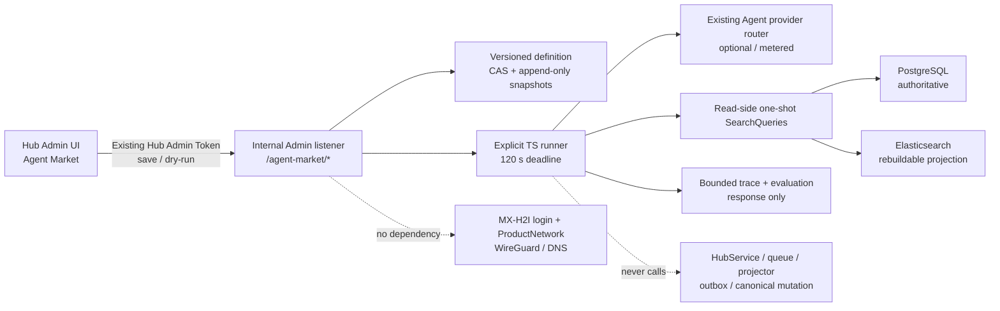

# Agent Market advanced-search dry run

Agent Market is an Internal learning and experiment surface inside MX Insight
Hub. Its first market item turns the existing canonical search stack into an
explicit, editable Agent graph without changing the result path used by public
search, the production province-analysis pipeline, or MX-H2I.

The delivered item is `advanced-search-dry-run`. It is intentionally a fixed
vertical slice rather than a general workflow builder: TypeScript and Zod own
the graph, stage contracts and tool allowlist; an operator can change prompts,
model parameters and bounded tool options, move stages to a recoverable trash,
and compare trace/evaluation output.

## Catalog and execution are separate

Agent Market now has a real, operator-managed catalog rather than treating the
single dry-run definition as the whole market. Migration
`045_agent_market_catalog.sql` seeds two truthful categories and two entries:

- **知识问答 / 知识问答 Agent** is a persisted catalog item whose execution
  adapter has not been implemented yet. It is shown as a draft and cannot run.
- **Demo Agent / 进阶搜索 Agent · Dry Run** points to the shipped
  `advanced-search-dry-run` adapter and remains the runnable tutorial.

An operator in the existing Hub Admin Token session can create and edit categories, create custom Agent
metadata, move an Agent between categories, and disable or restore it with
optimistic revision checks. A Launcher platform administrator can browse the
same catalog but cannot mutate or execute it. Built-in categories cannot be
deleted, and a custom category cannot be deleted while any Agent references it.

Agent Market has no credential, login or session of its own. It reuses the
current Hub session and the same Hub Admin Token already used by the rest of
the management console; it never asks the operator for a second token.

Catalog metadata never grants execution. Custom Agent requests cannot submit
an executor key, module, URL, runnable flag, health value or metrics; the server
stores a null executor and reports `executor-not-configured`. Adding a runnable
Agent therefore requires a code-owned, schema-bound adapter to ship first, then
an explicit server migration binds its fixed adapter identifier. The UI must
show missing run data as unavailable, not as a synthetic zero, healthy state,
latency or accuracy score.

## Runtime and ownership boundary

The API exists only below `/internal/v1/admin/agent-market`. The public listener
returns 404 before authentication. A Launcher platform administrator may read
the definition and examples; the Hub Admin Token is required to save a draft
or run one because model stages can incur provider cost.

The new UI route is loaded only after a signed-in user opens Agent Market. It
does not change `SessionGate`, `/internal/v1/admin/session`, Launcher token
introspection, memberships, login redirects or readiness. Agent Market is not
registered as a Launcher app, ProductNetwork, DNS record, port or VPN route.

## Fixed graph

Two code-owned gates surround seven recoverable stages:

| Stage | Kind | Editable controls | Output contract |
| --- | --- | --- | --- |
| Intent triage | Agent | `system`, `user`, temperature, max tokens | route, normalized question, bounded filters and visible branch reason |
| Query rewrite | Agent | prompts, temperature, max tokens, query count | rewritten query, bounded alternatives, keywords and preserved constraints |
| PG / ES retrieve | Tool | top K, semantic toggle, allowlisted search profile | backend modes/degradation and safe evidence projection |
| RRF fuse | Tool | RRF damping and top K | canonical-ID deduplicated evidence ranking |
| Evidence grade | Agent | prompts, temperature, max tokens, threshold, zero/one retry | per-evidence relevance, verdict and missing facts |
| China admin-1 resolve | Tool | confidence threshold | province taxonomy matches and unknown evidence IDs |
| Grounded answer | Agent | prompts, temperature, max tokens, citation requirement | answer, valid evidence citations, confidence, limitations and refusal |

The access/dry-run gate enforces the fixed market key, `dryRun: true`, request
and prompt limits, canonical stage order, at most two concurrent runs per
process, the existing Hub Admin Token session and the server-owned tool registry. The trace/evaluation
gate validates every stage with Zod, removes
invented evidence IDs, enforces grounded refusal, and exposes rendered messages,
parameters, tool summaries, result, provider/model metadata, tokens, latency,
fallback, model-response validation and effective-output validation. A model
Schema failure remains visible even when a safe fallback lets the graph
continue. It reports observable branch reasons; it does
not expose or claim to expose hidden chain-of-thought.

## Schema and editing model

Zod is the single runtime contract. The same definitions produce:

- TypeScript input/output types;
- server request and model-output validation;
- JSON Schema added as a locked runtime system message;
- the schema/help view and return examples in the UI.

Operators edit text and bounded parameters, not executable TypeScript or Zod.
The server never evaluates user code, arbitrary JSON Schema, SQL,
Elasticsearch DSL, index names, provider URLs or credentials.

Moving a stage to the trash changes its versioned `state` from `active` to
`trashed`; it does not delete the stage or its prompt. Restoring it is the
inverse operation. Saving versions the entire definition with optimistic CAS
and appends an immutable snapshot. A dry run uses the current in-browser draft
as an immutable request snapshot, so an experiment does not need to be saved.

## Data and side-effect contract

The runner uses the existing `SearchQueries` read layer directly. It does not
use `HubService` search, whose reservation/idempotency/usage lifecycle writes
accounting evidence, and it does not complete an analysis-pipeline claim, which
would update publication state and the projection outbox.

For a normal experiment it reads:

1. the configured ES projection, with the existing automatic PG degradation;
2. an explicit PG-only query for comparison when ES is configured;
3. the optional ES chunk projection for lexical/vector retrieval.

If ES has already fallen back to PG, the runner keeps only one PG ranking in
RRF. Retrieval uses one-shot pages: it does not request an exact total or retain
an ES PIT/cursor. Model and embedding calls receive the run AbortSignal; ES and
PG retain their client/statement timeouts, and the whole graph has a 120-second
deadline. Search results pass through an allowlisted public projection before they
enter prompts or traces. `raw`, `extensions`, upstream identifiers, provider
configuration, backend exception text and secrets are not present. Each backend
may fail independently; the trace returns only a stable failure code/generalized
degradation and the graph either continues with available evidence or refuses.

`--dry-run` means zero business-data mutations: no canonical record, public
opinion state, queue, outbox, index alias, Night-All state, grant, usage ledger
or MX-H2I state is written. Saving an Agent Market definition is a separate,
explicit control-plane write. Model and embedding calls can still incur
provider cost, which is why execution is restricted to the existing Hub Admin
Token session.

## Persistence

Migration `040_agent_market.sql` adds:

- `control.agent_market_agents` for the current revision;
- `agent_center.agent_market_versions` for append-only definition snapshots.

The built-in definition is revision 0 and requires no database seed. The first
save creates revision 1. Concurrent saves serialize on the logical agent key
and fail with a revision conflict instead of overwriting another edit. There is
no HTTP DELETE and no cascade to canonical data.

Migration `045_agent_market_catalog.sql` adds:

- `control.agent_market_categories` for revisioned category metadata;
- `control.agent_market_catalog` for revisioned Agent directory metadata and
  the server-owned executor binding.

The catalog seeds use `ON CONFLICT DO NOTHING`, so a restart or migration rerun
does not overwrite operator metadata or re-enable a disabled entry. Agent
records are retained and disabled/restored through lifecycle updates; this
iteration does not expose physical Agent deletion.

Run traces are not persisted in this MVP. The UI keeps the current and previous
response for a local comparison. A later replay ledger must remain isolated and
store only bounded/redacted artifacts, hashes and versions.

## Extension rules

New market items or tools must preserve these constraints:

- keep tools code-owned, schema-bound and explicitly classified by side effect;
- do not add generic HTTP, arbitrary SQL/DSL, shell or Night-All proxy tools;
- keep row/call/token/wall-clock budgets and propagate cancellation;
- keep public search and production pipeline behavior independent;
- require a separate approval design before any write, export or publish tool;
- bind future fixed evaluation datasets to definition/model/tool versions;
- introduce a governed dataset/query service before turning the demo into a
  tenant-facing Text2SQL or general Data Agent product.

The next search lessons can add multi-query fan-out, richer reranking and fixed
evaluation cases behind the same gates. They should extend the trace contract
instead of replacing the existing Hub search result contract.

## Verification

The focused tests prove that the runner reads ES, PG and optional semantic
retrieval, validates all outputs, strips raw/secret-shaped fields, skips every
data call when retrieval is trashed, rejects a non-dry-run or incomplete graph,
versions definitions with CAS without canonical/outbox SQL, serves revision 0
without creating state, limits concurrent runs, closes one-shot search PITs,
separates model/effective Schema validation, exercises editable prompt/model
parameters and returns 404 on the public listener.

Release verification also includes TypeScript checking, the existing identity,
Agent, Data Center and search tests, the full server suite, the Vite production
build and the Sites packaging contract.
