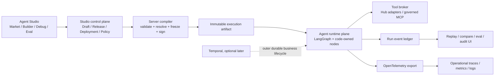

# Agent Studio：受治理的通用编排、评测与发布生命周期

状态：长期架构提案，不代表当前产品已实现  
更新时间：2026-08-31  
范围：MX Insight Hub Internal 管理面内的 Agent Studio / Agent Market 未来演进  
非目标：本提案不改变 MX-H2I 登录、联网、DNS、WireGuard、ProductNetwork 或 Launcher 应用发布路径

## 1. 结论先行

当前 `advanced-search-dry-run` 应继续被定义为 **code-owned 的固定模板执行器**，而不是通用 Agent runtime。它适合验证可观测阶段、受控参数、只读工具、trace 和评测体验，但不能据此声称任意 Agent 都可由拖图安全上线。

长期 Agent Studio 必须把以下三件事分开：

1. **图的创作**：用户能否表达节点、边、提示词、阈值和测试样例；
2. **执行能力**：服务器是否已经安装、审核并实现这些节点与工具；
3. **发布权限**：某个不可变版本是否通过评测、安全审查和环境晋级。

核心约束是：

> authoring graph ≠ executable artifact ≠ approved deployment

本文定义生命周期、治理与框架边界；具体 Node.js/LangChain/LangGraph
runtime、通用 definition/compiler、Hub 数据节点目录、目标 API/数据模型及
advanced-search 兼容迁移见
[Agent Studio 通用编排与 Hub 数据节点设计](agent-studio-langgraph-data-orchestration.md)。
外部 AI engineering 平台、Prompt 单一真相、MXT 证据边界及 build-vs-buy 决策，以
[Agent Studio 平台边界、证据集成与 Build-vs-Buy](agent-studio-platform-boundaries-and-build-vs-buy.md)
为准。

React Flow 可以承载编辑和呈现，但不能成为执行器、安全边界或授权系统。LangGraph 可以承载 Agent 内部的状态图、checkpoint、stream 和 HITL，但它本身也不替代工具治理、发布审批、租户鉴权和真实副作用补偿。Temporal 只在流程跨小时/天、跨服务等待或包含可靠副作用时，作为外层业务工作流候选，而不是当前 120 秒 dry-run 的前置依赖。

## 2. 当前实现核对：fixed runner 并不通用

### 2.1 代码事实

- [`schemas.ts`](../../agent-market/advanced-search/schemas.ts#L3) 把 `agentKey` 固定为 `advanced-search-dry-run`，并在第 6–14 行声明唯一的七种阶段。
- [`schemas.ts`](../../agent-market/advanced-search/schemas.ts#L34) 使用固定 discriminated union 定义每种阶段；第 109–144 行要求固定 schema 版本、`dryRunOnly: true`、恰好七个阶段、固定顺序且不得缺失。
- [`runner.ts`](../../server/agent-market/runner.ts#L1182) 只接受这个 built-in dry-run，限制并发并设置 120 秒 deadline；第 1226–1302 行手写执行七个阶段，仅 grade 路径允许一次受限纠错循环。
- [`runner.ts`](../../server/agent-market/runner.ts#L1308) 返回固定 graph、安全声明、trace 与 evaluation，而不是解释并执行一个任意图定义。
- Hub 当前 [`package.json`](../../package.json) 没有 LangChain、LangGraph、React Flow、Temporal、OpenTelemetry 或 MCP runtime 依赖。因此现状不能被描述为这些框架已经接管运行时。
- 现有 [`agent-market-advanced-search.md`](agent-market-advanced-search.md#L8) 也正确声明它是固定 vertical slice；第 104–106 行禁止可编辑 TypeScript、Zod、SQL、Elasticsearch DSL、index、provider URL 和凭据。

### 2.2 判断

这不是缺陷，而是当前阶段正确的安全收敛。应将它命名为：

`advanced-search executor v1` = `fixed graph + bounded configuration + read-only tool adapters + explicit trace contract`

未来可把它迁移为通用 runtime 的第一个 **reference executor / compatibility fixture**，但不能先把 catalog metadata 或 React Flow JSON 解释成执行权限。Catalog 中没有 code-owned executor 的 custom Agent 仍必须显示 `executor-not-configured`，且不可运行。

## 3. 从 lessons 得到的可复用模式

`/Users/qpjoy/workspace/qpjoy/rock-agents/lessons` 更适合作为机制教程和验收样例，不应直接当作生产平台实现。可借鉴的边界如下：

- `04-tool-calling/README.md:13-20,40-60`：模型只提出 tool call；真正执行工具的是应用代码。这正是工具注册、授权与审计必须 code-owned 的根本原因。
- `05-first-agent/README.md:30-63`：简单开放循环可用 `createAgent`，明确的顺序、分支、HITL 应使用 LangGraph。
- `09-langgraph-basics/README.md:11-72`：State、Node、Edge 是通用图的基础；节点既可以是模型，也可以是数据库、HTTP 或纯函数。
- `10-conditional-routing/README.md:22-69`：确定性外层图与内部自由 Agent 的混合，比把全部流程交给模型更适合严肃业务。
- `11-human-in-the-loop/README.md:11-60` 与 `17-hitl-middleware/README.md:24-133`：中断需要 checkpointer 和稳定 thread；工具审批策略必须显式，复杂审批应由图表达。
- `13-streaming-ux/README.md:20-51`：values、updates、messages 可映射为状态快照、节点进度和 token 流；前端不能把 tool message 误当最终答案。
- `15-middleware/README.md:13-113`：logging、成本、重试、脱敏适合横切 middleware；持久 state 与非持久 runtime context 必须区分。
- `16-guardrails/README.md:13-79`：所有循环都需要模型调用、工具调用、token、耗时和重试的硬上限。
- `18-long-term-memory/README.md:19-180`：run/thread checkpoint 与跨会话长期 memory 是两种不同的数据产品，不能共用一个无边界消息历史。
- `22-corrective-rag/README.md:33-189`：纠错循环必须 bounded，并在证据不足时拒答；多轮 CRAG 成本显著高于单次问答。
- `23-mcp/README.md:39-179`：MCP 的 tool、resource、prompt 控制方不同；第三方 server 与 tool description 均应被视为不可信输入。
- `24-eval-and-serve/README.md:13-207`：优先做确定性 tool/content 断言，再用 LLM judge；概率系统需要重复运行、A/B、CI、鉴权、持久化、可观测与取消。

教程展示的是“机制如何工作”；平台还必须补齐多租户权限、不可变版本、密钥隔离、幂等、副作用策略、容量、审计、数据保留与回滚语义。

## 4. 目标架构：三平面，而不是一个大画布



### 4.1 Studio control plane

负责 idea、draft、revision、评测集、experiment、release、deployment、审批和回滚指针。权威元数据放 PostgreSQL，通过租户、角色、CAS revision 和 append-only release 保护。

它不执行任意代码，不保存直接可用的密钥，不因 catalog 中出现一个 Agent 就自动授予 executor。

### 4.2 Agent runtime plane

负责把不可变 execution artifact 解析为已审核的节点类型、工具和策略：

- LangChain `createAgent`：适合某个节点/子图内部的开放式模型↔工具循环；
- LangGraph：适合外层显式 state、条件边、subgraph、checkpoint、stream 和 HITL；
- code-owned node/tool registry：决定真实可执行能力；
- tool broker：统一鉴权、schema 校验、超时、重试、幂等键、审批、脱敏、网络策略和审计；
- Temporal：仅在后续有长等待、跨进程恢复、定时、可靠副作用和补偿需求时作为外层 durable workflow。

### 4.3 Observability / evidence plane

分开保存两类事实：

- **产品权威事实**：run、event、checkpoint、artifact hash、release、evaluation，进入 PG 和受控对象存储；
- **运维遥测**：trace、metric、log，通过 OpenTelemetry 导出到后端。

OTel trace 不是业务 run ledger；ES 也只能是可重建的检索投影。Prompt、tool args、tool results 和模型内容默认不得进入 metric label 或 baggage。

## 5. Agent 从想法到回滚的受治理生命周期

### 5.1 Idea

用户先建立意图说明，而不是直接获得可执行权限：目标、用户、输入/输出、允许的数据域、预期工具、风险等级、成功指标和代表性样例。Studio 可根据 template 建议图，但建议结果仍是 draft。

退出条件：责任人、用途、数据分类、初始 eval cases 均已明确。

### 5.2 Build / Draft

用户从 code-owned palette 选择兼容节点，编辑提示词、受限参数、条件边和布局。每次保存使用 CAS，并保留 revision；多人并发修改发生冲突时不得静默覆盖。

React Flow 文档中的 `nodes`、`edges`、`viewport` 是作者界面状态。长期数据模型必须把它拆成：

- `ui.layout`：坐标、viewport、折叠、颜色和注释；
- `graph.definition`：节点类型与版本、typed ports、配置、边、入口、终点、预算；
- `compiled.artifact`：服务端解析后的 immutable plan 与 hash。

退出条件：草稿可以保存，但此时仍不可在生产执行。

### 5.3 Compile / Static validation

服务端编译器重新解析图，绝不信任浏览器的连接校验。至少检查：

- node type 和版本是否存在、是否允许当前租户/环境；
- 输入/输出 port、Zod/JSON Schema、state reducer 是否兼容；
- entry/terminal 可达性、孤立节点、非法 cycle、最大 loop/fan-out；
- 每条路径的模型、工具、token、时间、并发与费用预算；
- tool side-effect class、secret reference、network egress 与 HITL 是否满足 policy；
- subgraph 和 middleware 顺序；
- provider/model sequence 是否引用已批准 revision；
- prompt/template 变量是否闭合；
- release 是否锁定所有依赖版本。

编译只产生诊断或 execution artifact；服务器不得直接运行 draft JSON。

### 5.4 Sandbox debug

只允许在隔离沙箱、受控 fixture 或明确只读数据面运行。UI 同时呈现：

- 实际访问过的节点和边；
- 每个 node attempt 的输入投影、渲染后 prompt、参数、schema、输出、耗时、token、工具摘要和错误；
- branch reason、retry reason、fallback、等待审批、取消；
- 版本与 artifact hash；
- 当前 run 与基线 run 的差异。

不展示或声称展示 hidden chain-of-thought。应展示可审计的结构化 decision reason、工具证据和显式模型输出字段。

退出条件：所有路径均有样例覆盖，失败和降级不是合成状态。

### 5.5 Offline evaluation

评测按由便宜到昂贵的顺序运行：

1. compile、schema、deterministic reducer、router、tool contract 单元测试；
2. tool trajectory / must-call / must-not-call、内容包含/禁止、引用有效性、拒答与权限断言；
3. 路径、循环上限、超时、取消、重试、fallback、HITL、安全对抗测试；
4. 固定数据快照上的任务指标；
5. 只在难以规则化的质量维度使用人工或 LLM judge；
6. 对概率节点重复运行，给出通过率、分布、成本和延迟，而不是一次“全绿”；
7. 与当前生产 release 做 pairwise / non-inferiority 对比。

评测用例和数据快照必须版本化。线上采样发现的真实失败应脱敏后回流为离线 regression case。

### 5.6 Candidate release

发布不是“保存草稿”。Release 是不可变 bundle，至少固定：

```text
definition_version
executor_build_digest
node_catalog_version
tool_contract_versions
model_sequence_revision
policy_version
eval_suite_version
dataset_snapshot_or_hash
compiled_artifact_hash
```

已经启动的 run 固定使用这组版本，不能因为用户随后编辑 prompt、升级 MCP server 或调整 node registry 而热切换。

### 5.7 Review / Approve / Publish

不同风险使用不同晋级门：

- read-only、低敏数据：自动 eval gate + operator 审批；
- 外部发送、写数据库、导出、删除、资金或权限变更：安全/数据 owner 审批，并要求 idempotency 与补偿设计；
- 新 executor、新 node type、新 MCP server、新 egress：必须代码审查与部署审批，不能由画布自助启用；
- policy 或 secret 变更：独立审计记录，不塞进 graph JSON。

发布生成 deployment pointer，而不是修改 release 内容。

### 5.8 Canary / Operate

按内部测试、shadow、低比例 canary、逐步放量晋级。自动监控：成功率、schema 失败、拒答、tool error、HITL 拒绝、loop/retry、token、成本、p50/p95/p99 延迟、队列/背压、fallback 和安全事件。

只有真实 run 才生成运行指标；无 executor 或无运行样本应显示“不可用”，不能填 0 或伪健康。

### 5.9 Rollback / Deprecate

回滚是把 deployment pointer 指向此前已批准的 immutable release，保留原因、操作者和时间。它不是修改旧 release，也不可能撤销已经发生的邮件、外部 API、数据库写入或资金动作；这些必须有幂等、撤销或补偿流程。

被废弃的 release 不接受新 run，但历史 run 仍能按 pinned artifact 解释和审计。运行中的长流程采取继续固定旧版本、显式迁移或取消补偿之一，不能无声热换。

## 6. 什么可自由编排，什么必须受治理

| 层级 | 可以做什么 | 谁最终决定 | 不能越过的边界 |
| --- | --- | --- | --- |
| Draft 自由编辑 | 布局、注释、提示词、允许列表中的 model sequence、受限数值、兼容 typed-port 连线、eval cases | 作者 | 不产生生产执行权限 |
| Declarative graph | approved node 间的分支、bounded loop、optional safe node、结构化映射 | 服务端编译器 | 无任意表达式、代码、import、URL |
| Code-owned runtime | node implementation、state reducer、tool adapter、schema、SQL/ES profile、retry/cancel/idempotency、redaction | 工程与代码审查 | UI 不覆盖实现 |
| Security policy | tenant/role、secret、egress、side-effect、HITL、预算、数据分类 | 平台/安全 owner | Agent prompt 无法改写 policy |
| Release governance | 评测门、审批、canary、环境晋级、rollback | 有权限的 operator/reviewer | 保存草稿不等于发布 |
| Connector governance | MCP/HTTP/DB 安装、版本 pin、credential、sandbox、tool allowlist | 平台 owner | catalog 作者不得任意输入 server command/env/token |

明确禁止在通用定义中接受：

- 任意 JS/TS、shell、dynamic import、表达式求值器；
- 任意 SQL、Elasticsearch DSL、index 名、provider URL；
- 任意 MCP command、远端 URL、env、header 或 Hub Admin Token；
- 原始 secret、用户凭据或 Launcher token；
- 无上限 loop、fan-out、context、模型调用、工具调用和重试；
- 由客户端声明 `runnable`、`healthy`、`safe`、`sideEffect:none` 或伪造指标。

## 7. 通用定义与节点契约

### 7.1 Authoring definition

概念上，一个 draft 只引用 registry 中的能力：

```text
agentKey + draftRevision
entryNode + terminalNodes
nodes[]:
  nodeId
  nodeType@version
  config validated by server-owned schema
  typed input/output ports
edges[]:
  sourcePort -> targetPort
  bounded declarative condition reference
budgets:
  deadline / modelCalls / toolCalls / tokens / retries / fanOut / cost
ui.layout:
  positions / viewport / groups / annotations
```

客户端只提交引用和配置；真正的执行函数、credential、schema 实现和网络 client 不进入 definition。

### 7.2 Node manifest

每种 code-owned node type 至少声明：

- 输入、输出与 state update schema；
- reducer / merge 语义，尤其是并行 branch；
- `sideEffect = none | read | write | external`；
- idempotency 能力、timeout、retry、cancel 语义；
- 允许的数据分类、tenant、environment 和 egress；
- secret scope 与凭据来源；
- 可观测字段、敏感字段和 redaction 策略；
- evaluator hooks 与 fixture；
- 兼容的前后版本和弃用窗口。

建议的初始节点家族：

1. deterministic transform / router / gate；
2. 受 schema 约束的 LLM node；
3. 内部使用 `createAgent` 的 bounded agent subgraph；
4. code-owned read-only tool node；
5. 需要发布治理与 HITL 的 side-effect tool node；
6. HITL interrupt / approval node；
7. reusable subgraph；
8. terminal / grounded refusal。

### 7.3 编译产物

编译器将 node type/version 解析到服务端 registry，生成规范化 topology、resolved policies、依赖清单、schema fingerprints、budget plan 和 artifact hash。Runtime 只接受经过签名/授权的 artifact ID，不接受浏览器上传的任意 execution plan。

## 8. LangChain、LangGraph 与 Temporal 的边界

### 8.1 LangChain tools / createAgent

模型决定“是否请求工具以及参数”，但应用决定“工具是否存在、当前身份能否调用、参数是否合法、是否需要审批以及如何执行”。`createAgent` 适合封装小范围开放循环，不应成为整个平台唯一的编排抽象。

### 8.2 LangGraph

LangGraph 适合 Agent 内部显式 state graph：branch、loop、checkpoint、replay/fork、stream 和 HITL。使用 persistence/interrupt 时必须注意：恢复一个 interrupt 会从被中断节点开头重新执行，因此 interrupt 前的副作用必须不存在或具备幂等性。

LangGraph checkpoint 支持调试和恢复，但“重放”会重新执行 checkpoint 之后的模型/API/interrupt，并不等价于重放旧输出，更不等价于撤销外部副作用。

### 8.3 Temporal（条件式引入）

当前 120 秒、只读、单服务 dry-run 不需要 Temporal。满足以下任一组合后再进入 ADR / spike：

- 流程跨小时/天并等待人工或外部事件；
- worker/进程故障后必须可靠恢复；
- 跨多个服务的定时、重试、补偿与信号；
- 外部副作用要求明确的幂等 Activity 和版本化 worker。

若引入，推荐职责分层：

- LangGraph 管理一个 Agent run 内的认知图和 checkpoint；
- Temporal 管理外层业务生命周期、等待、定时、跨服务副作用与补偿；
- 初期把一次 LangGraph run 作为一个 Temporal Activity，而不是同时把每个节点既做 LangGraph checkpoint 又做 Temporal Activity。

Temporal Workflow code 必须 deterministic；LLM、HTTP、DB 等非确定性操作放入 Activity。Activity 可能从头重试，因此必须幂等。Worker Versioning / pinning 必须纳入 release bundle。

## 9. MCP 的正确位置：受治理的 connector，不是编排器

MCP 统一的是 host/client/server 之间的 context/tool 协议，不替代 Agent Studio 的租户权限、发布审批、执行图或审计。

MCP server 的安装与 Agent draft 编辑必须分离。安装至少需要：

- protocol version 明确协商并 pin；
- server/package/container 使用批准来源和 digest；
- 进程、文件系统和网络 egress sandbox；
- 每个 server 独立、最小权限、audience-bound credential；
- tool schema/description/annotation snapshot 与 hash；
- side-effect classification、allowlist、rate limit、timeout 与 HITL；
- 每次请求重新做身份和授权判断；
- 更新后重新评测与晋级。

工具描述和 annotation 都视为不可信。严禁把 Hub Admin Token、Launcher token 或其他 bearer token 透传给 MCP server；MCP authorization 规范明确禁止 token passthrough。Resources 应由应用控制，prompts 由用户选择，tools 由模型请求但最终仍由 host policy 决定是否执行。

## 10. 可观测运行与“霓虹图”呈现

### 10.1 权威事件模型

每次执行使用不可变 `runId + artifactHash`，事件使用单调递增 `seq`、时间戳、node ID、attempt 和 redacted payload/hash：

```text
run.created / queued / started
node.scheduled / started / output / failed / retried / skipped
model.requested / token-usage / completed / failed
tool.requested / approval-required / approved / denied
tool.started / completed / failed
checkpoint.saved
run.completed / failed / cancelled / timed-out
```

SSE/WebSocket 只是 event ledger 的实时投影，客户端按 cursor 断线续传。UI 动画必须来自真实事件，不能按定时器模拟“正在检索”。

### 10.2 三层视图

1. **市场卡片**：用途、owner、状态、executor availability、最新 release、评测门、最后真实运行；
2. **流程图**：展示当前实际路径、branch、loop、并行和等待；未访问边变暗，活动边脉冲，历史路径保留；
3. **时间线与检查器**：按真实事件查看每个 attempt 的输入/输出投影、schema、工具、证据、指标、错误和版本，并支持 run-to-run diff。

3D/霓虹视觉适合作为路径感知层，不应牺牲信息密度和可访问性。建议状态语义：

| 状态 | 颜色建议 | 同时提供的非颜色标识 |
| --- | --- | --- |
| queued | 蓝 | 队列图标 + 文案 |
| running | 青色脉冲 | spinner + 起始时间 |
| waiting approval | 琥珀 | pause / 审批图标 |
| retrying | 紫 | attempt 编号 + 回环箭头 |
| succeeded | 绿 | check + 产出摘要 |
| failed | 红 | error code + 失败节点 |
| cancelled / skipped | 灰 | cancel / skip 文案 |

必须保留 2D 键盘可操作图、列表/时间线替代视图、非颜色状态和 `prefers-reduced-motion`。视觉上的“流光”只表示已有事件，不表示模型的隐藏思维。

### 10.3 OTel 映射

建议 span 层次：

```text
agent.run
  node.attempt
    model.call
    tool.call
    retrieval.query
    http/db spans
```

操作指标使用低基数属性，如 executor、release、node type、status、error class 和 environment。`runId`、user、完整 query、prompt、document ID 不进入 metric label；baggage 不放 secret 或内容。Prompt/tool body 如确需保存，必须显式 opt-in、脱敏、限长、加密、TTL 和权限审计。

OpenTelemetry JS 的 traces/metrics 稳定，但 logs 仍处于 development；GenAI semantic conventions 也标记为 development。实现应加一层内部稳定映射，避免平台 contract 直接耦合尚在变化的属性名。

## 11. 数据职责与保留

概念职责如下：

- PostgreSQL：draft/CAS、release、deployment、policy reference、run/event 索引、评测结果和审计权威；
- 对象存储：加密、限长的 prompt/output/tool/evidence 大对象，按 artifact reference 访问；
- Elasticsearch：可重建的 run/trace 检索投影，不作为审计权威；
- LangGraph checkpointer：run/thread 恢复所需 state，使用与业务 ledger 关联但不同的 schema/retention；
- OTel backend：运维 trace/metric/log，不能代替产品级 replay ledger。

长期 memory 另建 namespace、同意和保留策略，不能默认把 debug run 全部写入用户记忆。任何层都不持久化 hidden chain-of-thought。

## 12. MX-H2I 与 Launcher 隔离红线

Agent Studio 的演进必须保持现有边界：

- 只位于 Hub Internal Admin listener 下，不向 public listener 暴露；
- 复用当前 Hub session 与 Hub Admin Token，不新增 Agent Market 登录或第二个 token；
- 不修改 `SessionGate`、Launcher token introspection、membership、login redirect 或 readiness；
- 不把 Agent Studio 注册为新的 Launcher app、ProductNetwork、DNS、port、WireGuard peer 或 VPN route；
- runtime 使用独立表、队列/并发池、service account、budget 和 feature flag，默认关闭新执行器；
- tool registry 不包含 Launcher 网络控制、用户登录或 VPN 管理适配器；
- 不向 MCP、模型 provider 或外部工具转发 Hub/Launcher session token；
- Agent runtime 不调用 MX-H2I login/network control API；
- Hub 失败、runtime 排队、provider 超时、OTel/ES 故障不得改变 MX-H2I 登录和联网 readiness。

发布前应保留 contract/smoke gates：MX-H2I 登录、SessionGate、用户联网、DNS/WireGuard、public listener 404、Hub Admin 权限矩阵均与基线一致。

## 13. 分阶段落地

### Phase 0：把当前能力说清楚

- 保持 fixed runner 与现有安全约束；
- UI/文档明确 `fixed executor`、`dry-run`、`executor-not-configured`；
- 定义通用 run event envelope、artifact/version 字段和 redaction contract；
- 现有图只做真实 topology/trace 的只读呈现；
- 不新增 runtime 依赖。

退出门：无虚假 runnable/metrics；MX-H2I 回归全绿；固定 runner trace 能映射到通用事件词汇。

### Phase 1：Studio drafts + server compiler

- 引入 React Flow 作者界面，但 layout 与 executable semantics 分表/分字段；
- node palette 只包含 code-owned、无副作用/只读类型；
- 服务端进行 topology/schema/budget/policy 编译；
- draft CAS、revision history、compile diagnostics；
- 没有 compiled executor 的 custom Agent 仍不可运行。

退出门：浏览器篡改节点/边/side-effect 无法绕过编译；任意代码、URL、SQL、MCP env 均被拒绝。

### Phase 2：LangGraph sandbox runtime

- 将 fixed advanced-search 迁为兼容 fixture，保持结果/登录/网络 contract；
- 加入 PG-backed checkpointer、cancel、stream event、bounded loop 和 subgraph；
- 建立 node/tool registry 与只读 tool broker；
- 加入 OTel instrumentation 和内部稳定 telemetry vocabulary。

退出门：崩溃恢复、interrupt/resume 幂等、SSE resume、超时/背压、数据脱敏、固定 runner parity 均通过。

### Phase 3：Eval + immutable release

- dataset/eval suite/experiment registry；
- deterministic、trajectory、security、repeat、pairwise gates；
- immutable release bundle、review、deployment pointer、canary 和 rollback；
- 线上失败回流离线回归集。

退出门：任何生产 deployment 均可回答“谁批准、测了什么、固定了哪些版本、如何回滚”。

### Phase 4：Governed connectors / MCP

- 独立安装 registry、协议版本 pin、digest、sandbox、egress、per-server credential；
- 先开放 read-only tools，再按 side-effect 分级引入 HITL；
- schema/description 变更触发重新评测和晋级；
- 禁止 Hub/Launcher token passthrough。

退出门：恶意 description、schema drift、越权、SSRF、secret exfiltration 和 tool flood 测试通过。

### Phase 5：Durable business workflows（按需）

- 仅在有明确长流程需求时引入 Temporal spike；
- LangGraph cognitive run 与 Temporal outer workflow 分工；
- Activity 幂等、补偿、Worker Versioning、长期 run migration/cancel policy；
- 不把双重 replay 语义暴露成一个含糊的“回滚”按钮。

退出门：选定场景证明 Temporal 相比 PG queue/checkpointer 显著降低恢复复杂度，且团队能运维其集群和版本策略。

## 14. 当前明确不做

- 不把 catalog CRUD 扩张成任意 executor 注册；
- 不允许拖入任意 npm 包、脚本、URL、SQL 或 MCP server 即上线；
- 不以 3D 效果替代时间线、事件、错误和评测；
- 不保存 chain-of-thought；
- 不用 React Flow client validation 作为安全校验；
- 不为短 dry-run 过早引入 Temporal；
- 不把 OTel/ES 当权威审计 ledger；
- 不让自助作者直接管理 secret、egress、生产写工具或发布权限；
- 不因 Agent Studio 改造触碰 MX-H2I 登录/联网路径。

## 15. 官方/一手资料与本设计采用的边界

### LangGraph / LangChain

- [LangGraph JS overview](https://docs.langchain.com/oss/javascript/langgraph/overview)：低层 orchestration，强调 durable execution、stream、HITL 与 memory；普通开放 Agent 可优先用 LangChain agent。
- [LangGraph persistence](https://docs.langchain.com/oss/javascript/langgraph/persistence)：checkpoint、thread、fault tolerance、replay/fork。
- [LangGraph interrupts](https://docs.langchain.com/oss/javascript/langgraph/interrupts)：checkpointer/thread 要求，以及 resume 时节点从头执行的副作用约束。
- [LangGraph streaming](https://docs.langchain.com/oss/javascript/langgraph/streaming)：values/updates/messages/custom 等 stream modes。
- [LangGraph frontend](https://docs.langchain.com/oss/javascript/langgraph/frontend/overview)：从 stream 构建节点状态和消息 UI。
- [LangChain JS tools](https://docs.langchain.com/oss/javascript/langchain/tools)：typed tool schema，模型提出 tool calls。
- [LangChain middleware](https://docs.langchain.com/oss/javascript/langchain/middleware/overview)：logging、retry、rate limit、guardrail 等横切控制。
- [LangChain guardrails](https://docs.langchain.com/oss/javascript/langchain/guardrails)：deterministic/model guardrail 与 HITL。
- [LangSmith evaluation concepts](https://docs.langchain.com/langsmith/evaluation-concepts)：offline/online evaluation、dataset、experiment 和 evaluator 类型。本设计只借鉴方法，不把外部 SaaS 设为 Hub 的必选依赖。

### React Flow

- [Custom nodes](https://reactflow.dev/learn/customization/custom-nodes)：画布节点呈现与交互。
- [Connection validation](https://reactflow.dev/examples/interaction/validation)：客户端连接约束。
- [Save and restore](https://reactflow.dev/examples/interaction/save-and-restore)：保存 nodes/edges/viewport。
- [Accessibility](https://reactflow.dev/learn/advanced-use/accessibility)：键盘与屏幕阅读支持。
- [Computing flows](https://reactflow.dev/learn/advanced-use/computing-flows)：前端 data-flow 示例。

由这些能力得到的架构推论是：React Flow 是 editor/view primitive；客户端 validation、`toObject()` 和前端 data-flow 都不能替代服务器执行授权与编译。

### Temporal

- [Workflow definition](https://docs.temporal.io/workflow-definition)：Workflow deterministic/replay 要求和安全升级约束。
- [Activities](https://docs.temporal.io/activities)：非确定性副作用放入 Activity，失败可从头重试，因此应幂等。
- [Worker deployments and versioning](https://docs.temporal.io/production-deployment/worker-deployments)：worker version pinning 与安全部署。

### OpenTelemetry

- [Signals](https://opentelemetry.io/docs/concepts/signals/)：traces、metrics、logs、baggage 的职责。
- [OpenTelemetry JavaScript](https://opentelemetry.io/docs/languages/js/)：JS signal 稳定状态。
- [JS instrumentation](https://opentelemetry.io/docs/languages/js/instrumentation/)：manual 与 auto instrumentation。
- [Baggage](https://opentelemetry.io/docs/concepts/signals/baggage/)：baggage 会向下游传播，敏感数据可能泄漏。
- [GenAI agent span conventions](https://github.com/open-telemetry/semantic-conventions-genai/blob/main/docs/gen-ai/gen-ai-agent-spans.md) 与 [GenAI conventions status](https://github.com/open-telemetry/semantic-conventions-genai/blob/main/docs/gen-ai/README.md)：当前仍标记为 development，需内部适配层。

### MCP

- [MCP stable architecture 2025-06-18](https://modelcontextprotocol.io/specification/2025-06-18/architecture)：host 是安全与权限边界，多 client/server session 隔离。
- [MCP server primitives 2025-06-18](https://modelcontextprotocol.io/specification/2025-06-18/server/index)：prompts、resources、tools 的控制方。
- [MCP tools draft](https://modelcontextprotocol.io/specification/draft/server/tools)：tools 是 model-controlled，但 host/UI 应允许拒绝；annotation 不可信。
- [MCP authorization 2025-06-18](https://modelcontextprotocol.io/specification/2025-06-18/basic/authorization)：audience binding，禁止 token passthrough。
- [MCP 2026 release candidate note](https://blog.modelcontextprotocol.io/posts/2026-07-28-release-candidate/)：协议仍在演进，生产接入必须协商并 pin 支持版本，不能无审查依赖 draft 特性。

## 16. 最终决策摘要

1. 当前 fixed runner 是可靠的第一个 executor，不是通用编排引擎。
2. 通用 Agent Studio 采用 control/runtime/evidence 三平面。
3. React Flow 负责表达和呈现；服务端 compiler + code-owned registry 决定执行能力。
4. LangGraph 管理 Agent 内部认知图；LangChain agent 可作为 bounded subgraph；Temporal 后续按长流程需求管理外层业务生命周期。
5. MCP 只作为受治理 connector，经独立安装、pin、sandbox、credential 和 tool policy 后才能被 Agent 引用。
6. 每个 release 不可变并固定 graph、executor、node/tool/model/policy/eval/data snapshot；rollback 只切 deployment pointer。
7. 可观测图完全由真实 run events 驱动，OTel 只负责运维遥测，不替代产品 ledger。
8. Studio 全程复用 Hub Internal session，不新增登录或 token，不触碰 MX-H2I 用户登录与联网链路。
