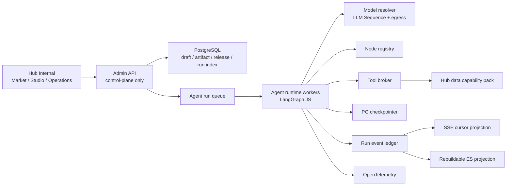
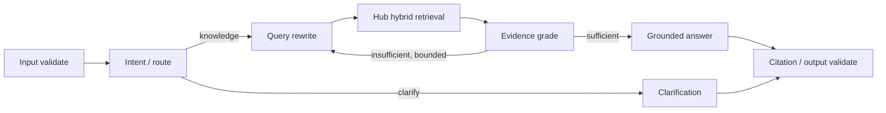
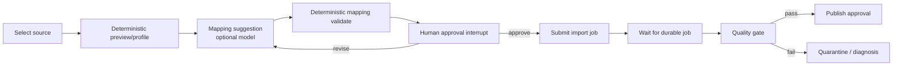
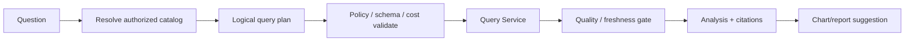

# Agent Studio：Node.js LangChain / LangGraph 通用编排与 Hub 数据节点设计

- 状态：详细目标设计，尚未实现
- 更新时间：2026-08-31
- 适用范围：MX Insight Hub Internal 的 Agent Market、Agent Studio、Agent runtime 与数据能力接入
- 关联文档：[受治理的 Agent 生命周期](agent-studio-governed-lifecycle.md)、[advanced-search 固定执行器](agent-market-advanced-search.md)、[BI 与 Data Agent 演进](bi-and-data-agent-evolution.md)
- 非目标：本文不修改 MX-H2I 登录、联网、DNS、WireGuard、ProductNetwork 或 Launcher 发布路径

## 1. 直接回答

Hub 可以使用一套通用编排底座承载知识问答、搜索、数据清洗、数据分析、演示和其他 Agent，但需要区分两个层次：

1. **通用编排内核**解决 state、node、edge、branch、bounded loop、parallel、subgraph、checkpoint、interrupt、stream、budget 与 cancellation；
2. **Hub 数据能力节点包**把 source、schema、mapping、import、canonical record、search、embedding、quality、metric、report 等真实能力以受治理节点或工具暴露给内核。

所以答案既不是“把 Hub 的所有数据流程硬编码进通用 runtime”，也不是“通用图做好后自动能处理任何数据”。正确关系是：

> 通用 LangGraph runtime + 版本化 node/tool registry + Hub data capability pack = 可构建真实 Data Agent 的平台。

一个全新的纯文本 Agent 可以只使用通用 LLM、router 和 tool-loop 节点；一个数据清洗 Agent 则复用同一 runtime，但只有在平台交付并安装 parser、mapping、quality、import 与 publish 节点后才可运行。将来增加图像、工单或外部系统 Agent 时，无需重写编排器，但仍要先交付对应的受治理能力节点。

“完全从界面构建”在本文中的准确含义是：普通作者无需写 TypeScript，就能组合**平台已安装且当前身份有权使用**的节点、工具和数据资产，完成调试、评测和发布。它不意味着用户能从界面上传任意 npm 包、JavaScript、SQL、URL 或 MCP server 并立即在生产执行。

## 2. 当前仓库事实与目标之间的差距

### 2.1 已实现事实

- [`package.json`](../../package.json) 当前使用 Node.js 22、TypeScript、React 与 Zod，但没有 `langchain`、`@langchain/langgraph`、LangGraph Postgres checkpointer 或 React Flow 依赖；本文不能被解读为 runtime 已经切换。
- [`schemas.ts`](../../agent-market/advanced-search/schemas.ts) 只接受 `advanced-search-dry-run`，固定七种阶段、固定顺序和 `dryRunOnly: true`。
- [`runner.ts`](../../server/agent-market/runner.ts) 手写执行分流、改写、检索、RRF、评分、一次纠错、地理归一与回答，限制 2 个并发 dry-run 和 120 秒 deadline；它没有解析任意用户图。
- [`catalog.ts`](../../server/agent-market/catalog.ts) 已有可管理分类和 Agent 目录；只有 `advanced-search-dry-run` 是 code-owned runnable executor，知识问答条目诚实标为 `executor-not-configured`。
- [`store.ts`](../../server/agent-market/store.ts) 只为固定 advanced-search definition 保存 CAS revision 与 append-only version，不是通用 draft/artifact/release store。
- migrations 041–044 已提供 Provider、LLM Sequence、Proxy Sequence、三态 egress 与连通性证据。这些是未来 runtime 可复用的**模型执行控制面**，不是图本身。
- [`parsers.mjs`](../../server/ingest/external/parsers.mjs)、[`mapping.mjs`](../../server/ingest/external/mapping.mjs) 与 [`importer.mjs`](../../server/ingest/external/importer.mjs) 已实现受限文件解析、确定性 mapping 校验、结构指纹与外部导入；PostgreSQL、SQLite read API、Telegram 与省份舆情还有各自的 source/pipeline contract。这些不能被一枚“万能 ETL 节点”替代。
- [`pipeline.mjs`](../../server/embedding/pipeline.mjs)、[`queries.mjs`](../../server/search/queries.mjs)、[`stored-search.mjs`](../../server/data/stored-search.mjs) 与 [`canonical-context.mjs`](../../server/data/canonical-context.mjs) 已提供 embedding、PG/ES 检索、stored search 与 canonical context 的实际构件，但尚未注册为通用 LangGraph node/tool。
- migration [`034_agent_analysis_pipelines.sql`](../../migrations/034_agent_analysis_pipelines.sql) 已定义受 source revision 约束的 Agent analysis task 和 append-only assertion；Agent proposal 不覆盖 upstream/canonical 的边界应被通用 runtime 继承。

### 2.2 仍未实现

- 通用 draft schema、typed ports、server compiler 与 compiled artifact；
- LangGraph runtime、Postgres checkpointer、interrupt/resume 与 subgraph；
- code-owned node registry、tool broker 与 data capability pack；
- 通用 run/event ledger、SSE cursor、cancel/resume；
- eval suite、experiment、immutable release、deployment/canary/rollback；
- 自定义 Agent 的生产调用入口与现有 Hub grant 集成；
- advanced-search 到新 runtime 的 parity migration。

在这些能力交付前，自定义目录项仍应保持不可运行，不能用前端动画或假数据模拟执行。

## 3. 产品边界：Market、Studio、Runtime、Operations

### 3.1 Agent Market

Market 负责发现和复用，不负责直接编辑任意执行细节。卡片至少区分：

- `builtin-special`：例如保留现有 fixed advanced-search；
- `template`：可克隆的通用蓝图，本身不是在线服务；
- `custom-draft`：用户创建但尚未发布；
- `published-service`：绑定不可变 release 与 deployment；
- `disabled/deprecated`：停止新调用但历史仍可审计。

卡片只显示真实的 executor availability、最新 release、评测状态和真实运行指标。没有 run 就显示“暂无运行”，不能显示 0 ms、100% 或伪健康。

### 3.2 Agent Studio

Studio 是作者工作区，按新手可理解的顺序组织，而不是只给一张空画布：

1. **Idea**：用途、输入、输出、用户、数据域、风险、成功指标；
2. **Template**：从知识问答、数据清洗、数据分析、审批流或空白图开始；
3. **Build**：从允许的 palette 拖入节点，编辑 prompt、schema、阈值、数据引用和分支；
4. **Compile**：服务器返回 topology、schema、budget、policy 与版本诊断；
5. **Debug**：以 fixture 或 sandbox real-data 运行，逐节点检查 input/output、route、retry 与 evidence；
6. **Eval**：固定数据集、多次运行、A/B、成本/延迟/准确性与安全门；
7. **Release**：生成不可变候选版本并审批；
8. **Operate**：canary、运行历史、告警、停止、回滚和废弃。

新手模式使用问答表单和模板生成第一版图；专家模式开放画布、typed ports、节点参数和结构化诊断。两种模式编辑同一 draft definition，不能维护两套运行语义。

### 3.3 Runtime

Runtime 只执行服务端编译过的 artifact 或现有 fixed adapter。浏览器不能把当前画布 JSON 直接交给 LangGraph 执行。

### 3.4 Operations

Operations 负责真实 run、event、checkpoint、provider/tool 性能、预算、失败分类、canary、deployment 和 rollback。它与 Studio 的草稿调试分开，避免作者误把一次 dry-run 当成生产发布。

## 4. 技术基线与进程形态

### 4.1 目标技术栈

- 语言与运行时：Node.js / TypeScript，沿用 Hub 当前 Node.js 22 基线；
- Agent loop：LangChain JS `createAgent`，只用于受限的模型↔工具循环节点；
- 显式编排：LangGraph JS `StateGraph`，负责 state、node、edge、branch、loop、parallel、subgraph、checkpoint、stream 和 interrupt；
- schema：Zod 为代码内权威，发布时生成受限 JSON Schema 给 UI；
- checkpoint：生产使用 PostgreSQL-backed checkpointer，不能使用进程内 MemorySaver；
- 画布：React Flow 可作为 UI primitive，但服务端 compiler 仍是执行真相；
- 模型接入：复用 Hub Provider / LLM Sequence / Proxy / egress resolver，图中不接受直接 provider URL 或 secret；
- 遥测：OpenTelemetry 记录运维 span/metric，产品 run ledger 仍由 Hub 自己负责。

具体 npm 版本必须在 implementation spike 中验证并锁入 lockfile。本文不提前声明版本号，也不要求第一阶段部署 LangGraph Server 或 LangSmith SaaS。优先把 LangGraph library 嵌入 Hub-owned worker，继续使用现有 Hub 鉴权与数据边界。

### 4.2 建议的进程职责



第一阶段可在同一代码库中保持 modular monolith，但 API 请求线程不应同步承担长 Agent run。Runtime worker 使用独立并发池、数据库 role、service account、NetworkPolicy 和资源预算；未来再根据真实负载拆进程，不为架构图提前制造微服务。

### 4.3 成熟框架如何取舍

| 框架/产品 | 在 Hub 中的定位 | 采用边界 |
| --- | --- | --- |
| LangGraph JS | 通用 Agent runtime | 采用 state graph、conditional edge、subgraph、checkpoint、interrupt 与 stream；Hub 仍补 compiler、权限、发布和审计 |
| LangChain JS | 节点内的模型与工具能力 | `createAgent` 只承载受限的模型↔工具循环；不让开放循环代替整张业务图 |
| React Flow | Studio 画布 primitive | 采用 custom node、typed handle、缩放、选择和布局；浏览器保存的 nodes/edges 不是可执行授权 |
| Flowise Agentflow V2 | 产品交互与节点粒度参考 | 借鉴显式路径、共享 state、loop、HITL、SSE 和模板市场；不直接引入其任意 HTTP/custom-code/MCP 执行面，也不让它成为 Hub 数据治理真相 |
| Temporal | 可选的外层 durable business workflow | 只有跨小时/天等待、跨服务副作用、定时与补偿成为真实需求时再引入；当前 Agent run 不需要双重编排 |
| OpenTelemetry | 运维遥测 | 输出 trace/metric；不替代产品 run/event ledger |
| MCP | 受治理 connector 协议 | server 先独立安装、授权、pin、sandbox 和评测，再由 tool registry 暴露；不能从画布临时安装或透传 Hub 凭据 |

因此不建议重新发明图编辑 primitive，也不建议直接把 Flowise 之类的通用低代码产品当作 Hub runtime。Hub 的差异化价值来自：同一个易用 Studio 背后，编译到受治理的 LangGraph artifact，并原生理解 Hub 的 source、dataset、mapping、quality、lineage、evidence、release 与权限边界。

## 5. 五类核心对象必须分开

| 对象 | 作用 | 是否可由普通作者修改 | 权威来源 |
| --- | --- | --- | --- |
| Agent | 逻辑产品身份、owner、分类、说明 | 部分 | PG control plane |
| Draft | 可变的作者图、prompt、配置和 UI layout | 是，CAS revision | PG control plane |
| Compiled artifact | 已解析 node/tool/schema/policy/version 的规范执行计划 | 否 | server compiler + PG/object storage |
| Release | 通过指定 eval/policy gate 的不可变 bundle | 否 | PG control plane |
| Deployment | environment 到 release 的活动指针和 rollout policy | 有发布权限者 | PG control plane |

模板不是 release，画布 snapshot 不是 artifact，保存 draft 不是发布。运行必须固定 `artifactHash + releaseId/deploymentRevision`，否则刷新 provider、prompt 或 tool 后无法解释历史结果。

## 6. 通用 authoring definition

下面是概念结构，不是已交付 API：

```json
{
  "contractVersion": "mx-insight.agent-draft.v1",
  "agentKey": "customer-knowledge-qa",
  "draftRevision": 12,
  "inputSchemaRef": "schema://hub/agent-input/chat.v1",
  "outputSchemaRef": "schema://hub/agent-output/grounded-answer.v1",
  "stateSchemaRef": "schema://hub/agent-state/knowledge-qa.v1",
  "entryNodeId": "input",
  "terminalNodeIds": ["answer", "refusal"],
  "nodes": [
    {
      "nodeId": "retrieve",
      "nodeType": "hub.retrieval.hybrid",
      "nodeVersion": "1.0.0",
      "config": {
        "datasetRef": "dataset://public-opinion/current",
        "profileRef": "search-profile://canonical.balanced.v1",
        "topK": 20
      }
    }
  ],
  "edges": [
    {
      "from": { "nodeId": "input", "port": "query" },
      "to": { "nodeId": "retrieve", "port": "query" }
    }
  ],
  "budgets": {
    "deadlineMs": 60000,
    "maxNodeAttempts": 24,
    "maxModelCalls": 8,
    "maxToolCalls": 12,
    "maxLoopIterations": 2,
    "maxFanOut": 4,
    "maxInputTokens": 32000,
    "maxOutputTokens": 4000
  },
  "ui": {
    "layout": {},
    "groups": [],
    "annotations": []
  }
}
```

所有 `*Ref` 都是 Hub 内部逻辑引用。服务器编译时将其解析并固定到可审计 revision/hash；客户端不能提交数据库 URL、表名、ES index/DSL、provider endpoint、credential 或 import path。

### 6.1 Typed ports

每个端口同时声明 JSON/Zod schema 与语义类型，例如：

- `text/query`
- `dataset-ref`
- `source-ref`
- `schema-ref`
- `record-batch-ref`
- `evidence-set-ref`
- `query-plan-ref`
- `artifact-ref`
- `approval-decision`
- `grounded-answer`

画布只能连接类型兼容端口。服务端必须重新验证，不能信任 React Flow 的客户端校验。

### 6.2 State 设计

通用 runtime 不应使用一个无限增长的 `Record<string, any>`。每个 artifact 固定 state schema；推荐在编译后得到以下受控 envelope 与 agent-specific channels：

```text
identity: runId / threadId / tenant / principal / artifactHash
input: validated invocation input
messages: bounded model-visible messages
variables: typed, graph-specific small values
artifactRefs: large payload/object references
evidenceRefs: authorized evidence references
route: structured branch decision
diagnostics: bounded public-safe reasons
usage: calls/tokens/cost/time counters
result: validated terminal result
```

大文件、整批记录、搜索全文、模型原始响应和导出结果不在 checkpoint 中反复复制，只保存不可变 reference、hash、schema/version 和有界 preview。并行 branch 的 reducer 必须由 node manifest 显式声明；没有 reducer 的冲突写入在 compile 阶段失败。

## 7. Node registry、Tool registry 与数据资产不是一回事

### 7.1 Node registry

Node 决定图中的状态转换。每个 code-owned node manifest 至少包含：

```text
nodeType + semanticVersion
configSchema + inputPorts + outputPorts + stateWrites
runtimeFactoryId
effect: none | read | controlled-write | external
determinism: deterministic | model | external
retry / timeout / cancellation / idempotency semantics
allowedModes / environments / dataClassifications
requiredCapabilities / approvalClass / egressClass
resourceClass / defaultBudget / hardBudget
redactionPolicy / eventProjection
fixtureProvider / evaluatorHooks / compatibilityRange
```

Manifest 与实现由代码和评审控制。数据库可以保存可搜索 projection，但不能让一条 PG row 指向任意 import path 就成为可执行 node。

### 7.2 Tool registry

Tool 是模型或显式 tool-call node 可调用的能力。它需要单独声明 input/output schema、调用者权限、数据范围、side effect、idempotency、timeout、rate/cost、credential audience、egress、redaction 和 approval。

同一个 tool 可以被多个 `agent.loop` 或 `tool.call` 节点复用；同一个 node 也可以编排多个 tool。工具描述是模型输入，不是授权依据。

### 7.3 数据资产 registry

Dataset、source、mapping、schema、metric、saved query、format rule 和 search profile 是数据资产，不是 node implementation。Draft 只保存其逻辑 reference；compiler 固定 revision，runtime 再按 run principal/policy 解析可见范围。

### 7.4 Model execution profile

LLM node 引用 `LLM Sequence` 或受治理的 logical model profile。Provider 顺序、Proxy Sequence、egress、timeout 与 connectivity proof 由现有模型控制面解析。

Provider/Proxy/Sequence 是“这个模型调用如何执行”，不是“业务下一步走向哪里”。把它们画成 graph edge 会混淆执行路由和业务路由；Studio 可在节点检查器中显示 profile 与实测对比，但不把 secret、URL 或直接 Provider 调用暴露给普通作者。

## 8. 通用节点家族

第一版 palette 应小而可验证，避免一开始做成任意低代码平台。

| 家族 | 目标 node type 示例 | 作用 |
| --- | --- | --- |
| 输入输出 | `core.input.validate`、`core.output.validate` | schema 校验、默认值与终态 |
| 纯函数 | `core.transform.map`、`core.text.normalize` | 受限、确定性转换；不接受任意表达式 |
| 路由 | `core.route.switch`、`core.gate.policy` | 从结构化值进入允许分支 |
| 控制流 | `core.parallel.bounded`、`core.loop.bounded`、`core.subgraph.call` | 有上限并行、循环与复用子图 |
| 人工协作 | `core.approval.interrupt` | checkpoint 后等待批准/修改/拒绝 |
| 模型 | `llm.structured`、`llm.generate` | 通过 LLM Sequence 输出 schema-bound 结果 |
| Agent loop | `agent.react.bounded` | 内部使用 LangChain `createAgent`，工具与迭代均受限 |
| 工具 | `tool.call` | 调用 registry 中的显式工具 |
| 证据 | `evidence.collect`、`evidence.require` | 聚合引用、检查覆盖、拒答 |
| 评测 | `eval.assert.schema`、`eval.assert.trajectory` | 仅 eval/debug 使用的断言节点或 hooks |

不能提供 `javascript.eval`、`shell.run`、`sql.raw`、`http.any` 或 `mcp.install` 通用节点。

## 9. Hub 数据能力如何进入通用编排

### 9.1 原则

Hub 的数据接入、清洗和服务能力应成为一组可版本化的 **Hub Data Capability Pack**。它们复用通用 graph contract，但保留数据平台本身的确定性、血缘、审批和发布语义。

通用图只负责协调：

- 何时调用哪个已治理能力；
- 如何在 branch、loop、parallel、interrupt 中流转；
- 如何传递 asset/artifact/evidence references；
- 如何记录 run、attempt、policy 与结果。

专用数据服务继续负责：

- 文件/格式解析与资源限制；
- source identity、cursor、水位和 tombstone；
- mapping/version、canonical/revision、PG transaction 和 outbox；
- ES/vector projection；
- Query Service 的 row/column/tenant policy；
- 批量 job 的 checkpoint、重试、quarantine 和发布。

换句话说，LangGraph 是控制流，不替代 importer、ETL engine、database transaction、search engine 或 data catalog。

### 9.2 建议的数据节点目录

下表的“现有基础”表示可以复用的仓库能力，不表示对应通用 node 已实现。

| 目标 node/tool | 现有基础 | effect | 关键边界 |
| --- | --- | --- | --- |
| `hub.catalog.dataset.resolve` | source catalog、dataset metadata | read | 返回 authorized dataset/schema/version ref，不返回底层表/凭据 |
| `hub.source.describe` | external source store/API | read | 只返回有界、脱敏 source contract |
| `hub.source.preview` | file/server preview、database probe | read | fixture/sandbox 可用；值级样本受 data policy |
| `hub.schema.profile` | parsers、structure fingerprint、format rules | none/read | 确定性 profile 优先；大对象用 artifact ref |
| `hub.mapping.suggest` | 当前列名级 Agent 建议 | model | 只产 proposal；不能批准或推进 cursor |
| `hub.mapping.validate` | `validateFieldMap`、schema/identity checks | none | 确定性；缺 external identity 直接失败 |
| `hub.mapping.approve` | mapping approval API | controlled-write | 必须角色/审批；不是模型可直接调用的 tool |
| `hub.import.submit` | importer、external pull queue | controlled-write | 仅提交幂等 job，LangGraph 不逐行导入 |
| `hub.import.await` | import run/job evidence | read/wait | checkpoint + event resume，不忙轮询 |
| `hub.quality.evaluate` | rejected rows、quality/publication evidence | read/none | 输出质量结论和 evidence refs，不伪造原始事实 |
| `hub.assertion.propose` | append-only classification assertions | controlled-write | 只写 proposal，不覆盖 canonical/upstream |
| `hub.dataset.publish` | publication/version target design | controlled-write | quality gate + data owner approval + outbox |
| `hub.canonical.search` | canonical/stored search、PG/ES fallback | read | dataset/filter/profile allowlist，不接受 ES DSL/index |
| `hub.canonical.get` | canonical record/detail/context | read | field/row policy 与 evidence scope |
| `hub.retrieval.hybrid` | PG/ES/semantic search、RRF building blocks | read/model | profile/version/topK 有硬上限，返回 evidence refs |
| `hub.embedding.enqueue` | embedding pipeline | controlled-write | 后台投影任务；维度/model revision 必须匹配 |
| `hub.metric.query` | BI/semantic Query Service 目标设计 | read | **尚未实现**；只接受 metric/query-plan ref，不接受 raw SQL |
| `hub.report.render` | BI/report 目标设计 | controlled-write | **尚未实现**；模板、字段、导出与收件人受策略控制 |
| `hub.export.create` | export job 目标设计 | controlled-write/external | **尚未实现**；审批、TTL、水印、审计 |

### 9.3 数据在图中流转的形态

图中的核心不是把每行 JSON 从一个节点复制到另一个节点，而是传递受治理 reference：

```text
sourceRef -> schemaProfileRef -> mappingProposalRef
importJobRef -> importRunRef -> qualityResultRef
datasetVersionRef -> queryPlanRef -> resultArtifactRef
evidenceSetRef -> groundedAnswer
```

每个 reference 至少绑定 tenant/data scope、schema/version、hash、createdBy/run、retention 和访问策略。检查器可以按权限展开 preview；模型只看到当前节点允许的有界投影。

### 9.4 确定性数据步骤与 Agent 步骤的分工

以下步骤不得交给模型自由决定：

- source identity、stable key、cursor/watermark、删除/tombstone；
- 文件 parser、数字/日期精度、schema/type validation；
- PG transaction、unique constraint、checkpoint、outbox；
- tenant/row/column/field policy；
- mapping 是否批准、dataset 是否发布；
- ES index/DSL、database table/SQL、credential 和 egress。

模型适合处理：

- 模糊 schema/字段语义的候选 mapping；
- 文本分类、实体/地理 enrichment proposal；
- 查询改写、证据评分和有界纠错；
- 受限逻辑 query plan / Text2SQL proposal；
- 报告草稿、异常解释和 next-best action 建议。

模型输出都先进入 schema validator、policy gate 或 human approval。Agent 失败不能破坏 raw/canonical 基线同步，也不能静默推进 checkpoint。

### 9.5 批量 ETL 不应变成“一行一个 Agent loop”

对百万行文件或持续 source，同步 graph node 只负责提交一个版本化、幂等的 data job，并等待其摘要事件：

```text
graph node -> submit(job spec + idempotency key) -> jobRef
data worker -> deterministic batches/checkpoints/quarantine/outbox
event -> graph resume with bounded summary + artifact refs
```

这样可以保持 Agent run 可恢复，同时复用现有批处理的背压、checkpoint 和事务语义。只有抽样诊断、隔离记录 enrichment 或人工复核候选才使用有限 fan-out；必须声明样本数、并发、模型调用和成本上限。

## 10. 三个可落地的通用蓝图

### 10.1 知识问答 Agent



它可以由 Studio 纯界面构建，因为所有节点都来自 registry。Advanced-search 可继续作为这一蓝图的特殊、固定实现，直到通用 runtime 通过 parity gate。

### 10.2 数据接入与清洗 Agent



该 Agent 的价值是把已有数据能力组织为可解释流程，而不是用 LLM 重写 parser/importer。Mapping suggestion 是 proposal；approval、identity、import transaction 和 publication 仍由 Hub 数据平面控制。

### 10.3 数据分析 / BI Agent



其中 semantic catalog、Query Service、metric 与 report/export 仍属于后续目标能力。通用编排可以先准备契约，但在这些能力真正实现前不能把节点显示为 runnable。

## 11. LangGraph compiler 与 runtime 映射

### 11.1 服务端编译流程

```text
parse draft with contract schema
-> load agent/tenant/environment policy
-> resolve node manifests and tool manifests
-> resolve dataset/schema/model-sequence revisions
-> validate typed ports and state writes/reducers
-> validate reachability/cycles/loop/fan-out/budgets
-> validate effects/approval/idempotency/egress/data classification
-> expand templates/subgraphs
-> normalize graph and freeze dependency manifest
-> build artifact hash and compiler diagnostics
-> persist immutable artifact
```

Artifact 是规范化 declarative plan 与 dependency manifest，不是客户端生成的 JavaScript。Runtime 根据 artifact 中的 registry keys 在服务端构建 `StateGraph`：

- deterministic node 映射到 code-owned async function；
- conditional edge 映射到只读结构化 state 的 code-owned router；
- `agent.react.bounded` 内部创建 LangChain `createAgent`，只注入批准 tools、resolved model、middleware 与 stop limits；
- subgraph 只引用已编译 artifact，不引用任意 draft；
- interrupt node 使用 checkpointer 和稳定 thread/run identity；
- runtime stream 转换为 Hub event envelope，而不是直接暴露框架内部对象。

LangGraph 自身的 `compile()` 提供结构检查，但 Hub compiler 还必须补齐权限、schema、budget、版本、数据分类、side-effect 与发布校验。

### 11.2 Middleware

所有 model/tool 调用统一经过 Hub-owned middleware：

- principal、tenant、release、run 与 node context；
- model/tool call limit；
- deadline/cancellation；
- PII/secret redaction；
- prompt injection boundary；
- Provider/Sequence/Proxy resolution；
- token/cost/latency；
- retry/fallback/circuit breaker；
- event/evidence projection；
- output schema validation。

Prompt 不能关闭 middleware；draft 中同名字段也不能覆盖 policy。

### 11.3 Checkpoint、thread 与 memory

必须区分：

- `run`：一次调用的产品事实；
- `thread`：需要多轮或 interrupt/resume 的 LangGraph checkpoint namespace；
- `checkpoint`：某个 super-step 的可恢复 state；
- `memory`：跨 thread 的长期用户/业务事实；
- `event ledger`：给审计、可视化和评测的 append-only 运行事实。

Checkpoint 不自动等于业务 ledger，长期 memory 也不能默认从所有 debug run 提取。Memory node 必须有 namespace、同意、来源、删除、TTL、召回预算与数据分类策略。

## 12. 运行模式与 side-effect policy

长期不应只有 `dryRun: boolean`，建议使用显式 mode：

| Mode | 数据 | side effect | 用途 |
| --- | --- | --- | --- |
| `fixture` | 固定测试数据 | none | 节点/路径快速调试 |
| `sandbox` | 允许的真实只读数据 | none/read | 开发者排错 |
| `evaluation` | 版本化 snapshot | none/read | 可复现 A/B 与回归 |
| `shadow` | 生产输入副本 | none/read | 发布前观测，不影响用户结果 |
| `production` | 生产数据 | 按 release policy | 正式服务 |

Compiler 同时计算每条路径的最大 effect。`controlled-write` 或 `external` 节点需要：

- 明确 capability 与环境允许；
- tool/node implementation 自带 idempotency；
- 业务幂等键至少绑定 run/node/attempt/artifact 与目标 identity；
- 必要的 human approval；
- cancel/timeout 后的结果确认或补偿；
- 审计与 evidence；
- fixture/eval 时替换为 code-owned simulator，而不是前端伪造成功。

## 13. 目标 API 契约

以下均为目标路径，当前没有实现。作者面继续位于 Hub Internal Admin listener，并复用 Hub session/Admin Token，不增加 Agent Market 专用 token。

### 13.1 Catalog 与 draft

```text
GET    /internal/v1/admin/agent-studio/node-types
GET    /internal/v1/admin/agent-studio/tool-types
GET    /internal/v1/admin/agent-studio/templates
POST   /internal/v1/admin/agent-studio/agents
GET    /internal/v1/admin/agent-studio/agents/:agentKey
POST   /internal/v1/admin/agent-studio/agents/:agentKey/drafts
PUT    /internal/v1/admin/agent-studio/agents/:agentKey/drafts/:draftId
POST   /internal/v1/admin/agent-studio/agents/:agentKey/drafts/:draftId/compile
```

Draft update 必须带 `expectedRevision`。Compile 返回 diagnostics 与 `artifactId/artifactHash`；它不自动启动 run。

### 13.2 Run 与调试

```text
POST   /internal/v1/admin/agent-studio/runs
GET    /internal/v1/admin/agent-studio/runs/:runId
GET    /internal/v1/admin/agent-studio/runs/:runId/events?after=:seq
POST   /internal/v1/admin/agent-studio/runs/:runId/cancel
POST   /internal/v1/admin/agent-studio/runs/:runId/resume
GET    /internal/v1/admin/agent-studio/runs/:runId/nodes/:nodeId/attempts/:attempt
POST   /internal/v1/admin/agent-studio/runs/:runId/compare
```

`POST /runs` 只接受已编译 `artifactId` 或已发布 `deploymentKey`，不接受任意 graph JSON。Events 采用单调 `seq` 和 cursor 续传；客户端重连后不会靠动画推断状态。

### 13.3 Eval、release 与 deployment

```text
POST   /internal/v1/admin/agent-studio/eval-suites
POST   /internal/v1/admin/agent-studio/experiments
GET    /internal/v1/admin/agent-studio/experiments/:experimentId
POST   /internal/v1/admin/agent-studio/releases
POST   /internal/v1/admin/agent-studio/releases/:releaseId/approve
PUT    /internal/v1/admin/agent-studio/deployments/:deploymentKey
POST   /internal/v1/admin/agent-studio/deployments/:deploymentKey/rollback
```

如果将来把 Agent 作为 Hub 对外服务，调用面应使用现有 consumer/API Key/capability/grant/usage 体系，并以 deployment key 调用；不能复用 Hub Admin Token，也不创建一套 Agent 专用登录。公开契约、计量与授权另立 ADR 后才开放。

## 14. 目标数据模型

不在本轮提交 migration；以下是后续设计输入。

### 14.1 Control plane

```text
control.agent_studio_agents
  agent_key, owner, category_key, lifecycle, risk_class, revision

control.agent_studio_drafts
  draft_id, agent_key, current_revision, definition, updated_by, updated_at

agent_center.agent_studio_draft_versions
  draft_id, revision, definition, definition_hash, updated_by, created_at

control.agent_compiled_artifacts
  artifact_id, agent_key, draft_revision, compiler_version,
  normalized_plan, dependency_manifest, artifact_hash, created_at

control.agent_releases
  release_id, agent_key, artifact_id, eval_gate_snapshot,
  policy_version, status, approved_by, approved_at

control.agent_deployments
  deployment_key, environment, active_release_id, rollout_policy,
  revision, updated_by, updated_at
```

Node/tool manifest 的执行权威在代码；若提供 `control.agent_node_catalog_projection`，它只用于 UI 搜索、兼容性与状态展示，可从部署代码重建。

### 14.2 Runtime / evidence plane

```text
agent_center.agent_runs
  run_id, thread_id, agent_key, mode, artifact_id, release_id,
  principal_snapshot, budget_snapshot, status, started_at, finished_at,
  terminal_reason, result_artifact_ref, usage_summary

agent_center.agent_run_events
  run_id, seq, event_type, node_id, attempt, occurred_at,
  public_projection, private_artifact_ref, payload_hash

agent_center.agent_node_attempts
  run_id, node_id, attempt, status, input_hash, output_hash,
  model/tool/version refs, timing, usage, error_code

agent_center.agent_approvals
  approval_id, run_id, node_id, request_hash, status,
  decided_by, decision, expires_at, decided_at

agent_center.agent_eval_suites / cases / experiments / case_runs
  immutable inputs, assertions, dataset snapshot, candidate/baseline refs,
  repeat count, result distribution, cost and latency
```

LangGraph checkpointer 使用独立 schema/table 与最小数据库 role，并通过 `run_id/thread_id/checkpoint_id` 关联。它不与 `agent_run_events` 合表，避免框架升级或 state compaction 改写产品审计语义。

### 14.3 Catalog 执行绑定演进

当前 `control.agent_market_catalog.executor_key` 只允许 fixed adapter。后续 migration 应引入显式 binding：

```text
binding_kind = none | fixed-adapter | deployment
binding_key  = advanced-search-dry-run | <deployment_key> | null
```

服务端仍根据 code-owned adapter registry 或已批准 deployment 计算 runnable；客户端不能自行设置 `runnable=true`。

## 15. Run event ledger 与科技感图谱

### 15.1 事件包络

```text
run.created / queued / started
node.scheduled / started / output / failed / skipped / retried
model.requested / completed / failed
tool.requested / approval-required / started / completed / failed
checkpoint.saved / run.waiting / run.resumed
run.completed / failed / cancelled / timed-out
```

每个事件有 `runId + seq + artifactHash + nodeId + attempt + timestamp`。前端霓虹流光、活动边、回环、等待和终态完全由真实事件驱动：

- 青色脉冲：真实 running edge；
- 紫色回环：真实 retry/loop attempt；
- 琥珀暂停：真实 approval/wait；
- 绿色：succeeded；红色：failed；灰色：skipped/cancelled；
- 没有事件的节点保持“未运行”，不能按定时器依次点亮。

同一数据同时提供 2D graph、时间线和可访问列表。3D/景深只能增强层次，不能遮挡 inspector、错误、键盘导航或 reduced-motion。

### 15.2 控制存储压力

不为每个 token、每一行数据或每次动画写一条业务事件。建议：

- token stream 是短暂传输，可按块采样；最终 usage 与 output artifact 入账；
- batch ETL 保存 job/batch summary 与异常 refs，不复制全部行；
- 大 prompt/output/tool payload 限长、脱敏、加密后外置对象存储；
- PG 保存 run/event 索引、hash、状态与审计权威；
- ES 接收可重建检索 projection，并可采用 30 天可搜索保留作为初始候选，具体期限由数据分类/合规确认；
- OTel backend 保存运维 trace，不替代产品 run ledger；
- sandbox/eval/production 使用不同 payload retention 与 sampling policy。

当前浏览器 session history 只能解决同标签页刷新连续性，不是上述 server ledger。

## 16. 安全、租户与资源隔离

### 16.1 身份和权限

- Studio 作者面复用 Hub Internal session 与 Hub Admin Token，不新增 Agent Market Token；
- 每次 run 固定发起人、tenant membership、role、grants、data scope 与 policy snapshot；
- Agent principal 是发起人授权范围的受限派生，不继承 migration owner 或 Hub Admin 的全部数据库能力；
- 对外 Agent service 使用现有 Hub consumer/API Key/capability，不使用作者 Admin session；
- resume/approval 必须重新鉴权，并验证 approval audience 与 run revision。

### 16.2 Secret 与 egress

- Draft、artifact、event、prompt 和 tool result 不保存 plaintext secret；
- 模型凭据只由 Provider/Sequence resolver 读取；
- tool credential 使用 audience-bound secret reference；
- 禁止向模型、MCP server 或第三方 tool 透传 Hub/Launcher token；
- URL、DNS、redirect、private IP、MIME、size 与 egress 由 connector policy 控制；
- 图作者不能输入 proxy URL、provider endpoint、header、env 或 command。

### 16.3 数据安全

- 数据内容始终是 untrusted evidence，不升级为 system instruction；
- node/tool 输出先过 schema、size、PII、secret 与 data-classification filter；
- row/column/tenant policy 在 tool/query service 内每次执行，不只在 compile 时判断；
- evidence citation 必须指向调用者仍有权访问的 Hub evidence ID；
- hidden chain-of-thought 不进入 event、checkpoint inspector 或导出。

### 16.4 资源隔离

- 按 environment、tenant、agent、release、node resource class 做 queue/concurrency；
- 每个 run 有 wall-clock、node/model/tool/token/fan-out/retry/cost 硬限制；
- model call 走 Sequence 的 timeout/fallback/circuit breaker；
- database/search/import/model worker 分池，避免一个 Agent fan-out 挤占 public API 或 ingest；
- runtime worker 不使用 Launcher/MX-H2I service account，不拥有网络控制工具；
- queue/PG/ES/provider/OTel 故障不得改变 MX-H2I readiness、登录和联网。

## 17. 保留 advanced-search 的兼容迁移

现有 advanced-search 有真实价值，应作为 curated special Agent、教程和 runtime parity fixture 保留，而不是为追求“统一”立即重写。

### Phase A：统一观测词汇，不换执行器

- 保持现有 endpoint、definition、runner 与结果；
- 把 fixed trace 映射为通用 run/node-attempt event envelope；
- Market 标明 `fixed-adapter`；
- 通用 Studio 与 fixed inspector 可以共享 event viewer，但不能声称执行器相同。

### Phase B：交付通用只读节点

- 实现 input/router/structured LLM/rewrite/retrieval/RRF/grade/geo/evidence/answer 节点；
- 服务端 compiler 生成等价 LangGraph artifact；
- 仅 fixture/evaluation/shadow 运行，不替换现有按钮；
- 使用相同数据 snapshot、model sequence 和预算做 parity comparison。

### Phase C：Parity gate

至少验证：

- 相同 schema accept/reject；
- route、taken path、skip、一次纠错上限；
- PG/ES/semantic degradation；
- grounded refusal/citation；
- timeout/cancel、provider fallback、token/latency accounting；
- zero business writes；
- trace completeness 与 final outcome；
- MX-H2I/login/network regression 不变。

概率输出不要求逐字一致；确定性 topology、effect、安全与证据约束必须一致或更严格。

### Phase D：受控绑定

- 生成新的 immutable release；
- 先 shadow，再 Internal canary；
- catalog binding 从 `fixed-adapter` 显式切到 `deployment`；
- fixed adapter 至少保留一个 release window，支持一键回退；
- 旧 saved definition 通过显式 importer 转换并显示 diagnostics，不能静默 reinterpret。

即使迁移完成，也可以保留“进阶搜索教程”这一市场产品身份；变化的是它绑定的执行器版本，不是强行把所有 Agent 画成相同七阶段。

## 18. 分阶段交付

### P0：契约与事实对齐

- 确认 Node.js/TypeScript + LangChain/LangGraph 为目标栈；
- 定义 draft、node/tool manifest、event envelope 与 run mode；
- fixed runner 事件适配；
- 目录区分 special/template/custom/service；
- 不增加新依赖或执行权限。

退出门：文档/API contract review 完成；现有 advanced-search 和 MX-H2I 回归不变。

### P1：Studio draft + compiler

- 增加小型 code-owned palette 和 typed-port 画布；
- draft CAS/version、compile diagnostics、immutable artifact；
- 只支持 pure/route/structured LLM/read-only tool；
- 仍不允许 custom Agent 生产运行。

退出门：恶意 graph、cycle、schema mismatch、budget bypass、任意 URL/SQL/code 均被服务端拒绝。

### P2：LangGraph sandbox runtime

- 引入并锁定 JS 依赖；
- PG checkpointer、run queue、SSE event cursor、cancel；
- Hub model resolver、middleware、read-only tool broker；
- fixture/sandbox/evaluation 模式；
- advanced-search shadow parity。

退出门：crash/resume、retry、interrupt、cancel、redaction、backpressure、provider/proxy 对比与事件完整性通过。

### P3：Hub Data Capability Pack

- source/catalog/schema/mapping/import-job/quality/assertion/search/evidence nodes；
- 数据 reference/artifact contract；
- mapping 与 publish approval；
- 批量 job wait/resume；
- Knowledge QA 与 Data Cleaning 两个真实模板。

退出门：数据身份、水位、mapping approval、canonical/outbox 与权限不可被模型或画布绕过。

### P4：Eval、release 与 production service

- eval suites/experiments、repeat/A-B/security gates；
- immutable release、approval、deployment、canary、rollback；
- Internal production invoke；
- 若需要对外服务，再接现有 Hub consumer/grant/usage 并完成独立 ADR。

退出门：每个 deployment 都能回答谁批准、使用哪个 artifact/data/model/tool/policy/eval version、如何回滚。

### P5：BI / Text2SQL / governed connectors

- 先交付 semantic catalog 与 Query Service，再开放 metric/query-plan nodes；
- MCP/HTTP 等 connector 先独立安装、pin、sandbox 和评测，再供图引用；
- side-effect tools 分级引入 HITL、幂等和补偿；
- 仅在真实长流程需要时评估 Temporal 外层 durable workflow。

## 19. 验收矩阵

### 编译器

- orphan/unreachable terminal、非法 cycle、无界 loop/fan-out、端口/schema/reducer 冲突失败；
- 浏览器伪造 node effect、tool scope、data classification、runnable 状态失败；
- 所有 dependency/version 可解析并进入 artifact hash；
- 相同规范定义生成相同 hash。

### Runtime

- 每个活动节点最终有 succeeded/degraded/failed/skipped/waiting/cancelled 证据；
- crash 从 checkpoint 恢复，副作用不重复；
- client disconnect/cancel 传播到模型、工具和 data job；
- loop、model/tool call、token、cost、deadline、fan-out 均不能超预算；
- SSE 按 cursor 重连不丢失、不重复解释事件。

### 数据

- Agent suggestion 不自动批准 mapping；
- import replay 不重复 canonical，cursor 只在事务提交后推进；
- Agent 失败不阻塞 deterministic raw/canonical baseline；
- PG/ES/vector 任一降级准确呈现，不把 stale/partial 显示成 fresh success；
- citation、dataset/schema/profile/model/tool version 可追溯。

### 发布与安全

- draft 修改不影响运行中的 release；
- rollback 只切 deployment pointer，不改历史 release；
- cross-tenant、字段越权、prompt injection、SSRF、secret exfiltration、tool flood 测试失败关闭；
- public listener 不暴露 Studio/Admin API；
- Hub Admin Token、Launcher token 不进入 graph、provider 或 connector；
- MX-H2I login、DNS、WireGuard 和用户联网 smoke 保持基线。

## 20. 最终架构决策

1. Hub 所有新通用 Agent 以 Node.js/TypeScript + LangChain/LangGraph 为目标 runtime；当前 fixed runner 在迁移验证前继续保留。
2. “通用”指统一的 state/node/edge/event/release 机制，不指一个无权限边界的万能节点。
3. Hub 数据能力通过版本化 Data Capability Pack 进入同一编排器；source、schema、mapping、dataset、metric 是被引用的治理资产，不塞进 graph 内核。
4. 数据清洗/ETL 的批处理、identity、watermark、transaction、outbox 与 publication 保持确定性；Agent 主要处理模糊判断、建议、解释与有界纠错。
5. 从界面可以完成真实 Agent 的创建、调试、评测和发布，但只能组合平台预装且已授权的节点/工具；新增底层能力仍需代码和安全评审。
6. Market 负责发现，Studio 负责构建，compiler 负责安全解析，LangGraph runtime 负责执行，event ledger 负责证据，release/deployment 负责上线与回滚。
7. Advanced-search 作为特殊 Agent、教程和 parity fixture 保留，并通过 `fixed-adapter | deployment` 显式绑定逐步迁移。
8. Studio 复用 Hub Internal Admin 身份；未来对外 Agent service 复用 Hub consumer/grant/usage，不增加 Agent 专用 token，不触碰 MX-H2I 登录或联网。

## 21. 一手资料

- [LangGraph JS overview](https://docs.langchain.com/oss/javascript/langgraph/overview)
- [LangGraph Graph API](https://docs.langchain.com/oss/javascript/langgraph/graph-api)
- [LangGraph persistence](https://docs.langchain.com/oss/javascript/langgraph/persistence)
- [LangGraph interrupts](https://docs.langchain.com/oss/javascript/langgraph/interrupts)
- [LangGraph subgraphs](https://docs.langchain.com/oss/javascript/langgraph/use-subgraphs)
- [LangChain JS agents / createAgent](https://docs.langchain.com/oss/javascript/langchain/agents)
- [LangChain JS tools](https://docs.langchain.com/oss/javascript/langchain/tools)
- [React Flow custom nodes](https://reactflow.dev/learn/customization/custom-nodes)
- [React Flow save and restore](https://reactflow.dev/examples/interaction/save-and-restore)
- [Flowise Agentflow V2](https://docs.flowiseai.com/using-flowise/agentflowv2)
- [Temporal documentation](https://docs.temporal.io/)
- [OpenTelemetry JavaScript](https://opentelemetry.io/docs/languages/js/)
- [MCP authorization](https://modelcontextprotocol.io/specification/2025-06-18/basic/authorization)

这些资料说明了 LangGraph 的 state/node/edge/compile/checkpoint 与 LangChain Agent 的模型↔工具循环；本文中的 compiler、权限、数据资产、发布、审计和 MX-H2I 隔离是结合 Hub 现有边界做出的产品架构设计，并非框架自动提供。
