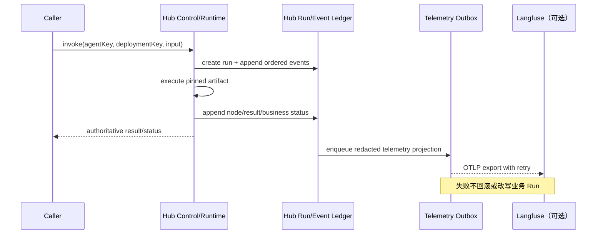
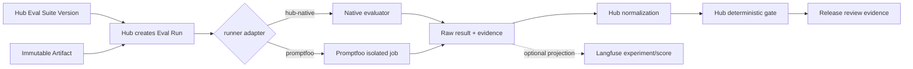

# Agent Studio：平台边界、证据集成与 Build-vs-Buy 决策

状态：**Canonical 架构决策与目标合同**；未标为“已实现”的内容均为规划，不代表当前环境已经安装或接通外部产品  
更新时间：2026-08-31  
适用范围：MX Insight Hub Internal 内的 Agent Studio、Agent 运行、评测、发布及其外部证据集成  
非目标：本文不安装依赖、不启动外部服务、不改变 MX-H2I 登录、联网、DNS、WireGuard、ProductNetwork 或 Launcher 发布链路

## 1. 决策摘要

MX Agent Studio 是 **Hub 业务 Data Agent 的受治理创作与产品控制面**。它负责把 Hub
已有的数据源、Schema、Mapping、清洗、质量、检索、Embedding、BI、发布与血缘能力，编译成
可审核、可追溯、不可变的 Agent 产品版本。它不是一个通用 LLM 工具的换皮页面，也不把
第三方 trace、prompt 或 eval 数据库升级为 Hub 业务事实。

本轮决策如下：

1. **继续自建 MX Agent Studio 的垂直业务控制面。** Agent、Draft、节点注册表、编译产物、
   Prompt、评测门禁、Release、Deployment 与业务 Run Ledger 的权威事实均在 Hub。
2. **Promptfoo 仅作为可替换的 eval runner 候选。** Hub 生成受控评测包，Promptfoo 执行后
   返回原始结果；Hub 负责归一化、判定、门禁与审计。它不能成为 Prompt、评测套件或发布状态的
   权威数据库。
3. **Langfuse 仅作为可选、非阻塞的观测与评测投影。** Hub 通过 OpenTelemetry/异步导出
   投射 trace、score 和成本视图。Langfuse 不运行 Agent，不决定业务 Run 成败，也不持有
   当前阶段的 Prompt 单一真相。
4. **mx-test-framework（MXT）仅作为独立黑盒质量证据边界。** 它面向部署后 UI/Electron
   外部行为；跨项目与 API 能力按 MXT 自身路线交付。它不理解 Agent 内部节点，不替代
   Studio 离线评测，也不在自身实现 Release Gate。
5. **暂不引入 LangSmith。** LangSmith 的 Studio、评测、Prompt、Agent Server 与 Deployment
   会同时覆盖我们正在定义的调试、运行、持久化、发布和部署边界。除非后续明确决定用
   LangSmith Agent Server/Deployment **替代** Hub 的相应控制面，否则不并行建设第二套权威系统。

核心不变量是：

> Hub owns product truth; runners execute; observability systems project; MXT supplies external evidence.

以及：

> Draft Prompt → compile-time resolved Prompt → immutable Artifact Prompt；生产运行时不得解析可变标签。

本文只定义平台边界和集成合同。Agent 生命周期与治理见
[Agent Studio 受治理生命周期](agent-studio-governed-lifecycle.md)，通用 definition/compiler、
LangGraph runtime 和 Hub 数据节点见
[Agent Studio 通用编排与 Hub 数据节点设计](agent-studio-langgraph-data-orchestration.md)。

## 2. 产品边界：Hub 造业务 Data Agent

### 2.1 Agent Studio 必须拥有的能力

Studio 负责把“业务意图”变成“Hub 可执行、可治理的数据产品”：

- 选择 Hub 已登记且当前主体有权使用的数据源、Dataset、Schema、Mapping 和工具；
- 通过版本化节点注册表组合确定性数据节点、受限 LLM 节点、分支、循环、并行和人工审批；
- 编辑 Prompt、输出 Schema、阈值、预算、失败策略和测试样例；
- 校验 typed ports、节点版本、权限、数据分级、预算和副作用边界；
- 编译不可变 Artifact，并把依赖的节点、Prompt、Schema、LLM Sequence 和策略全部钉死；
- 关联 Sandbox、离线 Eval、Release Review、Deployment 与业务 Run Ledger；
- 向 Agent Market 发布经过治理的产品说明，而不是把任意 Draft 当作可运行产品。

下列能力仍由 Hub Data Capability Pack 或确定性 worker 执行，而不是由画布“自动获得”：

- 数据接入、格式识别、Schema 推断、Mapping、清洗、质量、入库与血缘；
- 批量 ETL/ELT、CDC、重放、补偿和长时间确定性作业；
- PostgreSQL/Elasticsearch/Embedding/BI 等受治理访问；
- Hub Provider、LLM Sequence 与 Proxy 的凭据解析和实际路由。

LLM Provider、Proxy、LLM Sequence 是 **LLM 节点的执行配置**，不是业务流程节点。Studio
只引用获批的 `sequenceKey + revision`；运行时解析出的 effective provider/proxy 可以只读展示，
不得把密钥或可变路由写入 Draft。

### 2.2 明确不做

Studio 不承担：

- 通用代码托管、任意容器执行或用户上传代码的沙箱平台；
- 把 Source Catalog 的 metadata 自动解释为可导入、可查询或可执行能力；
- 用 OTel span 代替业务 Run/Event Ledger；
- 用外部 Prompt 标签在生产运行时热切换 Artifact 行为；
- 用一次 LLM judge 结果替代确定性质量门禁；
- 用 MXT 的 UI 黑盒通过结果证明 Agent 内部路径、数据质量或 Prompt 回归均正确；
- 为接入外部工具改造 Launcher/MX-H2I 的登录或网络边界。

### 2.3 产品界面与用户旅程落点

Studio 的主旅程仍是 Hub 产品旅程，而不是在多个外部产品之间跳转完成一次发布。每一阶段必须
先在 Hub 显示权威状态、摘要和下一步；外部系统只提供带来源标识的下钻证据。推荐的信息架构为：

```text
Agent Studio Portfolio
  → Project / Draft Build
  → Sandbox Debug
  → Eval
  → Release
  → Operate
```

| 阶段/视图 | Hub 主界面必须显示 | 外部能力落点 | 不得造成的错觉 |
| --- | --- | --- | --- |
| **Portfolio** `#/agent/studio` | 全部真实 Agent Project；名称、`agentKey`、Owner、业务域/data scope、risk class、tags、归档状态、最近 Draft/Artifact 状态；新建、管理、归档均修改 Hub 对象 | 无外部产品入口要求 | 不能把 Langfuse project、Promptfoo eval 或 MXT app 当成 Agent Project；未来 Release/Deployment 数量不能伪造 |
| **Build** Project/Draft detail | exact `draftId + draftRevision`、节点画布、typed ports、Prompt 编辑器、LLM Sequence、effective proxy 只读视图、compile diagnostics、保存/编译并发状态 | 默认无外部深链 | 没有 Run Event 时边保持中性；节点可拖拽不等于节点已安装/可执行；Compile 成功不等于已发布 |
| **Sandbox Debug** | exact Artifact/Run、输入 fixture、Hub ordered events、实际节点/边状态、checkpoint/approval、输出、预算、错误与重放入口 | 若对应 trace 已成功投射，可显示“在 Langfuse 查看高级 Trace”深链；旁边保留 projection 状态与 `traceId` | Langfuse 缺失/不可用不能让 Hub Run 显示“不存在”；外部 span 不能改写 Hub node/run 状态 |
| **Eval** | Eval Suite/version、Dataset/Evidence Set snapshot、exact Artifact、runner kind、case/metric 汇总、`failed` 与 `blocked` 分离、Hub gate policy snapshot 和最终 gate 结论 | Promptfoo runner 产生的结果显示为“Promptfoo 原始 Evidence”，可下钻 raw assertions/report；Langfuse experiment/score 只作为可选分析深链 | Promptfoo 的绿色页面或 exit code 不能直接显示“可发布”；Langfuse score 不能绕过 Hub normalized gate |
| **Release** | Candidate 的 Artifact hash、Prompt/node/schema 变更摘要、必需/可选证据、审批记录、policy snapshot、Release 状态 | MXT 只显示 `external-black-box` 卡片：`runRef`、source status、environment、observedAt、artifact digest 与只读链接；Promptfoo/Langfuse 仍以来源化证据链接呈现 | 不把 MXT Run 叫作 Studio Eval，不在 Hub 伪造 MXT case/step，也不让任何外部按钮直接发布 |
| **Operate** | Deployment key/revision、environment、实际 Artifact/Release、Hub 业务 Run 状态、失败/等待/审批、成本与 SLO 聚合、canary/rollback 审计 | 每个 Run 可深链 Langfuse trace；聚合页可深链 Langfuse dashboard。深链不可用时仍显示 Hub Ledger/SLO 与 projection degradation | Langfuse 不能成为启停、canary、rollback 或事故恢复控制面；MXT 不是实时健康探针 |

通用交互规则：

1. 外部下钻统一带产品名、external 标识、`observedAt` 和投影/证据状态，不能伪装成 Hub 原生页签。
2. Hub 页面先展示可审核的最小证据摘要与 digest，再提供链接；外部链接失效时，历史 Release
   仍能解释当时为何通过或被阻止。
3. Debug/Operate 的 Langfuse 入口仅在 `IntegrationReference.state=available` 时可点击；
   `pending/retrying/rejected/expired` 显示明确降级原因，不隐藏 Hub Run。
4. Eval 的 runner selector 可以选择 `hub-native` 或获批的 `promptfoo` adapter；选择 runner 不改变
   Suite、gate policy 或结果归一化页面。
5. Release 中 MXT 只通过 `BlackBoxEvidenceReader` 获取 snapshot；刷新证据会新增观察记录，不回写
   或覆盖 MXT Run。
6. P1 只应提供 Portfolio、Build、Save、Compile 与真实 diagnostics。Debug、Eval、Release、Operate
   若尚未交付，应显示准确的未来阶段/空状态，不生成示例 Run、trace、score 或部署数字。

## 3. 能力边界矩阵

图例：**Own** 为权威拥有；**Execute** 为受控执行；**Project** 为可丢弃投影；
**Evidence** 为外部证据；`—` 表示不是该系统职责。

| 能力 | MX Agent Studio / Hub | Promptfoo | Langfuse | LangSmith | MXT |
| --- | --- | --- | --- | --- | --- |
| 业务 Agent 目录与身份 | **Own** | — | — | 可拥有另一套 | — |
| 可视化图创作与节点治理 | **Own** | — | — | Studio/Fleet 有重叠 | — |
| Hub 数据节点与 typed ports | **Own** | — | — | 需自定义，不能替代 Hub 治理 | — |
| Draft / Compile / Artifact | **Own** | — | — | Agent Server/Deployment 有重叠 | — |
| Prompt 单一真相 | **Own** | 读取快照 | 可选只读镜像 | 有自有 Prompt 管理 | — |
| Agent runtime / checkpoint / HITL | **Own，按阶段交付** | 仅调用被测目标 | 明确不运行 Agent | Agent Server 可提供 | 仅调用已部署系统 |
| 业务 Run/Event Ledger | **Own** | 返回 eval 执行结果 | **Project** trace/score | 有自有 run/trace | Own MXT 自身测试 Run |
| OTel trace 分析 | 导出并保留关联 | eval 内可采集 | **Project** | 原生观测 | 测试工件，不是 Agent trace |
| 离线数据集/实验 | **Own** suite、版本、门禁 | **Execute** 候选 | 可选实验投影/辅助 | 有完整能力 | — |
| LLM 安全/红队 | 定义政策与接受结果 | **Execute** 候选 | 可记录 score | 可评测 | 仅外部黑盒场景 |
| Release / Deployment 决策 | **Own** | — | — | Deployment 有强重叠 | 不实现 gate |
| 跨项目 UI/Electron/API 黑盒 | 只引用结果 | — | — | — | **Evidence，按 MXT 路线交付** |
| Agent Market 产品发布 | **Own** | — | — | Fleet 是另一产品模型 | — |

### 3.1 为什么不是“选一个平台全部替代”

MX 的差异化不在通用 trace UI 或矩阵评测器，而在 Hub 数据契约：数据源、Schema、Mapping、
质量、血缘、权限和入库状态必须与 Agent 编译、执行、Release 使用同一套稳定身份和事务事实。
外部 AI engineering 产品可以显著减少非差异化建设，但不能无损接管这些 Hub 业务边界。

反过来，Hub 也不应重复建设成熟的 trace 查询 UI、通用 LLM 红队样例库或黑盒浏览器测试平台。
因此采用窄适配器，而不是双向复制所有对象。

## 4. 权威数据、身份与安全

### 4.1 权威数据表

| 事实 | 唯一权威 | 允许的投影/引用 | 禁止 |
| --- | --- | --- | --- |
| Agent 项目、Owner、risk class、tags | Hub PostgreSQL | 搜索/BI 投影 | 外部平台反向覆盖 |
| Draft definition 与 revision | Hub PostgreSQL | 编辑器缓存 | 外部 Prompt/UI 直接改生产 Draft |
| Node/Tool manifest 与安装状态 | Hub Registry | 前端目录 | Catalog metadata 充当执行许可 |
| Prompt 作者态 | Hub Draft node config | Langfuse 只读镜像（未来可选） | 多处可编辑双写 |
| 编译 Prompt 与依赖 | Hub immutable Artifact | eval bundle、trace metadata | runtime 使用 mutable label |
| Eval Suite 与 gate policy | Hub versioned objects | Promptfoo/Langfuse runner input | runner 自己决定 Release |
| Eval 原始结果 | 原执行器原始工件 + Hub 内容摘要 | Langfuse 分析投影 | 只保留第三方 URL |
| 归一化 Eval 结论 | Hub Evaluation Ledger | Release review | 第三方状态直接当门禁 |
| Release/Deployment | Hub immutable records | 操作视图 | 从外部 UI 绕过审批 |
| Agent Run/Event | Hub Run/Event Ledger | Langfuse/OTel | span 反向修正业务状态 |
| MXT Run/Case/Step | MXT | Hub 保存 external evidence ref/snapshot | Hub 改写 MXT 历史 |

PostgreSQL 继续保存产品事实；Elasticsearch、Langfuse 和其他分析存储均可重建或重新投射。
任何外部 URL 都不能成为保留 Release 审计所需内容的唯一位置。

### 4.2 人、服务与运行主体

身份边界延续 Hub 现有模型，不为任一外部工具新增旁路：

1. **Studio 作者/审批者**：使用现有 Hub Internal 会话。只有 `admin-token` 会话可以修改；
   `platform-admin` 按当前 Agent Studio 约束为只读。角色细化必须在 Hub-local authorization 中演进。
2. **Agent 调用者**：使用 Hub Consumer/API Key 或后续明确的内部服务身份；权限仍以 Hub
   tenant、platform grant、capability 和 quota 判定。
3. **Runtime principal**：由 Hub 在接受调用后派生，携带最小租户、Agent、Artifact、Dataset
   与工具 scope；不能转发原始浏览器会话或 Launcher token。
4. **集成服务身份**：每个 Langfuse exporter、Promptfoo runner、MXT reader 使用独立、可轮换、
   最小权限凭据。凭据只进入 secret store/运行环境，不进入 Draft、Artifact、trace、eval bundle 或日志。

### 4.3 数据最小化与 fail-closed

- 导出前按节点 manifest 与数据分级做字段 allowlist、脱敏、截断和采样；默认不导出完整原始文档、
  Prompt 中的动态敏感输入、工具凭据或模型密钥。
- Artifact 只保存 secret reference 和所需 capability，不保存 secret value。
- Promptfoo eval bundle 使用专用 fixture/snapshot，不默认读取生产 Dataset；需要真实数据时必须有
  显式数据授权、冻结的 evidence set 与保留策略。
- Langfuse 部署在何处不改变 Hub 的数据出境判定；即使 self-host，也需按独立数据接收方治理。
- 脱敏或授权无法判定时，**拒绝该次导出/评测任务**，但不能因此把已经成功的业务 Agent Run
  改成失败。
- 任何外部工具都不得获得 Hub Admin Token、Launcher token、Consumer 明文 API Key 或
  LLM Provider 明文凭据。

## 5. Prompt 单一真相

### 5.1 当前规范

Prompt 必须经历以下单向状态转换：

```text
Draft node.config.prompt
  --save with expected draftRevision-->
versioned Draft Prompt
  --compile, resolve and normalize-->
Artifact Prompt + promptDigest
  --run/evaluate/release-->
exact Artifact Prompt only
```

规则：

1. 作者只在 Hub Draft 中编辑 Prompt。每次保存创建/推进可审计的 `draftRevision`。
2. Compile 必须解析模板变量声明、输出 Schema、工具说明、系统前缀和 LLM Sequence revision，
   生成规范化内容与 `promptDigest`；解析不完整则编译失败。
3. Artifact 保存运行所需的精确 Prompt 内容或不可变内容寻址引用，并把 digest 纳入
   `artifactHash`。Artifact 创建后不可修改。
4. Sandbox、Eval、Release 和 Production Run 必须报告实际 `artifactId`、`artifactHash`、
   `nodeId` 与 `promptDigest`。
5. 修改 Prompt 必须产生新 Draft revision，再编译新 Artifact；不能原地更新已发布版本。

### 5.2 Langfuse Prompt Management 的边界

Langfuse 支持 Prompt 版本、标签与缓存，但当前决策是 **不把它设为写入权威**：

- 可把 `promptDigest`、安全预览、变量 Schema 与 Artifact 关联投射到 Langfuse，便于 trace 分析；
- Langfuse UI 中的修改不回写 Hub，不改变运行中的 Artifact；
- Hub runtime 不按 `production`、`latest` 等可变标签抓 Prompt；
- 投影失败不影响编译、运行或发布事实。

若未来 ADR 允许外部 Prompt authoring，必须同时满足：

1. Draft 只引用不可变的外部 `promptName + exactVersion + contentDigest`，禁止引用可变标签；
2. Compile 拉取一次、校验 digest、保存规范化快照，运行时不再联网解析；
3. 外部版本变化只能通过显式 import 生成新的 Hub Draft revision；
4. 冲突采用 optimistic concurrency，禁止 last-write-wins 双写；
5. Release 仍只审批 Hub Artifact，不审批外部可变对象。

### 5.3 Promptfoo 的边界

Promptfoo 接收从 Artifact 与 Eval Suite 导出的只读评测包。包内 Prompt 必须带
`artifactHash + nodeId + promptDigest`；Promptfoo 配置文件只是一份 runner input，不能被重新导入为
生产 Prompt。其 Web UI/分享结果也不是 Hub Prompt 的编辑面。

## 6. 从 Build 到 Operate 的数据与证据流

### 6.1 Build 与 Compile

1. Hub 加载 `Agent Project + exact Draft revision + Node Registry snapshot`。
2. 作者在权限内编辑节点、Prompt、typed edges、预算和策略。
3. Save 使用 `expectedRevision`，冲突返回明确的 revision conflict，不静默覆盖。
4. Compile 验证图结构、端口、节点实现、权限、Prompt、Schema、LLM Sequence、预算与副作用策略。
5. 成功后创建不可变 Artifact；失败只产生 compile diagnostics，不产生“半成功” Artifact。
6. Build 画布没有运行事件时边保持中性；不得用动画暗示节点已经执行。

### 6.2 Run 与 Trace



Hub Run/Event Ledger 必须满足：

- `runId` 全局稳定；每个 Run 内的事件必须唯一、有序、幂等；
- 节点尝试按 `(runId, nodeId, attempt)` 定位；
- 业务状态、审批中断、预算消耗、工具调用结果和最终输出以 Ledger 为准；
- `traceId` 仅作关联，不是产品身份；外部 span 缺失不影响回放权威事件；
- OTel exporter 只读取已提交 outbox，进行脱敏、采样、批量发送与重试。

### 6.3 Offline Eval 与 Promptfoo runner



评测合同：

1. Hub 钉死 `artifactHash`、`evalSuiteId + evalSuiteVersion`、Dataset/Evidence Set snapshot、
   evaluator versions、runner kind、预算和超时，创建 `evalRunId`。
2. `EvaluationRunner` 接收一次性、内容寻址、最小权限的 job；实现可以是 `hub-native` 或
   `promptfoo`，调用者不依赖 runner 私有对象模型。
3. runner 输出原始 case 结果、assertion、metric、耗时、token/cost、错误类别和工件摘要。
4. Hub 校验 job identity 与内容摘要，保存原始工件引用，并转换成版本化的 normalized result。
5. Hub gate engine 按创建时冻结的 policy snapshot 判定 `passed/failed/blocked`；runner 的 UI
   颜色、共享链接或进程 exit code 不能直接发布 Agent。
6. 重跑必须创建新的 `evalRunId`，不能覆盖历史；同一提交使用 idempotency key 去重。

Promptfoo 可以替换评测执行器，但不能替换 Hub 的 Eval Suite、Evaluation Ledger、gate policy 或
Release Review。这样既能利用其 assertion、矩阵比较、CI 与红队能力，也避免将核心生命周期绑死在
其 YAML、SQLite/Enterprise server 或私有 result schema 上。

跨项目复用应发生在无状态的 runner image、`EvaluationJob/RawEvaluationResult` 协议和底层
CI/Job 基础设施，而不是把 Hub Eval 移入 MXT。其他产品可以由各自控制面提交自己的不可变评测包，
并取回自己的结果；runner 不保存跨产品 Suite、数据集、Prompt 或 gate 状态。若未来需要共享一套
Job substrate，必须另立 ADR，继续隔离产品数据库、服务身份与敏感 payload。

### 6.4 MXT 黑盒证据

MXT 是独立兄弟平台，定义已部署应用的浏览器/Electron 黑盒路径；跨项目与 API 支持仍按其
路线交付。其权威模型、状态、当前交付范围和 runner 合同以
[`mx-test-framework/specs`](../../../mx-test-framework/specs/README.md) 为准；本文不复制 MXT 的
控制 API、case catalog 或工件格式。

边界如下：

- Studio 可以为某个 Release/Deployment 保存 `mxtRunId`、测试环境、MXT 结果摘要、工件 digest
  和只读链接，标记为 `external-black-box` 证据；
- MXT 不接收 Draft，不编译 Artifact，不观察 Agent 内部节点，也不修改 Hub Release；
- MXT 明确不自身实现 release gate。未来 Hub release policy 可以声明“需要一份满足条件的 MXT
  证据”，但 gate 判定仍由 Hub 使用冻结政策完成；
- MXT 的 `blocked`、`timeout`、`expired` 或零测试不是通过；缺少证据是 `unavailable`，只有政策
  明确要求时才阻止晋级；
- Agent 内部 Prompt/trajectory/data-quality eval 与 MXT 黑盒测试互补，任何一方都不能替代另一方。

### 6.5 Release 与 Deployment

1. Candidate Release 只引用不可变 `artifactId/artifactHash`、合格的 Hub `evalRunId` 集合、
   policy snapshot 和必要的外部证据快照。
2. 审批者看到的 Langfuse/MXT 链接是下钻入口；关键结论、digest、时间和状态必须保存在 Hub。
3. Approval 生成不可变 Release；Deployment 把 exact Release 提升到 exact environment/revision。
4. Deployment 不解析 Draft、可变 Prompt 标签或 runner 配置。
5. Canary/rollback 只切换 Hub 记录的 Deployment revision；历史 Run 始终指向实际 Artifact。

## 7. 稳定身份与接口

### 7.1 Hub 产品 ID

| ID | 稳定性与用途 |
| --- | --- |
| `agentKey` | 人类可读、全局稳定且不复用；重命名仅改 display name |
| `draftId` | Draft 身份；修改通过单调 `draftRevision` 并发控制 |
| `artifactId` | 一次成功编译的不可变产品对象 |
| `artifactHash` | 规范化图、Prompt、节点、Schema、策略与依赖的内容摘要 |
| `promptDigest` | 某 Artifact 节点实际 Prompt 的内容摘要；不单独授权运行 |
| `evalSuiteId` / `evalSuiteVersion` | 评测意图与不可变版本 |
| `evalRunId` | 一次冻结输入上的评测执行，重跑不复用 |
| `releaseId` | 一次不可变审批结果 |
| `deploymentKey` / `deploymentRevision` | 环境槽位与其单调变更版本 |
| `runId` | 一次业务 Agent 调用的权威身份 |
| `(runId, seq)` | Ledger 事件的唯一、有序键 |
| `(runId, nodeId, attempt)` | 节点执行尝试的稳定定位 |

ID 规则：

- 业务 ID 不使用外部产品 ID，也不把 `traceId` 当主键；
- 展示名称可改，稳定 key/ID 不改、不回收、不复用；
- 所有创建/提交接口接受 idempotency key；所有更新接受 `expectedRevision`；
- 内容摘要必须包含 `contractVersion`，规范化算法变更时升版本，不能悄悄改变 hash 语义。

### 7.2 外部关联不是身份

Hub 只保存如下概念关联，不让外部 ID 污染领域对象：

```text
IntegrationReference {
  integrationKind,
  integrationConfigRevision,
  localObjectType,
  localObjectId,
  externalObjectType,
  externalObjectId,
  externalUrl?,
  contentDigest?,
  observedAt,
  state
}
```

例如 Langfuse `traceId`、Promptfoo `evalId`、MXT `runId` 都只能出现在
`IntegrationReference` 或证据记录中。删除投影、迁移实例或轮换 project key 后，Hub 产品 ID
仍保持有效。

### 7.3 三个窄接口

本文定义语义接口，不规定当前代码语言或要求立即实现：

#### `TelemetryExporter`

- 输入：已提交的、版本化 `TelemetryEnvelope`，至少包含 `runId`、`artifactHash`、事件范围、
  `traceId`、redaction profile revision 与 payload digest；
- 输出：`accepted`、`retryable` 或 `rejected`，附外部关联；
- 语义：at-least-once 发送，接收方按 event identity/digest 幂等；不得阻塞业务完成路径。

#### `EvaluationRunner`

- 输入：不可变 `EvaluationJob`，至少包含 `evalRunId`、Artifact/Eval Suite/Data snapshot、
  evaluator manifests、budget、deadline、callback token 与 input digest；
- 输出：版本化 `RawEvaluationResult` 与工件摘要；
- 语义：可轮询或回调；回调必须验签、幂等，并拒绝 identity/digest 不匹配；runner 不产生 gate。

#### `BlackBoxEvidenceReader`

- 输入：外部 system kind + stable external run reference；
- 输出：按适配器版本归一化的只读状态、case 摘要、工件 digest、时间和源链接；
- 语义：只读、可缓存、带 `observedAt`；源不可用时返回 `unavailable`，不得猜测结果。

适配器内部可以识别 Langfuse/Promptfoo/MXT 的版本差异；Studio 领域层只依赖上述稳定 envelope。

## 8. 失败语义

### 8.1 必须区分的失败层级

| 场景 | Hub 业务 Run | Eval Run / Evidence | Release 影响 |
| --- | --- | --- | --- |
| Agent 节点业务错误 | 按 Artifact 策略 `failed`/补偿/等待 | 可作为被测输出 | 按 gate policy |
| Hub Ledger 提交失败 | 不得报告成功；重试或失败 | — | 无有效证据 |
| Langfuse/OTel 不可用 | **不改变已提交 Run** | projection `degraded/pending` | 默认不阻止 |
| 导出脱敏失败 | Run 不变；拒绝导出并告警 | projection `rejected` | 默认不阻止 |
| Promptfoo 断言不通过 | Run（若有）保持原状态 | eval `failed` | gate 不通过 |
| Promptfoo 基础设施/适配器失败 | Run 不变 | eval `blocked` | 不得视为通过 |
| Eval 零 case / suite 无效 | Run 不变 | eval `blocked` | 不得视为通过 |
| Eval 超时/取消 | Run 不变 | `timed-out/cancelled` | 不得视为通过 |
| MXT 测试失败 | Agent Run 不变 | external evidence `failed` | 仅按冻结政策 |
| MXT blocked/expired/不可达 | Agent Run 不变 | `blocked/expired/unavailable` | 要求该证据时阻止；否则提示 |
| 外部回调重复 | 不重复写结论 | 返回已有结果 | 不重复推进 |
| 外部回调 digest/identity 冲突 | 不改既有事实 | `rejected` + security event | 不推进 |

### 8.2 状态规范

- Eval 执行状态至少区分：`queued`、`running`、`passed`、`failed`、`blocked`、
  `timed-out`、`cancelled`。
- `failed` 表示被测行为不满足断言；`blocked` 表示没有获得可信测试结论。两者都不是通过，
  但必须分别呈现，便于判断产品回归还是基础设施问题。
- Telemetry projection 状态至少区分：`pending`、`exported`、`retrying`、`rejected`、`expired`；
  其状态不复用 Agent Run 的成功/失败枚举。
- External evidence 记录必须保存 `sourceStatus` 与 Hub 归一化 `evidenceStatus`，避免外部升级后
  丢失原始含义。
- 超过重试与保留窗口的 trace 投影可以进入 dead-letter/expired；业务 Ledger 与 Release 审计
  仍必须完整。

## 9. Build-vs-Buy ADR

### 9.1 Context

我们需要同时解决 Agent 创作、Hub 数据能力治理、运行可见性、离线评测、发布门禁与跨项目
黑盒验证。LangSmith、Promptfoo、Langfuse 和 MXT 存在能力交集，但它们的产品身份、运行边界、
部署模型与权威数据不同。若直接把多个 UI/数据库串联，会产生 Prompt 双写、Run 状态冲突、
Release 无法重放和凭据外泄风险。

### 9.2 Decision

采用“**自建垂直控制面 + 购买/采用窄横向能力**”：

| 选择 | 决策 | 理由 |
| --- | --- | --- |
| MX Agent Studio | **Build** | Hub Data Agent、typed registry、compile contract、数据权限和 Release 是差异化核心 |
| Promptfoo | **Evaluate/Adopt as replaceable runner** | 开源、本地/CI 友好、assertion 与红队成熟；不让其持有领域真相 |
| Langfuse | **Evaluate/Adopt as optional projection** | OTel trace、score、dataset/experiment UI 与自托管能力可减少非核心建设；明确不运行 Agent |
| MXT | **Reuse as sibling black-box evidence** | 复用其独立黑盒控制面/证据合同；跨项目与 API 能力按 MXT 路线交付，职责不复制进 Studio |
| LangSmith | **Defer / do not introduce now** | Studio + Prompt/Eval + Agent Server/Deployment 与未来 Hub runtime/release/deploy 强重叠；self-host 平台为 Enterprise 方案 |

### 9.3 被否决的替代方案

1. **全部自建 observability/eval/test UI**：重复成熟通用能力，维护面过大；否决。
2. **Langfuse 同时做 Prompt 权威和 trace 权威**：会破坏 Artifact 的 compile-time pinning，并让
   外部可变标签改变生产行为；当前否决。
3. **Promptfoo server 作为生产评测控制面**：官方基础 self-host server 使用 SQLite、无内建
   auth/RBAC、不可水平扩展且不建议生产；即便采购 Enterprise，也不应让 runner 接管 Hub gate；否决。
4. **同时建设 Hub runtime 与 LangSmith Agent Server/Deployment**：线程、run、checkpoint、队列、
   Studio、部署和身份形成双控制面；否决。
5. **用 MXT 作为统一 Agent eval/gate**：MXT 是黑盒系统测试，不拥有内部节点 trajectory、Prompt
   版本或数据质量语义，且规范明确不实现 release gate；否决。

### 9.4 何时重新开 ADR

满足任一条件时重新评估，而不是悄悄扩展适配器：

- 团队明确准备让 LangSmith Agent Server/Deployment 替代 Hub 通用 runtime、checkpoint、队列或部署；
- Langfuse 需要从非阻塞投影升级为 Prompt/experiment 写入权威；
- Promptfoo job/result contract 无法通过版本化适配器隔离，或采购 Enterprise 控制面；
- Release policy 要把 MXT 证据变成强制条件；
- 数据驻留、RBAC、审计、许可成本或运维负担使现有选择不再成立；
- 实测规模表明 Hub Ledger → OTel outbox 或 eval artifact 保留模型需要重构。

## 10. 阶段路线

每一阶段都是可独立验收的增量，不把后续产品能力伪装成当前可用。

### P1：Hub-owned Build / Compile

- 固化 Agent Project、Draft、Node Registry、Prompt、Compile Diagnostics 与 Artifact 合同；
- Prompt 可编辑，LLM Sequence 可选择，effective proxy 只读；
- 保存与编译使用 revision/idempotency；Artifact 钉死 Prompt 与依赖；
- UI 对 Sandbox/Eval/Release/Deploy/Market 发布明确标注未来态；
- **不引入 LangSmith、Promptfoo 或 Langfuse 运行依赖。**

### P2：本地运行与证据内核

- 建立 Hub Run/Event Ledger、ordered event、Artifact-pinned sandbox 与 native deterministic eval；
- 定义 `TelemetryEnvelope`、`EvaluationJob/Result`、证据/工件摘要和 redaction profile；
- 先用 in-process/no-op adapter 验证边界，外部不可用不得影响业务 Run；
- 明确 Eval `failed` 与 `blocked`，实现 Hub gate policy snapshot。

### P3：可替换横向能力试点

- 在 feature flag 后做 Promptfoo runner spike，使用隔离 job、固定版本与专用 fixture；
- 在 feature flag 后做 Langfuse self-host 评估，只接 OTel/redacted projection；
- 验证 outbox 重试、幂等、采样、数据驻留、删除/保留、成本和故障注入；
- 不开放 Langfuse Prompt 回写，不让 Promptfoo/Langfuse 直接推进 Release。

### P4：Eval / Release / Operate

- 上线版本化 Eval Suite、Experiment/Eval Run、人工标注接口与 Release Review；
- 允许 policy 组合 native/Promptfoo 归一化结果；Langfuse 仅作下钻与分析；
- 通过 `BlackBoxEvidenceReader` 只读关联 MXT；默认可选，强制门禁需独立 ADR；
- 上线 canary、rollback、deployment revision 与 SLO/成本视图。

### P5：规模化与重新选型

- 根据真实 trace 量、eval 吞吐、跨团队协作、许可和运维数据决定是否扩大 Langfuse/Promptfoo；
- 只有通过新 ADR，才考虑 LangSmith 替代某一整层；不得仅为了 UI 并行接入另一套 Agent identity；
- 评估跨区域数据保留、长期 memory、Temporal 外层可靠流程和 Market 治理。

## 11. 验收清单

在任何外部集成进入生产前，必须逐项证明：

- [ ] 一个业务 Agent 只有一个 `agentKey`，外部 ID 仅为关联；
- [ ] Studio、Eval 与集成管理 API 只存在于 `/internal/v1/admin/agent-studio/*`；public listener 对相同路径始终返回 `404`；
- [ ] 一个生产 Run 可以仅凭 Hub Artifact/Ledger 解释，无需访问 Langfuse/Promptfoo/MXT；
- [ ] Prompt 修改一定产生新 Draft revision 与新 Artifact hash；
- [ ] 生产 runtime 不解析 `latest`/`production` 等外部可变 Prompt 标签；
- [ ] Langfuse 完全不可用时，已提交的业务 Run 仍可成功、查询和回放；
- [ ] Promptfoo 不可用、零 case 或基础设施失败被标为 `blocked`，从不变成 `passed`；
- [ ] Promptfoo 只能用短期、eval-scoped 身份调用 Hub evaluation invoke，并传 exact LLM Sequence revision；不能选择 Provider/Proxy、直连模型端点或获得 Provider 凭据；
- [ ] runner 原始结果和 Hub normalized gate 均可追溯到 exact Artifact/Eval Suite/Data snapshot；
- [ ] MXT 结果只作为 `external-black-box` 证据，不被描述为 Agent 内部评测；
- [ ] 外部凭据、Hub Admin Token、Launcher token、Consumer 明文 API Key 不进入任何 payload/trace；
- [ ] 回调重复、乱序、超时、digest 冲突和外部删除均有确定性语义；
- [ ] 所有 Release 决策使用冻结 policy snapshot，并保留关键证据摘要；
- [ ] 接入不修改 MX-H2I 用户登录、联网、DNS、WireGuard 或 ProductNetwork。

## 12. 外部能力依据（2026-08-31 核对）

这些链接只用于支持选型判断，不改变上文 Hub 合同的权威性：

- LangSmith 官方将平台描述为 observability、evaluation、prompt engineering，并可选
  Deployment；Self-host/BYOC 属 Enterprise 方案：
  [Platform setup](https://docs.langchain.com/langsmith/platform-setup)、
  [Self-hosted LangSmith](https://docs.langchain.com/langsmith/self-hosted)。
- LangSmith Studio 是面向 Agent Server 协议的可视化、交互和调试 IDE；Agent Server 自带
  assistants、threads、runs、persistence 与 task queue：
  [LangSmith Studio](https://docs.langchain.com/langsmith/studio)、
  [Agent Server](https://docs.langchain.com/langsmith/agent-server)。
- Promptfoo 官方定位为开源 CLI/library，用于 LLM app eval 与 red team，可在本地/CI 执行；
  基础 self-host server 明确不建议用于生产，缺少多团队、RBAC、认证和水平扩展：
  [Promptfoo intro](https://www.promptfoo.dev/docs/intro/)、
  [Self-hosting](https://www.promptfoo.dev/docs/usage/self-hosting/)、
  [Tracing](https://www.promptfoo.dev/docs/tracing/)、
  [Prompt configuration](https://www.promptfoo.dev/docs/configuration/prompts/)。
- Langfuse 官方说明其覆盖 agent workflow tracing、Prompt 版本、eval 与 experiment，支持
  self-host；同时明确 **不托管或运行 Agent**：
  [Capability clarifications](https://langfuse.com/resources/engineering/clarifications)、
  [Self-hosting](https://langfuse.com/self-hosting)、
  [Observability data model](https://langfuse.com/docs/observability/data-model)、
  [Prompt management](https://langfuse.com/docs/prompt-management/overview)。

外部产品能力、许可和部署条件会变化。每次从试点进入生产，必须固定实际版本、许可证、部署拓扑、
数据驻留和安全评审结论，不以本文日期的网页描述代替上线验收。

## 13. 相关内部设计

- [Agent Studio 受治理生命周期](agent-studio-governed-lifecycle.md)
- [Agent Studio 通用编排与 Hub 数据节点设计](agent-studio-langgraph-data-orchestration.md)
- [Agent Market advanced-search dry run](agent-market-advanced-search.md)
- [Trust and runtime boundaries](trust-runtime-boundaries.md)
- [Unified identity and platform modules](unified-identity-and-platform-modules.md)
- [BI and Data Agent evolution](bi-and-data-agent-evolution.md)
- [MXT 设计入口](../../../mx-test-framework/specs/README.md)
- [MXT scope](../../../mx-test-framework/specs/00-overview-and-scope.md)
- [MXT standalone-platform ADR](../../../mx-test-framework/specs/adr/0001-standalone-platform.md)
