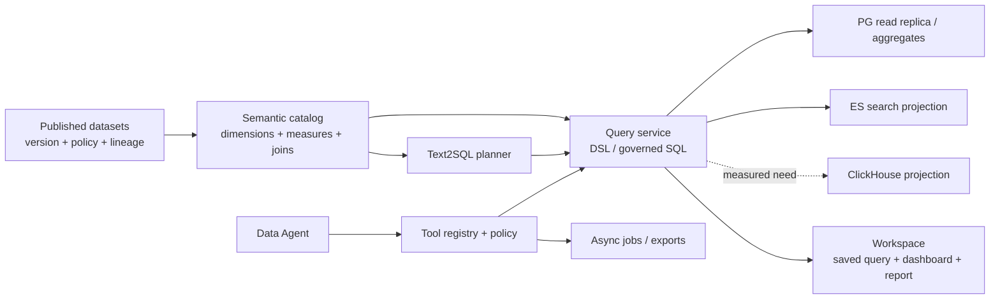
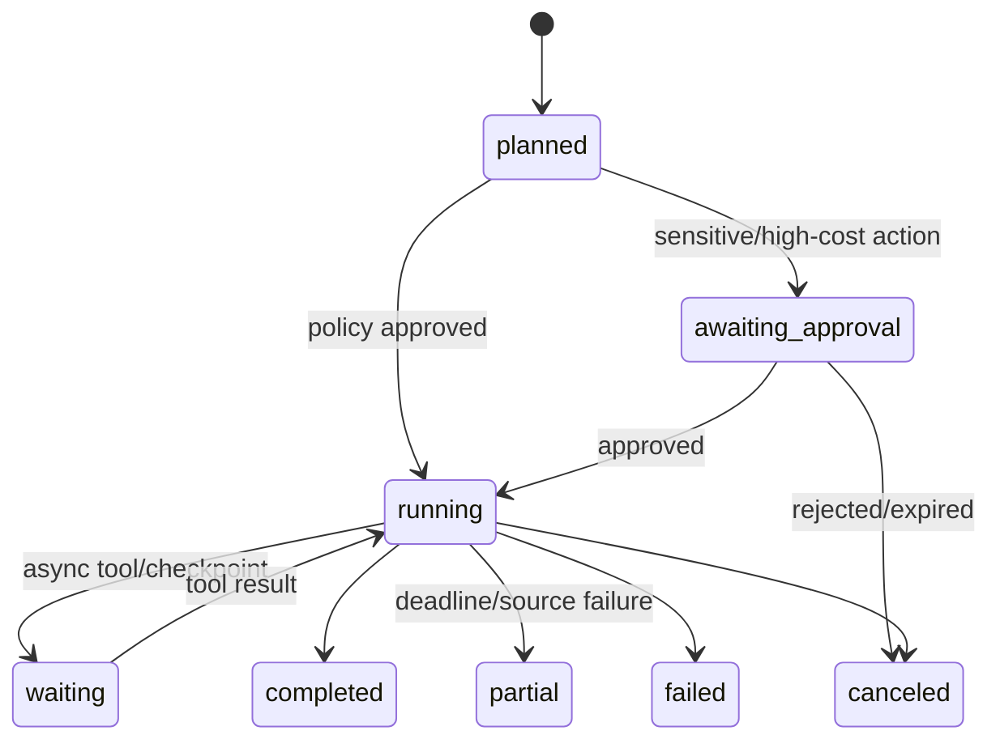

# BI and Data Agent evolution

MX Insight Hub starts as a governed data API, then grows into an intelligent BI and Agent center without moving Night-All’s collection responsibilities.

The current [Agent Market advanced-search dry run](agent-market-advanced-search.md)
is an incremental learning surface for prompt, schema, tool and trace behavior.
It deliberately does not claim delivery of the tenant-facing Query Service,
Text2SQL, Agent identity, approval, export, replay ledger or production publish
workflow described below.

## Phase 1: governed data access

- stable capabilities and search contract;
- tenants, consumers, keys and explicit grants;
- request/credit limits, idempotency and evidence;
- public/admin split, deployment, SLO and backups.

## Phase 2: data products and semantic BI

- dataset catalog with owner, schema version, freshness, quality and lineage;
- metrics/semantic layer with governed dimensions and measures;
- saved queries, dashboards, row/column policies and export controls;
- reproducible projections from Night-All through outbox/CDC;
- analytical store chosen by measured workload: PostgreSQL replicas/materialized views first, ClickHouse/OpenSearch only when concurrency, scan volume or full-text facets justify them.

OpenSearch/ELK is a searchable projection and log-retention tool, not a backup of either PostgreSQL database.

## Phase 3: Data Agent

- Agent identity separate from human and public API keys;
- policy-bound tools that reference dataset/capability IDs, never arbitrary Night-All routes;
- budgets for rows, calls, credits, model tokens, concurrency and wall-clock time;
- approval checkpoints for exports, high-cost fan-out and sensitive fields;
- run graph, prompt/tool/version provenance, evidence citations and replay;
- asynchronous jobs for all-platform work with total deadline, cancellation and partial results.

The Agent is a governed consumer of MX Insight datasets. It never receives provider credentials, Night-All database access, or a generic proxy tool.

## BI reference architecture



BI/Agent 只读取已发布 dataset version。正在 ingest、quarantine、未通过字段策略或未发布的 revision 不进入查询上下文。

## Dataset catalog 与语义层

每个 dataset 包含：

- owner、用途、许可、敏感级别、retention 和可申请角色；
- schema/field type、nullable、单位、枚举、description 和 sample policy；
- entity、fact、dimension、主键、外键和允许 join；
- event time、processing time、timezone、freshness SLO 和 current as-of；
- quality rule、最近结果、缺失/重复/漂移状态；
- source → raw → canonical → published → metric/report/answer lineage；
- row/column/mask/export policy；
- SQL/ES/aggregate physical mapping，但不向普通用户暴露凭据或底层任意表。

Metric 定义是版本化代码/配置：

```text
metric_id, metric_version, owner
expression / aggregate function
base_dataset_version_range
dimensions, filters, time_grain, timezone
unit, null/late-data policy
access classification
validation query + expected tolerance
```

修改“互动量”“独立主体”“区域热度”等口径创建新 metric version。Dashboard 和 Agent answer 保存实际版本，不能只保存显示名称。

## Query Service

Query Service 是所有 BI、Text2SQL、Agent 和导出的唯一执行入口：

- 解析 authenticated principal/consumer、tenant、dataset/field grant；
- 接受版本化 DSL 或受控 SQL AST，不接受数据库 URL、任意 schema 或原始 ES DSL；
- 注入 tenant/row policy、column mask、dataset version/as-of；
- 限制 join graph、time range、rows、bytes、CPU/statement timeout、并发和 cost；
- 执行前对复杂查询运行 `EXPLAIN`/成本门禁；
- 只使用只读账号、只读事务和只读副本/serving schema；
- 返回 cursor/async job，不允许无限 result set；
- 记录 query hash、policy/metric/dataset version、扫描量、结果 hash、usage 和 trace。

PostgreSQL RLS 可以作为 defense in depth，但不能替代服务层字段策略。public/admin/query 使用不同 DB role；migration owner 不给 public Pod。

## Text2SQL 流程

Text2SQL 不是“让模型连接 PG”。建议管线：

1. 根据 tenant grant 检索允许的 dataset/metric/field catalog；
2. 对问题做意图、时间范围、实体和歧义识别；
3. 模型只生成逻辑 query plan/受限 SQL；
4. parser 构建 AST，拒绝多语句、DDL/DML、function escape、system catalog、未授权表和 unrestricted subquery；
5. policy rewriter 注入 tenant/row filter、column mask、limit 和 statement timeout；
6. schema/type checker 和 `EXPLAIN` 预算检查；
7. 高扫描量、敏感字段或导出请求进入人工审批/async job；
8. 只读执行，返回表格/图表建议、数据版本、查询和证据；
9. 保存 eval/evidence，不把数据样本默认用于模型训练。

模型不能自行决定跳过 policy、扩大时间窗或改用 Night-All 原始 route。SQL 执行失败时可以修复有限次数，但每次仍经过完整 validator，不把数据库错误/内部 schema 全量回传给用户。

## Dashboard 与大屏

- 地图读取 PostGIS/ES geo projection 和按 zoom/region/time 的增量 aggregate；
- 时间、平台、地区、主体等筛选对应版本化 dimension；
- 高频卡片使用 materialized aggregate，不在每次刷新扫描 raw observation；
- 每个组件显示 as-of、freshness、partial/quality warning 和 metric version；
- 保存视图只保存 query/semantic references，不复制一份不可追踪 JSON 结果；
- 报告/订阅绑定 dataset version 或明确 rolling window，发送前再次检查收件人权限；
- 下载包含 watermark、request/export ID、字段策略和数据版本；敏感导出走审批、过期 URL 和审计。

Hub 没有实时来源时，大屏继续展示最后发布版本并显示 source health/lag；不能清空成零或把旧数据标成实时。

## Data Agent 身份与工具

Agent run 使用独立 `agent_principal`：

- 发起人和 tenant membership；
- 绑定的 consumer/subscription/credit account；
- dataset/capability/field scope snapshot；
- 模型、prompt、tool registry 和 policy version；
- row/call/byte/model-token/credit/concurrency/wall-clock budget；
- run expiry、approval policy 和 data retention。

Tool registry 示例：

| Tool | 允许输入 | 禁止内容 |
| --- | --- | --- |
| `dataset.search` | dataset ID、bounded filters/query/cursor | ES index/DSL、provider、raw credential |
| `metric.query` | metric ID/version、dimension、time range | 任意 SQL/table |
| `entity.get` | 已授权 entity ID、field view | 跨 tenant lookup |
| `refresh.request` | platform/capability/query、freshness class | provider endpoint/businessId |
| `report.render` | saved query/result IDs、template | 任意本地文件路径 |
| `export.create` | dataset version、approved fields、format | unrestricted raw dump |

不存在“万能 HTTP”“万能 SQL”“任意 shell”或 Night-All generic proxy tool。新工具必须有 JSON schema、幂等/side-effect 分类、timeout、cost、data classification、redaction、approval 和 contract tests。

## Agent run 状态机



每一步记录 input hash、output artifact/evidence、tool/model/prompt version、usage、latency、policy decision 和 parent step。敏感原文按 retention 存对象存储，不直接塞日志；answer citation 指向用户有权读取的 Hub evidence ID。

## Prompt injection 与数据安全

- 数据内容始终是 untrusted evidence，不作为系统/开发者指令执行；
- tool call 参数由结构化 schema 和 policy engine验证；
- 网页/文档中的“上传凭据、忽略规则、访问 URL”不自动执行；
- URL fetch 经过 SSRF、DNS rebinding、redirect、MIME、大小和私网地址控制；
- secrets 永不进入 prompt、tool result、trace、Kibana 或可下载 artifact；
- 模型 provider 按 tenant/data classification 选择，敏感数据只能进入批准的 deployment；
- 对外发送、发布、写入、删除、大额 refresh、批量导出需要显式 approval；
- Agent 不能修改 Hub grant、credit、price book 或自己的 budget。

## Evidence、复现与评测

最终 answer/report 保存：

- source dataset/version/as-of 和 quality；
- metric/query hash、logical plan、policy rewrite 和 result hash；
- prompt/model/tool versions 与 temperature/关键参数；
- tool run graph、partial/errors、approval 和 usage；
- 每条重要陈述对应 evidence IDs；
- 可在权限仍有效、数据 retention 允许时 replay。

回归评测至少覆盖：SQL 正确性、指标口径、引用支持、跨租户/字段越权、prompt injection、过度调用、预算、stale/partial 说明和不可用数据源。发布新模型/prompt/tool 前跑固定 eval dataset，并记录与上一版本差异。

## 物理执行选择

| 工作负载 | 首选 | 何时演进 |
| --- | --- | --- |
| 精确详情/小范围时间查询 | PG serving/read replica | 分区/索引/replica 仍不达 SLO |
| 全文/facet/geo relevance | ES projection | 保持可重建，不接管事实 |
| 常用 Dashboard | PG aggregate/materialized view | 并发/扫描量证明需 ClickHouse |
| 超大明细 BI | 后续 ClickHouse | 真实 benchmark 和运维能力到位 |
| raw/export | Object storage/Parquet | 通过 export job，不从 API 内存拼大文件 |
| semantic/vector | 可重建 vector projection | 原始证据仍在 PG/object store |

## SLO 与发布门槛

- catalog/metric/policy version 可审计、可回滚；
- 所有 Query Service 路径有 row/byte/time/concurrency budget 和 cursor；
- Text2SQL 不能执行 DDL/DML、多语句、未授权字段或跨 tenant 查询；
- PG/ES/Night-All 任一故障时，答案准确标明 stale/partial，且不影响 Launcher/MX-H2I；
- Agent 超预算、取消和 deadline 能传播到等待中的 jobs/tools；
- 高风险 tool/export 有审批、过期和审计；
- answer 的关键结论可追到数据/查询/模型/tool version；
- 清空 ES/vector/ClickHouse 投影后可从 PG/object source 重建；
- 没有任何 Agent credential 可以直连 Night-All PG、provider 或 Hub migration role。
