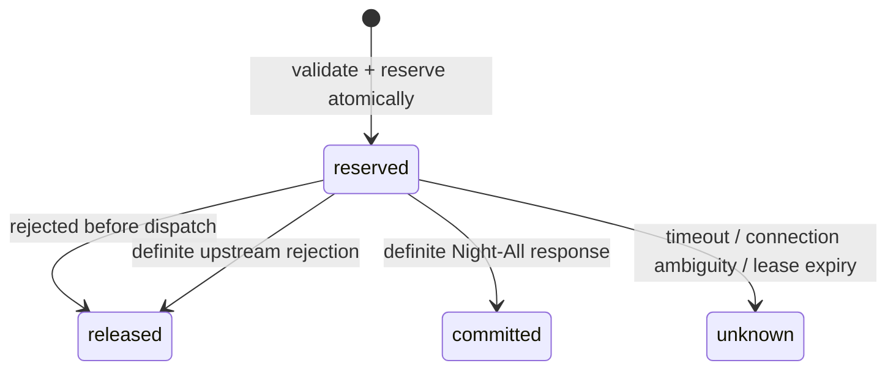

# Data and ledger model

## Transactional source of truth

MX Insight Hub uses its own PostgreSQL. It does not share Launcher’s JSONB registry table and does not reuse Night-All’s provider-call log as customer usage.

The MVP model covers:

- tenants and consumers;
- API-key digest, prefix, last-four, environment and lifecycle state;
- explicit consumer platform grants;
- consumer/platform request-window and page-size policy;
- request idempotency record and state;
- usage event / request evidence;
- aggregate dashboard projections.

## Request state machine

The MVP does not persist a separate `dispatched` state; `reserved` covers the in-flight interval. Every reservation receives a `lease_expires_at` deadline derived from `MX_INSIGHT_RESERVATION_LEASE_MS`. A timeout or connection loss after dispatch is marked `unknown` immediately. If a Hub process exits before it can record an outcome, the next reaper pass changes the expired `reserved` row to `unknown` with `reservation_lease_expired`, preventing a permanent `request_in_progress` record. Lease expiry does not prove that Night-All did no work, so it never releases or retries the request automatically.

A future reconciliation migration will add dispatch evidence and explicit `unknown -> committed/released` transitions before automated reconciliation is enabled.

The reserve step and rate-window check must occur in one database transaction. A second instance cannot spend the same quota concurrently. Redis may later accelerate ephemeral rate checks, but PostgreSQL remains authoritative.

## Billing evolution

MVP `units` are operational usage evidence. Production billing adds append-only structures:

- versioned plans and subscriptions;
- credit accounts with fixed-point integer balances;
- reservations;
- immutable ledger entries for grant, reserve, commit, release, refund and adjustment;
- price-book version captured on every request;
- outbox events for invoice, analytics and reconciliation projections.

Never update a balance without a corresponding immutable entry. Provider quota and customer credit are independent gates: Night-All may have upstream capacity while a customer has no credit, or vice versa.

## Retention and analytics

Authorization headers, `x-api-key`, Admin tokens and Night-All-owned upstream
provider secrets are never stored. Direct PostgreSQL source passwords and
Admin-managed credentials for Hub-native external platforms are the explicit
exceptions: the Admin-token plane stores them in credential-bearing PostgreSQL
records, so Hub database, WAL and backup readers are credential-trusted roles.
Those values are excluded from ordinary metadata and analytics queries; an
external-platform reveal additionally requires Admin Token reauthentication.
The caller's `Idempotency-Key` is intentionally stored
as request business state. Query payload retention should be tenant-configurable
because search terms can be sensitive. Long-term BI reads should use an
outbox/CDC projection, not repeatedly scan the transactional request table or
Night-All’s collection OLTP database.
