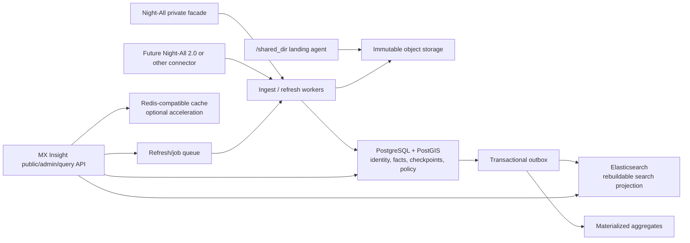

# 数据平台存储、检索与服务架构

状态：目标设计与当前落地并存。现有实现已包含租户/Consumer/API Key/
授权/幂等/用量、Night-All 搜索适配器、Admin 管理的 PostgreSQL/文件 source、
文件与数据库导入、canonical/revision/tombstone、outbox、Elasticsearch 投影
及 PostgreSQL 降级检索。PostGIS、不可变对象/云存储、`/shared_dir` watcher、
通用 CDC、fresh/stale 缓存和 BI 聚合仍是后续能力，不能按本文目标图宣称已上线。

## 1. 目标与边界

MX Insight Hub 不只是 Night-All 的反向代理。它要把不稳定、格式多样的内部来源加工成可授权、可追溯、可降级的稳定数据产品，并在来源暂时不可用时继续提供最后一次成功发布的数据。



责任边界保持不变：

- Night-All 负责其 API/TGStat 等上游 provider、采集、fallback、凭据和一手来源证据。
- Hub 负责客户身份、订阅和授权、稳定响应、规范化产品视图、查询缓存、数据发布版本和用量账本；对 Admin Token 直接注册的 PostgreSQL/文件来源，Hub 也负责连接配置、映射、checkpoint 和任务证据。数据库密码按明确的运维取舍明文保存在 `catalog.external_sources.connection`，因此 Hub 数据库和备份必须按凭据库限制访问。
- Launcher 负责人类登录、AppCenter 入口、K8s 生命周期和网络路由；它不保存 Hub 的数据、余额或客户 API Key。
- Elasticsearch 是查询投影，Kibana 是内部运维工具；两者都不是事实库或备份。

## 2. 存储选型

| 存储 | 权威职责 | 不承担的职责 | 第一阶段 |
| --- | --- | --- | --- |
| PostgreSQL 16+ | 租户/授权/账本、数据目录、规范化事实、来源映射、checkpoint、outbox、近期聚合 | 大体积原始附件、无限全文索引 | 必需 |
| PostGIS | 点位、半径、行政区包含、区域聚合和空间索引 | 地址解析、地名识别 | 数据事实阶段必需 |
| S3 兼容对象存储 | 不可变 raw、文件、解析产物、Parquet、导出、ES snapshot 和 PG 备份 | 高频小事务 | `/shared_dir` 接入前必需 |
| Elasticsearch | 中文/多字段全文、facet、geo search、可重建读模型 | 去重真相、交易、唯一备份 | 有全文/大屏检索需求时启用 |
| Redis/Valkey | singleflight、短期 query cache、限流、租约和 job queue | 余额、checkpoint、幂等真相 | 可选；丢失后可恢复 |
| ClickHouse | 大规模明细扫描和高并发 BI | API Key、账本、OLTP | 以真实负载证明 PG 不足后再引入 |

现有旧 ELK Compose 可复用它的单机运维经验、ILM、snapshot 和 bootstrap 思路，但不能原样搬入：旧配置关闭安全、对外暴露端口、面向 OPC 日志，且 Logstash/Filebeat pipeline 不理解 Hub 的租户、schema、血缘和发布语义。

## 3. PostgreSQL 逻辑模型

第一阶段仍采用模块化单体和一个独立 Hub PostgreSQL，但按 schema/所有权分区。当前 MVP 的表可先保留在 `public`，后续迁移不应阻塞现有接口。

| Schema | 代表对象 | 写入者 |
| --- | --- | --- |
| `iam` | external identity binding、member、tenant membership | Admin/身份同步 |
| `product` | consumer、API key、plan、subscription、grant、credit ledger | Hub 控制面 |
| `catalog` | source、dataset、schema version、field policy、freshness SLA | 数据治理 |
| `ingest` | run、batch、checkpoint、source object、file manifest、quarantine | Ingest workers |
| `core` | canonical entity/content/event、revision、observation、geo | Normalizer |
| `serving` | published dataset version、customer-safe view、aggregate | Publisher |
| `outbox` | projection event、delivery checkpoint、dead letter | 与 PG 事务同写 |
| `usage` | request、reservation、usage event、billing evidence | API/worker |

### 3.1 数据目录

每个可对外数据集至少记录：

- `dataset_id`、owner、用途、许可和敏感级别；
- 当前 `schema_version`、兼容范围和变更说明；
- freshness SLO、retention、质量规则、可见字段和导出策略；
- 来源 connector、当前发布版本、最后成功 ingest/publish 时间；
- 可调用的 platform/capability 和所需授权。

API 不直接把某张 Night-All 表当作公共数据集。`dataset_version` 是一次可复现发布，指向一组已通过 schema、质量和脱敏检查的记录版本。

### 3.2 来源、规范记录与观测分离

必须区分三个概念：

1. `source_object`：来源系统给出的原始对象或文件记录，保留来源 key、版本、hash 和 raw URI。
2. `canonical_record`：Hub 规范化后的当前业务对象，例如帖子、账号、事件或商品。
3. `observation`：某次抓取、搜索、文件导入或指标采样看到该对象的事实，保留 run、query、rank、metrics 和时间。

重复抓取同一帖子应更新或新增它的 revision，同时保留新的 observation；不能因为“内容已经存在”就丢掉指标变化和采集血缘。

推荐的核心字段：

```text
source_objects
  id, connector_id, stream_id, object_type
  source_key, source_version, payload_sha256, raw_uri
  source_updated_at, first_seen_at, last_seen_at, ingest_run_id

canonical_records
  id, dataset_id, platform, object_type
  external_id, identity_hash, schema_version
  title, body, author_id, event_time, collected_at
  location geography(Point, 4326), region_id
  stable_fields jsonb, extensions jsonb
  current_revision, first_seen_at, last_seen_at, deleted_at

record_revisions
  record_id, revision, payload_sha256, normalized_payload
  raw_uri, parser_version, valid_from, valid_to, ingest_run_id

observations
  id, record_id, connector_id, source_event_id
  query_fingerprint, observed_at, rank, metrics jsonb
  observation_hash, ingest_run_id
```

### 3.3 PG 唯一约束才是去重真相

优先级如下：

1. 来源有稳定 ID：唯一键为 `(dataset_id, platform, object_type, external_id)`。
2. 来源只有命名空间 ID：唯一键加入 `connector_id/source_namespace`。
3. 来源没有 ID：对经过版本化规则规范化的稳定字段计算 `identity_hash`，规则版本必须随记录保存。
4. observation 使用来源 event ID；没有时使用 `(record_id, observation_kind, observed_at, observation_hash)` 的受控组合。

“平台 + 用户 + 时间”通常不够唯一：同一用户可在同一秒产生多条对象，时区和时间精度也会变化。Elasticsearch `_id` 可以使用 canonical UUID 或确定性 hash，使重复投影覆盖同一文档，但 ES 写成功不能证明 PG 事务、血缘或账本已经成功。

所有 upsert 在 PG 事务内完成，并同时写 outbox。checkpoint 只能在该事务提交后推进。

### 3.4 JSONB 与前后格式兼容

采用“热字段 typed columns + 受控 JSONB 扩展 + raw 对象 URI”三层：

- 公共筛选、join、排序、唯一性和授权字段使用普通列；
- 不稳定的 provider 附加字段进入 `extensions jsonb`，每条记录带 `schema_version`；
- 完整原始 payload 存对象存储，PG 只保留 hash、URI、大小、MIME 和 parser version；
- 不为任意 JSON key 建通用 GIN 索引。只对经过查询证据证明的固定 JSON path 建表达式索引；
- schema 演进遵循 backward-compatible reader：先让 reader 兼容新旧版本，再写新版本，最后后台重算；
- 删除或改义字段必须创建新的 dataset/schema version，不能静默改变历史报表口径。

### 3.5 地理数据与大屏

Night-All 现有 `lat/lng + geo JSONB` 可作为来源字段，Hub 规范层增加 PostGIS：

- 点位使用 `geography(Point, 4326)`，适合米制半径查询；
- 行政区边界使用 `geometry(MultiPolygon, 4326)`；
- 用 GiST 索引支持 `ST_DWithin`、区域包含和地图视窗查询；
- 保留 `country_code`、`admin1_code`、`admin2_code`、展示名称等普通列，避免所有大屏聚合都做昂贵 polygon join；
- 地名解析是独立、可版本化的 enrichment，保存 resolver、置信度和证据，不用错误坐标覆盖原始字段；
- 常用大屏按小时/日、平台、行政区预聚合，视窗缩放返回不同粒度；原始点查询设置最大范围和行数预算。

经纬度本身可以冗余保留用于兼容和导出，但空间判断以 PostGIS 列为准。

### 3.6 分区和索引

基线索引：

- `canonical_records(dataset_id, platform, event_time desc, id desc)`；
- `canonical_records(dataset_id, object_type, external_id)` 唯一/部分唯一；
- `observations(record_id, observed_at desc)`；
- `observations(connector_id, source_event_id)` 唯一（非空时）；
- 大型追加表按 `observed_at/event_time` 月分区；
- 时间顺序大表用 BRIN 辅助冷范围扫描；
- PostGIS 列用 GiST；
- 仅对实际使用的 tags/固定 JSON path 使用 GIN。

不要先按租户创建成千上万张表或 ES index。默认共享分区并带 `tenant_id/dataset_id`；只有法规隔离、超大租户或独立生命周期有证据时再物理拆分。

## 4. Elasticsearch 搜索投影

### 4.1 投影而非双写

业务事务只提交 PG + outbox。独立 projector 消费 outbox，并以
`canonical_record.id` 作为 ES `_id`、以单调 `projection_revision` 做外部版本
控制。每次 claim 都重读 PG 当前行，而不是信任旧事件 payload；当前行已删除/
tombstone 就发 delete，否则发 index。失败事件进入 DLQ，修复后可重放；全文
current index 可直接从 PG canonical current state 重建。

索引命名建议：

```text
mx-insight-hub-content-v4-current  current concrete index
mx-insight-hub-content             read alias
mx-insight-hub-content-v4          compatible write alias

mx-insight-hub-chunk-v1-current    semantic current concrete index
mx-insight-hub-chunk               read alias
mx-insight-hub-chunk-v1            compatible write alias
logs-mx-insight-*                observability data stream
```

content/chunk 都是 mutable current-state projection，不使用 ILM rollover。
启动 reconcile 在 PG advisory lock 下把 PG current truth 扫入唯一 `*-current`，
原子切换 read/兼容 write alias 后再扫第二遍；这避免相同 `_id` 残留在多个
backing index，被 read alias 继续命中。mapping 使用 `dynamic: strict`；provider
扩展如确需检索放入 `flattened`，避免 mapping explosion。平台、对象类型、schema
version 使用 `keyword`；正文使用 `text`；经纬度使用 `geo_point`；时间使用
`date`。content v3 在首次 Telegram 全量发布前固定了名称与消息结构：作者名和
用户名的原文用于 exact/prefix/CJK bigram，handle/username 另有 ES 原生
`wildcard` typed field 对齐 PG trigram 的拉丁任意位置子串，`authorNameHanlp`/
`usernameHanlp` 保存预分词副本；reply/thread/grouped 关系、媒体类型/MIME/扩展名/
大小，以及 entity type/user/url 都是有界的 typed fields。源 JSON 仍只以 PG raw
副本为权威，不允许 ES dynamic mapping 猜字段。

content v4 是仓库为下一次全文能力升级声明的 schema，而不是对已部署 v3 mapping
的原位改义。任何仍由 v3 alias 服务的环境都必须完成严格重建后才算升级。v4
预先建立一组有界、职责单一的词项视图，使大部分后续相关性调整只改变查询
profile：

| 逻辑视图 | index-time 表示 | 查询用途与边界 |
| --- | --- | --- |
| `title` / `body` | raw `standard`，保留 positions | 原文 phrase、拉丁文本和顺序匹配；phrase 是查询类型，不另建“phrase analyzer” |
| `titleHanlp` / `bodyHanlp` | HanLP coarse tokens，由 projector 预分词，ES 用 `whitespace` | 中文词级召回；模型、词典和 token provenance 必须版本化 |
| `title.cjk` / `body.cjk` | 内置 CJK bigram | 不依赖 ES 插件的中文补召回；不得退回“任一单字命中” |
| `title.prefix` | 有界 edge-ngram index analyzer，普通 search analyzer | 仅标题前缀/type-ahead；不在正文或查询侧生成 edge-ngram |

这不是“把所有 analyzer 都加到每个字段”。长正文的 edge-ngram 会显著放大
postings，chunk 与 content 同时增加 CJK bigram 也会重复索引长文本；因此 v4
先覆盖 canonical content，chunk 只有在离线检索评估证明有收益后再扩展。
每个 text multi-field 都会增加独立 postings/norms，发布前必须用代表性样本和
Elasticsearch disk-usage 统计验证磁盘、merge、refresh 与查询 P95，而不能承诺
固定膨胀比例。

语义检索独立使用 chunk index。PG `record_chunks` 保存当前切片与已生成向量；
内容缩短、chunker 变化、低于切片阈值或 canonical tombstone 时，同一 PG 事务
先登记旧 chunk 文档 ID 到 durable delete queue，再删除/替换 authoritative
chunks。worker 在生成新 embedding 前投递 externally-versioned delete，并只在
成功后 ack，因此模型 provider 下线或 worker 崩溃都不会让已删除文本永久留在
语义检索。chunk index 可从 PG 当前 chunk/vector 重建，无需重新付费 embedding。

### 4.2 HanLP 中文处理

生产基线不把第三方 HanLP Elasticsearch 插件作为集群启动前置条件。Elastic 的 classic plugin 必须与 Elasticsearch 精确版本匹配，升级时会放大故障域。

当前部署只提供一个固定的 HanLP coarse tokenizer；请求中的 `coarse` 意图并不
代表服务端已经同时装载 fine/max-word 模型。推荐流程：

1. 独立 HanLP enrichment service 先对 title/body 生成 coarse tokens；只有真实部署并版本化第二套模型后，才能声明提供 fine tokens、NER 或关键词。
2. 目标 schema 在 PG revision 保存 `nlp_model_version` 和结构化 enrichment；当前
   canonical row 尚未持久化逐字段 HanLP model digest，原文仍是可重建真相。
3. ES 同时索引原文和预分词字段；预分词字段使用内置 `whitespace` analyzer，原文使用可升级的内置 analyzer。
4. 查询服务对查询词使用同一 HanLP 模型处理，并对原文、tokens、实体字段做加权召回。
5. 当前 streaming projector 在 HanLP 不可用时允许原文继续发布，并可能把
   Jieba/bigram fallback 写入历史命名的 pre-segmented 字段；严格全量 reconcile
   会拒绝降级。下一 schema 应把 fallback/pending 与 HanLP 字段、model digest
   分开并后台补算，不能阻断 ingest/checkpoint，也不能伪造 HanLP provenance。

IK 的“索引用较宽的 max-word、搜索用较窄的 smart”理念可以保留，但不复制 IK
插件实现：MX 用相互独立的 raw、HanLP coarse 与 CJK bigram 字段表达索引侧的
候选能力，再由查询 profile 选择较窄的组合。不得把 coarse、fine、bigram 全部
混进同一字段，否则 term frequency、positions 与 phrase 语义都不可解释；未来
若增加 HanLP fine，必须有真实的、带模型 digest 的 enrichment 字段和迁移，不是
在请求里声明一个实际上不存在的 analyzer。

若未来必须使用 ES 内嵌 HanLP plugin，需为每个 ES patch 构建/验签兼容镜像，在隔离集群完成启动、reindex、rolling upgrade 和回滚测试后才能启用，且保留不依赖 plugin 的索引重建路径。

### 4.3 版本化搜索 profiles

查询方选择产品语义而不是 Elasticsearch 实现细节。服务端维护不可变、带版本的
allowlist，并用逻辑默认值指向其中一个版本；公开调用者不能提交 index 名、字段
列表、任意 analyzer、Query DSL、script 或任意 boost。当前严格相关性冻结为
`canonical.balanced.v1` 的基线语义，content v4 为其他 profile 预建词项：

| Profile | 可见范围 | 语义 |
| --- | --- | --- |
| `canonical.balanced.v1` | Public/Admin，默认 | raw phrase **或** HanLP coarse terms-all；保持当前严格行为 |
| `canonical.phrase.v1` | Public/Admin | 只走原文 phrase，适合高精度顺序匹配 |
| `canonical.terms-all.v1` | Public/Admin | 查询经 coarse 分词后，全部词项必须在目标预分词字段命中 |
| `canonical.zh-recall.v1` | Public/Admin，v4 | phrase、HanLP terms-all 与低权重、保持顺序的 CJK bigram phrase 组合；禁止单字 OR |
| `canonical.title-prefix.v1` | Public/Admin，v4 | 查 `title.prefix` 和已有的名称/handle/username prefix；index-time edge-ngram、search-time 普通分析 |
| `canonical.cjk-bigram.v1` | Admin Search Lab | 隔离观察 CJK bigram 的 tokens 与排名，不作为公共默认 |
| `canonical.legacy-or.v1` | Admin Search Lab | 仅用于和历史 OR 行为做受控对比，不能成为公共 profile 或默认 |

默认 `canonical.balanced.v1` 在首屏调用当前配置的 segmenter；HanLP 健康时把
query tokens 以空格拼接后对
`titleHanlp`/`bodyHanlp`/`chatUsernameHanlp` 执行 `AND`，raw phrase 是并列的
另一条严格分支。若结果降级为 Jieba/bigram，响应中的 query-analysis provenance
保留实际 `backendUsed/degraded/errorCode`，但 applied profile 改为
`canonical.phrase.v1`，fallback tokens 不会错查 HanLP postings。签名游标保存并
复用首屏分析状态，后续页不重新调用分词服务。CJK bigram 不参与 balanced；它只在
HanLP 健康的 `canonical.zh-recall.v1` 中作为低权重、有序的补充支路，或在
Admin-only profile 中单独观察。

profile 可以调整 query analyzer、phrase/slop、operator、minimum-should-match、
字段 boost、过滤和 rescore，而无需重建，前提是它只使用索引中已经存在且词项兼容
的字段。修改现有字段的 index analyzer，或新增 html-strip、delimiter、stem、
edge-ngram、CJK/HanLP token representation，都会改变 postings；历史数据必须进入
新的 schema-versioned `*-current` 索引并从 PG 做 blue/green 全量重建，校验后再
原子切 read alias。给既有 mapping 新增 multi-field 虽然可被 ES 接受，但旧文档
不会自动拥有该字段；禁止让新旧记录长期处于不同检索能力。

`word_delimiter_graph` 只适合 handle、产品号、文件名等 identifier，配合
`keyword`/`whitespace` tokenizer；不能把附件式 `standard + word_delimiter`
当中文分词，也不能未经 position 验证把 `catenate_all`/`preserve_original` 用在
phrase 字段。`html_strip` 只用于已确认是 markup 的 dataset/contentType，纯文本、
代码和 Telegram 正文不能全局套用。Snowball/stemming 只放入语言已确认的英文
专用字段/profile，不处理多语言正文和名称。

逻辑默认 profile 的切换是有审计、可回滚的查询配置变更，不是修改 field mapping
上的默认 analyzer。分页游标和幂等指纹必须绑定实际解析出的 immutable profile
版本；即使默认指针在翻页期间改变，同一游标仍保持原来的排序语义。公开响应只可
返回稳定的 profile 名、分词 provenance、named-branch 命中证据和 highlight；
完整 ES `_explanation`/profile 输出只允许在受限 Admin Search Lab 中按小样本使用。

### 4.4 PG 与 ES 查询协同

- 结构化精确读取、授权、dataset version、详情和游标真相从 PG 获取。
- 全文、facet、geo relevance 从 ES 获取 canonical IDs 和排序证据，再批量回 PG/serving snapshot 取授权后的稳定字段。
- ES 查询必须带 tenant/dataset grant filter；API 不接受客户端传入任意 index、DSL 或 script。
- ES 不可用时，精确 ID/时间/平台/区域等 PG 路径继续工作；全文接口返回明确 degraded 或最后物化结果。
- ES 结果中的文档 revision 必须不高于已发布 dataset version，防止未发布数据越权露出。

### 4.5 实体检索、模糊匹配与联想

账号/用户检索与正文检索语义不同。当前实现先在 strict content 投影中
显式加入 `authorName`/`authorHandle`，按作者聚合；Telegram chat 的
title/username 也使用显式字段。这样已有 canonical/outbox 可立即支持模糊作者
和 chat 检索，ES 不可用时退回 PG trigram/substring。独立 entity 索引是数据量
或 type-ahead 负载证明现有方式不足后的扩展，而不是当前已部署组件：

```text
mx-insight-entity-v1-000001      write alias: mx-insight-entity-v1-write
                                 read alias:  mx-insight-entity-v1
```

字段策略（`dynamic: strict`）：

| 字段 | 类型 | 用途 |
| --- | --- | --- |
| `handle` | `keyword` + `text`(edge_ngram) + `search_as_you_type` | 精确命中、前缀联想 |
| `normalizedHandle` | `keyword` | 去重与精确 join |
| `displayName` | `text` + `keyword` + `displayNameHanlp` | 中文昵称召回 |
| `platform` / `objectType` / `externalId` | `keyword` | 过滤与回表 |
| `tenantId` / `datasetId` / `dataVersion` | `keyword` | 授权与发布版本过滤 |
| `metrics` | 数值列 | 排序（粉丝量、活跃度） |

三类查询分开处理，不用一个 DSL 兼顾：

1. **前缀联想（type-ahead）**：走 `search_as_you_type`/edge_ngram，只查 handle 与 displayName，设独立低延迟预算；
2. **模糊容错**：`fuzziness: AUTO` 仅作用于 handle/name，禁止对正文开 fuzzy（召回爆炸且无意义）；
3. **中文昵称**：与 4.2 一致，查询词经同一 HanLP 模型处理后打预分词字段，与原文字段加权合并。

归一化规则必须版本化并随记录保存：Unicode NFKC、大小写折叠、去零宽字符与同形字映射，产出 `normalizedHandle`。

约束：

- 权威仍在 PG。实体是 `canonical_records` 中 `object_type='account'` 的记录，唯一键沿用 3.3 的 `(dataset_id, platform, object_type, external_id)`；ES 只是可重建投影。
- 联想与模糊查询同样必须带 tenant/dataset grant filter，且文档 revision 不高于已发布 dataset version，避免未发布或越权数据通过 suggest 泄露。
- 实体投影只读本地数据，不触发 Night-All，因此不产生 provider 成本；但需要独立限流，防止 type-ahead 每次击键放大成后端压力。
- 实体冷启动来自两处：从 search/detail 响应的作者字段抽取，以及未来专门的 profile/user-info capability。抽取得到的实体标记来源与置信度，不与一手 profile 记录混淆。

## 5. BI 与聚合

先使用 PG 分区表、只读副本、物化视图和增量 aggregate 表：

- 小时/日 × tenant/dataset/platform/region；
- 内容量、独立主体、互动指标、质量/freshness、采集成功率；
- 每个聚合保存 `metric_version`、`dataset_version` 和最后处理 checkpoint；
- Dashboard 只读 aggregate/serving schema，不扫描 usage ledger 或 Night-All OLTP。

满足以下任一类可测证据后再评估 ClickHouse：PG 只读副本仍不能达到扫描 P95/SLO、并发分析明显挤压 ingest、单次查询需扫描数十亿级明细、或预聚合无法满足交互切片。迁移时 ClickHouse 同样是可重建分析投影，不接管 API Key 和账本。

## 6. 高可用、备份与数据冗余

| 故障 | 服务行为 | 恢复来源 |
| --- | --- | --- |
| Night-All 不可用 | 返回已发布 fresh/stale 数据并标明 freshness；新 refresh 排队/失败 | Night-All 恢复后续跑 |
| Redis 丢失 | 缓存 miss、singleflight 租约重建；不丢账和 checkpoint | PG |
| Elasticsearch 丢失 | PG 精确查询继续；全文 degraded | PG snapshot/Parquet + outbox reindex |
| Hub PG 主库故障 | API fail closed，不能从 ES 猜测授权或余额 | WAL/PITR + replica |
| 对象存储故障 | 已发布规范数据可读，不能处理新 raw/重放 | 跨节点/跨桶复制和版本化 |

生产要求：

- PG 使用独立备份、WAL 归档、PITR、连接池预算和恢复演练；
- raw bucket 启用 object lock/versioning（按合规策略）、服务端加密和生命周期；
- ES snapshot 写入独立对象存储，不能与 ES data volume 同故障域；
- 每次发布记录 PG LSN/checkpoint、对象 manifest、ES projection revision 和 schema/model version；
- 任何备份都要做定期 restore drill，不能只验证“文件存在”。

## 7. 稳定响应契约

每个公开结果至少附带：

```json
{
  "dataVersion": "dataset_...:42",
  "schemaVersion": "content.v1",
  "sourceMode": "live|fresh-cache|historical|stale",
  "capturedAt": "2026-08-04T00:00:00Z",
  "freshUntil": "2026-08-04T00:01:00Z",
  "partial": false,
  "refreshJobId": null
}
```

客户看到的是 Hub 字段策略处理后的记录；provider、endpoint、凭据、内部 business ID 和 raw URI 不进入公共响应。数据源离线时，Hub 可独立展示所有已发布数据，但必须准确标明最后更新时间、stale/partial 和缺失范围。

## 8. 上线门槛

- PG 唯一键和重复重放测试证明同一批次重复 3 次不增加 canonical 记录；
- checkpoint 只在 PG + outbox 提交后推进，worker 崩溃可安全重跑；
- ES 清空后可从 PG/object snapshot 全量重建并校验记录数/hash；
- HanLP 停止时 ingest 和原文搜索仍可工作，恢复后 enrichment 可补算；
- PostGIS 半径/行政区查询与预聚合有真实数据量下的 EXPLAIN/延迟基线；
- Night-All、ES、Redis 任一不可用均不影响 Launcher 启动、MX-H2I 连接或现有 DNS/WireGuard/PAC；
- 备份恢复、权限过滤、字段脱敏和跨租户隔离通过自动化测试。
