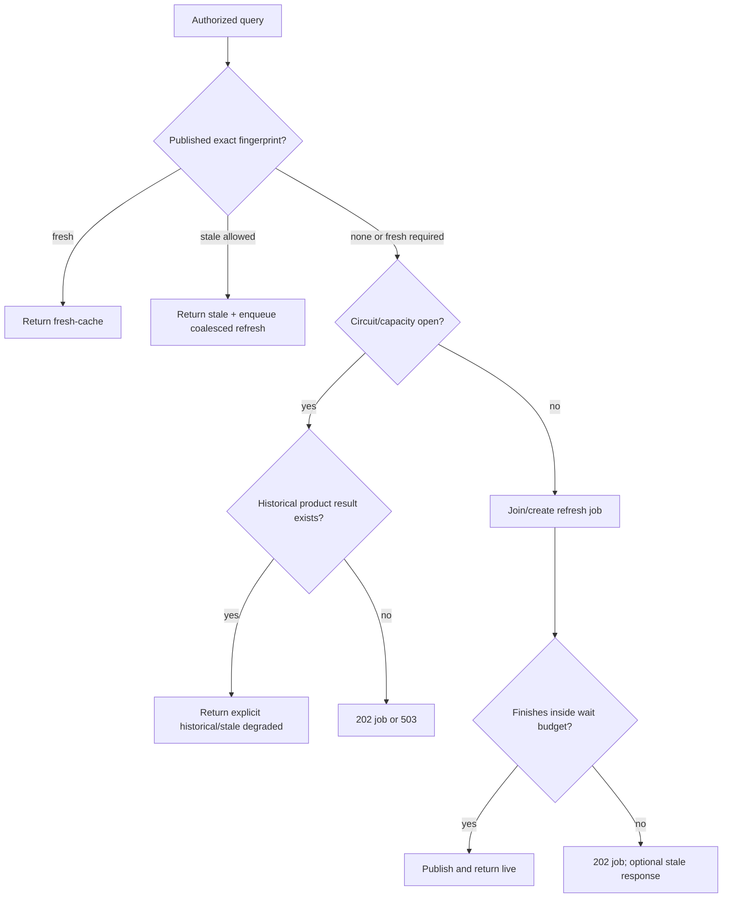

# 数据接入、增量游标、缓存与稳定性

状态：整体仍是目标设计。当前 `/api/v1/data/search` 没有通用持久查询缓存或相同请求合并；已实现的窄例外是三个 `/api/v1/night-all/search/*` 兼容路由的调用证据和 complete-only exact last-good 快照。本文件会分别标注“已实现兼容层”和“后续通用缓存”，不能把后者当成当前运行语义。

## 1. Connector contract

Night-All、未来 Night-All 2.0、文件导入和其他平台都实现同一版本化 connector，不把来源特例散落到公共 API。

```text
ConnectorDescriptor
  connectorId, type, owner, contractVersion
  streams[]: platform, capability, schemaVersion
  mode: poll | cursor | snapshot | webhook | cdc | file
  identityRules, watermarkRules, deleteSemantics
  readiness, timeoutClass, retrySafety, costClass
  dataClassification, rawRetention, parserVersion
```

标准入站 envelope：

```json
{
  "connectorId": "night-all",
  "streamId": "xiaohongshu.search_posts.v1",
  "sourceKey": "note-id",
  "sourceVersion": "optional-provider-version",
  "sourceUpdatedAt": "2026-08-04T00:00:00Z",
  "observedAt": "2026-08-04T00:00:10Z",
  "schemaVersion": "night-all.data-search.v1",
  "payloadSha256": "...",
  "rawUri": "s3://...",
  "payload": {}
}
```

`payload` 可以在小消息中内联；大 payload 只传 URI/hash。每个 connector 必须声明删除/tombstone、时间语义、分页和重放规则。

## 2. Night-All 接入方式

### 2.1 生产读取

Internal 上继续让原作者维护的宿主 Night-All 作为唯一生产 writer。Hub K8s 通过受控 host facade/private Service 调用，不需要为“读取更方便”再启动第二套完整 Night-All。


- 严格查询使用 readonly allowlist；
- 需要触发上游和写审计的 refresh 使用明确的 delegated capability，不把它称为只读；
- facade 需要 workload identity、来源限制、timeout 和审计；
- 不允许 Hub 直接调用 Credential/config/webhook/Semantic Lab/任意 provider route；
- 不允许第二套 full Night-All 连接生产 PG/Redis 或启用 scheduler。

### 2.2 本地开发

isolated-full Docker 只用于本地调试、快照恢复、schema/解析和回归测试。默认关闭 scheduler、RSS schedule 和 Agent，使用独立 PG/Redis/端口。只有需要验证真实历史格式或 UI 效果时才导入受控快照；架构和静态 contract 开发不要求生产数据。

### 2.3 当前 contract 风险

接入前必须做 runtime capability probe，不能只看仓库文档：

- Night-All 新 `/api/v1/data/search`、durable cursor 和 migrations 033–036 在当前本地工作区存在，但可能尚未提交或部署到 Internal；
- 只有通过真实 endpoint/credential/分页验证的平台才能进入 Hub grant；
- Night-All 可能用 HTTP 200 返回 `data.status=failed|partial`，adapter 必须同时校验业务状态；
- `/health` 顶层成功不等于 PG/Redis/provider ready，Hub readiness 要检查依赖子状态；
- Night-All 的短期搜索 cursor 不是 Hub ETL checkpoint。

## 3. 增量同步与 checkpoint

### 3.1 Checkpoint 维度

每个独立可重放 stream/partition 一条 checkpoint：

```text
(connector_id, stream_id, partition_key, scope_hash)
  upstream_cursor
  high_watermark_time + high_watermark_tiebreaker
  overlap_seconds
  source_contract_version
  last_batch_id, last_success_at, lag_seconds
  state, retry_after, last_error_code
```

`scope_hash` 表示会影响来源结果的稳定 scope，例如 platform/capability/subject/query 组；客户 tenant 只有在数据本身是租户私有时才进入 checkpoint，不把公共来源为每个客户重复抓取。

### 3.2 Keyset + overlap

来源支持更新时间时，使用 `(updated_at, stable_id)` keyset：

```sql
where updated_at > :last_time
   or (updated_at = :last_time and id > :last_id)
order by updated_at, id
limit :batch_size
```

每轮向前重叠一小段时间以接住迟到更新；重叠记录依靠 PG 唯一约束和 payload hash 幂等处理。不要仅用 `max(updated_at)`，否则同一时间戳多记录、时钟回拨和事务延迟会漏数。

来源只提供 opaque cursor 时，保存 cursor 和对应 contract version；cursor 过期需要从最近可证明 watermark 或 snapshot 重新开始，不能猜测下一页。

### 3.3 事务顺序

一个 batch 的顺序固定为：

1. 创建 `ingest_run/batch`；
2. raw 上传对象存储并取得 hash/URI；
3. PG upsert source object、canonical revision、observation；
4. 同事务写 outbox 和新的 checkpoint；
5. commit；
6. projector 异步更新 ES/aggregate；
7. publisher 质量检查通过后推进 dataset version。

进程在 3–5 任一点退出都可以重放；没有 commit 就不能推进 checkpoint。ES 成功但 PG 失败的双写流程被禁止。

### 3.4 删除、修改与历史

- 来源明确 tombstone：标记 `deleted_at`，发布层按策略隐藏，revision/血缘保留；
- 来源对象内容变化：相同 canonical ID 新增 revision，不覆盖历史 hash；
- 来源纠错：记录 correction reason 和原/new revision；
- 来源不再返回某项不代表删除，除非 connector contract 明确声明 snapshot completeness；
- 每次 dataset 发布保存 as-of 和覆盖范围，避免“当前表”无法复现历史大屏。

## 4. 查询指纹与缓存

### 4.1 精确、授权感知的 fingerprint

缓存 key 对规范 JSON 做稳定 hash，至少包含：

```text
tenant/product scope + grant/field-policy version
platform + capability + normalized query
filters + sort + time range + geo + page size/cursor
response schema version + freshness class
```

查询只做安全规范化（trim、Unicode normalization、排序对象 key、默认值展开）；不能把两个语义不同的关键词、时间窗或字段权限合并。缓存 payload 是已按该 field-policy 处理的响应，禁止跨租户或跨授权版本复用。

### 4.2 默认 freshness policy

这些是第一版建议值，最终由 platform/capability contract 和实际成本/SLO 调整：

| 数据类型 | fresh TTL | stale-if-error | 同请求 in-flight lease | 默认行为 |
| --- | ---: | ---: | ---: | --- |
| 实时社交关键词首屏 | 60 秒 | 15 分钟 | 30 秒 | fresh 命中直接返回；stale 先返回并后台刷新 |
| Profile/detail | 5 分钟 | 1 小时 | 30 秒 | 优先已有详情，异步补新 |
| 历史全文/已发布数据 | 到 dataset version 变化 | 不适用 | 10 秒 | 只查 Hub 存储，不触发上游 |
| Dashboard aggregate | 5 分钟 | 24 小时 | 60 秒 | 返回物化结果和 aggregate as-of |
| `/shared_dir` 文件数据 | 到新文件版本发布 | 不适用 | 60 秒 | 由 manifest/dataset version 失效 |

“相同搜索缓存多久”因此不是一个全局常数。平台成本高、更新慢可延长；突发/舆情能力可缩短。所有响应必须返回 `capturedAt/freshUntil/sourceMode`。

### 4.3 Singleflight 请求合并

相同 fingerprint 在 lease 内只允许一个 refresh owner 调用 Night-All，其他请求：

- 有 fresh/stale 数据时立即返回同一发布版本；
- 要求等待时订阅同一 job，最多等待产品策略允许的时间；
- 没有结果且同步预算用尽时返回 `202 + refreshJobId`；
- owner 崩溃后 lease 到期由新 worker接管，但需要检查 Night-All dispatch outcome，不能盲目重复付费调用。

Redis 可持有短租约和热 payload，PG 保存 durable job、dispatch、结果引用和未知状态。Redis 丢失不能造成同一客户账本重复提交。

### 4.4 已实现：Night-All 兼容路由 exact last-good

以下规则只适用于：

```text
POST /api/v1/night-all/search/raw
POST /api/v1/night-all/search/crawl
POST /api/v1/night-all/search/user-info
```

它不是 4.2/4.3 所述的通用 fresh cache 或 singleflight。每个新的 `Idempotency-Key` 先调用 live Night-All；一旦 live/stale delivery 提交，该 key 永久回放这一次付费 dispatch，要发起新的 live 调用必须使用新 key。只有 live 失败后才查 last-good。快照 lookup 固定为
`consumer_id + operation + exact request fingerprint`，其中 fingerprint 包含路由、兼容 contract version 和规范化后的完整上游请求。平台、关键词/账号、cursor、page/count、filter 或任意语义字段不同都不能命中，也不能跨 consumer、operation 或授权域复用。

| 规则 | 当前行为 |
| --- | --- |
| 可写快照的成功 | HTTP 200 且没有 substantive warning/per-result error 的 `complete`；只有 `STANDARD_PAYLOAD_EMPTY` warning 的确定性空结果也是 complete，并覆盖旧快照 |
| partial 成功 | HTTP 200 原样返回并记证据；不创建、不覆盖已有 complete 快照 |
| 允许 fallback 的失败 | network、timeout、不可用的 HTTP 2xx content-type/JSON/envelope，或 definite non-2xx upstream `502/503/504` |
| 不允许 fallback | upstream `400/404/409/422/429`、不同 fingerprint、过期/不存在快照 |
| stale window | `raw=15m`；`crawl=1h`；`user-info=1h` |
| stale payload | 保存过的原始 Night-All legacy response application fields；绝不由 canonical search 或脱敏 projection 拼装 |
| stale 标记 | HTTP 200；`x-mx-insight-source-mode=stale`、`x-mx-insight-captured-at`、`Age`、`Warning: 110` |

兼容 body 保留快照中的 Night-All `requestId`/`traceId`；当前 Hub 请求 ID 只在 `x-mx-insight-request-id`。因此 stale body 的 Night-All correlation 也属于历史捕获，不代表这次失败的 live attempt；本次 attempt 的失败和上游 correlation 记录在 connector-call evidence。

每次 dispatch 前先建一条 call evidence，结束时写入 consumer、operation、fingerprint、platform、`live|stale`、`complete|partial|failed|unknown`、HTTP/business status、failure kind、latency、safe error code 和 Night-All request/trace ID。HTTP 502/503/504 是 definite `failed`；网络/timeout 和不可用的 HTTP 2xx contract 是 `unknown`，因为 Night-All 可能已经扣费或写入。即使最终向客户交付 stale，live attempt 也不会被覆盖。兼容快照保存与 live response 相同的上游 application payload，当前不做字段脱敏；同一 original payload 也进入受治理的 ingest/lineage 路径。未来脱敏必须输出独立版本的 projection，不能改写兼容 response/snapshot。

没有可用 exact 快照时，明确的 upstream `400/404/409/422/429` 保留 HTTP status、统一为安全的 `night_all_rejected`；其他明确 upstream 错误映射 `502`。network/timeout 或不可用的 HTTP 2xx contract 在 dispatch 后结果不确定，返回 `502 upstream_outcome_unknown` 并把 usage request 标记 `unknown`，同一个 key 不会再次 dispatch，客户也不得换新 idempotency key 自动重试。该 timeout 语义不是 HTTP `504`，因为 Hub 无法证明付费上游没有执行。

## 5. Fresh/stale/live 决策



关键规则：

- 新查询不能返回“相似关键词”的历史结果并伪装为实时；只能返回同 fingerprint 的缓存，或明确的 `historical` 搜索结果集合。
- `fresh=required` 也有服务端最大等待预算；长任务必须 job 化。
- Night-All 失败时只有 exact complete last-good 可作为兼容 stale；`sourceMode=stale` 和 age 必须可见，失败 attempt 保留独立 evidence。partial live 不能被旧快照遮盖。
- `platform=all` 或多平台 fan-out 默认创建 job，设置总 deadline、每租户并发、取消、checkpoint 和 partial result。
- 公共客户不能选择 provider、availability mode、raw、businessId 或任意 timeout；兼容 body 如为迁移而带 `businessId`，只能等于已认证 consumer 的服务端归属，不能覆盖它。

## 6. Night-All 故障隔离

每个 `platform + capability + endpoint contract version` 独立维护：

- timeout、并发 bulkhead、队列容量；
- circuit breaker（连续失败/错误率/延迟）；
- 最近成功/失败、contract freshness、last good dataset version；
- retry safety：只有 pre-dispatch 或可证明端到端幂等才自动 retry；
- paid/side-effect 调用 timeout 后进入 `unknown`，不自动换新 idempotency key。

状态建议：

```text
ready -> degraded -> open -> half-open -> ready
                    \-> disabled (operator/contract drift)
```

一个平台 open 只影响该 capability。Hub Admin、已发布数据、其他平台和 Launcher/MX-H2I 保持可用。

## 7. 用量与缓存结算

必须拆分三类证据：

1. `provider_cost_event`：Night-All 实际 dispatch/费用，未来由 Night-All 幂等输出；
2. `refresh_usage`：Hub 发起的一次来源刷新；
3. `delivery_usage`：客户读取缓存/历史/live 的产品用量。

相同 refresh 被多个客户请求合并时，上游成本只发生一次，但客户交付是否计费由 plan/price-book 决定。不能按 Night-All 当前 `providerCalls` 或结果条数直接推断财务费用。每条账本记录捕获 price-book、cache source、dataset version 和 request/job ID。

## 8. 无数据源与新来源

Hub 的 read path 只依赖已发布 dataset，不依赖 connector 实时在线。因此：

- Night-All 被停用后，已有数据、目录、Dashboard 和授权 API 正常工作；
- refresh/job 标记 source unavailable，不删除旧数据；
- Night-All 2.0 作为新 connector 并行 shadow ingest，比较 hash/质量/覆盖后切换 active source；
- 切换只更新 dataset source policy，不改变公共 API、客户 key 或 Launcher 登录；
- 新来源不能直接写 ES，必须走 raw -> PG canonical -> outbox -> projection。

TikHub、JustOne 也可按 `platform + operation` 逐步成为 Hub direct connector，但不是把 provider 参数开放给客户。迁移时保持三个兼容路由和 legacy envelope 不变：先实现统一 connector/evidence contract，以批准的 bounded fixture/call 对比原始兼容响应与 canonical 记录，再由服务端 routing policy 灰度切换并保留 rollback。平台层、付费 token 或业务策略仍依赖 Night-All 的范围继续走 Night-All；direct connector 同样必须生成 call evidence，并经过 raw -> PG canonical -> outbox -> projection。

兼容 snapshot 与 canonical dataset 是两种产品语义。前者只回放 exact legacy response；后者通过 `/api/v1/data/canonical/search` 对 Hub 已存规范化数据做全局授权检索。canonical search 不能用来填充 legacy stale，legacy snapshot 也不能进入 canonical 排序冒充当前全局索引。

## 9. 验收场景

| 场景 | 必须结果 |
| --- | --- |
| 同一请求 100 个并发 | 至多一个 Night-All dispatch；所有响应引用同一 refresh/job |
| stale 数据 + Night-All down | 快速返回带 age/error 的 stale；不伪装 live |
| 无缓存 + Night-All down | 202/503；不返回相似查询冒充结果 |
| worker 在 PG commit 前崩溃 | checkpoint 不推进；重跑无重复 canonical |
| worker 在 commit 后、ES 前崩溃 | outbox 重放补齐 ES；API 权威状态不丢 |
| connector 重复最近 5 分钟 | observation/版本按唯一规则合并，迟到更新被接住 |
| 某平台 contract drift | 只禁用该模块；其他平台与 Launcher 网络正常 |
| Redis 全清 | 可能暂时 cache miss，但 API Key、余额、幂等、checkpoint 不丢 |
