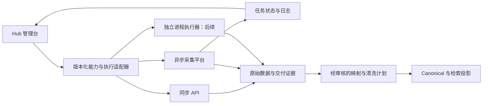

# Hub 数据插槽与外部平台接入方案

日期：2026-09-16。范围：Hub Admin 管理面；不变更 Launcher/MX-H2I 登录、联网、租户授权或客户计费。

## 决策：统一管理契约，保留不同执行方式

“数据插槽”适合当前 Hub。一个插槽表示 **Hub 与一个来源系统的一份可版本化接入关系**，
不等于一个进程、一张表、一个网站分类或一种统一收费方式。
同一平台可以同时提供同步 API、异步采集与数据库读取；一个业务数据集也可有多个来源插槽。
这里是 Hub 数据接入关系，不替代 Launcher 的部署 site-slot 或身份注册。



拆成三层：

1. **平台**：供应商/自建系统、运营责任、连接、凭据引用、健康与成本。
2. **执行适配器**：版本、固定能力、参数、执行方式、限额、幂等、观察与取消语义。
3. **数据交付契约**：原始证据、业务身份、映射版本、分页/水位、删除语义、数据集与清洗计划。

Hub 管理卡片统一呈现“归属 / 接入方式 / 操作入口 / 数据交付 / 数据契约 / 运行证据”。
卡片的未知状态保持未知；不会因为 SDK 导入成功、HTTP 200 或某次采集成功就标记全链路健康。
详情按“操作台 → 运行与日志 → 接入方案 → 接口参考”组织；采购/价格/凭据等只在适用平台出现。

## 当前来源如何落位

| 来源 | 执行方式 | 交付与治理 | 本轮处理 |
| --- | --- | --- | --- |
| ipsearch | 同步单条/批量 SDK/API | IP 画像合同、快照、原客户收费链路 | 统一卡片元数据，保留现有操作 |
| JustOne | 同步 HTTP，可能多次上游调用 | 采购证据、完整原始归档、Canonical | 保留原权限、额度、去重、价格与控制 |
| TikHub | 同步 HTTP，多步搜索/详情 | 分页、归档、映射与 System Proxy | 不改变代理、原合同或用户权限 |
| Night-All | 历史同步兼容服务 | 逻辑请求、快照、旧计费键 | 不改路由或替换为 Night-All-A |
| Night-All-A | HTTP 异步采集 + 独立数据库清洗 | 派发收据、任务/运行、步骤日志、Writer 契约 | 可选运行适配器、案例、观察与操作记录 |
| 195 小米应用商店 | 每请求一个独立 Python 进程 | 原 SDK envelope，待定 Canonical 映射 | 复核材料、候选 manifest；未安装/执行/上线 |
| Telegram / 移动电商 / 舆情等数据库源 | 增量 pull | 已有固定表、身份、水位、Writer 约束 | 保留现有 source/plan 身份和 checkpoint |
| 文件源 | 有界读取/导入 | 文件规则版本、来源身份、导入证据 | 继续使用现有受限文件根与格式规则 |
| 未来事件接入 | push/webhook/队列 | 事件身份、重放窗、顺序和确认点 | 仅定义扩展点，本轮不提供通用入口 |

不要把所有来源强制走外部付费 API 的价目表；也不要为统一 UI 改写旧请求指纹、分页或授权快照。

## 195 材料复核

读取用户提供的 `/tmp/195`，未执行其安装脚本、SDK 或联网 smoke。

| 项目 | 实际事实与结论 |
| --- | --- |
| 入口 | adapter.py:invoke，stdin 一个 UTF-8 JSON，stdout 一个 JSON，stderr 日志；适合独立进程 runner |
| manifest | manifest_version=1.0；声明 collect、参数与统一响应；作为交付描述有价值 |
| 检查记录 | ADAPTER_VERIFICATION.json: kind=adapter_reorganization_offline、live_queries_performed=false；passed=true 不能视为当前实时健康 |
| 离线样例 | status=error、error.code=INVALID_PARAMS，是错误路径验证，不是成功采集案例 |
| 文件一致性 | adapter.py SHA-256 `a187ec6689b37902aa5f319b6b1f3ca05e4a23f18d1c5108710e081a911fb9ca`；manifest.yaml `5a90318875ba86f323725a11eecf795493b3ff6e29f222164e12bd5c5eeb4fd2`，均与提交方记录一致 |
| 历史联网记录 | verification/independent-live.json 报告 2026-09-12 小米应用 1359 的 QQ 元数据成功；只是提交方历史证据，本轮未重测 |
| Schema 差异 | manifest 未写 inputs 的 1–50、ID 的 1–20 位数字、并发 1–5、max_requests 1–200 等完整范围；SDK client.py 有这些检查 |
| 历史能力 | history 字段被声明为 boolean，但该来源只允许 false；不能因为字段存在就提供“历史版本采集”按钮 |
| 主机参数 | work_dir 是执行器目录，不能直接暴露给租户或把任意目录挂进 Hub；runner 分配隔离目录 |
| 运行方式 | 同步 invoke 会重定向进程 stdout；不可在一个解释器并发执行。每请求独立进程/容器、独立目录、资源限制 |
| 状态 | success/no_data/partial/unknown/error/stopped；stopped 不是“有真实事件”，也不能无条件解释为用户取消 |
| 数据格式 | 外层协议统一，result 完整保留原 SDK 结果；这并不自动提供跨平台 Canonical 字段、主键或更新/删除保证 |

候选合同位于 `integrations/market-195/manifest.json`。它是 **Hub 收窄后的接入提案**，
不是原 manifest 的无损替代：只开放 inputs/input_kind/history，工作目录与预算由未来 runner 管理；
最大单进程 120 秒、4 MiB 结果等是提议的 Hub 边界，不是提交方已测容量。
当前未创建它的运行部署、数据库清洗计划、租户权限或平台健康记录。

## 交付包与 Hub 接入描述

采集器交付包建议继续保留：

```text
src/                         原采集实现
adapter.py 或 adapter.js     JSON 统一入口
manifest.yaml                原生能力、Schema、运行与依赖声明
ADAPTER_VERIFICATION.json    与文件哈希绑定的分层验证证据
README.md                    安装、来源、凭据、案例、限制、排错
依赖及锁文件
examples/                    成功、空结果、部分结果、错误样例
```

Hub 不根据上传的 command、callable 或任意 URL 自动执行。接入时审阅原包，
将其登记为 `integrations/<slotId>/manifest.json` 的内部规范化描述；原 manifest.yaml 仍属于供应方。
JSON 只是 Hub 当前校验器格式，不要求供应方重写源码或废弃 YAML。

当前校验器：`node scripts/check-integration-slots.mjs`。
它检查版本、适配器类型、能力、执行模式、幂等、数据交付、限额和证据分类，
阻止候选记录宣称已部署、待映射记录宣称已接入，以及重复能力键。
它**不**安装依赖、执行代码、验证远程服务、授予权限或启动采集。
能力的 inputSchema/resultSchema 内容还需要按对应标准及业务约束验收；元数据校验不是通用 Schema 执行器。

Night-All-A 的原生包不是上述 process 形态。它由 Hub 已有
`server/external-platforms/night-all-a.mjs` 担任 HTTP 适配器，固定目标、路径和凭据引用。
其规范化 manifest 位于 `integrations/night-all-a/manifest.json`。

## 控制面契约

统一概念，而非本轮新增一条绕过旧权限的通用执行 API：

| 动作 | 语义 |
| --- | --- |
| discover | 读取声明能力、输入 Schema 与运行条件；不触发采集 |
| submit | 一次明确业务意图；按适配器进入同步调用或异步任务 |
| inspect | 读取特定 invocation/task/run 的状态；不得重提任务 |
| logs / steps | 有界读取对应运行诊断；不可将日志轮询变为执行动作 |
| cancel | 只有适配器真实支持并验证幂等/权限后才开放；本轮 Night-All-A 未开放 |
| deliver | 交付原始响应/记录引用，并关联独立清洗映射；不自动宣布入库 |

至少关联：Hub invocation/dispatch ID、稳定请求指纹、适配器版本、平台标识、
upstream task/run/occurrence ID、操作者、时间、结果状态与错误分类。
原因、调用凭据和业务参数分别处理；凭据不得进入普通响应、日志或 manifest。

必须分开观察：

- **派发**：未派发 / 已登记 / 已取得 HTTP 收据 / 结果未知。
- **执行**：accepted / running / succeeded / failed / blocked / cancelled / unknown。
- **数据**：success / no_data / partial / unknown；保留原始 status、complete、stop_reason。
- **入库**：未接入 / 排队 / 清洗中 / 完成 / 失败 / 未知；上游保存计数不能替代 Hub 清洗证据。

Night-All-A 新页面直接展示这些区别；例如 succeeded + complete=false 显示“执行成功 / 部分”。
日志接口当前由上游步骤汇总而来，不把它描述成永久完整 stdout 或审计事件队列。

## Night-All-A 操作案例与实际实现

### 案例 1：一页新闻

UI 默认准备 china-news/news.collect，thepaper，最多 5 条、1 页，persist_results=true，max_attempts=1。
填操作原因后点击“触发一次采集”。准备或载入案例不请求上游。
返回 task/run ID 后点击“查看本次状态与日志”；读取 run、logs、steps，展示原始状态、
完整性、上游保存指标和诊断。默认不轮询，主动开启后每 5 秒查询，最多 5 分钟；
后台页面、离开页面、切换运行、终态或异常停止跟踪，不触发写请求。

### 案例 2：关键词新闻

同一连接器的 news.search，填写关键词，使用同样条数/页数边界。
原生能力依据来自本地 china-news/manifest.yaml；当前上游是否部署/可用仍需实际验证。
无结果不是故障证明，partial 不自动补抓，错误不自动换键。

### 案例 3：已有计划

显式读取 collection-plans → 选择计划 → run-now。
返回 occurrence 收据而非单个 run；通过该计划最近 50 个 occurrences 关联当前批次的 runs。
批次可能包含多个任务，不把首个完成当成全部完成。未在窗口找到时要求核对，不再次触发。
定时器仍由 Night-All-A 管理，Hub 不重复建立同一采集 schedule。

### 观察与历史入口

- 最近任务：显式读取最近 20 个上游任务，包括 Night-All-A 其他入口任务。
- 运行查看：支持直接填写 run ID，读取真实状态、日志、步骤和完整结果。
- Hub 操作记录：GET `/internal/v1/admin/external-platforms/night-all-a/dispatches`，
  最近 50 条持久写操作登记，列表只投影收据 ID/状态，不重复加载全部大响应。
- 单条证据仍用 `/dispatches/{dispatchId}`；已登记或未知请求不得自动重新派发。
- 日志操作白名单新增 runLogs/runSteps/runArtifacts；页面展示 logs/steps，artifacts 可经高级调试查询。

所有上述接口仅允许 Hub Admin Token；上游读取有 15 秒/4 MiB/8 并发限制，
写请求继续使用 migration 084 的持久幂等，不更改已有 Journal 数据。
数据库缺失/不可读时操作记录显示明确不可用，不伪造空历史或让平台页面崩溃。

## 数据交付契约：统一 envelope 不等于统一数据库

建议新映射至少声明：

| 字段/约束 | 要求 |
| --- | --- |
| source identity | 业务系统 + 实体类型 + 稳定 source ID；不使用标题作身份 |
| observedAt / eventTime | 区分采集观察时间与来源事件时间，明确时区，允许未知 |
| native evidence | 完整原始 envelope/业务 payload 与哈希，保留分页、错误、媒体和来源 |
| mapping version | Canonical 映射版本与 Schema 漂移处理；未审核时隔离，不能盲目入库 |
| delivery reference | API acquisition、run、file、table checkpoint 等来源证据引用 |
| watermark | 对数据库 pull 明确有序键、更新推进、提交可见性与补偿；offset 不能伪装 CDC |
| deletion | 明确 tombstone/软删除/不支持；查不到某条不等于应删除 |
| completeness | 区分完整、部分、空结果、未知；不把缺失指标写成零 |

195 的 app_id 必须作为字符串；app.package/version_code 可辅助版本建模。
`updated_at` 是来源日期，不能用作可靠 CDC 水位；`observed_at` 保留原结果与外层观察时间。
`raw` 归档，稳定 `app` 字段经审核映射；任何 source-specific 字段都不靠删减来“统一”。

Night-All-A 仍走现有 saved_records 固定 Writer 契约及分类表。
本轮不更改 DSN、sourceId、datasetId、映射版本或 checkpoint；先核对实际绑定再启用清洗。
Canonical → outbox → 检索投影继续由 Hub 管理，不让上游同时直接写 Hub Canonical 和 ES。

## 分层验收与后续顺序

1. **登记**：来源/许可证、版本与哈希、真实能力、Schema、凭据引用、安装说明齐备。
2. **离线契约**：成功/空/部分/错误/超时样例、未知字段与越界参数、stdout/stderr、返回大小。
3. **部署验证**：目标系统/架构、锁定依赖、网络、隔离目录、并发和容量；不沿用别的环境结论。
4. **一次有界联网验收**：事先确定目标和预算，保留真实结果与状态；不是安装成功截图。
5. **数据映射验收**：身份、时区、空值、重复、更新、删除、水位、Schema drift 与恢复。
6. **受控启用**：绑定平台/执行器/数据集，批准特定能力；租户 Public 权限与售价另行发布。

本轮交付的是可复用规范、校验器、两个 manifest、统一管理壳及 Night-All-A 操作流程。
未来再建设独立 process runner、上传包审批、部署绑定和事件接入；不在 Hub Web 进程里执行任意上传代码。
每加一家平台优先复用已验证适配器类型，保留其原始错误、成本和分页语义。

参考材料：用户截图的交付约束、`/tmp/195` 实际包、Night-All-A 本地 API/manifest、
Hub 现有 external-platforms、source-contract 与清洗路径。此文中的材料事实不等于对材料内安装/运行指令的执行授权。
