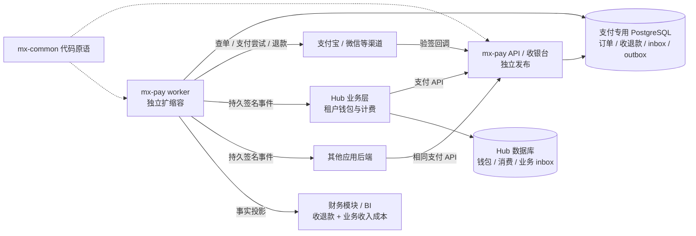

# 支付中心：服务边界、存储与 Kubernetes 稳定性

日期：2026-10-02。状态：总体目标设计；独立 API、专用库 schema、可靠付款事件、SDK 与一键迁移部署脚本已实现，尚未切换 Hub、迁移存量或部署到目标集群。本文更新[支付与成本规划](../product/payments-and-cost-control.md)中“未来拆服务”的优先级：**先完成 mx-pay 独立化与 Hub 业务接入，再扩充支付渠道。** 当前人工充值闭环保留，迁移前继续遵循原有事务与权限。

实现增量详见 [mx-pay 运行与部署说明](../../../mx-base/mx-pay/README.md)。独立服务首次采用应用拉取持久事件、业务提交后 ack；尚无自动推送 worker。`scripts/manage.sh deploy` 对新服务自动迁移再发布，但不会自动迁走 Hub 订单或重放入账。以下现状表描述原 Hub 路径；新服务与其切换仍是独立工作。

资源条件补充：用户说明现有机器性能较好、可适当扩展，支持考虑“独立 PostgreSQL + 至少两个 Kubernetes 工作节点”。本方案据此采用该组合作为正式环境规划基线；单节点/共享 PG 仅保留为本机或过渡方案，不作为默认正式目标。实际主机、磁盘、网络和集群拓扑尚待实施前核验。

产品与身份补充：支付中心独立管理台/看板，Hub 保留本租户的充值与账单入口，两者共用 Launcher 账号权威并分别授权。公开登录、邀请和现有 member/tenant 的兼容迁移见[平台统一身份与产品控制台](platform-identity-and-product-consoles.md)；支付独立化不以全平台 SSO 改造完成为前提。

平台归纳补充：[统一入口与运维中心演进](../../../mx-launcher/docs/32-platform-business-centers-and-management-integration.md)区分平台入口、技术运维和业务管理。财务是独立业务领域；各工作台可集成到 Launcher，支付事实仍归 mx-pay，既不搬进 Launcher 平台库，也不以统一运维中心建成为支付独立化的前置条件。

## 1. 决策

1. `mx-base/mx-pay` 拥有产品无关的支付领域、支付 API、渠道适配、收银台、支付存储和后台 worker。版本、镜像、Deployment、数据库权限与发布周期独立于 Hub。
2. Hub 提供业务入口、租户钱包、消费计费和本产品账单/开票入口；通过与其他应用相同的支付契约接入 mx-pay。公司综合财务工作台属于财务领域。支付核心不调用 Hub 判断某个用户能否消费，不直接写 Hub 钱包。
3. `mx-common` 继续提供 PostgreSQL 连接/迁移、事务、队列与健康检查等通用原语。支付表、支付状态机和资金执行约束归 mx-pay；退款业务资格归应用，财务审批与核算归财务模块，均不搬进 common。
4. 为 mx-pay 使用独立 database、role、迁移历史和备份恢复边界。共享 PostgreSQL 实例只作为资源受限的过渡；满足较强隔离要求的正式目标使用独立支付 PostgreSQL 集群或专用托管实例。
5. 应用付款成功后的交付通过持久事件完成。mx-pay 保存资金事实，应用保存业务事实，报表是可追溯的汇总；不实现跨数据库同步双写。
6. 支付发布连续性、节点容错、数据库容错分别设计和验收。安装了 Kubernetes、存在 readiness 或执行 `rollout status`，都不代表已经具备这三种能力。

## 2. 仓库现状与差距

以下是静态代码证据，不是在线集群巡检，也不是吞吐测试结果。

| 核对项 | 当前证据 | 判断 |
| --- | --- | --- |
| 支付服务 | 原规则包/Hub 闭环保留；新增 mx-pay `server`、`migrations`、`scripts/manage.sh` 与独立部署 | 独立运行代码已具备，Hub 业务适配/存量交接与目标集群验收尚未完成 |
| 支付与钱包 | `server/payments/service.mjs` 的 confirm 调用 `PaymentStore.credit`，复用 Hub store 同库事务 | P0 正确性有保障，但生命周期和数据库依赖 Hub |
| 支付表 | 迁移 122 位于 Hub，`mx_pay.orders.tenant_id` 外键指向 Hub tenants | 当前不是通用应用订单模型；不能直接搬数据库后启动 |
| API 部署 | `deploy/k8s/internal/30-public-api.yaml`、`31-admin-api.yaml` 均为单副本、`hostNetwork: true`、`Recreate` | 固定宿主端口妨碍同节点新旧 Pod 并存；当前更新会有中断窗口 |
| readiness | `server/app.mjs` 只检查 store，不等待 Night-All/外部数据源 | 隔离方向正确，应在支付服务延续 |
| 关闭流程 | `server/index.mjs` 响应 SIGTERM，关闭服务与连接池 | 有基础清理，但未形成独立支付 drain 状态、明确请求期限与发布验收 |
| 存储 | mx-common PG16 StatefulSet 单副本；默认保留本地卷，按产品建库/角色 | 数据库和权限可分开，主进程、WAL、IO、磁盘和节点仍是共同故障域 |
| 连接池 | Hub 主 store 直接 `new Pool(options)`，另有 mx-common 池和检索池 | 并非所有存储都走 common 的超时配置；扩副本前必须汇总连接数和超时 |
| 公共任务队列 | 支持同事务 enqueue、`SKIP LOCKED`、租约和重领 | 有可靠任务基础；现有 ack/fail/heartbeat 缺认领令牌约束，见第 8 节 |
| 查询 | P0 订单有索引、分页及限额；按页 OFFSET 查询 JSONB 快照 | 可支撑功能使用；没有大订单量、持续负载和发布中请求的性能证据 |

现有测试证明过重复确认不重复入账、并发唯一性、事务回滚和环境隔离；不能把这些测试结果当作高可用或高吞吐证明。当前源码也不能支持“其他系统故障不会影响支付”的完整承诺。

## 3. 职责：交易核心、业务层与财务层

| 能力 | mx-pay 交易核心 | 应用业务层（包括 Hub） | 财务扩展/报表层 |
| --- | --- | --- | --- |
| 支付订单、渠道调用、查单、通知 | 主责；固定金额、环境、收款账户和订单身份 | 发起业务单，保存 paymentId | 读取支付证据 |
| 价格、优惠券、折扣、套餐 | 校验最终应收及授权范围，保存价格摘要/版本 | 主责；算价、优惠资格、核销与失效恢复 | 分析优惠成本和销售表现 |
| 渠道优惠/手续费 | 记录渠道返回的实付、补贴、应结算额和手续费 | 判断业务补贴归属 | 核对渠道账单与费用承担方 |
| 钱包充值与 API 消费 | 不持有 Hub 可消费余额，不进行 API 扣费 | Hub 主责：实付充值、赠送、冻结、扣费、退款冻结 | 汇总客户余额及负债/收入证据 |
| 退款 | 主责：原支付关联、金额上限、并发预留、退款渠道调用、未知结果与退款流水 | 判断可退资格/金额、冻结额度或撤销权益、完成业务冲正 | 审批、异常处理、费用与票据联动 |
| 收退款明细、渠道账单、结算差异 | 主责；资金事实与支付子账 | 提供业务单关联 | 共用工作台查询和关账核对 |
| 营收、毛利、成本、资产负债等报表 | 提供收付款和费用证据 | 提供实际交付、消费、优惠及采购证据 | 主责；独立口径版本和会计处理，不由付款事件猜测 |
| 发票申请与登记 | 提供支付/退款引用及必要可核对金额 | 提供销售主体、服务项目和业务可开票依据 | 主责：申请、开具登记、交付、红冲及金额占用 |
| 会员/订阅 | 执行已授权的单次支付；未来可承载渠道扣款协议引用 | 主责：续费计划、计价、授权与服务周期 | 订阅收入与应收分析 |
| 渠道代理分账、供应商付款 | 未来独立资金执行能力 | 渠道合同/佣金、采购和应付归属 | 审批和结算；不混入客户收款余额 |

支付与财务工作台可以在统一平台入口相邻展示，财务作为独立业务领域拥有自己的记录与 API，不依附于支付交易核心。首期保留 Hub 中的发票页面，后续通过财务模块处理；报表模块暂停时，下单、支付回调与查单仍运行，需要财务批准的新资金动作等待有效批准。无需立即再建完整 ERP 或优惠中心；先由各应用实现自己的业务规则，确有跨应用复用再抽模块。

例：商品标价 ¥100，应用优惠 ¥20，交给 mx-pay 的应收为 ¥80，支付中心不自行重新定价。退款按该订单实际支付及既有退款约束执行；折扣如何分摊到部分商品由业务层固定版本并提供依据。充值 ¥100 赠 ¥20 时，mx-pay 记录实收 ¥100；Hub 分别记实付与赠送额度，不能把赠送金额当作可退实付款。

## 4. 目标拓扑与依赖方向

同一个品牌或域名可以将 `/api/v1/payments`、收银台、渠道回调直接路由到 mx-pay Service，不能先穿过 Hub Node 进程。Hub 页面调用自身业务 BFF 下单是合理的，但其他应用和支付渠道不以该 BFF 为必经入口。固定支付 URL 随服务迁移保持稳定；网关本身也需独立发布和冗余，避免把单点从 Hub 移到另一台反向代理。

支付进程只加载支付配置、支付库、应用凭据和必要渠道密钥；不启动 ETL、LLM、搜索、GPU、数据采集或 Hub 钱包服务。应用鉴权由 mx-pay 本地保存的专用凭据校验，不逐次向 Hub/Launcher 验证机器调用。人类登录仍复用现有身份体系，不新建第二份用户密码库，也不修改 MX-H2I 登录。

人工码仍需要有人核实，不能因服务独立就声称会自动到账。应提供由 mx-pay 独立承载的最小收款核实页面/管理 API，Hub 可嵌入入口。已有短时、受限管理会话按既定有效期使用；身份服务不可用时，新登录或需要重新验证的高权限操作明确不可用，不能无限延长会话或绕过授权。机器交易与已接受的付款事实处理不受此影响。

## 5. mx-common 与数据库

### 5.1 放进 common 的是技术原语

复用 `@qpjoy/mx-common/postgres` 的连接、事务与迁移原语，以及补强后的通用队列能力。mx-pay 自己拥有 migrations、数据库访问层和只追加的资金事件；Hub 不拿支付库写凭据，mx-pay 不拿 Hub 库写凭据。支付客户引用是应用范围内的不透明编号，不能跨库外键关联 Hub tenants。

`mx-common` 既有代码包也有共享有状态部署。**复用代码包，不等于必须使用它当前的共享 PG 实例，更不等于支付依赖整个 common 服务集合。** 独立支付部署只检查支付 PG、配置和必要密钥，不调用等待 ES/Redis/HanLP 的全量 `ensure`。需要增加组件级 provision/health 与指定 PG 目标的运维能力；现有 `provision mx-pay` 仅能得到共享实例里的独立库，不能称为独立数据库集群。

### 5.2 分阶段的物理部署

| 模式 | 资源 | 能解决 | 仍有的限制 |
| --- | --- | --- | --- |
| 本机测试 | 独立进程、测试 PG、合成支付数据 | 契约与流程验证 | 无生产可用性承诺；内存模式不得用于实款 |
| 单节点过渡 | 独立支付 Pod/库/角色/连接预算；有余力时先用专用 PG 实例 | 支付不随 Hub 程序发布；副本与存储边界可迁移 | 同机掉电、磁盘、网络故障仍影响全部；共享 PG 时还受其重启/IO 影响 |
| 正式目标 | 跨节点 API/worker、专用 HA PG、独立存储/资源配额、冗余入口 | 发布连续性，隔离 Hub 数据负载，定义范围内的节点和 PG 故障恢复 | 基础网络、云/机房、DNS、支付机构仍有不可消除依赖 |

正式规划基线为独立支付 PostgreSQL + 至少两个可调度工作节点；PG 采用经过运维验证的 HA 方案，具体仲裁与节点数按所选方案配置，不能简单把普通 PostgreSQL StatefulSet `replicas` 改为 2。严格跨节点调度在单节点环境应显式降级到“过渡配置”，不能静默把两个同机 Pod 标为节点容错。

同实例分库隔离逻辑数据与事务范围，但不能隔离 CPU、连接、WAL、检查点和 IO；跨库也不能获得原来支付+钱包的单事务。专用 PG 仍可使用 common 的配置和运维约定。备份保存异机副本、WAL 与密钥恢复材料，定期恢复并与渠道及应用账核对；PITR 是灾难恢复，不是日常代码回滚手段。

PG 异步复制可能在主库故障切换时丢失尚未复制的已提交事务；若要求指定单节点故障下已确认支付记录 RPO=0，必须配置相应同步持久化和安全晋升，并接受同步副本不可用时的写入可用性取舍。RTO 依赖实际故障检测和切换演练，不能由“有副本”推断。[PostgreSQL 16 复制与同步提交](https://www.postgresql.org/docs/16/warm-standby.html)

### 5.3 数据所有权

| mx-pay 支付库 | Hub / 应用库 | 财务投影库或专用读模型 |
| --- | --- | --- |
| 应用凭据与范围、销售主体/收款账户 | 用户、租户、商品、业务订单与价格版本 | 报表口径、账期、汇总、差异处理记录 |
| 支付订单、attempt、渠道收款流水 | 钱包、消费冻结/扣费、赠送余额 | 带水位/来源的收退款与业务收入成本投影 |
| 退款请求/占用/尝试/结果 | 退款资格、可退额度冻结、业务冲正 | 发票申请、开具/红冲与交付记录 |
| 原始通知 inbox、可靠事件 outbox、送达记录 | 已接收支付事件 inbox、幂等交付和回执 outbox | 报表导出任务与审计 |

测试/正式身份贯穿应用凭据、通道、订单、事件和业务交付。可以共用代码与表，用环境列建立索引/唯一约束和强制授权；生产测试负载也需限额。大规模压测、破坏性迁移与故障演练使用独立预发布数据库，不靠 `environment=test` 保护同库正式交易的性能。

### 5.4 基于已补充资源条件的部署基线

| 层 | 正式规划 | 实施时必须确认 |
| --- | --- | --- |
| 工作节点 | 至少 A/B 两个独立故障域，分别承载支付 API 与 worker 副本 | 同一物理宿主机上的两台 VM 不能算宿主故障隔离；节点与磁盘故障域需要核实 |
| 支付 API | 初始 2 副本，正常时 A/B 各 1；发布允许临时第 3 个 Pod | 剩余单节点应能承接已验收的正常交易负载；预留发布与其他业务的资源余量 |
| 支付 worker | 初始 2 副本跨节点，任务依靠数据库租约与业务幂等恢复 | worker 不依赖固定 Pod 身份或节点本地文件；按渠道/应用限制并发 |
| 支付 PG | 专用实例/集群，独立于 Hub 的大规模数据负载；主备持久化副本跨故障域 | 独立实例只提供隔离；持续可用还需复制、安全晋升、旧主隔离和切换演练 |
| PG 扩展 | 需要在一个副本故障后继续保持同步写入时，评估主库 + 两个候选同步备库或等效托管 HA | 两副本同步方案失去唯一同步备库时可能暂停写入；不能自动降为异步后仍宣称原来的无损保证 |
| 入口与控制面 | 冗余网关/负载均衡；控制面、etcd 仲裁独立验收 | “两个工作节点”不等于 Kubernetes 控制面高可用；自建 kubeadm HA 按官方拓扑评估至少三个控制面节点 |
| 备份 | 异机/异存储故障域备份 + WAL 归档 + 定期恢复 | 同盘另一个目录不算异地容灾，支付密钥恢复材料也需可用 |

上述为逻辑角色，不要求每一行都购买独立物理服务器；资源和故障域允许时可合理共置，但不让一次宿主机故障同时失去所有支付 API、数据库副本或仲裁多数。算力较充裕时优先保留故障与滚更余量，再按压测结果调整 requests/limits 和并发，不凭机器规格预填吞吐承诺。

两工作节点与 `maxSurge: 1` 要配套调度设计：正常 2 副本分布 1+1，发布时允许 2+1，不能同时设置“每节点最多一个同类 Pod”的硬反亲和而让第 3 个 Pod 永远 Pending。可按 hostname 的 topology spread 控制偏斜，并在目标 Kubernetes 版本验证可调度域和故障时的行为；节点不足时保留既有容量并暂停发布。参考 [Pod 拓扑分布约束](https://kubernetes.io/docs/concepts/scheduling-eviction/topology-spread-constraints/)。

控制面与 etcd 的节点数量和冗余入口参考 [kubeadm 高可用部署](https://kubernetes.io/docs/setup/production-environment/tools/kubeadm/high-availability/)；数据库的同步备库取舍参考 [PostgreSQL 同步复制](https://www.postgresql.org/docs/16/warm-standby.html#SYNCHRONOUS-REPLICATION)。具体 PG 运维实现尚未选定，不在本轮引入新的 operator 或改变现有集群。

生产放行增加三个独立证据：持续请求下完整滚更无重复资金动作；停止任一工作节点后剩余 API 可服务、任务可恢复；PG 主库切换后已确认记录保留且无双主写入。记录中断时长、未知结果恢复、队列积压和连接恢复，不能只检查最终 Pod 全绿。

## 6. 可靠且快速的调用链

### 6.1 新建与付款

1. 应用自己完成登录、算价和资格判断；Hub 则校验充值受益租户和允许金额。业务订单持久化后，用稳定业务单号调用支付 API。
2. mx-pay 在本地校验凭据、范围、金额、币种和应用绑定。短事务写订单、幂等身份与待执行任务后返回 `paymentId` 和收银台地址；人工码可立即展示，官方通道未生成付款指令时显示 preparing。接口区分“已创建”和“渠道已就绪”。
3. worker 使用该订单的稳定渠道请求编号准备支付指令。渠道网络调用在数据库事务外执行；响应丢失记录 unknown 并按原编号查单，不切换商户或无条件重建订单。尚未发出请求的任务可以安全退避；已发出且结果不明的任务进入查证。
4. 回调验签、核对商户/金额/环境/订单，持久化 inbox、付款事实与 outbox 后，再按渠道协议成功应答。已持久化而需异步核对的事件显示待处理，不提前把钱记成成功。PG 不可写时不返回虚假接收成功。
5. 通知 worker 将付款事实发送应用；应用校验并把 inbox 和业务入账/交付任务放入自己的同一事务。回调应答意味着可靠接收，不等于业务已经完成；业务结果用回执或查单同步。

已有支付详情直接读取支付库，不实时询问 Hub、业务应用或每次遍历支付渠道。支付机构异常只影响该渠道准备/查证能力；已保存订单查询与其他渠道正常工作。用户返回页面只触发有界查询，不能作为支付依据；轮询有退避与停止条件。

### 6.2 Hub 自身的适配

Hub 新增薄的 payment client 与充值业务处理器：`充值申请 → 调用 mx-pay → 接收 payment.paid → 幂等增加原租户钱包 → 回报入账结果`。所有 Key 仍使用原钱包与原计费规则，不因拆支付服务而逐次消费时远程调用 mx-pay。数据 API 的高频扣费继续在 Hub 自己的事务边界内执行。

支付订单可以是 paid，而 Hub 充值业务是 pending_credit。Hub 暂停时付款仍可确认，钱包稍后入账；页面明确显示“已付款，余额入账处理中”。恢复后按原支付身份补投一次入账，不能再次要求客户付款，也不能把余额增加失败变成支付失败。租户在付款后被停用时保留真实收款，按 Hub 业务策略转异常处理，不由 mx-pay 自行恢复租户或修改授权。

### 6.3 故障效果

| 故障 | 应继续工作 | 暂停或延迟 |
| --- | --- | --- |
| Hub / 某应用停机 | 已有收银台、渠道回调、支付详情、其他应用 | 故障应用的新业务申请与付款后交付；通知积压保留 |
| 财务/BI/邮件停机 | 下单、收退款事实、查单、通知 | 报表/开票/邮件，显示投影水位或积压 |
| ES/Redis/LLM/ETL 停机 | 全部支付关键路径 | 可选缓存/搜索功能；无绕过鉴权的降级 |
| 单个支付渠道异常 | 本地订单查询、其他渠道、已知事实保存 | 该渠道准备/退款/查证；未知请求不盲重试 |
| 一个 API Pod 更新/退出 | 其他就绪副本承接流量 | 退出实例停止新流量，在期限内排空已有请求 |
| worker 退出 | API 与付款事实持久化 | 任务按安全租约重新认领；不把过期认领当成未执行证据 |
| 支付 PG 不可用 | 可展示受控维护信息 | 停止资金写入与确认；恢复后以原单查证，不退回内存记账 |

“不依赖其他系统稳定性”的可实现目标是故障隔离和结果可恢复，不是数据库、网络或支付机构失效时仍然无条件成功收款。

## 7. Kubernetes 发布设计

### 7.1 初始工作负载

一个轻量支付镜像先提供两种运行角色：`api`（含收银台与回调）和 `worker`。分别用 Deployment 扩缩容，初始生产目标各至少 2 副本；迁移独立 Job。渠道回调在 API 内有独立并发预算与限流，不被订单列表或报表挤占；流量或隔离证据足够后再拆第三个 webhook Deployment，避免一开始拆出很多小服务。

使用普通 Pod 网络、ClusterIP Service 与稳定网关，支付不依赖宿主 `127.0.0.1` 的 Night-All/代理。独立 Namespace/ServiceAccount/Secret/NetworkPolicy/资源请求与上限；不以支付部署为由更改 MX-H2I 的 DNS、路由或宿主网络。

拟定发布参数，须在真实集群演练后定版：

| 设置 | 初始设计与原因 |
| --- | --- |
| RollingUpdate | `maxUnavailable: 0`、`maxSurge: 1`；保留旧就绪副本直到新副本可用 |
| 就绪稳定期 | `minReadySeconds: 10`；新 Pod 不能仅启动瞬间 ready 就立刻替换旧容量 |
| 发布期限 | `progressDeadlineSeconds: 300`；超时由发布控制流程停止推进/报警，不能假定 Kubernetes 会自动回滚 |
| 调度 | 生产按 hostname 分散副本，评估 zone；预留 surge 资源，否则发布会停滞 |
| PDB | 最低 2 副本时可用 `maxUnavailable: 1` 控制自愿驱逐；不能代替 Deployment 更新策略或抵御突然掉机 |
| startup/liveness/readiness | startup 保护冷启动；liveness 检查进程；readiness 检查支付 PG/兼容 schema/必要配置及 draining 状态，不探测 Hub/所有渠道 |
| 优雅结束 | `terminationGracePeriodSeconds` 初始 60 秒，按真实请求上限调整；preStop 触发 drain 并留路由收敛时间，整个 hook 计入宽限期 |
| 制品 | 独立版本或 digest、旧镜像保留；多节点可访问镜像仓库或逐节点预加载，不依赖当前 Hub `imagePullPolicy: Never` 的单机缓存 |

滚动更新的并存规则来自 [Kubernetes Deployment](https://kubernetes.io/docs/concepts/workloads/controllers/deployment/)。PDB 约束自愿驱逐，Deployment 自己的滚动更新不受其直接限制：[Disruptions](https://kubernetes.io/docs/concepts/workloads/pods/disruptions/)。

readiness 为 false 后，进程仍需处理已经接受的请求及短暂的流量收敛；随后停止监听/关闭空闲连接，在期限内等待在途请求和事务，再释放连接池。SIGTERM 同样进入该状态机，不依赖 preStop 必然执行。worker 停止认领、给已认领任务继续受限续租和收尾，超时终止后由下一 worker 查证/恢复；不要退出时直接把所有在途支付尝试标记 pending。行为依据 [Pod 生命周期](https://kubernetes.io/docs/concepts/workloads/pods/pod-lifecycle/)与[健康探针](https://kubernetes.io/docs/concepts/workloads/pods/probes/)。

### 7.2 迁移与回滚

迁移 Job 先执行向前兼容的加表/加列/加索引，旧版本仍能读写；新 Pod 仅校验 schema 兼容范围，不每个 Pod 自行 DDL。新旧 API/worker 在发布窗口内兼容同一事件版本；遇到未来版本事件保留并告警，不能确认后丢弃。

common 当前迁移器每个文件包在事务里，不能直接放入要求事务外运行的 `CREATE INDEX CONCURRENTLY`。大表索引另设可续跑步骤，检查残留 invalid index、限制锁等待并验收；小表与无阻塞的增量 DDL 才走现有事务迁移。迁移锁使用专用会话，若增加事务级连接代理，迁移任务直连或使用会话模式。

发布先迁移 → 新版本有限流量/mock 验证 → 检查错误率、延迟、积压和重复资金动作 → 逐步更新。回滚代码保留兼容 schema；字段删除/语义改写延后到所有旧 Pod、未完成任务和回滚窗口结束。不能回滚数据库到旧时间点来撤销已经发生的支付。新 Pod 不就绪时保留旧容量、停止推进，不执行全站先停后起。

## 8. 可靠队列：复用前必须补足的条件

common 当前 `enqueue(..., { client })` 可以与业务写入原子提交，`claim` 使用 `SKIP LOCKED` 并设置租约，这两点适合支付任务。PostgreSQL 官方将 `SKIP LOCKED` 定位为多消费者队列可用的避锁方式，而非通用一致性读：[SELECT locking](https://www.postgresql.org/docs/16/sql-select.html)。

但当前 `complete(jobId)`、`fail(job)` 基本按 id 更新，`heartbeat(jobId)` 只增加 running 条件；旧 worker 暂停至租约过期、任务被另一 worker 接管后，旧 worker 仍可能确认/修改新的认领。`runWorker` 也不自动持续 heartbeat，`reclaimExpired` 没有限定本 queue 范围；现有 dedupe 只覆盖 pending/running，不能当作永久支付去重。

建议新增向后兼容的队列 V2 能力，支付先采用，再单独评估其他消费者迁移：

- 每次 claim 生成不同的 `lease_token` 或递增认领代数；所有续租、完成、失败、交付状态写入使用 `id + queue/namespace + token + 当前状态` 比较，检查受影响行数。失去租约的 worker 不再变更本次任务状态。
- 自动 heartbeat 和明确最长执行期；过期扫回限定本产品/队列，按任务种类处理重领与尝试上限，保留死信证据。正确性不依赖进程内锁。
- 支付/退款请求有业务级持久唯一身份，渠道使用稳定幂等编号；数据库认领令牌不能撤销已经发到渠道的 HTTP 请求。unknown 必须进入查单，不能重领后当作全新付款。
- 持久 outbox/inbox 保留事件身份与送达记录；一次 worker 完成或任务行清理不删除资金去重依据。保留消费侧幂等，即使通知确实重复也只交付一次。
- 为每个应用和渠道限制并发，采用退避、抖动、积压告警和死信重放；一个坏通知地址不能占满所有 worker。重放关联原事件，并记录操作人和原因。

验证至少包括：旧 worker 失联后恢复不得 ack 新认领；认领后/发渠道请求后/写结果前被杀；重复通知；事务提交响应丢失；队列积压跨版本恢复。这些能力尚未加入 mx-common，本规划不修改它的现有运行代码或消费者行为。

## 9. 退款是跨层协作，不是付款的简单反向按钮

1. 用户向业务应用申请退款。应用基于履约、已消费/冻结额度、优惠分摊及合同规则决定可退金额；Hub 先原子冻结对应可退的实付余额，不能先付款后再尝试扣余额。
2. 应用保存稳定退款业务单与授权/冻结引用，通过受限退款权限向 mx-pay 提交。mx-pay 核实应用、原支付、币种、收款账户、批准金额与审批状态。
3. mx-pay 在短事务里锁定原支付的可退额度：累计已成功退款 + 所有在途/unknown 退款 + 本次申请不得超过已确认可退实付；partial refund 并发也不能超额。手续费/渠道补贴按实际渠道账单区分，不能将原标价当作退款上限。
4. 退款任务事务外调用渠道，持久化处理中/成功/明确失败/unknown。超时不等于失败，不释放退款占用，不另建一个退款编号重复退钱。
5. 明确成功后产生 `refund.succeeded`；应用幂等冲正钱包/权益并回报。明确未执行或终态失败后，应用按事件释放业务冻结；unknown 的冻结不能因本地 TTL 自动释放。发票/财务模块另行处理票据及报表。
6. 应用离线时已授权的退款执行结果继续保存并补投；无法取得业务可退资格时拒绝新退款。管理员紧急退款也要有审批和异常处置记录，不默认绕过业务余额保护。

业务冻结和支付中心退款占用分别属于各自数据库，通过持久申请/事件关联。申请响应丢失时按原退款单查回；应用只有在支付中心明确取消且未发出、或明确失败后才能解冻。手工退款渠道需管理员完成真实退款并登记证据；单纯调整钱包余额不代表钱已经退到客户账户。当前 P0 没有退款执行接口，本流程为后续设计。

## 10. 性能、报表与稳定性目标

### 10.1 关键路径保持短

支付请求只经过 `入口 → 支付鉴权 → 索引查找/短事务 → 返回`；渠道准备和结果查证使用持久任务。连接复用、有限并发、请求体/结果大小上限和每应用限流优先于堆副本；Redis 可以优化限流但不能成为丢失即绕过鉴权/资金唯一性的条件。

订单按 `(application_id, environment, business_order_id)` 唯一，付款/退款流水另有全局商户范围唯一键。查询按应用/环境/时间建组合索引，详情走主键，长列表采用 `(created_at, id)` 游标，避免深 OFFSET；财务筛选按真实查询计划补索引，金额用整数最小单位。不可变 checkout 资源按版本引用并独立保留，避免每个订单反复复制大图或每次列表解包整个快照；历史快照仍可追溯。

收付款明细可以有界实时查询；全公司/月度报表、全量导出和 BI 走异步投影或独立读资源，明确 `as_of` 水位、币种、销售主体与补记版本。报表不在确认支付的事务里计算；支付详情、退款限额、资金入账读取权威主库或具备明确一致性保证的路径，不以可能延迟的报表副本做资金决策。

每个 Deployment 的连接预算按 **峰值副本（含 surge）× 每实例所有连接池上限 + worker + migration + 运维保留量** 计算。当前共享 PG `max_connections=200` 不能全部分给 mx-pay；HPA 上限必须与连接和 DB IO 预算一起限定。交易连接设置短的获取、语句、锁等待和 idle-in-transaction 期限；外部 HTTP 不持 DB 锁。是否引入 PgBouncer 由测量决定，先解决现有多个池的预算和一致配置。

### 10.2 初始验收指标（目标，非现有成绩）

- 支付核心可用性先按月 99.9% 作为工程目标；另报计划发布、渠道可用性和端到端业务交付，不通过剔除已收但未处理的事件制造好看的成功率。
- 健康环境下，同区服务端详情 p95 ≤ 200ms、持久建单 p95 ≤ 300ms、已校验回调持久应答 p95 ≤ 500ms；不包含人工核实、支付机构响应或应用交付，另测它们的等待时间。
- 已确认资金事实在声明的单节点故障范围内不丢失；数据库 failover 恢复时间以演练为准，首次目标 ≤ 60 秒。同步复制不可用时明确暂停写入，不声称同时无损且永不中断。
- 健康接收应用的通知通常在付款提交后 5 秒内完成可靠接收；离线场景按最老未送达年龄、死信和恢复耗时报告。不能将 HTTP 200 视为已开通服务。
- 业务正确性始终优先：重复支付确认/事件不能重复记账，重复退款不能重复出款，超时结果可查证，test 永远不能交付 live 权益。

目标负载由真实流量决定。首轮可用明确标为合成的 10 建单/秒 + 50 查单/秒 + 10 回调/秒、持续 30 分钟并施加 3 倍短峰值作基线，在至少百万订单量级的预发布数据上观察 p95/p99、错误率、锁等待、连接等待、CPU/IO 和队列最老年龄；未实测前不宣称支持该规模。加入应用离线、Pod 滚更、PG 切换和渠道超时，验证的是完整链路而非单个函数吞吐。

### 10.3 Hub 数据调用的评估

已有 public/admin/后台 worker 分层、PG 事务、索引和投影，方向可继续使用；把支付拆出去会减少相互影响，但不会自动提升数据上游响应速度或钱包热点写入能力。

Hub 现有 public/admin 的 hostNetwork 与本机服务访问需要单独迁移到可路由 Service/明确出口，再调整 Pod 网络和副本；不能只把 Recreate 改为 RollingUpdate。逐项审计进程内限流/singleflight、临时状态、定时任务和凭据刷新在多副本下的语义，统一连接与超时预算，并测量现有租户钱包行锁、存储查询和真实上游耗时。已付费或结果未知的数据请求仍遵循现有不盲重试约束。

因此结论是：**当前架构有可演进的基础，当前部署还不是无中断、高可用的运行形态；高效运转需以分路径压测和实际故障演练证实。** 支付独立化与 Hub 公共 API 滚更改造分批实施，避免一次改动同时影响支付、身份和用户联网。

## 11. 从当前 P0 迁移，保持一套事实

先建立支付核心接口与 Hub 充值处理器的边界，再切运行形态，不把租户钱包代码复制进新服务。现有库内支付+钱包同事务在切换前继续有效；跨库后替换成各自本地事务 + inbox/outbox，并在 UI 区分 paid / credited。

迁移步骤必须单独编写可演练脚本：

1. 清点当前支付订单、收款配置、已关联渠道流水、钱包入账引用、待核实/开票订单；标记每笔原始订单及钱包事实。新 schema 使用通用应用客户引用，保留旧 payment UUID/外部引用及业务映射。
2. 预复制支付记录到新库并校验数量、金额、环境、流水唯一性与快照哈希；导入不会发送付款事件、不会生成新钱包入账。历史已入账标为已有交付证据，不能只看到 paid 就再次派发充值。
3. 切换时对支付写入做有界冻结，等待在途确认完成，补齐最后增量，确认全局渠道流水索引和路由归属。冻结范围仅支付，Hub 登录、数据查询与原有消费不因此停机。
4. 指定 mx-pay 为新建和确认的唯一写入方；旧控制台路由变为受权适配层，保留已保存订单链接。禁止旧 Hub 确认器与新服务同时核实同一收款账户，否则两个数据库各自唯一仍可能重复入账。
5. 原钱包幂等引用继续识别 `mx-pay:<payment UUID>`，新消费者先检查历史交付身份。验证 paid、pending、submitted、cancelled 和发票状态，补偿只处理缺失交付，不能改写历史收款或重置钱包。
6. 切换前失败可继续原写入方；新服务接受第一笔新交易后，回退需保留新权威支付数据和事件，不能简单切回旧库。旧表保留只读审计，待财务与恢复验收后再决定归档。

“一套逻辑和数据”的目标是每类事实有一个权威写入方，内外应用使用同一支付契约与账务证据；不要求业务钱包和支付资金流水物理上挤在同一数据库。支付流水与钱包账本是不同事实，不算重复维护两份余额。

## 12. 实施顺序与放行条件

| 阶段 | 交付 | 放行依据 |
| --- | --- | --- |
| S1 领域拆分 | mx-pay 通用订单/商户/应用契约；Hub 钱包与折扣规则留业务层；独立持久接口 | 原人工充值、权限、开票、幂等与登录回归通过 |
| S2 独立运行 | 支付 API/收银台/最小核实入口、worker、专用 PG、应用凭据；补强队列；mock 接入 Hub | Hub 停机时既有支付可处理，恢复后只入账一次；重领/回调/未知结果测试通过 |
| S3 发布与切换 | 独立 K8s 发布、迁移/切换脚本、数据恢复、资源预算 | 连续流量中滚更/回滚；坏 Pod/worker 被杀可恢复；旧新唯一写入方已证实 |
| S4 实款与第二应用 | 人工收款生产链路、另一应用交付；按资质开通官方沙箱/生产渠道 | 小额真实收款与应用账、渠道账一致；测试与正式隔离 |
| S5 财务扩展 | 退款协作、财务角色/复核、账单导入、发票模块与报表投影 | 并发退款上限、冻结恢复、未知结果、票据引用与报表口径验收 |

正式 S2/S3 按第 5.4 节的独立 PG 与至少两个工作节点推进。单节点仅用于开发/过渡验证，保留节点/PG 单点限制；生产 HA 的节点、存储和 PG 拓扑在实施前实际核验，不用 YAML 字段代替资源条件。

实现进度：已补独立 mx-pay 的交易/API/迁移/事件/部署代码，未修改 Hub 现有交易路径、mx-common 队列或 MX-H2I 实现；没有执行目标环境的迁库或部署。Hub 业务 inbox、存量单写交接与真实滚更验收仍未完成。正式上线额度、资源配置与可用性承诺在部署和压测证据齐备后确定。
