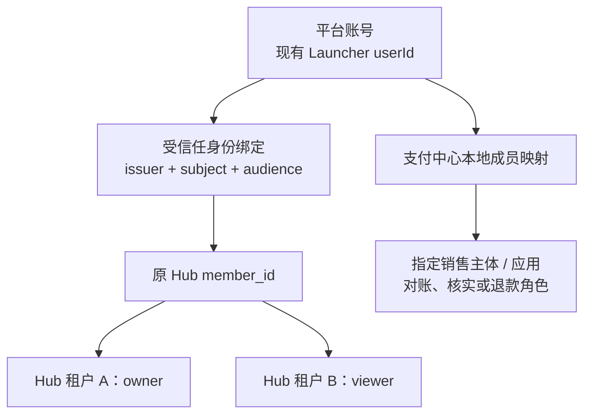

# 平台统一身份、产品控制台与存量租户过渡

日期：2026-10-02。状态：基于当前 Launcher/Hub 身份代码的规划，未变更登录、账号、租户、权限、域名、注册或部署。承接[支付中心独立服务规划](payment-center-service-boundaries-and-reliability.md)与[现有身份契约](unified-identity-and-platform-modules.md)。

## 1. 选择：独立产品控制台，统一账号与入口

建议支付中心拥有独立管理界面和支付看板，财务作为独立业务领域逐步形成自己的工作台。Hub 保持数据中心、数据服务、ETL/ELT、AI/BI 的产品定位，并保留自己租户的余额、充值、账单和发票页面。Launcher/User Center 提供平台账号，AppCenter 提供产品导航；各产品不各自维护密码或另开一套用户注册。

统一入口与运维中心的最新归纳见 [Launcher 平台业务分域规划](../../../mx-launcher/docs/32-platform-business-centers-and-management-integration.md)：从现有 Internal Admin 演进统一平台入口和可独立发布的运维控制台；业务工作台可嵌入或独立打开，数据与业务授权仍归所属中心。财务界面近期可以相邻展示，不再把完整财务领域定义成支付核心的附属模块。

独立界面与统一体验可以同时实现：共用账号、设计规范、导航和可复用组件，产品前端独立构建部署。支付中心直接打开自己的 URL 也应可用，不能以 Hub 页面/进程存活为前提。统一门户只做进入产品和有界汇总；某产品停机显示该产品不可用，不阻断其他产品。

| 方案 | 收益 | 代价 | 结论 |
| --- | --- | --- | --- |
| 所有支付/财务界面放 Hub | 近期页面复用多 | 财务依赖数据平台发布，导航与权限混杂，其他应用需要绕到 Hub | 仅适合现有 P0 过渡 |
| 支付完全独立，另建账户与权限体系 | 产品运行独立 | 用户重复注册，离职/禁用不同步，维护多个认证真相 | 不采用 |
| 支付独立控制台 + 统一身份 + Hub 业务入口 | 各产品边界和故障隔离明确，用户仍用一个平台账号 | 需要标准登录契约、产品角色与少量本地成员映射 | 目标方案 |

“账号统一”“登录一次可切换产品”“不同产品拥有相同权限”是三件事。目标实现前两项；产品权限按职责和业务范围显式分配，不能因成功登录就获得所有产品访问权。

## 2. 现在已经有什么

| 当前证据 | 实际语义 |
| --- | --- |
| Hub `server/identity/launcher-client.mjs` | 后端向内网 Launcher 代理密码登录；使用 opaque token introspection，默认成功结果缓存 30 秒、请求超时 3 秒 |
| Launcher `sdk-gateway.controller.ts` | token 接口当前处理 password/client_credentials；存在 Feishu 流程，不代表已有通用 OIDC Authorization Code Provider |
| Launcher `domain.ts` | 当前 issuer 为 `mx-user-center:<environment>`，人类 subject 为 `user:<userId>`，令牌 audience 独立校验 |
| Hub 迁移 007 | `iam.members`、`external_identity_bindings`、`tenant_memberships`、`platform_admins` 和身份审计 |
| Hub `IdentityService.resolve` | 登录可创建本地 member/binding，不创建租户或租户 membership；平台管理员另按显式 scope allowlist 判断 |
| Hub PostgreSQL store | 按 `(issuer, subject, audience)` 找回原 member；变更 issuer/audience 可能落入新成员创建路径 |
| Launcher SDK 创建用户接口 | 需要 Internal Ops Token；管理员创建能力不能当作开放注册 API |
| Hub 管理面与数据面 | 普通人登录和 Hub 数据 API Key 是不同身份；数据 Key 不变成人类管理会话 |

用户确认目前 Launcher 未开放公众注册，地址仍在内网。源码已针对该条件实现 **浏览器 → Hub 登录接口 → 内网 Launcher**，浏览器无需直连 Launcher。是否能从公网访问 Hub 取决于真实网关配置，本轮未做在线巡检；不因为代码有代理就声称公网登录已发布。

已有“同一账号可登录”的基础，但没有证据证明所有产品已具备统一浏览器 SSO 会话。当前内省也不是离线 JWT 验签，不能仅因返回字段叫 `jwt` 或有 `oauth` 路径就当作完整标准协议。

## 3. 产品界面与数据归属

| 产品/界面 | 用户主要工作 | 权威数据与职责 |
| --- | --- | --- |
| 平台账号中心（逻辑名称，沿用 Launcher User Center） | 登录、账号安全、身份关联、组织资料 | 账号、认证凭据、身份状态、平台应用登记；未来标准身份协议 |
| Launcher Internal / Release Center | 运维、配置、产品发布、设备和网络控制 | 现有 Internal 真相与 release/artifact/网络权限；保持 MX-H2I 现有语义 |
| Hub 数据工作台 | 数据接入、清洗、查询、AI/BI、Key 和数据授权 | Hub 租户、产品角色、数据权限、消费计费与钱包 |
| Hub“账户与账单” | 当前租户余额、充值、充值状态、消费记录、发票申请 | Hub 业务账 + 经受权支付 API 查询的关联付款记录 |
| 支付中心管理台 | 收款账户、应用接入、订单、核实、退款执行、对账、支付看板 | mx-pay 资金事实、应用/商户范围授权及审计 |
| 财务工作台（独立业务领域，接入统一平台入口） | 应收应付、发票、费用、审批、账期、综合报表 | 自有财务记录与口径、关联支付及业务证据；分期形成独立模块/服务，不进入已授权收款的同步关键路径 |
| 运维工作台（从现有 Admin 演进） | 各中心的安装、升级、容量、健康、备份与恢复任务 | 部署实例、版本、运维任务与执行证据；不获得业务账本写入权 |

客户在 Hub 发起充值，不必先学习支付中心的应用/商户概念。财务人员直接进入财务或获授权的支付工作台，无需拥有 Hub 数据集、API Key、AI 工作台或平台部署权限。后续统一财务报表可用 Hub 的 BI 技术加工受限投影，但支付系统不能以 BI 运行正常作为收款条件；要求财务批准的新退款/支出仍需取得有效批准。

同一付款只有 mx-pay 一份权威记录；Hub 页面按本应用、本租户映射查询，不能用财务全局凭据拉全量订单再由浏览器过滤。管理台、Hub 摘要页和应用 SDK 复用同一支付状态契约，避免分别实现确认/退款逻辑。

## 4. 影子账户：保留本地成员，改善产品表达

Hub 的“影子账户”是本地授权主体，不是另一份可独立登录的账号。建议在产品中称为“成员”，技术文档称为“本地成员映射”。继续保留原 `member_id`，无需为了统一登录删除再重建。

可以在管理入口展示“张三：Hub A 的 owner、支付中心应用 X 的对账员”，底层仍分别保存产品授权。支付中心的本地成员也不保存密码；一人多产品角色不代表身份重复注册。

必须区分以下对象：

| 对象 | 含义 | 不自动等同于 |
| --- | --- | --- |
| 平台 user/account | 自然人的统一登录身份 | 业务租户、公司或收款账户 |
| 平台 organization | 组织目录与人员关系 | Hub tenant，或订单上的发票抬头 |
| Hub tenant | 数据产品的授权、消费与钱包边界 | Launcher tenant/org；支付商户主体 |
| 支付 application | 哪个系统发起订单、接收事件 | 自然人账号或 Hub API consumer |
| 销售主体/商户账户 | 资金与票据的公司归属、渠道收款账户 | 客户租户或付款人 |

现有 Launcher 的 organization/tenant 元数据仍只作为观察信息。未来可新增显式 `platform_org ↔ product_tenant` 关联表，先支持一个组织关联多个 Hub 工作空间；没有核实的关系保持未关联。平台组织管理员不自动成为每个产品 owner，不能按同名公司、邮箱域或发票税号自动合并现有租户。

跨产品报表需要共享客户编号时另加映射，不修改 Hub tenant UUID、钱包归属或历史账本。跨应用共用钱包也是另一个业务决策，本规划不把不同应用的钱包自动合并。

## 5. 统一认证、产品授权与机器凭据

### 5.1 一个身份权威，多个授权边界

继续以 Launcher User Center 的已有账号为身份权威。逻辑上可对用户显示为“MX 账号中心”，不必立即改仓库名、重建账号服务或迁密码。User Center 将来可成为独立发布的身份服务；在存量兼容完成前，不因支付中心建设而改写 Launcher 的令牌或 H2I 登录路径。

| 判断 | 负责方 |
| --- | --- |
| 此人是谁、账号是否有效、是否完成所需身份验证 | 账号中心 |
| 此人能否看到产品入口 | AppCenter/平台应用目录；仅入口资格 |
| 此人能否管理 Hub 租户、数据或 Key | Hub 的当前 membership 与产品授权 |
| 此人能否查看某商户账单、确认收款、审批退款 | mx-pay 的本地产品角色与明确范围 |
| 某应用能否下单/查单/请求退款 | mx-pay 的应用服务端凭据与范围 |

统一管理体验可以通过一个管理页面委派调用各产品的授权 API，查询实际成功/失败并记录审计；不设一张所有产品直接读写的“全局角色表”，也不以页面隐藏代替后端授权。跨产品批量授权需分别返回执行状态，不能把一部分成功显示为全部成功。

Hub owner 不自动得到收款核实或退款执行权；现有 Hub platform admin 不自动成为支付中心全局管理员。迁移时为指定财务经办人显式授予范围，并保留旧权限的审计依据。AppCenter 可见性、产品角色、具体资源范围始终分别校验。

### 5.2 机器交易独立于人类登录

应用支付凭据由 mx-pay 管理，绑定 application、test/live 和最小权限；Hub 原数据 API Key 继续由 Hub 管理。它们不复用管理员 Token、浏览器会话或 Launcher 网络令牌。渠道回调靠渠道协议验签，不靠员工是否登录；已接受支付的通知与查证不依赖账号中心即时在线。

人类操作可短时依赖身份检查；支付交易的机器路径不会因登录服务暂时不可达而停止。账号中心停机时，新登录和需要重新认证的退款/收款账户变更暂停；已存在会话按明确的有效期和撤销策略处理，不能无限延长或自动降级为管理员。

## 6. 内网身份中心到对外访问的路线

### 6.1 当前阶段：保留存量，先做好独立支付台

Hub 继续使用现在的后台登录代理与 opaque introspection，不改 audience、issuer、member 或 tenant。新支付管理台先作为 Internal 应用接入同一 User Center 的专用 audience 和受限人员授权；短期内重复输入同一平台账号可接受，不能把这种体验宣传为完整 SSO。

公网开放要拆成三个独立事项：已有用户能够登录、指定用户接受邀请、新用户自由注册。它们不需要同时启用。建议先支持已有账号和受邀用户，公众自助注册继续关闭。

### 6.2 目标阶段：独立公开的身份入口

建设可公网访问的窄身份入口，示意为 `accounts.<公司域名>`；它服务登录/授权/找回/邀请等已实现功能，管理配置和用户主数据仍由 Internal 控制。浏览器访问该入口而不是 `10.*` 私网地址；Internal Ops、发版、网络管理、服务账号管理和通用 introspection 不随之整体开放。

平台门户、Hub、支付中心分别登记客户端与精确回调 URL。新网页登录目标采用 **OIDC Authorization Code + PKCE**：账号中心已有登录会话时，跳到另一个产品可完成授权回跳，无需每个产品收集密码。各产品建立自己的服务端会话，不共享全域万能 Cookie，也不在 URL、iframe 或跨窗口消息里传平台 bearer token。Cookie 范围、CSRF、state/nonce、PKCE S256、登出与会话撤销按统一契约实现。

这是新功能，不是把当前 `/oauth/token` 换域名即可获得。OAuth 当前安全最佳实践不允许新设计使用密码凭据 grant；因此现有 Hub 代理仅作为待迁移兼容路径，新公开网页登录应走上述目标协议。标准依据：[OIDC Code Flow](https://openid.net/specs/openid-connect-core-1_0.html#CodeFlowAuth)、[OAuth 安全最佳实践](https://www.rfc-editor.org/rfc/rfc9700.html)。

建议先在当前账号权威上增加标准协议适配与客户端登记，保持账号唯一写入方。若实现成本评估后选择成熟 IdP，必须先定义现有账号/外部身份的受信任链接与密码过渡方案；不得另建一套可自助注册的平行账号库再按邮箱拼接，也不得让两套系统同时编辑同一密码真相。

未来身份服务独立发布，需要一起隔离面向公众的认证处理负载、连接池和限流预算；只拆一个公开网关而后端仍是 Launcher 单进程，并不能隔离 Launcher 发布或故障。该运行拆分另行灰度，旧 SDK/H2I endpoint 继续兼容。新用户流量不得共享并耗尽 H2I 登录的整体限额；保留每客户端、每主体、受信任来源的有界限制，XFF 只接受明确受信任代理重写。

### 6.3 注册与邀请

第一步沿用平台管理员创建账号，邀请流程后续实现；Hub 产品成员由具备 `membership.write` 的租户 owner 或平台管理员管理，普通 tenant admin 不因此扩大权限。后续邀请链接应绑定产品/租户/拟授角色、一次性与有效期；接受前验证邀请归属，已登录其他账号时不能静默绑定。账号中心和产品分别写自己的事实，通过持久任务完成接纳；暂时失败显示“账号已建立，工作空间开通中”，重试不得重复建租户或重复赠送额度。

公开注册另设开关、核验和滥用控制。注册只得到最低平台身份，不自动获得 MX-H2I 网络、Oversea 服务、Hub 租户 owner、支付财务角色或赠送余额。需先审计现有用户创建的默认角色、AppCenter/网络与产品初始化副作用，再设计面向公众的最小 onboarding profile；不直接公开现有管理员创建用户接口。已有用户的默认行为在此阶段不修改。

支付收银台的付款人也不必注册平台账号：可用应用发起的受限订单会话完成付款。付款人身份不等于支付管理员，提交公司抬头不自动创建组织或授予企业权限。

## 7. 存量 Hub 租户的平滑过渡

### 7.1 必须保留的身份与账务

不重建 Launcher userId、Hub member_id/tenant_id/consumer_id、API Key 身份与 secret、membership 角色/停用状态、钱包/冻结额、价格版本、授权与历史账本。现有租户无需重新注册、换 Key、转余额或重新申请数据权限。

当前 Hub 绑定键包括 audience。当前 issuer 是 `mx-user-center:<environment>`，不是内网访问 URL；仅切换后端访问地址无需顺便更换 issuer。但未来 OIDC issuer 通常是新的受信任 HTTPS 标识，subject 也可能按客户端变化，必须先做身份映射。不能把新登录直接送入当前 JIT 创建分支，否则同一个人可能得到没有旧租户权限的新 member。

OIDC 的稳定身份依赖 issuer 与 subject，不保证不同客户端的 pairwise subject 相同；邮箱和显示名不适合作为自动合并依据。[OIDC 身份稳定性与 subject](https://openid.net/specs/openid-connect-core-1_0.html#ClaimStability)

### 7.2 双协议兼容，单个成员与权限真相

1. **只读盘点**：导出受限迁移清单，包括当前身份三元组、Launcher userId、Hub member/tenant/membership、停用与管理员状态；记录数量和关联校验，不导出密码或 Key 明文。
2. **建立可信映射**：账号中心通过已有账号记录或受验证的双身份链接提供新旧 subject 对应关系。新增 binding 指向原 member，而不是创建新成员；记录版本、证据和经办人。冲突进入人工处理，按邮箱或组织名猜测不属于有效证据。
3. **避免并发重复**：映射与首次新协议登录在同一成员解析规则下串行/唯一约束执行。迁移用户的新登录先检查映射；缺映射时明确回到旧登录或待处理，不能先 JIT 新建再覆盖原 membership。
4. **小范围验证**：内部测试账号 → 指定现有租户 → 更多租户。对比新旧登录的 tenantIds、逐租户角色、API Key 列表、余额、价格和操作权限；包括一个人 A 租户 owner/B 租户 viewer 的情况。
5. **新旧登录并存**：每条路线严格验证自己的 issuer/audience/会话，不能放宽成通用 wildcard。两条路线都读同一 Hub 成员和产品授权；注销/停用/撤销需要覆盖两条路线，不能只撤销新会话而旧令牌仍无限有效。
6. **逐步切入口**：Hub 和支付台的新网页登录分别灰度；H2I/Launcher 桌面仍走原协议。失败可恢复旧入口，新创建的有效身份映射保留，不回滚用户账本或删业务数据。
7. **有证据后退役**：旧协议流量、客户端版本和业务兼容期满足条件后，再明确安排退役。不能为了支付中心完成而提前停掉存量 H2I 登录。

平台 org 与 Hub tenant 的关联另外迁移，不与登录协议切换、支付数据库切换同批进行。三种变化各自有回滚边界，降低一次错误同时影响登录和资金链路的可能。

## 8. 性能、撤销与故障隔离

当前 opaque introspection 的成功缓存减轻了身份中心请求，但不能无限延长。共享身份客户端库可统一超时、缓存上限、按 token 摘要合并并发内省和错误语义；目标缓存期限不超过令牌剩余有效期与允许的撤销延迟。不同 audience、issuer、环境的结果不能混用；无效令牌不会因一个产品的成功缓存而变有效。

后续标准网页登录建立产品会话，可减少每次页面请求对账号中心的同步依赖；产品仍查询或受控缓存自己的成员/权限版本。高权限财务动作要求最近的身份验证与当前产品授权。账号注销与权限撤销采用明确事件/有效期策略；若采用短时签名令牌，本地验签带来的可用性收益与撤销窗口要一起验收，不能承诺离线验证同时立即知道所有撤销。[RFC 7662 缓存取舍](https://www.rfc-editor.org/rfc/rfc7662.html#section-4)

| 故障 | 目标效果 |
| --- | --- |
| Hub 数据服务停机 | 支付中心独立界面和已受理交易继续运行；Hub 钱包交付等待恢复 |
| 平台门户/AppCenter 停机 | 可以直接访问产品 URL；不影响已经建立的产品会话或机器 API |
| 账号中心停机 | 新登录/续期/重新验证受限；有效会话按既定策略处理，机器付款和渠道回调继续 |
| 财务报表模块停机 | 支付事实继续持久化，报表显示滞后，恢复后补投影 |
| 公开注册流量过大 | 注册/登录入口按客户端隔离负载，不拖垮原 H2I 登录和支付 worker |

所有“继续运行”以其自身数据库和必要网络可用为前提。当前 Hub 对 Launcher 不可达已有服务错误与 Admin Token 运维通道；现有缓存和会话机制不能被描述为已经实现上述全部目标。

## 9. 降低维护成本的方式

- 复用当前 `mx-launcher/ui-design` 的设计规范与适用组件；它已被 Hub 引用。统一品牌、导航、错误语义和表格/表单模式，产品可独立打包，避免每次打开支付页面运行时下载 Hub 的最新代码。
- 共用版本化身份客户端/协议测试、支付 SDK、金额与状态展示组件、运维模板；产品的角色判断和业务状态机各有一个权威实现。
- 用户目录、认证凭据与账号生命周期由 User Center 维护一次；每个产品只保留授权和审计所需的成员映射。
- 初期由现有 AppCenter 承担统一导航，不为“看起来统一”先建设一个巨大微前端平台。支付台、Hub 可保留独立 URL；嵌入视图是可选展示方式，不是鉴权或稳定性依赖。
- 发布中心统一登记各产品制品与版本，但发布目标独立。发版中心暂时不可用时，已部署的支付/Hub/身份服务继续运行。

独立服务确实会增加制品、监控和备份责任；通过共享模板和自动化管理这些成本，比共享数据库/超级 Token 来省事更可控。相关脚本依然需要逐产品健康检查，不能部署支付时顺带重启 Launcher 或等待所有 Hub 数据服务。

## 10. 实施顺序与验收

| 阶段 | 交付 | 保护存量的条件 |
| --- | --- | --- |
| I1 产品边界 | 独立支付台导航/权限契约；Hub 保留客户充值入口；统一账号文案 | 当前登录、租户、钱包和财务操作不变 |
| I2 支付独立化 | 按支付架构 S1–S3 实施服务、数据库与管理台 | 专用 audience/角色；Hub 停机不阻塞支付；不要求先完成全平台 SSO |
| I3 标准身份入口 | 独立可访问登录入口、客户端登记、OIDC/PKCE、邀请；开放注册默认关闭 | 新旧身份映射测试与两协议登出/停用测试先通过 |
| I4 存量灰度 | Hub 新网页登录小范围启用，仍映射原 member/tenant | Key、余额、价格、角色、H2I 登录/联网回归；可切回旧入口 |
| I5 财务与组织扩展 | 财务角色/看板、可追溯组织关联、按需自助注册 | 不自动合并租户或扩权；独立资源与撤销/滥用控制已验收 |

重点验收：同人多租户权限不串；新旧 issuer/audience 不能重复建成员；改邮箱/重名不转移租户；跨产品 Token 拒绝；Hub admin 不自动是支付 admin；邀请不能误绑其他账号；产品停用与平台停用边界正确；账号中心不可达不影响机器支付；公网路由不暴露 Internal Ops；支付/身份灰度期间 MX-H2I 原登录与联网保持可用。

本轮只更新规划，未执行账号盘点导出、角色授予、域名开放、注册启用、身份/支付数据迁移或任何部署。
