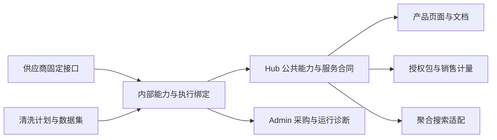

# 数据服务、批量开通与渠道定价方案

日期：2026-09-27。状态：**设计建议，尚未实施本篇新增工作流、导航和渠道结算**。

本篇基于当前 Hub 源码、Night-All 迁移第一阶段及本次用户请求。截图用于理解管理体验，不证明线上权限、价格或数据健康。此次只更新设计文档，不调整现有 Key、消费者授权、采购价、销售套餐、余额、生产开关或 MX-H2I / Launcher 登录联网。

## 1. 建议决定

1. 保留现有计费内核：供应商采购价、Hub 销售价分开；套餐绑定调用者（consumer），钱包和统一倍率属于租户，Key 是接入凭证与访问范围。
2. 增加“批量开通”工作台。Admin 可按供应商、平台、产品或接口包选择全部/部分已审核接口；租户只按获售的 Hub 产品配置自己的 Key。一次操作应完成预览与批量执行，不要求逐接口重复填表。
3. 采购价使用有来源和生效日期的价目快照。供应商级模板是便捷输入，不代表所有端点同价。销售模板由采购参考和 Hub 产品定价策略生成草稿，再发布为稳定客户合同。
4. 外部以“发现与检索 / 数据服务 / 场景应用”组织产品。供应商、直连/清洗、数据库、价格成本、内部路由只在 Admin 的“数据接入与治理”中出现。
5. 注册原生接口不会自动扩展聚合搜索。只有具备明确搜索语义、分页、投影、费用与授权合同的能力，才进入聚合执行计划。
6. 先提供渠道租户合同价及推广返佣；后续有确切需求再建设托管转售。不给普通租户开放“修改自己应付单价”的能力，也不用 Key 伪装独立客户钱包。

## 2. 代码现状：价格没有绑定单个 Key

| 对象 | 当前实际职责 | 配置权限与限制 |
| --- | --- | --- |
| 上游 operation/release 采购价 | 内部逐端点成本、预算、币种和调用证据 | Admin-token 管理；不决定客户售价 |
| 销售套餐 / price book 版本 | 每个 meter 的客户基础价、额度、发布来源 | 平台管理员发布；旧分配不随新版本自动变化 |
| consumer 的套餐分配 | 当前调用者使用哪个已发布套餐 | 平台管理员修改；同一 consumer 的所有 Key 共用 |
| tenant billing profile / wallet | 租户余额、计费模式、统一倍率与未列价操作的默认价 | 平台管理员修改；租户不能自己充值记账或降低应付价 |
| API Key | 调用身份、范围、到期、独立请求限制及归属统计 | 有相应权限的租户成员可配置所属 Key，范围不超过 consumer 授权 |

当前 `customerRequestPrice` 的精确优先级：

- 有套餐条目：`ceil(条目 unitPriceMinor × (租户 multiplierPpm ?? 套餐 defaultMultiplierPpm) / 1,000,000)`。
- 套餐明确写 0：仍是明确免费，不回落到租户默认价。
- 没有套餐条目：使用租户 `defaultUnitPriceMinor` 作为最终单价，不再叠加倍率；未设置时当前是 0。
- 当前客户单位是 request；批量 IP 等由业务拆成子计费请求。按记录、字节、任务或 token 计价不是现有通用能力。
- 产品组合的倍率在发布时已编译进条目；租户倍率在请求报价时应用。预览必须显示这两步，避免把它们误认为同一个折扣而重复打折。

因此，“新建多少 Key 都享受同一倍率”在同一租户统一倍率层面成立；“所有 Key 最终同价”只有在相同计费项、套餐和计费模式下成立。同租户的不同 consumer 可以绑定不同套餐，统一倍率仍覆盖这些套餐的条目价。不同 Key 不应单独拥有采购价或结算倍率。

现有 Key 支持显式更新范围：`POST /internal/v1/admin/api-keys/:id/scopes`，保留密钥、身份及状态，提交旧范围用于并发冲突检查，并写入权限变更审计。消费者新增授权不会自动扩大 Key；该机制可直接复用于批量开通，不能省略为一次“刷新权限”。

代码依据：`server/billing/contracts.mjs`、`shared/billing-composition.mjs`、`server/stores/postgres-store.mjs` 的套餐分配/Key 范围更新、`server/app.mjs` 的 billing/profile、consumer plan、Key scopes 权限检查。

## 3. 定价：采购、销售、渠道各有明确边界

### 3.1 上游官方价如何成为默认值

管理员点“采用官方参考价”时，应加载最新**已核对**的逐端点价目快照，显示来源链接、观察时间、币种、单位、计费成功条件、合同版本、阶梯条件及人工例外；不是在每次业务请求时爬官网。

2026-09-27 核验：TikHub 的[官方定价页](https://tikhub.io/pricing)说明端点单价各异，部分端点支持按日边际阶梯；不能用首页示例覆盖全部端点。JustOne 的[官方使用指南](https://docs.justoneapi.com/zh/usage)将具体接口价格放在登录后的控制台，公开文档不足以生成完整价格表。此次没有登录供应商账户、读取采购凭据或取得实时账户合同价。

| 价格证据情况 | 批量处理 |
| --- | --- |
| 有有效、已审核的固定官方价 | 默认填充该端点的参考采购价，保留快照版本 |
| 存在账户协议价 | 账户合同价优先，官方价保留为参考，不覆盖协议 |
| 阶梯 / 充值赠额 / 量价条件 | 分开保存规则、保守预算估计和实际成本对账；不承诺每次都命中最低档 |
| 面议、未知、没有访问到价格 | 标为待补价，从可执行批次中排除；不能填 0 或套用邻近端点 |
| 已有人工例外 | 默认保留；明确勾选覆盖并展示前后差异才替换 |

现有 `providerPricingTemplate` 已支持选择操作、同一基础价、保留例外、预览 token 和逐项结果；应扩展成逐端点/多币种导入及审批，不另造第二套采购策略。账单的实际成本、审核参考成本和未确定成本必须分别呈现。

**精度是实施前置项。** 当前接口要求整数 minor units，供应商可能存在 USD 0.001 等小于一分的单价。不可直接舍为 0 或按 0.01 冒充官方价。新增采购价版本需支持带 scale 的固定精度金额或十进制定点值；旧账本单位不变。客户仍可用当前分单位零售价；若要向客户按微额原价转售，则需要独立的高精度累积/结算设计，不能逐次向上取整后仍声称原价。

不同采购币种不直接相加。需要生成 CNY 销售草稿时，显式选用有日期的汇率与加价策略，保存转换快照；实时汇率或供应商价格波动不能改写客户已发布价格。

### 3.2 销售价与折扣

建议以稳定 Hub 产品/能力 meter 建立标准销售价目，支持两种草稿来源：现有 Hub 产品模板；已审采购参考价经明确汇率、服务加价规则生成的建议售价。最终都发布为现有不可变套餐。

- 同一套餐给多个普通租户复用；合同折扣用现有租户倍率，0.8 即八折。
- 同租户某业务需要不同价格，用 consumer 专属套餐条目；无需给每个 Key 创建价格对象。
- 普通 tenant owner/admin 可管理 Key 范围和预算，但无权修改 Hub 对该租户的应付价。
- 显示“成交单价、单位、币种、套餐版本、适用范围”，采购来源和内部利润不进入租户 DTO。
- 新批量开通中，缺销售价必须让管理员明确选“免费”或补价。这个工作流限制不改变既有未列价回落规则，也不追补历史收费。
- 不为提高毛利自动换供应商、不在同一查询轮次切路由；价格合同与交付语义各自稳定。

### 3.3 自用、渠道转售、推广三种模式

| 模式 | 谁向 Hub 付钱 | 怎么赚钱 | Hub 首期需要做什么 |
| --- | --- | --- | --- |
| 普通客户 / 内部团队 | 当前租户 | 不涉及渠道收入；多个 Key 用于应用隔离 | 共用钱包、合同价和账单，Key 设范围/预算 |
| 渠道自营产品 | 渠道租户 | 向自己的客户收产品/服务费，承担 Hub 批发价 | 复用租户合同价、consumer 应用隔离和费用归属；不默认托管其零售账本 |
| 推广伙伴 | 被推荐的新客户直接向 Hub 付款 | 按实际已结算的合格消费获得返佣 | 独立客户租户、推荐归属、返佣规则版本及结算记录 |
| Hub 托管转售（后期） | 必须选择固定的渠道承担或终客承担模型 | 批发与零售价差，或明确佣金 | 客户/账单主体隔离、双层价目、收入分账、退款冲回、信用与对账；不能用普通 Key 倍率代替 |

建议先支持“渠道自营 + 推广伙伴”，不立即建设多级代理树。推荐关系本身不能获得被推荐客户的 Key、数据或成员管理权；没有普通租户自改支付金额的入口。

示意而非实际报价：Hub 标准售价 ¥0.10，渠道合同价 ¥0.08，渠道自营服务向终客收费 ¥0.12，则渠道毛差 ¥0.04；Hub 的采购成本仍是独立事实。推广返佣则基于终客实际 capture 的合格消费生成，hold、未知、免费、充值和幂等重放不重复计算，退款要冲回。推广收益、钱包余额与采购赠额分别记账，不混为可随意提现的同一余额。

不建议直接把渠道自己的生产 Key 交给多个独立客户：那只是渠道代付，共享消费归属且缺少客户隔离。自营网关在服务端保管 Key；需要终客直接访问 Hub 时，使用独立子客户身份与明确 bill-to 关系，待托管渠道模型实现后开放。

## 4. 快捷开通：一次预览，一个受控批次

### 4.1 三个动作要在同一向导里看清

1. **供应准备**：Hub 的某个接口合同、采购价格、凭据、运行策略是否就绪。这是共享运营状态。
2. **客户开通**：目标租户/consumer 可以购买哪些 Hub 能力、使用哪个销售套餐。
3. **接入分配**：把这些能力授予选定 Key，保持原密钥及其他范围不变。

“为一个 Key 启用”不能默默变成供应商全局 active。缺全局准备时，Admin 向导可以合并处理，但必须列出共享开关影响的其他已授权 consumer/Key。对新操作可选目标 consumer 的 canary；已经 active 的操作保持现状，不因为给新客户开通而缩成单客户 canary。

### 4.2 建议界面

- Admin 从外部平台、租户/调用者、Key 页面进入同一“批量开通”向导。
- 选择目标 tenant → consumer → 一个或多个现有 Key / 新 Key；选中 Key 不代表同 consumer 的其他 Key 一起扩权。
- 选择供应商的已实现接口，或 Hub 产品包；按平台、能力、合同版本、价格完整性、运行状态筛选。支持全选当前清单、选择筛选结果和逐项勾选，清楚显示真实选择数量。
- 选择采购参考版本及端点例外；选择已有销售套餐，或组合发布一个新版本；租户倍率单独呈现。
- 展示预览表：合同、当前开关→目标开关、采购参考、客户成交价、客户授权差异、Key 差异、额度、受影响对象、阻塞原因。预览不探测供应商、不充值、不付费试调。
- 提交“应用这 N 项”，返回每项完成/保留/阻塞/失败及原因；一处失败后只能继续未完成项，不重发已发布套餐或已修改的价格。

“供应商全部接口”精确定义为**选定供应商清单版本内、当前 Hub 已实现且可审核的所有接口**。前一批 50 项不是整个供应商所有产品。清单新增端点后只生成待审核差异，不沿用全选表达式无限扩权。保存一个可复用的版本化接口包，后续开户复用即可。

租户的对应入口叫“为应用开通服务”，只展示其合同与授权范围内的产品；不能选供应商、改采购价、激活共享接口或给自己增加消费授权。

### 4.3 一致性与恢复

建议新增 Admin-only `provisioning-batches/preview`、`provisioning-batches/apply` 和只读批次状态接口（名称待实现时固定），底层复用现有价目、套餐分配、grant 与 Key scopes 接口规则。不要让浏览器自己循环几十次并假定全部成功。

服务端保存规范化目标清单、actor、各对象修订、目录/采购价/销售价版本、差异 hash、过期时间和幂等批次 ID；apply 重新授权并检查预览版本。局部成功明确记录，重试只执行未完成且前置条件仍成立的步骤。

先持久化准备状态，再发布价格与授权，最后开放新增调用。能在同一个数据库事务完成的客户授权/套餐/Key 步骤尽量一并提交；跨阶段保留持久检查点。单个 Key 必须原子更新，保留用户原来其他能力和额度。失败不能留下“Key 可调用但所选销售合同未绑定”的中间状态；不要通过撤销整把 Key 或恢复旧账本来回滚新增配置。

默认不修改现有租户其他 consumer 的合同，也不增加余额。租户服务默认配置目前会同步多个 consumer，故向导必须区分“只为此 consumer 开通”和“租户默认开通”，不能错误复用全租户写接口。

## 5. 外部产品按用途分，内部供应按执行分

建议继续用“数据产品”作为总入口，下面使用分区标题或两层可折叠菜单，避免再套多层 Provider：

```text
数据产品
  发现与检索
    数据目录 · 聚合搜索
  数据服务
    企业数据 · IP 风险画像 · 社媒内容 · 账号资料 · 电商数据
  场景应用
    新闻发现 · Telegram 会话 · 全国舆情 · 虚拟超市
    小红书〔笔记画卷 / 热门笔记 / 创作灵感〕 · 专题洞察

数据接入与治理（Admin）
  上游供应商〔启信 / ipsearch / JustOne / TikHub / 以后新增项〕
  数据库连接 · 采集与清洗计划 · 分类与索引 · 血缘与质量
```

这是建议导航，不代表所有上列新服务已有成熟公共合同。先归类现有页面，新“社媒内容 / 账号资料”需用已有能力组成可调试服务后再发布。

不采用“数据 Provider / 自有数据源”作为客户菜单：供应渠道与数据归属是不同事实，清洗过的数据不因此变成 Hub 自有版权；同一个产品以后也可能融合多种执行方式。“创意阁”可作为创作灵感专区的品牌副标题，不适合作为 Telegram、新闻和舆情等所有清洗产物的技术分组。

| 截图中的项目 | 外部定位 | Admin 执行来源 |
| --- | --- | --- |
| 企业数据 | 数据服务 → 企业数据 | 启信类供应商接口及其已审合同；不因供应商更名而换客户入口 |
| IP 风险画像 | 数据服务 → IP 风险画像 | ipsearch 适配、独立授权及计量 |
| JustOne / TikHub | 分解到社媒、账号、电商等 Hub 服务 | 上游供应商列表内保留真实名称与端点清单 |
| Telegram 清洗产物 | 场景应用 → Telegram 会话 | 清洗输入、checkpoint、canonical 会话/上下文 |
| 全国省份舆情 | 场景应用 → 全国舆情 | 清洗与归类，按现有地域/类别授权 |
| 手机电商清洗产物 | 场景应用 → 虚拟超市 | 商品存量与货架状态；不冒充实时交易库存 |
| Night-All-A 分类数据 | 新闻发现及可明确匹配的其他产品 | 依真实 source_type、分类和能力映射，多对多发布，不能一概归成新闻 |

所有产品保持“接口调试 → 产品展示 → 接入指南”的顺序，展示当前身份可调用的同一套 Hub API；文档与页面互相定位。已有 URL/API/游标不随导航改名，旧深链继续有效。实时、已收录、数据时间、更新延迟、覆盖与字段完整性应公开说明，这是服务质量，不是供应商秘密。

### 5.1 公共与内部注册表的关系



核心关系是多对多：供应商端点/清洗任务 → 内部执行绑定 → Hub 能力 → 产品与目录。不能根据菜单、售价模板或相似名称反推可执行权限。注册表分别生成 Admin 供应矩阵和租户公共投影，避免手动维护三份状态。

### 5.2 当前保密边界与待补缺口

现有 `/external-platforms`、数据库连接和清洗计划菜单有 Admin-token 标记；后台 `requireSourceAdmin` 也只接受 Admin token。它们应保留为内部管理，不能仅靠菜单隐藏。

外部只需要 Hub 能力、业务平台/发布来源、自己的权限、价格、服务状态、新鲜度和错误修复方式；内部保留采购供应商、合同价、余额、凭据、真实路径、任务与库表、失败细节和成本。原始发布者、文章 URL、数据时间和必要引用仍按合同保留，不伪称全为 Hub 自采。

**仅把 TikHub 改成 T 平台不足以让来源不可推断。** 当前 native `t.* / j.*` 路径、原生参数和业务返回仍有接口指纹；企业 API 编号和历史字段也可能被对照识别。新客户主入口应逐步转为业务命名的 Hub 能力合同；底层 native 用作内部执行和已授权兼容入口。原生响应不能一边保证完整，一边声称已完全消除供应商特征。

迁移新增稳定公共合同/投影时，保留旧 native 路径及历史快照，不静默删字段或改计费。租户 HTML、OpenAPI、错误、导出、SDK 示例与目录均使用服务端 allowlist DTO；自由备注、connectorHints、负责人和原始归档不得直接复用 Admin 输出。当前公共目录仍含若干治理字段，即使文本有脱敏，也需要新版本的业务投影，而非只改侧边栏。

## 6. 如何反哺聚合搜索

能反哺，但需要从“能转发”升级为“能搜索”的逐能力验收：

| 能力类型 | 是否进入关键词全量搜索 |
| --- | --- |
| 内容/商品/账号的关键词查询 | 可进入，对象类型和查询含义分别声明 |
| ID 详情、账号动态、评论、IP 查询 | 提供详情/专用查询，不强塞到任意关键词扇出 |
| 企业查询 | 有经过审核的企业关键词搜索合同后，作为企业对象源；不把 274 个企业端点全部调用 |
| 已清洗 canonical 数据 | 已完成授权、字段映射和服务索引的部分进入 stored 搜索；最近入库和历史使用同一读取合同 |
| 任务启动、正文抓取、Agent 多步骤能力 | 独立编排产品，不因登记接口而进入搜索 |

发布搜索适配须声明：稳定能力/目录 ID、对象类型、关键词参数、可执行 filters、时间语义、结果规范化和去重键、原生分页转换、价格 meter、超时与费用、字段缺失说明、授权与数据隔离、是否可持久化/共享到 canonical。并非所有采购交付都获准跨租户共享索引。

“全平台”指当前 Key 获准的逻辑来源中所有符合条件的搜索能力，不等于调用每一家供应商的每一个端点。同平台同能力默认一条获批路由；多供应商不能因同时接入而重复收费取同页。需要多源补覆盖的策略另行明确发布，预览子调用图和成本， unknown 结果不自动换源。

先取得合法查询计划，再检查每源真实运行条件。原有 JSON、SSE 进度、逐源部分失败、幂等和不透明游标保持；新增源按版本接入。已有 120 秒聚合调度预算会停止发新请求、等待在途计费完成，不是承诺 HTTP 必在 120 秒内结束。价格预览继续只作预估；硬费用上限需要服务器统一预留实现后才能承诺。

refresh 父请求当前不另收费，子请求各按合同；stored 使用存量查询价格。新建接口、页面刷新、目录健康更新和开通预览都不能自动付费搜索。五分钟清洗计划不是“数据一定延迟五分钟以内”的保证，必须显示实际收录/索引水位。

## 7. 数据目录与外部平台如何及时同步

Admin 外部平台应展示所有实际注册操作，包括上一批 native；每行关联 Hub 能力、平台/目录、产品、公开文档、价格版本和当前开关。不是只保留几条示例能力矩阵，也不把“已实现 50 个接口”表述为“50 个平台健康”。

状态分轴保存：

- 实现：有固定合同 / 待适配 / 退役。
- 运行：价格、凭据、策略、限流和熔断等当前条件。
- 销售与访问：已发布销售合同、该客户授权、该 Key 范围。
- 数据：已收录与可检索数量、最新采集/清洗/索引水位、对应口径。
- 观测：最近真实调用时间、成功/失败样本窗口、来源证据；无样本为未知。

建议复用能力 inventory 的 hash 和版本，在 operation/policy/price/route 变更、grant/plan/Key 变更、清洗提交和索引水位推进时发持久 outbox 事件，幂等更新读模型。目录读取只读这些本地事实；可使用约 30–60 秒管理页刷新和定期对账作为第一期目标，显示更新时间，不冒充现有保证。开通与执行仍查询权威状态，不能用陈旧“可用”标签放行。

租户目录显示“已开通 / 可申请 / 暂不可用”及服务维度健康和新鲜度；付费调用受当前 Key 严格约束。目录可浏览范围与数据可读取范围分开定义。Admin 可展开到供应商/任务血缘；租户不能取得采购详情。人工覆盖状态保留，不由一次成功调用改成全量已覆盖。

## 8. 分期落地与验收

| 批次 | 工作 | 完成标准 |
| --- | --- | --- |
| A，先减少配置成本 | 扩展价格导入快照与精度、实现批量预览/开通、复用原 Key scopes 更新 | 无价格猜测；支持全选版本/部分选择；例外保留；CAS 冲突和局部失败可恢复；无自动充值/试调/全租户重定价 |
| B，统一产品与投影 | 注册公共能力、服务/场景导航、供应管理完整矩阵、租户目录 DTO | 菜单/文档/API 同源，旧深链不变；接口文档无采购字段；真实业务来源和数据新鲜度仍清楚 |
| C，扩展搜索 | 对第一批关键词接口逐平台做兼容投影、游标和搜索注册 | 原/新离线样本对照；过滤真实执行；失败隔离；无双发、越权、重复扣款或隐藏字段截断 |
| D，商业渠道 | 复用渠道合同价，先增加推广归属和返佣结算；托管转售单独实施 | payer 身份清楚；无自定应付价；退款/重放/未知状态有对应结算；不同客户数据和成员隔离 |

批次 A/B 可以并行设计；执行时不借菜单变更改任何身份权限。已有未计价/免费语义、历史请求、正在执行的冻结/结算和签名游标保留。采购精度升级、销售价发布、客户分配和路由切换分别版本化，禁止一键“同步最新”覆盖所有客户。

建议下一实现单元是 **Admin 批量开通向导 + 版本化逐端点采购价格草稿**，随后落地产品导航及目录投影；不用先等待完整渠道分账系统。

## 9. 本次实现记录（2026-09-27，本地待部署）

本次交付 A/B 的可操作版本，使用现有客户账务体系，不引入 Key 独立加价或转售账本。

### 9.1 批量开通与价格草稿

- 新增 Admin-token-only `/provisioning` 工作台；API Keys 和上游供应商页面都有入口。
- 目录来自实际 operation catalog：当前 339 项（企业 274 项，以及既有 J/T 操作和 50 项固定原生合同）。清单随代码注册表变化，不代表全部可开通；企业面议接口仍被拒绝。
- 可按供应商全选或选择部分操作，为现有 Key 追加平台/能力。采购草稿逐端点保存来源、日期、币种及最多六位小数原价，官方企业快照可载入；J/T 没有经核对的账户价格时只生成待填模板。
- 默认保留已有采购价和销售价。必须显式勾选才覆盖已有采购例外；采购配置是操作级、会影响该操作的所有调用者。销售价变更发布合并后的不可变套餐，只分配给目标调用者，影响该调用者所有 Key；只有所选 Key 增加范围。其他套餐条目、额度、租户倍率、账单和余额保留。
- 销售价可以显式从同币种、单端点参考价填入；多端点操作不猜测一次请求的采购成本，不自动换汇。租户折扣继续在套餐页面用现有受审倍率管理，不向租户开放自降结算价。
- 首次启用仅加入目标调用者灰度名单；已有 active/canary 范围保留；paused/shadow 必须单项审核。没有价格、凭据、发布合同、有效 Key 或超出范围上限均阻止提交。
- 企业权限仍是整组 `enterprise.query`，**部分选择不是逐企业端点的 Key 白名单**。工作台与预览均明确说明，未宣称实现更细的企业授权。
- 预览持久化 15 分钟，包含配置指纹。执行重新检查身份、套餐、授权、政策和价格；变更后须重新预览。PostgreSQL 在一个 SERIALIZABLE 事务中借助 savepoint 复用原有写接口，整批成功或全部回滚。内存模式采用独立实例验证后一次提交元数据。
- 已完成批次重复执行只返回原回执；提交结果不明时读取或重试同一批次。页面 URL 保留 batchId，可刷新恢复预览/回执。没有自动补偿撤销旧授权，也不自动重复发布新批次。

管理 API：`GET /internal/v1/admin/provisioning/catalog`、`GET/POST .../price-drafts`、`POST .../preview`、`GET .../batches/{id}`、`POST .../batches/{id}/apply`。这些接口只做本地管理操作，不调用供应商、不充值、不试调业务数据。

采购精度边界：本次新增精确参考价与 operation/price-book-version 的绑定；没有改写既有采购账本。既有整数最小货币单位预算采用逐端点向上取整的保守估值，例如 USD 0.0038 → 预算 1 cent，需管理员明确确认。这不是实账，也不是已完成的全链路微单位结算；将来应单独迁移采购金额精度并兼容旧凭证。

ipsearch 暂无同类采购价审查模型，继续使用现有产品授权、套餐与风险画像接口，不伪造采购价以纳入批量开通。

### 9.2 产品导航与目录投影

- 对现有页面实施“发现与检索 / 数据服务 / 场景应用”分组，保留原 URL、产品调试顺序、身份与文档双向链接。没有创建尚无完整合同的“社媒内容 / 账号资料”空页面。
- 内部组改名“数据接入与治理”，“外部数据平台”导航改为“上游供应商”；后台仍强制 Admin token，租户无法通过直达路由读取。
- 已实现接入清单增加当前操作 revision、desired/effective state、采购证据与 blocker 只读映射。刷新清单即读取管理记录；不探测上游、不自动变更人工覆盖，也不把配置通过等同实际健康。
- 新增 `GET /api/v1/data/source-catalog/services`、合同 `source-catalog.services.v1`，复用当前 `source_catalog` 权限和存量读取计量。只返回平台、业务分类、场景、区域、标签、覆盖、产品/文档入口和查询模式，不含内部负责人、接入备注、连接线索或供应商价格。
- 新目录游标绑定 Key、查询条件和页大小，与旧目录签名域隔离。租户目录页面使用新投影。旧 `source-catalog.public.v1` 列表/详情/metadata 保持兼容，仍有原先公开的治理字段；新客户应使用 services 投影，不能声称旧接口已删除这些字段。
- 目录业务映射来自既有实际路由。此版仍显示 `not_checked` 运行健康和按请求检查访问的事实，不伪造租户“已开通”状态或实时数据水位；事件驱动投影与更多新鲜度指标仍是后续工作。

### 9.3 部署、验证与后续

先执行迁移 112（此前的原生接口目录）和 113（采购草稿、批次与证据引用），再发布代码。迁移不写客户价格/权限、不启用供应商、不签发 Key。该工作目录未部署，未访问真实供应商、生产数据库或修改 MX-H2I/Launcher 登录与网络代码。

定向回归覆盖：价格精度、原子回滚、重复提交、过期/冲突预览、暂停与面议阻断、原 Key 及其他 Key 范围、存量报价/倍率保留、普通身份拒绝、公共目录字段与游标隔离、原生转发、原有计费、聚合搜索和身份合同。类型检查、构建与本机合成数据浏览器验证包括桌面/移动/深色、预览提交、回执读取和刷新恢复。

PostgreSQL 专项用例 `tests/server/provisioning-postgres.test.mjs` 需要已迁移的独立测试库 `MX_INSIGHT_TEST_DATABASE_URL`；本机未配置且 Docker 服务未运行，因此本次跳过，不能将内存回归当作真实 PostgreSQL 验收。发布前应在隔离测试库执行该用例。

C/D 保持后续阶段：固定原生转发没有自动加入聚合搜索，也没有替换旧 raw/crawl/user-info 的 Night-All 策略；逐平台规范化、游标兼容和成本回归通过后再纳入。推荐返佣、托管转售与独立结算也未伪装为本次完成项。

## 10. 关联文档

- [能力目录与商业治理（现有实现）](capability-catalog-and-commercial-governance.md)
- [Night-All 上游迁移（第一阶段与边界）](../integrations/night-all-provider-migration.md)
- [聚合数据搜索](../product/data-search.md)
- [套餐组合](../operations/billing-composition.md)
- [客户账务与管理面](../product/commercial-control-plane.md)

本篇外部价格事实仅引用供应商公开文档；具体采购数字、价格批次、租户折扣和渠道返佣比例仍待真实业务配置，不在设计中虚构。

