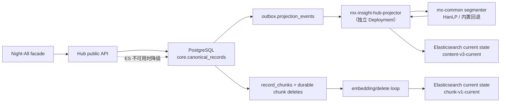

# 共享数据面、搜索投影与后续演进

状态：已实现 —— 共享数据面归并（§4）、content/chunk current-state ES
投影（§1）、P3 durable landing、P4 文件/PostgreSQL 接入、P5 Agent/embedding
与联邦身份 P6。未知结构自动分类、云/对象存储 adapter 等剩余边界会明确标为未来。

本文承接 [ADR-0005](../adr/0005-authoritative-data-and-search-projections.md)（PostgreSQL 权威 + 可重建投影）与 [ADR-0006](../adr/0006-idempotent-ingestion-and-checkpoints.md)（幂等接入与独立 checkpoint），记录把 Elasticsearch 真正接进来时做的决定，以及尚未落地的部分。

## 1. 已实现（P2）



| 组件 | 位置 |
| --- | --- |
| 共享数据面（PG/ES/Redis、可选 HanLP） | `../../mx-common/deploy/k8s` |
| 索引定义（含 author 字段、HanLP 字段、向量字段） | `server/search/index-definitions.mjs` |
| 文档投影与脱敏 | `server/search/document.mjs` |
| outbox 消费者 | `server/search/projector.mjs` |
| 读路径与 PG 降级 | `server/search/queries.mjs` |
| 表结构 | `migrations/006_search_projection.sql`、`013_chunk_projection_deletions.sql` |

### 1.1 一次 deploy 起全部

`bash scripts/manage.sh ops internal-production deploy` 在拿到部署锁之后、构建镜像之前先调用 `mx-common ensure`：

- 已经健康 → `kubectl apply` 对未变更的清单是 no-op，**正在跑的 ES 完全不受影响**；
- 不存在或不健康 → 部署并等待 cluster health 到 yellow/green。

`ensure` 失败**不会中断 Hub 部署**。ES 是可重建投影而非事实源，Night-All 调用、PostgreSQL 入库和计费都不依赖它，因为搜索不健康就让整个 Hub 部署失败，等于把「功能降级」升级成「服务中断」。需要反过来的环境设 `MX_INSIGHT_REQUIRE_SEARCH=1`。

搜索不可用时 projector 会被缩容到 0 而不是留着 crash-loop——它在没有 `MX_COMMON_ELASTICSEARCH_URL` 时会 `exit(2)`。此时 outbox 事件正常堆积，等 projector 起来后一次性排空，这正是 outbox 的用途。

### 1.2 多索引 current-state 命名

```
全文读别名     mx-insight-hub-content
兼容写别名     mx-insight-hub-content-v3
当前全文索引   mx-insight-hub-content-v3-current

语义读别名     mx-insight-hub-chunk
兼容写别名     mx-insight-hub-chunk-v1
当前语义索引   mx-insight-hub-chunk-v1-current
```

这两个投影都表示**当前状态**，不能使用 ILM rollover：同一 `_id` 若残留在多个
backing index，更新/删除写 alias 只能改其中一个，旧内容仍会被 read alias 命中。
启动 reconcile 在 PG advisory lock 下创建/清理唯一 `*-current`，从 PG 当前
canonical/chunk 全量扫一遍，原子切 read/所有兼容 write alias，再扫第二遍关闭
并发写窗口。不兼容 mapping 变更 bump schema version；旧 alias 中可见的副本按
各自 revision 上限清除，不能让多代索引共同承担 current truth。

### 1.3 乱序与重投递

projector 把同一批里同 aggregate 的事件聚合为一次操作，并重新读取 PostgreSQL
当前真相：当前行缺失/有 `deleted_at` 就发 delete，当前行 active 就发 index。
两种操作都采用 ES 外部版本控制，版本号取当前 `projection_revision`（硬删除时
取已认领事件的最高版本）；active index 使用 `external`，可幂等重试的 delete
使用 `external_gte`。ES 拒绝旧版本写入，所以迟到 upsert 不会复活 tombstone，
迟到 delete 也不会覆盖后来恢复的内容。**409 version_conflict 被当作投递成功**
——它意味着索引里已经是同版本或更新状态；同 aggregate 的全部已认领事件
一起标记 delivered。

### 1.4 崩溃与故障语义

| 情况 | 行为 |
| --- | --- |
| projector pod 被 rollout/OOM 杀掉 | 租约过期，下一轮 sweep 把事件退回 `pending`，自动续投 |
| ES 整体不可达 | 整批事件原样退回并回滚 attempts 计数，指数退避重试。长时间宕机不会把健康积压打成死信 |
| 单条文档被 ES 拒绝 | 只有该事件计入失败，超过 5 次进 `dead` 并保留证据 |
| canonical 行已不存在或已 tombstone | 按 PostgreSQL 当前真相发 externally-versioned delete；同 aggregate 已认领事件共同完成 |
| record 缩短、chunker 变化或 canonical tombstone | PG 事务先登记旧 chunk document ID，再删/换 authoritative chunk；embedding loop 先投递 delete，后生成/投递新 chunk |
| embedding provider 不可用 | 新向量暂停；durable chunk delete 仍继续，已删内容不会因模型故障留在语义检索 |
| HanLP 不可达 | 回退分词器接管，入库继续，质量降级 |
| ES 宕机时用户查询 | `queries.mjs` 走 PG trigram 路径；内部/entity 结果可带 `mode: "postgres"`，Night-All-v1 Telegram wrapper 只在 `warnings` 加 `search_projection_degraded`，不添加 `meta.searchMode` |

### 1.5 chunk 删除与可重建性

`core.record_chunks` 是语义切片/向量的 PG 权威集合；ES chunk index 只是第二个
查询投影。内容缩短、chunker version 改变、正文低于阈值或 canonical tombstone
时，同一 PG 事务先把将消失的确定性文档 ID 写入
`core.chunk_projection_deletes`，再删除旧 chunk。delete queue 以
`source_revision` 幂等更新，并在 ES externally-versioned delete 成功/409 后才
标记 `projected_at`。因此 worker 崩溃可续投，模型 provider 故障也不阻塞删除。

启动时 content 从 `core.canonical_records` 重建；chunk 从仍属于当前 revision、
已有 vector 的 `core.record_chunks` 重建。两者都使用两遍 PG current snapshot +
alias 原子切换，而不是依赖 ES 旧索引或快照成为唯一真相。

### 1.6 模糊搜索用户名

content v3 将名称原文与预分词文本分开：`authorName`/`username` 保留原文并提供
`keyword`（精确）、`prefix`（edge_ngram）和 `bigram`（CJK 任意位置子串）；
`authorNameHanlp`/`usernameHanlp` 保存同一分词器生成的空格分隔 tokens，负责相关性
召回。handle/username 的拉丁任意位置子串落在 ES 专用 `wildcard` field；查询不会
对普通 keyword 字段做通配词典扫描，也不用对中文没有意义的 edit-distance fuzzy。
查询用 `bool.should` 并行打分，exact 仍具有最高权重。

PG 侧同时建了 `pg_trgm` GIN 索引，`similarity()` 提供排序而不只是过滤，所以降级路径是一条真实的查询计划，不是占位符。

### 1.7 Telegram 搜索分页

Night-All-v1 Telegram 搜索返回的 `nextCursor` 是最长 8,192 字符的 v2
HMAC 不透明游标，签名绑定规范化后的 query、scope、过滤条件、match mode 与
page size；调用方不能解码、拼装或在翻页时改变这些输入。`pageIndex` 只是根据已见
条数给出的兼容字段，不代表底层用 OFFSET。

ES 首页打开 PIT，每次翻页把 keep-alive 续到 2 分钟，按
`_score DESC, eventTime DESC, id DESC` 用 `search_after` 前进。每页取
`size + 1` 判定 `hasMore`，不依赖 `total`，所以不会在 10,000 命中窗口停住。
PIT 保证这一轮 ES 翻页看到固定快照；最后一页主动关闭，异常遗留由 TTL 回收。

首屏 ES 不可用时才可选择 PG，并返回 `search_projection_degraded`。PG 按
`event_time DESC NULLS LAST, id DESC` 做 NULL-aware keyset，不用 OFFSET。
模式写入游标后保持固定：PG 游标继续走 PG；已有 ES 游标暂时无法服务时返回
`503 search_cursor_unavailable` 并要求原游标重试，绝不静默降级；PIT 已过期或
不存在则返回 `410 search_cursor_expired`，调用方必须从无游标第一页重新开始。

## 2. P3–P5 落地与剩余边界

以下保留最初分期，同时把已经落地和仍属未来的部分分开。

### P3 — 写路径异步化与 Night-All 回填

非 Telegram Night-All 搜索已经用同一 PG 事务完成 request commit 与 ingest job
入队，worker 可恢复地规范化；不再是同步 best-effort。下面的“按差异自动送 Agent
分类”仍是未来分类策略，不应误写成已上线：

1. 上游返回的数据结构与预存契约**一致** → 直接返回，PG 与 ES 全部交给队列；
2. **部分出入** → 入队并标记 `needs_classification`，由 Agent 处理后入库；
3. **全新结构 / raw data** → 入队走 Agent 分类，按既有表结构归位。

接口返回速度只取决于第 1 步，`mxq.jobs` 的事务性入队保证「响应已提交 = 任务已存在」。

Night-All 回填：Night-All 侧的 `source_social_{platform}_contents` 已有 `unique(external_id, content_type)` 和 `last_seen_at`，与 Hub 的 `(dataset_id, platform, object_type, external_id)` 天然一一对应。**去重在结构上已经解决**：回填一条已被实时路径写入的记录，`payload_sha256` 相同 → 不产生新 revision、不产生 outbox 事件。缺的只是一个 `(last_seen_at, id)` 增量游标（用 `mxq.cursors`）和 Night-All 侧的增量导出端点——不要让 Hub 直连 Night-All 的库，那会破坏 ADR-0001 的所有权边界。

优先覆盖 `xiaohongshu` / `douyin` / `twitter` 三个平台，三者的 normalizer hook 已存在于 `server/ingest/normalizers.mjs`。

### P4 — 外部数据接入（已实现基线，范围见 §9）

表结构差异用**两条腿**而不是二选一：

- 原始副本永远进 `ingest.source_objects.raw_payload`（已实现），任何时候可重新解析；
- 规范列由 migration 向前兼容地扩展，**不做宽表预留冗余列**。预留列会退化成一堆语义不明的 `col_1..col_20`，而 `core.canonical_records.extensions`（jsonb）已经承接了未映射字段，需要时再提升为正式列并回填。
- 每次 deploy 自动 migrate 已经是现状（`20-migration-job.yaml`），迁移文件不可变，改动只能新增。

### P5 — 中心 Agent（已实现基线，范围见 §10）

Hub 内 Agent 已支持有序 OpenAI-compatible provider 链，但当前真正接进运行链路的
只有两件事：

1. **文件 mapping 建议**：只有管理员在 preview 显式传 `agent=true` 才调用；只发
   列名、不发样例值，产出仍需版本化并人工批准。
2. **embedding 生成**：填充 `core.record_chunks` 与 ES `chunk` 索引。

`classifyRecord()` 目前只是受约束的库能力，数据库 pull、Telegram 固定 v2 清洗和
Night-All ingest 都没有调用它。P3 的“差异自动分类”仍是未来任务，不能把模型已
配置等同于智能清洗已上线。

`MX_INSIGHT_EMBEDDING_DIMENSIONS`、embedding provider 链、PG chunk/vector 与
独立 ES chunk current-state 索引已经落地。无模型时 mapping 有确定性 fallback，
embedding 暂停，但 chunk tombstone/delete 仍运行。

一个必须先确认的现实问题：本次样本里 XHS 的 `text` 是截断摘要（`"希望可以帮到你～ #大模型 #agent…"`），正文主要在图片中。只对 title+text 做 embedding，RAG 召回质量不会好。要么先补 OCR/详情抓取，要么把 RAG 范围限定为「结构化召回 + LLM 归纳」。

## 3. 联邦身份（P6，已实现）

`migrations/007_launcher_identity.sql`、`server/identity/`、`server/app.mjs` 路由层。

### 3.1 为什么用 introspection 而不是 JWKS

Launcher 签发的是**不透明 token**（`mx-v1-*`），有效性存在它自己的库里。JWT + JWKS 能让 Hub 离线校验，但也意味着**被吊销的 token 在过期前依然可用**；introspection 每次问权威，吊销立即生效。代价是每请求一次网络调用，用一个短 TTL 缓存（`MX_INSIGHT_LAUNCHER_CACHE_TTL_MS`，默认 30s）兜住——这个 TTL 就是「吊销最多滞后多久」的明确上界。

顺带的好处：**mx-launcher 零改动**，Hub 也不需要引 JWT 库。

### 3.2 admin token 保留不动

`resolvePrincipal` 先用常量时间比较 admin token，**只有不匹配的凭据才会送去 Launcher**。所以 admin token 路径与 Launcher 可用性完全解耦：Launcher 挂了，运维照样能进控制台。这是刻意的——把唯一的管理入口挂在另一个服务上，等于让 Launcher 故障变成 Hub 锁死。

响应码上也区分得很清楚：Launcher 不可达时返回 **503 `launcher_unavailable`，不是 401**。token 可能完全有效，只是问不到；回 401 会把一个合法用户赶去一个正在宕机的服务重新登录。

### 3.3 认证 ≠ 授权

首次登录做 JIT provisioning，但**只创建 member 和身份绑定，不创建租户、不授予任何 membership**。新用户能成功登录，然后看到一个空控制台，直到有权限的人给他授权。唯一例外是 `MX_INSIGHT_LAUNCHER_ADMIN_SCOPES` 允许列表——那是运维配置，不是 token 能自己声明的东西。

平台管理员权限**双向同步**：上游 scope 被撤销，下次登录就掉权限。只增不减的授权是一个棘轮。

### 3.4 每个用户看到的面不一样

principal 解析出 `tenantIds`（`null` = 不受限，`[]` = 无任何访问）和 `capabilities`（由 owner/admin/analyst/viewer 四个角色推导）。路由层用 `scopeTenantFilter` 收窄：

- 请求了看不到的租户 → **403 显式拒绝**
- 什么都没请求 → 收窄到自己的租户

这两者不能混为一谈。把前者悄悄变成后者会返回空列表，调用方就能靠「空 vs 非空」的差异探测出哪些租户 id 存在。

`/internal/v1/admin/session` 返回 `capabilities`，控制台据此渲染，用户看不到自己无权使用的控件。三道授权保持独立：AppCenter 可见性 ≠ Hub tenant role ≠ API consumer grant。

### 3.5 配置

```bash
# URL 由 deploy 自动发现（label app.kubernetes.io/name=mx-launcher-internal），
# 只在自动发现看不到时才需要手填。
MX_INSIGHT_LAUNCHER_AUDIENCE=mx-insight-hub
MX_INSIGHT_LAUNCHER_ADMIN_SCOPES=insight-hub.admin
```

自动发现的理由：service 名、namespace、端口三个值全都已经记录在集群里，任何一个手填错的结果都是「Hub 静默地只接受 admin token」——一个几天后才会以「我密码不对」的形式暴露出来的故障。deploy 顺带检查该 Service 有没有就绪 endpoints，因为地址对了但后端没起来是同样的症状。

不配 `MX_INSIGHT_LAUNCHER_URL` 就只有 admin token 生效——接入是叠加的，不是切换。后续其他产品复用同一套 introspection 契约，而不是共享 Launcher 的用户表；Launcher 的数据不进 mx-common，这条边界不变。

## 4. 数据面归并（已实现）

PostgreSQL / Elasticsearch / Redis 全部落在 `mx-common` namespace，Hub 不再自带 PostgreSQL。

- 隔离按 ADR-0003：**一个实例、每产品一个 database + 一个 role**。`manage.sh provision <productId>` 幂等地建角色、建库、装 `pg_trgm` 和 `vector` 扩展，并把凭据存进 mx-common 自己的 Secret（重复部署复用而不是轮换）。
- 镜像是 `pgvector/pgvector:pg16`，所以 P5 的向量检索可以选择落 PG 而不只是 ES。仍然没有 PostGIS。
- Hub 遗留的本地 PostgreSQL **不会被 deploy 自动删除**，只提示；清理走显式的
  `ops internal-production decommission-local-postgres`，且需要 `MX_INSIGHT_CONFIRM_DESTROY=mx-insight-hub`。

一个必须处理的机制细节：Hub 的 public/admin 平面是 `hostNetwork: true`（为了访问 host-local 的 Night-All），这类 Pod 的报文带的是**节点 IP、不带任何 Pod 身份**，NetworkPolicy 的 `namespaceSelector`/`podSelector` 永远匹配不上。所以 mx-common 在 `ensure` 时会发现节点 InternalIP，生成一条按 /32 精确放行的 `mx-common-hostnetwork-clients` 策略。没有这一条，Hub 的 API 平面连不上共享库。

## 5. P3：异步写路径与 Night-All 回填（已实现）

### 5.1 写路径

`hub-service.mjs` 的 ingest 从内联 best-effort 改为 **在同一个事务里提交请求 + 入队**（`commitRequestAndEnqueueIngest`）。这正是 mx-common 把队列放在 PG 里的原因：先 COMMIT 再入队会留下一个窗口，调用方拿到了已计费的响应而 ingest 任务不存在——一个谁也发现不了的静默数据空洞。现在「请求行是 committed」和「任务在 mxq.jobs 里」是同一个 COMMIT。

原始 payload 随任务走，不事后重取：上游调用已计费，不可重放。

### 5.2 Night-All 增量导出

Night-All 新增 `GET /api/v1/data/export`（`routes/v1/data.js` + `lib/infra/storage/hub-export-repository.js`），迁移 `038_hub_incremental_export.sql` 建 `(last_seen_at, id)` 索引。**start-node.sh 无需改动**——它已经有 `run_step "checking database migrations"`，新迁移会自动应用。

几个决定：

- **游标是 `(last_seen_at, id)`，不是 `last_seen_at`。** 单靠时间戳不是全序：同一时间戳的多行会被跳过或无限重复。`id` 是 bigserial，配上去才让「严格晚于此位置」可表达。
- **导出走接口，不让 Hub 直连 Night-All 的库。** 后者会把 Hub 绑死在一个随 provider 变动的物理 schema 上。
- **复用同一个 normalizer**（`normalizeDataSearchItem`），所以导出行和搜索结果字节级一致，Hub 侧只有一个解析器。
- **独立 token**（`NIGHTALL_EXPORT_TOKEN`）。它是 `/api/v1/data` 下唯一批量返回存量内容的路由，所以有自己的凭据，可以独立轮换或收回。**未配置时路由返回 503 而不是放行**——未设置的密钥绝不能等于「不检查」。
- 导出**不调用 provider、不耗上游配额**，所以它是独立路由而不是 `/search` 的一个模式：两者的成本、限流和授权画像完全不同。

### 5.3 去重

不需要任何 worker 端的记账。`core.canonical_records` 在 `(dataset_id, platform, object_type, external_id)` 上唯一，且 `payload_sha256` 不变就不产生 revision、不产生 outbox 事件。**重跑一次已完成的回填是无副作用的**，只花一次读取。去重活在约束里，不在代码的自觉里。

游标**在页面 ingest 成功之后才保存**，从不提前。崩溃会重放那一页，被唯一约束吸收；反过来先存游标则会永久跳过它——那才是真正丢数据的失败模式。

### 5.4 分块与崩溃恢复

一次 job 最多 `maxPages` 页，然后把续作重新入队。续作的 dedupe key **必须带 chunk 计数器**：入队时当前 job 还是 `running`，而队列的唯一索引覆盖 `('pending','running')`，复用 `backfill:<platform>` 会和正在入队的那个 job 自己撞上，被 `ON CONFLICT DO NOTHING` 吞掉，回填在第一块之后无声停摆。这条有回归测试守着。

## 6. 主 ES 架构评估

结论：**按平面拆，不是二选一。**

| 平面 | 存储 | 理由 |
| --- | --- | --- |
| 控制面：tenant/consumer/API key/配额/幂等/用量账本 | **PostgreSQL，不可动摇** | 需要跨文档事务和唯一约束；数据量只有几千行，根本不是扩展瓶颈；这是钱 |
| 数据面：content/observation/chunk/vector | **可以主 ES** | 量都在这里，ES 的强项也在这里 |

ES 不能承载控制面的具体原因，不是"感觉不合适"：

- **没有跨文档事务。** `Idempotency-Key` → reserve → commit/release 是一个跨行的状态机。ES 只有单文档 CAS（`if_seq_no`/`if_primary_term`），拼不出「预留额度 + 提交请求 + 记账」的原子性。
- **唯一约束只有 `_id` 一个。** 去重键可以编码进 `_id`（我们已经这么用了），但一个实体只能有一个唯一约束。
- **搜索是近实时的。** 按 `_id` GET 是实时的（读 translog），但 `_search` 要等 refresh（默认 1s，高吞吐写入时通常调到 30s）。对 RAG 和检索无所谓；对账本不行。

如果数据面转主 ES，必须先有**可重建的源**：不可变 raw 落对象存储。否则 mapping 一旦要改，reindex 没有源头。现在 raw 在 `ingest.source_objects.raw_payload`，这就是那个源——所以路径是通的，只是还没走。

### 6.1 单节点还是集群

已经改成**集群配置，只是当前 replicas=1**。原来的 `discovery.type: single-node` 是一扇单向门：这样启动的节点跳过 bootstrap 协议，永远无法接纳第二个节点，"扩展"只能是建新集群 + 全量 reindex。现在用 seed-host 发现 + headless Service，1→3 是改副本数加一次滚动重启。

**但要说清楚：3 个 pod 跑在一台机器上不是高可用。** 它能扛 pod 重启，扛不住机器故障。HA 需要的是更多硬件，不是更多副本。单机上唯一真实的可用性保障是 ES 挂了业务还能跑——这一条已经做到了（PG 降级路径 + projector 缩容 + outbox 堆积）。

### 6.2 数据量大之后

- **向量内存是硬约束。** HNSW 图从 page cache 里搜，float32 下 100 万条 × 1024 维 ≈ 4GB，还没算索引开销。已把 `vectorField` 默认改为 `int8_hnsw`（约 1/4 内存，召回略降），超大语料可选 `bbq_hnsw`（约 1/32）。
- **写入吞吐**：批量导入时把 `refresh_interval` 调到 30s，代价是搜索可见性延迟同步变成 30s。这是个旋钮，不是缺陷。
- **备份**：ES snapshot 仓库已配（`path.repo` + 独立 PVC），但**还没有 SLM 自动快照策略**——这是下一步该补的。

### 6.3 Agent 系统够不够用

对 P5 要做的事——智能 mapping、清洗分类、embedding + 检索——ES 的能力是够的：BM25 + kNN 混合检索、RRF 融合、facet、geo 都是它的主场。**不够的是让它当账本。** 所以建议的终局是：控制面 PG，数据面 ES 主 + 对象存储做 raw，PG 只保留 canonical 的最小骨架用于回填和重建。

## 7. Elasticsearch 备份（SLM，已实现）

`mx-common/src/elasticsearch/snapshots.mjs` 定义策略，`manage.sh ensure` 在集群确认可用之后自动 reconcile。

```bash
bash scripts/manage.sh snapshot status   # 是否真的成功过，而不只是"配了"
bash scripts/manage.sh snapshot run      # 立即执行一次
bash scripts/manage.sh snapshot list
```

默认：每天 01:30 全量（段级增量），保留 30 天 / 至少 7 份 / 至多 60 份。

几个刻意的选择：

- **`partial: false`**。分片不可用时快照直接失败，而不是悄悄拿一份不完整的备份——一个报告成功的残缺快照比没有快照更糟，因为恢复时它会被信任。
- **`min_count: 7` 是安全底线**。没有它，一个闲置超过 `expire_after` 的集群会把自己过期到零个恢复点。
- **`include_global_state: false`**。索引模板、ILM、SLM 策略本身都由代码在每次 deploy 时 reconcile，快照再存一份就多了一个更旧的事实源，而且恢复到别的集群时会覆盖它的设置。
- **快照保留 ≠ ILM 删除数据**。ILM 那边没有 delete 阶段；这里过期的是快照文件，不动线上任何索引。

**必须说清的限制**：默认仓库是和索引数据同一个节点上的 PVC。它防的是误删索引、错误 mapping、reindex 失误、段损坏——**不防机器丢失**。配 `MX_COMMON_SNAPSHOT_S3_BUCKET` 才有离节点的持久性，`ensure` 每次都会把这句话打出来。

`snapshotHealth()` 报的是 `lastSuccessAgeHours`，不是「configured: true」——一个存在、有排程、但已经静默失败了几周的策略，只报「已配置」是它能一直不被发现的原因。

## 8. P4：外部数据接入（部分实现）

### 8.1 三层，回答"宽表冗余列还是 migrate"

**两者都不是。**

| 层 | 职责 |
| --- | --- |
| `ingest.source_objects.raw_payload` | 收到什么存什么，永久保留 |
| `core.canonical_records.extensions` (jsonb) | 未映射字段，可查询 |
| 真正的规范列 | 经评审的 migration 显式提升 |

**预留通用列（`col_1..col_20`）被明确拒绝**：它们以"灵活性"开始，以一张没有解码表就读不懂的表结束——`col_7` 的含义取决于是哪个源写的那一行。`extensions` 给同样的灵活性，但字段的真名始终和它的值绑在一起；要提升成正式列时，第一层保证了原始副本一定在，可以回填。

### 8.2 映射是数据，且版本化

`catalog.source_mappings` 存 `{ "<canonical字段>": { "from": "<列名>"|[...], "type": ... } }`，带 `version`、`origin`(manual/agent/inferred)、`approved_at`。

- `from` 可以是数组，**第一个非空的列胜出**——这让一个映射吸收「源在中途改了列名」的历史，而不用拆成两个映射。
- **未 approve 的映射永不用于入库。** 让模型直接改变存储数据的形状，会让数据模型变得不可复现（这条为 P5 的 agent 预留）。
- `externalId` 缺失是**错误不是默认**：没有去重键，每次导入都会重建所有行——静默重复，而不是可见的失败。
- 目标字段拼错（`titel`）直接拒绝，否则它会被接受、什么都不映射，产出一堆没有标题的记录，看起来像源数据问题而不是配置问题。

### 8.3 XLSX 自己解析，不引库

这是安全决定，不是极简主义。这些文件来自外部、不可信。通用电子表格库会解析公式、外部工作簿链接、defined names、DDE、XML 实体——对一个只需要「读缓存单元格值」的任务来说是巨大的攻击面。

本实现只读 `sharedStrings.xml` / `workbook.xml` / 第一个 sheet；**公式完全忽略，只读 Excel 一并存下的缓存 `<v>` 值**（那既是用户看到的，也是唯一不会执行的部分）；不解析任何实体声明（关掉 XXE 和 billion-laughs）；ZIP 走中央目录而非扫本地头（截断/畸形的本地头无法把读取指针带出缓冲区）；解压前先检查声明大小（zip bomb 会自报膨胀量，此时拒绝零成本）。

代价是真实的：没有样式、没有格式化日期、只读第一个 sheet。对一条入库路径，这个取舍在正确的一边。

已处理的实际坑：Excel 序列号日期（46234 → 2026-07-31，含 Lotus 1-2-3 闰年 bug 偏移）、`1,234` / `87%` 这类表格数字格式（直接 `Number()` 会得到 NaN 并静默丢掉指标）、稀疏行补齐、重复/空表头。

### 8.4 历史阶段说明

本节最初记录的 source CRUD、文件上传/import job 和 PostgreSQL 数据库拉取
缺口已经在 §9 及 Telegram monitor 接入中补完。当前数据库连接器仍只支持
PostgreSQL；生产 schema、水位、索引和删除语义必须逐来源验证，不能把
“连接器存在”理解成“任意外部表可直接同步”。Telegram 两个来源的具体门禁
见[运行手册](../operations/telegram-monitor-ingestion.md)。

### 8.5 Source 与清洗任务不是同一个抽象

`catalog.external_sources` 当前刻意保持“一张物理表/一个 checkpoint”的底层输入
语义；它适合复用连接器、mapping、batch evidence 和恢复协议，但不应直接成为
业务控制台的唯一心智模型。Telegram Monitor 现在是其上的薄编排：管理员只配置
一套连接和周期，业务定义固定两个 input，统一启停/同步/进度，子 source 只在
“只读诊断”中出现。通用 source 写接口对这两个固定 key 返回
`pipeline_managed_source`；writer 水位/删除/提交顺序合同必须按当前摘要哈希显式确认，
然后与两个固定 mapping 的批准和 active 状态在一个事务中落审计。手工与周期调度
都把两条队列任务原子提交，不能静默产生单边同步。

本轮没有为了一个业务先引入通用 DAG。若第二个多输入清洗业务出现，再把这层提升为
持久化 `cleaning_tasks / task_inputs / task_runs`：task run 记录输入快照、mapping/
transform/Agent 版本、读入/拒绝/变更/删除、PG commit、outbox/ES 投影进度和耗时；
input run 继续引用现有 source import run。不要把两个独立 import run 事后伪装成
已经存在的父事务，也不要用 UI 聚合值替代 durable lineage。

## 9. P4 补完（已实现）

文件路径端到端可用：

```bash
# 1. 注册源
curl -X POST .../internal/v1/admin/sources -d '{"sourceKey":"weekly-report","displayName":"周报"}'
# 2. 预览：默认仅本地推断；显式 agent=true 才请求 Agent
curl -X POST '.../internal/v1/admin/sources/weekly-report/preview?filename=r.xlsx' --data-binary @r.xlsx
# 可选 Agent 只接收列名，sampleRows 固定为空
curl -X POST '.../internal/v1/admin/sources/weekly-report/preview?filename=r.xlsx&agent=true' --data-binary @r.xlsx
# 3. 提交映射（创建时未批准）
curl -X POST .../internal/v1/admin/sources/weekly-report/mappings -d '{"fieldMap":{...}}'
# 4. 批准
curl -X POST .../internal/v1/admin/sources/weekly-report/mappings/1/approve
# 5. 导入
curl -X POST '.../internal/v1/admin/sources/weekly-report/import?filename=r.xlsx' --data-binary @r.xlsx
```

几个决定：

- **上传用裸 body + `filename` query，不用 multipart**。multipart 需要为攻击者可控输入再写一个解析器（boundary、header 注入、part 数耗尽），而这条路径已经在接收不可信表格了。裸 body 传递同样的信息，且没有解析器。
- **没有批准的映射不能导入**，也不会回退到推断。推断是给人看的起点，不是决定数据怎么存的静默默认值。
- **preview 默认完全本地。** 只有显式 `agent=true` 才调用模型，而且只发送
  `columns`，`sampleRows` 固定为空；文件值/样例行不会离开 Hub。响应以
  `agentDataScope=column_names_only` 记录这一边界。
- **文件级内容哈希去重**：字节相同且已成功导入过 → 直接报 `skipped, duplicateOf`，而不是重跑一遍报告"0 changed"（后者读起来像 bug）。
- **被拒绝的行是证据**，进 `ingest.rejected_rows` 并带原因。这里的文件上传
  importer 在拒绝率 >10% 时打 warning；这不是数据库 pull 的容错阈值。数据库
  pull 只要有一行 rejected 就整批失败、不写 canonical、不推进 cursor，避免永久
  越过坏行。
- **异构库拉取只支持 PostgreSQL**。通用"任意数据库"意味着每个引擎打包一个驱动，并为每种方言的排序和类型转换规则重新实现游标语义。真出现 MySQL 源时，它该有自己的模块和自己的游标测试。新连接由 Admin Token 直接写入 source 的 `connection`：`host/port/database/username/password/sslMode/schema/table/cursorColumn/idColumn` 按白名单保存，不再存在独立 Provider 资源或额外 master key。password 为便于后台查看和修改而明文保存在 Hub catalog；数据库、逻辑备份、PITR 和 Admin 响应都必须按敏感凭据控制。旧 `dsnEnv` 仅兼容历史源。所有连接以 `default_transaction_read_only=on` 打开，表名/列名走严格标识符白名单——标识符不能参数化，只能校验。
- 数据库源已提供 `GET .../schema`、Admin-only `GET .../preview` 和
  `GET|POST .../sync`。`preview` 上限 3 行，只返回 type/null/JSON serialized
  length 的 value-free shape，不要求先批准 mapping；同步采用持久
  `(timestamp, physical id)` 游标和分块续作。`batchSize` 是每批上限，不是
  总量 canary，不能用小值假装只同步几行。ingest worker 周期调度 active 且
  cursor 缺失/idle 的数据库源；running/failed 不自动重复，failed 修复后由运维
  显式 `POST .../sync` 恢复。每次 import run 记录 row/ingested/rejected/
  changed/deleted、cursor start/end 和安全错误码；映射出的 tombstone 会写
  `deleted_at`，projector 按 PG 当前状态投递 externally-versioned delete，公开
  读取统一排除。pull/reset 由按 source 的 PG session advisory try-lock 串行；
  冲突立即返回 `409 source_busy`。active run ID 在入库前进入 checkpoint，稳定
  `run_key` + batch key 使 COMMIT 后、cursor ack 前崩溃可续跑同一 run 且不重复计数。
  canonical batch 事务先查 batch evidence 再写；run 终态和 cursor 原子提交。
  COMMIT 结果未知时只能重试同一 run/batch/操作，不能先 reset。暂停在当前批次
  checkpoint 边界 drain；连接/映射/再激活在 cursor running 时返回
  `source_draining`。

## 10. P5：中心 Agent（已实现）

### 10.1 可配置与切换模型

所有 provider 都说 OpenAI 兼容的 REST（`/chat/completions`、`/embeddings`）——DeepSeek、Qwen、Moonshot、vLLM、Ollama、OpenAI 全都暴露这套。只支持一种线格式而不是每家一个 adapter，是"加一个 provider 是一行配置而不是一次改代码"的原因。

```bash
MX_INSIGHT_AGENT_PROVIDERS='[
  {"id":"deepseek","baseUrl":"https://api.deepseek.com/v1","model":"deepseek-chat","apiKeyEnv":"DEEPSEEK_API_KEY"},
  {"id":"openai","baseUrl":"https://api.openai.com/v1","model":"gpt-4o-mini","apiKeyEnv":"OPENAI_API_KEY"}
]'
```

**数组顺序就是降级顺序。** 环境变量仍是 bootstrap/回滚来源：API key 用环境
变量名引用，provider 列表在 ConfigMap 中，key 在 Secret 中。首次部署 migration
后，Hub admin token 还可以在「中心 Agent」把每条链切为 `database` 来源；地址、
Key、超时、启停和顺序按 revision 热更新，API 进程立即加载，projector 在轮询周期
内收敛，无需修改 env 或 rollout。

数据库模式把 Provider 元数据和明文 Key 分到两张表。普通设置查询永远不选择 Key，
GET/PUT 和 UI 只返回 `keyConfigured`；密钥输入留空表示保留，清除必须显式请求。
写接口仅接受 Hub admin token，Launcher platform-admin 只有脱敏只读权限。动态设置
不接受 `apiKeyEnv` 或任意环境变量名，地址只接受经过校验的 HTTPS API 根路径；
地址变化必须重新输入 Key 或明确清除，避免把旧凭据发往新主机。数据库备份、WAL
和恢复介质因此必须作为 credential-bearing 资产管理。完整操作边界见
[Agent provider settings](../operations/agent-provider-settings.md)。

### 10.2 降级语义

区分「换个人问可能有用」和「换个人问会一样失败」：

| 状态 | 行为 |
| --- | --- |
| 超时 / 连接失败 / 429 / 5xx | 降级到下一个 |
| 401 / 403 | 降级——这是该 provider 的凭据错了，不是请求的错 |
| 404 | 降级——这个 provider 没有这个模型 |
| **400 / 422** | **不降级，立即失败** |

400 是我们的请求有问题（body 畸形、上下文超长），挨个 provider 重试只会同样失败，多花一轮延迟和一次账单。

**熔断是必需的，不是优化。** 连续失败 3 次后该 provider 被跳过 60 秒（半开时放一个探针）。没有它，一个挂掉的首选会让**每一个**请求都先付满它的超时——降级功能正常，系统依然不可用。

`GET /internal/v1/admin/agent` 报每个 provider 的熔断状态，因为「悄悄用第三选择的模型跑了一个月」否则完全不可见。

### 10.3 Embedding 的额外约束

**embedding provider 链里所有模型必须维度相同**，构造时就检查，且必须与索引的 `dims` 一致。

这是会静默损坏向量索引的那种降级：ES `dense_vector` 的 `dims` 是固定的，降级到不同维度的模型要么每次写入都报错（最好的情况），要么在维度碰巧相同但向量空间不同时**写进去互不可比的向量——索引照常工作，安静地返回错误的近邻**。启动时拒绝这个配置是唯一能廉价捕获它的地方。

返回时还会再校验一次维度：配置可以是对的，而 provider 悄悄换了模型版本。

### 10.4 已接线能力与保留能力

| 能力 | 无模型/全部不可用时 |
| --- | --- |
| 映射建议 | 退回确定性别名匹配器，并报 `degradedReason` |
| 记录分类（当前未接入 ingest） | 库方法返回 null；未来调用方必须保留 raw 并转 quarantine，不能悄悄发布 |
| Embedding | **直接失败**——向量没有兜底可言 |

模型输出一律不被信任：**幻觉出来的列名会被丢弃**（它产生的映射读起来合理却什么都不映射，正是能通过评审的那种失败），越界的分类值归为 `unknown`，返回的映射在离开 agent 之前就跑 `validateFieldMap`——丢了 `externalId` 的映射绝不能带着合法外表走到批准界面。带 ``` 围栏和前言的响应会被取最外层花括号跨度解析。

agent 产出的映射写库时 `origin: 'agent'` 且 **`approved_at` 为空**——它仍然要人批准才能生效。

固定 Telegram v2 不应逐行调用 LLM：external identity、游标、删除和字段映射必须
保持确定性、可重放。未来 Agent 只适合处理 schema drift 后的隔离样本或可丢弃的
enrichment，并记录模型、prompt/version、输入范围、成本与人工决定；Agent 失败
不能阻塞 raw/canonical 基线同步，也不能自行改变 identity/watermark/tombstone。
