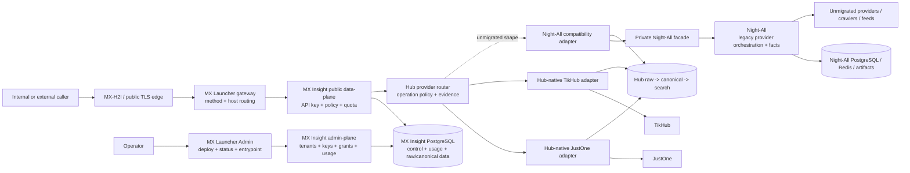

# System context

## Outcome

MX Insight Hub is an independent control plane and data center, not a
reverse-proxy alias for Night-All. A client key identifies one consumer and an
immutable entitlement snapshot; newly issued snapshot keys default to zero
permissions. Hub intersects that snapshot with current consumer grants,
validates and reserves the request, routes it to a direct provider connector or
stored data, records provider/customer evidence and returns a stable response.
Acquisition results enter Hub's raw/canonical data path. Night-All is selected
only for explicitly unmigrated compatibility operations.

## Ownership

| Concern | Owner | Reason |
| --- | --- | --- |
| Upstream provider credentials, endpoint selection, fallback, collection and call evidence | Owning Hub connector; Night-All only for an unmigrated compatibility operation | Hub owns migrated TikHub/JustOne connectors and their isolated Admin-managed credentials. Legacy ownership exits per operation. |
| Raw observations, canonical records, revisions, ETL/ELT and search projections | MX Insight Hub | This is the source-independent data center; connector changes do not change stored-data identity or public product semantics. |
| Customer tenant, consumer, API key, grants, plan, credit, idempotency and usage | MX Insight Hub | These are stable data-product and commercial semantics. |
| Human operator IAM, K8s deployment, service routing, WireGuard/MX-H2I, public TLS | MX Launcher | These are platform control-plane concerns. |
| Logs, metrics, traces and alert transport | Shared observability platform | Cross-service operation, but not a replacement for either business database. |

## Primary workflow

1. Operator creates a consumer under a tenant and grants the required data
   domain/platform, business operations and, only for provider-shaped surfaces,
   compatible interface contracts.
2. Operator issues a deliberately scoped API key; the default snapshot is empty,
   the plaintext is shown once, and only an HMAC digest is stored. `legacy_all`
   is an explicit migration preset rather than the default.
3. Caller sends a documented request plus `Idempotency-Key`.
4. Hub authenticates, authorizes, applies limits and atomically reserves one unit.
5. Hub builds a server-controlled provider request and dispatches through the
   selected Hub-native connector; only an unmigrated operation uses Night-All.
6. A successful logical delivery commits one downstream usage/charge regardless
   of internal provider-call count; a pre-dispatch rejection releases it; an
   ambiguous timeout remains `unknown` for reconciliation. Funded/billed requests
   are not rejected by provider monthly financial thresholds, while technical
   provider and request protections remain enforced.
7. Operator and caller can inspect request/usage evidence without seeing provider credentials or internal endpoint IDs.
