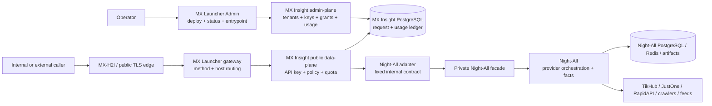

# System context

## Outcome

MX Insight Hub is a governed product boundary, not a reverse-proxy alias for Night-All. A client key identifies one consumer; the current MVP resolves that consumer's explicit mutable platform grants on every request. The production target records a versioned grant-set snapshot per key/subscription. The Hub validates, reserves usage, calls a fixed Night-All adapter, records the outcome, and returns a stable response.

## Ownership

| Concern | Owner | Reason |
| --- | --- | --- |
| Provider credentials, endpoint selection, fallback, collection, normalization, evidence | Night-All | These change with source behavior and belong next to source integrations. |
| Customer tenant, consumer, API key, platform grant, plan, credit, idempotency and usage | MX Insight Hub | These are stable data-product and commercial semantics. |
| Human operator IAM, K8s deployment, service routing, WireGuard/MX-H2I, public TLS | MX Launcher | These are platform control-plane concerns. |
| Logs, metrics, traces and alert transport | Shared observability platform | Cross-service operation, but not a replacement for either business database. |

## Primary workflow

1. Operator creates a consumer under a tenant.
2. Operator issues an API key; the plaintext is shown once, while only an HMAC digest is stored.
3. Operator grants concrete platforms and limits to the consumer. `all` and `*` are rejected. A later grant-set version will snapshot these grants per key/subscription.
4. Caller sends a documented request plus `Idempotency-Key`.
5. Hub authenticates, authorizes, applies limits and atomically reserves one unit.
6. Hub builds a server-controlled Night-All request and dispatches it once.
7. A successful response commits actual usage; a pre-dispatch rejection releases it; an ambiguous timeout remains `unknown` for reconciliation.
8. Operator and caller can inspect request/usage evidence without seeing provider credentials or internal endpoint IDs.
