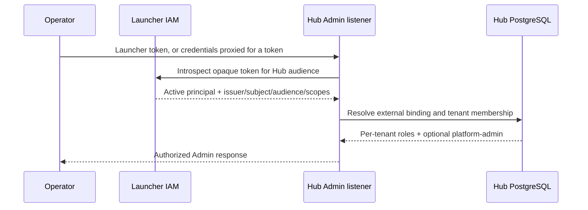
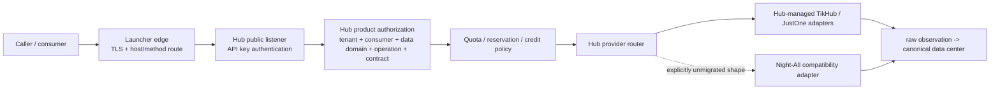

# Unified identity and platform module integration

## Status and scope

This document defines the boundary between MX Launcher and MX Insight Hub for
human identity, organization login, product authorization, edge routing, and
new data-platform modules.

The current implementation has two independent Launcher integrations:

- Launcher can delegate the Hub lifecycle and display an offline-safe
  operational summary. Launcher Server uses the Hub Admin Token for that
  machine-to-machine call; it is not a user session.
- Hub Admin can accept a Launcher-issued opaque user token, ask Launcher User
  Center to introspect it, and bind the verified principal to a Hub-local member
  and explicit tenant memberships. Hub does not validate JWT/JWKS because the
  current `mx-v1-...` token is opaque and revocation lives in Launcher.

Hub owns multiple tenants, consumers, API keys, explicit platform/capability
grants, limits, memberships, per-tenant roles, idempotency, request/usage
evidence, direct provider connectors, and the raw-to-canonical data center.
JIT identity provisioning creates only a member/binding; it never creates a
tenant or membership. A configured Launcher scope allowlist may grant the
separate platform-admin role. The Admin Token remains an unscoped, global
break-glass path. Append-only customer billing/credit ledgers are implemented;
online payment, subscription lifecycle and invoice processing remain roadmap
work.

Multi-tenancy in the current release scopes control-plane ownership,
authorization and accounting. It is not a blanket claim that every canonical
record carries a tenant partition: the fixed Telegram monitor datasets have no
`tenant_id`, so every consumer granted `telegram` sees the same full corpus.
Tenant-specific dataset or row scope is a separate, unimplemented data-model
decision.

Do not describe the operational-summary call as user SSO, the introspection
path as OIDC/JWKS, or either path as shared user management.

## Decision summary

1. **Launcher authenticates people and organizations.** It owns password/enterprise identity login, organization selection, session issuance, and the private/public edge gateway.
2. **Hub authorizes use of the data product.** It owns tenant membership, consumer applications, API keys, data-domain/platform grants, business-operation grants, provider-compatible contract grants, quotas, usage evidence, credit ledgers, and billing semantics. A platform grant does not itself create a tenant-specific row subset.
3. **Identity is federated, not copied.** Hub maps a verified Launcher principal using `iss + sub + aud`; Launcher organization is observed metadata, not part of the implemented binding key or an automatic Hub tenant grant.
4. **Gateway admission is not product authorization.** Every public or internal data-plane request is authorized again by Hub against the target consumer, platform, capability, quota, and balance.
5. **Providers implement one Hub connector contract.** A new provider adds a versioned Hub-managed adapter and operation policy. It does not create a separate customer auth or billing path, and it is not itself a data product. Night-All is used only by explicitly unmigrated compatibility operations.
6. **Hub is an optional, isolated module.** Hub failure, upgrade, or removal must not enter the MX-H2I connection path or block Launcher’s existing network services.

## Ownership boundary

| Concern | MX Launcher | MX Insight Hub | Night-All |
| --- | --- | --- | --- |
| Human login, MFA and enterprise identity | Authoritative | Consumes a Launcher-introspected principal; stores no password/MFA truth | None |
| Organization login and active organization selection | Authoritative | Stores observed organization metadata; Hub tenant access still comes from explicit membership | None |
| Hub tenant membership and product role | Does not own | Authoritative | None |
| Consumer/service application | Does not own | Authoritative | None |
| Public API key | Does not issue or validate | Issues, hashes, rotates and validates | Never receives it |
| Platform/dataset/operation authorization | Coarse route admission only | Authoritative grant decision | Executes only a bounded legacy request when selected |
| Quota, reservation, usage, credit and billing | Does not own | Authoritative customer and provider evidence | Reports outcome evidence only for legacy calls |
| Provider credentials, collection and fallback | None | Authoritative for migrated TikHub/JustOne operations; credentials isolated in the provider control plane | Transitional authority only for explicitly unmigrated operations |
| Raw observations, canonical records and search projections | Does not own | Authoritative Hub data center | May remain a legacy evidence source during migration |
| Edge DNS/TLS, host and method routing | Authoritative | Declares required routes | Private origin only |

Launcher may retain organization display metadata needed for login and navigation. Hub may retain a denormalized organization label for operator usability. Neither copy is a substitute for the explicit identity binding and Hub-local tenant membership.

## Federated human identity

### Principal key and introspection

Launcher validates its opaque token and returns an introspection result. Hub
requires an active user principal with an issuer and stable opaque subject, and
re-checks that the returned audience matches its configured Hub audience. Only
positive introspections are cached, for a bounded TTL that defines the maximum
revocation staleness.

The implemented Hub binding key is:

```text
(issuer, subject, hub_admin_audience)
```

Launcher organization/tenant IDs are retained as observed metadata; they do
not automatically select, create or grant a Hub tenant. Email, display name,
organization name and domain are mutable attributes and are never identity
keys. If Launcher later moves to signed JWTs, direct signature/algorithm/`kid`/
expiry/not-before/JWKS validation requires its own contract and must not be
claimed by the current introspection implementation.

### Hub-local binding and membership

The implemented model has two separate records:

1. `external_identity_binding`: trusted issuer/subject/audience to a Hub-local
   member, with Launcher organization retained only as observed metadata.
2. `tenant_membership`: that member’s role and status inside a Hub tenant.

This separation permits one Launcher person to belong to multiple Hub tenants and lets a Hub tenant suspend product access without disabling the person’s Launcher account. Conversely, a disabled or revoked Launcher identity cannot create a valid new Hub session even if an old Hub membership row still exists.

Provisioning is explicit through the membership Admin API. Hub does not
auto-create an administrator from an email domain or accept a Launcher
organization claim as a Hub tenant ID. One person may hold different roles in
multiple Hub tenants; authorization is evaluated from the membership in the
target tenant, never from a global union of roles across tenants.

### Current Admin sign-in flow



Launcher remains the authentication authority. Hub remains the product-
authorization authority. Hub trusts the explicit User Center introspection
contract, not an unsigned gateway header. When Launcher is unreachable, normal
user introspection fails closed with a service error; the separate Admin Token
continues to provide the operational break-glass path.

### Current service-to-service flow

Today, Launcher’s `/internal/v1/insight-hub/overview` endpoint is protected by the Launcher ops token. Launcher Server then calls Hub readiness and dashboard endpoints with a separate Hub admin token and a short timeout. It returns a normalized online/offline summary and never returns the Hub admin token or raw Hub payload to the desktop.

This overview call proves operational isolation only. Interactive Launcher
sign-in uses the separate introspection flow above; the overview call does not
create a Hub member or confer a tenant role.

## Public and internal data-plane authorization

The data-plane remains Hub-owned even after unified human login exists:



Rules:

- A gateway route proves only that the request reached the correct service.
- A Launcher human session does not imply a Hub consumer grant.
- An API key resolves to one Hub tenant and consumer, then Hub evaluates the
  intersection of its immutable snapshot and the consumer's current grants and
  limits. A newly issued snapshot key defaults to zero permissions; access is
  explicitly selected across data domain/platform, business operation and, for
  provider-shaped routes, compatible interface contract. `legacy_all` is an
  explicit migration preset, not the default.
- For the current fixed Telegram datasets, that authorization is grant-level:
  all consumers granted `telegram` query the same canonical rows because those
  records have no tenant key. Add a dataset/row-scope model before promising
  tenant-specific Telegram subsets.
- A future interactive “run query” action must bind the human membership to a Hub consumer or job identity and pass the same product policy and accounting path.
- Internal callers do not bypass quota or platform authorization merely because they are on MX-H2I.
- `all` or `*` is never a persistent platform grant. “All platforms” snapshots the currently approved module versions and grants.

This second authorization prevents a gateway, organization login, or broad internal role from becoming an accidental universal data entitlement.

## Platform module contract

### Purpose

Hub exposes stable data-product semantics while Hub-managed provider adapters own
changing upstream mechanics. TikHub and JustOne are direct connectors for the
operations already migrated; Night-All is a transitional compatibility connector
for the shapes not yet migrated. Every provider adapter plugs into the common
authentication, authorization, quota, idempotency, billing and evidence pipeline.
A data product composes one or more authorized operations over live connectors
and/or stored Hub data; it neither owns provider credentials nor creates an
independent authorization namespace.

The target module descriptor contains at least:

| Field | Meaning |
| --- | --- |
| `platformId` and `moduleVersion` | Stable lower-case identity and versioned behavior. |
| `capabilities` | Named operations such as search, item lookup, profile lookup or comments. |
| `requestSchema` | Caller-visible bounded input; no provider endpoint or arbitrary raw params. |
| `responseContractVersion` | Stable normalized response version returned by Hub. |
| `cursorContract` | Opaque cursor rules, maximum page size and cursor expiry behavior. |
| `meteringDimensions` | Requests, records, bytes, jobs, agent tokens or other billable evidence. |
| `policyDefaults` | Maximum page size, concurrency, timeout class and allowed tenant overrides. |
| `dispatchSemantics` | Whether dispatch is read-only, paid, idempotent, retry-safe or ambiguous on timeout. |
| `readinessContract` | Credential/capability evidence required before the module can be granted. |
| `dataClassification` | Sensitivity, retention, export and field-policy metadata. |
| `providerBinding` | Admin-managed provider/endpoint family and contract revision; never caller-selected. |
| `compatibilityFallback` | Optional bounded Night-All operation for an explicitly unmigrated request shape, with an exit/rollback policy. |

The module descriptor is policy/configuration. Provider tokens, cookies, proxy
credentials and paid endpoint IDs stay in Hub's isolated Admin-only provider
control plane for direct connectors. Night-All retains only the credentials for
the legacy operations it still executes. Neither set is returned to public
callers, ordinary tenant UI, logs or search projections.

### Onboarding a platform

1. Hub Admin registers and verifies the real provider credential, endpoint contract, pagination and cost evidence for the required operation.
2. Hub adds a versioned provider adapter/module descriptor and bounded fixtures. A legacy Night-All mapping is optional and temporary, not the default implementation.
3. Contract tests cover request validation, response compatibility, normalized output, cursor behavior, dispatch classification and secret isolation. Compatibility responses preserve business fields without desensitization, filtering or truncation.
4. Operations verify a bounded live smoke without fan-out across paid platforms.
5. The module is enabled behind a platform-specific feature policy.
6. Tenants/consumers receive explicit data-domain, operation and compatibility-contract grants and limits; new API keys start empty and existing consumers are not auto-enrolled.
7. Usage and cost reconciliation are observed before broader rollout.

Disabling one module must not disable authentication, other platforms, Hub Admin, or Launcher networking. A module readiness failure produces a platform-scoped unavailable decision and evidence.

## Deployment and failure isolation

### Required topology

- Hub remains a sibling project and an independent Kubernetes namespace/release.
- Public and Admin listeners remain separate Services and routes.
- Launcher’s Hub health proxy has a bounded timeout and converts dependency errors to an offline summary.
- Launcher startup, dashboard readiness, MX-H2I/WireGuard, DNS, PAC and existing gateway routes must not depend on Hub readiness.
- Hub route changes are additive and host-specific. There is no wildcard fallback from existing Launcher traffic into Hub.
- A Hub route returns a service-specific unavailable response when Hub is down; it does not redirect to Night-All or intercept another product.
- Hub `down` scales only Hub workloads and preserves data. It never stops Launcher or host Night-All.

### Feature and lifecycle gates

- Launcher’s existing production deploy remains unchanged unless `MX_INSIGHT_HUB_DEPLOY=1` is explicitly set.
- Launcher delegation injects `MX_INSIGHT_SYNC_LAUNCHER=1`; only that managed path may synchronize the Hub Admin token/entrypoint and perform a controlled Launcher rollout. An independent Hub deploy does not touch Launcher.
- The private Admin entrypoint is configured separately and must never point to the public data gate.
- Enabling a future public route requires a separate reviewed, default-off gateway feature policy plus DNS/TLS approval.

### Offline-safe acceptance criteria

| Scenario | Required result |
| --- | --- |
| Hub namespace absent | Launcher deploy and MX-H2I connectivity succeed; Hub card says offline. |
| Hub Admin unavailable | Launcher overview returns quickly with offline status; other Admin panels work. |
| Hub public listener unavailable | Only the Hub data route fails; existing gateway routes continue. |
| Night-All unavailable | Only explicitly Night-All-backed compatibility operations are unavailable; Hub-direct providers, stored data, Admin and Launcher networking remain independent. |
| One platform unavailable | That module is unavailable; other granted platforms remain callable. |
| Hub upgrade/rollback | No Launcher database migration and no restart unless managed sync was explicitly requested. |

## Delivery sequence

Implemented foundations are the offline-safe ops summary, opaque-token
introspection, identity binding, multi-tenant memberships, per-tenant role
checks and the Admin Token break-glass path. The next gates are:

1. Verify the current introspection/session/logout/revocation behavior in
   Internal K8s, including the configured cache TTL and Launcher outage.
2. Add complete member/membership audit views and operator lifecycle runbooks.
3. Formalize the platform module descriptor and migrate current platform
   policies through it.
4. Add public route/TLS only after authorization, rate-limit, audit, backup and
   SLO release gates pass.
5. If Launcher adopts JWTs, define issuer/audience/algorithm/JWKS rotation and
   revocation semantics before adding a direct validator; do not silently mix it
   with opaque-token introspection.
