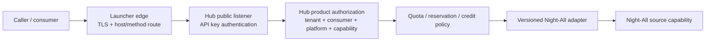

# Unified identity and platform module integration

## Status and scope

This document defines the target boundary between MX Launcher and MX Insight Hub for human identity, organization login, product authorization, edge routing, and new data-platform modules.

The current implementation is intentionally smaller:

- Launcher can delegate the Hub lifecycle and display an offline-safe operational summary.
- Launcher Server calls Hub Admin with a service admin token; that call is not a user session and does not establish single sign-on.
- Hub currently owns tenants, consumers, API keys, explicit platform grants, limits, idempotency, and request/usage evidence.
- Launcher-issued user tokens, Hub JWKS validation, identity bindings, and tenant-member administration are **not implemented yet**.
- Append-only billing/credit ledgers and invoice processing remain roadmap work.

Do not describe the current operational-summary integration as SSO, OIDC, JWKS federation, or shared user management.

## Decision summary

1. **Launcher authenticates people and organizations.** It owns password/enterprise identity login, organization selection, session issuance, and the private/public edge gateway.
2. **Hub authorizes use of the data product.** It owns tenant membership, consumer applications, API keys, platform and dataset grants, quotas, usage evidence, credit ledgers, and billing semantics.
3. **Identity is federated, not copied.** Hub maps a verified Launcher principal using `iss + sub + aud + organization`; it does not share a user table or database with Launcher.
4. **Gateway admission is not product authorization.** Every public or internal data-plane request is authorized again by Hub against the target consumer, platform, capability, quota, and balance.
5. **Platforms implement one module contract.** A new platform adds a versioned capability module and Night-All adapter mapping; it does not create a separate customer auth or billing path.
6. **Hub is an optional, isolated module.** Hub failure, upgrade, or removal must not enter the MX-H2I connection path or block Launcher’s existing network services.

## Ownership boundary

| Concern | MX Launcher | MX Insight Hub | Night-All |
| --- | --- | --- | --- |
| Human login, MFA and enterprise identity | Authoritative | Consumes a future verified principal | None |
| Organization login and active organization selection | Authoritative | Maps the external organization to a Hub tenant | None |
| Hub tenant membership and product role | Does not own | Authoritative | None |
| Consumer/service application | Does not own | Authoritative | None |
| Public API key | Does not issue or validate | Issues, hashes, rotates and validates | Never receives it |
| Platform/dataset authorization | Coarse route admission only | Authoritative grant decision | Executes only the bounded internal request |
| Quota, reservation, usage, credit and billing | Does not own | Authoritative | Reports upstream outcome/evidence |
| Provider credentials, collection and provider fallback | None | Never stores them | Authoritative |
| Edge DNS/TLS, host and method routing | Authoritative | Declares required routes | Private origin only |

Launcher may retain organization display metadata needed for login and navigation. Hub may retain a denormalized organization label for operator usability. Neither copy is a substitute for the explicit identity binding and Hub-local tenant membership.

## Federated human identity

### Principal key

The future Hub Admin bearer-token validator must select a configured issuer and validate:

- `iss`: exact trusted Launcher issuer; no suffix or substring matching;
- `sub`: stable, opaque Launcher subject; never an email address as identity;
- `aud`: contains the configured Hub Admin audience;
- `organization`: explicit active Launcher organization identifier;
- signature, allowed algorithm, `kid`, expiry, not-before and configured clock skew.

The resulting Hub lookup key is the canonical tuple:

```text
(issuer, subject, hub_admin_audience, launcher_organization_id)
```

`aud` can be a JWT string or array on the wire, but Hub stores/compares the configured canonical Hub audience, not the token’s serialized array order. Email, display name, organization name and domain are mutable attributes and must not be identity keys.

### Hub-local binding and membership

The target model has two separate records:

1. `external_identity_binding`: trusted issuer/subject/audience/organization to a Hub-local member.
2. `tenant_membership`: that member’s role and status inside a Hub tenant.

This separation permits one Launcher person to belong to multiple Hub tenants and lets a Hub tenant suspend product access without disabling the person’s Launcher account. Conversely, a disabled or revoked Launcher identity cannot create a valid new Hub session even if an old Hub membership row still exists.

Provisioning must be explicit through invitation, an approved organization-to-tenant rule, or a future provisioning API. Hub must not auto-create an administrator from an email domain or accept an arbitrary organization claim as a tenant ID.

### Target Admin flow

The following is a target flow, not current behavior:

```mermaid
sequenceDiagram
  participant U as Operator
  participant L as Launcher IAM
  participant G as Launcher edge gateway
  participant H as Hub Admin listener
  participant J as Launcher JWKS
  participant D as Hub PostgreSQL

  U->>L: Login and select organization
  L-->>U: Short-lived token (iss, sub, aud, organization)
  U->>G: Request private Hub Admin route
  G->>H: Route request; preserve authenticated bearer token
  H->>J: Resolve/cache trusted signing key
  H->>H: Verify signature and claims
  H->>D: Resolve external binding and tenant membership
  D-->>H: Hub role and product scope
  H-->>U: Authorized Admin response
```

Launcher remains the authentication authority. Hub remains the product-authorization authority. Hub must validate the signed token itself (or through a narrowly specified verification component); trusting an unsigned gateway header is not sufficient.

### Current service-to-service flow

Today, Launcher’s `/internal/v1/insight-hub/overview` endpoint is protected by the Launcher ops token. Launcher Server then calls Hub readiness and dashboard endpoints with a separate Hub admin token and a short timeout. It returns a normalized online/offline summary and never returns the Hub admin token or raw Hub payload to the desktop.

This proves operational isolation only. It does not authenticate the desktop user to Hub, create a Hub member, validate Launcher JWTs, or authorize an interactive Hub Admin session.

## Public and internal data-plane authorization

The data-plane remains Hub-owned even after unified human login exists:



Rules:

- A gateway route proves only that the request reached the correct service.
- A Launcher human session does not imply a Hub consumer grant.
- An API key resolves to one Hub tenant and consumer, then Hub evaluates explicit platform/capability grants and current limits.
- A future interactive “run query” action must bind the human membership to a Hub consumer or job identity and pass the same product policy and accounting path.
- Internal callers do not bypass quota or platform authorization merely because they are on MX-H2I.
- `all` or `*` is never a persistent platform grant. “All platforms” snapshots the currently approved module versions and grants.

This second authorization prevents a gateway, organization login, or broad internal role from becoming an accidental universal data entitlement.

## Platform module contract

### Purpose

Hub exposes stable data-product semantics while Night-All owns changing provider mechanics. Every new platform therefore implements the same Hub module contract and plugs into the common authentication, authorization, quota, idempotency and usage pipeline.

The target module descriptor contains at least:

| Field | Meaning |
| --- | --- |
| `platformId` and `moduleVersion` | Stable lower-case identity and versioned behavior. |
| `capabilities` | Named operations such as search, item lookup, profile lookup or comments. |
| `requestSchema` | Caller-visible bounded input; no provider endpoint or arbitrary raw params. |
| `responseContractVersion` | Stable normalized response version returned by Hub. |
| `cursorContract` | Opaque cursor rules, maximum page size and cursor expiry behavior. |
| `meteringDimensions` | Requests, records, bytes, jobs, agent tokens or other billable evidence. |
| `policyDefaults` | Maximum page size, concurrency, timeout class and allowed tenant overrides. |
| `dispatchSemantics` | Whether dispatch is read-only, paid, idempotent, retry-safe or ambiguous on timeout. |
| `readinessContract` | Credential/capability evidence required before the module can be granted. |
| `dataClassification` | Sensitivity, retention, export and field-policy metadata. |
| `nightAllMapping` | Fixed private Night-All capability/version; never a caller-selected provider URL. |

The module descriptor is policy/configuration. Provider tokens, cookies, proxy credentials and paid endpoint IDs stay in Night-All.

### Onboarding a platform

1. Night-All verifies the real provider credential, endpoint contract, pagination and normalized evidence for the platform.
2. Hub adds a versioned module descriptor and adapter fixture for the approved Night-All capability.
3. Contract tests cover request validation, normalized output, cursor behavior, dispatch classification and redaction.
4. Operations verify a bounded live smoke without fan-out across paid platforms.
5. The module is enabled behind a platform-specific feature policy.
6. Tenants/consumers receive explicit grants and limits; existing consumers are not auto-enrolled.
7. Usage and cost reconciliation are observed before broader rollout.

Disabling one module must not disable authentication, other platforms, Hub Admin, or Launcher networking. A module readiness failure produces a platform-scoped unavailable decision and evidence.

## Deployment and failure isolation

### Required topology

- Hub remains a sibling project and an independent Kubernetes namespace/release.
- Public and Admin listeners remain separate Services and routes.
- Launcher’s Hub health proxy has a bounded timeout and converts dependency errors to an offline summary.
- Launcher startup, dashboard readiness, MX-H2I/WireGuard, DNS, PAC and existing gateway routes must not depend on Hub readiness.
- Hub route changes are additive and host-specific. There is no wildcard fallback from existing Launcher traffic into Hub.
- A Hub route returns a service-specific unavailable response when Hub is down; it does not redirect to Night-All or intercept another product.
- Hub `down` scales only Hub workloads and preserves data. It never stops Launcher or host Night-All.

### Feature and lifecycle gates

- Launcher’s existing production deploy remains unchanged unless `MX_INSIGHT_HUB_DEPLOY=1` is explicitly set.
- Launcher delegation injects `MX_INSIGHT_SYNC_LAUNCHER=1`; only that managed path may synchronize the Hub Admin token/entrypoint and perform a controlled Launcher rollout. An independent Hub deploy does not touch Launcher.
- The private Admin entrypoint is configured separately and must never point to the public data gate.
- Enabling a future public route requires a separate reviewed, default-off gateway feature policy plus DNS/TLS approval.

### Offline-safe acceptance criteria

| Scenario | Required result |
| --- | --- |
| Hub namespace absent | Launcher deploy and MX-H2I connectivity succeed; Hub card says offline. |
| Hub Admin unavailable | Launcher overview returns quickly with offline status; other Admin panels work. |
| Hub public listener unavailable | Only the Hub data route fails; existing gateway routes continue. |
| Night-All unavailable | Hub is not ready for data dispatch; Launcher networking remains ready. |
| One platform unavailable | That module is unavailable; other granted platforms remain callable. |
| Hub upgrade/rollback | No Launcher database migration and no restart unless managed sync was explicitly requested. |

## Delivery sequence

1. Keep the current ops-summary integration offline-safe and verify it in Internal K8s.
2. Define the Launcher issuer, Hub Admin audience, organization claim contract, token TTL and JWKS rotation runbook.
3. Add Hub identity-binding and tenant-membership migrations plus audit events.
4. Implement strict bearer/JWKS verification on the private Admin listener and end-to-end login/logout/revocation tests.
5. Bind Hub Admin roles to tenant-scoped operations; keep service admin tokens for automation only.
6. Formalize the platform module descriptor and migrate current `xhs`/`weibo` policies through it.
7. Add public route/TLS only after authorization, rate-limit, audit, backup and SLO release gates pass.

Until steps 2–4 are complete, operators must treat Hub Admin authentication as service-token based and must not advertise Launcher SSO.
