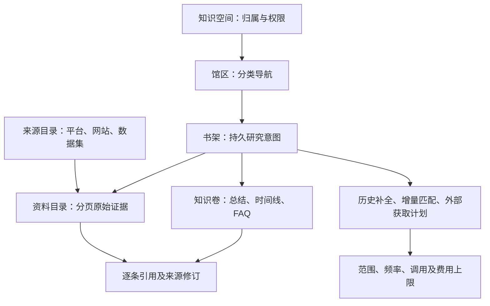
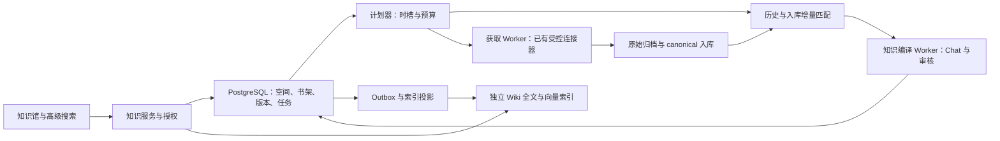

# 知识馆与持续更新书架：LLM Wiki 实现规划

日期：2026-09-30。状态：**需求与实现规划，未实现、未部署、未启用定时任务**。

本文根据用户最新构想，细化并更新 [LLM Wiki 可行性评估](llm-wiki-extension.md)：知识库内的一次明确搜索可以形成长期书架；书架可逐步补全历史、持续匹配新增入库数据，并在授权的计划和预算内定期调用外部来源。用户能逛书架、查看分页资料与 Wiki、看到存储和费用，并暂停、终止、归档或删除。

本文中的对象名、API、默认值及交付波次均是拟议设计。没有修改现有高级搜索、聚合搜索、虚拟超市、生产模型、预算或身份系统。MX-H2I/Launcher 登录、联网、DNS 与路由始终不在变更范围内。

## 1. 产品定位：专题书架是长期研究对象

建议产品名为 **知识馆**，入口继续叫「知识库」，内部对象使用「书架」「资料」「知识卷」。LLM Wiki 是知识卷的整理机制，整个产品还包含专题管理、材料检索、持续获取、费用治理和知识服务。

书架不是一条搜索历史，也不是每个关键词对应一个不断复制原文的文件夹。它保存稳定身份、研究意图、来源范围、匹配规则、更新计划、预算、材料关系及生成的知识版本。类似需求优先复用已有书架和知识，明确需要补充时再执行获准任务。

### 层级与关系

| 用户概念 | 业务对象 | 回答的问题 |
| --- | --- | --- |
| 知识馆/空间 | `space` | 属于谁，谁能看、维护、付费和发布？ |
| 分类/馆区 | `collection` | 从哪个主题入口浏览？例如品牌、产品、运维、行业 |
| 书架 | `shelf` | 持续研究什么？例如“品牌 A 疑似侵权线索” |
| 资料/原书 | `source asset` | 哪一篇原文、帖子、文件或观测支持结论？ |
| 知识卷/Wiki 页 | `page` | 已整理出什么主题、时间线、FAQ、变化或争议？ |
| 章节/结论 | `claim + citation` | 具体结论依据哪条原始资料的哪个版本？ |
| 来源目录 | `source catalog` | 材料来自哪些平台、频道、网站或获准数据集？ |

主浏览路径是「知识馆 → 馆区 → 书架 → 知识卷/资料」。**来源目录是横向维度，不是必经父级**：同一书架可以跨平台，一份原文可以被多个书架引用而只保存一份允许共享的源资产。书架可以有主分类和多个副分类；分类改名/移动不改变书架 ID、费用身份或更新计划。

### 分类、实体、事件如何取舍

分类负责组织；书架类型描述研究对象，不要求所有资料都先归成事件。

| 书架类型 | 适用范围 | 结束与更新方式 |
| --- | --- | --- |
| 专题 | 售后问题、行业动态、服务故障经验 | 长期积累，按配置持续更新 |
| 实体 | 确认的品牌、产品、公司或系统 | 稳定实体 ID＋审核别名；同名不能自动合并 |
| 事件 | 已限定对象、时间、地点/上下文的具体事件 | 新进展追加时间线；人工结束后保留查阅，可重新启用 |
| 调查任务 | 客户提出的待核查线索、专项研究 | 有目标、截止时间和预算；结案不等于删除证据 |

“查找某品牌侵权信息”一般先建调查/实体专题书架，里面可能逐步形成多个事件知识卷。系统可提出拆分/合并建议，但需维护者确认；不能凭相似向量把不同客户、作品或事件合并。合并保留原 ID、出处和历史审计，不复制收费任务；拆分后各子架的预算与计划需明确分配，不能自动翻倍。

## 2. 用户主流程：搜索即可积累，但动作与成本可见

### 2.1 初次知识库搜索

知识库主输入框提供「**搜索并保存书架**」主动作及「仅查询已有知识」次动作。前者符合本次“搜过之后书架就存在”的需求；后者供临时查询或无创建权限的读者使用。高级搜索原有搜索按钮仍只检索，不被改成写操作。

提交研究问题后，服务端先确认当前空间、身份、来源范围与保存权限，再执行以下流程：

1. **定位既有书架**：在当前可见空间按规范化研究意图、目标实体、时间/来源范围及策略版本查重。完全相同意图以幂等键复用同一书架；语义相近只列候选供继续/另建选择，不擅自合并。首次并发提交由数据库唯一约束防止重复建架。
2. **立即持久化**：不存在时创建最小书架与初始意图版本，即使没有命中，也可在馆中列出、改名、删除。没有证据的书架标为「待积累」，不能先生成貌似有依据的知识卷。
3. **返回首批**：复用现有有界原文检索，在已有空间授权及查询额度内返回候选。先保存书架、后推进检索，检索失败不丢掉书架；重试保持原业务身份，不重复创建。
4. **启动获准的后续工作**：若空间已有明确的历史补全/模型预算策略，提交前显示该策略，单次“搜索并保存”即可授权在该范围内运行，不再每页询问。若没有策略，只保存书架与首批候选，显示「历史补全待配置」「知识整理待配置」；不默认为无限任务。
5. **持续展示进度**：首批内容可读，后台工作分批附着；页面显示“正在补全某范围”“已有 N 条新资料”，不让用户等待整个库处理完成。

可见的最低计划摘要应包含：存量范围、初次候选上限、是否继续历史补全、是否调用模型、外部渠道是否启用、单次/每日上限。输入框建议名称不经 Chat 也能由查询文本形成；改名不触发重新搜索。

自动保存是限定于知识库的明确产品动作；它**不授权自动全网采集、无限编译或全库重建**。已保存的策略对后续任务持续有效，只有扩大范围/预算、开启新付费渠道、改变发布权限时才需要有权限的人修改策略。

### 2.2 再次相似搜索

- 优先返回已发布知识卷、已有资料及“覆盖到何时、哪些来源未覆盖”。命中已有书架时可直接进入，也可仅使用其知识回答。
- 支持「继续这个书架」「从当前条件另建书架」「补充最新资料」；新名字不等于新任务身份，避免改名重复获取。
- 补充动作生成增量运行，不重新购买已完成的同一请求页。确实需要重新获取最新响应时创建新的显式获取轮次，显示可能产生的新费用。
- 研究对象或核心排除条件改变时保存新意图版本并预览影响。小改动重新评估成员资格；目标发生根本变化时建议另建，不让历史知识悄悄换题。
- AI 回答可以保存为待审核知识卷；不能因为回答被阅读就把它再次作为事实来源去训练下一篇总结。

### 2.3 目标范围的产品语义

| 用户表达 | 系统应展示和执行的范围 |
| --- | --- |
| 全库 | 当前身份有权访问、已入库、支持这次查询的材料；列出数据集和索引覆盖 |
| 全网 | 已启用且获准使用的联网渠道集合；标注实际执行/未执行来源，不宣称覆盖整个互联网 |
| 历史 | 固定时间范围与历史扫描基线，显示缺失区间；已有存量与上游可追溯历史分开 |
| 最新 | Hub 最新入库进度，或本次外部获取时间；明确发布时间、采集时间和入库时间的区别 |

全部来源在创建策略时保存当前来源清单；以后新增供应商、Key 权限或目录条目不会自动扩大付费范围。已有范围内的新入库记录可持续匹配，新增来源需要策略修订。

## 3. 用户案例：疑似侵权线索书架

示例：“持续查找品牌 A 的某款作品在授权渠道中的疑似侵权线索，并整理历史记录”。书架保存目标品牌/作品标识、审核别名、原始参考材料、时间范围、包含/排除词、来源白名单和维护人。

若只输入“侵权”而未给目标，仍可建立宽泛线索书架，但提示补充作品/品牌以提高区分度。识别阶段区分「候选」「已核查相关」「排除」「存在争议」，不能将文字相似度变成“已确认侵权”标签。

第一轮展示已存原文；后台按范围补历史。日常匹配新入库数据；管理员或有权限租户启用渠道计划后，按天获取新材料。合格新资料进入候选区，知识卷逐步形成「相关线索概览」「时间线」「重复发布与原始出处」「待核查问题」。单条资料保留发布时间、观察时间、原始 URL、采集请求及 canonical 修订。

当前文字 Embedding 可用于文本语义候选，不等于图片、商标、视频或音频相似性检测。参考图片/OCR、视频关键帧/转录等需单独输入合同、模型、存储和价格；原始媒体不自动下载。多媒体能力属于后续波次，在 UI 中如实标为未支持。

## 4. 一个书架的四条独立工作链

| 工作链 | 输入/触发 | 产物 | 主要上限与停止点 |
| --- | --- | --- | --- |
| 历史补全 | 建架获准范围或显式补全 | 历史候选与成员关系 | 扫描记录/分区、模型 tokens、执行时长；保存检查点 |
| 入库增量匹配 | 已开启订阅范围内的新增/修订事件 | 新候选、移除/失效变化 | 候选处理量、队列年龄、租户公平性；不调用上游 |
| 定期外部获取 | 明确启用的计划时槽或手动运行 | 受限响应证据及合格入库资料 | 每源调用/页数、费用、时间与并发；不循环填满结果 |
| Wiki 整理 | 新资料合并达到条件或手动整理 | 候选知识卷、变更摘要、引用 | Chat 输入/输出、Embedding tokens、页数/版本；独立暂停 |

四条链各有开关，另有总暂停。允许只读现有 Wiki、只匹配入库增量、仅补历史，或暂停外部费用而继续内部整理。资料持续沉淀与 Wiki 发布不同：确定性归属可自动收录，模型关联可按空间策略进入候选；首期知识卷人工审核发布。以后如开放自动发布，必须是经过评测的独立策略。

### 4.1 历史不是反复搜索同一个 top-K

现有高级搜索 top-K 适合即时发现，不能承担全库历史扫描。历史补全需要独立可恢复任务：

- 开始时固化授权范围、意图版本与摄取/变更基线；按时间窗、数据集或稳定 ID 分区执行候选筛选与核验，首批优先近期内容，之后向历史推进。
- 词法、已知别名和受限语义召回提供候选。向量 top-K 或任意有限候选窗口都不是穷尽扫描；界面分别展示“范围扫描进度”“候选评估进度”“语义覆盖”，不宣称所有相关材料都已找到。
- 若确需范围内逐条评估，作为单独高成本策略逐条分批处理，先给出工作量和硬上限；不得把普通搜索默默升级为此模式。
- 保存持久检查点/必要的 ID＋revision 清单，不维持跨天数据库事务或依赖长期 ES PIT。短批查询可使用 PIT/search_after，但 PIT 到期后需从任务检查点按固定规则恢复并去重，不能假装原快照仍在。ES 深分页约束见 [官方分页文档](https://www.elastic.co/docs/reference/elasticsearch/rest-apis/paginate-search-results)。
- 失败分区单独记录，不越过后称为完成；已有材料不受失败影响。暂停恢复从检查点继续。历史结束只表示本次计划处理完毕，后续新入库由增量链处理。

### 4.2 新入库数据的扇出与去重

消费 canonical/outbox 变化，先按空间权限、数据集、目标实体/规则等缩小待评估书架集合，再做有界语义判断；不对“每条数据 × 每个书架”调用 LLM。按书架、来源修订和匹配策略幂等入队；一个高频主题不能占满其他租户的队列。

同一 `(shelfId, canonicalId)` 是同一成员，记录入架时与当前核验的来源修订。跨源相同文案先做重复簇/转载关联，不丢弃各自来源和发布时间。被维护者排除的资料有排除记录，后续运行不悄悄重新加入；修订变化是否重新提议由明确策略决定。

### 4.3 外部来源与现有清洗数据库

已有爬取数据库优先通过当前清洗链入 Hub，再由书架匹配增量；书架不各自重复扫描同一个源数据库。需要提高数据新鲜度时显示清洗积压及对应计划，而不是偷偷改全局清洗频率。

联网渠道必须从已登记的业务操作、当前执行身份授权、供应商 readiness 与已审核价格解析。采用 Hub 现有受控连接器；同平台不同供应商选定已审路由，不全部重复购买。当前聚合请求 `stored/refresh` 的合同、游标及收费规则保持不变，书架 Worker 在其下层复用执行服务，并保存自己的计划与运行证据。

现有实时合同不能统一执行任意历史/日期筛选。任务预览应列出各渠道的真实支持范围；不支持严格日期的渠道要么排除，要么明确授权“购买近期结果后本地筛选”，并说明无合格结果也可能收费。未采到正文的结果不能冒充完整证据；详情补充是另一个明确获准、单独计量的操作。

## 5. 计划、频率与停止语义

### 调度配置

界面先提供手动、每 N 小时、每天指定时间、每周；高级用户可选 Cron，显示时区和接下来三次运行时间。默认时区 Asia/Shanghai，但实际调度以持久化 UTC 截止时间协调。锚定间隔与日历 Cron 分开，不把 `*/45` 宣称为恒定每 45 分钟。

每个时槽最多创建一个运行，唯一键为计划 ID＋策略版本＋时槽；多副本用持久化租约和 fencing token。沿用现有 [Cron timer](../../server/monitor-cron-timer.mjs) 与 [balance monitor](../../server/external-platforms/balance-monitor.mjs) 的数据库期限/防重思路，新增知识调度器，不让书架任务进入余额监控队列。

同计划未结束时，下一时槽默认合并/跳过并记录，不无界重叠。停机漏掉的付费时槽不自动补跑；恢复后继续未来时槽，需要补历史则另建有上限的补全任务。运行前以及每次外部派发前重新检查当前权限、策略版本、截止时间、暂停状态与所有限额。

### 控制行为

| 操作 | 含义 | 已有知识/材料 |
| --- | --- | --- |
| 暂停某条链 | 不领取该类新任务，保留检查点 | 保留可读 |
| 暂停整个书架 | 所有新增匹配、获取和编译停止派发 | 保留可读与管理 |
| 停止本次运行 | 取消本轮未派发工作；未来计划按配置继续 | 保留已提交结果 |
| 结束持续更新 | 取消未来计划，保留书架 | 作为静态知识查阅，可重新启用 |
| 归档书架 | 从活跃馆区移出并停止未来工作 | 在获准归档入口读取 |
| 删除书架 | 停止任务、隐藏检索、软删除书架与成员关系 | 不删除共享 canonical、其他书架或费用审计 |
| 永久清除独有产物 | 审核影响后清理无其他引用、无保留要求的独有对象 | 另行执行可审计回收 |

停止在数据库提交控制版本后，禁止新请求派发。已经发出的上游调用可能完成并计费，不能承诺瞬间取消或退款；界面显示「停止中：N 个已发出请求待结算」。已发出请求的响应与账单仍归档，但书架已删除时不得重新附着资料/发布 Wiki。正在执行的 GPU forward 也不能假定可抢占，后续阶段需重新检查停止状态。

删除预览显示受影响知识卷、独有占用、共享引用及保留对象。提供可恢复软删除；恢复书架**不自动恢复付费计划**。删除某知识卷默认留下该卷生成抑制记录，避免后台立刻重新创建；“重新生成此卷”为独立操作。来源被删除/撤权时的失效处理不受书架暂停、费用上限或模型队列阻碍。

## 6. 预算与费用：用户看上限，也看正在发生的消耗

### 每个书架的控制面板

| 维度 | 配置项 | 实际显示 |
| --- | --- | --- |
| 历史范围 | 数据集、时间、最大扫描记录/分区、单轮最长时间 | 已扫描/待处理/失败区间及基线时间 |
| 渠道获取 | 渠道白名单、每源/总调用数、最多页数、单轮 deadline | 已发出、成功、空结果、失败、结果未知；返回数与净新增数分开 |
| 模型 | Chat 输入/输出与 Embedding 的单轮/每日上限，最大改动页数 | 预留、实际、失败尝试、未知用量；模型与估算口径 |
| 费用 | 单轮、每日、每月、项目累计上限，原币分别配置 | 预估区间、预占、已结算、待确认；不以未知显示 0 |
| 存储 | 独有存储上限、引用范围与版本/附件策略 | 实测/估算占用及时间、增速、可回收与需保留部分 |
| 时间与执行 | 频率、时区、结束日、运行次数、并发 | 下一次运行、当前阶段、排队原因与最老任务年龄 |

“搜索上限”不能只有最终返回条数：必须分别控制请求数、分页次数、扫描候选数、模型工作量和时长。查到 0 条也可能有接口费用；重复资料也可能已经购买，净新增数不能代替付费调用数。

各层限额同时满足才准入：书架、空间、执行身份/Key、租户现有额度/钱包、供应商准入与系统资源。并发 Worker 不能分别判断余额后超用；新增书架预算预占与现有客户资金预占关联同一子请求，不建立第二次客户扣费。

新增书架预算明确显示周期和重置时区，建议初始采用 Asia/Shanghai；现有钱包、供应商和原文向量预算仍按各自原合同计算，不为了统一展示而改动。预占绑定派发时的预算周期，跨日结算回到原预占记录；结果未知的占用不因午夜、重启或暂停自动清零。管理员采购预算与客户消费预算按各自原币分别检查，多币种不无汇率依据直接相加。

展示角色分开：租户看到自己的客户价格、钱包与授权上限；平台管理员可另外看到供应商采购原币、模型内部成本与收益。供应商未知价格阻断对应付费操作，已有存量阅读仍可用。自建模型可以没有外部账单，但 token、GPU 时间和容量限制仍可见，不能标成“没有成本”。

### 一轮费用账与幂等

每轮有固定 runId；每个渠道/页/模型阶段有稳定 childId，绑定意图版本、路由版本、执行身份、时槽与完整请求。先校验/预占，派发一次，保存结果，结算或保留未知状态，再推进检查点。浏览器重试、Worker 重启、租约更换不能生成新 childId 重买同一页。

对于外部请求，**幂等是本地去重保证，不是对所有供应商“恰好执行一次”的承诺**。发送后超时或进程崩溃而无法确认结果时，保留 unknown/待核对，不自动换供应商、换键或重新发出。后续对账或用户明确新轮次才允许继续购买。模型调用也要记录 attempt、已完成阶段和供应商可确认结果，不能无限重试。

费用预估来自当前审核价格和合同计费单位：可能按请求、条目或任务计费，不能一律按“页数 × 单价”。若某渠道确实按次计费，三渠道各最多两页的首轮最多六次搜索调用，但详情、评论和补充检索必须另列；仅作为预算算式示例，不填写虚构单价。Chat 按预估输入＋最大输出预留，Embedding 独立计量，实际以可验证用量结算。

这里 `0` 不继承现有向量化设置的“无限”含义：新书架的外部费用/模型预算 0 明确代表禁止该类新增消耗；如将来允许不限额，使用显式单独状态与管理权限。未知上限不能默认无限；初次历史预算与日常预算分开，重启不重置。

## 7. 存储展示：一本“书”不等于一份物理文件

Wiki 正文、关系和任务主要存 PostgreSQL，索引在 ES，允许持久化的附件按内容地址存放。界面可以显示文件/卷的逻辑大小，但不能伪造“每个书架都对应一个独立磁盘文件”。Markdown 导出是版本化产物，按需生成并计入独有字节。

建议每个书架展示四种容量：

1. **书架独有占用**：Wiki 版本、成员关系/索引分摊、独有附件与导出等；关系/索引的估算分摊必须标注口径。
2. **关联资料容量**：该架引用的原始材料逻辑总量，可能与其他架共享，不能与别架相加当作物理磁盘。
3. **预计可回收**：删除该架后没有其他引用、并且保留政策允许释放的对象；删除关系不承诺立即等量释放 PG/ES 文件。
4. **系统实际占用**：管理员看到 PG/ES/对象存储、副本、备份与卷余量，按实际存储位置计量。

源资产去重键及复用必须包含允许共享的权限域；相同字节不能成为跨租户可见性的依据。每个书架仍保留自己的引用、选择理由和原始来源身份。保留版本、任务日志、未使用导出有期限；被报告/审计固定的版本单独列出，不自动清理。

示例：1 万个当前知识页，每版本平均 20 KiB、保留 5 个版本，正文约 0.954 GiB；如果一个书架引用了 10 GiB 共享原文，不表示它复制了 10 GiB。实际存储还包括引用/索引/副本/备份，以及因为 Wiki 证据需要而额外保留的原文修订。沿用 [容量评估](llm-wiki-extension.md#7-磁盘容量能控制但不能只计算正文) 的测量方法，不能用页数直接推算账单。

空间和系统磁盘触及保留余量时暂停新获取/编译/导出；继续允许读取、停止、失效和必要结算。不得为了自动腾空间删除共享原始证据。

## 8. “逛书架”的真实交互

### 导航位置

数据浏览中心保留「高级搜索」，其后新增「知识库」，再接现有「聚合数据搜索」。Admin 在这里治理全部获准空间；后续授权租户通过独立数据产品入口进入自己的同一知识馆组件，**不开放整个 Admin 数据浏览中心**。

知识库内部提供「逛书架 / 馆藏地图 / 目录管理」三种视图，共享同一空间、书架 ID、筛选、分页和当前选择。入口先显示可以操作的书架，而不是必须走完虚拟通道才能搜索。

### 首期交互规格

| 动作/区域 | 预期行为 |
| --- | --- |
| 馆区与通道 | 按分类渐进浏览；固定面包屑、缩略地图与返回位置，支持直接跳到书架 |
| 书架外观 | 每个真实书架是独立可选对象，显示名称、知识卷数、资料数、新增数、更新/暂停状态；不可只把整幅图作为点击区域 |
| 悬停/键盘焦点 | 显示紧凑摘要：覆盖区间、最近成功更新、下一次任务、今日用量/上限、占用；完整信息仍可点击查看 |
| 单击书架 | 进入该书架空间和详情；立即展示已存内容，不采集、不编译 |
| 点击书脊/封面 | 打开具体资料或知识卷，保留 ID、出处与返回位置；封面可用标题设计，不伪造原书封面 |
| 架内页签 | 知识总览 / 知识卷 / 原始资料 / 来源与覆盖 / 更新任务 / 用量与存储 / 设置 |
| 资料列表 | 筛选、排序、分页、候选/收录/排除状态；知识卷与原文数量分开 |
| 新数据到达 | 显示“有 N 条新资料”，用户刷新后更新列表，不在阅读中改变顺序或跳页 |
| 暂停/继续 | 详情中的明确控制，显示受影响链与已派发工作；不把“刷新列表”做成“重新采集” |
| 移动与小屏 | 点击/触控直达；目录提供所有核心能力，键盘、屏幕阅读器和减少动画模式可用 |

第一期采用 **可交互的 2.5D 书架**：基于真实数据生成书架、书脊和深度层次，可切换馆区、靠近/进入、查看详情、返回原视角；无需绑定重型三维引擎。第二期才评估真实 3D 摄像机、漫游、拾取、视锥裁剪与层级细节。键鼠漫游是可选入口，不能成为使用门槛。

现有 [虚拟超市页面](../../src/pages-virtual-supermarket.jsx) 的全景主体是背景图片与少量固定位置入口，可借鉴导航/侧栏/共享视图状态，不能宣称已有完整空间引擎，也不直接复制其平面表现。新知识馆应以每个书架/书脊的命中区域和实际导航行为验收。

空间只加载当前馆区有界数量的书架与必要摘要，不把百万原始记录加载成场景对象。书架计数异步返回并附更新时间；知识卷/原文列表独立分页。暂不可用的统计显示未知，不用当前已加载数冒充总馆藏。WebGL 若后续采用，失败时退回等价目录视图；布局坐标/材质不进入公共数据合同。

## 9. 书架知识的质量与生命周期

原文入架与知识总结有独立版本：`候选资料 → 收录/排除 → 编译草稿 → 审核 → 发布`。每个知识卷保存目标、覆盖范围、更新时间、支持与反对证据、未覆盖问题和生成/审核版本。首期页间互链只用于导航，不递归把旧总结作为新事实。

- 新证据合并后只更新受影响的章节/知识卷；同一目标的高频变化合并为有界任务，设最长等待时间，避免持续延期。
- 来源编辑、删除或撤权先使相关知识不可作为当前有效证据，再安排重算；查询返回、导出与生成回答前后均做权威核验，不只依赖 ES 已经删干净。
- 疑似重复、事件归属和结论支持要分别评估；向量分数不是真实性、侵权概率或证据强度。所有模型材料均为不可信输入，不能触发材料中的命令。
- 人工修订保存为版本和维护意图，自动更新提供差异；恢复旧版本也要通过当前权限/来源有效性检查。
- 没有答案时保留空架或带缺口的知识卷，不用幻觉填满；低相关或低利用率书架提示缩小范围、降频或结束计划，由维护者决定。

## 10. 租户、角色与执行身份

| 能力角色（拟议） | 可以做什么 | 不隐含什么 |
| --- | --- | --- |
| 阅读者 | 查询/浏览当前获准书架与有效知识 | 创建、编译、采集或扩大权限 |
| 维护者 | 创建/编辑书架、筛选资料、提交编译、暂停所属任务 | 提高预算、启用无授权渠道、自动发布 |
| 计划管理员 | 在租户授权上限内设置频率/预算、启停计划 | 修改平台采购价、供应商凭据或其他租户数据 |
| 审核/发布者 | 审核知识、发布到已授权空间 | 自动对外共享原始材料 |
| 平台管理员 | 全局资源、来源准入、空间策略、审计与紧急停机 | 任意改变现有客户账单或 MX-H2I 身份链 |

用户要求的“有权限租户可以停止”落实为独立可授予的任务控制能力；空间维护者能暂停自己的任务，租户管理员能停止本租户任务，平台管理员能全局停止。角色方案需映射现有 Hub 权限体系，不新增第二套登录系统，不自动给旧 Key 授权。

持续任务绑定真实持久执行主体、tenant/consumer/Key 及计划授权版本，不能长期保存短期 demo token 或借 Admin Token 代租户越权获取。每轮及每个子请求重验有效权限、Key 状态、余额和来源范围；撤权或 Key 失效暂停相关任务，不自动换用另一把 Key。平台成员离职后按明确的任务所有权转交流程处理。

私有、租户共享、平台审核发布是不同空间范围。一个综合页的权限不能宽于它所有支持来源允许的范围；不通过隐藏出处来泄漏总结。跨租户相似需求只能复用已明确发布且当前有权访问的内容，不能通过推荐书架、计数或相似度泄漏他人专题存在。

## 11. 服务、数据模型与后台结构

### 模块边界

PG 是业务状态与知识版本权威；ES 只做可重建检索。计划器、获取、匹配、编译是分开的有界执行阶段。先使用现有 Node.js/PG/Croner/Chat/Embedding 服务，不为首期引入图数据库、另一套向量数据库或全新工作流平台。

现有 [向量化 Worker](../../server/retrieval/worker.mjs) 仍服务原始数据；不能给每个书架都重新向量化同一 canonical。知识卷用独立切片/任务及模型空间，分离编译、Embedding 和 ES 投影重试。在线 RAG 优先，原文增量向量化保持现有保障；Wiki 后台用有界并发与公平队列，不调整现有 GPU 绑定/显存上限。

### 逻辑持久化对象

| 对象 | 关键约束 |
| --- | --- |
| 空间/馆区/书架 | 稳定 ID、归属、分类引用、意图修订、总控制版本、生命周期 |
| 书架来源计划 | 已审核逻辑来源、执行身份、支持的请求形状、路由快照、预算/计划修订 |
| 书架成员与排除记录 | shelf＋canonical 唯一；所选来源修订、归属理由、候选/收录/排除、变化序号 |
| 知识页/版本/依赖 | shelf 归属、发布指针、不可变正文与 claims、原文依赖、审核及生成版本 |
| 运行/阶段/检查点 | 触发时槽、输入范围、稳定子请求标识、租约、fence、已完成阶段、错误/未知结果 |
| 预算预占与用量引用 | 原币/计量维度、hold 与既有账本关联；不重复客户收费 |
| 占用快照与保留引用 | 独有/共享逻辑字节、估算口径、测量时点、保留原因与待回收对象 |

依赖反查、空间列表、待领取任务与成员分页均建立实际查询索引；不在首屏为统计扫描全部正文。PG 队列可用 `FOR UPDATE SKIP LOCKED` 领取，并配合租约及旧 Worker 提交检查；它只解决并发领取，不替代外部调用幂等或恢复协议。[PostgreSQL 锁定说明](https://www.postgresql.org/docs/current/sql-select.html#SQL-FOR-UPDATE-SHARE)

### 候选 API（未实现，不是当前调用示例）

| 操作 | 拟议合同 |
| --- | --- |
| 查询已有知识 | `POST /api/v1/data/knowledge/search`，纯检索，不创建/补采 |
| 搜索并保存书架 | `POST /api/v1/data/knowledge/shelves/search-and-save`，明确写入，Idempotency-Key 必须 |
| 列表/详情 | `GET .../shelves`、`GET .../shelves/{id}`，当前权限过滤与分页 |
| 架内资料/知识 | `GET .../shelves/{id}/materials`、`GET .../shelves/{id}/pages` |
| 策略修改 | `PATCH .../shelves/{id}/policy`，期望修订＋范围/费用变化预览 |
| 手动补全/获取/编译 | `POST .../shelves/{id}/runs`，显式任务类型与固定策略修订 |
| 控制与审计 | `POST .../shelves/{id}/control`、`GET .../runs/{runId}`、`GET .../shelves/{id}/usage` |
| 删除 | `DELETE .../shelves/{id}`，软删除与停止；永久清理另有严格影响预览 |

Admin 管理入口使用对应 Internal 路由；租户/Public 需新增明确 grants、合同、计量及默认关闭的 rollout。高级搜索保持原有 `semantic/fulltext/hybrid`，增加受控的知识范围和 `wiki-page` 证据后才联查；现有聚合 API v1 不加入这些新字段。

列表分页绑定身份/权限、完整筛选、排序与书架内容基线，采用游标；新资料进入不插入当前阅读窗口。首次 MVP 不强求精确总页数，可显示“第 N 批/还有更多”；需要可跳页时用有界持久结果清单实现，不能把变化中的排名强行包装为稳定页码。资料删除/撤权在冻结窗口中仍即时排除，页面可变短并说明原因；基线过期显式刷新，不重跑付费任务。

## 12. 容量、公平性与可观测性

最低诊断维度为书架、空间、租户、任务阶段、逻辑来源、执行模型。展示最近成功时间、下一次计划、阶段吞吐、最长排队时间、失败/未知数、输入/输出 tokens、净新增材料、已更新知识页、存储增速与费用。

控制总并发、每租户并发、每书架并发和供应商并发；先选有额度的公平队列，再执行具体任务。供应商限流、在线 RAG P95/错误率、Chat 排队、PG/ES 压力与磁盘余量共同决定是否退让。首次可从 Wiki 编译并发 1 试点，但不能把这个建议自动写成生产设置。

吞吐规划要同时测量：新材料到达率、每条涉及书架数、候选命中率、每份材料触及知识页数和实际模型时长。模型服务 QPS 不等于“每天完成多少书架”。高扇出专题先缩小范围/降频/合并批次，不能靠不断提高 token 额度掩盖积压。

通知只在真实有意义的状态变化出现：首次知识就绪、重要新资料、预算耗尽、连续失败或被暂停；送达渠道复用已有用户授权的通知配置。日常无变化保持安静，通知失败不重跑采集。

## 13. 实现波次与验收

### M0：契约与样本

固化空间/书架/资料/知识卷语义、查询保存动作、权限和费用口径。用一组产品调查与一组运维资料准备评测，记录真实模型、磁盘与已有队列基线。目标是可验证的 100–500 个知识页样本，不直接铺开百万资料编译。

### M1：能保存、能逛、能管理的存量书架

实现 Admin 空间、分类、搜索并保存、同意图幂等复用、原文成员/排除、分页、改名/归档/删除、占用说明、2.5D 可操作书架。首次只读 Hub 存量，付费渠道与周期计划关闭。保留现有高级搜索，搜索失败仍保留可管理的空架。

验收：点击具体书架及资料可直达；键盘/移动目录等价；并发建架不重复；翻页/切视图无上游与 Chat 调用；删除不影响别架、canonical 与 MX-H2I。

### M2：历史积累与 Wiki 闭环

实现独立历史检查点、入库增量订阅、候选归属、知识编译草稿/审核/发布、失效撤下、原文/知识联查、任务控制与 tokens 计量。开启有限空间策略后，搜索保存可自动启动获准的后续工作。

验收：历史任务不是反复 top-K；暂停恢复不漏已确认范围/不重复成员；撤权/删除不泄漏；旧 Worker 不能覆盖新版本；预算耗尽阻断新模型调用；在线搜索质量与延迟可对比。

### M3：授权租户与定期外部获取

实现持久执行身份、租户权限、来源计划/价格预览、Cron/间隔、时槽防重、外部调用与现有钱包/费用链关联、unknown 对账、停止收尾、审计与通知。租户界面复用同一知识馆组件。按已经核验的渠道逐个启用，不能一次宣称所有平台都支持监测。

验收：多副本同槽只生成一个运行；重启/重试不重复购买；无价格/无权限不派发；客户只见自己收费信息；停止后不派发新请求、已发出请求正确结算；更换 Key/扩大来源不隐式继续；日/月总预算无并发超支。

### M4：空间体验深化与知识服务

按实际用户使用评估真实 3D 漫游、多个馆区、实体/事件知识卷、跨架推荐、REST/Agent/MCP 工具及多媒体资料。先有等价目录与稳定合同，再增加渲染效果；图数据库与更复杂 Agent 编排只有在真实查询需要时引入。

### 全程回归及开放门槛

- 范围：同名实体、跨事件、别名、历史/最新、未入库与截断正文、来源更新时间不同、未知覆盖。
- 收益：固定问题集比较原始全文、RAG、Wiki 与联合检索；人工核对相关性、结论支持、冲突和缺证据表现。
- 正确性：查询只读、保存幂等、后台停止竞态、租约丢失、发布前后修订变化、删除/恢复不重启收费、分页新增/撤权。
- 费用：同页换父请求键、进程发送后崩溃、供应商 timeout、部分成功、价格变化、零结果、重复材料与多币种均有测试。
- 容量：一份原文多架引用不重复保存；保留固定版本和回收估算可核对；磁盘水位暂停不阻断失效/结算。
- 交互：书架独立命中、真实下钻、返回位置、分页、未知状态、触屏/键盘/减少动画；不可用效果有等价降级。
- 隔离：旧 RAG/全文/全部、聚合 API、虚拟超市、客户权限/账单与 MX-H2I 登录联网无回归。

先完成 M1–M2，产品就具备“逛书架、搜索积累、历史沉淀、Wiki 可查”的主体；M3 再把它变成在明确预算下持续工作的知识工程。建设规模由有价值的专题与可核验材料驱动，而不是以“书架越多、生成文字越多”作为成功标准。

## 14. 本次变更边界

本次仅交付详细规划与文档导航，并在 AGENTS 中记录用户明确的长期产品方向。没有创建真实书架、执行任务、启用供应商或改变现有费用/配额；未实现新 UI/API。下一次进入实现时，以本文件的 M1 可验收闭环为第一交付，不把规划文档当作后台任务已开启的证明。
