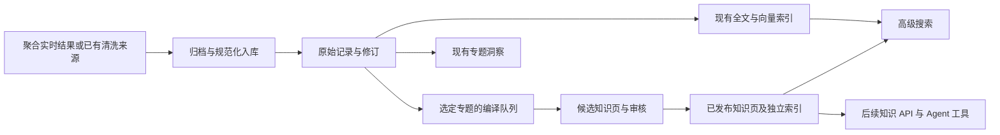

# LLM Wiki：可行性、数据浏览中心规划与容量评估

核对日期：2026-09-30。本文扩展 2026-09-16 预案，依据当前源码、用户提供的 Embedding 压测和原始概念说明。**这是设计评估，不是已交付功能或上线指令**；本次只更新文档，没有新增页面、表、API、任务或生产设置，未连接生产数据库。

后续用户细化为持续积累、可逛的专题书架，最新主流程见 [知识馆与书架实现规划](knowledge-library-implementation-plan.md)。知识库新增明确的“搜索并保存书架”，可按既有授权策略启动有限历史/增量任务；普通高级搜索仍只读。本页的基础可行性、容量估算和证据边界保留，知识库层级、创建流程、计划、费用和停止语义以新规划为准。

## 1. 结论与定位

**技术上可行，建议做成可独立调用的派生知识库，并由高级搜索提供联合检索入口。** 初期限定 Admin、小专题、明确来源和人工发布，验证后再向租户与 Agent 开放。它同时具有两种身份：数据层是持久知识服务，体验层是搜索的扩展。无需另建一套向量数据库，也无需先完成通用 Agent Studio 或引入图数据库。

[Karpathy 的原始 LLM Wiki 方案](https://gist.github.com/karpathy/442a6bf555914893e9891c11519de94f) 描述由模型持续维护、关联和修订的知识页，保留原始资料层。它是组织知识的模式，不是一个装上即用的搜索引擎，也不是公认替代 RAG 的性能标准。以下多租户、数据库、发布和容量设计是针对 Hub 的建议，不能从该个人 Wiki 方案推导出生产可靠性或成本结论。

| 能力 | 主要回答 | Hub 中的位置 |
| --- | --- | --- |
| 当前高级搜索 | 哪些入库原文与这次问题相关？选择证据后如何归纳？ | 原始证据检索及按需引用回答 |
| LLM Wiki | 一个主题已经积累了什么知识？依据、变化、争议和缺口是什么？ | 持续维护的知识页与可检索知识服务 |
| 聚合数据搜索 | 哪些获准来源能找到内容？是否显式向上游获取最新一页？ | 存量查询与跨来源实时获取 |
| 当前专题洞察 | 指定时间窗及有界样本中有哪些维度、时间分布和共现？ | 一次任务的报告，当前为确定性计算，不调用 LLM |

Wiki 能帮助重复研究、跨材料归纳和知识复用。精确 ID 查询、偶发短查询、全库计数和高频变化指标仍交给原始搜索或确定性统计。页面不能依据 top-K 推断总体比例，也不能把同标签、同名账号、转载数量当成已核实实体关系或独立证据。

## 2. 当前技术栈与真实缺口

| 已核对的基础 | 可以复用 | 必须补齐 |
| --- | --- | --- |
| React 19 + Vite + Neon Void；[数据浏览中心](../../src/pages-data-browser.jsx)、[高级搜索](../../src/advanced-search.jsx) | 页签、主题、可检索下拉框、证据详情、显式查询交互 | 知识空间、知识页、版本/引用/冲突查看与审核 |
| Node.js ESM、`pg`、Zod；[AdvancedSearch](../../server/retrieval/search.mjs) | 有界查询、结果快照、RRF、生成前后重新核验来源 | 当前仅返回 `canonical` 证据；Wiki 需要新的证据类型、快照和回答校验 |
| PostgreSQL canonical/revisions、lineage、outbox；[切片向量存储](../../migrations/009_chunk_lineage.sql) | 原始证据版本、PG 保存向量、ES 可重建投影 | 独立 `knowledge` 数据模型，不能给 `core.record_chunks` 塞入伪 canonical ID |
| Elasticsearch 全文与 chunk kNN、HanLP；[Embedding pipeline](../../server/embedding/pipeline.mjs) | 中文全词、向量生成/索引阶段分离、模型空间校验 | 独立 Wiki 投影、知识页切片与当前发布版本门禁 |
| [Agent runtime](../../server/agent/runtime.mjs)、[classifier worker](../../server/workers/classifier.mjs)、[retrieval worker](../../server/retrieval/worker.mjs) | 默认 Chat/Embedding Sequence、供应商治理、租约/心跳等模式 | 独立编译任务、预算、审核发布、依赖失效和增量合并；这些不能因已有 Worker 而视为完成 |
| [聚合查询](../../server/data/aggregate-search.mjs)、[Hub service](../../server/hub-service.mjs) | 已授权来源发现、实时子请求、已提交证据和幂等续页 | 显式选入知识库、可靠 canonical 引用及后续知识联查 |
| [专题洞察](../topic-insight-reports.md) | 有界取证、任务与报告方法说明可借鉴 | 报告是固定任务结果，Wiki 是独立的长期版本对象；不能悄悄升级原报告合同/费用 |

源码中尚未发现 Wiki 表、`wiki-page` 检索处理或知识库 API。当前高级搜索 API 由 Admin Token 门禁保护，不能把它直接代理给租户。现有回答主要核验 JSON 结构、引用 ID 属于本次证据、来源版本与删除状态；**引用存在不等于结论受到原文支持**，Wiki 需要额外质量评测与首期人工审核。

Qwen3-Embedding-0.6B 负责向量，不负责撰写知识页；编译需要独立配置并测量的 Chat Sequence。当前包依赖没有 LangGraph；首期沿用 Node Worker 与明确状态机即可，复杂多轮编排以后再评估，不把框架迁移作为门槛。

## 3. 数据浏览中心的信息架构

建议交付后页签顺序为：

`账号大盘 ｜ 内容大盘 ｜ 热点线索 ｜ 高级搜索 ｜ 知识库 ｜ 聚合数据搜索 ｜ 请求诊断`

现有页签与直达入口保持。新增「知识库」是内容浏览与治理入口，不另建一级导航；其内部用「知识页 / 待审核 / 更新任务 / 空间设置」组织，任务诊断默认折叠。全局基础设施连接仍由现有管理页负责。

### 高级搜索：搜索方式和知识范围分开

保留当前搜索方式及默认值 **RAG → 全文 → 全部**，其中「全部」继续仅指语义与全文融合。新增独立的「检索范围」：**原始内容 / 知识库 / 原始内容＋知识库**。新功能初期默认仍是原始内容，避免上线后同一旧查询突然改变范围；已发布知识页与对应索引就绪后才允许显式选择知识库。

- RAG 在所选范围执行向量召回；全文在所选范围执行词法查询；全部在该范围融合两种方式。知识页未完成向量化时如实显示覆盖状态，不能拿其全文结果冒充 RAG。
- 结果分为「原始证据」「知识页」「关联账号」。知识卡展示页面类型、摘要、证据覆盖时间、最近编译时间、审核/冲突状态和来源数量；点击可查看原始出处与版本差异。
- 选择证据生成回答沿用显式动作。Wiki 命中可以展开底层原文，回答同时标明知识页版本及支持它的原文修订；引用同一条原文的多个 Wiki 页不算多份独立证明。
- 来源、平台和日期筛选必须约束**支持结论的原文**。知识页更新时间不是原文发布时间。首期保守规则：展示整页需其全部支持证据满足权限及筛选；否则提示范围不兼容、引导查原文，不把一篇部分匹配的跨范围总结当成满足条件。后续如返回筛选后的 claims，必须单独标注局部片段，不展示未重算的全页总结。
- 查询、切换范围、翻页和打开知识页不编译、不抓取、不补采。没有知识页时显示空结果和创建入口，不隐式调用 Chat 建库。Wiki 分支失败保留可用原文结果并明确部分失败；仅知识库范围失败则明确报错。

### 知识库：从搜索结果积累知识

首期闭环：**选择原始证据 → 加入专题/创建知识草稿 → 预览来源范围与编译预算 → 生成候选页 → 审核发布 → 高级搜索可检索**。

| 区域 | 内容与动作 |
| --- | --- |
| 知识页列表 | 空间、主题、页面类型、来源范围、更新状态；分页搜索，不在首屏扫描全库 |
| 知识页详情 | 摘要、逐条结论与引用、相互矛盾的证据、适用范围、未知项、关联页 |
| 版本 | 来源/模型/提示策略版本、人工修改、差异、发布与失效记录；回滚也须通过当前证据检查 |
| 待审核 | 发布/退回/修改；保留人工修订及理由，下一次编译不能无提示覆盖 |
| 更新任务 | 排队、处理中、待审核、失败、因资源/预算暂停；展示最近成功时间与积压年龄 |
| 空间设置 | 可用来源、维护者、发布方式、页数/存储/版本/模型预算、增量更新开关 |

业务空间可分产品、品牌、主题；运维空间可分系统、服务、故障知识。先做专题页和 FAQ，实体页需要稳定身份，事件页需要明确范围与时间线后再扩展。页面互链首期仅供导航，不实现递归引用或自动身份合并。

## 4. 与聚合搜索、专题洞察的关系

图中 Wiki 路径均为规划；聚合结果只有通过已核验的归档/入库流程后才进入该链路。具体关系如下：

1. **获取材料**：聚合 `refresh` 可补充最新来源，`stored` 读取已收录数据；Wiki 消费已经持久化、可授权、可追溯的证据。不是所有上游结果都有正文或 canonical 映射，仅有响应归档/截断摘要时必须显示未就绪，不自动花费详情接口费用补齐。
2. **显式转入**：聚合结果可以有「加入知识库」动作，携带已提交请求和条目身份；先核对长期保留权限、canonical ID/revision 与正文完整度，再建立专题来源关系。缺少映射时报告阻断，不借此重放付费调用。该动作不等于发布，也不自动将私有采集变成共享知识。
3. **查询复用**：首期高级搜索检索 Wiki；后续聚合界面可另列「已有知识」区块，调用同一个知识查询服务。保留实时条目与知识结果各自时间和来源，不把旧 Wiki 当成本轮实时返回，也不因 Wiki 空结果自动补采。
4. **合同兼容**：当前聚合请求严格只支持 `stored/refresh`，不接受 Wiki 字段。未来联查应使用新版本或独立端点并显式启用，不给现有 v1 响应混入新类型；原游标、父/子幂等、授权、客户价格与采购结算保持。
5. **报告衔接**：专题洞察仍负责原有确定性报告；Wiki 可为后续显式叙事提供已审核背景，报告中的统计仍来自有口径的数据查询。报告转知识页需引用原始证据，避免摘要反复引用摘要而失去出处。

因此聚合搜索负责找材料，Wiki 负责积累知识，高级搜索负责把原文与知识带到同一个查询体验。三者可组合，但不是一次默认请求中自动串行执行的三个步骤。

## 5. 作为可调用知识库的设计

首期建议新增 Admin 内部知识服务，前端与后续工具调用同一服务层。以下为**拟议能力名，不是当前 API**：

| 能力 | 输入与输出边界 |
| --- | --- |
| `knowledge.search` | 问题、空间、来源范围、模式、top-K → 已发布且有效的知识片段、page/version、原始引用、时效与限制 |
| `knowledge.get` | 指定页及版本 → 授权内容、claims、出处和发布状态；历史失效版本只供管理审计 |
| `knowledge.answer` | 显式问题＋本次证据快照 → 有引用回答；独立模型额度，不因读页面自动生成 |
| `knowledge.propose` | 已授权原始来源＋目标专题 → 候选编译任务；写入/编译权限与只读权限分离 |

后续可以提供 Hub REST API，再封装为 Agent tool 或 MCP。外部能力必须新增明确的 scope、空间授权、计量与发布合同，默认不给现有 Key 增权。租户 owner/admin 不因此成为平台管理员；Admin 全局可读数据生成的综合页也不能直接交给低权限租户。

拟议证据类型为 `evidenceKind='wiki-page'` 与独立 `hub.wiki-evidence.v1`，至少包含 pageId、pageVersion、空间、生成/核验时间、支持的原始 recordId/revision、覆盖范围和状态。现有 `hub.canonical-evidence.v1` 保持。Agent 得到的是有界资料与引用，不获得部署、改配额、改路由或执行文中命令的权限。

## 6. 存储、编译与一致性

### 最小数据模型

首期以 PostgreSQL 为知识页权威存储，ES 为可重建投影；Markdown 是内容/导出格式，不另设一套双写 Git 文件库。表名为规划：

| 对象 | 主要职责 |
| --- | --- |
| `knowledge.spaces` | 归属、来源白名单、维护者、更新/发布/保留策略和预算 |
| `knowledge.pages` / `page_versions` | 稳定页 ID、主题身份、当前发布指针、不可变候选/发布版本、正文、claims、审核记录 |
| `knowledge.dependencies` | 页版本/claim 到原始 record/revision 的可反向查询引用；首期仅直接原始依赖 |
| `knowledge.jobs` / 编译运行记录 | 目标输入修订、去重标识、租约、阶段、耗时、错误及 token 计量 |
| `knowledge.page_chunks` / outbox | 当前发布版本切片、模型空间及 PG 向量，索引发布/删除事件 |

空间和主题身份有唯一约束；来源依赖反查、待执行任务、空间内页列表建立对应索引。先分页窄 ID 再取正文；只为实际查询建立索引，初期不分库、不上图数据库、不新增 PG 向量检索系统。

### 编译与发布

`选定来源修订 → 提取有出处的结论 → 合并专题草稿 → 标记冲突/缺口 → 校验 → 待审核 → 原子发布与 outbox → 索引`

- 以输入修订集合、编译策略和模型版本形成任务身份；同页的新变更合并到待处理任务。长文分段、有界取证，输出披露未读范围，不能默默截断后宣称覆盖全部材料。
- 原文、抓取页面、附件及已有 Wiki 均作为不可信数据；来源中的命令不拥有执行权。编译 Worker 不持有部署、网络管理或付费采集工具。
- 引用范围与短引文匹配可以程序校验；结论是否受原文支持、实体是否同一、冲突如何表述仍须评测及审核。无出处断言不能直接发布为事实。
- 人工修改作为可审计版本/编辑意图保留；下一次编译输出差异供确认。并发修改使用期望版本与租约校验，旧任务不能覆盖新页。
- PG 发布与 outbox 同事务；ES 失败只重投影，不重新调用模型。只索引当前有效发布版本，旧版正文保留范围内供审计。

### 更新、删除与权限

- 来源修订或权限变更时，先标记相关发布页不可作为当前证据，之后才排队重编译；首期保守地阻断整页。删除隐藏不受模型预算、GPU 排队或暂停编译开关约束。
- 异步失效通知不足以防止时间窗口泄漏：返回正文/摘要/导出以及生成回答前后，都从权威状态核验发布指针、当前来源修订、删除状态和当前调用者权限；ES 命中本身不授予可见性。
- 页权限不得宽于其支持来源的权限交集。混合权限材料应拆成不同空间/页面，不仅隐藏引用链接而继续暴露综合结论。缓存绑定空间、调用者有效权限、版本与完整查询，撤权后不能命中旧授权缓存。
- 搜索快照当前只有 10 分钟 TTL，不能作为长期 Wiki 依据。来源修订的保留策略要与 Wiki 证据寿命协调：必要引用版本被安全保留，或到期后页面失效；不能偷偷无限延长全量原始数据留存。
- 后续若允许页间依赖，应有深度/扇出上限、循环检测和可追溯的叶子原文。首期互链不参与事实编译，减少自我引用和更新风暴。

## 7. 磁盘容量：能控制，但不能只计算正文

Wiki 页数按专题与用途增长，**不按每条 canonical 自动生成一页**。先做 100–500 页试点，不把当前数百万条入库记录整体复制一遍。默认引用现有原文/媒体位置，不下载第二份图片、视频、音频，不保存完整模型提示和原始材料副本到每个任务日志。

以下仅为算术示例，**不是线上占用测量或容量保证**：平均正文及轻量元数据每版本 20 KiB、每页共保留 5 个正文版本；当前页平均 4 个切片，使用 512 维、每维 4 字节的原始向量数值。GiB = 2³⁰ 字节。

| 知识页数 | 仅当前正文 | 5 个正文版本合计 | 当前向量数值一份，不含索引结构 |
| --- | --- | --- | --- |
| 1,000 | 0.019 GiB | 0.095 GiB | 0.008 GiB |
| 10,000 | 0.191 GiB | 0.954 GiB | 0.076 GiB |
| 100,000 | 1.907 GiB | 9.537 GiB | 0.763 GiB |

实际磁盘必须另外计入：claims/引用/依赖关系、PG 行/TOAST/索引、ES 文本及向量索引和 `_source`、副本、WAL、备份、重建/合并临时空间，以及因知识页引用而新增保留的原始修订。当前设计在 PG 保存向量、ES 检索向量，表中“一份向量数值”不能当成两端总占用；ES 的实际编码和图结构需测量。

容量口径：`PG 全部知识对象 + ES 主分片 × (1 + 实际副本数) + WAL/临时余量 + 新增原始证据留存 + 备份/归档`。如果直接采集 ES 含副本总量，不能再乘一遍副本系数。以上各项不能用统一倍数替代实测。

增长风险主要来自无限保留与反复复制。例如 1 万页每天都保存一个 20 KiB 新版本，一年新增正文约 **69.6 GiB**，还没算索引、日志和备份。因此建议：

- 空间设置页数、总字节和模型预算上限；正文无实质变化不建新版本，模型/提示变更不自动全库重编译。
- 试点可采用「当前＋最近 4 个版本」作为容量估算基线；被报告/审计引用或被明确固定的版本单列保留和占用，不能为了达标删除仍需核验的证据。保留政策需显式设置，本评估不修改现有数据。
- 只给当前有效版本建立检索投影和向量；旧正文按保留政策归档。短引用保存必要上下文，不复制全部源文；资源去重遵守空间权限。
- 按实际 PG/ES 所在卷的剩余字节和增速设置编译暂停线，预留已有系统高水位、日志与索引重建空间；触线停止新增编译，已发布读取与失效撤下继续运行。

试点前后分别记录 PG 的 `pg_total_relation_size`（含表、索引及 TOAST）、ES 主/全部索引字节、实际挂载卷、备份增量、每页/版本平均字节和 7 天增长。[PostgreSQL 官方容量函数](https://www.postgresql.org/docs/current/functions-admin.html#FUNCTIONS-ADMIN-DBSIZE) 可用于数据库对象测量；现有 [只读检索容量脚本](../../scripts/inspect-retrieval-capacity.sh) 已能采集部分磁盘/ES/运行证据，Wiki 分项指标需实现时补齐。未获取这些数值前，不承诺当前硬盘足够。

## 8. 算力、预算与当前共享 GPU

用户新 Embedding 压测中，两类各 40 次请求全部 200，交互 P95 约 98 ms、后台 P95 约 646 ms。该测试是合成文本、仅模型服务，包含同时存在的其他流量；它证明这次混合负载可被调度，**不证明 Chat 编译吞吐、端到端 RAG 容量或每日 Wiki 更新能力**。

现有 Embedding 与 vLLM 在 GPU 3 上共享，且其他 GPU 也运行 vLLM。沿用已明确的用卡方式与资源上限；不因引入 Wiki 增大 micro-batch、显存比例或增加模型进程。Wiki 编译虽走 Chat，也可能争用相同 GPU 的计算资源，需联测而不能只观察 Embedding 队列。

建议的试点运行策略（尚未设置）：

- 独立 Worker、连接池及 Chat token/任务预算，初期编译并发 1；每批来源数、输入/输出 token、超时及每轮改动页数有硬上限，溢出拆成可恢复阶段。
- 已授权的来源新增/更新可在启用空间增量维护后自动排队；同页变更合并，设最大等待时间防止高频主题一直延期。不扫描全库、不自动补齐历史范围；首次历史编译需明确来源清单和单独预算。
- 优先保证在线 RAG 和当前原文增量向量化；Wiki 切片使用后台 Embedding 通道。Wiki 的限流还要看在线查询错误率/P95、原文队列最老任务、Chat 排队和可用的 GPU/CPU/内存指标。缺失测量不自动提高并发。
- 调度退避与失败重试有界；已发出的模型调用不因进程重启、超时或重新领取就无条件重复，记录 attempt 与已完成阶段，按供应商可确认的结果决定恢复。
- Chat 编译预算、Wiki embedding 预算、现有原文日增量预算和历史初始化额度分别计量；自建模型仍消耗计算容量，`dailyTokenBudget=0` 不等于 Wiki 也无限运行。

估算例：一天更新 100 页，每页读取 20 份、平均 800 token 的证据，输出 2,000 token，则至少约 160 万输入＋20 万输出 token；还未计旧页、提示、核验与重试。可见正文存储很小也可能有明显编译开销。每天是否完成取决于到达量、每条变化触及页数和实测处理能力；只有持续处理率高于新增工作量且积压年龄收敛，才具备给出日完成目标的依据。

## 9. 角色价值与输入条件

以下是目标用户场景，不表示当前已有对应细粒度角色授权；首期管理面仍仅 Admin。

| 使用者 | 有价值的知识 | 需要的来源与限制 |
| --- | --- | --- |
| 产品经理 | 用户反馈主题、需求依据、版本变化、竞品专题、决策背景 | 选定产品/主题及可追溯反馈；投诉案例不等于市场占比，需求判断由人作出 |
| 运营/研究/客服 | 品牌或专题脉络、FAQ、已知争议、带出处的答复草稿 | 公共素材与内部口径分空间；对外答复仅使用获准发布知识 |
| 系统管理员/SRE | 服务依赖说明、已确认故障原因、处理记录、版本兼容、运行手册 | 需先接入获准文档、脱敏故障记录与版本化运维观察；当前社交内容库不会自然产生这类知识 |
| 数据管理员 | 字段含义、源系统合同、清洗规则、质量例外、历史修复依据 | 数据目录/合同/修复说明作为版本化来源；实时状态仍查运行证据，Wiki 不替代监控 |
| 开发者与 Agent | API 用法、业务术语、模块约束、可复用背景 | 通过只读知识工具取当前授权材料；模型生成的建议不能直接修改系统配置 |

管理员案例：把这次「旧并发锁导致 429 → 有界队列修复 → 合成压测通过」整理成故障页，关联代码版本、日志摘要、测量时间及验收边界，后续遇到同症状可定位。页面可解释 GPU 3 的部署选择，但“当前用量/模型是否在线”仍须读取实时指标；Wiki 不能把过去一次结果当作今天健康，也不自动执行部署命令。

运维文档、仓库资料、内部日志并不因为本次规划自动入库。接入时需独立来源合同、授权、敏感字段处理与修订身份，禁止将凭据写入知识页。仓库/附件中的操作指令只能作为引用材料，不能改变编译器权限。

## 10. 分阶段交付与验收

| 阶段 | 范围 | 放行条件 |
| --- | --- | --- |
| P0：离线小样本 | 1 个产品专题＋1 个运维专题（有合格材料时），100–500 页；不接生产搜索 | 来源清单、容量/模型预算、人工基准与 Chat 编译性能可测 |
| P1：Admin 知识库 | 空间、草稿、引用、审核发布、版本/失效、全文查页；有限增量维护 | 原文不可变；并发发布一致；删除/撤权/失效检验通过；资源与预算能暂停 |
| P2：高级搜索联查 | 独立范围选择、Wiki 向量索引、分组召回、类型化快照与双层引用 | 原始范围行为无回归；融合质量优于基线；实时查询时延不显著恶化 |
| P3：服务化与聚合入口 | 租户授权、知识查询 API/Agent tool、聚合结果显式加入知识库 | 权限隔离、无隐式采集/付费重放、合同与计量评审完成 |

P0 对比：当前全文、当前 RAG/混合召回、Wiki 检索、原文＋Wiki，使用同一批约 100–200 个实际问题及人工相关证据；覆盖精确词、跨材料归纳、冲突、时效、缺证据、删除、权限变化和来源内恶意指令。相同来源范围比较，另外报告编译未覆盖问题，避免只挑已建好的知识页。

建议候选门槛（不是已达到指标）：跨材料任务的人工正确且有充分引用的比例较当前最佳基线提高至少 10 个百分点；精确词检索不明显退化；任何越权或已撤回证据返回都阻断上线。支持关系单独人工评测，不能只统计可点击引用。Wiki 命中与对应原文按叶子来源去重评估。

性能联测至少包含持续原文向量化＋Wiki 编译＋真实 Hub RAG 查询，记录错误率、P50/P95、积压年龄、Chat/Embedding token、有效更新页/小时、磁盘增量和人工审核时间。初步可用 RAG P95 相对同负载基线增幅不超过 20% 作为试点调度暂停/复核线，最终绝对 SLO 由实际基线确定。用多个高低负载窗口与至少 7 天增量走势验证，不能由一次 6.8 秒模型压测承诺日吞吐。

若综合回答无明显改善、更新/审核负担超过节省的查询成本，保留有限专题知识页，继续以原始检索服务长尾。任何阶段都不修改 MX-H2I/Launcher 登录、网络、DNS、路由或原有 Key/套餐；Wiki 失败不得成为这些链路的就绪依赖。

## 11. 本次产出与未验证项

本次完成源码/文档核对、导航与检索范围设计、知识服务及聚合边界、存储算式、角色价值与分期验收规划；只更新文档。现有 RAG、全文、全部及聚合 API 均未变更。

上线前仍需测量：实际磁盘余量及备份策略、平均来源/知识页体积、Chat 模型与吞吐、每日变更和依赖扇出、产品专题样本与运维资料接入条件。当前证据支持“小范围试点可行”，不支持直接全库自动编译、无限版本保留或确定的成本/工期承诺。
