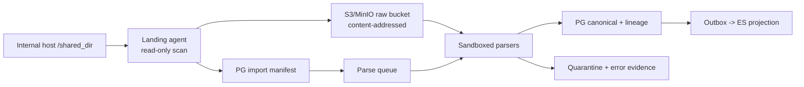
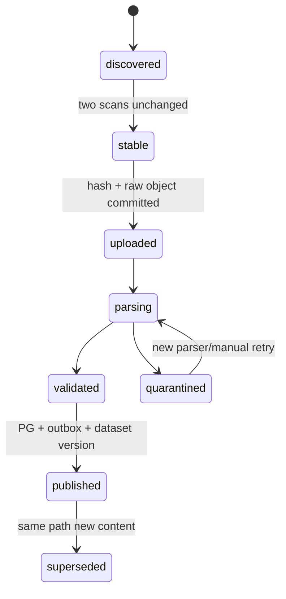

# `/shared_dir` 文件接入设计与迁移手册

状态：分阶段交付。精确单文件的服务器路径注册、预览、结构指纹、格式规则复用、观察证据
与手动导入已经实现；`/shared_dir` 目录 watcher、landing agent、对象存储、递归 manifest
和 archive importer 尚未实现。现有功能从不移动、不重命名、不删除源文件。

## 1. 已知输入

服务器截图显示 `/shared_dir` 同时包含：

- 大量 `task_*_YYYYMMDD_HHMMSS.xlsx`、模板和抽取结果；
- JSON 结果和临时日志；
- ZIP/RAR；
- DOCX/TXT 报告；
- 平台/项目目录，例如 Facebook、LinkedIn、Twitter、RAG 结果目录；
- AppImage、software 等可执行或工具目录。

这不是同一种 dataset，不能用 Filebeat 或一个“万能 Excel 表”直接写 ES。每类来源先注册 connector/parser/schema，再发布数据集。

## 2. 推荐拓扑



未来目录级生产拓扑推荐在 Night-All/文件所在宿主机运行最小 landing agent，单向上传对象和 manifest；届时 Hub API 不挂载宿主根目录。过渡期单节点 K8s 可以把运维预先批准的精确目录以 `readOnly: true` hostPath 挂给专用 landing workload。当前已实现的同步单文件能力允许把同一精确目录只读挂给 Admin/combined ingest runtime；两种方案都不能把该目录挂给 Public listener，也不能把过渡挂载当成多节点部署契约。

运行时配置以 `MX_INSIGHT_SERVER_FILE_ROOTS` 维护不可由 API 修改的
`rootId -> mountPath` allowlist。界面可以用普通文本框粘贴绝对路径，但 API 只把它当作
瞬时输入并立即映射；数据库只保存 `rootId`、规范化相对路径和内容哈希，不保存绝对路径，
也不接受 glob 或动态 mountPath。真实路径解析后必须仍位于批准根目录内，且拒绝任何
symlink、device、socket、executable、未知扩展和超过 64 MiB 的文件。当前同步单文件
能力要求 Admin/combined runtime 具有该精确目录的只读 mount；Public listener 不加载根。

## 3. 未来目录 watcher 的不变式（未实现）

以下约束属于后续 landing agent、raw bucket 与目录 watcher，而不是当前同步单文件接口：

- 源目录只读；importer 不 rename、move、delete 或修复源文件。
- 文件在两次扫描间 `size + mtime` 稳定（默认间隔 60 秒）后才接收；支持上游使用 `.part` 后原子改名。
- 原件按 SHA-256 content address 进入 raw bucket；同内容只存一份 blob，但每条来源路径都保留独立 source observation。
- 文件名和 mtime 只用于发现，不作为最终唯一键。
- parser 版本、schema 版本、sheet/row/JSONPath/archive member 全部进入 lineage。
- 解析失败进入 quarantine，不推进“已发布”状态；修复 parser 后可从 raw 重放。
- 可执行文件默认拒绝，不能因为位于 `/shared_dir` 就索引或运行。

## 4. Manifest 模型

```text
landing_root_state
  root_id, config_digest, node_id, last_scan_at, status

file_objects
  id, root_id, relative_path, path_key, device_id/inode_hint
  size_bytes, mtime, mime, sha256, raw_uri
  first_seen_at, last_seen_at, state

file_versions
  file_object_id, version, sha256, raw_uri
  parser_id, parser_version, schema_version
  discovered_at, accepted_at, parsed_at, published_at

archive_members
  parent_file_version_id, member_path, size, crc/hash, raw_uri

parse_runs
  id, file_version_id, status, row_count, accepted_count
  rejected_count, warning_count, error_code, evidence_uri
```

约束建议：

- `path_key = sha256(root_id + "\\0" + normalized_relative_path)`，同一路径是一个 slot；
- `(file_object_id, sha256)` 唯一，保留同一路径的新版本；
- `raw_blobs.sha256` 唯一，实现物理 blob 去重；
- parse/import identity 还必须包含 file hash、format-rule version、parser version、
  mapping/taxonomy policy；不能让旧的成功导入阻止修复后的新解释；
- parser 输出使用 [ADR-0006](../adr/0006-idempotent-ingestion-and-checkpoints.md) 的 canonical natural key；
- manifest 状态只允许单向推进，失败重试创建新的 parse run，不覆盖旧证据。

## 5. 状态机



`uploaded` 不等于可查询，`validated` 不等于已发布。只有字段策略、质量和租户授权完成后才能进入 public serving view。

## 6. 格式策略

| 格式 | 解析与血缘 | 限制 |
| --- | --- | --- |
| JSON/JSONL | 保存 JSONPath/line number、source schema、原始对象 hash | 限制深度、单对象和总记录数；禁止任意 `$ref`/远程加载 |
| XLSX/CSV | workbook → sheet → row；保留 header mapping、cell type、公式/显示值 | 禁用宏和外部链接；限制 sheet/row/cell 数；CSV 明确 encoding/dialect |
| DOCX/TXT | 提取 paragraph/table，保留段落/表格坐标 | DOCX 作为 zip 安全检查；不把报告文本自动当结构化事实 |
| ZIP | 每个 member 单独 manifest/raw URI | 防 zip-slip、symlink、绝对路径、压缩炸弹；限制层数/文件数/解压总量 |
| RAR | 隔离容器中显式启用 extractor | 与 ZIP 同限制；无受控 extractor 时 quarantine，不在 API Pod 临时安装工具 |
| AppImage/可执行文件 | 只登记 metadata/hash 或忽略 | 永不执行；默认不进入文本/业务索引 |
| 目录 | 递归 inventory，child file 各自版本 | 不把目录 mtime 当完整性依据 |

推荐默认上限由 source policy 配置，例如：单文件 2 GiB、归档 10,000 members、解压比 100:1、递归 3 层。超过上限进入人工审批而不是静默跳过。

## 7. 安全与隐私

- importer 使用只读 OS 账号和只写 raw bucket prefix；parser 无宿主目录权限；
- 可选 ClamAV/安全扫描发生在 extraction 前，扫描失败不自动放行；
- archive extractor 禁网络、只读 rootfs、临时目录配额、CPU/内存/时间限制；
- MIME 由内容检测与扩展名交叉验证；扩展名冲突进入 warning/quarantine；
- raw、quarantine 和 parse evidence 默认最高敏感级别，不进入 Kibana 公共空间；
- 文件可能包含账号、联系方式、泄漏或其他敏感数据，dataset catalog 必须先设置用途、法务依据、retention、字段脱敏和访问审批；
- 日志只记录 manifest ID/hash prefix/error code，不打印整行数据、token 或个人字段。

## 8. 当前可用的精确单文件流程

1. 运维在 Hub runtime 配置静态 allowlist，例如
   `MX_INSIGHT_SERVER_FILE_ROOTS={"internal":"/shared_dir/import"}`，并以只读方式挂载同一路径；
2. 使用 Hub Admin Token 进入“外部数据源”，注册文件源并选择“服务器路径”；
3. 在普通文本框直接粘贴白名单内的精确文件路径；注册后 catalog 仅显示
   `internal:relative/path`；
4. “读取并预览”生成内容 SHA-256、结构指纹和本地映射建议；若同 dataset/platform/
   objectType 已有完全相同指纹，会显示并适配已批准格式规则；
5. 保存并显式批准 mapping。新结构形成不可变规则版本，同结构则引用已有版本；
6. 再次预览后导入。导入必须携带该次 preview SHA，文件变化或 schema drift 会返回 409；
7. `ingest.file_observations` 保存路径 locator、内容版本、结构/规则及 import run 证据。

当前支持 `.csv/.tsv/.jsonl/.ndjson/.xlsx/.xlsm/.txt/.md`；不支持目录、glob、PDF、DOCX、
ZIP/RAR、Parquet、老 `.xls` 或 `.json` 数组。HanLP 在 PG 写入后由 ES projector 使用，
不是文件解析的前置步骤。

## 9. 后续目录迁移步骤

### Phase A：只读 inventory（未实现）

输出机器可读 manifest，不上传内容：

```text
relative_path, size, mtime, detected_mime, extension, sha256(optional), decision
```

统计文件数、总大小、格式、目录和最近修改时间；把 AppImage/software、未知二进制和超大归档先列为 `excluded_pending_review`。

### Phase B：小样本

每类选 1–3 个非敏感样例：一个 JSON、一个 XLSX、一个 DOCX、一个 archive。完成 raw 上传、parser、lineage、PG 去重和 ES 重建验证，不读取全部目录。

### Phase C：历史 backfill

- 按 source/dataset/时间分批；
- 每批有 manifest hash、记录数、失败数和发布版本；
- 限速，避免抢占 Night-All/Launcher/Internal K8s 的 CPU、IO 和 PG 连接；
- 失败批次可重跑，成功批次不重复发布；
- backfill 不触发 Night-All provider 调用。

### Phase D：持续同步

周期扫描或 inotify 只负责发现；仍需稳定窗口和全量 hash。定期做低频 reconcile，弥补 watcher 丢事件。源删除默认只登记 `source_missing`，不立即删除已发布数据。

## 10. 需要实现的命令契约

后续 importer 应提供如下安全入口；本文不把未实现命令写成可运行事实：

```text
mx-insight ingest files inventory --source internal-shared --root-id internal-shared --output manifest.json
mx-insight ingest files sample --manifest manifest.json --limit-per-type 3
mx-insight ingest files run --manifest manifest.json --batch-size 100
mx-insight ingest files reconcile --source internal-shared
mx-insight ingest runs status <run-id>
mx-insight ingest runs retry <run-id> --failed-only
```

`--root-id` 必须已存在于 workload 的静态 allowlist；CLI/API 均不得接受 `--root` 或任意
绝对路径。所有命令必须默认 dry-run；真实上传/写库需显式 `--execute`，并显示目标
source、bucket、database、文件数和预计字节数。不得提供“清空源目录”或自动删除 raw
的快捷命令。

## 11. 验收

- 同一 manifest 连续导入三次，canonical 记录数不增长，observation/run 证据符合策略；
- 同一路径内容变化生成新 file version，不覆盖旧 raw；
- archive zip-slip、symlink、炸弹、假扩展名和可执行文件全部 fail closed；
- XLSX 每条记录可追到 workbook/sheet/row 和原文件 hash；
- parser 升级后可从 raw 重放并生成新 dataset version；
- ES 全删可重建，源 `/shared_dir` 全程无写入；
- importer 停止或失败不影响 Hub 已发布数据、Launcher 和 MX-H2I 联网。
