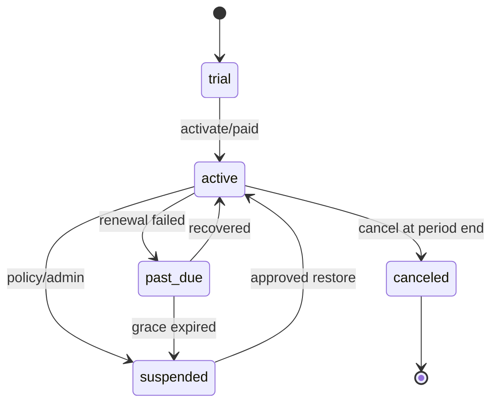

# 订阅、分组、Key、额度与商业控制面

状态：分阶段实现。当前已实现 tenant/consumer、Launcher opaque-token 联邦登录、每把新 Key
的 platform/capability entitlement snapshot、版本化 plan catalog、consumer plan assignment、
月度套餐/突发/Key/consumer 最严边界的原子 quota、usage evidence，以及 `/plans` 控制台中的
平台管理员 CAS 套餐分配。当前仍未实现客户自助换套餐/购买、版本化 customer price book、subscription 生命周期、
credit ledger、invoice/payment、持久账单导出和外部 ToC 门户。

## 1. 对象边界

| 对象 | 含义 | 权威系统 |
| --- | --- | --- |
| Launcher account/organization | 人员登录、MFA、组织选择、全局 AppCenter scope | MX Launcher User Center |
| Hub member/tenant membership | 人员在某 Hub tenant 内的产品角色 | Hub，绑定 Launcher principal |
| Consumer | 调用数据 API 的业务应用/服务身份 | Hub |
| Access group | 一组版本化 platform/capability/dataset/field entitlement | Hub |
| Plan version | 价格、周期额度、并发、保留、SLA 和可选 group | Hub |
| Subscription | tenant/consumer 在一段时间内订阅某个 plan version | Hub |
| API key | consumer 的可轮换凭据，绑定环境和 entitlement snapshot | Hub |
| Credit account/ledger | 预付、赠送、预占、结算、释放、退款和调整 | Hub |
| Provider quota/cost | 物理上游 credential 的容量和实际采购成本；直连适配器由 Hub 记录，Night-All 兼容调用仍由 Night-All 提供来源证据 | Hub gateway / Night-All legacy |

外部用户只登录 Launcher；Hub 不保存第二套密码。外部程序只维护 Hub API key（未来可增加 OAuth client credential），不需要同时维护 Launcher 用户 API 和 Night-All key。

## 2. “分组”定义

避免一个模糊 `group` 同时代表组织、角色、套餐和 provider channel。明确拆为：

- `access_group`：可使用哪些 platform/capability/dataset/field；
- `plan`：额度、价格、并发、SLA、retention、export/agent 权限；
- `tenant/team`：人员和业务归属；
- `consumer`：实际调用应用；
- `provider/channel`：只留在 Night-All，不暴露给客户。

Access group 每次发布生成不可变 `group_version`。订阅和 key 绑定具体 snapshot；“全部平台”在授权时展开为已批准模块列表，未来新增敏感平台不会自动进入旧订阅。

## 3. 推荐模型

```text
hub_members
external_identity_bindings
tenant_memberships

consumers
access_groups
access_group_versions
access_group_entitlements

plans
plan_versions
plan_limits
price_books
price_book_entries
subscriptions
subscription_entitlement_snapshots

api_keys
api_key_restrictions

quota_buckets
credit_accounts
credit_ledger_entries
usage_events
usage_allocations
invoices
invoice_lines
commercial_outbox
```

关键约束：

- plan/group 发布后不可原地改语义；变更创建新 version；
- consumer 套餐分配以 `revision` 做 compare-and-swap；实际切换会记录 actor、前后版本和前后修订，
  重复分配同一版本是 no-op，不刷新 `assignedAt`、额度周期或审计事件；
- subscription 保存 plan/group/price-book snapshot，续费时才切版本；
- API key 绑定一个 consumer、environment 和 subscription entitlement snapshot；
- 金额/credit 使用定点整数和明确 currency/unit，不用 float；
- ledger append-only，余额是 ledger projection；任何人工调整也有正反向流水和审批人；
- usage event 有唯一 `meter_event_id`，重复投递不重复计费；
- provider cost 与 customer price 分表，不向客户响应泄漏 provider/channel。

## 4. 角色与权限

Hub tenant 角色建议：

| Role | 权限 |
| --- | --- |
| `owner` | tenant 生命周期、成员、商业配置、密钥和账单 |
| `billing_admin` | plan/subscription/credit/invoice，不自动获得 raw 数据 |
| `data_admin` | dataset/group/field policy、导入、质量和发布 |
| `developer` | consumer/key、API 文档、测试环境和 usage |
| `analyst` | 已授权 BI/保存查询/报告，无 key/账单管理 |
| `viewer` | 只读 Dashboard/usage |

Launcher 的全局 `insight.admin` 只允许进入 Hub；进入后还要检查 tenant membership。不得让 `mx-admin` 或 gateway admission 直接绕过 Hub tenant、field、credit 或审计策略。

当前套餐分配是平台运维动作：仅 `platformAdmin` 可调用
`PUT /internal/v1/admin/consumers/{consumerId}/plan`，body 必须恰好为
`{"planVersionId":"<published-active-version-uuid>","expectedRevision":<current-positive-revision>}`。
`assignedBy` 只从已认证 principal 取得，调用方不能提交；修订不匹配返回
`409 plan_assignment_revision_conflict`，要求刷新后重新确认。
`legacy-unmetered` 只用于保留迁移时已有绑定：同版本重放仍是 no-op，但不能新分配，服务端返回
`409 plan_version_grandfather_only`，管理台也不提供分配按钮。

## 5. 订阅生命周期



- `trial` 有明确 end time、额度和可用 group；
- `past_due` 的数据读取/refresh 行为由 plan policy 决定，不能隐式继续产生上游费用；
- suspension 立即阻止新 refresh/高成本任务，可按合规策略保留历史导出；
- cancel 不删除账本、usage、dataset 或审计；数据 retention 走独立策略；
- plan 升降级在周期边界或显式 proration transaction 生效，保存前后版本和审批证据。

## 6. API Key 生命周期

发行流程：

1. 验证成员 tenant role 和 consumer/subscription 状态；
2. 选择 `live` environment、expiry、IP/CIDR、allowed origin（若适用）；Test 仅保留为兼容元数据，
   隔离门槛完成前不在管理台签发；
3. 固化 entitlement snapshot 和最大 scope；
4. 只显示一次 plaintext，PG 保存 HMAC digest、prefix、last four；
5. audit 记录发行人、consumer、snapshot 和 reason，不保存 plaintext。

当前实现要求每把 key 都有明确到期时间：控制台和 API 默认 `180` 天，可在签发时通过
`expiresInDays` 设置 `1–730` 天。到达 `expiresAt` 后认证立即失败，列表保留原始
`status` 并以 `effectiveStatus=expired` 展示，不把过期误报成已撤销。升级前已存在且
没有期限的 key 在迁移时获得新的 180 天窗口，避免发布瞬间中断现有调用；仍应按轮换
流程逐步替换。过期和撤销都不会删除历史 usage 或审计证据。

当前实现已经把授权分成两层：consumer grant/policy 是可随时收窄的上限；每把新 Key 在
签发时保存所选 platform/capability 与当时额度 ceiling 的 immutable snapshot。一次请求必须
同时通过 consumer 当前授权与 Key snapshot，且 plan、consumer policy、capability policy 和
Key ceiling 取最严格值。consumer 撤权立即收窄所有 Key；之后新增授权或提高 ceiling 不会
静默扩大旧 Key，必须签发明确选择新范围/上限的替代 Key。迁移前 Key 标记为
`legacy_dynamic` 并暂时保留旧语义，运营应按 overlap 流程轮换为 snapshot Key。

当前 `environment=test` 只是一项兼容元数据，尚未形成隔离沙箱，不能把 `mih_test_` 当作通用
零费用凭据。管理台当前仅签发 Live Key。外部 ecommerce 另有 fail-closed 路由门禁：有授权的
Test key 在 capabilities 中看到 `ecommerce.ready=false`，搜索与媒体读取均返回
`403 test_key_not_supported`，且发生在 usage reservation、已提交结果/媒体读取和 provider dispatch
之前。旧版遗留的 ambiguous Test 请求只保留原 body、原 `Idempotency-Key` 和指纹锁供运维核查；
页面不验证原 secret、不发 capabilities/search/media，也不把它转换成 Live 请求。只有第 12 节
隔离门槛全部满足后才能重新开放 Test 签发。

轮换采用 overlap：先发第二把 key，验证流量，撤销旧 key。缓存鉴权必须有短 TTL 和主动失效。浏览器前端不长期保存 Admin token；公共 key 不进入 URL、日志、Kibana 或 Night-All。

## 7. 请求授权和额度顺序

```text
authenticate key
  -> tenant/consumer/key/subscription state
  -> route credential-class gate: external ecommerce accepts live only
  -> entitlement snapshot: platform/capability/dataset/field
  -> IP/environment/request constraints
  -> concurrency + request/record/byte/job/agent-token quota
  -> idempotency record
  -> PG transaction reserve credits/quota
  -> cache delivery or refresh/job
  -> commit actual usage / release / unknown reconciliation
  -> immutable usage + ledger + commercial outbox
```

余额不足时必须在触达 Night-All 前失败。Night-All provider quota 充足不代表客户有余额；客户有余额也不代表某 provider ready。

## 8. Metering 与价格

支持多维 meter，但每个 plan 只启用明确维度：

- request、record、response byte、export byte；
- refresh job、platform fan-out、live provider operation；
- stored search/cache delivery；
- Agent model token、tool call、wall time；
- 人工报告/高成本 enrichment。

同一 refresh 被多个请求 singleflight 合并时：

- Night-All provider cost event 只出现一次；
- 每个客户 delivery usage 独立；
- 是否对 cache hit、stale、live、failed/partial 计价由 price-book entry 明确；
- 计费绝不从当前 `providerCalls`、HTTP 状态或 `items.length` 临时猜测；
- 未知 upstream outcome 保留 reservation，进入 reconciliation，不自动免费重试。

对 replay/cache delivery 引入客户计价前，每条不可变 delivery evidence 必须保存实际调用的
API key ID，以及 consumer、subscription、entitlement 和 price-book version snapshot；或者
合同必须明确只按 consumer 计价并在每次 delivery 固化该 consumer 的订阅快照。当前
`usage_requests.api_key_id` 主要保留原始逻辑请求的 key，不能单独证明轮换后由哪把 key 发起了
一次 replay，因此现阶段不得据此生成 replay 客户扣费。

## 9. 管理后台与 Launcher 集成

Hub Admin 提供：

- tenant/member/identity binding；
- consumer、key、rotation/revoke；
- access group/version、dataset/field grant；
- plan/version、subscription、quota、credit、coupon/recharge（如需要）；
- usage、ledger、invoice/export；
- platform/capability readiness 和 refresh/cache evidence；
- audit、approval 和 reconciliation。

Launcher AppCenter 只展示入口和 offline-safe 摘要。当前 SSO 把短期 Launcher opaque bearer
传到 Hub Admin，由 Hub 调用 Launcher introspection 并绑定 Hub-local tenant membership；
Launcher Server 的 service admin token 不发送到浏览器。外部客户可复用同一身份协议，但
必须使用独立 audience/client、Hub tenant role 和入口，不能复用 MX-H2I 项目角色或会话表。
当前管理台已支持租户委派管理，独立 ToC 自助门户及自助订阅/账单尚未实现。

## 10. 对外接口分面

- Public data API：一把 Hub Public API key、稳定 schema、consumer 级产品授权和 usage；
- Customer self-service API：成员 token，只操作自己 tenant 的 consumer/key/subscription/usage；
- Internal Admin API：Hub operator，高风险动作需要审批/audit；
- Service integration API：Launcher/Night-All workload identity，精确 method/scope；
- Billing webhook：签名、timestamp、nonce、重放保护和 idempotency。

public/admin listener 继续物理分离。任何 public wildcard route 都不能访问 Admin、invoice mutation、provider、Credential、Kibana 或 raw artifact。

## 11. 最小交付顺序

1. **已完成本阶段**：key entitlement snapshot 与 consumer 当前授权取交集；access-group 版本化仍待后续抽象。
2. **部分完成**：版本化 plan catalog、默认 assignment、平台管理员 CAS assignment、月度套餐/突发/Key/consumer quota 已有；subscription 状态和客户自助变更尚未实现。`launch-1m` 的套餐层只设 1,000,000 次/月、100 RPS 和最大分页 100；具体平台与每把 Key 的滑动窗口继续独立生效，避免套餐小时窗口让月额度理论不可达。
3. append-only credit ledger、reserve/commit/release/refund 和 reconciliation。
4. Launcher JWKS identity binding、tenant roles 和 self-service UI。
5. price book、invoice line/export；需要在线支付时再接支付 provider。
6. coupon/recharge/reseller/多币种等商业能力按真实销售流程增加，不先复制 Sub2API 所有页面。

## 12. 上线门槛

- 同一 idempotency/meter event 重放不会重复扣费；
- reserve、usage 和 ledger 在并发下守恒，余额永不由可变 aggregate 直接改写；
- plan/group 版本更新不扩大既有 key 权限；
- key revoke、member suspend、subscription suspend 在定义的传播 SLO 内生效；
- 开放 Test 签发前，test/live 数据、Key、配额、账本和 provider dispatch 已隔离；
- Launcher 登录不能绕过 Hub tenant role，Hub outage 不影响 Launcher/MX-H2I；
- 缓存命中、stale 回退、partial/unknown 和合并 refresh 的计费均有合同测试；
- 财务/usage/audit 导出可从 immutable evidence 复算。
