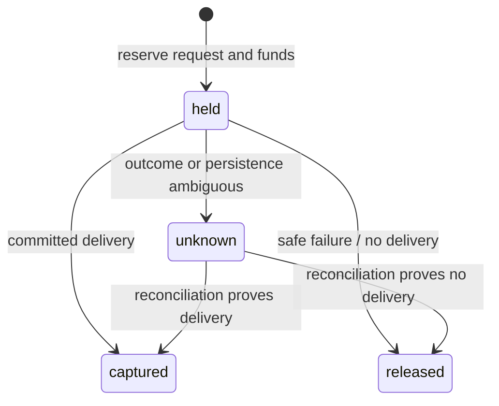

# 套餐、钱包、租户自助与商业控制面

状态：本轮代码已实现，尚未宣称部署或启用生产扣费。实现范围包括 provider-neutral
计费 meter、不可变套餐与客户价目表、租户倍率、`disabled` / `shadow` / `enforced`
三种计费模式、租户钱包与 append-only 流水、请求级价格快照、客户侧用量/金额视图，
以及平台管理员的人工入账、灰度开关和未知冻结人工对账。

现有套餐版本没有客户价目表，继续保持不计费；仅当 consumer 被明确分配到带价目表的
新套餐版本，且所在租户被明确切到 `shadow` 或 `enforced` 时，新计费链路才会介入。
因此迁移和代码发布本身不会触发扣费、改变既有配额，或改变 Public Data API 合同。

当前没有在线支付、自助购买、自动续费、invoice、支付回调或租户自行充值。充值入口是
平台管理员的人工正向入账，要求幂等键并保留操作者与原因。租户成员可在受限控制台查看
自己的最终费率、余额、流水和用量，但看不到供应商、采购价或内部倍率。

## 1. 不把供应商当成客户分组

“分组”不应同时承担权限、套餐、价格和 provider route。Hub 将这些维度拆为四条正交轴：

| 维度 | 回答的问题 | 是否面向租户 |
| --- | --- | --- |
| Grant / entitlement | 这个 consumer、API Key 能调用哪些平台和能力 | 是 |
| Plan version / quota | 月额度、窗口、突发 QPS、分页上限是什么 | 是 |
| Customer price book / wallet | 每个 Hub 能力的最终合同价、余额和扣款是多少 | 是，只展示最终结果 |
| Provider routing / procurement | 本次由 TikHub、JustOne 或兼容链路交付，采购成本与健康状态如何 | 否，仅平台管理员 |

客户价格绑定稳定的 Hub 能力，而不是供应商名称。例如：

| Meter key | 客户购买的能力 | 当前计费单位 |
| --- | --- | --- |
| `social.posts.search` | 社交内容搜索交付 | request |
| `social.posts.resolve` | 单篇社交内容解析交付 | request |
| `ecommerce.products.search` | 电商商品搜索交付 | request |

因此租户不需要知道搜索由哪个上游完成。Hub 可以按健康度、QPS、成本和数据质量切换
供应商，只要保持同一公开合同与 meter，客户套餐、API Key 和账单语义都无需变化。
上游平台不是客户分组；需要区别客户价格时，使用套餐价目表和租户倍率。

## 2. 当前对象与权威边界

| 对象 | 含义 | 权威系统 |
| --- | --- | --- |
| Launcher account | 人员登录、MFA、组织和全局身份 | MX Launcher User Center |
| Hub member / membership | 人员在某个 Hub tenant 内的角色与可见范围 | Hub，绑定 Launcher principal |
| Tenant | 钱包、最终价格策略和人员边界 | Hub |
| Consumer | 调用数据 API 的业务应用或服务身份 | Hub |
| API Key | consumer 的可轮换凭据和 immutable entitlement snapshot | Hub |
| Plan version | 不可变的套餐限额版本，可选择绑定一个客户价目表版本 | Hub |
| Customer price book | provider-neutral meter 到客户基础售价的不可变映射 | Hub billing |
| Tenant billing profile | 计费模式和租户价格倍率 | Hub billing |
| Customer charge | 一次 Hub 请求在创建时固化的价格快照与结算状态 | Hub billing |
| Credit account / ledger | 租户预付钱包与 append-only 余额变动事实 | Hub billing |
| Provider call / cost evidence | 实际上游调用、endpoint、结果、采购成本估算与归档证据 | Hub external-platform gateway |

外部人员仍使用 Launcher 登录，Hub 不保存第二套密码。外部程序只持有 Hub Public API
Key，不需要持有 Night-All、TikHub 或 JustOne 的凭据。

## 3. 套餐、价目表和租户倍率

平台管理员通过一次发布操作创建新的 plan version 和 customer price-book version。发布后：

- plan version 和 price-book version 不原地改价；改价发布下一版本；
- 已发布 price book 的 meter、单位、基础价、币种和默认倍率不可变；
- consumer 仍通过带 `expectedRevision` 的 compare-and-swap 分配到具体 plan version；
- 一次请求固化 plan、price book、price entry、meter、基础价、倍率、币种和最终报价；
- 后续调价或修改租户倍率不回写历史 charge；
- 旧 plan version 的 `customer_price_book_id` 为 `NULL`，这是明确的兼容不计费路径。

金额使用最小货币单位的安全整数，不使用浮点数。倍率使用 parts-per-million：

```text
最终单价（minor） = ceil(基础单价（minor） × multiplier_ppm / 1,000,000)
```

`1_000_000` 表示 1 倍；租户倍率为空时继承价目表默认倍率。租户接口和受限控制台只返回
计算后的 `customerRates`，不返回基础价目表和实际倍率，避免把内部折扣策略变成公开契约。

本轮只支持按 request 计价。record、byte、job、Agent token、存储时长和阶梯价可以在
后续增加为新的明确 billing unit，不能根据响应 `items.length` 或供应商 `providerCalls`
临时推算客户价格。

## 4. 三种计费模式

租户 billing profile 由平台管理员控制，并使用 revision 做并发更新保护。

| 模式 | 价格快照 | 钱包变化 | 对调用的影响 |
| --- | --- | --- | --- |
| `disabled` | 不创建 customer charge | 无 | 与历史行为一致 |
| `shadow` | 有完整价格时创建报价；缺价时跳过 | 无 | 只观测，不因计费中断业务 |
| `enforced` | 对带价目表的套餐必须找到已发布价格 | reserve / settle | 请求前余额门禁，余额不足返回 402；缺价返回 503 |

模式是租户级开关，套餐是 consumer 级绑定。因此同一租户可先让一个 canary consumer
使用新套餐做影子计价，其他仍绑定旧套餐的 consumer 继续不计费。

## 5. 钱包与请求结算

一个 tenant 当前只有一个币种固定的 credit account。第一次管理员人工入账创建账户，
后续入账必须使用相同币种。账户显示：

```text
总余额 = available_minor + held_minor
```

`credit_ledger_entries` 是 append-only 事实，`credit_accounts` 中的余额是由流水在事务内维护
的 projection；应用不能绕开流水直接修改余额。当前对外提供的是正向 `topup`，数据库模型
同时为后续的 grant、refund 和 adjustment 留出受约束的流水类型，但本轮没有对应的租户
自助或支付接口。

一次 `enforced` 请求的状态流如下：



- `hold`：在任何付费上游 dispatch 前，从 available 转入 held；不足时整个 usage
  reservation 事务失败，因此不会触达上游；
- `capture`：Hub 成功提交客户交付后，从 held 完成扣款；
- `release`：可证明没有完成交付时，把 held 退回 available；
- `unknown`：结果无法证明时继续冻结，不自动免费重试，也不重复扣款；后续需要对账结论；
- `shadow` charge 会记录报价和结算状态，但 `chargedMinor` 始终为 0，也没有钱包流水；
- 一个 `usage_request_id` 最多一个 customer charge，hold/capture/release 各自都有唯一幂等边界。

人工入账也要求 `Idempotency-Key`；同一租户重放相同入账不会重复增加余额。管理员必须填写
金额、币种和原因，可选外部参考号。该能力不是支付系统：当前不验证支付订单，也不允许
租户通过公开或自助接口为自己增发余额。

## 6. 客户侧计价与上游采购双账本

Hub 同时维护两个相互独立的事实域：

| 事实域 | 粒度 | 用途 | 可见范围 |
| --- | --- | --- | --- |
| 客户 charge + wallet ledger | 每个 Hub usage request | 报价、冻结、扣款、余额和租户对账 | 租户本身与平台管理员 |
| Provider call + cost evidence | 每个实际上游 endpoint call | 采购消耗、供应商 QPS/成功率/成本和数据归档 | 仅平台管理员 |

它们不是一一对应关系：一次客户请求可以完全由缓存交付而没有上游调用，也可以因为搜索
自动补全而产生一个搜索调用和多个详情调用。客户侧仍只有一个稳定的 Hub charge；采购侧
按每个实际 endpoint call 独立记录 `billed`、成本、币种、成功/失败/unknown 和归档证据。

“外部数据平台”页面展示采购侧的 TikHub / JustOne 等健康度、调用数和成本估算；“套餐与
配额”“使用记录”展示客户侧最终费率、报价、已扣、冻结和按 meter 汇总。供应商单价当前
来自经校验的人工配置，属于采购成本估算，不等同于供应商正式账单；customer charge 也
是 Hub 预付消费事实，不应直接冒充会计收入确认或税务发票。

受限租户响应会移除 provider、采购成本、内部倍率、人工入账 actor 和 external reference。
供应商切换不能改变客户 charge 快照，也不能在公开响应里暴露路由细节。

## 7. 小红书笔记画卷

### 7.1 客户 meter

| 对外能力 | Meter | 客户侧语义 |
| --- | --- | --- |
| `POST /api/v1/data/search` 的小红书 direct 请求，以及可无感直连的 `POST /api/v1/night-all/search/raw` 小红书子集 | `social.posts.search` | 每次新的 Hub 搜索交付计一个 request |
| `POST /api/v1/data/post` 及兼容别名 `POST /api/v1/xiaohongshu/app/get_note_info` | `social.posts.resolve` | 每次新的单篇笔记交付计一个 request |
| `GET /api/v1/data/posts/media` | 无新增笔记 meter | 只读取该 consumer 已提交结果中的媒体，不再次解析笔记 |

`/api/v1/night-all/search/raw` 的公开路径、请求结构和 legacy response envelope 保持不变；
符合 Hub-direct 子集的请求可在内部由 TikHub 完成。调用者不需要知道或选择供应商。

### 7.2 Search 与自动详情

一次 `social.posts.search` 客户请求在采购侧可能对应：

```text
1 × TikHub search endpoint
+ 0..N × TikHub note-detail endpoint（60 字符预览边界修复/自动补全）
= 1 × customer search charge
```

搜索和详情 endpoint 使用各自的采购单价；不能再用一个全局 TikHub 单价估算混合调用。
自动详情只影响采购调用数、数据完整性和成本，不额外生成客户 `social.posts.resolve`
扣款。若产品未来要把 enrichment 单独售卖，必须发布新的明确 meter/price entry 和公开合同。

### 7.3 Cache、fallback 与 idempotency

- fresh cache 或允许的 stored fallback 成功交付，仍是一次新的 Hub 服务请求，按当前客户
  search/resolve 合同计价；采购侧可以是 0 次上游调用；
- 同一 consumer 使用同一 `Idempotency-Key` 和相同指纹重放，只返回原 usage request，
  不创建第二个 customer charge，也不重复 dispatch 上游；
- 同一幂等键对应不同请求指纹返回 conflict，不能借重放覆盖原价格或交付证据；
- 并发相同上游查询通过分布式 lease / snapshot 合并时，上游只产生一次采购调用，但每个
  不同的客户逻辑请求仍按各自交付和合同记录 usage/charge；
- 可证明的失败释放冻结；已提交交付 capture；结果或持久化状态不确定时保留 hold 并进入
  unknown，不换新幂等键自动重试；
- 数据缓存、customer billing 和 provider procurement 是三个独立域，不能用“命中缓存”
  反推免费，也不能用“发生上游调用”反推客户应付金额。

## 8. 配额、QPS 与稳定性

计费不替代现有授权和限流。请求顺序保持为：

```text
authenticate API key
  -> tenant / consumer / key state
  -> platform + capability entitlement snapshot
  -> environment and request constraints
  -> plan / consumer / capability / key quota (strictest wins)
  -> idempotency and usage reservation
  -> customer price snapshot + wallet hold in the same PG transaction
  -> cache delivery or provider dispatch
  -> usage commit / release / unknown
  -> customer settlement + provider evidence
```

稳定性约束：

- 余额不足或 `enforced` 缺价在上游之前 fail closed，避免 Hub 为无余额请求垫付采购费；
- `shadow` 缺价不阻塞流量，用于上线前找出 meter 覆盖缺口；
- 月度额度、窗口限额、burst RPS、分页上限、API Key ceiling 和 consumer policy 继续取最严值；
- TikHub / JustOne 的 provider rate limit、并发门禁、circuit breaker、分布式 dispatch lease、
  fresh/stale cache 与 unknown 防重放继续独立工作；
- 客户 wallet 锁和 provider QPS 是不同资源，不能用充值绕过速率限制；
- price book、charge snapshot、usage、ledger 和 provider-call evidence 都用稳定 ID 关联，
  可从不可变事实复算，而不是依赖易漂移的页面聚合值。

## 9. 租户登录与控制台可见性

本轮复用现有 Launcher opaque-token 联邦登录和 Hub-local tenant membership。Hub 通过
Launcher introspection 识别人，再以 Hub membership 决定 tenant scope；没有新建密码库、
独立 cookie、第二个 OIDC client 或新的登录 listener。

受限租户成员按角色 capability 看到必要模块：

- 调用者：查看自己的 consumer；有 `consumer.write` 时可创建；
- API Keys：有 `apikey.read` 时查看；有 `apikey.write` 时签发、轮换或撤销；
- 套餐与配额：查看当前套餐、最终接口费率、余额和自己的钱包流水；
- 使用记录：查看自己的请求、报价、已扣、冻结、影子报价和按 meter 汇总；
- 小红书笔记画卷：有 `apikey.read` 时可展示并使用已授权 Key 验证数据产品；
- 开放能力、外部数据平台和全平台采购成本：仅平台管理员可见。

当前“选择展示”由服务端返回的 membership capabilities 和路由权限驱动，不依赖前端本地
猜角色。它还不是可由租户购买/勾选产品的 storefront；产品订购、自助换套餐和审批流属于
后续 subscription 生命周期。

本轮没有修改 MX-H2I 的用户登录、Domestic/Internal 网络面、DNS、WireGuard 或 Launcher
插件。Hub 只是消费既有 Launcher 身份，并在自身 Admin API 与控制台内增加 tenant scope；
Hub 计费不可用不应改变 MX-H2I 的登录或用户联网行为。

## 10. 管理与租户 API 边界

本轮商业控制面的内部接口为：

| 接口 | 权限 | 语义 |
| --- | --- | --- |
| `POST /internal/v1/admin/plans` | platform admin | 发布不可变套餐和客户价目表版本 |
| `PUT /internal/v1/admin/consumers/{id}/plan` | platform admin | CAS 分配具体套餐版本 |
| `PUT /internal/v1/admin/tenants/{id}/billing/profile` | platform admin | CAS 更新 disabled/shadow/enforced 和倍率 |
| `POST /internal/v1/admin/tenants/{id}/billing/credits` | platform admin | 幂等人工正向入账 |
| `GET /internal/v1/admin/tenants/{id}/billing` | tenant `usage.read` | 自己的余额、模式和流水；受限视图移除内部字段 |
| `GET /internal/v1/admin/plans?consumerId=...` | tenant `consumer.read` | 自己当前套餐和最终 customer rates |
| `POST /internal/v1/admin/usage/{id}/customer-charge/reconciliation` | platform admin | 用独立幂等键、操作者和证据事由对 unknown hold 做 capture/release；交付状态仍保持 unknown |
| `GET /internal/v1/admin/usage` | tenant `usage.read` | 自己的 usage 与客户计费汇总 |

所有 mutation 都留在 internal admin listener；Public Data API 不提供充值、改价、换套餐或
provider credential 能力。在线支付落地前不得把人工 `topup` 接口暴露给租户，也不得仅凭
浏览器成功页生成余额。

## 11. 兼容上线顺序

建议按 tenant + canary consumer 灰度，不一次性启用全量强制扣费：

1. 先备份并执行数据库迁移，确认历史 plan version 的 price book 仍为 `NULL`；此时无扣费变化。
2. 发布包含新代码的 Hub，但所有未建 profile 的租户等价于 `disabled`；验证登录、现有 API、
   QPS、cache、unknown 和 MX-H2I 独立健康。
3. 发布一个带 provider-neutral meter 的新套餐版本，只给 canary consumer 做 CAS 分配，
   把其 tenant 切到 `shadow`。
4. 至少观察一个完整业务高峰：按 meter 比较客户报价、cache delivery、TikHub/JustOne
   endpoint calls、采购成本、P95 延迟、429、失败率和 unknown hold 预期。
5. 修齐 price entries 和合同费率后，由平台管理员人工入账，再把该 tenant CAS 切到
   `enforced`；用小额余额验证 402 确实发生在 provider dispatch 前。
6. 逐 tenant / consumer 扩大；供应商切换只改内部 routing，不改公开 meter、历史 charge
   或客户响应。出现异常时先退回 `shadow`，无需回滚 Launcher 或 MX-H2I。

任何一步都不把旧套餐原地加价。若需要给现有客户收费，必须发布新版本、明确分配并完成
影子观测和充值，不能仅通过数据库迁移静默启用。

## 12. 本轮未实现与后续边界

- 租户在线充值、支付 provider、签名 webhook、退款 API；
- subscription 的 trial / active / past_due / suspended / canceled 生命周期；
- 自助购买、换套餐、proration、coupon、reseller 和多钱包/多币种；
- invoice、税务、持久账单导出与会计收入确认；
- unknown charge 的双人审批、自动证据关联和批量 reconciliation；当前已有管理员单笔审计化处理界面；
- 独立外部客户门户、独立 OIDC audience/client 和独立入口；
- record/byte/job/token 等非 request 计费单位。

这些能力应在真实销售、支付、税务和租户隔离需求确定后增量实现，不复制 Sub2API 的全部
页面。优先保持公开 API 稳定、provider 可替换、账本可复算和 MX-H2I 登录/联网零影响。

## 13. 上线验收门槛

- 同一 idempotency/usage request 重放不会重复 customer charge、钱包流水或 provider dispatch；
- 并发 reserve、capture、release 后 `available + held` 与 append-only ledger 守恒；
- `enforced` 余额不足返回 402，缺 price entry 返回 503，且两者均未触发付费上游调用；
- `shadow` 不改变余额、不阻断无价格流量，统计可按 tenant/consumer/API Key/meter 复核；
- XHS search 的一个客户 charge 可关联 1+N provider calls，detail endpoint 成本没有漏算；
- fresh cache、stored fallback、idempotent replay、failed、partial 和 unknown 均有合同测试；
- 租户看不到 provider、采购成本、内部倍率、credential、入账 actor 或外部参考号；
- 旧 plan、旧 API Key 和原接口 response contract 在未显式迁移时保持原行为；
- Launcher membership 撤销能收窄 Hub 页面和 API，Hub 故障不影响 MX-H2I 登录或联网；
- 客户 charge、钱包流水、usage 和 provider evidence 能从不可变记录独立复算。
