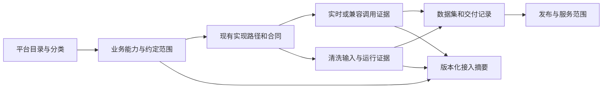

# 数据源目录与 Hub 实际接入对账规划

- 日期：2026-09-23。
- 状态：**规划，尚未实施**。本次只核对源码、已有测试、截图和设计资料，新增文档；不执行生产查询、迁移、部署或付费验活。
- 核对基线：Hub 仓库 `feat/mx_insight_hub` / `bdc71f90`；Night-All 仓库 `5359297`。
- 用户目标：目录能反映当前 Hub；平台只接通一个接口，也应被识别为已有覆盖，但不能因此宣称全平台完成。任何后续实现必须保持 MX-H2I 用户登录和联网不变。
- 关系：细化 [ADR-0011](../adr/0011-source-catalog-authority.md) 和 [原目录规划](source-catalog-and-data-plans.md)，复用 [接入清单](../architecture/aggregate-search-and-source-routing.md) 与 [能力库存](../architecture/capability-catalog-and-commercial-governance.md)。本文没有改变现行人工状态或运行时授权合同。

## 1. 建议结论

保留现在的单一业务目录和稳定 ID，把它升级为“平台 → 业务能力 → 接入路径 → 运行/数据证据”的可对账目录。

页面默认回答“Hub 实际接到了什么”。原表的覆盖、实施、负责人、备注继续保留，明确标记来源；历史材料不再直接充当实际接入证明。至少一项能力通过验收的平台显示 **已覆盖（部分能力）**，项目仍可为 **进行中**。平台全部完成必须有事先确定的能力范围与验收标准。

这次不需要重建 Launcher、上游执行引擎、通用 DAG、Agent Studio 或数据中心，也不需要再建一份独立可编辑的 API 注册表。已有目录、生成式能力库存、外部平台 operation/release、source/import run 和 canonical lineage 已提供大部分基础。

## 2. 核对发现：截图问题来自哪里

### 2.1 历史数量不是当前接入数量

`scripts/generate-source-catalog-seed.mjs` 从 `spec_docs/data_source` 的五份文本生成目录：

- 215 条平台/来源条目；29 条 `covered`、186 条 `not_covered`。
- 两条 Telegram 条目初始化为 `complete`；另外 27 条历史 covered 初始化为 `doing`。
- 20 条历史未覆盖的 P0 初始化为 `exploring`，因此截图的“进行中 47”实际合并了 `doing + exploring`，也不是 47 个真实运行中的接入任务。
- 来源文件 hash、导入行号、旧字段和导入批次已经保存，应该继续利用这些溯源信息。

所以历史的“已覆盖 29”“进行中 47”只是导入及人工治理口径。当前数据库可能经过编辑，不能用源码种子数量代替生产快照。

### 2.2 rapid/justone 的来源与编辑位置

生成器的 `connectorHints(note)` 对旧备注做关键词提取：`rapid/justone` 会同时生成 `rapid` 和 `justone` 线索，原备注仍保留。`device` 来自“真机”，`self_hosted` 来自“自建”。

当前 UI：

- 表格“接入线索”读取 `connectorHints`，不是运行时连接配置。
- “状态与合规”页签编辑 `notes`；截图停留在这里，因此看到 `rapid/justone`。
- 独立的 `connectorHints` 编辑器已经存在于“接入与证据”页签，但表格标签没有直接带用户定位到它。
- 运行时编辑备注不会重新生成 hints；两者是独立字段，修改一处可能留下另一处旧文字。
- `JUSTONE_CONNECTED_SOURCE_KEYS` 在前端固定了五条目录 ID，并把对应 JustOne hint 渲染成“商品搜索已接”；这个实现能说明特定已核对合同，但没有读取线上开关、凭据、实际调用结果。

因此这不只是“少一个输入框”，而是历史线索、实现合同、实际接通混在同一列，又缺少清晰的下钻关系。

### 2.3 当前已经有的可复用基础

| 已有对象 | 当前作用 | 当前不能证明什么 |
| --- | --- | --- |
| `catalog.source_catalog_entries`、events、taxonomy、owners | 唯一目录、人工状态、分类、revision 与审计 | 不能单凭 covered 推断接口成功 |
| `implementedRoutes()` / `sourceConnectionSnapshot()` | 从固定合同生成实现路径，按稳定 `sourceKey` 关联目录；附清洗输入登记状态 | `runtimeStatus` 固定为 `not_checked`，不是生产健康检查 |
| `control.capability_inventory`（migration 104） | 生成的 route、connector、product 定义、hash、revision、退役状态 | 登记不是授权、上线或付费调用许可 |
| 外部平台 operation policies / releases / price books | 当前运行策略、合同版本、凭据版本、采购证据 | 某供应商可用不等于其所有操作可用 |
| provider calls、gateway requests、response archives/snapshots | 真实调用、交付、缓存/回放、上游结果及版本证据 | HTTP 成功或扣费不能单独证明业务结果可用 |
| external sources、mapping、import runs、canonical/revisions/outbox | 清洗输入、处理结果、数据事实和索引投影 | source active 不等于任务成功；有索引不等于平台全覆盖 |
| related-data | 名称/alias，以及商品 marketplace、publisher、collector 的稳定目录 ID 查询 | 通用名称匹配仍有局限；不能将整个 news 数据集归给某个网站 |

`source-connections` 与 `capability-catalog` 当前都是 Admin Token 专用读取面。目录 Public 安全投影是另一份合同，不能因增加管理字段而一起开放。

### 2.4 离线对账结果

以 **215 条种子 + 当前代码合同 + 空 external_sources 输入** 运行现有纯函数：

| 指标 | 结果 | 含义 |
| --- | ---: | --- |
| 实现路径 | 79 | 包含实时、兼容、存量等路径，不是 79 个独立业务能力 |
| 关联目录条目 | 25 | 存在源码路径映射，不是 25 个线上已接通平台 |
| 其中历史 covered | 20 | 两种口径的交集 |
| 历史未覆盖但有路径关联 | 5 | 微信公众号、微信搜一搜、TikTok、LinkedIn、启信宝 |
| 历史 covered 但无路径关联 | 9 | 微信视频号、拼多多、Substack、Bing、微博热搜/话题榜、新闻网站、企查查、天眼查、Shodan |
| 尚无目录绑定的路径 | 18 | 含通用 data-search adapter、舆情、13 个初始存量分类、IP 风险、虚拟超市、专题报告；不应强行归入具体网站 |
| 生成能力库存 | 373 | 79 route + 289 connector + 5 product，混合不同对象类型，不可称为 373 个已接接口 |

空 source 输入导致 `registeredInputs=0`，仅表示本次没有读生产库；不是“线上没有配置清洗源”。9 个缺少映射的条目也不能直接改成未覆盖，可能存在尚未纳入清单的实际路径或记录证据，需要逐项核对。

当前 25 个映射条目：抖音、快手、小红书、微博、B站、知乎、微信公众号、微信搜一搜、淘宝、天猫、京东、抖音电商、快手小店、小红书店铺、闲鱼、TikTok、X/Twitter、Instagram、Facebook、YouTube、Reddit、LinkedIn、Telegram 公开频道、Telegram 公开群组、启信宝。

### 2.5 Night-All 资料的使用边界

已阅读 Night-All 的 `docs/README.md`、`specs/README.md`、`NIGHT_ALL_DATA_SEARCH_API_V1.md`，并核对 `lib/domains/data-capability/manifest.js`。历史规格中存在“Hub 待实现”“分页 buffer”等阶段性叙述，不能据此撤销 Hub 当前直连或恢复已调整的分页行为。

当前 Night-All manifest 注册 15 个搜索平台，并分别声明默认来源和有限的 verified 列表。**平台注册、合同标记 verified、某次线上成功，是三件不同的事。** 闲鱼不在该 15 平台统一搜索 manifest 内；Night-All 的历史显式 provider 路径也不能因为 `rapid/justone` 备注，就被认定为 Hub 已公开支持的闲鱼路径。

Hub 当前接入清单是起点，不是完整上游 API 目录。上游有能力但 Hub 尚无经过审核的合同与关联时，记录为“上游能力候选”，不计 Hub 已覆盖。

## 3. 状态口径：平台触达与能力完成分开

### 3.1 面向用户的四个主要问题

| 维度 | 回答的问题 | 建议展示 | 维护方式 |
| --- | --- | --- | --- |
| Hub 实际接入 | 至少一项能力是否接通过？ | 待核验 / 有实现待验证 / 已覆盖（部分能力） / 已覆盖（约定范围全部） | 从经过关联的能力与验收证据派生 |
| 项目实施阶段 | 团队还在做什么？ | 探索中 / 已规划 / 进行中 / 受阻 / 已完成 / 暂停 / 退役 | 保留现行人工状态与审计 |
| 当前可用性 | 现在这条能力能否使用？ | 配置未知 / 待配置 / 已暂停 / 就绪待请求验证 / 最近成功 / 降级 / 失败 | 读取 operation 或 source 状态与观测，不主动调用 |
| 验收范围 | 已完成多少约定能力？ | 已接通 N 项；已验收 M / 范围 K；范围未定义 | 基于批准的范围版本，不按上游所有 API 估分母 |

原 `coverageStatus` 保留，UI 标为“人工/历史覆盖口径”；新事实建议用独立 `integrationSummary` DTO。原 `reviewStatus` 是目录字段核验，不复用为接口验收。既有 API 字段含义与枚举不原地改变。

“已覆盖”的新主展示精确定义为**至少一个业务能力已接通**，和“全部完成”分开。这个展示语义需要在本文实施阶段补充 ADR，避免新旧同名指标混用。

### 3.2 一个接口接通时怎样显示

示例（规则示例，不代表本次读取到了生产结果）：

```text
小红书
Hub 接入：已覆盖 · 部分能力
能力：笔记搜索已接通；其余能力见明细
实施：进行中
当前可用性：最近成功 / 已暂停 / 待核验，按实际观测显示
证据：指定环境、合同版本、请求或验收记录、时间
历史目录：已覆盖（历史导入），可展开
```

只有代码路径，没有生产/目标环境的业务验收时，显示“已有实现，待验证”。不能为了满足“已接标记”把测试 fixture 或源码存在当成实际接通。

### 3.3 计算规则

1. 先按 `(目录项, 业务能力, 对象类型, 合同/请求形状)` 识别能力；同一能力的标准 API、兼容别名和不同供应商路径不重复计数。不同响应语义不能仅因 operation 名相同就合并。
2. 每项能力可以有多条路径，路径绑定明确环境、发布合同与实施证据。源码关联本身只贡献“已实现”。
3. 至少一条路径有适用的真实业务交付/入库验收，或有证据可追溯的人工验收，即认定此能力“已接通”。历史表格 covered、连接探测、单纯 HTTP 200、上游已扣费均不够。
4. 合同明确的合法空结果可证明接口能正常交付，单独标记“成功空结果”；它不能证明存在可浏览的数据，也不能完成要求非空字段样本的数据质量验收。
5. `已覆盖平台数 = COUNT DISTINCT 活动目录项 ID WHERE 接通能力数 >= 1`；条目 kind 作为统计维度，不能把平台、通用来源类型、第三方服务都误称为网站。
6. `能力完成率 = 已验收且在范围内的能力数 / 已批准范围能力数`。范围未定义或分母为零时显示“范围未定义”，不显示 0% 或 100%。范围版本变更不重写历史报告。
7. 接通证据与运行健康分别维护。临时故障/暂停不抹去曾经接通的事实；当前可用数单独统计。路径已退役且无替代时，主展示“已退役，曾覆盖”，移出当前覆盖集合并保留历史。
8. 新合同、凭据版本或绑定发生相关变化后，旧成功仍保留为历史证据；不能无条件给新配置背书。缺少版本对应关系时显示“待复验”。
9. 缺少证据表示未知，不自动判失败或未覆盖；没有观测流量也不自动判健康。
10. “进行中/已完成”仍由负责人维护；系统生成建议与冲突待办，不静默覆写人工阶段。原“进行中”视图合并 exploring 的行为保留兼容，UI 应标明“探索/进行中”。

## 4. 关联模型：优先复用已有表与注册表



### 4.1 不新增另一份执行注册表

- `control.capability_inventory` 继续保存生成定义；完善 definition 中的业务能力键、request-shape、对象类型、目录绑定与合同关联。它仍然不是 dispatch registry。
- `implementedRoutes()` 是生成来源之一；逐步由现有共享合同/产品定义提供元数据，减少前端和服务端各写一份固定名单。
- route、connector、product 保持不同类型。企业目录的一个 `enterprise.query` 路径不能伪装成“274 个全部可用 API”；需要下钻到固定 apiId/operation 和各自发布策略。
- 任何默认路径描述保持只读，目录中不新增“切换默认供应商”或“自动故障切换”设置。

### 4.2 最小新增关系（名称为建议，迁移号实施时确定）

| 关系 | 主要字段 | 约束 |
| --- | --- | --- |
| `source_catalog_capability_bindings` | entryId、业务 capabilityKey、inventoryRouteId、对象类型、requestShapeKey、source/dataset 引用、受控 selector、origin、reviewState、revision、retiredAt | 多对多；稳定 ID；唯一关系键；不保存密钥、任意 SQL/URL；重命名不失联 |
| `source_catalog_capability_scopes` | entryId、scopeVersion、纳入验收的能力键、目标字段/质量/时效、owner、review、生效时间 | 范围是业务计划，不从已实现条目自动生成“全部完成” |
| `source_catalog_verification_events` | bindingId、environmentId、contract/release/hash、证据类型与稳定引用、结论、理由、actor、时间、复核期限、替代事件引用 | 追加保存；自动观测不冒充人工签字；共享 Admin Token 不虚构实名审批人 |

这些是目录关系和验收记录，不复制 provider calls、完整 response、清洗日志、账单或 canonical 正文。现有 events 记录元数据变更；新验收事件引用已有证据。第一期纯展示改造可直接使用生成关联，不必等待所有关系表落地。

`selector` 只允许已定义的目录/业务字段，例如商品 marketplace、publisher entryId、collector entryId。一个多平台 source active 或导入成功不能为其所有候选平台背书；必须证实对应 selector 的数据/验收范围。Telegram 的群组和频道也不能只因共用输入就宣称两者均有实际样本。

### 4.3 线索与接入方式结构化

历史 `connectorHints` 原样保留为 legacy hints，后续提供结构化候选记录：

- `kind`：供应商线索、官方 API、数据库输入、文件输入、设备采集、人工资料等；`vip` 归到条件说明，不当成连接器。
- `providerRef/methodKey`：只引用现有受限平台目录或受控方式词典；模糊的 `rapid` 不自动等价于某个具体 RapidAPI 订阅/端点。
- `state`：候选、调查中、已关联、暂不采用。
- `origin`：历史导入/人工登记/合同清单；保留原字符串、来源 hash 与行号。
- `bindingIds`：关联到实际路径后显示路径状态；候选本身不能产生覆盖。

备注继续保存自由说明，不参与自动路由或覆盖判定。一次性迁移仅提取候选；以后不随保存备注重新解析。需要重新解析时提供预览差异，避免修改备注意外删改已审核关系。

## 5. 证据与可用性的读取

### 5.1 实时及兼容 API

关联现有 operation release/policy、凭据配置标记、采购审核状态、gateway request、provider call、交付 snapshot。分别报告：

- 代码实现、目标环境发布、运行策略、是否满足技术运行门槛。
- 最近一次真实成功、合法空结果、可用业务结果、失败/未知，以及对应环境与版本。
- 缓存、历史回退和幂等重放可以证明某次 Hub 交付，不计作新的上游成功，也不能刷新“上游最近验活”时间。
- 当前 Key 权限作为可选独立诊断；目录全局接通状态不随某个演示 Key 是否有权而改变。
- 请求时仍走原授权、价格、配额和 dispatch 校验；目录摘要不能代替这些校验。

Night-All 兼容路径不能仅记录一个“Night-All 正常”状态。证据至少约束平台、操作和请求形状。缺少精确 release/endpoint 关联的历史证据标为“历史兼容证据，版本关联待补”，不猜测补齐。

### 5.2 清洗与存量服务

分别读取 source 是否登记/暂停、mapping 是否批准、最近 import run、checkpoint、对应平台/selector 的入库证据、数据集和发布情况。明确分开：

`输入已登记 → 清洗配置可运行 → 已有有效入库 → 数据可查询 → 已发布`

它们是不同事实，不强制所有数据产品走同一串门禁。例如私有 IP 风险交付不进入共享全文库，仍然是有效业务交付；不能因其没有共享 ES 文档而判“未接通”。

归类应同时保留业务平台、数据对象类型、场景分类、物理来源、获取路径、数据集/发布范围。以后 ETL、Data Agent、BI、Text2SQL 消费这些关联与允许的数据集；不直接读取备注，也不因某个平台 covered 就获得任意数据库访问权。

### 5.3 读取必须被动、有界

- 目录加载、刷新、切页、导出只读本地元数据和已有证据；不探测第三方、不跑采集/Agent、不自动购买接口。
- 批量汇总，不对 215 条目录逐项请求 provider，不在首页逐行执行 canonical 全量 count。
- 延续现有索引与证据链。首版使用有界查询/短缓存；确有性能需求再增加可重建的摘要表，不预先引入另一个 worker 系统。
- 返回 `generatedAt/asOf`、环境、registry hash、bindings revision、metricVersion 和过期/缺失说明；图表、筛选、列表、导出使用同一个 snapshot/统计定义。
- 有成本的验活使用现有接口调试入口，由显式请求触发，保留其 Key、计费、精确请求幂等和未知结果处理；不建设会自动扫全平台的“验活全部”。

## 6. 页面如何调整

### 6.1 数据接入看板

首屏建议：目录条目数、已有实现、已接通、当前就绪、待核验/待对账、范围已验收完成。每张卡显示口径与数据时间，点击进入同一条件的表格。原“目录标记已覆盖”放到“历史与人工治理”分区，保留历史查询入口。

系统视图建议：全部、Hub 已覆盖、已有实现待验证、仅有线索、当前不可用、待对账、进行中、已归档。“JustOne 已接”保留快捷入口但改为共同关系模型的筛选结果；供应商身份仍遵循既有可见性规则，不维护另一份五条 ID 名单。

### 6.2 多维数据表

默认列：

| 平台 | 分类/场景 | Hub 实际接入 | 已接能力 | 实施阶段 | 当前可用性 | 负责人 | 接入路径 | 最近证据 |
| --- | --- | --- | --- | --- | --- | --- | --- | --- |
| 小红书 | 社交内容 | 已覆盖·部分能力 | 笔记搜索等，按证据计数 | 进行中 | 按实际观测 | 保留人工分配 | T 平台/兼容路径等 | 时间 + 证据类型 |
| 闲鱼 | 电商 | 按真实验收判定 | 商品搜索/资源/存量读取分别列出 | 保留人工阶段 | 按能力显示 | 保留人工分配 | 已关联路径；Rapid 为历史候选 | 可下钻 |

上表是目标展示示意，不是生产状态报告。历史 covered、备注、原始线索、区域、优先级等继续可选列/筛选；不删除任何人工修改。

点击“Hub 实际接入”打开能力明细；点击某条路径或候选线索，直接进入详情对应页签和记录。表格标签、筛选、CSV、弹窗应来自同一结构化投影，不再由显示文字反推状态。

### 6.3 平台详情

复用现有弹窗与页签，按职责整理：

1. **目录信息**：名称、alias、分类、区域、负责人、优先级。
2. **能力与范围**：已接能力、待验证能力、目标范围及验收条件；明确内容小红书和小红书店铺不是一项能力。
3. **接入与证据**：上部“已关联路径”（只读实际状态，链接原操作页），下部“接入候选”（可编辑）；供应商、接入方式、业务操作、验证状态分别显示。
4. **状态与合规**：人工实施阶段与历史覆盖口径、备注；系统接入摘要只读。点修改系统状态时应进入补证据/验收操作，而不是任意下拉框。
5. **关联数据**：数据集、来源、清洗任务、记录样本和发布范围，保留匹配依据；名称匹配与稳定 ID 关联明确区分。
6. **变更记录**：保留导入、人工变更、关联审核与验收结论的独立事件。

闲鱼的 `rapid/justone` 应拆成“现有已关联路径”“历史 Rapid 候选”“原始备注”三个可解释部分。移除候选不会停用连接；停用连接必须进入既有外部平台管理面，遵守原权限与流程。

### 6.4 待对账工作区

首批至少包含：历史 covered 无实现映射、有实现但历史未覆盖、实现路径无目录项、仅连接登记无成功证据、证据版本不适用、已退役路径仍被引用。

允许逐项/预览后批量：确认关系、补充证据、创建目录项、调整计划、标记线索已过时。无映射项可以保持“尚未分类”；产品/通用分类路径不必硬塞进原 215 个平台。

## 7. API 与权限兼容方案

优先扩展内部读取投影，保留旧返回值：

| 建议接口 | 用途 |
| --- | --- |
| `GET /internal/v1/admin/source-catalog/integrations` | 同口径分页列表/汇总，或由现有 source-connections 增量字段承载；实施时择一，不做重复接口 |
| `GET /internal/v1/admin/source-catalog/:id/integrations` | 某目录能力、路径、阻塞原因、安全证据引用 |
| `POST /internal/v1/admin/source-catalog/reconciliation/preview` | 生成导入/关联差异与冲突，不调用上游 |
| `POST /internal/v1/admin/source-catalog/reconciliation/apply` | 校验预览 hash、revision 与权限，事务应用元数据变化 |

具体路径属于待实施方案。若采用静态子路由，必须在 `:id` 路由前精确匹配；避免破坏现有详情合同。

- 旧 `coverageStatus/deliveryStatus/connectorHints/notes` 不删除、不更名、不在迁移时改变含义。
- 新摘要明确区分 `implementedCapabilityCount`、`connectedCapabilityCount`、范围验收数量、readiness、evidence freshness。
- Public 目录维持原 schema 和解释；新口径需要独立版本或显式扩展合同，不静默改变客户对 `covered` 的解释。
- 不放宽 Admin Token、Launcher 会话、tenant/Public 的现有边界。受限管理面可引用实际 supplier；普通展示继续用既有安全标签，不能把内部 endpoint、连接、采购或原始证据下发给租户。
- 搜索、facet、CSV、详情、变更 diff 均采用角色安全投影。被遮蔽字段的表单保存不能把遮蔽文案覆盖回真实记录，保留当前“仅提交修改字段”的方式。
- 用现有 revision 机制阻止并发覆盖；新增关系的审核身份独立于平台 owner，不新增 Launcher 账号查询或登录验证流程。

## 8. 实施顺序与迁移策略

### P0：形成可审阅的真实基线

本次已完成源码侧盘点；下一步在目标环境以只读方式获取目录实际 revision、部署版本、实现库存、来源登记、operation 状态和现有证据摘要。导出不含密钥/完整 payload。

产出对账报告：历史状态、实际状态、关联理由、证据等级、缺口、建议动作。优先核对小红书、闲鱼、五个商品平台、Telegram，以及上述 9+5 个差异项。不得把本次种子清单直接写回生产。

验收：每个建议覆盖变更都有可打开的依据；无法确定的条目保留未知。

### P1：统一展示与结构化入口

- 复用 source-connections / capability inventory，在表格、详情、看板统一展示已有实现与缺失映射。
- 替换前端固定 JustOne 名单为共同关联投影；现有 shortcut 可保留。
- 历史线索明确标记；标签点击定位编辑；真实路径和候选分区。
- 先把“已有实现待验证”显示准确，不等待后续全部证据模型完成。

验收：改备注不改变接通状态；无真实证据不会显示“已接通”；目录编辑不产生任何上游调用。此阶段可不改变生产原状态值。

### P2：接入证据与覆盖汇总

- 新增必要的目录关系、验收范围与事件表，引用已有事实；Hub-only 增量 migration。
- 生成关系先 dry-run；只有稳定 ID/已审核合同的确定关联可以机械登记，不按 hint/显示名猜测。
- 接入真实已有调用/清洗证据，按环境、版本和数据 selector 对账；对缺失信息补充人工验收记录。
- 系统按统一规则汇总“平台已覆盖/部分能力”，人工实施阶段只生成建议。
- 提供待对账视图，逐项解决缺口。

验收：一个合格能力足以让平台进入已覆盖集合；暂停/失败只改变当前可用性；范围未定义不显示全部完成。

### P3：数据归类、计划与后续 Agent/BI 关联

- 将剩余 physical sources、记录 publisher/collector、dataset、计划和发布逐项绑定；保留现有 ingestion ID、水位与 canonical 身份。
- 能力范围版本化、过期复核和历史统计；只有明确业务需要时再做协作提醒。
- 为 Data Agent/ETL/BI 提供只读语义目录；Agent 可以提议归类和映射，不能自动启用接口、改权限、发布数据或修改采集检查点。

验收：从平台可以追到指定数据集/发布范围与真实输入；从记录可以解释其平台、采集来源和处理过程。

### 迁移共通约束

1. 不改写已经发布的 `036` / `104` migration，不重新生成旧 seed 覆盖线上表。
2. 保存历史值、origin、导入 hash 与人工 audit；迁移不能把人工编辑误判成旧种子。
3. 预览冻结输入 hash、版本与操作集合；apply 前重核 revision，冲突返回差异，不强行覆盖。
4. 事务、幂等关系键、幂等事件标识；重复执行不新增相同关系或验收。
5. 先影子对比，再切换默认管理展示。回滚恢复旧视图，保留新增证据，不删除历史业务数据。
6. 不改消费者、Key、授权、价格、钱包、既有调用/计费、上游路由、游标、source checkpoint 或 publication。

## 9. MX-H2I 零影响边界与发布门禁

MX-H2I V2 以 Internal 为配置与身份中心；Luopan 继续作为独立 standalone 测试产品。Hub 目录的新增模型全部属于 Hub，不为目录改动任何 Launcher/MX-H2I 运行代码或配置。

- 不修改密码/飞书/访客登录、session、鉴权限流、ProductNetwork、WG、lease、DNS、PAC、路由、NRPT、resolver、2053 或网络 ownership。
- 不把目录、PG/ES、Night-All、供应商凭据、Agent 或证据汇总变成 Launcher readiness/connect 的依赖。
- 普通发布保持 `MX_INSIGHT_SYNC_LAUNCHER=0`；只部署 Hub，Hub migration 只操作 Hub 库，不同步 Launcher Secret/ConfigMap 或滚动 Launcher。
- 汇总使用有界读取、缓存和并发限制，避免共享 PG/节点压力影响登录。Hub 故障只降级 Hub 页面，不改变现有用户会话或隧道。
- 发布前后对照 Launcher Deployment generation/Pod UID、配置及网络差异；按既有矩阵验证 guest、密码、飞书、身份切换、reconnect/disconnect，以及 Hub/依赖 down 场景。
- 登录/联网指标异常时回滚 Hub 自身变更，不修改 MX-H2I 去适配新目录。

本次仅文档，未执行上述线上回归，因此不声称已验证生产零回归；后续功能发布须提供证据。

## 10. 验收用例

| 场景 | 必须得到的结果 |
| --- | --- |
| 只成功接通一个小红书搜索能力 | 平台已覆盖·部分能力；实施可保持进行中；不把其他能力全标成功 |
| 一个能力同时有标准/兼容别名与两家供应商 | 业务能力数不重复，路径分开；无自动调用/切源 |
| 闲鱼备注 rapid/justone，但只有商品搜索合同及其成功证据 | 该能力已接；Rapid 保留候选，不冒充运行路径 |
| 只有源码或 fixture | 已有实现待验证；不进入实际已接集合 |
| 历史 covered，无映射或近期数据 | 待对账；保留历史值，不自动改为未覆盖 |
| 有明确合同，历史 not_covered | 展示实现事实与历史差异；验收通过后派生已接 |
| source active、连接测试成功、上游 200 但业务不可用 | 不足以认定接通；分别显示状态与失败原因 |
| 合法空结果 | 接口交付成功；不冒充已存有数据或字段完整验收 |
| 数据集含多个网站/商城 | 只有满足稳定绑定和受控 selector 的条目获证据；不整组染绿 |
| 凭据轮换、合同升级、停用、临时失败 | 保留历史接通；新版本待复验或当前暂停/失败独立显示 |
| 缓存、存量回退、幂等重放 | 不刷新上游验活时间，不增加真实上游成功次数 |
| 改名/alias/归档/恢复 | 稳定关联保留；统计按活动范围计算；无数据级删除 |
| 同一条件看板、列表、导出 | 同 snapshot、metricVersion、范围和去重规则，结果可对账 |
| 租户/Public/普通 Launcher 会话 | 不获得 source-admin 权限、真实供应商/凭据或私有证据 |
| 浏览、刷新目录、导出、修改备注 | 上游调用数为零，source/Agent 任务和授权/计费不变 |
| 重复迁移或并发编辑 | 无重复关系；冲突可见；无覆盖人工变更 |
| Hub 不可用或汇总失败 | MX-H2I 登录、既有 session 和联网不受影响 |

## 11. 本次核对与后续文件落点

本次只运行离线库存统计和现有目录相关测试；未访问生产数据库或真实上游。首次测试因沙箱不允许本机临时监听而中断，允许 localhost 监听后重新执行，**12 项全部通过**：`source-connections.test.mjs`、`source-catalog-provider-visibility.test.mjs`、`public-source-catalog.test.mjs`。文档相对链接和 `git diff --check` 通过；未执行生产验活或 MX-H2I 线上回归。

建议后续实现落点：

| 文件/模块 | 变更内容 |
| --- | --- |
| `server/data/source-connections.mjs` | 完善稳定能力/请求形状关联和实施摘要；维持只读、非路由注册表边界 |
| `server/data/capability-catalog.mjs`、共享合同 | 生成定义一致性、绑定缺失/重复检测；复用现有 104 库存 |
| `server/data/source-catalog.mjs` | 版本化统计与新的独立 integration summary，不改变人工字段含义 |
| `server/stores/postgres-store.mjs` / memory store | 有界证据查询、目录关系、验收/对账事务；测试保持等价 |
| `server/app.mjs` / `src/api.js` | 受限管理读取与预览/提交，兼容旧端点和安全投影 |
| `src/pages-source-catalog.jsx` / `src/source-connections.jsx` | 去除重复固定名单，状态与线索分区、准确下钻、统一筛选 |
| `shared/source-catalog-visibility.mjs` / public projection | 保持全部视图/导出的身份与证据隔离，防止回写遮蔽值 |
| 新增 Hub migration 与目录测试 | 仅增加元数据关系，校验幂等、并发、证据范围和零上游调用 |

主要核对源码：生成器、seed、目录 UI、接入清单、能力库存、JustOne marketplace 合同、Night-All legacy 合同、商品/社交/企业/发现类合同、related-data 查询、Admin 路由及现有权限测试。线上凭据、运行开关、实际成功记录、范围验收与最新数据量均留到 P0 的只读对账，不从截图或历史设计推断。
