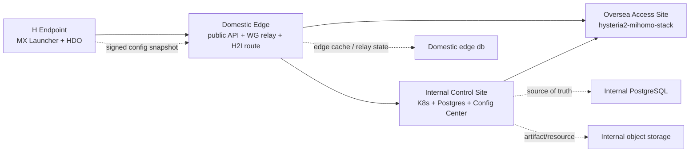
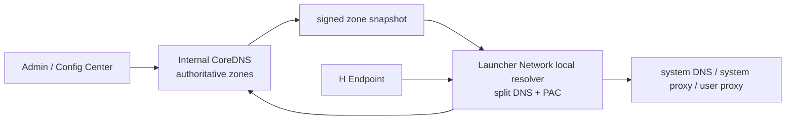
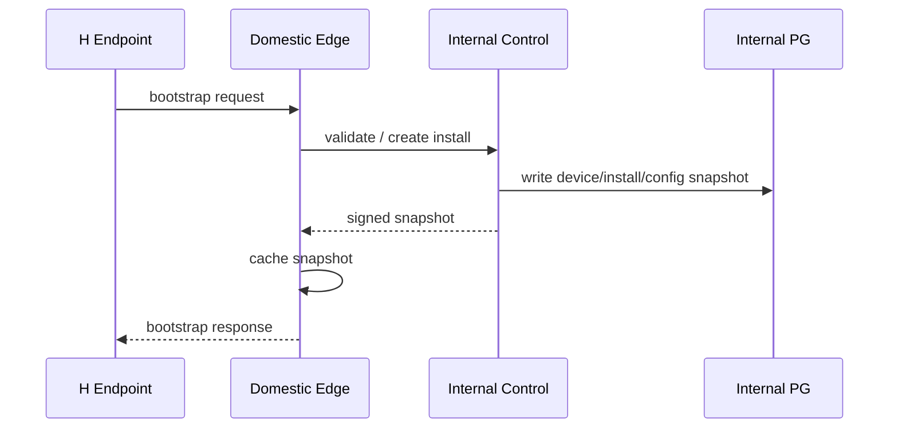
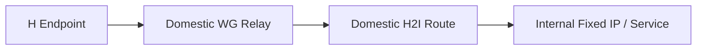
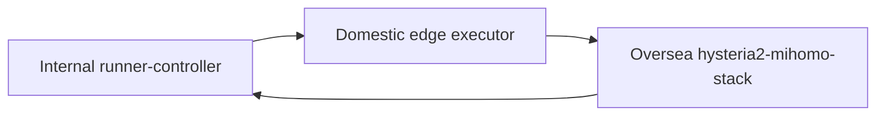

# Launcher Network / HDO Multi-Site Platform Architecture

本文档归档 HDO 在 MX Launcher 平台下的多站点设计。目标是让当前
`electron-server` 单体和远程 runner 能继续工作，同时提前给 Internal K8s、
配置中心、用户中心、权限中心、资源下发和高可用后端留好边界。

Related:

- `06-server-shadow-control-plane.md` describes the
  isolated `H Endpoint -> Domestic Edge -> Internal API -> Internal PostgreSQL`
  shadow architecture.
- `10-mx-3ks-appcenter-launcher-network-h2o-architecture.md` defines MX-3ks,
  AppCenter, Launcher Network, H2O, Domestic minimization, Internal CoreDNS,
  and SDK gateway boundaries.

## 一句话定义

MX Launcher 是企业应用交付、配置、运行状态和权限入口。Launcher Network 是
HDI/H2I 基础网络运行时，迁移期兼容现有 HDO / `electron-demo/hdo` 能力和 `hdo`
legacy product id。H2O 是首个 AppCenter 网络应用，提供类 Clash / Tunnel 的模式和
UI。

HDO 的多站点含义：

- H 端安装 MX Launcher，Launcher Network 建立 HDI/H2I 基础链路，AppCenter 展示
  H2O 和其他应用。
- Domestic 是公网门面、国内 relay 中心、H2I 路由中转和 API proxy。
- Internal 是固定 IP、强硬件、MX-3ks 主控制面和数据主站。
- Oversea 提供 Hysteria2 访问能力，原则上只保留节点能力和运行态，不保存
  平台业务真相。

## 站点职责

### H Endpoint

H 端是安装 MX Launcher 的客户端机器。

职责：

- 安装、更新和启动 MX Launcher。
- 打开 AppCenter，安装应用，并通过 Launcher Network 建立 HDI/H2I 链路。
- 保存本机 install/device 身份。
- 拉取签名后的配置快照和资源清单。
- 建立 WireGuard / H2I / Oversea 访问链路。
- 上报健康状态、版本、连接质量、任务执行结果。

不应该承担：

- 理解后端的 Domestic / Internal / Oversea 拓扑细节。
- 直接拼装复杂 DNS / route / relay 策略。
- 保存长期平台权限或配置真相。

### Domestic Edge

Domestic 当前承担 `electron-server` 后端能力、WireGuard relay、DNS、runner
调度和 H2I 中转。长期定位应收敛为最小 edge：public API proxy、WireGuard
relay、H2I route、snapshot cache 和 observability forwarder。

职责：

- 对 H 端暴露稳定公网入口。
- 作为 WireGuard relay 中心。
- 承担 H2I 路由中转，连通 H 端和 Internal 服务。
- 代理客户端 bootstrap、login、config snapshot、device task 到 Internal。
- 执行 Internal 签名的 relay lease。
- 保存 relay session、边缘健康、短期任务、snapshot cache、审计缓冲。
- 在 Internal 不可达时提供有限离线能力：允许已授权设备继续连接已有配置。

不应该长期保存：

- 用户中心主数据。
- 权限中心主数据。
- 配置中心主版本。
- 产品目录主数据。
- artifact 签名和发布计划主数据。
- 用户名密码登录和 OAuth/JWT 真相。
- DNS 控制面真相。

### Internal Control Site

Internal 是未来平台主站，建议先按 K8s 控制面布局。

职责：

- 用户中心、组织、RBAC、设备身份。
- OAuth、登录、JWT、token introspection 和应用权限。
- AppCenter 后端、应用目录、应用权限、安装实例。
- 产品目录、应用上架、安装实例、版本策略。
- 配置中心、配置版本、灰度策略、资源快照。
- artifact 索引、hash、签名、回滚槽。
- Launcher Network / HDO 控制面，包括 mesh、profile、service、DNS 规则、route
  策略。
- runner-controller 和 site-agent 控制。
- test-center、release gate、synthetic probe 和 evidence。
- Internal CoreDNS authority 和 zone builder。
- PostgreSQL 主库和对象存储主目录。
- 数据大盘、审计查询、运营后台。

Internal 可以先跑同一个仓库、同一套 `./scripts/manage.sh`，但通过 role profile
决定启用哪些模块。

### Internal Site Slot 管理

Domestic 和 Oversea 不再是配置真相源，而是 Internal 的可插拔 site slot：

- Internal 通过 `POST /internal/v1/site-slots/plans` 生成 Domestic/Oversea slot plan。
- slot plan 记录 host、SSH/root 策略、Docker 状态、外网可达性、Oversea 依赖、
  preflight checks、部署阶段和远程命令草案。
- Internal 通过 `POST /internal/v1/site-slots/plans/:planId/preflight` 生成 preflight
  execution manifest，通过 `POST /internal/v1/site-slots/plans/:planId/apply` 生成 apply
  execution manifest。
- apply manifest 需要 `confirmApply=true` 才会进入 ready；未确认时返回
  `requires-confirmation`，用于 Admin 审批、证据复核和变更窗口确认。
- Internal 通过 `POST /internal/v1/site-slots/executions/:runId/runner-sessions` 启动
  Runner V1.1 session。`simulate` 只记录模拟结果；`remote-ssh` 需要服务端
  `SITE_SLOT_RUNNER_REMOTE_EXECUTION_ENABLED` 和请求侧 `confirmRemoteExecution=true` 双门禁。
- Internal 通过 `/runner-sessions/:sessionId/worker-jobs` 生成 Worker Contract V1 job，
  通过 `/worker-jobs/:jobId/reports` 接收 worker/site-agent 回报。job 包含 approval、
  change window、retry、rollback、step timeout、stop-on-failure 和 redaction policy。
- Worker State Machine V1 由 report 驱动：`running` 持续收集 step report，`passed`
  推进 job/session，`failed` 自动生成 rollback plan，`blocked` 保留变更等待人工处理。
- Internal 通过 `/worker-reports/:reportId/rollback-executions` 创建 Rollback Contract V1
  execution，通过 `/rollback-executions/:rollbackExecutionId/reports` 接收恢复证据并推进
  rollback execution 状态；真实执行仍可由 Admin action、runner worker 或 site-agent 完成。
- Admin Management API V1 通过 `/admin/dashboard` 和 `/admin/site-slots/pipelines`
  把 plan、execution、runner、worker report、rollback execution/report 聚合成后台可视化
  流水线，作为后续 Admin UI 的数据入口。
- Domestic slot 默认把 WireGuard、转发、防火墙和必要的 `@qpjoy/tunnel-cli server-on`
  / `egress-on` 放在宿主机；edge API、H2I proxy、snapshot cache、observability
  forwarder 仍优先使用 Docker。公网 Domestic 不应长期 `tun-on`，否则默认路由会接管
  入站服务回程，导致外部访问站点异常。
- Oversea slot 默认接收 Internal 推送的 Docker hysteria2 access stack，mihomo、
  用户、权限和订阅 authority 留在 Internal。Oversea 暴露 `3434` 作为受保护的
  health/evidence outlet，用于 `/healthz` 和 `/clients.csv` 摘要，不作为订阅控制面。
- 如果 Domestic 无外网，Internal 会先提示配置 Oversea，再用 Internal 生成的 Oversea
  hysteria2 订阅和 `@qpjoy/tunnel-cli server-on` 帮 Domestic 做常驻 outbound bootstrap：国内目标按
  `cn-direct` 直连，外网目标经 Oversea；`tun-on` 只保留给非公网主机或短时排障。
- Executor V1 只生成 plan、execution manifest、runner session、worker job 和 worker report，
  不直接 SSH/SCP/root 执行；真实执行后续接 Admin action、runner worker 或 site-agent。

### Oversea Access Site

Oversea 当前核心能力是 Internal 推送的 Docker `hysteria2-access-stack`。

职责：

- 提供 Hysteria2 访问能力。
- 接收 signed snapshot 或 runner job 后生成节点本地配置。
- 通过 `3434` 的 health/evidence outlet 上报节点健康、用户限速和受保护证据摘要。
- 尽量以 site-agent outbound 方式连回控制面，减少 SSH 长连接和公网暴露。

不应该保存：

- 用户中心主数据。
- 配置主数据。
- 权限主数据。
- 长期业务状态。

## 推荐总体架构



核心原则：

- 平台业务真相最终放 Internal。
- Domestic 对外像门面，对内像 edge gateway。
- Oversea 像可替换的访问节点。
- H 端只拿最终配置快照，不理解复杂控制面。
- 所有跨站写入都必须幂等，有 `requestId`、`siteId`、`deviceId`、`version`。

## User Center / Gateway 边界

推荐采用“三层但同仓可运行”的形态：

| 层 | 定位 | 对外稳定性 |
| --- | --- | --- |
| User Center | OAuth、JWT、token introspection、principal context、RBAC、组织和服务账号权威 | 身份协议稳定 |
| Internal Modules | AppCenter、DNS、Release、Test、Audit、Observability 等领域服务 | 内部 API 可按领域演进 |
| SDK Gateway | 给 Launcher、AppCenter 应用和其他系统调用的统一门面与 SDK 契约 | 对接契约最稳定 |

结论：

- 用户中心是认证和授权真相，不承担所有平台 API 聚合。
- 各系统可以保留自己的内部 API，但外部系统优先接 SDK Gateway。
- SDK Gateway 负责统一认证、限流、审计、trace、版本协商和路由聚合。
- Launcher / AppCenter / H2O / 其他系统拿到的是 `mx-sdk` audience 的 token 或服务账号凭证。
- 网关可以把 `/internal/v1/sdk/*` 聚合到 User Center、DNS Control、Audit、
  Observability、Release 等内部模块。
- Domestic 只代理或缓存网关请求，不保存用户、权限或 SDK 契约真相。

当前 V1 shadow 接口：

| API | 使用方 | 含义 |
| --- | --- | --- |
| `POST /internal/v1/user-center/bootstrap` | Internal modules / ops | 幂等初始化默认 tenant、org、roles、demo user 和 SDK service account |
| `GET /internal/v1/user-center/roles` | Internal modules / ops | 查看 RBAC roles 和 scopes |
| `GET /internal/v1/user-center/users` | Internal modules / ops | 查看用户 |
| `POST /internal/v1/user-center/users` | Internal modules / ops | 创建或更新 shadow 用户 |
| `GET /internal/v1/user-center/service-accounts` | Internal modules / ops | 查看服务账号 |
| `POST /internal/v1/user-center/service-accounts` | Internal modules / ops | 创建或更新服务账号 |
| `POST /internal/v1/user-center/tokens/issue` | Internal modules / ops | 为 user 或 service account 签发短期 token，服务端只存 token hash |
| `POST /internal/v1/user-center/token/introspect` | Internal modules | User Center 权威 token introspection |
| `POST /internal/v1/user-center/principal/resolve` | Internal modules | 根据 token/install/user/service account 解析 principal context |
| `GET /internal/v1/sdk/gateway/manifest` | SDK / 外部系统 | 读取统一网关能力、路由和 audience |
| `POST /internal/v1/sdk/identity/introspect` | SDK / 外部系统 | 通过网关使用同一套 token introspection |
| `POST /internal/v1/sdk/identity/context` | SDK / 外部系统 | 通过网关解析调用主体、绑定关系和可用路由 |
| `POST /internal/v1/sdk/gateway/access/evaluate` | SDK / 外部系统 | 判断 token principal 是否允许调用某条 SDK Gateway route |

V1 shadow 仍保留 `mx-shadow-*` token 前缀兼容，但真实路径优先查 User Center token
record。token 明文只在签发响应返回一次，数据库保存 `sha256` hash、subject、
audience、scopes、过期时间和吊销状态。

## 数据归属

### Postgres Schema 建议

当前可以继续用一个 Postgres，但从现在开始按 schema 拆边界。

| Schema | 主站 | 内容 |
| --- | --- | --- |
| `common` | Internal | 租户、组织、公共枚举、站点、设备基础身份 |
| `iam` | Internal | 用户、角色、权限、token、session、SSO 映射 |
| `appcenter` | Internal | 应用目录、上架、权限请求、安装实例 |
| `launcher` | Internal | Launcher install、客户端版本、设备任务、心跳 |
| `config` | Internal | 配置定义、配置值、配置版本、灰度规则、快照 |
| `artifact` | Internal | 包、资源、hash、签名、渠道、回滚槽 |
| `release` | Internal | 发版计划、release notes、灰度、回滚、报告 |
| `hdo` | Internal | mesh、profile、service、DNS 规则、route 策略 |
| `edge` | Domestic | relay session、边缘缓存、离线快照、边缘任务队列 |
| `runner` | Internal | runner job、site-agent、执行结果、远程部署审计 |
| `test` | Internal | E2E、smoke、gate、synthetic probe、evidence |
| `audit` | Internal | 全局审计、操作日志、安全事件 |
| `observability` | Internal | 指标索引、健康摘要、SLO 快照 |

Domestic 当前已有 Postgres 时，可以先把这些 schema 建在 Domestic。迁移到
Internal 时，先迁主库，再把 Domestic 降级为 edge cache/outbox。

### 跨 Schema 查询

Postgres 支持跨 schema join：

```sql
select i.id, u.email, d.overlay_ip
from launcher.installs i
join iam.users u on u.id = i.user_id
join hdo.devices d on d.install_id = i.id;
```

但要遵守边界：

- 单体阶段可以跨 schema 读。
- 业务写入必须走领域服务或 repository，不要直接从 HDO 写 IAM。
- 未来可能独立成服务的 schema，少建跨 schema 强外键。
- 可以用 `id`、事件、只读 view、read model 替代强耦合。

### Domestic 是否直接写 Internal PG

短期可以为了迁移速度，让 Domestic 通过内网/WireGuard 访问 Internal PG，但这
应该是过渡方案。

推荐长期方式：

- H 端请求到 Domestic。
- Domestic 先做边缘鉴权、限流、缓存和 relay 判断。
- 登录、匿名 enroll、权限、配置、发版任务等主数据写入时，Domestic 调 Internal API。
- Internal 写主库并生成事件。
- Internal 生成 signed relay lease 和 config snapshot。
- Domestic 执行 relay lease，并订阅或拉取 edge snapshot。

原因：

- 直接远程写 PG 对网络抖动敏感。
- 跨 WAN 事务和连接池很难稳定。
- 权限边界容易被绕过。
- 未来拆服务时 API 边界更自然。

## 配置中心设计

配置中心应该是平台能力，不属于 HDO 私有后端。

### 配置 Scope

| Scope | 含义 |
| --- | --- |
| `global` | 全局默认 |
| `tenant` | 客户/组织 |
| `site` | Internal / Domestic / Oversea |
| `product` | HDO / Tunnel / future apps |
| `channel` | stable / beta / dev |
| `user` | 用户 |
| `device` | 设备 |
| `install` | 安装实例 |
| `runtime` | 临时运行态 |

### 核心表

| 表 | 用途 |
| --- | --- |
| `config.definitions` | 配置项定义、类型、默认值、敏感性 |
| `config.values` | 不同 scope 的配置值 |
| `config.policies` | 灰度、人群、站点、渠道规则 |
| `config.resources` | yaml、ruleset、证书、公钥、模板资源 |
| `config.versions` | 配置版本 |
| `config.snapshots` | 客户端最终拿到的配置快照 |
| `config.deployments` | 下发记录和回滚状态 |

### 客户端只拿快照

H 端不应该自己合并多层配置。Internal 生成最终配置快照，Domestic 可以缓存。

需要区分两类快照：

- Enrollment config snapshot：匿名 enroll 或 identity link 后返回的轻量安装快照，
  用于 bootstrap install/device、public/internal endpoint、基础 observability。
- Config Center policy snapshot：登录态、AppCenter、Launcher Network、DNS、SDK
  Gateway、release 和权限策略汇总后的最终策略快照，带签名 digest，供 Launcher
  Network、AppCenter、H2O 和 SDK 使用。

2026-06-11 细化：旧 `electron-server` 里的“创建用户即创建订阅 token、Domestic
保存 tunnel account、Domestic mihomo 作为订阅 authority”要迁移到 Internal。新路径是：

1. Home 首次只能访问 Domestic public facade，走匿名 enroll 或登录 enroll。
2. Domestic 只 proxy 到 Internal `/internal/v1/enrollments/anonymous` / identity link，不创建用户、不生成订阅。
3. Internal 分配 Home lease IP：匿名/访客走 `10.91.0.0/16`，登录用户走 `10.89.0.0/16`。
4. Launcher Network 根据快照建立 Domestic WG/H2I 基础链路，Internal 固定在可达路径后，Home 才去 Internal 拉配置和 mihomo 订阅。
5. Internal mihomo/Config Center 生成 Oversea hysteria2 订阅；Home 拿到订阅后，外网流量直接连 Oversea，Internal/Domestic 只负责控制面和内部路径。
6. Domestic slot 只接收 Internal 下发的 WG relay、H2I proxy、API proxy、snapshot cache、observability forwarder 和必要的 Oversea bootstrap subscription。

Internal 没有公网 IP 时的启动顺序：

1. Internal 仍然可以管理公网 Domestic/Oversea，因为 SSH/AWX/API launch 都是 Internal 主动出站到它们的公网 IP。
2. Oversea 可以先部署，主要用于外网 access 和 Domestic 无出站时的 bootstrap egress；但 Oversea 不解决 Home -> Internal。
3. Domestic 必须尽早部署 public relay foundation：public API facade、WG relay、H2I proxy、snapshot cache、observability forwarder。
4. Internal 作为 service peer 主动连到 Domestic public WG relay，拿固定 service IP，建议先用 `10.90.0.10`。这一步让“无公网 Internal”变成“可通过 Domestic relay 到达的 Internal”。
5. Home 未 enroll 前只能走 Domestic public API facade 做匿名 enroll / 登录 / 拿 bootstrap snapshot；这个阶段不是完整 HDI，只是 bootstrap proxy。
6. Home enroll 后拿到 `10.91.0.0/16` 或 `10.89.0.0/16` lease，Launcher Network 建立到 Domestic 的 WG，随后把 Internal 访问模式提升为 `domestic-wg-relay-primary`。
7. Domestic public API facade 保留为 enroll、故障恢复和 snapshot cache fallback，不作为长期 Internal 主通道。

因此：没有 relay 时没有完整 HDI。可以有短暂的 Domestic public facade bootstrap，但稳定态必须切到 WG relay。H2I 是跑在 Domestic relay 路径上的 Internal 应用访问层，不替代 WG relay 本身。

这个模型在 API 中沉淀为 `LauncherNetworkSnapshot.topology.model =
internal-authority-domestic-relay-oversea-access-v1`：

| 字段 | 含义 |
| --- | --- |
| `authority.users/config/mihomo/dns/release` | 全部指向 Internal：User Center、Config Center、Internal mihomo、CoreDNS、Release Center |
| `homePath.bootstrap` | `home-to-domestic-public-enroll-proxy`，Home 未入网前只碰 Domestic 门面 |
| `homePath.afterEnroll` | `home-to-domestic-wg-relay-to-internal`，enroll 后用 Domestic WG/H2I 进入 Internal |
| `homePath.subscriptionFetch` | `home-through-domestic-h2i-to-internal-mihomo`，订阅 authority 仍是 Internal |
| `homePath.overseaTraffic` | `home-direct-to-oversea-hysteria2`，订阅拿到后外网流量直连 Oversea |
| `oversea.healthEvidenceOutlet` | Oversea `3434` 只作为 `/healthz` 和 `/clients.csv` 证据出口，authority 仍是 Internal Config Center |
| `domestic.gatewayIp` | `10.88.0.1`，Domestic 只作为 relay/proxy/cache/forwarder |
| `domestic.storesAuthority` | 固定为 `false`，禁止把用户、订阅、权限真相放回 Domestic |
| `subscriptions.mihomo.fallback` | `domestic-snapshot-cache`，只允许缓存 Internal 签名快照 |
| `relayPlan.domesticRelay` | Domestic WG relay 的执行目标：`mx-domestic`、`10.88.0.1`、`51280`、`mx-domestic-wg-relay.conf` |
| `relayPlan.internalServicePeer` | Internal 无公网 IP 时的固定 service peer：`10.90.0.10`，配置文件 `mx-internal-service-peer.conf` 只在 Internal 使用 |
| `relayPlan.homePeer` | Home enroll 后的 Internal 签名 relay lease：guest 用 `10.91.0.0/16`，user 用 `10.89.0.0/16`，真实 peer append 前必须有 Home WG public key |
| `relayPlan.gates` | 明确禁止把 Internal private key 下发到 Domestic；未建立 lease 前 Domestic public facade 只做 bootstrap/fallback |

Admin/Worker 层先用 `site-slot.worker-run.domestic-relay-peer-plan` 固化这个边界：
它只记录 plan-only worker report，验证 Home `publicKey`、`leaseIp`、`10.89/10.91`
网段和 Domestic-only 约束，并生成将来真实执行用的 `wg set mx-domestic peer ... allowed-ips ...`
命令证据。这个动作不打开 SSH、不调用 AWX、不写 `/etc/wireguard`，也不会把
`mx-internal-service-peer.conf` 或 Internal private key 推到 Domestic。

真实 peer append 前先走 `site-slot.worker-run.domestic-relay-readonly-probe`：
Admin 只返回只读 SSH handoff，检查 `wg show mx-domestic`、`ip route get 10.90.0.10`、
`wg-quick@mx-domestic` 状态，以及 Domestic 上不得存在
`/etc/wireguard/mx-internal-service-peer.conf`。这个 probe 不生成 worker report，
也不执行 SSH；它是后续 gated real append 的前置证据。

只读 probe 和 plan-only report 都被审阅后，Admin 才暴露
`site-slot.worker-run.domestic-relay-peer-append`。这个动作返回 gated SSH handoff：
`wg set mx-domestic peer <home-public-key> allowed-ips <lease-ip>/32`，并要求
`confirmRelayPeerAppend`、`confirmRelayReadOnlyProbeReviewed`、
`confirmRelayPeerPlanReviewed` 三个确认字段。Internal API 仍不执行 SSH/AWX、不生成
worker report；默认真实执行由 AWX 接同一条 command 完成，SSH worker 只保留为
break-glass fallback。命令执行前仍会检查 Domestic 上不存在
`mx-internal-service-peer.conf`，确保 Internal private key 不会被复制到 Domestic。

默认 AWX 执行前，Admin 先调用
`site-slot.domestic-relay-peer-append-awx.prepare`，从已确认的 Domestic apply execution
创建 `awx-shadow` runner session 和 `awx-runner` worker job。这个 prepare 动作只排队和
记录 gates：要求 `confirmAwxLaunchPrepare`，可记录 approval/change window，但不调用
AWX launch、不执行 SSH、不写 worker report。之后同一个 job 先走 Domestic readonly probe
和 peer append handoff，再通过 `site-slot.worker-run.awx-sync-plan` 生成 AWX organization /
project / inventory / host / credential / job template 的 plan-only 清单。Sync Plan
只做 Internal 证据和 gate，不修改 AWX。清单 ready 后，先由
`site-slot.worker-run.awx-credential-sync` 在 `AWX_API_CREDENTIAL_SYNC_ENABLED=true`、
`confirmAwxCredentialSync=true` 和 AWX token 都满足时，把 Internal 管理的 SSH Profile
受控同步为 AWX Machine Credential；这个动作会读取 SSH Profile 的 `identityFile`，
但返回证据只保留 profile、credential 名称和操作摘要，不回显私钥内容。随后
`site-slot.worker-run.awx-object-sync` 在 `AWX_API_OBJECT_SYNC_ENABLED=true`、
`confirmAwxSync=true` 和 AWX token 都满足时，才会调用 AWX API 创建/更新
organization、project、inventory、host 和 job template，并引用已同步的 Machine
Credential。对象同步完成后才通过 `site-slot.worker-run.awx-launch` 进入 AWX API launch。

SSH fallback 仍可调用
`site-slot.domestic-relay-peer-append-ssh.prepare`，从已确认的 Domestic apply execution
创建 `remote-ssh` runner session 和 worker job。这个 prepare 动作只排队和记录 gates：
要求 `confirmRemoteExecution`、`confirmRelayPeerAppendSshPrepare`、`approvalId` 和
change window；默认 shadow 下如果 `SITE_SLOT_RUNNER_REMOTE_EXECUTION_ENABLED` 未开启，
它会返回 blocked runner session 且不会创建 job，也不会触发 SSH/AWX。

真实 SSH 执行入口是 `site-slot.worker-run.domestic-relay-peer-append-ssh`。它复用
remote SSH gate，并额外要求 `confirmRemoteExecution` 和
`confirmRelayPeerAppendSsh`。只要 job 不是 `remote-ssh`、缺 managed SSH profile、缺
identity/known_hosts，或远程执行 env gate 未开启，该动作都会返回 `blocked`，不打开
SSH、不写 worker report。只有 Internal operator 显式开启远程执行 gate，并使用带 SSH
profile 的 remote worker job 后，它才会执行同一条 `wg set` 命令，并把 stdout/stderr、
diagnosis、tcp probe 和 post-append evidence 记录到 worker report。

```json
{
  "snapshotId": "cfgsnap_...",
  "productId": "hdo",
  "installId": "inst_...",
  "siteId": "domestic-main",
  "version": 42,
  "expiresAt": "2026-06-06T12:00:00Z",
  "config": {
    "serverBaseUrl": "https://d.example.com",
    "defaultMode": "visitor",
    "relayMode": "h2i",
    "launcherNetwork": {
      "model": "internal-authority-domestic-relay-oversea-access-v1",
      "bootstrap": {
        "hdiWithoutRelay": "bootstrap-proxy-only",
        "steadyStateAccess": "domestic-wg-relay-primary"
      },
      "homeLease": {
        "mode": "guest",
        "ip": "10.91.x.y",
        "cidr": "10.91.0.0/16"
      },
      "domestic": {
        "siteId": "domestic-main",
        "gatewayIp": "10.88.0.1",
        "storesAuthority": false
      },
      "internal": {
        "publicIngress": false,
        "relayPeer": {
          "fixedIp": "10.90.0.10",
          "initiatedBy": "internal-outbound-to-domestic-public-wg"
        },
        "enrollUrl": "https://internal.example.com/internal/v1/enrollments/anonymous",
        "mihomoSubscriptionBaseUrl": "https://internal.example.com/internal/v1/site-slots/oversea-main/subscriptions/hysteria2"
      },
      "oversea": {
        "siteId": "oversea-main",
        "trafficPath": "direct-after-subscription",
        "healthEvidenceOutlet": {
          "baseUrl": "http://oversea.example.com:3434",
          "healthPath": "/healthz",
          "evidencePath": "/clients.csv",
          "authority": "internal-config-center",
          "purpose": "health-and-evidence"
        }
      }
    }
  },
  "resources": [
    {
      "kind": "mihomo-yaml",
      "url": "https://d.example.com/resources/...",
      "sha256": "..."
    }
  ],
  "signatures": {
    "manifest": "...",
    "issuer": "mx-config"
  }
}
```

V1 shadow policy snapshot 聚合：

| 字段 | 内容 |
| --- | --- |
| `principal` | anonymous / user / service-account 主体、roles、scopes |
| `policies.app` | AppCenter 应用 manifest |
| `policies.permissionPolicy` | 应用声明权限，默认仍需要 AppCenter grant |
| `policies.launcherNetwork` | guest/user overlay、WG、DNS/PAC/TUN 能力 |
| `policies.dns` | split DNS policy、fallback 顺序、Internal reverse proxy routes |
| `policies.sdkGateway` | SDK Gateway manifest、routes、audience |
| `policies.release` | Launcher 与 app 的更新/跳过/门禁策略 |
| `policies.observability` | 日志/指标上报 sinks |
| `signatures` | `sha256-dev-digest`，后续替换为正式签名 |

当前 API：

| API | 使用方 | 含义 |
| --- | --- | --- |
| `POST /internal/v1/config-center/snapshots/effective` | Internal / Admin / Launcher | 发行有效 policy snapshot |
| `GET /internal/v1/config-center/snapshots/:snapshotId` | Internal / Admin | 读取已发行 policy snapshot |
| `POST /internal/v1/sdk/config/snapshot` | SDK Gateway / 外部系统 | 通过 SDK 稳定面发行 policy snapshot |

## DNS 和 PAC 设计

CoreDNS 可以放到 Internal K8s，并且这应该是目标控制面。Domestic 不必保存 DNS
真相。

推荐拆成三层：

- Internal CoreDNS / zone builder: 权威控制面，管理 internal zones、service
  discovery、HDI service 记录和 zone snapshot。
- Config Center DNS policy: 下发 split DNS 白名单、fallback、优先级和版本。
- Launcher Network local resolver / PAC: H 端运行时根据 snapshot 决定哪些域名走
  HDI，哪些走系统 DNS、系统代理或其他代理。

DNS policy 是“哪些域名命中 Internal、fallback 顺序是什么”；DNS zone snapshot 是
“给 Internal CoreDNS/同步器的配置产物”。V1 shadow 先生成签名 zone snapshot，包含
zoneNames、records、Corefile 片段、reverse proxy routes、fallbackOrder 和 digest；
再渲染 `mx-dns/coredns` ConfigMap manifest。当前 shadow sync 只记录 dry-run 或
shadow-apply 结果，不直接调用 Kubernetes API；真实写入走 Internal/Admin 专用的
CoreDNS apply API，并受 ServiceAccount RBAC、目标白名单和 `confirmApply=true` 保护。



落地建议：

- Internal K8s 先跑 CoreDNS authority 和 zone builder。
- Launcher Network 从 signed snapshot 读取 split DNS 和 PAC policy。
- 命中后台白名单的域名优先走 HDI/H2I 到 Internal CoreDNS。
- 未命中白名单的域名走系统 DNS、系统代理、浏览器代理或 Clash/mihomo 等已有配置。
- DNS policy 通过统一 API 暴露给 Launcher Network、H2O 和 SDK Gateway：
  `/internal/v1/dns/*` 面向平台控制面，`/internal/v1/sdk/dns/*` 面向外部系统。
- Zone snapshot API：`POST /internal/v1/dns/zones/build` 给 Internal/Admin 使用，
  `POST /internal/v1/sdk/dns/zone` 给 SDK Gateway 使用，
  `GET /internal/v1/dns/zones/:snapshotId` 读取已生成快照。
- CoreDNS ConfigMap sync API：
  `POST /internal/v1/dns/coredns/configmap/sync` 给 Internal/Admin 使用，
  `POST /internal/v1/sdk/dns/coredns-configmap` 给 SDK Gateway 使用。V1 shadow 只渲染
  manifest 并记录 sync result。
- CoreDNS ConfigMap apply API：
  `POST /internal/v1/dns/coredns/configmap/apply` 只给 Internal/Admin 使用；它不会挂到
  SDK Gateway。K8s shadow 中 Internal API 使用 `mx-launcher-internal` ServiceAccount
  更新预创建的 `mx-dns/coredns` ConfigMap，RBAC 只允许 get/update/patch 这个对象。
- 命中 Internal 的域名可以选择性进入 Internal reverse proxy route，例如
  `gateway.internal.mx` 反代到 Internal API/Gateway；反代规则仍由 Internal 管理。
- Domestic DNS Edge 只作为可选 `dns-edge-cache`，用于 Internal 短暂不可达时的
  降级能力，不作为默认必需模块。
- DNS 配置进入 `config.resources`，和 Launcher/AppCenter/HDI 配置一起版本化、
  审计、回滚。

## Release / E2E Gate 管理面

Internal 已经有 Release Center 和 Test Center 的 V1 管理面聚合能力：

- `POST /internal/v1/release-management/plans` 创建一次 release management plan。
- plan 聚合 Launcher 平台更新策略、AppCenter 应用更新策略、HDOI E2E test run、
  gate verdict、rollback 要求和下一步动作。
- `e2eResult=running` 时 plan 默认阻断；shadow smoke 可以显式传 `passed` 来验证 gate
  通过后的推进状态。
- `readyToPromote=true` 只表示管理面允许进入 shadow/canary rollout，不代表已经执行
  rollout。真实执行仍应进入 Deploy Center / Runner / site-agent contract。

这一步应该先于 Domestic thin relay/proxy 接入，因为 Domestic 接入后也需要这套
Release/Test/Gate 管理面约束它能不能接收配置、发布和站点执行任务。

## Runner 和站点 Agent

现状是 Domestic 跑远程 runner，在 Oversea 部署
`docker/hysteria2-mihomo-stack`。这个模式可以保留，但需要抽象成平台能力。

推荐演进：

1. 当前：Domestic runner 通过 SSH/脚本管理 Oversea。
2. 下一步：Internal 生成 runner job，Domestic 作为 edge executor 执行。
3. 长期：每个站点运行 site-agent，主动 outbound 拉取 job，执行后回报。

Job 模型：

```json
{
  "jobId": "job_...",
  "siteId": "oversea-sg-1",
  "target": "hysteria2-mihomo-stack",
  "action": "reconcile",
  "desiredVersion": "2026.06.06-1",
  "snapshotSha256": "...",
  "requestId": "req_...",
  "issuedBy": "internal-control",
  "createdAt": "2026-06-06T12:00:00Z"
}
```

站点 agent 的好处：

- Oversea 不需要开放 SSH 给 Domestic。
- 断线后能重试和幂等恢复。
- 同一套 job contract 可以管理 Domestic、Oversea、Internal worker。
- 所有执行结果进入 `runner.jobs` 和 `audit.events`。

## Internal K8s 布局

Internal 硬件强，适合先做控制面 K8s。第一版可以是单节点或小集群，但要承认：
单节点 K8s 提升运维一致性，不等于真正高可用。真正 HA 需要多节点、备份、恢复
演练和边缘降级。

### Namespace

| Namespace | 内容 |
| --- | --- |
| `mx-ingress` | ingress controller、TLS、入口策略 |
| `mx-control` | `mx-launcher/server` control services |
| `mx-appcenter` | AppCenter backend、应用目录、安装实例、权限请求 |
| `mx-user` | OAuth、JWT、RBAC、组织、服务账号 |
| `mx-config` | config center、resource builder、snapshot signer |
| `mx-artifact` | artifact index、资源服务 |
| `mx-release` | release center、release notes、灰度、回滚 |
| `mx-test` | test-center、E2E、synthetic probe、gate、evidence |
| `mx-runner` | runner-controller、site-agent coordinator |
| `mx-dns` | Internal CoreDNS、zone builder |
| `mx-data` | Postgres、Redis、object storage，或外部数据服务的连接配置 |
| `mx-observability` | logs、metrics、traces、alerts |

### 服务拆分顺序

不要一开始就强拆微服务。先模块化单体，后拆高价值边界。

1. 当前 `electron-server` 作为 legacy/current production monolith 保持稳定。
2. `mx-launcher/server` 作为新平台后端承接配置、发版、runner、审计和多站点控制面。
3. 抽 `config-service`，因为配置快照是 Launcher 稳定性的核心。
4. 抽 `artifact-service`，因为签名、hash、回滚要独立可信。
5. 抽 `runner-service`，统一 Domestic/Oversea/Internal 执行。
6. 抽 `iam-service`，承接用户中心和权限中心。
7. Launcher Network runtime/control 独立成 `launcher-network-control-service`，
   legacy HDO 适配保留为 `hdo-compat`。

## 仓库和脚本布局

可以保持只在 Internal 拉这个仓库，并用 `./scripts/manage.sh` 管理全部角色。

建议增加 role profile：

```text
deploy/sites/internal/site.yaml
deploy/sites/domestic/site.yaml
deploy/sites/oversea-sg-1/site.yaml
deploy/sites/h-endpoint-dev/site.yaml
```

示例命令：

```bash
./scripts/manage.sh site status
./scripts/manage.sh internal deploy-control
./scripts/manage.sh internal k8s apply
./scripts/manage.sh domestic deploy-edge
./scripts/manage.sh domestic relay status
./scripts/manage.sh oversea deploy-access --site oversea-sg-1
./scripts/manage.sh runner reconcile --site oversea-sg-1
./scripts/manage.sh config publish --product hdo --channel stable
```

脚本原则：

- 脚本只读非敏感 inventory。
- secret 放 `.env`、K8s Secret、SOPS/age 或部署机密钥管理，不进 git。
- 所有脚本动作都写审计。
- 所有远程变更先生成 plan，再执行 apply。
- 同一 action 可以被后台按钮调用，也可以被 CLI 调用。

## 网络流量

### Enrollment / Bootstrap



Internal 不可达时：

- 新设备不 enroll。
- 已设备可以拿 Domestic 缓存的未过期快照。
- 管理后台提示控制面降级。

### H2I



Domestic 是运行时数据面的关键点，所以 Domestic 需要轻量但可靠：

- relay health check。
- route table reconciliation。
- session metrics。
- config snapshot cache。
- 本地 emergency rollback。

### Oversea Access



长期可以改为：


## API 契约方向

所有 API 都要区分 control truth 和 edge cache。

建议保留：

- `/api/v1/hdo/*`: HDO legacy 兼容 API。
- `/api/v1/mx-launcher/*`: Launcher 平台 API。

新增方向：

| API | 用途 |
| --- | --- |
| `/api/v1/sites` | 站点注册、能力、健康 |
| `/api/v1/sites/:id/snapshots` | 站点配置快照 |
| `/api/v1/config/products/:productId/snapshots` | 产品最终配置快照 |
| `/api/v1/runner/jobs` | 远程执行任务 |
| `/api/v1/edge/heartbeat` | Domestic/Oversea agent 心跳 |
| `/api/v1/artifacts/:id/manifest` | artifact 清单、hash、签名 |

所有写 API 要求：

- `requestId` 幂等。
- `actorId` 和 `siteId`。
- 审计事件。
- 版本号或 ETag 防并发覆盖。
- 签名或 mTLS，尤其是 site-agent 和 runner。

## 高可用和故障模型

| 故障 | 期望行为 |
| --- | --- |
| Internal 短暂不可达 | Domestic 继续 relay，H 端使用缓存快照，禁止新 enroll 和配置变更 |
| Domestic 故障 | H 端进入重连和备用 Domestic；Internal 管理后台标记 edge down |
| Oversea 故障 | 只影响 oversea access，H2I 和 Internal 服务不受影响 |
| 配置发布错误 | Launcher 校验签名/hash，服务端可回滚 snapshot version |
| runner 执行失败 | job 保留失败状态，可重试，不能部分覆盖未知版本 |
| DNS 同步失败 | Domestic DNS Edge 使用最后有效 zone snapshot，并告警 |

## 现在就可以开始的布局

### Phase A: 单体内定边界

- 在当前 Postgres 中建立 `common/iam/launcher/config/artifact/hdo/edge/runner/audit` schema。
- `mx-launcher/server` 内部按 domain service/repository 拆，不再把新能力塞进 HDO。
- 所有表加 `site_id`、`created_at`、`updated_at`、必要的 `version`。
- 新增 `sites` 概念：`internal-main`、`domestic-main`、`oversea-*`。
- HDO 配置进入 `config.definitions` 和 `config.snapshots`。

### Phase B: Internal K8s 实验环境

- Internal 拉同一个仓库。
- `./scripts/manage.sh internal deploy-control` 部署控制面。
- Postgres 先作为 Internal 主库候选，做好备份和恢复演练。
- Internal 跑 CoreDNS zone builder，但 Domestic DNS 继续服务 H 端。

### Phase C: 主库迁移

- 将 Domestic PG 全量迁移到 Internal PG。
- Domestic 改为 edge cache/outbox。
- Domestic 写主数据改为调用 Internal API。
- 配置快照和 DNS zone snapshot 由 Internal 生成，Domestic 缓存。

### Phase D: Runner 平台化

- Domestic runner 抽象为 `runner.jobs`。
- Oversea 从 SSH 脚本逐步改为 site-agent outbound。
- `docker/hysteria2-mihomo-stack/manage.sh` 保留为节点本地执行器。

### Phase E: 多 Domestic / 多 Oversea

- 支持多个 Domestic relay。
- 支持多个 Oversea access node。
- H 端 snapshot 中携带 primary/backup edge。
- 后台按 site 维度展示健康、流量、任务、DNS、版本。

## 决策建议

当前阶段建议：

1. 不急着把所有东西拆成微服务。
2. 先把数据 schema、API contract、site role、config snapshot 定义好。
3. Internal 可以现在开始作为未来主站布局。
4. Domestic 继续承担公网门面和 relay，但不要继续扩张为业务主站。
5. DNS 控制面可以放 Internal K8s CoreDNS；H 端运行时由 Launcher Network 做 split
   DNS/PAC，Domestic DNS Edge 只作为可选缓存。
6. Oversea 只保留访问能力和本地运行态，不承载平台主数据。

这个设计能兼容当前代码和部署习惯，也能逐步演进到：

- Internal: control plane + data plane of truth。
- Domestic: edge facade + relay + H2I route。
- Oversea: access capability node。
- H Endpoint: stable Launcher client with signed snapshots。
