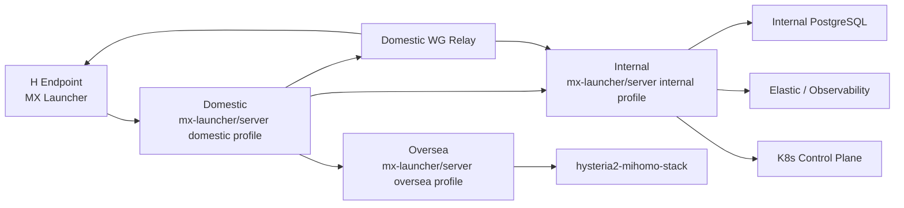
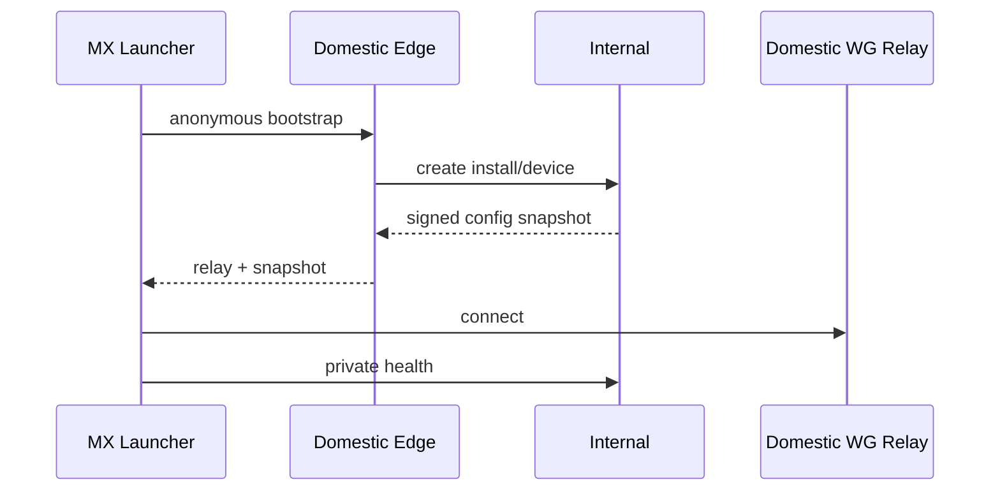
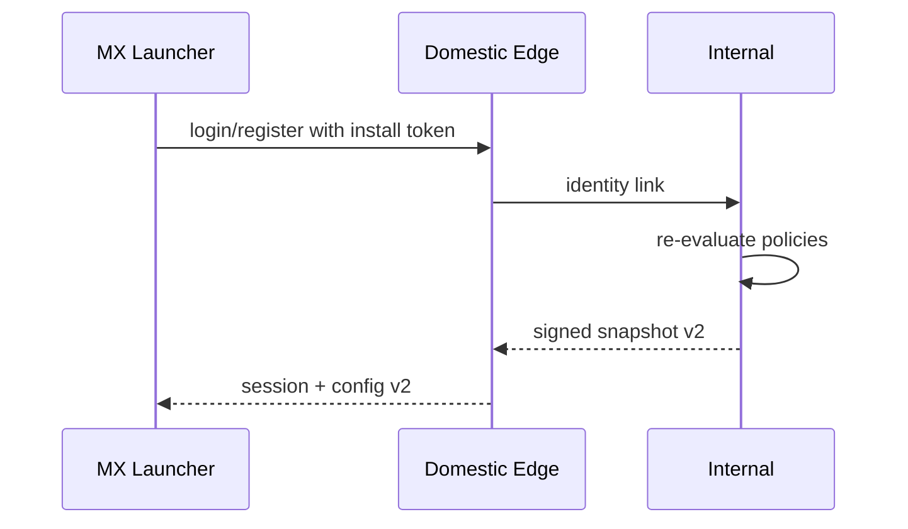

# MX Launcher End-to-End Delivery Blueprint

本文档描述另起炉灶后的完整交付目标：D、I、O 三类服务器上只放
`electron-dock/mx-launcher` 目录，也能搭好服务端、部署网络、打包客户端、迁移旧数据、
上线管理后台、完成运维操作，甚至把销售演示包放进 U 盘带给客户。

这里的 `mx-launcher` 不是单一桌面客户端，而是统一 Launcher 解决方案；其中
`server/` 是平台后端；Internal K8s 形态称为 MX-3ks：

- Internal 启动全量或大部分控制面。
- Domestic 启动轻量 edge/relay/H2I proxy/cache/observability 组合，runner-edge
  和 dns-edge-cache 作为兼容可选模块。
- Oversea 启动 access/site-agent/runner-worker 组合。
- H 端使用 MX Launcher 客户端，不直接运行服务端。

## 最终交付形态

```text
electron-dock/mx-launcher/
  desktop/               # 桌面端市场和产品启动器
  server/                # 平台 API / control-plane
  app-center/            # AppCenter UI/backend contracts and protocol specs
  admin/                 # 后台管理前端，服务端内置或独立构建
  deploy/                # site profiles, compose, k8s manifests
  docs/                  # 架构、runbook、客户交付说明
  kits/                  # 离线交付包，客户端安装包，依赖包，迁移工具
  migrations/            # Internal PG schema and data migration
  scripts/manage.sh      # 运维统一入口
  services/              # module implementations
  site-agent/            # Domestic/Oversea 站点 agent
  test-center/           # 自动化测试、在线 E2E、证据和发布门禁
  desktop/products/      # 桌面端 H2O、legacy HDO 和未来产品 manifests/resources
```

当前仓库还没有完全拆成上述结构，但所有设计都应朝这个交付形态演进。目标是：

- 运维拿到 `electron-dock/mx-launcher`，能按 role 启动 Internal/Domestic/Oversea。
- 运营打开管理后台，能看到用户、设备、AppCenter、配置、发版、测试、日志、runner、网络拓扑。
- 销售拿 U 盘，能用离线 demo 包安装 MX Launcher，演示 Launcher Network、H2O
  和后台大盘。
- 开发只维护一套平台后端，不再让 `electron-server` 和新架构长期双写分叉。

## CLI 决策

当前仓库已有：

- npm package: `@qpjoy/tunnel-cli`
- binary: `qp-tunnel-cli`

后续继续沿用这个包，不新增 `@qpjoy/qp-tunnel-cli`。新架构需要的命令直接加到
`qp-tunnel-cli` 里，旧 `hdo enroll` 保留兼容。

建议新增命令：

```bash
qp-tunnel-cli mx site enroll \
  --role internal \
  --server-url https://domestic.example.com \
  --site-id internal-main \
  --label "Internal I"

qp-tunnel-cli mx site enroll \
  --role domestic \
  --internal-url https://10.70.0.2:8443 \
  --site-id domestic-main

qp-tunnel-cli mx site enroll \
  --role oversea \
  --internal-url https://10.70.0.2:8443 \
  --site-id oversea-sg-1

qp-tunnel-cli mx site status
qp-tunnel-cli mx site refresh
qp-tunnel-cli mx site down
```

命令原则：

- `qp-tunnel-cli hdo enroll` 继续服务旧 HDO 设备和当前 Internal enroll。
- `qp-tunnel-cli mx site enroll` 服务新 D/I/O 站点注册。
- 站点注册结果写入 `mx-launcher/server` 的 site registry。
- 站点拿到 signed site snapshot 后再启动对应 profile。

## 站点角色

| Site | Role | 默认模块 | 资源建议 |
| --- | --- | --- | --- |
| Internal | `internal` | IAM/User Center、AppCenter、配置中心、deploy-center、发版、artifact、runner-controller、test-center、audit、observability、SDK Gateway、Launcher Network control、HDO compat、DNS control、Postgres、Elastic、K8s | 强硬件，主控 |
| Domestic | `domestic` | edge-api、relay-facade、H2I proxy、snapshot-cache、observability-forwarder；runner-edge 和 dns-edge-cache 可选 | 4G 内存可用，轻量中转 |
| Oversea | `oversea` | access-node、site-agent、runner-worker、observability-forwarder、hysteria2-mihomo adapter | 小节点 |
| H Endpoint | client | MX Launcher + Launcher Network + AppCenter + H2O | 用户电脑 |

Domestic 只有 4G 内存也够做中转，前提是：

- 不跑 Elastic。
- 不跑 K8s 控制面。
- 不跑 Postgres 主库。
- 不跑重型 analytics。
- runner 限制并发，重任务交给 Internal 或 Oversea site-agent。

## 网络目标



关键链路：

- H 首次安装走 Domestic 公网入口。
- Domestic 分配或代理 WG relay，H 获得 overlay IP。
- Internal 作为 peer server 获得固定 overlay IP。
- H 连上 WG 后，可以访问 Internal private API。
- Domestic 始终保留 bootstrap/fallback 能力。
- Oversea 继续提供 Hysteria2 访问能力。

## 从零搭建顺序

### Stage 0: 准备离线/在线交付包

目标是 D/O/I 上只有 `electron-dock/mx-launcher` 目录也能部署。

交付包应包含：

```text
kits/
  server/
    mx-launcher-server-image.tar
    postgres-image.tar
    redis-image.tar
    elastic-image.tar
    kibana-image.tar
    otel-collector-image.tar
    coredns-image.tar
  client/
    MX-Launcher-windows-x64.exe
    MX-Launcher-macos-arm64.dmg
    MX-Launcher-macos-x64.dmg
    mx-launcher.package-manifest.json
  cli/
    qp-tunnel-cli.tgz
    node-runtime/
  oversea/
    hysteria2-mihomo-stack.tar
    compose-images.tar
  docs/
    sales-demo.pdf
    operator-runbook.pdf
```

目标命令：

```bash
./scripts/manage.sh kit build --channel stable
./scripts/manage.sh kit export --target ./dist/mx-sales-usb
./scripts/manage.sh kit verify ./dist/mx-sales-usb
```

### Stage 1: Internal 主控站

Internal 是主数据和主控制面。

目标命令：

```bash
cd electron-dock/mx-launcher
cp server/.env.example server/.env.internal
./scripts/manage.sh doctor --role internal
./scripts/manage.sh internal init
./scripts/manage.sh internal up
./scripts/manage.sh internal bootstrap-admin
./scripts/manage.sh internal status
```

Internal 初始化内容：

- 创建 Internal PG。
- 执行 schema migration。
- 初始化 `common.sites`：
  - `internal-main`
  - `domestic-main`
  - `oversea-*`
- 初始化 admin 用户。
- 初始化 User Center、OAuth/JWT、RBAC。
- 初始化 AppCenter 应用目录和 H2O 内置应用。
- 初始化配置中心。
- 初始化 artifact channel。
- 初始化 audit 和 observability。
- 初始化 test-center 和基础 gate。
- 初始化 Launcher Network/H2O product definition，并保留 legacy HDO compatibility metadata。
- 生成 Internal site token 和 mTLS 证书。

Internal profile env：

```env
MX_ENVIRONMENT=prod
MX_SITE_ID=internal-main
MX_SITE_ROLE=internal
MX_ENABLED_MODULES=
DATABASE_URL=postgres://...
ELASTIC_URL=https://elastic.internal:9200
ARTIFACT_BASE_URL=https://artifact.internal
CONFIG_SIGNING_KEY_REF=secret://mx/config-prod
```

### Stage 2: Internal enroll 到 HDO 网络

Internal 需要作为固定 IP peer server 对 H 提供 private API。

现有命令使用 `@qpjoy/tunnel-cli`：

```bash
npm i -g @qpjoy/tunnel-cli
HDO_PASSWORD='...' qp-tunnel-cli hdo enroll \
  --server-url https://domestic.example.com \
  --username internal-i \
  --label 'Internal I' \
  --direct-listener \
  --public-endpoint internal.example.com:443
```

新架构目标是由 `mx-launcher/server` 管理这个过程：

```bash
./scripts/manage.sh internal enroll-hdo \
  --domestic-url https://domestic.example.com \
  --username internal-i \
  --label "Internal I" \
  --direct-listener \
  --public-endpoint internal.example.com:443
```

底层可以调用新的 `qp-tunnel-cli mx site enroll --role internal`，也可以在过渡期调用
旧的 `qp-tunnel-cli hdo enroll`。差异在于：新命令会额外注册 site capabilities、
profile、日志 sink、runner token 和 Internal private API endpoint。

enroll 后写入 Internal PG：

- Internal device identity。
- Internal overlay IP。
- Internal private API endpoint。
- Internal peer capabilities。
- audit event: `site.internal.enrolled`。

重要原则：

- 旧 Domestic 用户和设备还在 Domestic 时，Internal enroll 可以先通过旧 API 拿配置。
- 数据迁移后，Internal 应由自己的配置中心生成配置。
- Domestic 只保留 relay 和 fallback，不再作为用户中心真相。

### Stage 3: Domestic 轻量 Edge

Domestic 不替换线上 `electron-server`，先并行启动 `mx-launcher/server` domestic
profile。

目标命令：

```bash
cd electron-dock/mx-launcher
cp server/.env.example server/.env.domestic
./scripts/manage.sh doctor --role domestic
./scripts/manage.sh domestic init
./scripts/manage.sh domestic up
./scripts/manage.sh domestic register --internal-url https://10.70.0.2:8443
./scripts/manage.sh domestic relay status
```

Domestic profile env：

```env
MX_ENVIRONMENT=prod
MX_SITE_ID=domestic-main
MX_SITE_ROLE=domestic
MX_ENABLED_MODULES=edge-api,relay-facade,h2i-proxy,snapshot-cache,observability-forwarder
INTERNAL_API_BASE_URL=https://10.70.0.2:8443
WG_RELAY_PROFILE=prod
EDGE_CACHE_DRIVER=sqlite
RUNNER_CONCURRENCY=1
```

Domestic 启动内容：

- public bootstrap API。
- relay facade。
- signed snapshot cache。
- edge outbox。
- 可选 DNS edge cache。
- 可选 runner-edge compatibility adapter。
- log forwarder。

Domestic 不启动：

- Elastic。
- Internal PG 主库。
- K8s。
- 全量管理后台分析任务。

Domestic outbound policy：

- 公网 Domestic 服务器默认使用 `qp-tunnel-cli server-on` / `egress-on`，让 mihomo
  作为常驻本地 outbound proxy，并写入 shell、SSH、Docker/containerd/buildkit proxy
  drop-in。
- 不在公网 Domestic 长期使用 `tun-on`。TUN 会改写默认路由，容易让网站/API/WG relay
  的入站连接回程走代理，外部访问会变得不可预测。
- 必须临时 `tun-on` 时，`qp-tunnel-cli` 现在默认关闭 Linux `auto-redirect`，并把私网、
  100.* mesh、当前 SSH client 加入 `route-exclude-address`；已知公网入口来源需要通过
  `MIHOMO_TUN_ROUTE_EXCLUDE_ADDRESS` 或
  `/etc/mihomo-client/tun-route-exclude-addresses.txt` 显式加入。
- Oversea 的 `hysteria2-mihomo-stack` 继续生成 `cn-direct` 订阅；Domestic 消费该订阅后，
  国内目标直连，外网目标经 Oversea。需要全局 TUN 时，只用于非公网机器、临时 bootstrap
  或后续带 policy routing/route exclude 的专门模式。

### Stage 4: Oversea Access

Oversea 继续围绕 `hysteria2-mihomo-stack`。

目标命令：

```bash
cd electron-dock/mx-launcher
cp server/.env.example server/.env.oversea
./scripts/manage.sh doctor --role oversea
./scripts/manage.sh oversea init --site oversea-sg-1
./scripts/manage.sh oversea up
./scripts/manage.sh oversea install-hysteria2-mihomo
./scripts/manage.sh oversea register --internal-url https://10.70.0.2:8443
./scripts/manage.sh oversea status
```

Oversea profile env：

```env
MX_ENVIRONMENT=prod
MX_SITE_ID=oversea-sg-1
MX_SITE_ROLE=oversea
MX_ENABLED_MODULES=access-node,site-agent,runner-worker,observability-forwarder
LOCAL_STACK_PATH=/opt/mx/mx-launcher/runtime/hysteria2-mihomo-stack
RUNNER_DRY_RUN_DEFAULT=0
```

Oversea 安装内容：

- site-agent。
- runner-worker。
- hysteria2-mihomo adapter。
- local observability forwarder。
- local stack state cache。

`docker/hysteria2-mihomo-stack/manage.sh` 的能力应被封装进
`mx-launcher/server` 的 runner job：

| 旧命令 | 新 runner action |
| --- | --- |
| `setup` | `oversea.stack.setup` |
| `reconfigure` | `oversea.stack.reconfigure` |
| `add-user` | `oversea.user.add` |
| `del-user` | `oversea.user.delete` |
| `set-limit` | `oversea.user.limit.set` |
| `reconcile-from-json` | `oversea.state.reconcile` |

### Stage 5: H 客户端打包

客户端使用 MX Launcher，不暴露 HDO Demo。

目标命令：

```bash
./scripts/manage.sh client build --platform win32-x64 --channel stable
./scripts/manage.sh client build --platform darwin-arm64 --channel stable
./scripts/manage.sh client sign --all
./scripts/manage.sh client notarize --mac
./scripts/manage.sh client verify --all
./scripts/manage.sh client publish --channel stable
```

客户端包必须内置或可发现：

- Domestic public bootstrap URL。
- config signing public key。
- artifact signing public key。
- product catalog seed。
- fallback channel。
- sales/demo mode 开关。

H 端首次启动：



用户登录后：



### Stage 6: 管理后台

`mx-launcher/server` 必须自带管理后台能力。后台可以先借鉴现有 admin-ui，但新架构
应该把它作为 Internal Console。

后台菜单建议：

```text
Overview
  - 总览大盘
  - 站点健康
  - 网络拓扑

Identity
  - 用户
  - 组织
  - 权限
  - 匿名设备绑定

Launcher
  - Launcher 版本
  - 安装实例
  - 守护进程 / Service
  - 客户端任务

AppCenter
  - 应用市场
  - 内置应用
  - 应用权限
  - 安装实例

Launcher Network
  - Mesh
  - Domestic Relay
  - Internal Peer
  - Oversea Access
  - DNS / Route / Service

H2O
  - App Mode
  - Global Mode
  - Virtual NIC Mode
  - Rules / Subscriptions / Nodes

Config
  - 配置定义
  - 配置值
  - 快照
  - 资源
  - 发布历史

Release
  - 发版计划
  - 灰度
  - 回滚
  - 执行报告

Runner
  - Job
  - Site Agent
  - Domestic Runner 兼容
  - Oversea Stack

Test Center
  - Runs
  - Suites
  - Release Gates
  - Synthetic Probes
  - Evidence

Observability
  - 日志
  - 审计
  - Trace
  - 指标
  - 告警
```

运营视角：

- 看用户数、在线设备、连接成功率、版本分布。
- 看 AppCenter 应用安装和权限状态。
- 看配置发布是否成功。
- 看发版灰度是否异常。
- 看测试门禁是否阻止发布。
- 看客户组织和权限。

运维视角：

- 看 D/I/O 节点健康。
- 看 relay session、WG peer、H2I route。
- 执行 runner job。
- 复跑 smoke/E2E 或查看测试证据。
- 查看日志和审计。
- 回滚配置和版本。

销售视角：

- 一键 demo topology。
- 一键 demo validation。
- 一键创建演示用户。
- 展示 H 端连接、Internal 服务访问、Oversea 访问。
- 导出客户部署评估清单。

## 旧数据迁移

目标：之前用户在 Domestic，迁移后用户中心和配置中心在 Internal。

迁移策略分三步，不要一刀切。

### Step 1: Read-only export

从旧 `electron-server` 导出：

- users。
- auth/session 可选，不建议迁长期 refresh token。
- HDO mesh groups。
- memberships/licenses。
- devices。
- profiles。
- nodes。
- DNS records。
- services。
- runner state。
- audit logs。

目标命令：

```bash
./scripts/manage.sh migrate export-domestic \
  --source-url https://domestic.example.com \
  --out ./migration/domestic-export.json
```

### Step 2: Import staging

导入 Internal staging schema：

```bash
./scripts/manage.sh migrate import-internal \
  --file ./migration/domestic-export.json \
  --mode staging
```

校验：

- 用户数量一致。
- device/install 数量一致。
- overlay IP 无冲突。
- mesh/profile/service/dns 引用完整。
- 每个 device 都能生成 config snapshot。
- 每个旧 HDO API 都有兼容映射。

### Step 3: Cutover

切换顺序：

1. 旧 Domestic 停止新增 enroll，保留已有连接。
2. Internal 生成所有 active device snapshot。
3. Domestic domestic profile 接管 bootstrap。
4. H 端下一次 heartbeat 获取新 snapshot。
5. 登录/注册写 Internal。
6. 旧 Domestic 进入只读兼容窗口。

回滚：

- 保留旧 Domestic DB 快照。
- 保留旧 API fallback。
- H 端 snapshot 有 `previousSnapshotId`。
- 配置发布失败时 Domestic 返回最后有效 snapshot。

## Domestic 旧 Runner 兼容

旧逻辑：`electron-server` 通过 `HDO_GATEWAY_RUNNER_URL` /
`HDO_GATEWAY_RUNNER_TOKEN` 调 host runner。

新逻辑：

```text
release/config/hdo change
  -> Internal runner-controller creates job
  -> Optional Domestic runner-edge compatibility module leases job
  -> runner-edge calls local adapter
  -> adapter can call old host runner or new site-agent
  -> result goes back to Internal
```

兼容 env：

```env
LEGACY_HDO_GATEWAY_RUNNER_URL=http://127.0.0.1:18081
LEGACY_HDO_GATEWAY_RUNNER_TOKEN=...
RUNNER_EDGE_COMPAT_MODE=legacy-hdo-gateway
```

这样可以逐步替换，不影响旧线上。

## 统一日志和 Elastic

Elastic/Postgres/K8s 都在 Internal。Domestic/Oversea 只转发日志。

日志发现通过配置中心下发：

```json
{
  "observability": {
    "level": "info",
    "sinks": [
      {
        "kind": "otlp-http",
        "url": "https://obs.internal.example.com/v1/logs",
        "environment": "prod"
      }
    ]
  }
}
```

索引策略：

| Index | 内容 |
| --- | --- |
| `mx-prod-app-*` | 服务端应用日志 |
| `mx-prod-client-*` | MX Launcher 客户端日志 |
| `mx-prod-service-*` | Windows/macOS service 日志 |
| `mx-prod-audit-*` | audit mirror，PG 仍是真相 |
| `mx-prod-runner-*` | runner job logs |
| `mx-prod-network-*` | relay、WG、DNS、route |
| `mx-prod-test-*` | test run、step、gate、synthetic probe、evidence pointer |

审计必须写 PG，Elastic 只是查询和排障副本。

## 发版和灰度

发版中心属于 Internal。

通知路径：

- H 端：heartbeat + jitter polling。
- Domestic/Oversea：site-agent pull job。
- 管理后台：SSE/long polling。
- Internal 内部：队列或 DB outbox。

发版对象：

- MX Launcher UI。
- MX Launcher native launcher。
- Windows Service / macOS helper。
- H2O / legacy HDO product resources。
- configs。
- DNS zone snapshot。
- Oversea hysteria2/mihomo config。
- Domestic relay profile。

灰度维度：

- environment。
- channel。
- tenant/org。
- user。
- device/install。
- site。
- platform。
- version。
- network capability。
- failure budget。

## 销售 U 盘模式

销售 U 盘不是玩具 demo，而是可控的离线交付包。

内容：

```text
MX-Sales-Kit/
  README.html
  install-internal.command
  install-domestic.command
  install-oversea.command
  installers/
    MX-Launcher-win.exe
    MX-Launcher-mac.dmg
  server/
    mx-launcher/
    images/
    profiles/
  demo/
    demo-users.json
    demo-topology.json
    demo-license.json
  docs/
    customer-one-pager.pdf
    security-whitepaper.pdf
    operator-runbook.pdf
```

销售场景：

1. 客户现场有一台强机器，先装 Internal demo。
2. 有一台公网 VPS，装 Domestic demo。
3. 可选一台 Oversea，装 access demo。
4. 销售给客户电脑安装 MX Launcher。
5. 后台大盘展示设备上线、配置下发、日志、审计、访问链路。

演示必须支持：

- 无公网时本地 all-in-one demo。
- 有公网时 D/I/O 分站 demo。
- 一键清理 demo 数据。
- 一键导出演示报告。

## 管理脚本目标

统一入口：

```bash
./scripts/manage.sh doctor --role internal
./scripts/manage.sh internal up
./scripts/manage.sh domestic up
./scripts/manage.sh oversea up --site oversea-sg-1
./scripts/manage.sh client build --platform win32-x64
./scripts/manage.sh migrate export-domestic
./scripts/manage.sh migrate import-internal
./scripts/manage.sh runner job list
./scripts/manage.sh test e2e --suite hdo-shadow-e2e --topology h-d-i-o-shadow
./scripts/manage.sh test gate --release rel_...
./scripts/manage.sh logs tail --site domestic-main
./scripts/manage.sh kit export --target /Volumes/MX-SALES
```

后台按钮调用同一套 action，不应出现“脚本能做、后台不能做”或“后台能做、脚本不能
追溯”的分裂。

## MX-3ks 和 SDK Gateway

MX-3ks 是 Internal K8s 为核心的整套平台能力。Domestic 和 Oversea 是可插拔站点，
没有它们时，Internal 仍能对内提供用户、权限、配置、日志、发布、测试、审计和 SDK
能力。

核心模块：

- User Center: OAuth、JWT、RBAC、组织、服务账号。
- AppCenter Backend: 应用目录、上架、内置应用、应用权限、安装实例。
- Config Center: 配置定义、策略、signed snapshot、资源。
- Release Center: 版本、release notes、灰度、回滚、Jenkins/工具链集成。
- Deploy Center: K8s、site-agent、脚本、环境拓扑、计划和执行记录。
- Test Center: E2E、smoke、synthetic probe、gate、evidence。
- Observability / Audit: logs、metrics、traces、告警和不可变审计。
- SDK Gateway: 给同台或内网其他系统调用统一账号、权限、日志、发布等平台能力。

集成原则：User Center 只做身份和权限权威；各平台模块保留 Internal API；SDK
Gateway 聚合并稳定暴露 `/internal/v1/sdk/*`，给 Launcher、AppCenter 应用和其他系统
作为统一调用面。

V1 shadow 阶段先用 Internal API 初始化默认 tenant、org、roles、demo users 和 service
account，并用 hashed token records 做 introspection。后续接 OAuth/OIDC provider 时，
保留 principal context、SDK Gateway manifest 和 route access evaluation 契约。

## 验收标准

服务端：

- D/I/O 只有 `electron-dock/mx-launcher` 目录，也能按 role 启动。
- Internal 能启动 Postgres/Elastic/K8s 相关控制面。
- Domestic 4G 能稳定跑 domestic profile。
- Oversea 能管理 hysteria2-mihomo-stack。
- 所有 site 都能上报 heartbeat。

网络：

- H 可匿名 bootstrap。
- H 可通过 Domestic relay 拿 overlay IP。
- Internal 可作为 fixed peer server 被 H 访问。
- Oversea 可按 runner job 更新 hysteria2/mihomo。

数据：

- Domestic 旧数据可导出。
- Internal 可 staging 导入。
- 每个 active device 可生成 snapshot。
- 登录前匿名行为可绑定到登录后用户审计。

运营：

- 管理后台能看站点、用户、设备、配置、发版、runner、日志。
- 管理后台能看 AppCenter 应用、Launcher Network/H2O 状态、MX-3ks 模块健康。
- 发版和配置支持灰度、回滚、审计。
- ELK 可按 site/product/install/user/trace 查询。

质量：

- shadow HDOI E2E 可自动验证 H -> D -> I -> O 主链路。
- 发布门禁可追溯到 test run、trace、runner job、日志和 evidence。
- Domestic、Internal、Oversea synthetic probe 有最新成功时间和告警。
- 销售 U 盘和 customer-demo 环境有一键验收报告。

交付：

- 客户端可签名打包。
- 销售 U 盘可离线演示。
- 运维脚本和后台操作同源可追踪。

## 下一步实现顺序

1. 在 `mx-launcher/server` 新增 `scripts/manage.sh`，先实现 `doctor/profile/up/down/smoke`。
2. 新增 `deploy/profiles/internal|domestic|oversea`。
3. 新增 `migrations/`，落 Internal PG schema。
4. 新增 AppCenter / Launcher / App runtime protocol contract。
5. 新增 `admin/`，先做站点健康、AppCenter、enroll/snapshot 大盘。
6. 新增 `test-center` 最小 test run / gate / evidence contract。
7. 新增 runner job contract，把旧 Domestic runner 包成 adapter。
8. 新增 oversea adapter，封装 `hysteria2-mihomo-stack/manage.sh`。
9. 新增 data migration 工具，从旧 `electron-server` 导出并导入 Internal staging。
10. 新增 kit exporter，生成销售/离线交付包。
