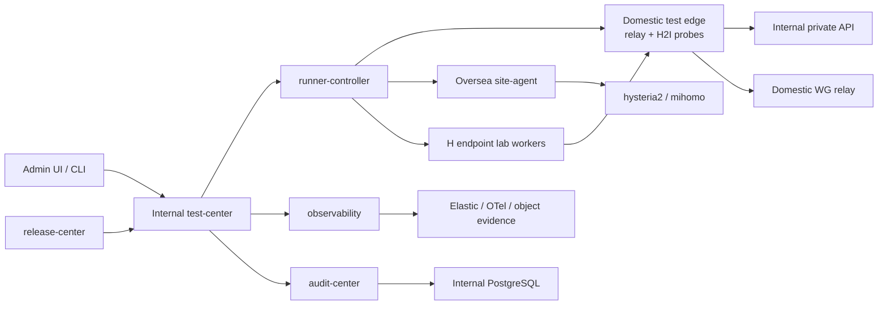
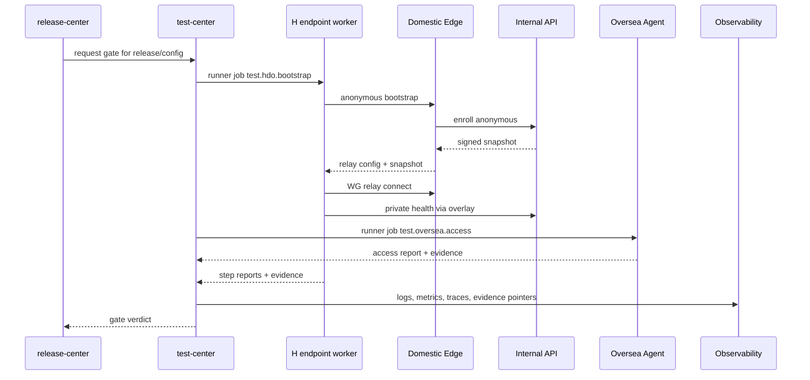

# Observable Automation Test Platform

本文档定义 MX Launcher / HDOI 的可观测自动化测试平台。这里的 HDOI 指：

- H Endpoint: 安装 MX Launcher + Launcher Network + AppCenter + H2O 的用户或测试终端。
- Domestic: 公网入口、relay、H2I proxy、snapshot cache、observability forwarder。
- Oversea: access node、site-agent、runner-worker、hysteria2/mihomo 节点。
- Internal: 主控制面、数据真相、配置、发版、runner、观测和测试中心。

目标不是再做一个孤立 QA 系统，而是把在线 E2E、smoke、synthetic probe、发布门禁、
故障复现和演示验收都纳入 `mx-launcher/server` 的平台能力。每一次测试执行都应该能
回答：

- 测了哪个环境、站点、产品、版本、配置快照和发布计划。
- 哪个 H 端、Domestic、Internal、Oversea 节点参与了链路。
- 每一步的请求、日志、trace、指标、runner job、截图或 artifact 在哪里。
- 测试结果是否足以允许发版、灰度、回滚、客户演示或生产切换。

## 一句话定义

`test-center` 是 MX Launcher 的质量控制面。它调度自动化测试，采集证据，把结果写入
审计和观测系统，并为 `release-center` 提供可追溯的 gate verdict。



## 平台职责

### Internal Test Center

Internal 负责测试真相和门禁判断：

- 保存 test suite、case、plan、run、step、evidence、gate verdict。
- 按 release、config snapshot、site、channel、tenant、device segment 调度测试。
- 调 runner-controller 创建站点执行任务。
- 给每次测试分配 `testRunId`、`traceId`、`requestId`、`correlationId`。
- 归档日志、trace、截图、视频、包 manifest、网络诊断和 runner 输出。
- 计算发布门禁 verdict：pass、fail、blocked、waived。
- 把 gate verdict 写入 `release-center` 和 `audit.events`。

### Domestic Test Edge

Domestic 不做重分析，只负责边缘链路和轻量执行：

- 提供 shadow / staging bootstrap 入口。
- 执行 relay、H2I route、snapshot cache、可选 DNS cache 的 probe。
- 缓冲 H 端日志和测试事件，再转发 Internal。
- 需要兼容旧 runner 时，作为可选 runner-edge 执行 legacy runner 测试。
- 在 Internal 不可达时保留最后一次测试和健康摘要。

### Oversea Site Agent

Oversea 负责本地 access 能力验证：

- 执行 `hysteria2-mihomo-stack` setup/reconcile dry-run。
- 验证订阅导出、限速、节点健康、mihomo 可用性。
- 上报 access latency、error rate、配置版本和 runner job evidence。
- 不保存测试真相，只保存短期执行缓存。

### H Endpoint Lab Worker

H 端测试 worker 是真实客户端自动化执行器，可以是 Windows VM、macOS runner 或本地
dev worker。

职责：

- 启动 MX Launcher shadow/staging channel。
- 执行匿名 bootstrap、登录绑定、配置刷新、WG 连接、Internal private health。
- 执行 UI smoke、升级、回滚、service repair、DNS/route 验证。
- 上传本地 JSON logs、截图、视频、package manifest、service diagnostics。

## 测试层级

| Level | 范围 | 例子 | 门禁用途 |
| --- | --- | --- | --- |
| Contract | 类型、API、manifest、schema | TypeScript typecheck、product manifest、package manifest | 阻止明显坏包 |
| Server API | `mx-launcher/server` API | enroll、identity link、snapshot、audit、logs、release report | 阻止后端契约破坏 |
| Config | 配置和资源快照 | Launcher Network/H2O snapshot、DNS zone、signature、hash | 阻止不可验证配置 |
| Desktop Smoke | Launcher UI 和包 | 启动不提权、catalog、产品状态、package contract | 阻止客户端不可启动 |
| Service / Network | 原生服务和网络 | WG adapter、route、DNS、firewall、NRPT | 阻止网络核心故障 |
| HDOI E2E | H -> D -> I -> O 全链路 | bootstrap、relay、Internal private API、Oversea access | 发布主门禁 |
| Migration | 旧 Domestic 到 Internal | export/import、snapshot parity、legacy API mapping | 切换前门禁 |
| Sales Kit | 离线/演示交付 | U 盘包 verify、all-in-one demo、报告导出 | 客户演示门禁 |

## 标准对象

建议新增 `test` schema 或 `test-center` domain objects：

| Object | 含义 |
| --- | --- |
| `test.suites` | 一组可复用测试，如 `hdo-shadow-e2e` |
| `test.cases` | 单个测试定义，如 `anonymous-bootstrap` |
| `test.plans` | 针对 release/config/site/channel 的执行计划 |
| `test.runs` | 一次实际执行 |
| `test.steps` | run 内的步骤和状态 |
| `test.evidence` | 日志、截图、视频、artifact、diagnostics、runner output |
| `test.gates` | 门禁定义和通过条件 |
| `test.verdicts` | 针对 release/config 的 pass/fail/waived 结果 |
| `test.fixtures` | 测试用户、组织、设备、站点、demo topology |
| `test.probes` | 周期性 synthetic probe 定义 |

测试运行摘要：

```json
{
  "testRunId": "trun_...",
  "suiteId": "suite_hdo_shadow_e2e",
  "environment": "shadow",
  "productId": "hdo",
  "releaseId": "rel_...",
  "configSnapshotId": "cfgsnap_...",
  "topology": "h-d-i-o-shadow",
  "sites": ["domestic-main", "internal-main", "oversea-sg-1"],
  "installId": "inst_...",
  "deviceId": "dev_...",
  "traceId": "trace_...",
  "state": "passed",
  "startedAt": "2026-06-06T12:00:00Z",
  "finishedAt": "2026-06-06T12:04:30Z"
}
```

## API 方向

Internal API：

| API | 用途 |
| --- | --- |
| `POST /internal/v1/test/runs` | 创建测试执行 |
| `GET /internal/v1/test/runs/:id` | 查询测试摘要 |
| `POST /internal/v1/test/runs/:id/steps` | 上报 step 状态和 log/evidence pointer |
| `POST /internal/v1/test/runs/:id/evidence` | 上传 evidence manifest |
| `POST /internal/v1/test/gates/evaluate` | 对 release/config/site 计算门禁 |
| `GET /internal/v1/test/probes` | site-agent 拉取 synthetic probe |
| `POST /internal/v1/test/probes/:id/reports` | 上报周期探测结果 |

Runner job action：

| Action | 执行方 | 用途 |
| --- | --- | --- |
| `test.h.endpoint.smoke` | H lab worker | 启动 Launcher、采集 UI 和本机状态 |
| `test.hdo.bootstrap` | H lab worker + Domestic | 匿名 bootstrap 到 snapshot |
| `test.hdo.identity-link` | H lab worker + Internal | 登录/注册后绑定匿名 install |
| `test.network.wg-health` | H lab worker + Domestic | WG handshake、overlay IP、relay session |
| `test.network.dns-route` | H lab worker + Domestic | DNS zone、route、Internal private service |
| `test.oversea.access` | Oversea site-agent | hysteria2/mihomo access 验证 |
| `test.release.rollback` | H lab worker + Internal | 坏包阻断和回滚槽验证 |
| `test.sales-kit.verify` | Local/demo worker | 离线 kit 完整性和 all-in-one demo |

## 在线 E2E 主流程



## 可观测性标准

测试平台必须复用 `observability`，并额外增加测试字段：

| 字段 | 说明 |
| --- | --- |
| `testRunId` | 测试执行 ID |
| `testSuiteId` | 测试套件 |
| `testCaseId` | 测试用例 |
| `testStepId` | 当前步骤 |
| `gateId` | 发布门禁 |
| `releaseId` | 被测发布 |
| `runnerJobId` | 关联 runner job |
| `configSnapshotId` | 被测配置快照 |
| `traceId` | 跨 H/D/I/O 链路追踪 |

核心指标：

- `test_run_pass_rate`。
- `test_run_duration_ms`。
- `hdo_bootstrap_latency_ms`。
- `wg_handshake_success_rate`。
- `wg_handshake_latency_ms`。
- `internal_private_health_latency_ms`。
- `dns_resolution_latency_ms`。
- `oversea_access_success_rate`。
- `release_gate_block_count`。
- `synthetic_probe_stale_count`。

索引建议：

| Index | 内容 |
| --- | --- |
| `mx-*-test-runs-*` | test run / step event |
| `mx-*-test-evidence-*` | evidence manifest 和对象存储指针 |
| `mx-*-synthetic-*` | 周期 probe 结果 |
| `mx-*-gate-*` | release gate verdict |

审计要求：

- 创建、取消、重试、豁免测试门禁都写 `audit.events`。
- gate waiver 必须记录 actor、原因、过期时间和影响范围。
- evidence 可以归档到对象存储，但 audit 中必须保留不可变指针和 hash。

## Admin UI

管理后台建议新增 `Test Center` 菜单：

```text
Test Center
  - Runs
  - Suites
  - Gates
  - Synthetic Probes
  - Evidence
  - Fixtures
  - Environments
```

常用视图：

- release gate 页面：展示每个 gate 的状态、失败步骤、证据和 waiver。
- HDOI topology test 页面：展示 H/D/I/O 每段链路的延迟、错误、最新通过时间。
- synthetic probes 页面：展示 Domestic、Internal、Oversea 的周期健康。
- evidence drawer：按 `traceId` 聚合日志、截图、runner output、config snapshot。

## 当前实现检查点

当前 `mx-launcher/server` 已经有最小 Test Center API：

- `POST /internal/v1/test/runs` 创建 run。
- `POST /internal/v1/test/runs/:runId/steps` 写 step。
- `POST /internal/v1/test/gates/evaluate` 根据 run 状态计算 gate verdict。
- `/internal/v1/platform-kernel/smoke` 会串起 AppCenter、权限、Launcher Network、
  Test Center 和 Release policy，作为第一条平台内核 smoke。
- shadow Docker 部署默认使用 `INTERNAL_STORE_DRIVER=postgres`，启动时自动执行
  TypeORM migrations，并把测试 run、gate、audit 和平台对象写入 JSONB
  compatibility records。

本地 shadow 部署入口：

```bash
bash electron-dock/mx-launcher/scripts/manage.sh shadow build
bash electron-dock/mx-launcher/scripts/manage.sh shadow up
bash electron-dock/mx-launcher/scripts/manage.sh shadow smoke
bash electron-dock/mx-launcher/scripts/manage.sh shadow down
```

## CLI 和脚本目标

统一入口应逐步支持：

```bash
./scripts/manage.sh test smoke --role internal
./scripts/manage.sh test smoke --role domestic
./scripts/manage.sh test e2e --suite hdo-shadow-e2e --topology h-d-i-o-shadow
./scripts/manage.sh test gate --release rel_... --channel shadow
./scripts/manage.sh test probe run --site domestic-main --case wg-relay
./scripts/manage.sh test evidence open --run trun_...
```

CLI、Admin UI、runner job 都应写入同一套 `test.runs` 和 `audit.events`，不要出现
本地脚本通过但后台不可追溯的分裂。

## 发布门禁

Release Center 在发布前至少检查：

- package manifest、签名、notarization 或 Windows signer policy。
- server API contract 和 migration dry-run。
- HDO config snapshot 签名、hash、资源可下载。
- HDOI E2E 在目标环境通过。
- 目标 Domestic/Oversea synthetic probe 未过期。
- rollback plan 存在，并且最近一次 rollback smoke 通过。
- failure budget 未超限。

Gate verdict 示例：

```json
{
  "gateId": "gate_hdo_shadow_e2e",
  "releaseId": "rel_...",
  "environment": "shadow",
  "verdict": "passed",
  "requiredRuns": ["trun_..."],
  "evidenceSha256": "abc123...",
  "evaluatedAt": "2026-06-06T12:05:00Z"
}
```

## 落地阶段

### Phase 0: 描述和契约

- 把 `test-center` 加入 Internal 默认模块。
- 定义 test schema、API、runner action 和日志字段。
- 先允许手动测试也登记成 `test.runs`。

### Phase 1: 最小可观测测试记录

- 实现 `POST /internal/v1/test/runs` 和 step event 上报。
- 每个 run 生成 `traceId`，日志带 `testRunId`。
- Admin UI 能看到测试 run 和失败步骤。

### Phase 2: Shadow HDOI E2E

- 准备 H endpoint lab worker。
- 打通 anonymous bootstrap、snapshot、WG relay、Internal private health。
- 上传 H 端日志、截图和 service diagnostics。

### Phase 3: Runner / Site Agent 测试

- Domestic test edge 可执行 relay、H2I、snapshot cache 和可选 legacy runner dry-run。
- Oversea site-agent 可执行 `test.oversea.access`。
- runner output 进入 evidence。

### Phase 4: Release Gate

- Release Center 调 `test-center` 计算 gate verdict。
- shadow/beta 发版必须通过 HDOI E2E。
- 支持 waiver，但 waiver 写审计并设置过期。
- V1 已提供 `POST /internal/v1/release-management/plans`，把 release policy、E2E
  run、gate verdict 和下一步动作聚合成管理面计划；真实 rollout executor 后续再接
  Deploy Center / Runner。

### Phase 5: Continuous Synthetic

- Domestic、Internal、Oversea 周期执行 probe。
- 管理后台展示最新成功时间、趋势和 SLO。
- 告警接入 observability。

### Phase 6: Customer Demo / Production Canary

- 销售 kit verify 接入 Test Center。
- staging/customer-demo 环境跑一键验收。
- production canary 使用真实 release/config segment，但测试账号和设备隔离。

## 需要确认的产品问题

1. H endpoint lab worker 的首批平台：先 Windows，还是 Windows + macOS 同时做。
2. 在线 E2E 的执行频率：只做发布前 gate，还是 shadow 环境持续每 15 分钟 probe。
3. 生产 canary 是否允许真实 H 端测试账号进入，还是只使用隔离测试组织。
4. evidence 保存周期：普通日志 30 天、gate evidence 180 天，还是更长。
5. 管理后台是否需要给客户展示测试报告，还是先只给内部运维/研发使用。
6. Oversea access 的验收目标：只测节点配置和订阅，还是要测真实外网访问路径。

## 决策建议

当前建议先做 shadow HDOI E2E：

1. Internal 上实现最小 `test-center` 数据模型和 API。
2. 使用 H endpoint lab worker 执行真实 Launcher 流程，不用 mock 代替网络核心链路。
3. Domestic/Oversea 只接收 runner job 和上报 evidence，不承载测试真相。
4. Release Center 把 E2E gate 当成 shadow/beta 必选门禁，stable 先记录不强拦截。
5. 等 shadow 连续稳定后，再让生产 canary gate 拦截灰度扩大。
