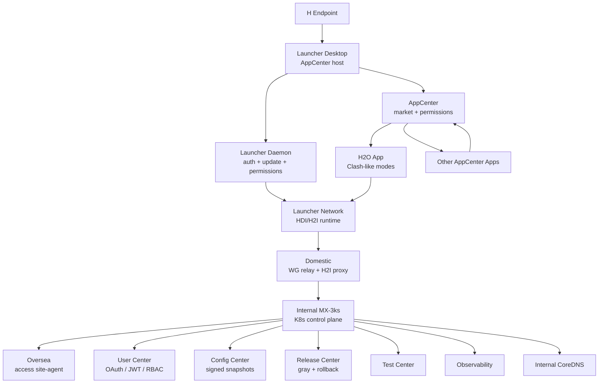
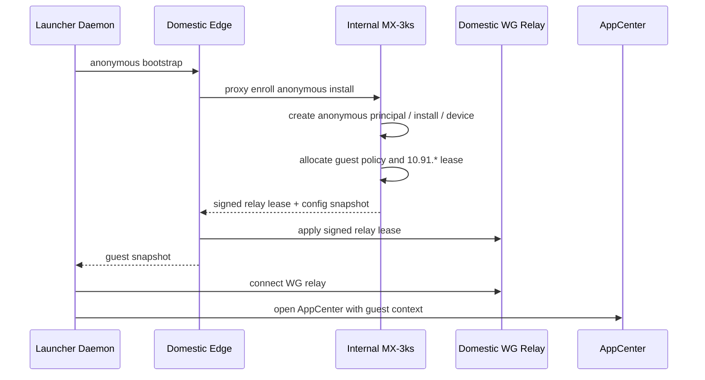
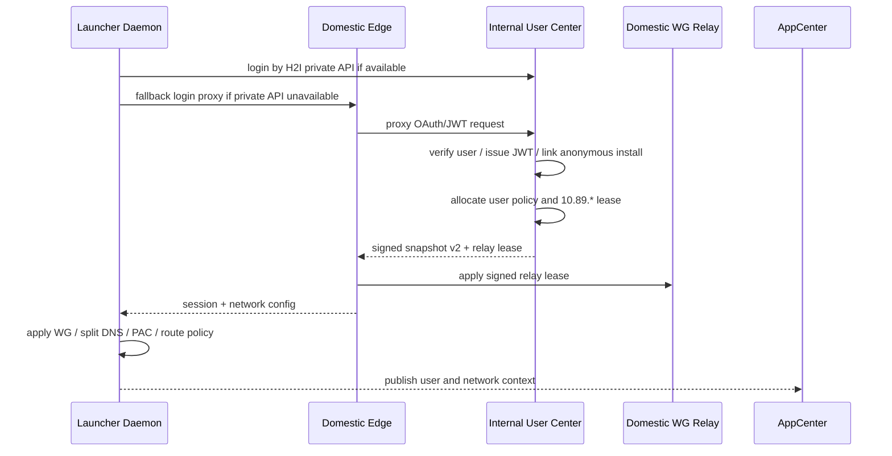
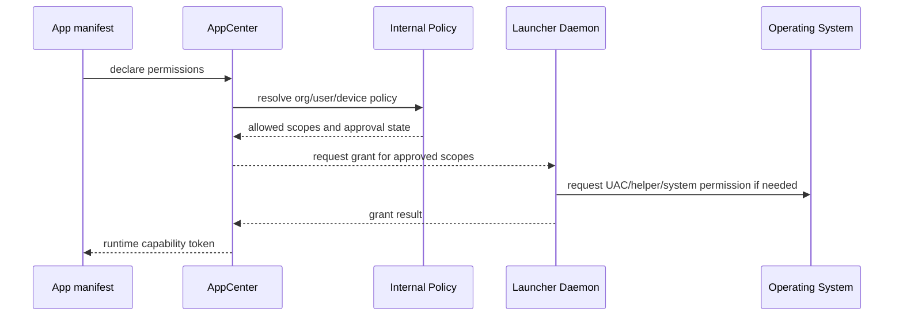

# MX-3ks, AppCenter, Launcher Network, and H2O Architecture

本文档把 MX Launcher、Launcher Network、AppCenter、H2O、Domestic、Internal、
Oversea 和 MX-3ks 的边界统一起来。当前共识是：HDI/H2I 基础网络能力应优化进
Launcher 常驻运行时，而不是作为独立 AppCenter 应用。首个 AppCenter 应用改为
H2O，一个类似 Clash / Tunnel 的网络应用。

## 关键决策

1. MX Launcher 是大平台，Desktop 只是 Launcher 的一种形态。
2. Launcher 应作为常驻守护程序和更新器，负责登录、设备身份、权限、配置下发、
   更新、回滚、网络协调和 AppCenter 宿主。
3. HDI/H2I 是 MX-H2I 这个 standalone 产品的 Launcher Network 基础能力；其它 standalone
   产品可以拥有自己的 ProductNetwork、lease/IP 段和 WG。共享的是本机 ownership registry、
   local edge、DNS/PAC/权限协调面，不是跨产品复用 IP 段。
4. H2O 是首个 AppCenter 应用，提供 App 模式、全局模式、虚拟网卡模式、规则、订阅、
   节点和类 Clash 的用户体验。
5. AppCenter 负责应用权限登记、授权展示、组织策略和权限审计；Launcher 负责向系统
   申请和执行权限。
6. AppCenter/H2O 这类 embed 应用的网络范围是 `broker-session`：它们可以通过
   standalone broker 读取用户、权限、网络和更新状态，但不分配自己的 WG peer lease IP。
7. Domestic 默认最小化：public API proxy、WG relay、H2I route、snapshot cache、
   observability forwarder。
8. Internal MX-3ks 是用户、权限、配置、发布、测试、观测、审计、runner 和 SDK
   Gateway 的真相。

## 名词和边界

| 名称 | 定义 |
| --- | --- |
| MX Launcher | 大平台，包含 Launcher Desktop、Daemon、Network、AppCenter、服务端控制面和交付体系 |
| Launcher Desktop | H 端可见桌面壳，打开时展示 AppCenter、更新、应用状态和网络状态 |
| Launcher Daemon | 常驻守护进程，负责登录态、设备身份、配置、更新、回滚、权限、任务和观测 |
| Launcher Network | Launcher 的 HDI/H2I 基础网络运行时，统一管理 WG、DNS、PAC、TUN、系统代理和 relay |
| AppCenter | 应用中心，展示可安装应用、权限、版本、团队/组织上下文和发布状态 |
| H2O | 首个 AppCenter 应用，类似 Clash / Tunnel，消费 Launcher Network 能力，不直接控制系统网络 |
| MX-3ks | 以 Internal K8s 为核心的整套平台服务体系，Domestic 和 Oversea 是可插拔站点 |
| Domestic | 最小公网入口、WireGuard relay、H2I 中转、API proxy 和观测转发 |
| Internal | 主控制面、用户中心、AppCenter 后端、配置、发版、测试、观测、runner、CoreDNS、K8s 和数据真相 |
| Oversea | 可插拔 access site，接收 Internal runner/site-agent 控制，提供 Hysteria2/mihomo 访问能力 |

## 分层模型



## 为什么 HDI 应该进 Launcher

HDI 和 Launcher 的运行时职责高度重合：

- 都需要常驻或半常驻。
- 都需要设备身份、登录态、配置快照和服务端心跳。
- 都会触碰系统权限、守护进程、更新、回滚和诊断。
- 都会影响 WireGuard、DNS、PAC、TUN、系统代理和路由。

如果 Launcher 和 HDI 分别运行网络实例，会出现：

- WG peer、interface、IP lease、DNS/PAC 状态难以归属。
- 两个进程都想申请系统权限和写系统网络状态。
- 更新、回滚、故障恢复和审计需要跨两个产品同步。
- AppCenter 应用后续也难判断应调用谁的网络能力。

因此建议同一个 standalone channel 内只有该 channel 的 Launcher Network 拥有底层网络主权。
H2O 和其他 embed 应用通过 AppCenter / Launcher runtime API 申请能力。Luopan 这类独立
standalone 产品应拥有自己的 channel、WG profile 和 product CIDR；MX-H2I 不能在重连时
adopt Luopan 的 `10.91.*` 路由，Luopan 也不能复用 MX-H2I 的 `10.89.*` lease。

多 standalone 共存时，本机只共享 ownership registry / local edge 协调状态。registry 用于
记录 owner、DNS host/zone、reverse proxy route、产品 CIDR 和冲突 evidence；route CIDR
不是其它 standalone WG 的 `AllowedIPs` 输入。关闭任意一个 standalone 只释放自己的 owner
claim，不影响其它产品的 IP、WG 或用户/权限生命周期。

## H 端游客链路

游客状态由 Launcher Daemon 管理，不要求先登录。



游客能力：

- 获得匿名 install/device 身份。
- 获得 `10.91.*` 受限网段或等价 guest overlay policy。
- 可打开 AppCenter，查看公开或游客可见应用。
- Launcher Network 负责本机权限、服务、网络保护和基础观测。
- 所有游客行为以 `anonymousPrincipalId -> installId -> deviceId` 写审计。

## 登录和用户态网络链路

登录由 Launcher Daemon 统一完成。H2O 可以触发登录 UI，但不保存登录真相。



登录后能力：

- User Center 提供 OAuth、登录、JWT、session、refresh、RBAC 和 token introspection。
- Launcher Network 拿到用户态 `10.89.*` 或等价 user overlay policy。
- 匿名 install 和登录用户绑定，登录前后的审计可追溯。
- AppCenter 和应用通过短期 token 与权限声明访问平台能力。

## H2O 应用定位

H2O 是首个 AppCenter 应用，类似 `electron-demo/tunnel` / Clash 的网络应用。

H2O 负责：

- App 模式：按应用、域名、目的服务自动接入。
- 全局模式：用户明确选择全局代理或全局 HDI 出口。
- 虚拟网卡模式：通过 Launcher Network 申请 TUN/虚拟网卡能力。
- 规则管理：订阅、规则集、策略组、绕过列表、白名单。
- 节点/订阅：展示 Internal 生成的 mihomo/subscription manifest 和 Oversea 节点。
- 连接 UI：延迟、流量、规则命中、失败诊断、切换模式。

H2O 不直接做：

- 不直接创建 WireGuard interface。
- 不直接写系统 DNS、PAC、TUN 或系统代理。
- 不直接申请 UAC/admin/helper 权限。
- 不保存长期用户、权限或配置真相。

H2O 通过 Launcher Network API 消费能力。

## 权限模型

所有 AppCenter 应用先登记权限，再由 Launcher 执行系统权限申请。



权限原则：

- 应用只声明权限，不直接弹系统权限。
- AppCenter 负责展示、授权、撤销、组织策略和审计。
- Launcher Daemon 负责实际申请系统权限和执行本机能力。
- Internal Policy 决定用户、组织、设备、版本和环境是否允许授权。
- 所有 grant、deny、revoke、elevation 都写 audit。

建议权限 scope：

| Scope | 说明 |
| --- | --- |
| `auth.read` | 读取游客/用户上下文 |
| `token.exchange` | 换取短期应用 token |
| `network.hdi.status` | 读取 Launcher Network 状态 |
| `network.hdi.connect` | 请求启动 HDI/H2I 基础连接 |
| `network.proxy.app` | App 模式代理 |
| `network.proxy.global` | 全局代理 |
| `network.tun.request` | 虚拟网卡能力 |
| `network.dns.policy` | 读取 split DNS 策略 |
| `network.pac.policy` | 读取或触发 PAC 策略 |
| `observability.write` | 写应用日志和健康事件 |

## Domestic 最小化方案

Domestic 保留为公网入口和数据面中转：

| 能力 | Domestic 是否保留 | 说明 |
| --- | --- | --- |
| HTTPS public entry | 保留 | H 端首次 bootstrap 必须有公网入口 |
| WireGuard relay | 保留 | H -> D -> I 快速网络通道的必要数据面 |
| H2I route/proxy | 保留 | Internal 固定 peer server 后，H 可经 D 到 I |
| API proxy | 保留轻量 | 转发 login、bootstrap、snapshot、heartbeat 到 Internal |
| 用户中心 | 迁到 Internal | Domestic 不保存用户/权限真相 |
| 配置中心 | 迁到 Internal | Domestic 只缓存 signed snapshot |
| DNS 控制面 | 迁到 Internal | Domestic 可不跑 CoreDNS，或只跑可选缓存 |
| Runner 控制 | 迁到 Internal | Domestic runner-edge 仅作为兼容执行器 |
| 管理后台 | 迁到 Internal | Domestic 不承载后台 |

推荐流程：

1. H 端访问 Domestic public URL。
2. Domestic 做限流、基础设备 token 校验、proxy 和 relay lease apply。
3. Internal 负责用户认证、匿名 enroll、网段分配、配置快照、发版任务。
4. Domestic 执行 Internal 签名的 relay lease，不自行决定用户权限。
5. H 连上 Domestic relay 后，优先使用 H2I private API 访问 Internal。

## CoreDNS、Split DNS 和 PAC

CoreDNS authority 放 Internal K8s。H 端运行时由 Launcher Network 执行 split DNS
和 PAC。

| 层级 | 位置 | 责任 |
| --- | --- | --- |
| DNS Authority | Internal K8s CoreDNS / zone builder | 管理 internal zones、service discovery、HDI service records |
| DNS Policy | Internal Config Center | 下发 split DNS 白名单、fallback、优先级和版本 |
| DNS Runtime | Launcher Network local resolver | 根据 snapshot 决定哪些域名走 HDI，哪些走系统 DNS 或代理 |

Split DNS 的目标形态是“每个 app 提交自己的域名需求，Internal 合并为一个可验证的最终策略”：

- AppCenter manifest 声明 `dns.exactDomains`、`dns.suffixes`、`dns.records` 和可选
  `reverseProxyRoute`；声明本身不直接改系统 DNS。
- Config Center 按 app、tenant、用户/匿名身份、灰度环合并策略，生成 policy snapshot 和
  CoreDNS zone snapshot。冲突域名必须有 owner、优先级和 evidence。
- H 端 Launcher Network 在 WG ready 后安装本地 split DNS：命中 app/internal 白名单的域名走
  Internal DNS endpoint；未命中的域名按 `fallbackOrder` 走系统 DNS、系统代理、H2O/fake-ip
  或 direct。
- Domestic 不保存 DNS 真相；需要时只跑 `dns-edge-cache` 或 UDP/TCP forwarder，转发到
  Internal DNS endpoint。
- Oversea 和 site-agent 默认读取签名 snapshot；确实要解析 internal zone 时，也通过同一
  Internal DNS authority 或 SDK/DoH gateway，不在 Oversea 复制 zones。

当前 Internal API 先落地为统一策略入口：

| API | 调用方 | 用途 |
| --- | --- | --- |
| `GET /internal/v1/dns/policies` | Admin / Config Center | 查看 split DNS policy |
| `GET /internal/v1/dns/policies/effective` | Launcher Network / H2O | 获取当前有效 policy |
| `POST /internal/v1/dns/evaluate` | Launcher Network / H2O | 判断单个域名走 Internal DNS 还是 fallback |
| `GET /internal/v1/dns/reverse-proxy/routes` | Admin / Gateway | 查看 Internal 可选反代入口 |
| `GET /internal/v1/sdk/dns/policy` | SDK Gateway / 外部系统 | 读取统一 DNS policy |
| `POST /internal/v1/sdk/dns/evaluate` | SDK Gateway / 外部系统 | 复用同一套 split DNS 决策 |

最小 Domestic 模式下，Domestic 不需要运行 CoreDNS：

- H 未连上 H2I 前，只能解析公网 Domestic bootstrap 域名。
- H 连上 WG relay 后，Launcher Network 把命中的 internal/domestic 白名单域名发往
  Internal CoreDNS。
- 未命中白名单的域名走系统 DNS、系统代理、浏览器代理或 Clash/mihomo 等已有配置。
- 如果需要 Internal 短暂不可达时仍解析内部域名，可以给 Domestic 增加可选
  `dns-edge-cache`，但这不是业务真相。
- 域名命中 Internal 后，可以继续由 Internal gateway 选择性反代，如
  `gateway.internal.mx -> MX Internal API`；是否反代由 Internal reverse proxy routes
  控制，不由 H 端硬编码。

部署顺序上，Internal DNS authority 要先于 H 端 split DNS 全量开启：

1. 部署 `mx-dns` namespace、CoreDNS ConfigMap writer RBAC 和 baseline CoreDNS Service。
2. 部署 Internal API / Config Center，能生成 DNS policy snapshot 和 CoreDNS zone snapshot。
3. 暴露 Internal DNS endpoint：`mx-internal-coredns` 仍监听 Pod 内 `:53`，
   服务端 Save App / ProductNetwork materialization 把 control/DNS/proxy 映射到每个
   standalone channel 自己的 service VIP，例如 Luopan `10.88.100.3`。MX-H2I /
   `launcher-foundation` 是迁移兼容例外，routePlan 继续下发 `10.88.88.88` 和
   `10.88.0.1`，直到 `10.88.100.1` 的 control/DNS/proxy materialization 通过健康验证。
   Domestic WG materialization 需要把产品 lease `/16` 和产品 VIP `/32` 同步进
   `productRelayCidrs`；新 standalone 产品不再要求每个 H 端安装共享 `10.88.88.88` 或
   `10.88.0.1` 路由。
4. Domestic relay ready 后，H 端只对命中白名单的域名安装 split DNS；未命中仍走本机原有
   系统 DNS、系统代理、fake-ip 或 H2O 规则。
5. 最后再启用 AppCenter app 级 DNS policy，按 app 安装/授权状态合并到当前设备的最终
   split DNS snapshot。

PAC 优先级：

1. Launcher Network 下发的 HDI/H2I 基础规则。
2. AppCenter 应用申请的 App/域名/网段规则。
3. Internal 配置中心下发的组织或应用策略。
4. 系统代理或浏览器已有代理。
5. H2O / Clash / mihomo 等用户或企业代理。
6. 直连。

## Launcher 更新器和版本结构

Launcher 同时作为安装器、更新器、恢复器和本机能力执行器。

| Component | 说明 |
| --- | --- |
| `launcher-shell` | 启动器壳、AppCenter 宿主、更新器 UI |
| `launcher-daemon` | 本机守护、登录、服务安装、权限和更新执行 |
| `launcher-network` | HDI/H2I、WG、DNS、PAC、TUN、系统代理协调 |
| `app-center` | 应用中心 UI 和协议实现 |
| `h2o` | 首个 AppCenter 应用 |
| `mx-service` | Windows/macOS privileged network service/helper |
| `app-package` | AppCenter 应用包 |
| `config-snapshot` | 最终配置快照 |
| `server-module` | MX-3ks 服务端模块 |
| `site-agent` | Domestic/Oversea agent |

Release Center 统一下发：

- 版本、channel、灰度 segment、功能 flag。
- artifact manifest、hash、签名、release notes。
- rollback slots 和最低可回退版本。
- update task、service repair task、app install/update task。

Launcher 更新原则：

- Launcher Shell 尽量少改，优先让 AppCenter、H2O 和应用协议吸收变化。
- 影响本机权限、守护、服务安装、更新安全、网络主权时才升级 Launcher/daemon/network。
- 所有更新先校验签名/hash，再进入 staged activation。
- 激活失败时回滚到上一可用版本，并上报 release report。

## Launcher 和 AppCenter 协议

Launcher 与 AppCenter 之间保留稳定宿主协议：

| API | 说明 |
| --- | --- |
| `launcher.getRuntimeContext()` | installId、deviceId、environment、channel、platform |
| `launcher.getAuthContext()` | anonymous/user context、JWT 状态、权限摘要 |
| `launcher.getNetworkContext()` | Launcher Network 状态、overlay IP、DNS/PAC/TUN 状态 |
| `launcher.listInstalledApps()` | 已安装应用和版本 |
| `launcher.installApp(appId, version)` | 安装应用 |
| `launcher.updateApp(appId, version)` | 更新应用 |
| `launcher.rollbackApp(appId)` | 回退应用 |
| `launcher.openApp(appId, launchParams)` | 启动应用 |
| `launcher.requestPermission(appId, scopes)` | 为应用申请已登记权限 |
| `launcher.reportAppHealth(appId, health)` | 应用健康上报 |
| `launcher.emitTelemetry(event)` | 统一观测事件 |

AppCenter 不直接操作本机高权限资源，必须通过 Launcher Daemon / Service。

## AppCenter 和应用协议

AppCenter 应用通过 manifest 和 runtime API 接入：

```json
{
  "appId": "h2o",
  "displayName": "H2O",
  "builtin": true,
  "version": "0.1.0",
  "channels": ["shadow", "beta", "stable"],
  "permissions": [
    "auth.read",
    "network.hdi.status",
    "network.proxy.app",
    "network.proxy.global",
    "network.tun.request",
    "network.dns.policy",
    "network.pac.policy",
    "observability.write"
  ],
  "entrypoints": {
    "desktop": "app://h2o/index.html",
    "settings": "app://h2o/settings.html"
  },
  "protocol": {
    "appCenter": "1.0",
    "launcher": "1.0"
  }
}
```

应用 runtime API：

| API | 说明 |
| --- | --- |
| `appCenter.getUser()` | 用户或游客上下文 |
| `appCenter.requestToken(audience, scopes)` | 为应用换取短期 token |
| `appCenter.getConfig(appId)` | 应用最终配置 |
| `appCenter.getNetworkStatus()` | Launcher Network 状态 |
| `appCenter.requestNetworkMode(appId, mode)` | 请求 app/global/tun 等网络模式 |
| `appCenter.requestInternalAccess(appId, target)` | 应用声明需要访问 Internal 服务 |
| `appCenter.openDeepLink(url)` | 打开应用内或跨应用链接 |
| `appCenter.reportHealth(status)` | 应用健康 |
| `appCenter.log(event)` | 应用日志进入统一观测 |

## H2O 开放能力

H2O 首版建议覆盖：

- 模式：自动连接 App 模式、全局模式、虚拟网卡模式。
- 规则：域名、进程、网段、服务、订阅和绕过规则。
- 订阅：从 Internal 获取 mihomo/subscription manifest，订阅 IP 直达 Oversea。
- 节点：展示 Oversea access node、延迟、可用性和流量。
- 诊断：DNS 命中、PAC 命中、规则命中、连接失败、handshake 和 trace。
- 观测：连接质量、latency、错误率、用户切换模式、规则命中统计。

H2O 是用户体验和策略 UI；Launcher Network 是底层执行者。

### 管理员系统订阅（与用户登录完全旁路）

User Center 顶部的 `subscriptions` 是只读虚拟系统账号，不是 `UserCenterUser`，因此不能设置
local password、不能 OAuth/飞书登录、不能被赋予用户 entitlement。它按 Oversea site 提供
两种可复制 channel：兼容性优先的 Direct-IP + HTTP Basic（默认 export port 是 3434，SSH profile
明确配置冲突替代端口时可为 3435），以及通过 active Domestic edge 公网域名提供的 HTTPS + Basic。
两条 URL 复用同一个长期稳定的 site system credential，并返回同语义 system YAML；订阅 YAML
固定 `mixed-port: 7788`，并显式表达 `maxBytes/resetPeriod/expiresAt = null`
（无总流量 quota）。`50 Mbps` 是上下行提示，不等于总流量上限。
域名配置缺失、暂停或读取失败时只禁用域名复制；Direct-IP URL、Oversea Caddy 精确路径和原凭据
保持不变，不把 Domestic edge 的可用性变成 IP 直连 channel 的前置条件。

正常 Oversea **Install/Sync** 会幂等创建或复用系统账号；只有卡片明确提示缺账号时才需要先点
**Ensure System Accounts**，然后再执行该站点的 **Install/Sync**。worker evidence passed 后才能
**Reveal**。GET 目录始终脱敏，明文 Direct-IP/域名 Basic URL 只由 ops-token `no-store` reveal
返回；Admin 在同一页面、同一 server/ops-token 绑定期间会把已 Reveal 的值保留在内存里，关闭再打开
抽屉仍可复制，但不会写入 localStorage、审计或服务端日志。域名 URL 的 HTTPS 保护客户端到 Domestic edge 这一段；它不改变
Oversea Hysteria 节点自身的 TLS/fingerprint 校验。MX 只提供和复制 URL，不生成
`qp-tunnel-cli install` 命令，也不安装、启动或修改任何
本地 7788/7890 实例。管理员把 URL 手工添加到自行选择的现有应用；若应用把订阅当作完整配置加载，
需要自行确认它如何处理 YAML 中的 `mixed-port: 7788`。现有用户仍走 Bearer `ensure-subscription`
和既有 7788 路径；HTTPS public-token 链路也继续作为第三方客户端的兼容方案。

## Oversea 和 Mihomo 放置

可以把 mihomo 配置和订阅服务放在 Internal：

- Internal 生成 mihomo/subscription manifest。
- H 端通过 H2I 访问 Internal 获取订阅。
- 订阅里指向真实 Oversea access node。
- Oversea site-agent 只接收 Internal runner job，更新本地 hysteria2/mihomo stack。
- 用户连上 Domestic 后即可通过 H2I 到 Internal 获取配置，不要求 Domestic 保存订阅真相。

H2O 运行时订阅策略：

- 默认订阅来自当前用户在 Internal User Center 的 oversea entitlement，默认站点是
  `oversea-main`。H2O 启动前先水合该 managed profile，把
  `/internal/v1/user-center/users/{userId}/oversea/subscription.yaml` 作为 mihomo 订阅源。
  这里的 `{userId}` 必须是 User Center 的真实 id，例如 `usr_bmcq`，不能用展示账号
  `bmcq` 直接拼 URL；缺少 OAuth principal 时，客户端应按当前账号向 User Center 反查。
- 如果当前用户还没有 active entitlement，H2O 或其它系统应优先调用
  `POST /internal/v1/user-center/users/{userId}/oversea/ensure-subscription`。这个 API 在一次
  请求里完成默认 `oversea-main` entitlement 分配、runtime sync 尝试和订阅 YAML 渲染状态返回；
  调用方只需检查 `ensure.ready` 和 `subscription.path`，不需要再手动刷新默认订阅。如果
  `site-slots/plans` 里没有可用的 `oversea-main`，客户端应选择最近的非 blocked
  oversea plan，或退回 Internal server-default site 分配。`ensure.ready` 必须代表远端
  Hysteria2 runtime 已能用该账号 auth，而不仅是 Internal 已生成 YAML 或 host
  `users.csv` 有记录；否则 H2O 应保留 initializing/诊断状态，避免给用户一个看似可用但无法
  出网的订阅。
- **平台默认站点在后台可改，不再写死 `oversea-main`。** admin UI → Deployment → Oversea →
  Site Registry 顶部的 **Default site** 写的是 `mx-h2i` product network 的
  `defaultOverseaSiteId`（`POST /internal/v1/launcher-network/products/mx-h2i`）。
  `defaultUserOverseaSiteId()` 以 mx-h2i 这一条为准（不再取决于产品列表排序），并且仍会
  校验站点在役——默认站点被 archive 掉时自动降级到还在服役的站点。**只影响还没有
  entitlement 的用户**；已分配的用户要换站点走下面的批量迁移，或 User Center 里逐个勾选。
- **给全部现有用户追加一个新站点**：Site Registry 的 **Roll out to existing users**
  （`POST /internal/v1/user-center/oversea-entitlements/rollout`，ops token）先 Preview 冻结活跃真人用户
  清单，再执行 **Add to users & Sync**。它按执行时的最新 entitlement 做站点并集，包含原本无
  entitlement 或已禁用 Oversea 的用户，但不删除任何旧站点，也不处理 service account。写入完成后
  只对目标 Oversea 做一次 site-wide Sync Remote；失败时保留 Internal 分配供低峰重试，不逐用户 SSH，
  更不调用 Domestic/Internal WG 的 materialize、sync 或 restart。
- **存量用户批量迁移**：Site Registry 的 **Migrate subscriptions**（`POST /internal/v1/
  user-center/oversea-entitlements/migrate`，ops token）采用蓝绿两阶段。先 Preview + **Add Target**
  （`mode: 'add'`）保留源站并追加目标，再从同一页面点 **Sync Target**；只有当前 source/target、
  当前用户集合在 15 分钟内完成一次真实目标站同步，而且全部目标账号显示 `synced`，界面才解锁
  Preview + **Cut Over**（`mode: 'replace'`）移除源站。源服务器可以已经停机或归档：它只作为
  Internal entitlement 的迁移来源，不需要 SSH；目标站必须在役并完成 Install / Sync。
  **不带 `confirm: true` 是 dry-run**，Apply 固定使用 Preview 返回的 `userIds`，避免名单变化时
  扫到未确认用户。整个流程只改 Oversea entitlement 和目标 Oversea runtime，不调用 Domestic /
  Internal WG materialize、sync 或 restart。Cut Over 完成并抽查订阅后再 Archive 源站。
- **`ensure-subscription` 不带 `siteIds` = 「不改分配」，不是「回到平台默认」。** Internal 只在
  用户**还没有任何 entitlement 记录**时才落到 `defaultUserOverseaSiteId()`；已有记录时原样
  保留 admin 在 User Center 勾的站点（勾成空 = 停用，也要保留，不能被刷新悄悄重新授权）。
  客户端侧同样：`ensure-subscription` 的第一档候选是「已授权站点全集」而不是逐个站点，
  否则多站点授权会在服务端被裁成单站点，用户的节点列表随之变短。
- H2O 的 **分配系统默认** 是上述规则的显式例外：按钮发送
  `assignmentMode: 'platform-default'`，只在这一次操作中把当前用户替换为平台当前可服务的默认站点。
  若默认站点不可用则直接失败，不回退已归档/停机的旧站点；登录、自动水合和普通刷新均不发送该
  mode，因此仍保留 Admin 已有分配。
- 如果 entitlement 已存在但账号缺失或 `runtimeSync` 不是 `synced`，H2O 水合 managed profile
  时也应优先调用 `ensure-subscription`，让一次请求同时补 entitlement、site access account、
  remote runtime sync 和 YAML 可渲染性；`/oversea/sync-runtime` 只作为已有 active account
  的轻量补同步回退。
- H2O 默认使用 `app-global`，即 AppCenter/嵌入 App 里除黑名单外都走 H2O；`app-rule`
  是显式选择的白名单模式，不能作为新用户或缺省配置的回退。

### 模式与开关：和 Clash 一样分两层

**模式**决定作用范围（`MihomoRuntimeMode`，三种）：

| mode | 覆盖范围 | TUN | 尾规则 |
| --- | --- | --- | --- |
| `app-rule` | 仅嵌入 App | 关 | 白名单走 H2O，其余 `MATCH,REJECT` |
| `app-global` | 仅嵌入 App | 关 | 黑名单之外都走 H2O（**默认**，不影响外部联网） |
| `system-tun` | 整机，含外部浏览器 | 开 | 同 `app-global` |

**开关**独立于模式，切模式不会重置（`RuntimeTuning`）：

| 开关 | 取值 | 默认 | 说明 |
| --- | --- | --- | --- |
| `dnsMode` | `fake-ip` / `redir-host` | `fake-ip` | fake-ip 快且不泄漏 DNS；redir-host 解析真实 IP，兼容需要真实地址的局域网/游戏 |
| `tunStack` | `system` / `mixed` / `gvisor` | `system` | 见下方升级路径 |
| `strictRoute` | on / off | off | 防泄漏更强，但会和其它 VPN 抢路由 |
| `cnDirect` | on / off | on | 关掉表示国内域名也走 H2O；控制面直连规则不受影响 |

早期版本曾把 fake-ip 做成第四个模式 `system-fakeip`，现已折叠：
`normalizeRuntimeMode('system-fakeip') === 'system-tun'`，旧的本机状态仍能加载。

### TUN 协议栈：system → mixed → gvisor 逐档升级

三档不是并列选项，而是一条排障路径。默认停在最快的一档，遇到具体症状再往上走：

| stack | 实现 | 何时用 |
| --- | --- | --- |
| `system` | 内核 TCP 栈 | **默认**。吞吐和内存最好，也是判断"问题是否出在协议栈"的基线 |
| `mixed` | TCP 内核栈 + UDP gvisor | system 栈下 UDP 异常时（游戏、语音、QUIC）先换这档 |
| `gvisor` | 全用户态栈 | 前两档都不行时。兼容性最好，代价是吞吐和内存 |

**`strict-route` 和 `auto-redirect` 与协议栈无关**，早期实现把三者绑在一起是错的：

- `strict-route` 是各协议栈都支持的防泄漏开关（用防火墙规则把绕过 TUN 的流量抓回来）。
  默认关，因为开着正是和其它 VPN / 外部 Clash 抢路由的原因。
- `auto-redirect` 只有 Linux 实现（nftables/iptables 重定向），因此按**平台**决定，
  macOS / Windows 恒为 false。

### 与外部 Clash 共存

`app-rule` / `app-global` 只改本进程和嵌入窗口的代理，外部 Clash 不受影响，反之亦然。
`system-tun` 会和外部虚拟网卡抢路由 —— 这是唯一需要二选一的场景。缓解手段按优先级：

1. 默认就是 `app-global`，不接管整机流量，所以默认不冲突。
2. `strictRoute` 默认关：只接管进入虚拟网卡的流量，不去抢别人的路由。
3. 控制面 guard（下一节）保证无论谁在接管，MX-H2I 的内网和 WireGuard 都是直连例外。

### 虚拟网卡模式下的控制面保护

`system-tun` 会接管整机流量，MX-H2I 自己的控制面必须留在隧道之外，否则 H2O 一启动
就会掐掉 launcher 自己的连接，再也拿不到订阅或续期。`h2oControlPlaneGuard()` 收集：

- split DNS 内网域名、bootstrap/Internal/订阅 URL 的 hostname、Host Resolve 表里的域名
- Domestic relay / WireGuard endpoint / Internal DNS target 的 IP

并通过 `applyManagedConfig({ guard })` 下发，渲染成三样东西：

1. 排在所有用户规则和 `MATCH` 之前的 `IP-CIDR,...,DIRECT,no-resolve` / `DOMAIN-SUFFIX,...,DIRECT`
2. `dns.fake-ip-filter` 排除项（这些域名不能拿到 198.18.x 假地址）
3. `dns.nameserver-policy` 指向明文 DNS —— 用 DoH 解析 bootstrap 域名需要隧道先能出网，
   会死锁

guard 存在 manager 实例上，进程重启后 `getH2oTunnelManager()` 会补一次，
保证 admin 页/订阅刷新触发的 `renderConfig()` 也带着直连规则。

### 一个用户一个订阅 URL，里面装所有 oversea 节点

**不是每台 oversea 一个订阅 URL。** 结论如下，服务端 `renderUserOverseaMihomoSubscription`
已经是这个实现：

```
GET /internal/v1/user-center/users/{userId}/oversea/subscription.yaml   ← 每个用户固定一个
  proxies:
    - oversea-main-hysteria2   -> 156.239.45.4:51289
    - oversea-mx-hysteria2     -> 156.239.45.5:51289
    - oversea-sg-1-hysteria2   -> sg.example.com:51289
  proxy-groups:
    - {name: Oversea, type: select, proxies: [...三个节点..., DIRECT]}
  rules:
    ... MATCH,Oversea
```

- 只有 `account.status === 'active'` 的站点会进 `proxies`，所以增删机器不改 URL。
- 规则指向 `Oversea` 这个 select 组，H2O 换节点只是改组内选择，URL 和规则都不动。
- **多节点时先出一个 `Oversea-Auto` fallback 组**（单节点不生成，没有可顺延的对象）：
  它按列表顺序健康探测（`http://www.gstatic.com/generate_204`，300s），当前节点不通就
  自动顺延到下一个，恢复后自动切回靠前的。`Oversea` 仍是 select 组，只是把 `Oversea-Auto`
  放在第一位——**没手动选过 = 自动顺延，想固定某台机器仍可在组里点它**；`MATCH` 依旧指向
  `Oversea`，手动切换的入口没被顶掉。
- H2O 界面区分「用户选的」和「实际在出流量的」：后者顺着 mihomo `/proxies` 的
  `group -> now` 一路解析到非组为止（`resolveEffectiveProxyNode`，带跳数上限防成环）。
  两者不一致时会明说「已自动顺延到 X（所选 Y 当前探测不通）」，免得用户以为切换没生效。
- **`select` 组没有测速也不会自动挑**：客户端没手动选过时，默认走 `proxies` 里的第一个。
  这个顺序原来等于 `entitlement.siteIds` 的字母序（`mx-oversea-hk01` 排在 `oversea-main`
  前面纯属巧合，换成 `oversea-sg-1` 就是 `oversea-main` 胜出）。现在渲染时把**平台默认
  站点排到第一位**（`orderOverseaSubscriptionEntries`），默认流量才真正可控；其余节点
  仍在组里可切，用户手动选过的节点由客户端自己记住，不会被顺序覆盖。
- 换 URL 的方案被否掉：那样每加一台机器都要重新下发订阅、客户端还要维护 N 个订阅状态，
  而且切节点会断开所有连接。

### 订阅地址可达性：公网还是 Internal

Domestic edge 目前是 `bootstrap-and-relay` 模式，nginx **只反代 `/healthz`**，
`/internal/v1/*` 一律 404（实测 `https://h2i.minsight-ai.com/internal/v1/...` → nginx 404）。
所以客户端按候选链取订阅，用第一个成功的，并把它记进 `activeSubscription.resolvedUrl`：

| 顺序 | 地址 | 现状 |
| --- | --- | --- |
| 1 | 上次成功的 `resolvedUrl` | 有就先用，避免每次都撞 404 |
| 2 | 公网 `https://{bootstrap 域名}/internal/v1/...` | **目前 404**，等 Domestic 开反代后自动生效 |
| 3 | Internal `http://10.88.88.88:18090/internal/v1/...` | 当前真正可达（需要 WG 起来） |

hydrate（登录/刷新订阅）和 start（启动 mihomo 前预取）共用同一条链，取到的 YAML 通过
`applyManagedConfig({ subscriptionContent })` 直接交给 mihomo，它自己不再下载。
Bearer 版 `user-center/.../subscription.yaml` 不得整体暴露到公网。Domestic edge 只允许下面两类
精确只读 GET：普通用户的 token-in-path 聚合订阅，以及 `subscriptions` 系统账号的单站点
Basic 路径；其它 `/internal/v1/*`（包括整个 `/internal/v1/user-center/`）继续 fail closed。

#### 例外：Clash 用的 public link 已经开在公网

`user-center/.../subscription.yaml` 需要 Bearer，Clash 这类第三方客户端发不了，所以另有一条
**token-in-path** 的只读路径 `GET /internal/v1/oversea-subscriptions/{token}.yaml`
（token 可吊销、可轮换、只能读自己那份订阅，URL 里不含 userId）。Domestic edge 的严格
allowlist 单独放行了这一条（`@publicOverseaAggregate`），所以它和内网地址都能取到同一份
聚合订阅：

| 面 | 地址 |
| --- | --- |
| 内网 / VPN | `http://10.88.88.88:18090/internal/v1/oversea-subscriptions/{token}.yaml` |
| 外网 / 公网 | `https://h2i.minsight-ai.com/internal/v1/oversea-subscriptions/{token}.yaml` |

**H2O 订阅列表里那三条地址不是一回事**，别混着复制：

| 行 | 地址形态 | 能不能粘进 Clash |
| --- | --- | --- |
| System Oversea 默认订阅 | `/internal/v1/user-center/.../subscription.yaml` | **不能**。要 Bearer，且公网 allowlist 永不放行，粘过去必 404 |
| `{siteId}` 用户订阅 | `/internal/v1/site-slots/.../hysteria2/{user}.yaml` | 能，但只有单节点，不随 entitlement 增减 |
| 生成 Clash 链接 | `/internal/v1/oversea-subscriptions/{token}.yaml` | 能，且是多节点聚合——**要多节点就用这条** |

所以 H2O 在默认订阅那一行直接标注「这条地址需要登录态」，并提供「生成 Clash 链接」
按钮：用当前用户自己的 Bearer（scope `oversea.subscription.ensure`）调 subscription-link
签发，明文 token 只在响应里出现一次，拿到即写进 runtime 供复制。新签发链接的有效期是
3650 天（约 10 年）；重新生成会立即吊销旧链接，管理员也可以单独吊销，长有效期不替代泄漏后的轮换/吊销。

admin UI 的 User Center → Oversea access → Public Link 会在签发后同时给出这两个地址，
各带一个 Copy 按钮；外网那条必须走域名（裸 IP 的 https 在 Domestic ingress 上 SNI 握手
必失败）。注意 Caddyfile 有两份生成器——admin Sync 走
`admin.controller.ts` 的 `domesticServicesCaddyfileContent()`，产物打包走
`scripts/site-slot-artifact-materializer.mjs`——两边必须一致，否则一次 Sync 就会把
allowlist 覆盖回去。

### oversea 机器退役：归档而不是删除

退役一台机器走 `POST /internal/v1/admin/oversea/{siteId}/archive`（admin UI Site Registry
的 Archive 按钮）。语义：

1. 站点记为 `status: 'archived'`，沉到 Site Registry 底部，不再参与新分配。
2. **该站点下所有 access account 置为 `paused`** —— 这是关键机制：订阅渲染只收 active
   账号，所以这个节点自动从每个用户的 `subscription.yaml` 里消失，不需要逐个改 entitlement。
3. entitlement 本身保留。`unarchive` 时账号重新 active，节点自动回到订阅里。
4. 接口返回 `affectedUserIds`，admin 能看到影响了谁；plan / worker report / evidence 全部保留。
5. `upsert` 不会让已归档站点复活 —— 改 host/端口不等于重新启用，必须显式 unarchive。

### 多 oversea 节点切换

一个用户的 oversea entitlement 可以覆盖多个站点（`oversea-main` / `oversea-mx` /
`oversea-sg-1`…），订阅 YAML 里就是多条 `proxies`。切换遵循 Clash 的做法：

- **规则永远指向 select 组，不指向具体节点。** 订阅自带 `proxy-groups` 就沿用第一个组；
  没有就合成一个 `PROXY` select 组把所有节点装进去。换节点因此不需要重写任何一条规则。
- 运行中切换走 external-controller（`PUT /proxies/{group}`），即时生效、不断开已有连接。
- 同时把选中的节点重排到组的第一位并落盘 —— mihomo 的 `select` 组在没有运行时选择记录
  时用第一项，这就是重启后仍然保持用户选择的持久化方式。
- 选中的节点不在当前订阅里（换了 entitlement、站点被回收）时自动回落到第一个节点，
  而不是把组清空。

相关 API：`proxyNodes(yaml)` 列节点、`proxyPolicyGroupName(yaml)` 取组名、
`MihomoManager.selectProxyNode(name)` 切换、`applyManagedConfig({ selectedNode })` 下发。

### 从商业 Clash 订阅里可以借鉴的结构

`demos/mx-app-h2o/subscription.clash.md` 是一份真实的商业订阅，值得往 Domestic
控制面吸收的是它的**分层**，而不是它的节点：

| 结构 | 现状 | 建议 |
| --- | --- | --- |
| 多个命名 `proxy-groups` 作为策略靶子 | 已实现（单个 select 组） | 扩展成场景组：`出海` / `国内` / `拦截` / `漏网之鱼` |
| `type: url-test` / `fallback` / `load-balance` | 未实现 | 多 oversea 站点时按延迟自动选站，比手动切更实用 |
| 规则种类 `DOMAIN-KEYWORD` / `DST-PORT` / `IP-CIDR6` | 只生成 `DOMAIN-SUFFIX` / `IP-CIDR` | 规则模型补齐这几种，Internal 侧才能表达完整策略 |
| `rule-providers` 远端规则集 | 未实现 | Internal 托管规则集，客户端按 interval 拉取，避免每次改规则都重发订阅 |
| `nameserver-policy` 按域名指定 DNS | 已实现（控制面 guard 用） | 可开放给 Internal 下发内网 DNS 分区 |

优先级建议：先补规则种类和场景组（纯客户端渲染层，Internal 不用改），
`url-test` 自动选站次之，`rule-providers` 最后（需要 Internal 新增托管端点）。
- 用户手动保存的外部订阅、Basic Auth、headers 和置顶/active 选择属于本机偏好，不应被
  Internal managed profile 刷新覆盖。历史上写进 `h2o-default` 的外部 URL 应迁移成
  `custom-*` 订阅，并在下一次启动时继续自动 active。
- 手动保存新的外部订阅只写入本机订阅列表，不应自动替换正在使用的 active 订阅；只有当前
  active 不可用，或用户正在编辑当前 active 订阅时，H2O 才可自动应用该订阅。
- H2O 只把可用的 `http/https` 订阅交给 mihomo；`mx-h2i://managed/...` 仅是 UI/状态占位，
  不能直接作为 mihomo runtime 的订阅输入。
- 交给 mihomo 的 managed subscription URL 应使用 Domestic/bootstrap 可达地址，例如
  `http://<domestic-host>:18090/internal/v1/...`。`10.88.88.88` 依赖 WG，k8s service URL
  只适合集群内部，二者都不应作为默认 runtime 下载 URL 持久化给 H2O。
- **https 场景必须保留 bootstrap 域名，不能换成裸 IP。** Domestic ingress 按 SNI 分流，
  `https://<ip>/internal/v1/...` 握手时没有 SNI，会拿到
  `ERR_SSL_TLSV1_ALERT_UNRECOGNIZED_NAME`。launcher 自己的 `requestText` 有 Host Resolve +
  `servername` 覆写所以不受影响，但 mihomo/外部下载器没有，只能靠域名。
  `h2oDomesticApiBaseUrl()` 因此在 https + 裸 IP relay host 时保留 bootstrap hostname。
- H2O 启动前会先用 launcher 网络栈把订阅 YAML 取回来，通过 `applyManagedConfig`
  的 `subscriptionContent` 直接交给 mihomo，避免它再发一次不带 SNI 的请求；
  预取失败时才回退到 mihomo 自己下载。
- 订阅 YAML 里的 `mixed-port` 只是上游模板值，H2O runtime 会在渲染本机 mihomo config 时
  覆盖成本地端口（默认 `23458`）。系统订阅能下载但不能连时，应优先检查 Internal 是否已经
  同步 Oversea `serverPorts` 和 `TLS fingerprint`；`Stack Status` / worker report 里的
  `TLS fingerprint:` 应回写到 `launcher-network/mihomo/sites/{siteId}`，这样系统订阅会输出
  `fingerprint:` 字段。
- 自动分配或水合订阅期间，H2O 应展示 initializing 状态；如果没有可分配的 oversea，
  仍进入 H2O 订阅页并提示用户手动添加外部订阅，而不是把占位订阅交给 mihomo 启动。

## MX-3ks 平台能力

MX-3ks 是 Internal K8s + 可插拔站点的总称。即使没有 Domestic/Oversea，也应能对内
提供平台服务。

| Module | 能力 |
| --- | --- |
| User Center | OAuth、登录、JWT、RBAC、组织、用户、服务账号 |
| AppCenter Backend | 应用目录、上架、安装实例、权限请求 |
| Config Center | 配置定义、策略、signed snapshot、资源 |
| Release Center | 版本、artifact、release notes、灰度、回滚 |
| Deploy Center | K8s、site-agent、脚本、环境拓扑、计划和执行记录 |
| Test Center | E2E、smoke、synthetic probe、gate、evidence |
| Observability | logs、metrics、traces、SLO、告警 |
| Audit Center | 登录、权限、配置、发版、runner、测试、回退审计 |
| Runner Controller | Domestic/Oversea/Internal job 调度 |
| SDK Gateway | 给同台或同网段其他系统调用用户、权限、日志、发布等平台能力 |

### User Center 和 SDK Gateway 的关系

User Center 是身份和权限权威，SDK Gateway 是统一集成出口。不要把 User Center 做成
所有系统的万能网关，也不要让每个系统各自暴露一套外部 SDK。

推荐边界：

- User Center 负责 OAuth、JWT、token introspection、principal context、RBAC、
  组织、服务账号和匿名 install 绑定。
- AppCenter、DNS Control、Release、Test、Audit、Observability 等模块保留自己的
  Internal API。
- SDK Gateway 暴露 `/internal/v1/sdk/*` 稳定契约，负责统一认证、限流、trace、
  audit、版本协商和路由聚合。
- Launcher、AppCenter 应用和同网段外部系统优先接 SDK Gateway；只有 Internal
  模块之间才直接调用领域 API。
- Domestic 可以代理 `/internal/v1/sdk/*`，但不保存用户、权限和 SDK 契约真相。

当前 V1 shadow 稳定面：

| API | 说明 |
| --- | --- |
| `POST /internal/v1/user-center/bootstrap` | 幂等初始化默认 tenant、org、roles、demo user、SDK service account |
| `POST /internal/v1/user-center/tokens/issue` | 为 user 或 service account 签发短期 token，数据库只保存 token hash |
| `GET /internal/v1/sdk/gateway/manifest` | 获取 SDK Gateway routes、audience、auth authority |
| `POST /internal/v1/sdk/identity/introspect` | SDK-facing token introspection |
| `POST /internal/v1/sdk/identity/context` | 解析 user / anonymous install / service account 上下文 |
| `POST /internal/v1/sdk/gateway/access/evaluate` | 判断某个 token principal 是否允许访问指定 SDK Gateway route |
| `POST /internal/v1/sdk/config/snapshot` | 发行签名 policy snapshot，聚合 AppCenter、DNS、Launcher Network、release 和 observability |
| `GET /internal/v1/sdk/dns/policy` | 读取统一 split DNS policy |
| `POST /internal/v1/sdk/dns/evaluate` | 复用 split DNS、fallback 和 Internal reverse proxy 决策 |
| `POST /internal/v1/sdk/dns/zone` | 从 DNS policy 生成签名 Internal CoreDNS zone snapshot |
| `POST /internal/v1/sdk/dns/coredns-configmap` | 渲染 `mx-dns/coredns` ConfigMap，并记录 dry-run / shadow-apply sync result |

`POST /internal/v1/dns/coredns/configmap/apply` 是 Internal/Admin 变更接口，不属于 SDK
Gateway。它需要显式确认和 K8s RBAC，只能更新允许目标里的 CoreDNS ConfigMap。
`POST /internal/v1/release-management/plans` 也是 Internal/Admin 管理面接口，用来聚合
release policy、HDOI E2E gate 和下一步动作；它不直接执行 rollout，也不属于 SDK
Gateway。
`POST /internal/v1/site-slots/plans` 用来把 Domestic/Oversea 规划成 Internal 的可插拔
slot，生成 preflight、host service、Docker stack、Oversea-assisted bootstrap 和远程
部署阶段；`/plans/:planId/preflight` 和 `/plans/:planId/apply` 生成执行清单与确认门禁。
`/executions/:runId/runner-sessions` 生成 runner session、step results 和远程执行门禁。
`/runner-sessions/:sessionId/worker-jobs` 和 `/worker-jobs/:jobId/reports` 负责
worker/site-agent contract。worker report 同时推进 job/session 状态并生成失败回滚计划。
`/worker-reports/:reportId/rollback-executions` 和
`/rollback-executions/:rollbackExecutionId/reports` 负责 Rollback Contract V1，让失败恢复
也能被 Admin、脚本、runner worker 和 observability 统一追踪。
`/admin/dashboard` 和 `/admin/site-slots/pipelines` 将这些对象聚合成后台管理视图，
用于展示 release gate、site slot health、变更时间线和下一步动作。
这些同样是 Internal/Admin 管理面，不属于 SDK Gateway。

### Launcher Desktop Admin UI V1

Launcher Desktop 同时承载用户入口和运营入口：普通用户默认进入 AppCenter，查看 H2O
和已授权应用；运营、管理员和现场交付人员进入 Admin 视图，观察 MX-3ks 的 H/D/I/O
链路、发版门禁和 Domestic/Oversea 插槽流水线。

Admin UI V1 先使用 Three.js 做一块实时拓扑舞台，表达四类核心节点：

| 节点 | 管理含义 |
| --- | --- |
| H Endpoint | Launcher/Daemon/AppCenter/H2O 的用户侧运行时 |
| Domestic | 轻量 relay/proxy/cache 插槽 |
| Internal | MX-3ks 控制面、用户、配置、发布、测试、观测和 K8s 真相 |
| Oversea | 可插拔 access site、mihomo/hysteria2 和 site-agent |

这块 3D 视图不是装饰，而是运营态入口：节点颜色和链路粒子跟随
`/internal/v1/admin/dashboard` 与 `/internal/v1/admin/site-slots/pipelines` 的健康状态
变化，选择某个 pipeline 后聚焦对应站点，并在右侧时间线展示 plan、preflight、apply、
runner、worker、rollback 的证据链。

V1 边界：

- 先展示 overview、release plans、site-slot pipelines、worker/rollback timeline。
- 先复用 Internal Admin API，不新增独立桌面后端。
- Admin Action Policy V1 通过 `/internal/v1/admin/actions` 返回 principal、allowed
  actions、required scopes、risk、gate、confirm fields 和 body template。Dashboard 与
  pipeline detail 也会附带 action hints，供 UI 展示下一步动作。
- Admin Action Execution V1 通过 `/internal/v1/admin/actions/execute` 执行 UI 选中的
  上下文 action。它先校验 action policy 和 confirm fields，再分发到已有 site-slot
  execution、runner session、worker job 或 rollback execution API。
- 所有会改变远端机器或 K8s 的动作，仍必须经过 confirm gate、RBAC、audit、change
  window 和 worker report；桌面 UI 不绕过 site-slot/release/dns 原有执行 API。
- AppCenter 面向用户，Admin 面向运营；两者共用 Launcher 身份和权限系统，后续由
  User Center/RBAC 控制可见性。

Admin 后续升级为 MX Console 设计系统：深色 editor shell、Three.js 拓扑舞台、左侧
资源树、右侧 inspector、底部 evidence/console、统一 action gate、状态色和密集型
运维组件。Three.js 不是装饰背景，而是 H/D/I/O、release、AWX job、K8s、trace/log
证据的操作入口。未来如果拆出独立 Admin 前端，优先考虑 React + Vite + shadcn/ui /
Radix + Tailwind/CSS variables + lucide + Three.js；Quasar 仅在 Admin 明确转向 Vue
技术栈时作为候选。

当前实现是真实 RBAC shadow，而不是完整 OAuth/OIDC：User Center 先查已签发 token
record，再兼容旧 `mx-shadow-*` token；service account 可访问 `sdk.dns.evaluate`，
普通 `mx-user` 缺少 `sdk.audit.write` 时会被 SDK Gateway 拒绝。

### Config Center Policy Snapshot

Launcher 不应该自己拼 User Center、AppCenter、DNS、Release 和 Launcher Network 的多层
策略。Config Center 发行最终 policy snapshot：

- Enrollment snapshot 只负责 install/device bootstrap。
- Policy snapshot 负责运行时策略：principal、AppCenter manifest、声明权限、Launcher
  Network lease、split DNS、SDK Gateway routes、release policy、observability sinks。
- DNS zone snapshot 是 CoreDNS 同步产物：zoneNames、records、Corefile 片段、reverse
  proxy routes、fallbackOrder 和 digest。当前 V1 shadow 会渲染 `mx-dns/coredns`
  ConfigMap manifest 并记录 sync result；真实 K8s 写入只走 Internal/Admin 的
  `/internal/v1/dns/coredns/configmap/apply`，不会作为 SDK Gateway route 暴露。
- Snapshot 带 digest，Domestic 只缓存，不改写。
- H2O 和其他 AppCenter 应用通过 AppCenter/Launcher 协议读取自己的最终配置，而不是直接
  调多个控制面模块。

可插拔原则：

- Domestic 是 `site role=domestic` 插件，不存在时平台仍能服务 Internal 应用。
- Oversea 是 `site role=oversea` 插件，不存在时只缺少外部 access 能力。
- AppCenter 应用通过 manifest 和权限声明接入，不直接依赖某个站点。
- 其他系统通过 SDK Gateway / OAuth / audit / observability 接入，不需要复制用户和权限系统。

## Jenkins 和工具链集成

Release Center 可以集成 Jenkins 和自建工具链，但 release 真相留在 MX-3ks。

| 模式 | 说明 |
| --- | --- |
| MX 调 Jenkins | Release Center 创建构建任务，Jenkins 返回 artifact、log、test report |
| Jenkins 调 MX | Jenkins 构建完成后注册 artifact，再由 Release Center 管理灰度和门禁 |

所有发布都应记录：

- artifact manifest、hash、签名。
- release notes。
- build log 和 Jenkins build id。
- test gate verdict 和 evidence。
- gray segment 和 failure budget。
- approver、waiver、rollback plan。

## 需要固定的决策

1. `HDI/H2I` 作为 Launcher Network 基础能力，不作为 AppCenter 应用。
2. 首个 AppCenter 应用命名为 `H2O`，偏 Clash / Tunnel 应用体验。
3. Domestic 默认走最小模式：public API proxy + WG relay + H2I route + snapshot cache + observability forwarder。
4. CoreDNS authority 放 Internal K8s；Domestic DNS Edge 只作为可选缓存。
5. Launcher 是常驻守护、更新器和恢复器；AppCenter 与应用协议承担主要产品演进。
6. AppCenter 负责权限登记，Launcher 负责系统权限申请和本机执行。
7. MX-3ks 对其他系统开放 SDK Gateway，统一用户、权限、日志、发版、测试和审计。

## 还需要确认的问题

1. H2O 首版是否只支持代理/TUN，还是同时接入 Oversea 订阅和节点 UI。
2. 登录后是否一定切到当前 standalone channel 的登录 lease 段，还是允许同一 peer 从匿名段升级策略。
   新 standalone 客户端可见的 Domestic/control/DNS 目标应使用 channel service VIP；
   `10.88.0.1` 只保留为 Domestic 站点内部 relay 实现地址和 MX-H2I/foundation 迁移兼容目标。
3. Domestic 是否需要离线 DNS cache。如果不要，Internal 不可达时内部域名解析直接降级。
4. AppCenter 是 Launcher 内置页面，还是可以独立升级为单独应用包。
5. MX-3ks SDK Gateway 第一批给哪些系统用：只给同台服务，还是也给内网其他服务。
