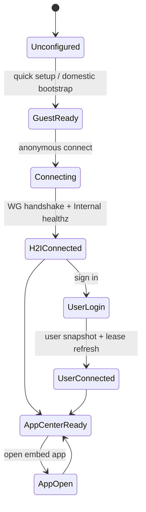

# MX-H2I Standalone Launcher Architecture

本文档定义新的 MX-H2I 客户端、Launcher standalone/embed 边界、AppCenter/H2O
接入方式、Mesh/IP 规划，以及本地开发、npm 发版和桌面打包方案。

## 结论

MX-H2I 应作为新的 H 端 standalone Launcher 项目，不建议继续把
`electron-demo/hdo` 改成 HDO 2.0。

原因：

- `electron-demo/hdo` 的历史主语是 HDO/H2O/Domestic 中心链路，代码里保留了旧的
  `100.88/100.89`、HDO 插件、Domestic 用户系统和 demo 兼容逻辑。
- 当前设计的主语已经变成 Internal 管理用户、权限、AppCenter、配置、发版、测试、
  审计和 Mesh；H 端需要的是更完整的 Launcher shell。
- `@qpjoy/electron-launcher` 已经拆出 `core`、`standalone`、`embed-sdk` 和产品门面，
  新项目可以直接消费这些包，避免 HDO 历史负担。

推荐定位：

| 名称 | 类型 | 责任 |
| --- | --- | --- |
| MX-H2I | standalone Launcher | H 端入口、登录、游客模式、WG/H2I、AppCenter host、更新器、权限执行 |
| AppCenter | embed app/runtime | 应用列表、安装、授权展示、打开应用、应用更新入口，默认复用 MX-H2I standalone 通道 |
| H2O | embed app | 类 Clash 应用，规则/订阅/节点/代理模式 UI，不直接拥有系统网络 |
| Luopan 等独立产品 | standalone 或 embed | 如果发布独立 standalone，则 embed app 可以选择复用 Luopan 通道；否则默认 embed 到 MX-H2I |

## 为什么 HDO 会安装 Launcher

`electron-demo/hdo` 安装 `@qpjoy/electron-launcher` 是为了验证“业务应用以 embed
方式消费 Launcher Network”的包边界。它不是新的 Launcher 底座。

截图里的 `ERR_PNPM_FETCH_404 @qpjoy/electron-launcher` 说明该包尚未发布到当前 npm
registry，或当前 token 没有权限。开发时应使用 workspace/tarball override；正式打包时
才切到已发布 npm 版本。HDO 已经有 `scripts/dev-mode.mjs` 做本地 tarball pack，但新
MX-H2I 应抽出一个通用 dev-mode/publish 流程，避免每个 demo 手写。

## 项目结构

现有包继续保留：

| 包 | 角色 |
| --- | --- |
| `@qpjoy/mx-launcher-core` | 协议、类型、快照、route plan、WG key、client |
| `@qpjoy/mx-launcher-standalone` | standalone shell SDK，默认产品为 `launcher`/`mx-h2i` |
| `@qpjoy/mx-launcher-embed-sdk` | AppCenter/H2O/Luopan embed 应用 SDK |
| `@qpjoy/electron-launcher` | 对外 npm 门面，隐藏 core/standalone/embed 拆分 |

建议新增：

```text
electron-dock/mx-launcher/
  apps/
    mx-h2i/
      package.json
      src/main.cjs
      src/preload.cjs
      src/renderer/
      electron-builder.config.cjs
      scripts/dev-mode.mjs
  packages/
    launcher-core/
    launcher-standalone/
    launcher-embed-sdk/
    electron-launcher/
    appcenter-embed-sdk/        # 可后续增加，专门给 AppCenter 应用协议
```

`apps/mx-h2i` 是可运行、可打包的 Electron 客户端；`packages/*` 只放可发布库。
如果必须全部放 `packages`，也应区分 `packages/mx-h2i-shell` 和真正的 Electron app。

## Frontend

MX-H2I 首屏是可用工具，不做营销页。视觉上参考给定设计：深色底、低饱和面板、青绿色
主按钮、左侧导航、卡片式 AppCenter 列表、登录/重置密码/更新弹窗。

核心状态机：



主要页面：

| 页面 | 内容 |
| --- | --- |
| Setup | 选择 Internal/Domestic 地址、快速设置、本机资源、自动更新 |
| Guest Connect | 游客模式，一键连接 Domestic relay |
| Login | 邮箱/手机号登录、记住登录、忘记密码、登录后刷新 user lease |
| Connected | 展示本机 IP、Internal 可达性、WG handshake、DNS/PAC/TUN 状态 |
| AppCenter | 类图 2/7，展示 H2O 等产品集合、安装/更新/打开/权限 |
| App Detail | 权限、版本、依赖 standalone 版本、网络能力、发布渠道 |
| Network | H2I 状态、route plan、诊断、重连、日志 |
| Settings | 更新、通道、代理、DNS、权限、设备绑定 |

AppCenter 和 H2O 默认是 embed，应使用系统 MX-H2I 的 Launcher runtime：

```ts
createElectronLauncher({
  baseUrl,
  productId: 'h2o',
  mode: 'embed',
  standaloneChannelProductId: 'launcher',
  hostVersionRange: '^0.1.0'
});
```

`standaloneChannelProductId` 和 `hostVersionRange` 需要作为 SDK/后端字段保留。embed
应用默认不新建 WG peer，不写系统网络，只拿所选 standalone channel 的 network context
和能力 token。AppCenter/H2O 默认选择 `launcher`，Luopan 的 embed 应用可以选择
`luopan`。

## Backend

Internal 是唯一真相：

| 模块 | 责任 |
| --- | --- |
| User Center | 匿名身份、账号登录、JWT、refresh、RBAC、设备绑定 |
| AppCenter | 应用目录、manifest、权限登记、安装状态、组织策略 |
| Launcher Network | Mesh、lease、snapshot、route plan、DNS/PAC/TUN 策略 |
| Config Center | signed snapshot、CoreDNS、mihomo/subscription、策略版本 |
| Release Center | Launcher/App 更新、灰度、回滚、artifact 签名 |
| Test Center | H/D/I/O 合成测试、gate、smoke、报告 |
| Site Slots | Domestic/Oversea profile、artifact、worker、evidence |
| Observability | 设备心跳、连接质量、审计、错误诊断 |

Domestic 是最小 edge：

| 能力 | 说明 |
| --- | --- |
| Public bootstrap/API proxy | H 端未连上 H2I 前，转发登录、enroll、snapshot |
| WireGuard relay | `mx-domestic`，默认 `10.88.0.1:51280` |
| H2I proxy/cache | 对 `10.88.88.88` 的 Internal API 做连通和可选缓存 |
| Snapshot cache | 缓存 Internal 签名快照，不拥有用户/权限真相 |
| Observability forwarder | 连接质量、worker report、edge health |

Domestic flow 的边界应固定为 CLI/runner 部署、WG relay 连通和 H2I 前置验证：

- Internal 通过 Site Slot/runner/CLI 下发 artifact、配置 `mx-domestic`、启动 `mx-domestic-edge`。
- Domestic gate 验证 `10.88.0.1`、`10.88.88.88`、WG handshake、healthz、DNS/proxy 前置条件。
- Domestic peer append 只消费已经存在的 standalone 客户端 lease，用于在 D 上追加 WG peer。
- Domestic 不定义 App name，不选择 embed/standalone 模式，不分配产品网段，也不承担用户/权限/AppCenter 真相。
- 产品定义、standalone/embed 关系、embed 选择哪个 standalone channel，放在 Product Registry/AppCenter 和 MX-H2I 客户端中完成。

V2 的 systemd/interface 命名应避免和旧 HDO 共用名称，保证同一台机器可以保留/迁移旧服务：

| 角色 | WireGuard interface / systemd unit | 说明 |
| --- | --- | --- |
| Domestic relay | `mx-domestic` / `wg-quick@mx-domestic` | 固定拥有 `10.88.0.1/16`，监听 UDP 51280 |
| Internal service peer | 逻辑名 `mx-internal-service-peer`，Linux interface `mx-internal-svc` / `wg-quick@mx-internal-svc` | 固定拥有 `10.88.88.88/32`，由 Internal 主动拨 Domestic endpoint；Linux interface 名必须不超过 15 字符 |
| 旧 HDO | `hdo-home`、`hdo-internal` / `wg-quick@hdo-*` | V1/V2 默认共存；确认不再需要后由 `bash scripts/manage.sh ops site-slot cleanup-v1-wireguard --apply` 显式清理 |

Internal 可以继续保留“节点/peer server”的语义，但不要再走普通 H 端用户登录模型。它应通过
Internal 自举 secret 或一次性 service token 生成 `mx-internal-service-peer.conf`，由 CLI/apply
脚本安装到 Internal runtime 主机。普通 MX-H2I/Luopan 客户端才使用 User Center 的匿名/账号
身份拿 `10.89.*`、`10.90.*` 等产品 lease。
`mx-internal-service-peer.conf` 不写 `DNS = ...`，避免 `wg-quick` 在宿主机上调用 `resolvconf`
改全局 DNS；V2 split DNS 由 Internal DNS/CoreDNS 统一发布。

Internal runtime 主机还需要和 Domestic 类似的 `qp-tunnel-cli egress-on`，但它使用
Oversea access 的 internal 账号 subscription，例如 `oversea-main-internal.yaml`。这条
egress-on 只负责 H2O/构建/外联 bootstrap 和 daemon proxy；`mx-internal-svc` 仍然是独立的
Domestic WG service peer，负责把 Internal 固定到 `10.88.88.88` 并访问 Domestic gateway
`10.88.0.1`。页面的 Install / Restart 顺序应是：先用 Internal subscription
`qp-tunnel-cli install --file ...`，再 `qp-tunnel-cli egress-on`，最后应用
`mx-internal-service-peer.conf`。

Internal API 可以跑在 k8s pod 里，但 WG runtime 必须跑在真实 Internal 宿主机上。当前
默认 host-runner 是 native runner：macOS 用 LaunchAgent，Ubuntu/Linux 用 systemd，
由 `bash scripts/manage.sh ops site-slot native-host-runner install 19190` 安装；k8s API
通过 `host.docker.internal:19190` 或部署环境提供的 native host URL 调用它。k8s
DaemonSet runner 只作为显式启用的 fallback 测试路径，因为 Docker Desktop/LinuxKit 里的
WireGuard namespace 不等价于 macOS 宿主机，不能用来证明 H2I 链路已在宿主机生效。
Domestic relay 已经建好后不要反复 New Plan；Internal public key 变化时只同步 Domestic
peer key，然后重新 Install / Restart Internal service peer。

H 端优先使用 H2I private API；不可达时回退 Domestic public bootstrap：

```text
MX-H2I -> Domestic public bootstrap -> Internal
MX-H2I -> Domestic WG relay -> 10.88.88.88 Internal private API
```

## V2 Internal DNS

V2 DNS authority 固定放在 Internal，不再把 Domestic 作为域名真相。Domestic 可保留
`dns-edge-cache`，但它只是 Internal 短暂不可达时的缓存，不分配或拥有 zone。

Internal K8s 运行 `mx-internal-coredns`，Config Center 生成 signed zone snapshot 并同步到
`mx-dns/coredns` ConfigMap。当前最小 zone 记录：

| 域名 | 目标 | 用途 |
| --- | --- | --- |
| `internal.mx` / `gateway.internal.mx` | `10.88.88.88` | H 端命中 split DNS 后优先走 Domestic WG allowIPs 到 Internal service peer |
| `dns.internal.mx` | `mx-internal-coredns.mx-dns.svc.cluster.local` | Internal K8s 内 DNS authority service discovery |
| `host-runner.internal.mx` | native host-runner URL 或显式 k8s fallback service | API pod 到真实宿主机 runner 的发现 |
| `service-peer.internal.mx` | `10.88.88.88` | Internal service peer 固定地址 |
| `domestic-relay.internal.mx` | `10.88.0.1` | Domestic WG gateway 固定地址 |

H 端策略是：`internal.mx`、`.internal.mx`、`.corp.mx`、`.h2i.mx` 命中 Internal DNS；
未命中域名按 system DNS / system proxy / H2O proxy / direct 的 fallback 顺序处理。
当前本地 Mac + Docker Desktop 中，host-runner DaemonSet 操作的是 LinuxKit node，不等于
Mac 宿主机；正式 Ubuntu 环境中也优先使用 native systemd runner，让 WireGuard、路由和
egress-on 都落在同一个真实 Internal runtime host 上。

## Mesh 和 IP 规划

推荐 v1 使用单 Domestic WG fabric，不按产品新起多个 `wg-quick@product`。

保留固定含义：

| 地址/段 | 含义 |
| --- | --- |
| `10.88.0.0/16` | Domestic relay fabric |
| `10.88.0.1` | 默认 Domestic gateway |
| `10.88.88.88` | Internal service peer 固定 IP |
| `10.88.100.x` | 产品 service VIP / gateway alias |
| `10.89.0.0/16` | MX-H2I standalone H 端 lease |
| `10.90.0.0/16+` | 非 MX-H2I 的独立 standalone 产品 lease，默认从 Luopan 类产品开始 |

MX-H2I：

- standalone namespace：`mx-h2i`
- Domestic gateway：`10.88.0.1`
- Internal fixed peer：`10.88.88.88`
- service VIP：`10.88.100.1`
- user lease：`10.89.0.1 - 10.89.99.254`
- anonymous lease：`10.89.100.1 - 10.89.254.254`

AppCenter/H2O：

- 默认 embed 到 `mx-h2i`
- 复用 MX-H2I 的 H 端 WG peer 和本机网络权限
- 可以有 app-level DNS/permission/rate-limit policy
- 默认不分配独立 H 端 lease
- 新增 embed app 可以选择依赖的 standalone channel，默认 `launcher`/MX-H2I

Luopan 这类独立产品：

- 如果只是 AppCenter 应用，做 embed，复用 `mx-h2i`
- 如果需要独立登录态、独立守护、独立更新器或隔离策略，做 standalone namespace
- Luopan 的 embed app 可以选择 `luopan` 作为 standalone channel
- v1 仍共用 `mx-domestic` 和 Internal `10.88.88.88`
- 可分配独立 gateway alias/service VIP，例如 `10.88.0.2` / `10.88.101.1`
- H 端 lease 使用独立段，未手填时默认从 `10.90.0.0/16` 开始

不推荐 v1 给 Luopan 新起 `wg-quick@Luopan` 或把 Internal 改成 `10.88.88.89`。那会让
端口、防火墙、DNS、路由、secret 轮转、观测和远端部署复杂化。只有在监管隔离、客户
专属物理网络或产品必须独立故障域时，才进入 v2 的 multi-fabric：

```text
mx-domestic          -> 10.88.0.1 / internal 10.88.88.88
mx-domestic-luopan   -> 10.92.0.1 / internal 10.92.88.88
```

后台新建 Mesh 时应根据 `networkAuthority` 分配资源：

| 字段 | 说明 |
| --- | --- |
| `meshId` | Mesh 标识 |
| `standaloneProductId` | 拥有 standalone 的产品，如 `mx-h2i`、`luopan` |
| `standaloneChannelProductId` | embed 依赖的 standalone，默认 `launcher`/MX-H2I；独立产品如 Luopan 可选 `luopan` |
| `mode` | `standalone` 或 `embed` |
| `fabricId` | 默认 `domestic-main` 的 `mx-domestic` |
| `domesticGatewayIp` | gateway 或 gateway alias |
| `internalServiceIp` | 默认 `10.88.88.88` |
| `serviceVip` | 产品服务入口 |
| `userCidr` / `anonymousCidr` | H 端租约段 |
| `requiredHostVersion` | embed 依赖 standalone 版本 |
| `requiredCapabilities` | network/auth/update/appcenter 权限能力 |

## 当前下一步

当前 Domestic 已有 `mx-domestic-edge` 和 worker passed report，但 WG 没闭环。下一步应
先做 Internal service peer join，再做 MX-H2I 客户端。

短期交付顺序：

1. 增加 Internal join relay action：在 Internal 侧应用 `mx-internal-service-peer.conf`，
   启动/刷新本机 peer，并主动拨 Domestic endpoint。执行前先确认 Internal runtime 主机已经
   通过 `qp-tunnel-cli egress-on` 启用 H2O/外联 bootstrap；正式 Ubuntu 使用 Linux systemd
   路径，本地 Mac 只验证 `@qpjoy/electron-core-wireguard` 的 WG/launchd 路径。
   本地/目标机可先用
   `bash scripts/manage.sh ops site-slot internal-service-peer-handoff status`
   检查 artifact、`qp-tunnel-cli`、以及 `@qpjoy/electron-core-wireguard` runtime 是否存在；只有在真正的 Internal runtime host 上才执行
   `bash scripts/manage.sh ops site-slot internal-service-peer-handoff apply`。
2. 把 Domestic ready gate 从“报告通过”升级为“有 endpoint/latest handshake，且
   `curl http://10.88.88.88:18090/healthz` 成功”。
3. 把当前 admin UI 的 Launcher smoke 固定为 MX-H2I/Launcher standalone；Domestic
   peer append 从基础 setup 主线移出，只在真实 standalone 客户端 lease 已存在后作为高级动作使用。
4. 新增 `apps/mx-h2i`，先做 Setup、Guest Connect、Connected、AppCenter 四个页面。
5. 扩展 SDK 和后端产品模型，加入 `hostProductId`、`hostVersionRange`、
   `networkNamespace`、`requiredCapabilities`。
6. AppCenter/H2O 改成 embed 读取系统 MX-H2I runtime context。

## 本地开发

开发模式分三层：

| 模式 | 用途 |
| --- | --- |
| workspace | mx-launcher 内部开发，依赖写 `workspace:*` |
| local-pack | 跨 repo demo，例如 HDO/H2O，用 `pnpm pack` tarball override |
| npm | 打包/用户安装，全部依赖 registry 上已发布版本 |

建议脚本：

```bash
pnpm --dir electron-dock/mx-launcher install
pnpm --dir electron-dock/mx-launcher build:packages
pnpm --dir electron-dock/mx-launcher/server dev
pnpm --dir electron-dock/mx-launcher/apps/mx-h2i dev
```

MX-H2I 的 `scripts/dev-mode.mjs` 应复用 HDO 的思想：

- `local`：构建 `packages/*`，`pnpm pack` 到 `.local-packs`，写入 pnpm overrides。
- `npm`：移除本地 tarball，恢复 npm 版本。
- `check`：确认 `@qpjoy/electron-launcher`、core、standalone、embed-sdk 版本一致。

## npm 发版

发版顺序：

```text
@qpjoy/mx-launcher-core
@qpjoy/mx-launcher-embed-sdk
@qpjoy/mx-launcher-standalone
@qpjoy/electron-launcher
@qpjoy/mx-h2i-appcenter-sdk      # 后续可选
```

`@qpjoy/electron-launcher` 是对外稳定入口。业务应用优先只依赖它，不直接依赖 core。
如果 registry 还没有包，`pnpm i` 出现 404 是预期问题，应使用 local-pack 或先发布私有
npm 包。

## 桌面打包

MX-H2I Electron 包：

- macOS：DMG/ZIP，签名、公证，后续接 privileged helper。
- Windows：NSIS/portable，后续接 Windows service/UAC。
- Linux：AppImage/deb 可后置。

打包前必须：

1. 切换 `dev-mode npm`，确保所有 `@qpjoy/*` 包从 registry 安装。
2. 执行 `pnpm build:packages` 和 MX-H2I `check`。
3. 校验 app manifest、artifact hash、签名和 update metadata。
4. 生成 release report，写入 Release Center。

## 兼容策略

`electron-demo/hdo` 保留为兼容 demo：

- 用来验证 embed 应用如何调用 `@qpjoy/electron-launcher`。
- 不再承载新 Launcher shell 设计。
- 旧 `100.88/100.89` 文案逐步替换为 current `10.88/10.89` 或标记 legacy。
- H2O 可从 HDO demo 中抽 UI/业务经验，但网络主权迁到 MX-H2I。
