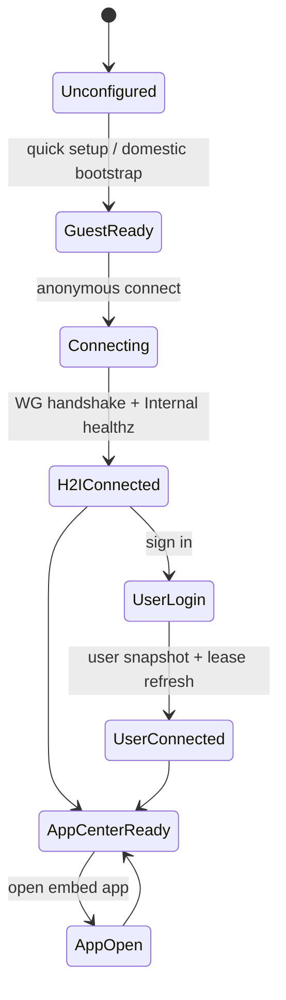

# MX-H2I Product on MX-Launcher Architecture

本文档定义新的 MX-H2I 客户端、Launcher standalone/embed 两种运行模式、AppCenter/H2O
接入方式、Mesh/IP 规划，以及本地开发、npm 发版和桌面打包方案。

## 结论

MX-H2I 应作为新的 H 端 VPN 产品，并使用 Launcher standalone 模式，不建议继续把
`electron-demo/hdo` 改成 HDO 2.0。

原因：

- `electron-demo/hdo` 的历史主语是 HDO/H2O/Domestic 中心链路，代码里保留了旧的
  `100.88/100.89`、HDO 插件、Domestic 用户系统和 demo 兼容逻辑。
- 当前设计的主语已经变成 Internal 管理用户、权限、AppCenter、配置、发版、测试、
  审计和 Mesh；H 端需要的是更完整的 Launcher shell。
- `@qpjoy/electron-launcher` 已经拆出 `core`、`standalone`、`embed-sdk` 和产品门面，
  新项目可以直接消费这些包，避免 HDO 历史负担。

推荐定位：

| 名称 | 类型 | 责任 |
| --- | --- | --- |
| MX-H2I | VPN 产品，Launcher standalone 模式 | H 端入口、登录、游客模式、WG/H2I、AppCenter host、更新器、权限执行 |
| AppCenter | 产品/host，Launcher embed 模式 | 应用列表、安装、授权展示、打开应用、应用更新入口，默认复用 MX-H2I 的 Launcher standalone 通道 |
| H2O | 产品，Launcher embed 模式 | 类 Clash 应用，规则/订阅/节点/代理模式 UI，不直接拥有系统网络 |
| Luopan 等独立产品 | 产品，可选 Launcher standalone 或 embed 模式 | 如果作为独立 Launcher standalone 通道发布，则拥有自己的 ProductNetwork、lease/IP 段和 WG；如果作为 embed 发布，才选择复用某个 standalone 通道 |

## 为什么 HDO 会安装 Launcher

`electron-demo/hdo` 安装 `@qpjoy/electron-launcher` 是为了验证“业务应用以 embed
方式消费 Launcher Network”的包边界。它不是新的 Launcher 底座。

截图里的 `ERR_PNPM_FETCH_404 @qpjoy/electron-launcher` 说明该包尚未发布到当前 npm
registry，或当前 token 没有权限。开发时应使用 workspace/tarball override；正式打包时
才切到已发布 npm 版本。HDO 已经有 `scripts/dev-mode.mjs` 做本地 tarball pack，但新
MX-H2I 应抽出一个通用 dev-mode/publish 流程，避免每个 demo 手写。

## 项目结构

现有包继续保留：

| 包 | 角色 |
| --- | --- |
| `@qpjoy/mx-launcher-core` | 协议、类型、快照、route plan、WG key、client |
| `@qpjoy/mx-launcher-standalone` | Launcher standalone 模式 SDK，默认承载 `mx-h2i` 产品 |
| `@qpjoy/mx-launcher-embed-sdk` | AppCenter/H2O/Luopan embed 应用 SDK |
| `@qpjoy/electron-launcher` | 对外 npm 门面，隐藏 core/standalone/embed 拆分 |

建议新增：

```text
electron-dock/mx-launcher/
  apps/
    mx-h2i/
      package.json
      src/main.cjs
      src/preload.cjs
      src/renderer/
      electron-builder.config.cjs
      scripts/dev-mode.mjs
  packages/
    launcher-core/
    launcher-standalone/
    launcher-embed-sdk/
    electron-launcher/
    appcenter-embed-sdk/        # 可后续增加，专门给 AppCenter 应用协议
```

`apps/mx-h2i` 是可运行、可打包的 Electron 客户端；`packages/*` 只放可发布库。
如果必须全部放 `packages`，也应区分 `packages/mx-h2i-shell` 和真正的 Electron app。

## Launcher Foundation

Launcher 是所有 MX 产品共同依赖的功能底座，不等同于 MX-H2I。MX-H2I 是一个 VPN 产品，
它选择 Launcher standalone 模式来拥有本机网络主权；AppCenter、H2O 等产品通常选择
Launcher embed 模式来消费已有能力。

Launcher 必须解决两个问题：

- embed 足够轻：业务应用不重复安装 native helper、不申请 TUN/WG/DNS 权限、不自建更新器。
- 同机不打架：多个 standalone 产品共存时，各自保留独立 ProductNetwork、lease/IP 段和
  WG profile；共享的只是本机 ownership registry / local edge / resolver 这类系统级协调面。
  embed 产品通过 broker 申请能力、读取上下文和拿 scoped token。
- 产品不互相兜底：`shared owner` 不能语义上落到 MX-H2I、Luopan 或第一个启动的产品上；
  它只能是 Launcher foundation 的产品无关本机服务，或服务端把共享能力 materialize 到各产品
  自己的地址段后再由产品 WG 承载。否则关闭任意一个 standalone 产品仍会影响其它产品。

如果 Luopan 只安装 `10.91.*` 和 `10.88.100.3/32`，它就不能再直接依赖 H2I 的
`10.88.88.88` 路由。要保持产品独立，只有两种合法路径：服务端把
Internal control/DNS/proxy materialize 到 Luopan 自己的产品地址或 service VIP 下；或者本机
`launcher-foundation` 作为产品无关的 shared foundation plane，单独承载
`10.88.88.88/32`、`10.88.0.1/32` 这类公共地址，并按所有 standalone 产品的声明做引用计数。

当前主线选择第一种：**product-scoped materialization**。但落地必须分两层：

- Foundation 兼容层：MX-H2I / `launcher-foundation` 在迁移期仍使用已经在线的
  `10.88.88.88` Internal service peer 和 `10.88.0.1` Domestic relay/DNS 地址，并安装这些
  `/32` priority route 来压过 Clash TUN。这是恢复现网 H2I 的兼容路径，不是新产品依赖。
- Product materialization 层：Luopan、未来 H2O standalone 等新 standalone 产品只安装自己的
  lease CIDR 和产品 service VIP `/32`。Internal control/DNS/proxy/user/permission/release
  能力由服务端 materialize 到该产品 VIP 后再对外可用。

因此 `10.88.0.1` 和 `10.88.88.88` 可以继续作为 Domestic/Internal 站点内部实现地址或
H2I/foundation 迁移期诊断地址，但不能作为所有 standalone 客户端都重复安装的共享路由。
客户端看到的是自己 channel 的 materialized VIP；只有 H2I/foundation 例外保留旧 foundation
地址，直到 `10.88.100.1` 也完成同等健康验证：

| 产品/channel | lease CIDR | materialized VIP | 客户端必须安装的路由 |
| --- | --- | --- | --- |
| MX-H2I / launcher-foundation | `10.89.0.0/16` | `10.88.100.1` | `10.89.0.0/16` + `10.88.100.1/32` + `10.88.88.88/32` + `10.88.0.1/32` |
| Luopan standalone | `10.91.0.0/16` | `10.88.100.3` | `10.91.0.0/16` + `10.88.100.3/32` |
| H2O embed on MX-H2I | 不新建本机 WG | `10.88.100.1` | 由 MX-H2I channel 提供 |
| H2O embed on Luopan | 不新建本机 WG | `10.88.100.3` | 由 Luopan channel 提供 |

Save App / Upsert ProductNetwork 需要自动写入这些字段：`serviceVip`、`internalControlIp`、
`domesticGatewayIp`、`dnsServer`。新 standalone 产品默认四者都等于该 standalone channel 的
materialized VIP；后续如果产品需要拆分 control/DNS/proxy，也可以显式配置成同一产品下的
多个 `/32`。MX-H2I / `launcher-foundation` 是兼容例外：Save App 不能把它们自动改成
`10.88.100.1` 控制面，除非服务端已经证明 `10.88.100.1:18090/healthz`、DNS 和 proxy 都
materialize 完成。

服务端 materialization 的职责：

- CoreDNS / gateway route：应用域名 A 记录指向所选 standalone channel 的
  `internalControlIp`，gateway 按 Host/path 反代到 app 的 `targetUrl`。
- Internal service peer：为每个 standalone channel materialize `internalControlIp`、
  `serviceVip`、`dnsServer`、`domesticGatewayIp` 这些产品 VIP `/32`，并把它们接入同一个
  Internal gateway/control/DNS 实现。
- Domestic relay：站点内部仍可使用 `10.88.0.1` 作为真实 WG relay gateway，但对 H 端只需要
  转发产品 CIDR 和产品 VIP `/32`；`productRelayCidrs` 在落地配置里同时包含 lease `/16`
  和 service/control/DNS VIP `/32`，不要要求 H 端安装 `10.88.0.0/16`。
- 限速/审计/灰度：按 `productId`、`standaloneChannelProductId`、产品 lease CIDR 和产品 VIP
  归因。这样 H2I、Luopan、未来 H2O standalone 的流量天然可分开限速和诊断。

客户端 routePlan 的不变量：

- 新 standalone 的 `routeCidrs` 只包含当前 lease product 的 user/anonymous CIDR 和
  materialized VIP `/32`；H2I/foundation 迁移期可额外包含 `10.88.88.88/32` 和
  `10.88.0.1/32`。
- `internalBaseUrl` 使用 `http://{internalControlIp}:18090`。Luopan 这类产品应是自己的
  service VIP；MX-H2I/foundation 迁移期仍是 `http://10.88.88.88:18090`。
- `dnsServer` 使用产品 `dnsServer`，默认就是产品 VIP；WireGuard DNS 仍可被
  system-domain-proxy suppress，但 split DNS/PAC 的上游目标也应是产品 VIP。H2I/foundation
  迁移期继续使用 `10.88.0.1`。
- product WG 的 connect/disconnect 只安装/释放本产品路由；关闭 Luopan 不会删除 MX-H2I 的
  `10.89.*` 或 `10.88.100.1/32`，关闭 MX-H2I 也不会删除 Luopan 的 `10.91.*` 或
  `10.88.100.3/32`。

Clash 兼容也按这个边界处理：虚拟网卡模式下，客户端只对产品 VIP `/32` 和产品 CIDR 写更具体
路由来压过 Clash TUN；系统代理模式下，PAC/split DNS 只把产品域名引到产品 VIP。两种模式都不
再通过共享 `10.88.0.1` 抢 DNS，也不通过共享 `10.88.88.88` 抢 Internal route。

### 运行模式

| 模式 | 进程/权限 | 网络主权 | 适用产品 |
| --- | --- | --- | --- |
| `standalone` | Electron shell + Launcher host/broker + 可选 native helper | 可以拥有 WG/TUN/DNS/route、peer lease、更新器和本地权限 broker | MX-H2I、独立 Luopan |
| `embed` | 轻量 SDK + app-scoped IPC/client | 不直接改系统网络，不分配 WG peer；复用 `standaloneChannelProductId` 指向的 channel | AppCenter、H2O、嵌入式业务应用 |

### 本机能力仲裁

Launcher standalone 在本机启动一个能力 broker，embed 只和 broker 交互。broker 需要按
`productId`、`standaloneChannelProductId`、`installId` 和 `userId` 管理作用域：

| 能力 | standalone owner | embed 行为 | 防冲突规则 |
| --- | --- | --- | --- |
| WG/TUN/route | 拥有本产品接口、AllowedIPs、端口和 route table | 只读 network context，发起 connect/disconnect 请求 | 同一 channel 只有一个 network owner；不同 standalone channel 不互相 adopt route CIDR |
| Split DNS/PAC | 生成或登记本产品 DNS/PAC/mihomo 需求 | 提交 app-level DNS/代理需求 | broker/registry 合并系统级策略并保留 evidence；embed 不直接写系统 DNS |
| Auth/User | 维护匿名身份、登录态、refresh token、设备绑定 | 申请 app-scoped token 和 permission decision | token audience 绑定 app/product，不能跨 app 复用 |
| Release/Gray | 管理底座和 standalone shell 更新 | 读取自身 update decision，触发 app update | 单机一个 update scheduler；每个 app 有独立 channel/skip/force 策略 |
| Storage/Logs | 维护 runtime、cache、diagnostics | 写入 app namespace 下的日志和缓存 | 路径按 product 隔离，broker 汇总到 observability |
| Native Permission | 安装/升级 helper、申请系统权限 | 只能请求 capability，不直接提权 | helper 版本和签名由 standalone 校验 |

建议本机目录和 socket 也按这个边界命名：

```text
~/.qpjoy/mx-launcher/runtime/{standaloneChannelProductId}/
~/.qpjoy/mx-launcher/products/{productId}/
~/.qpjoy/mx-launcher/sockets/{standaloneChannelProductId}.sock
~/.qpjoy/mx-launcher/logs/{productId}/
```

本机共享文件只保存“谁声明了什么资源”的事实，不改变任何产品的服务端 routePlan。默认路径是
用户态、权限收敛的 registry，例如 macOS：

```text
~/Library/Application Support/QPJoy/Electron Launcher/standalone-ownership.json
```

每个 standalone launcher 启动/重连时写入自己的 owner claim；断开时只释放自己的 claim。
claim 可以包含 `dnsHosts`、`dnsZones`、`reverseProxyRoutes` 和产品自己的 `routeCidrs`
（通常是注册时固定的 product lease CIDR）。其它 standalone 可以读取它做冲突诊断、local edge
合并和 UI evidence，但不能把这些 CIDR 合并进自己的 WG `AllowedIPs`。例如 Luopan 注册
`10.91.0.0/16` 后，MX-H2I 只能在 diagnostics 里看到 Luopan claim，不能在重连时把
`10.91.0.0/16` adopt 到 MX-H2I 的 routePlan。

### Admin 产品模型

Product Registry 不应把 `launcher` 当业务产品。它应登记业务产品如何依赖 Launcher：

| 字段 | 说明 |
| --- | --- |
| `productId` | 业务产品 ID，例如 `mx-h2i`、`appcenter`、`h2o`、`luopan` |
| `displayName` | 产品名 |
| `launcherMode` / `mode` | Launcher 运行模式：`standalone` 或 `embed` |
| `standaloneChannelProductId` | embed 依赖的 Launcher standalone channel；使用 standalone 模式的产品等于自身 |
| `networkScope` | 本机网络所有权：`owner` 或 `broker-session` |
| `networkPolicy` | standalone owner 的 lease 段、service VIP、DNS/proxy/TUN 权限；embed 只保留服务端路由/绑定元数据 |
| `permissionManifest` | 产品暴露的功能、scope、resource/action |
| `releasePolicy` | 版本、灰度、强制/可跳过、回滚策略 |
| `runtimeIsolation` | storage/socket/protocol/port namespace |

校验规则：

- 使用 MX-Launcher 网络或服务器能力的产品必须声明 Launcher 模式。
- `embed` 产品必须依赖一个 enabled 的 `standaloneChannelProductId`，默认 `mx-h2i`。
- 只有 `standalone` channel 分配 H 端 peer lease；`embed` 产品的 `networkScope` 固定为
  `broker-session`，返回 channel context。AppCenter/H2O 可有 DNS/gateway service context，
  但这不是本机 WG peer IP。
- 同一台机器允许多个 Launcher standalone channel；每个 channel 的 ProductNetwork、lease/IP
  段和 WG profile 独立。系统 DNS/PAC/local edge 这种公共配置通过 ownership registry 合并，
  断开一个应用只释放它自己的 claim，不能删除或改写其它 standalone 的 claim。
- npm 包只提供 SDK 能力，不等于入网授权。`/internal/v1/launcher-network/enrollments`
  必须校验 ProductNetwork 和 AppCenter app 都已启用，并且 app 具备
  `launcher-network` + `launcher-standalone` 或 `launcher-network` + `launcher-embed-sdk`
  capability；未注册 app/product 默认拒绝。
- 开发和 SDK smoke 可以通过服务端 `MX_LAUNCHER_NETWORK_SDK_TEST_MODE=1` 打开测试模式，
  再由请求显式传 `sdkTestMode` 或 test requestedBy 走旧的临时 product fallback；生产默认关闭。

默认 App Registry：

- `mx-h2i`、`appcenter`、`h2o` 是系统内置 App，启动时自动初始化到 DB。
- 三者在 Admin 左侧应用导航中同级展示；App 分组可以收起。
- 内置 App 可以编辑展示/策略元信息，但不能删除；自定义 App 支持新增、编辑、删除。
- Admin 创建或更新 embed App 时必须沉淀 `manifest`，字段至少包含
  `launcherMode=embed`、`runtimeContractVersion`、`network.scope=broker-session`、
  `embed.standaloneChannelProductId` 和 `requiredCapabilities`。这份 manifest 是
  AppCenter 列表、客户端安装缓存、灰度策略和 SDK runtime 握手的共同契约。
- H2O 内置为 `Home To Oversea`，默认 package 为
  `@qpjoy/electron-launcher-app-h2o`，作为 AppCenter 内置的类 Clash 网络应用；它通过
  `mx-h2i` broker 读取 PAC、Split DNS、代理规则、Internal/Oversea 状态，不单独申请 H 端
  WG lease。
- `/admin` 的 Launcher service VIP smoke 对 embed App 额外校验 manifest、broker channel、
  DNS/gateway 和 Domestic relay 覆盖。manifest 不完整时，后台应提示先修正 AppCenter 注册，
  而不是让用户端自行猜测是否需要网络 IP。
- `mx-h2i` 使用 Launcher `standalone` 模式；`appcenter`、`h2o` 默认使用 `embed` 并依赖 `mx-h2i`。

## Frontend

MX-H2I 首屏是可用工具，不做营销页。视觉上参考给定设计：深色底、低饱和面板、青绿色
主按钮、左侧导航、卡片式 AppCenter 列表、登录/重置密码/更新弹窗。

核心状态机：



主要页面：

| 页面 | 内容 |
| --- | --- |
| Setup | 选择 Internal/Domestic 地址、快速设置、本机资源、自动更新 |
| Guest Connect | 游客模式，一键连接 Domestic relay |
| Login | 邮箱/手机号登录、记住登录、忘记密码、登录后续租固定 user lease |
| Connected | 展示本机 IP、Internal 可达性、WG handshake、DNS/PAC/TUN 状态 |
| AppCenter | 类图 2/7，展示 H2O 等产品集合、安装/更新/打开/权限 |
| App Detail | 权限、版本、依赖 standalone 版本、网络能力、发布渠道 |
| Network | H2I 状态、route plan、诊断、重连、日志 |
| Settings | 更新、通道、代理、DNS、权限、设备绑定 |

AppCenter 和 H2O 默认是 embed，应使用系统 MX-H2I 的 Launcher runtime：

IP lease 采用接近 DHCP 的稳定租约策略：同一安装的访客 lease、同一账号的 user lease
会在连接/登录时续租并保留固定 IP；退出 MX-H2I 或从访客切到员工只断开本地 runtime，
不立即释放 IP。默认半年未续租后才进入可回收池，管理员仍可通过 release 接口做显式回收。
lease key 以 standalone product 为边界，再区分 `anonymous` / `user`：访客 lease 按安装
固定，账号 lease 按账号加安装固定。因此 MX-H2I 和 Luopan 的 standalone 池互不影响，
同一个 MX-H2I 安装上的访客 IP 和员工 IP 也互不影响。

```ts
createElectronLauncher({
  baseUrl,
  productId: 'h2o',
  mode: 'embed',
  standaloneChannelProductId: 'mx-h2i',
  hostVersionRange: '^0.1.0'
});
```

`standaloneChannelProductId` 和 `hostVersionRange` 需要作为 SDK/后端字段保留。embed
应用默认不新建 WG peer，不写系统网络，只拿所选 Launcher standalone channel 的 network context
和能力 token。AppCenter/H2O 默认选择 `mx-h2i`，Luopan 的 embed 应用可以选择
`luopan`。

### WireGuard client runtime

V2 不再让 MX-H2I 直接依赖旧的 `@qpjoy/electron-plugin-hdo` 业务插件。客户端 WG 能力从
`@qpjoy/electron-core-wireguard` 复用，并通过 `@qpjoy/electron-launcher/wireguard`
暴露为 Launcher 底座的一部分：

- `connectNetwork()` 只负责向 Internal 拿 lease、snapshot 和 routePlan。
- `connectLauncherWireGuardPeer()` 用 routePlan、客户端 keyPair、Domestic relay 公钥/endpoint
  生成本机 WG profile，并启动客户端 tunnel。
- MX-H2I 只有在 WG tunnel active、到 `routePlan.internalControlIp` 的 route probe 走 WG interface、
  且 overlay `healthz` 成功后，才把 runtime 升级为 `connected`。
- 如果只拿到 lease，或因为同机 Internal 本地路由冲突导致 route probe 不走 WG，客户端保持
  `lease-only`，AppCenter/H2O 不会被误认为已经具备内网通路。
- Electron 打包时必须把 `wireguard-engines/*/resources/wireguard` 复制到 app
  `resources/wireguard`，运行时优先从这个目录安装 `wg` / `wireguard-go`。

V2 路由和 DNS 需要分层处理，不能把 bootstrap endpoint、overlay endpoint 和应用域名解析
混在一起：

| 层 | 用途 | 规则 |
| --- | --- | --- |
| Bootstrap API | 登录、拿 lease、拿 routePlan | 可以是本机 `127.0.0.1`、公网 gateway 或运维端口；不证明 H2I 已通 |
| Overlay Internal IP | H2I 到 Internal peer server | 使用 routePlan 的 `internalControlIp`；新产品默认是 channel service VIP，`10.88.88.88` 只保留为 legacy/shared foundation 地址 |
| Split DNS | app 域名、k8s/service 域名 | 在 WG 已通之后再启用；DNS server 使用 routePlan 的 product `dnsServer`，查询路径必须走当前产品 WG route |
| 系统代理/Fake IP | Clash/mihomo/TUN | 不能作为 H2I 成功证据；`198.18.0.0/15`、非 MX-H2I `utun` 或 `lo0` 都应判为 not ready |

### DNS / PAC ownership 和本机 resolver 策略

V2 的长期形态是 Internal admin 管理 `launcher-network/products`、DNS routes 和 reverse
proxy routes；客户端只消费 snapshot，并把本机网络修改收敛到一个 Launcher local edge。
当前共存期 Domestic `:53` 仍可能由 HDO V1 服务，因此 MX-H2I 必须兼容“远端 DNS 还是
V1，但本机 V2 已能根据 Internal route/ownership claim 直接回答已知 host”的模式。

推荐优先级：

1. 命中当前 Launcher ownership registry 的 exact host 或 DNS zone：本机 local DNS edge
   直接返回 owner 的 gateway/control IP，例如 `h2i.mxinfo-inc.cn -> 10.88.88.88`。
2. 命中 V2 DNS route 且有 `dnsTarget`：本机 edge 直接返回 route 目标，PAC/HTTP proxy
   再按 `upstreamUrl` 反代到 Internal nginx/Caddy 或实际服务端口。
3. 命中 split DNS zone 但本机没有直接答案：转发到 routePlan 下发的 Internal/Domestic
   DNS server，通常是 `10.88.0.1:53` 或迁移期 Domestic `:53`。
4. 未命中 Launcher 白名单：回落原系统 PAC/系统 DNS/用户代理；Clash/mihomo fake-ip 的
   `198.18.0.0/15` 只能说明代理接管，不作为 Internal 解析成功。

客户端不应把 `/etc/hosts` 作为产品路径。写 hosts 容易触发 EDR/杀毒软件告警，也难以表达
zone、TTL、owner 和恢复状态。macOS 默认使用 SystemConfiguration dynamic supplemental
DNS，把目标域名指到 `127.0.0.1:{localEdgePort}`；`/etc/resolver` 文件模式只保留为旧版本
清理或显式 fallback，不作为 MX-H2I 默认路径。旧 `/etc/resolver` 只有在能识别为
`MX_ELECTRON_LAUNCHER_RESOLVER` marker 的情况下自动清理；不能盲删 HDO V1 正在使用的文件。

本机 DNS edge 是用户态 loopback 进程，不安装系统级 DNS 服务，也不监听公网地址。它的职责是：

- 把 PAC、HTTP/CONNECT proxy、UDP DNS relay 放在同一个固定端口，减少端口和权限面。
- 在 V1/V2 共存时，本机优先回答 V2 ownership claim 里的 host/zone，避免完全依赖 V1
  Domestic DNS 是否已有记录。
- 合并多个 Launcher standalone/app 的 DNS zone、reverse proxy route 和系统级 resolver/PAC
  需求，并在 registry 中暴露 owner 和 conflict evidence。registry 里的 route CIDR 是产品
  ownership 证据，不是其它 WG owner 的 AllowedIPs 输入。
- 关闭某个 launcher 时只释放自己的 owner claim；如果还有其它 owner，保留 local edge 和
  系统 resolver。

Windows 后续不应写 hosts；应优先走受控 helper/service 管理 NRPT、WinHTTP/WinINET PAC
和 WireGuard route。macOS 和 Windows 都需要代码签名、notarization/可信 publisher、清晰的
权限说明和可诊断的 restore 按钮，降低安全软件误报概率。

MX-H2I 客户端连接分两个阶段：

1. Bootstrap 阶段：客户端还没有 WG route，只能访问 Domestic 公网 IP/公网域名。Domestic
   作为公网 facade 转发到 Internal 的 gateway 接口，供 H 端登录、申请 lease、拉 routePlan。
2. Overlay 阶段：客户端 WG 已连上 Domestic relay 后，Internal API 和后续应用流量走
   routePlan 下发的 `internalControlIp`。新产品默认是自己的 channel service VIP，例如
   Luopan `10.88.100.3`；MX-H2I / `launcher-foundation` 在迁移期继续使用
   `10.88.88.88`，直到 `10.88.100.1` 的 service materialization 通过健康验证。

`H2I direct endpoint is not configured in routePlan` 只表示 Internal direct peer
没有在 Config Center 打开，默认 `auto` 会走 Domestic relay 的 `hdi-relay` 路径，不应直接判定
MX-H2I 不通。真正的 H2I ready 证据是：客户端 tunnel active、`route -n get
<routePlan.internalControlIp>` 命中 MX-H2I 自己的 WG interface，且
`curl http://<routePlan.internalControlIp>:18090/healthz` 成功。
`hdi-relay` 是 H2I 的 Domestic relay 数据路径，含义是 H -> Domestic -> Internal；它和
`h2i-direct` 的区别是是否绕过 Domestic relay 直连 Internal，不是 H2I 能力是否存在。
如果 relay healthz 已 passed 但客户端仍是 `tunnel-only / blocked`，优先看 route proof 是否被
`lo0`、其它 `utun` 或系统代理抢走。
产品 service VIP 例如 `10.88.100.3` 的本地第一层证据是 route proof 命中当前产品 WG
interface，不是 ICMP ping 必须成功；很多 k8s/VIP/L4 场景不会响应 ping。但 route proof
只能证明本机路由没有被 Clash 或其它 utun 抢走，不能证明服务端已经 materialize。最终 ready
还必须通过 `http://<serviceVip>:18090/healthz`、DNS route 或等价 HTTP smoke 验证。
如果 route proof 成功但 HTTP health timeout，UI 应显示 `service-unreachable` /
`data-plane-pending`，提示执行 Domestic relay / Internal service-peer materialization，而不是
宣称 `network-ready`。
独立 standalone 产品默认只安装自己的 lease CIDR 和 materialized product VIP `/32`；公共 foundation
地址如 `10.88.0.1`、`10.88.88.88`、`10.88.0.0/16` 不能由每个产品 WG 重复安装，否则
macOS 全局路由表会让后启动的 utun 抢走前一个产品的 Internal route。公共 DNS/control
默认应 materialize 到每个产品自己的 VIP；只有 legacy/fallback 场景才由 local edge 或显式
shared foundation owner 协调。shared owner 必须是产品无关的 Launcher foundation 服务，
不能是“当前正好在线的某个 standalone 产品”。
`standalone-ownership.json` 可以作为这个协调面的 desired-state 文件，但不能只是由每个
产品直接覆盖写 route。每个 standalone 产品写入自己的 claim：`productId`、`installId`、
`pid`/heartbeat、product route CIDR、service VIP `/32`、需要的 foundation capability。
`launcher-foundation` 持文件锁读取 claims，清理 stale owner，计算 refcount，并只由它安装或
释放共享 foundation routes/DNS/PAC。产品断开时只释放自己的 claim 和产品 WG；只要还有其它
claim 需要 foundation，`10.88.88.88/32`、`10.88.0.1/32` 就继续由 shared foundation plane
保持。最后一个 claim 释放后，foundation plane 才卸载共享路由和系统 DNS/PAC。
文件是仲裁输入，不是系统网络状态本身；系统网络状态必须由一个 reconciler 统一 apply，避免
两个产品同时写文件后仍然各自抢 macOS 全局路由表。
如果同一台 Mac 同时运行 Internal service peer 和 MX-H2I 客户端，`ping 10.88.88.88`
可能比 `ping 10.88.0.1` 快很多，因为 `10.88.88.88` 是本机地址并走 `lo0`；这说明
Internal service peer 本机存在，不等于完整 H -> Domestic relay -> Internal 的 H2I 路径已经由
这台客户端证明。此时 UI 的 `local-route` / `lo0` 是 route proof 被本机覆盖，不是 Domestic
relay 或 Internal service peer 阻塞。完整 H2I 证明需要另一台 H 端、VM 或临时去掉本机
`10.88.88.88` host route 后再测。

Domestic edge 对外端口和 Internal gateway 端口不要混用：

- `18090` 是当前 V2 Domestic edge 对外 bootstrap 端口，容器内 Caddy 仍监听 `8088`；
  Docker 端口映射为 `MX_DOMESTIC_EDGE_PORT:8088`，正式环境可以换成 `443`。
- `18090` 是 Internal gateway/k8s Service 端口，只应被 Internal 本机、Internal service peer
  或 Domestic edge 上游访问。
- V1 HDO 的 `100.89.*:80` nginx 默认页和 `100.89.*:8080/login` OpenVPN UI 不是 V2 成功
  判据。V2 访问 `10.88.88.88:8080` 返回 `{"error":"not found","path":"/"}` 只能说明该端口有
  其它 HTTP 服务响应；访问 `10.88.88.88` 80 端口 refused 也只是没有监听 80。V2 应验证
  `10.88.88.88:18090/healthz` 和 `/internal/*`。
- `18090` 是控制面和 Internal app 域名的默认 HTTP gateway，不是所有内网服务的强制数据面。
  直接访问 `10.88.*`/`10.89.*` 上明确暴露的 IP:port 仍可走 WG 路由；只有 k8s service 域名、
  AppCenter app 域名、需要鉴权/观测/统一证书的 HTTP 服务，才默认收敛到
  `10.88.88.88:18090` 反向代理。Caddy/Ingress 这一层通常只增加一次本机 L7 hop，和公网/WG RTT
  相比很小；低延迟长连接、大文件或非 HTTP 协议应走独立 service port、L4 proxy 或专用 route。
- `bash scripts/manage.sh ops internal-local port-forward 18090` 默认只绑定 Mac 的
  `127.0.0.1`，只用于本机开发调试。Windows 端不能通过这个地址访问 Internal。
- 本地联调 Windows -> Domestic -> Mac Internal 时，可以临时运行
  `bash scripts/manage.sh ops internal-local port-forward 18090 0.0.0.0`，然后把
  Config Center 里的 Domestic runtime config 的 `internalApiUpstream`/`internalH2iUpstream`
  保持为 `http://10.88.88.88:18090`。如果还没有 Internal service peer，但 Domestic 能直连
  Mac 局域网，才临时改成 `http://<Mac LAN IP>:18090`。这只是 shadow/dev 暴露，
  正式环境不要依赖它；也不要 SSH 到 Domestic 手动编辑 `.env`。

Domestic edge 提供两个健康面：

- `/healthz` 表示 Domestic edge 自己活着。
- `/bootstrap-healthz` 会反代到 Internal `/healthz`，用于证明 Windows bootstrap 入口
  能真正到达 Internal gateway。

Domestic runtime config 是 Internal 配置中心对象，默认 seed 为：

```json
{
  "siteId": "domestic-main",
  "edgeBind": "0.0.0.0",
  "edgePort": 18090,
  "bootstrapHost": "api.mxinfo-inc.cn",
  "bootstrapPort": 18090,
  "internalApiUpstream": "http://10.88.88.88:18090",
  "internalH2iUpstream": "http://10.88.88.88:18090",
  "dnsBind": "0.0.0.0",
  "dnsPort": 53
}
```

Admin 可以在 Internal 基础系统 / Config Center 里修改并 `Save & Apply`，或通过
`site-slot.domestic-runtime-config.upsert` / `site-slot.domestic-runtime-config.apply` 执行。
保存只更新 Internal 配置中心；Apply 会通过 Domestic SSH Profile 写入
`/opt/mx/current/domestic/.env` 并重启 Domestic edge stack。创建 Domestic plan 时，
Internal 也会把这个配置渲染成 Domestic bundle 的 `.env` 并通过 SSH runner 下发；
Domestic 不需要单独登录，也不应该成为配置真相。

正式 Domestic 没有 Docker Hub/registry egress 时，先使用 `Save Config` 只保存
`http://<domestic-public-ip>:18090` 这样的 bootstrap 配置，再通过 Domestic plan 的
`Materialize Domestic WG`、preflight、runner/worker install-sync 路径下发 bundle。
`Save & Apply` 是已安装 edge stack 的重启/刷新入口，会在 Domestic 侧执行
`docker compose up`，需要目标机已有 `caddy:2.8.4-alpine` / `coredns/coredns:1.11.3`
镜像或可访问 registry。
Domestic 2.0 plan 会先激活 `mx-domestic` WireGuard peer center，再启动 Docker edge
services；这样 registry/Docker Hub 出口异常时，仍可单独验证 Domestic `10.88.0.1` 和
Internal `10.88.88.88` 的 WG 数据面。若 `docker compose up` 报
`registry-1.docker.io ... EOF`，优先检查 Domestic 上的 `qp-tunnel-cli status`、
Docker systemd proxy 环境和 Oversea hysteria2 订阅，而不是把它归因到 WireGuard 安装失败。

开发和私有部署可以用 MX-H2I 客户端 `.env` 配置 bootstrap 域名和临时解析，不需要把公网 IP 写死进包体：

```dotenv
MX_H2I_BOOTSTRAP_BASE_URL=http://h2i.mxinfo-inc.cn:18090
MX_H2I_HOST_RESOLVE=h2i.mxinfo-inc.cn=116.62.51.154
MX_H2I_BOOTSTRAP_RESOLVE_MODE=env-first
# MX_H2I_BOOTSTRAP_DNS_SERVERS=<domestic-public-dns-resolver>:<dns-port>
MX_H2I_INTERNAL_BASE_URL=http://10.88.88.88:18090
MX_H2I_SPLIT_DNS_DOMAINS=mx.cn,mxinfo-inc.cn,h2i.mxinfo-inc.cn
```

正式部署时，公网 DNS 可以把 `h2i.mxinfo-inc.cn` 解析到 Domestic 公网入口。当前入口为
`116.62.51.154`；`121.43.253.179` / `121.43.254.179` 只属于早期临时测试 Domestic，
客户端启动时应迁移掉。连上 WG 后，
Internal DNS/split DNS 可以把同一域名或内网服务域名解析到 Internal overlay IP。这样用户不需要
手动填 IP，Admin 只需要管理公网解析、Internal DNS policy 和 routePlan。
H 端还没有建立 WG 时，不能依赖 `10.88.0.1` 或 `10.88.88.88` 解析 bootstrap 域名。
这个阶段允许用 `MX_H2I_BOOTSTRAP_DNS_SERVERS=<domestic-public-dns-resolver>:<dns-port>` 指向
Domestic 公网 DNS endpoint。这里的 `host:port` 只属于 MX-H2I bootstrap resolver，
不进入 WireGuard profile；连上 WG 后仍回到 routePlan 的标准 53 DNS。
如果公网 DNS 命中了云厂商备案/合规拦截页，H2I bootstrap 应使用 Host Resolve：配置
`Bootstrap API=http://h2i.mxinfo-inc.cn:18090`，再配置
`Host Resolve=h2i.mxinfo-inc.cn=<可达的 Domestic/Internal gateway IP>`。客户端实际拨号到
该 IP，HTTP `Host` 使用 gateway IP，并通过 `X-Forwarded-Host` / `X-MX-Original-Host` / `X-MX-Bootstrap-Host`
传递原始域名，避免公网备案层按 Host 拦截。
V2 客户端还会把当前 Domestic 公网入口 `http://116.62.51.154:18090` 作为 public bootstrap
候选，但仍通过 `X-MX-Original-Host` / `X-MX-Bootstrap-Host` 保留 `h2i.mxinfo-inc.cn` 的逻辑身份；
V2 Domestic facade 应透传这些头给 Internal bootstrap API，再退回 `X-Forwarded-Host`。因此 V1 下线后，
`116.62.51.154:18090` 可以只承载 V2 public bootstrap facade，首连不要求用户先开启 Clash/mihomo
TUN。
`MX_H2I_BOOTSTRAP_DNS_SERVERS` 是 resolver 地址：只有当 `116.62.51.154:53` 真有
Domestic DNS edge 在回答时，才应把它填成 `116.62.51.154`。如果 `116.62.51.154` 只是
`h2i.mxinfo-inc.cn` 的公网 A 记录，应改用系统 DNS 或 `MX_H2I_HOST_RESOLVE`。
若客户端选择 `dns-first` bootstrap，但显式 resolver 未启动、超时或中断，MX-H2I 应先做
3 次 DNS 探测重试；仍不可用时在 UI 提示本次已降级，然后按 Host Resolve/env、系统默认网络/
系统代理的顺序继续获取 lease。这个降级只用于 bootstrap，不应作为 H2I ready 证据；ready 仍以
WG tunnel、route proof 和 Internal healthz 为准。
Clash/mihomo 开启系统代理或 TUN/fake-ip 时，bootstrap 可以复用系统代理完成公网 facade
访问；但 overlay 阶段必须排除 `198.18.0.0/15` fake-ip、proxy TUN、其它 `utun` 和 `lo0`
造成的假阳性。它们只能说明外联被代理接管，不等于 H -> Domestic -> Internal 的 H2I 路径成功。
系统 PAC/本机入口能力抽象在 `@qpjoy/electron-launcher/system-domain-proxy`，由
standalone owner 在 H2I ready 后安装、断开时恢复。MX-H2I 默认占用或复用
`127.0.0.1:2053`，同一端口同时提供 `/proxy.pac` 和 HTTP/CONNECT proxy；命中 Internal
域名或 DNS route host 时 PAC 返回 `PROXY 127.0.0.1:2053`。本机 proxy 会先匹配
route 的 `targetUrl`/`dnsTarget`；没有 route 时再使用 routePlan 的 `internalControlIp`
（默认 `10.88.88.88`）或 Internal DNS 解析，最后交给 WG AllowedIPs 进入 Internal。
浏览器直接访问 IP literal 时，PAC 必须先判断 owner route CIDR，命中 `10.88.88.88/32`、
`10.89.0.0/16` 等 WG 内网地址时返回 `DIRECT`，避免 Windows/Chrome 把 Internal IP
交给 Clash/mihomo 系统代理或 TUN。`10.88.0.1` 是 Domestic gateway/relay，只能作为 DNS relay/cache fallback。未命中域名应
回落到原 Clash/mihomo 本地代理或系统默认路径。这样浏览器/PAC 流量、MX-H2I DNS 解析和
WG 白名单路由都优先于系统代理、Clash fake-ip 和其它应用的默认网络路径。
Windows 上 Clash/mihomo 切换系统代理或 TUN 模式时可能重写 WinINet PAC；MX-H2I connected
状态下应周期性重写自身 PAC，确保浏览器继续按 WG CIDR `DIRECT` 和 Internal 域名 local edge
规则访问。`ping`/CLI 不读浏览器 PAC，仍以系统路由和 WG AllowedIPs 为准。
macOS 上，浏览器通不代表系统 resolver 已接管：`ping`、CLI 和不支持 PAC 的应用不会读取
PAC 文件。因此 standalone 本机入口在 H2I ready 后默认安装运行态 SystemConfiguration
supplemental DNS，把这些域名动态指向本机 `127.0.0.1:2053`；这不写 `/etc/hosts`，也不写
`/etc/resolver`。带 `MX_ELECTRON_LAUNCHER_RESOLVER` marker 的文件 resolver 仅作为显式
fallback。
V2 不应假设 TCP facade 会自动转发传统 DNS：UDP/53 与 HTTP/TCP reverse proxy 是两条链路。
本机 edge 在 Internal/Domestic UDP DNS 超时后，可以把已命中 split DNS 的域名降级解析到
Internal gateway `10.88.88.88`；更完整的生产形态是在 Domestic 部署 `dns-edge-cache`，
由 Internal 同步 signed zone snapshot，Domestic 只做缓存/转发而不拥有 DNS 真相。当前推荐
沿用标准 DNS 53 的稳定语义，而不是沿用 V1 HDO 的 zone 数据模型。Internal
`mx-internal-coredns` 使用同一份 `mx-dns/coredns` ConfigMap，并通过 hostPort 暴露
Internal host `10.88.88.88:53`；Domestic 53 可以是 V2 `dns-edge-cache`，也可以是现有
V1 HDO DNS runtime。纯 V1 `hdo-coredns` 不理解 V2 `upstream URL`，但可以在过渡期承载
V2-only 域名的 A 记录，把它们解析到产品 materialized VIP，再由 V2 gateway 处理 Host/upstream。
Domestic apply 发现 53 已占用时，可以复用端口层运行资源；V2 DNS ready 的证据是
V2-only 域名查询能返回预期 product VIP，或同名冲突域名能通过 source/view/forward
拿到 V2 答案。routePlan 下发的 `dnsServer` 不带端口，WireGuard 原生 DNS、
macOS CLI split DNS 和本机 edge 都按 UDP/TCP 53 查询；`50053` 只作为旧 snapshot/旧环境
的显式兼容值，不再是 V2 默认链路。
如果生产 DNS 还没有准备好，Domestic runtime 的 `bootstrapHost` 可以先使用 Domestic
公网 IP，保持 `bootstrapProtocol=http`、`bootstrapPort=18090`，这与测试服 bootstrap
路径一致。`api.mxinfo-inc.cn` 只是默认域名占位；未替换时会产生 warning，但不应该成为
plan/preflight/apply 的阻断条件。

Split DNS 的权威面放在 Internal K8s，而不是 Domestic：

- Internal K8s 中的 `mx-dns`/CoreDNS 是 zone authority，Config Center 生成 DNS policy
  snapshot 和 CoreDNS zone snapshot。
- Domestic 可以保留 DNS forwarder/cache，但只转发或缓存 Internal 生成的结果，不拥有 zones。
- H 端 Launcher Network 在 H2I ready 后才安装 split DNS；命中 app/internal 白名单的域名查询
  Internal DNS endpoint，未命中域名按系统 DNS、系统代理、H2O/fake-ip、direct 顺序 fallback。
- 每个 AppCenter app 可以声明独立域名、suffix、记录和可选 reverse proxy route；Config Center
  按授权、灰度、tenant 和 app owner 合并成设备最终策略。
- Internal Pod 继续使用 K8s service DNS；Internal host、Domestic、Oversea/site-agent 和 H 端
  都通过同一份 signed DNS snapshot 或 Internal DNS endpoint 观察一致结果。若 Oversea 只需要
  部署/订阅配置，优先读取 snapshot，不在 Oversea 复制 CoreDNS zone。

正式 Ubuntu/CentOS Internal 不需要手动长期运行 `kubectl port-forward`。Internal API
仍保持 k8s `ClusterIP`，`mx-internal-gateway` DaemonSet 在 Internal 主机侧用
`hostNetwork` 长驻绑定 `0.0.0.0:18090`，反代到
`mx-launcher-internal.mx-internal-shadow.svc.cluster.local:18090`。Internal service peer
再把 `10.88.88.88` 固定到真实 Internal runtime host，Domestic 只反代这个 overlay 地址。
单台 Internal CentOS 上 DaemonSet 只有一个 Pod；多节点时应把 gateway 约束到拥有
`mx-internal-svc` 的节点。这样部署中心、用户中心、DNS authority、release truth 都在
Internal，Domestic 只保留公网 bootstrap/relay/cache。

Windows 客户端使用 `wireguard.exe /installtunnelservice` 管理 tunnel service，route proof 通过
`Get-NetRoute + Get-NetIPInterface` 校验目标 IP 是否命中 `mx-h2i` tunnel alias；PowerShell
不可用时退回 `route.exe print -4`。Windows split DNS 与 macOS 不同，底层应使用 NRPT：
`@qpjoy/electron-core-wireguard` 已支持从 profile 注释生成 NRPT 规则并在 service 启停时安装/清理，
但 V2 还需要在 Internal routePlan/DNS policy 中明确下发 split DNS domains。未下发 domain
前，MX-H2I 只用 `10.88.88.88` 这类 overlay IP 做连通性证明，不把 k8s/service 域名解析作为
H2I ready 的条件。

同一台 Mac 同时作为 Internal peer 和 MX-H2I 客户端时，macOS 会为本机地址生成 `lo0`
host route，例如 `10.88.88.88 -> lo0`、`10.89.x.x -> lo0`。这种场景可以验证客户端 WG
进程、profile、handshake 和本机地址是否存在，但不能证明完整路径
`10.89.x.x -> Domestic relay -> 10.88.88.88`。完整路径需要另一台机器或 VM 做 MX-H2I 客户端。

## Backend

Internal 是唯一真相：

| 模块 | 责任 |
| --- | --- |
| User Center | 匿名身份、账号登录、JWT、refresh、RBAC、设备绑定 |
| AppCenter | 应用目录、manifest、权限登记、安装状态、组织策略 |
| Launcher Network | Mesh、lease、snapshot、route plan、DNS/PAC/TUN 策略 |
| Config Center | signed snapshot、CoreDNS、mihomo/subscription、策略版本 |
| Release Center | Launcher/App 更新、灰度、回滚、artifact 签名 |
| Test Center | H/D/I/O 合成测试、gate、smoke、报告 |
| Site Slots | Domestic/Oversea profile、artifact、worker、evidence |
| Observability | 设备心跳、连接质量、审计、错误诊断 |

Release Center 的更新决策详见
[`17-mx-h2i-release-center-update-system.md`](./17-mx-h2i-release-center-update-system.md)。
客户端只查询 Internal/Postgres 中的 release decision；npm、asar、UI bundle、配置快照和完整安装包
先由 CI/Admin 同步为 Release Center artifact，再按灰度、gate 和签名策略下发。

Domestic 是最小 edge：

| 能力 | 说明 |
| --- | --- |
| Public bootstrap/API proxy | H 端未连上 H2I 前，转发登录、enroll、snapshot |
| WireGuard relay | `mx-domestic`，默认 `10.88.0.1:51280` |
| H2I proxy/cache | 对 `10.88.88.88` 的 Internal API 做连通和可选缓存 |
| Snapshot cache | 缓存 Internal 签名快照，不拥有用户/权限真相 |
| Observability forwarder | 连接质量、worker report、edge health |

Domestic flow 的边界应固定为 CLI/runner 部署、WG relay 连通和 H2I 前置验证：

- Internal 通过 Site Slot/runner/CLI 下发 artifact、配置 `mx-domestic`、启动 `mx-domestic-edge`。
- Domestic gate 验证 `10.88.0.1`、`10.88.88.88`、WG handshake、healthz、DNS/proxy 前置条件。
- Domestic peer append 只消费已经存在的 standalone 客户端 lease，用于在 D 上追加 WG peer。
- Domestic 不定义 App name，不选择 embed/standalone 模式，不分配产品网段，也不承担用户/权限/AppCenter 真相。
- 产品定义、Launcher mode、embed 选择哪个 Launcher standalone channel，放在 Product Registry/AppCenter 和 MX-H2I 客户端中完成。

V2 的 systemd/interface 命名应避免和旧 HDO 共用名称，保证同一台机器可以保留/迁移旧服务：

| 角色 | WireGuard interface / systemd unit | 说明 |
| --- | --- | --- |
| Domestic relay | `mx-domestic` / `wg-quick@mx-domestic` | 固定拥有 `10.88.0.1/16`，监听 UDP 51280 |
| Internal service peer | 逻辑名 `mx-internal-service-peer`，Linux interface `mx-internal-svc` / `wg-quick@mx-internal-svc` | 固定拥有 `10.88.88.88/32`，由 Internal 主动拨 Domestic endpoint；Linux interface 名必须不超过 15 字符 |
| 旧 HDO | `hdo-home`、`hdo-internal` / `wg-quick@hdo-*` | V1/V2 默认共存；确认不再需要后由 `bash scripts/manage.sh ops site-slot cleanup-v1-wireguard --apply` 显式清理 |

V1 HDO 的 `qp-tunnel-cli hdo enroll --direct-listener --public-endpoint HOST:PORT`
语义在 V2 对应为 `internalDirectEnabled=true`、`internalDirectEndpoint=HOST:PORT`、
`internalDirectListenPort=51280`。V2 默认开启 direct listener，让 `mx-internal-service-peer.conf`
写入 `ListenPort = 51280`；但只有 `internalDirectEndpoint` 配成 H 端可达的公网
`HOST:51280` 时，routePlan 才发布 `h2i-direct` endpoint。endpoint 未配置时，Internal 仍可通过
Domestic relay fallback 工作，页面应显示 direct listener enabled 但 endpoint blocked。

`mx-internal-svc` 生成配置里的 peer `AllowedIPs` 使用 `10.88.0.1/32`、`10.88.0.0/16`
加产品 relay CIDR。`10.88.0.1/32` 看起来被 `10.88.0.0/16` 覆盖，但它是有意保留的
host route：macOS/Clash/mihomo TUN 或现场已有更具体路由时，Domestic gateway 必须优先
落到 `mx-internal-svc`。这不要求手工改线上配置；重新 materialize/apply
`mx-internal-service-peer.conf` 或执行 internal-production deploy 时应由产物自动带出。

Internal 可以继续保留“节点/peer server”的语义，但不要再走普通 H 端用户登录模型。它应通过
Internal 自举 secret 或一次性 service token 生成 `mx-internal-service-peer.conf`，由 CLI/apply
脚本安装到 Internal runtime 主机。普通 MX-H2I/Luopan 客户端才使用 User Center 的匿名/账号
身份拿 `10.89.*`、`10.90.*` 等产品 lease。
`mx-internal-service-peer.conf` 不写 `DNS = ...`，避免 `wg-quick` 在宿主机上调用 `resolvconf`
改全局 DNS；V2 split DNS 由 Internal DNS/CoreDNS 统一发布。

Internal runtime 主机还需要和 Domestic 类似的 `qp-tunnel-cli egress-on`，但它使用
Oversea access 的 internal 账号 subscription，例如 `oversea-main-internal.yaml`。这条
egress-on 只负责 H2O/构建/外联 bootstrap 和 daemon proxy；`mx-internal-svc` 仍然是独立的
Domestic WG service peer，负责把 Internal 固定到 `10.88.88.88` 并访问 Domestic gateway
`10.88.0.1`。页面的 Install / Restart 顺序应是：先用 Internal subscription
`qp-tunnel-cli install --file ...`，再 `qp-tunnel-cli egress-on`，最后应用
`mx-internal-service-peer.conf`。
Admin 里的 `Internal Service Peer Handoff` 只生成/返回 Internal runtime host 的 handoff
artifact 和本地 apply 命令，不代表 API pod 已经远程安装 WireGuard；操作员应先跑
`Internal Service Peer Status`，确认 native host-runner 可达后再执行
`Install Internal Service Peer`。

### Oversea install-sync plan and validation

正式 Internal 上通过 Admin `Oversea -> Sync Remote` 触发的是
`POST /internal/v1/admin/oversea/:siteId/ensure`。这条路径以 Internal 为唯一真相：
Oversea 只接收 Docker hysteria2 access stack、site-agent/runner-worker artifact 和
Internal 下发的 access account material，不保存 Config Center 权限真相。

当前 oversea plan 的主要步骤是：

1. `ssh-profile`：读取 active Oversea SSH Profile，检查 host、identity、known_hosts 和
   ssh config。Profile 只描述远端登录方式，不代表已经执行远端变更。
2. `internal-mihomo`：在 Internal Config Center 为该 oversea site issue hysteria2 access
   accounts，并生成 subscription endpoint。Oversea 端只拿被推送的账号 material。
3. `plan`：生成 site-slot plan。plan 里包含 `package-slot-artifacts`、
   `prepare-access-stack`、`configure-oversea-access`、`publish-internal-subscription`、
   `deploy-slot-services` 和 `sync-internal-config`。
4. `preflight`：dry-run manifest/evidence，确认 artifact、SSH profile 和 deployment
   commands 可被 Internal 描述出来。
5. `apply`：确认 apply execution。这里仍是控制面 gate，不直接 SSH。
6. `remote-runner`：创建 `remote-ssh` runner session。只有 `queued` runner 可以挂新的
   worker job；已经 `passed` 的 runner 表示上一轮 worker report 已结束，不能再复用。
7. `worker-job`：创建 oversea worker job，展开每个 artifact-push/配置/健康检查命令。
8. `remote-worker-run`：在 `executeRemote=true` 且 `confirmInstall=true` 时，通过 Internal
   侧 worker 执行 SSH/rsync/scp，把 artifact 推到 Oversea 并运行远端脚本；成功后 worker
   report 中应出现 `mode=artifact-push-remote-ssh`、`execution=executed`。

如果 UI 显示
`runner session must be completed or queued before creating a worker job; current status is passed`，
含义不是 Docker/hysteria2 失败，而是 Internal 尝试把新 worker job 挂到上一轮已经
`passed` 的 runner session。正确行为是：已有 `artifact-push-remote-ssh` passed report 时直接
认为 `installed`；需要重跑安装时创建新的 `queued` runner/job，或显式带 `force=true`。

验证 Oversea 侧是否真正可用，可以分三层看：

- Oversea 主机：`docker ps` 应看到 hysteria2 UDP 端口和 health/export 端口，例如
  `0.0.0.0:51288->51288/udp`、`0.0.0.0:3435->8080/tcp`。
- Internal 证据：最近 worker report 必须是 remote executed 的 passed report，而不是纯
  AWX shadow/dry-run evidence。
- Internal 宿主机外联：可以在真实 Internal runtime host 安装 `@qpjoy/tunnel-cli`，使用
  Internal 账号 subscription 验证 Oversea Hysteria2 出口。如果 Internal subscription URL
  可以匿名 `curl`，可直接执行
  `qp-tunnel-cli install --url http://<internal>/internal/v1/site-slots/oversea-main/subscriptions/hysteria2/oversea-main-internal.yaml`；
  离线/内推场景则先下载 `oversea-main-internal.yaml`，再执行
  `qp-tunnel-cli install --file /path/to/oversea-main-internal.yaml`。随后运行
  `qp-tunnel-cli egress-on`。如果这个 host 上的 `curl`/Docker registry egress 恢复，说明
  Internal 宿主机经 Oversea access 的 outbound bootstrap 成功。不要用这个结果替代
  `mx-internal-svc`/Domestic WG 的 H2I 数据面验证；两者是互补的两条链路。
- 关闭这条受控出站链路时使用 `qp-tunnel-cli egress-off`，它会移除 shell/SSH/daemon proxy
  集成并清掉 TUN overlay；如果还要释放本地 mixed-port，再执行 `qp-tunnel-cli stop`。公网
  host 必须临时 `tun-on` 时，把已知公网入口来源写入
  `MIHOMO_TUN_ROUTE_EXCLUDE_ADDRESS` 或
  `/etc/mihomo-client/tun-route-exclude-addresses.txt` 后再启用。
- `Sync Remote` 对 Oversea 的端口同步发生在 `configure-oversea-access`：Internal 先把
  `HY2_SERVER_PORTS=<UI HY2 UDP>` 写入远端 `.env` 和 `/opt/mx/site-agent/tunnel-state.json`，
  再执行 `./manage.sh reconcile-from-json --mode hysteria2-only`，端口变化会触发
  `docker compose` 重建 `mx-oversea-hysteria2`。如果订阅 YAML 已显示 51289 但 Oversea
  `docker ps` 仍是 51288，应检查这个 reconcile 步骤和远端 `manage.sh` 版本，而不是只刷新
  Internal subscription。

Internal API 可以跑在 k8s pod 里，但 WG runtime 必须跑在真实 Internal 宿主机上。当前
默认 host-runner 是 native runner：macOS 用 LaunchAgent，Ubuntu/Linux 用 systemd，
由 `bash scripts/manage.sh ops site-slot native-host-runner install 19190` 安装；k8s API
通过 `host.docker.internal:19190` 或部署环境提供的 native host URL 调用它。k8s
DaemonSet runner 只作为显式启用的 fallback 测试路径，因为 Docker Desktop/LinuxKit 里的
WireGuard namespace 不等价于 macOS 宿主机，不能用来证明 H2I 链路已在宿主机生效。
生产 Linux 上 `mx-internal-svc` 的 owner 是宿主机 `wg-quick@mx-internal-svc.service`：
Admin 只通过 native host-runner 下发配置并 `enable/restart` 这个 systemd unit，K8s
rollout、Internal API pod 重建或 host-runner 进程重启都不应该停止已经运行的 WG 服务。
Domestic relay 已经建好后不要反复 New Plan；Internal public key 变化时只同步 Domestic
peer key，然后重新 Install / Restart Internal service peer。

H 端优先使用 H2I private API；不可达时回退 Domestic public bootstrap：

```text
MX-H2I -> Domestic public bootstrap -> Internal
MX-H2I -> Domestic WG relay -> 10.88.88.88 Internal private API
```

## V2 Internal DNS

V2 DNS authority 固定放在 Internal，不再把 Domestic 作为域名真相。Domestic 可保留
`dns-edge-cache`，但它只是 Internal 短暂不可达时的缓存，不分配或拥有 zone。

### V1/V2 共存期 DNS 规划

结论：共存期不要让 V2 抢 Domestic 53，也不要继续设计 `50053` 作为 H 端 WireGuard DNS。
WireGuard 客户端侧 DNS 只稳定支持 nameserver，不适合把端口作为契约；同时本机 Clash/mihomo
TUN 或虚拟网卡模式会让 `50053` 这类旁路解析路径很难获得系统级优先级。V2 应把
`routePlan.dnsServer` 固定下发为 `10.88.0.1`，H 端连上 MX-H2I 后通过 Domestic WG
访问 Domestic 上的 53；断开后系统 DNS/PAC 恢复到原有网络、系统代理或其它 DNS。

这里的 V1 指线上 HDO：`electron-demo/hdo` + `electron-server` +
`electron-plugin/packages/electron-plugin-hdo` +
`electron-plugin/packages/electron-core-wireguard`。V1 HDO 不是 MX-H2I，也没有使用
`mx.cn` 作为默认域名体系。V1 默认 mesh 是 `100.*`：Domestic `100.88.0.1`，登录用户
`100.89.0.0/16`，service `100.90.0.0/16`，匿名网络使用 `100.91.0.0/16`。V1 DNS 后台
只保存 `domain -> target_host`，例如 `api.mxinfo-inc.cn -> 100.89.0.12`，不保存
V2 的 `upstream URL`。

V2 指 MX-H2I：`electron-dock/mx-launcher/demos/mx-h2i`。V2 默认 mesh 是 `10.*`：
Domestic gateway `10.88.0.1`，Internal service peer `10.88.88.88`，H 端 lease
`10.89.0.0/16`。V2 DNS Route 的 `dnsTarget` 进入 CoreDNS A 记录，`upstream URL`
只给 Internal gateway 反代使用。

共存期分五层：

| 层 | 共存期 owner | 责任 | 不承担 |
| --- | --- | --- | --- |
| V1 HDO DNS authority | `electron-server` HDO DNS / Domestic V1 runtime | 服务 V1 HDO 客户端，回答 `100.*` overlay 记录；过渡期可承载 V2-only A 记录 | 不保存 V2 `targetUrl` 或反代策略 |
| V2 DNS authority | V2 Internal Config Center + Internal CoreDNS | 维护 V2 DNS route、zone snapshot、gateway route、审计和发布 | 不要求 V1 客户端或插件改造 |
| Domestic DNS front | Domestic 53 listener，可以是 V1 HDO DNS、V2 dns-edge-cache 或 view/forward front | 让 H 端 WG DNS 始终查询 Domestic 53 | 不在 WireGuard DNS 里暴露非 53 端口 |
| Bootstrap resolver | Domestic public IP + DNS port | 给未入网的 MX-H2I 解析 bootstrap 域名 | 不作为 H2I ready 证据，不进入 WireGuard DNS |
| 业务反代 | V2 Internal gateway，优先 host nginx | 按 Host 把 V2 route 转到自己的 `targetUrl` | 不让 V1 DNS 理解 upstream URL 或端口 |

V1 和 V2 DNS 记录按三档处理：

| 类型 | 例子 | 过渡策略 |
| --- | --- | --- |
| V1 现有域名 | `api.mxinfo-inc.cn -> 100.89.0.12` | 保持不变，保证线上 HDO 不断 |
| V2-only 域名 | `openvpn.mx.cn -> 10.88.88.88` | 可以手动或自动发布到 V1 HDO DNS A 记录，V2 gateway 再按 Host/upstream 分流 |
| 同名迁移域名 | `night-all.mxinfo-inc.cn` V1 需要 `100.89.0.12`，V2 需要 `10.88.88.88` | 不直接覆盖；用新域名、灰度切换，或 Domestic DNS source/view/forward |

同一个域名在 V1/V2 里可能合法地指向不同 IP：

```text
V1 HDO DNS:
api.mxinfo-inc.cn       -> 100.89.0.12
night-all.mxinfo-inc.cn -> 100.89.0.12
www.mxinfo-inc.cn       -> 100.89.0.12

V2 MX-H2I DNS Route:
openvpn.mx.cn           -> 10.88.88.88
openvpn.mxinfo-inc.cn   -> 10.88.88.88
night-all.mxinfo-inc.cn -> 10.88.88.88
```

因此 V2-only 域名可以放进 V1 DNS 后台做测试和过渡；同名迁移域名不能无条件覆盖。
如果 `night-all.mxinfo-inc.cn` 在 V1 仍用于线上 HDO，它在 V1 DNS 里应继续返回
`100.89.0.12`。V2 要使用同名域名时，要么等切换窗口整体改 A 记录，要么让 Domestic
DNS front 根据来源网段或 listener/view 转发到 V2 Internal CoreDNS，返回 `10.88.88.88`。
如果暂时没有 view/forward 能力，开发期应优先使用 `*.mx.cn` 或明确的 V2-only 子域。

V2 Admin 的 DNS Routes 仍然保存完整记录，例如：

```text
domain    = openvpn.mxinfo-inc.cn
dnsTarget = 10.88.88.88
targetUrl = http://127.0.0.1:8080 或 http://10.88.88.88:8080
tlsMode   = internal / passthrough / edge-terminated
```

`dnsTarget` 可以进入 V2 CoreDNS zone snapshot，也可以在过渡期同步成 V1 HDO DNS 的
`domain -> target_host` A 记录；`targetUrl` 只给 V2 gateway 使用。V1 HDO 客户端和插件
无需修改；V2 在 Internal 侧管理自己的 route、gateway、审计和回滚。

`targetUrl` 是 V2 的端口消除层。V1 DNS 只能把域名解析到 IP，访问具体项目仍要靠端口；
V2 route 可以把 `h2i.mxinfo-inc.cn` 这类域名解析到 `10.88.88.88`，再由 Internal gateway
按 Host 反代到 `http://127.0.0.1:8080`、`http://127.0.0.1:8008` 或其它服务端口。
如果浏览器访问 `http://h2i.mxinfo-inc.cn/login` 直接进入 OpenVPN UI，说明
`DNS -> 10.88.88.88 -> gateway -> upstream` 链路已经成立。

`127.0.0.1` 的含义取决于实际执行反代的位置：

- host nginx 执行反代时，`127.0.0.1:<port>` 是 Internal 宿主机。
- hostNetwork Caddy 执行反代时，`127.0.0.1:<port>` 也可用于访问宿主机网络命名空间中的服务。
- 非 hostNetwork Pod 执行反代时，`127.0.0.1` 是 Pod 自己；这时应改用 k8s Service DNS、
  host-runner 暴露地址，或明确的 Internal host IP。

H 端 bootstrap 路径：

```text
MX-H2I before WG
-> MX_H2I_BOOTSTRAP_DNS_SERVERS=<domestic-public-ip>:<dns-port>
-> 解析 h2i.mxinfo-inc.cn / bootstrapHost
-> http://h2i.mxinfo-inc.cn:18090 或 Host Resolve 到 Domestic public edge
-> 获取 lease / routePlan
```

如果本地已有保留 lease/routePlan 和 WireGuard config，Windows 用户点击连接时可以先做一次
privileged pre-bootstrap recovery：拉起 retained WG tunnel 后，bootstrap 优先走
`10.88.88.88` Internal overlay 刷新租约。这样重启后即使公网域名命中 ICP 页面、`116.*:18090`
被本地网络拦截，或现场没有 V1 DNS 残留，也不需要依赖 Clash/mihomo TUN 才能恢复。Clash TUN
打开时可能通过代理链路变相绕过公网备案/端口阻断，因此现象上“开 TUN 能连”；但这只能作为外联
fallback，不应成为 MX-H2I bootstrap 的主路径。

H 端稳定态路径：

```text
H app/ping/curl/browser
-> system DNS / dynamic resolver / PAC命中 V2 split domain
-> 10.88.0.1:53
-> Domestic 53 返回 V2-only A 记录，或按 view/forward 转 V2 Internal CoreDNS
-> A 记录返回 10.88.88.88
-> H 按 MX-H2I WG AllowedIPs 到 Internal service peer
-> Internal host nginx :80
-> proxy_pass http://127.0.0.1:8008
-> k8s Caddy 按 Host 反代到 V2 route 的 targetUrl
```

现场验证语义：

- 未配置 V1/V2 内网 DNS 记录时，`h2i.mxinfo-inc.cn` 解析到域名厂商或公网 DNS 返回的
  `116.*` 是正常现象，说明还没有进入 H2I split DNS。
- 在 V1 HDO DNS 后台新增 `h2i.mxinfo-inc.cn -> 10.88.88.88` 后，只打开 V1/HDO 时
  DNS 会返回 `10.88.88.88`，但 ping 不通是正常现象；V1 的 WG 数据面是 `100.*`，
  不证明 V2 `10.88.88.88` 可达。
- 打开 V2/MX-H2I 后，同一域名能 ping 通 `10.88.88.88`，证明当前链路是
  `V1 DNS 53 -> V2 WG route -> Internal service peer`。
- V1 下线后，V2 需要用自己的 Domestic 53 / `dns-edge-cache` 或同等 listener 发布同一条
  A 记录；H 端仍查询 `10.88.0.1:53`，不改变 WireGuard DNS 契约。

V2-only 稳定期的解析优先级：

1. 命中 V2 split DNS 的域名，先走 MX-H2I 本机 edge / 系统 supplemental DNS，再到
   Domestic `10.88.0.1:53`，最终由 V2 CoreDNS 或 V2 `dns-edge-cache` 返回 `10.88.88.88`。
2. 命中 split 的内网域名不应在 V2 DNS 失败后继续落到阿里、运营商或域名厂商 DNS；否则会
   重新得到公网 `116.*`，把内网访问绕回公网或旧入口。失败时应显示 DNS/front 未就绪，
   或使用明确的 V1 DNS 过渡记录。
3. 系统代理和域名厂商 DNS 只用于 bootstrap、未命中 split 的普通公网域名，或用户显式选择的
   fallback；不作为 V2 内网域名的权威答案来源。

`h2i.mxinfo-inc.cn` 这类域名可以有双角色，但必须按连接状态切换：

- `disconnected / before WG`：它是 bootstrap 域名，可以走系统 DNS、Clash/mihomo 代理、
  Domestic public DNS endpoint 或域名厂商 DNS，解析到公网 IP 用于拿 lease/routePlan。
- `connected / H2I ready`：它是 V2 split 内网域名，必须优先解析到 `10.88.88.88`，再走
  MX-H2I WG route。这个阶段不应因为 Internal DNS 暂时失败而静默落回 `116.*` 或
  `198.18.*`。
- `disconnect / repair`：MX-H2I 必须撤销自己写入的 PAC、dynamic split DNS 和 local edge
  状态，让域名重新回到连接前的系统 DNS/代理行为。若用户直接杀进程或系统网络切换导致
  stale resolver 留存，下一次启动应能检测 marker 并提供一次性修复。

Clash/mihomo 兼容原则不是按模式写两套逻辑，而是统一优先级 + 模式证据：

| 场景 | 期望行为 |
| --- | --- |
| Clash system proxy | bootstrap 和普通公网流量可走原系统代理；V2 split 域名由 MX-H2I PAC/local edge 接管 |
| Clash TUN/fake-ip | `198.18.0.0/15` 只作为代理 fake-ip 证据，不算 H2I ready；route proof 必须命中 MX-H2I WG interface |
| Clash 关闭 | MX-H2I 断开后应恢复到系统 DNS/公网解析；如果仍返回 `198.18.*`，优先查系统 DNS cache、Clash 残留 TUN/DNS 或 stale MX-H2I resolver |
| V2 connected | 对 `10.88.88.88`、`10.88.0.1`、Domestic relay endpoint、DNS server 写更具体 route/priority，压过 TUN 默认路由 |

因此客户端需要检测 Clash/TUN/fake-ip，但检测结果只用于诊断、route proof 和针对性修复提示；
主行为仍是同一套确定优先级：`V2 split DNS/PAC/local edge -> V2 WG route -> 原系统代理/系统 DNS -> 外部 DNS`。
对 split 域名，`原系统代理/系统 DNS -> 外部 DNS` 只在 disconnected/bootstrap 状态参与。

浏览器 PAC 是体验优化，不是唯一入口。V2 连接后应同时保证：

- 浏览器通过 PAC 访问内网域名可用。
- 不走浏览器代理的程序，例如 `ping`、`curl` 和普通 HTTP client，也能通过系统 DNS
  解析到 `10.88.88.88` 并走 MX-H2I WG。
- V2 断开或 route proof 失败时，不继续保留 V2 split DNS/PAC；客户端回退到连接前系统
  DNS、系统代理或其它已存在的代理。

开发期建议：

1. Domestic 继续保障 V1 HDO DNS 53，不改 V1 客户端/插件。测试 V2-only 域名时，可以先在
   V1 HDO DNS 后台手动写 `domain -> 10.88.88.88`，用 V2 的 gateway/upstream 验证内容。
   不要覆盖 V1 正在使用的同名域名。
2. Internal Admin 仍作为唯一编辑入口。新增或修改 DNS Route 后，先 Build Zone，再 Apply
   Gateway；如需借用 V1 DNS 过渡，只同步 `domain -> dnsTarget`，不把 `targetUrl` 写进 V1。
3. Internal 宿主机 80 已有 nginx 时，让 V2 生成并 apply
   `/etc/nginx/conf.d/mx-gateway.generated.conf`，推荐 upstream 使用
   `http://127.0.0.1:8008` 转到 Caddy，或者直接转具体服务端口；避免
   `10.88.88.88` hairpin 到自身或落入默认站点。
4. K8s Caddy hostNetwork 只作为 fallback。宿主机 80 被 nginx 占用时，Caddy 退到 `8008`；
   nginx 再把 `*.mx.cn` / `*.mxinfo-inc.cn` 转到 `127.0.0.1:8008` 也是可接受的开发期路径。
   更推荐 nginx 直接转具体 `targetUrl`，少一层 overlay/hairpin 变量。
5. H 端入网前需要解析 bootstrap 域名时，使用
   `MX_H2I_BOOTSTRAP_DNS_SERVERS=<domestic-public-ip>:<dns-port>`。这个端口可以按现场
   暴露情况配置；它只用于 bootstrap DNS，不解决连上后系统 DNS 的 53 约束。

上线期建议：

1. Internal 仍然是 DNS/gateway 配置真相。所有业务域名、targetUrl、TLS 模式、auth
   策略都从 Config Center 发布，并带 snapshot/evidence。
2. V1 服务不能断时，Domestic 53 可以继续由 V1 HDO DNS runtime 承担。V2 Config Center
   可以把 V2-only route 的 `domain -> dnsTarget` 发布到 V1 DNS；同名迁移域名进入
   灰度窗口或 source/view/forward，不做静默覆盖。
3. 如果 V1 完全下线，V2 Domestic `dns-edge-cache` 可以成为唯一 Domestic 53 listener，
   默认转发 Internal CoreDNS；Internal CoreDNS 继续是 zone authority。H 端契约不变：
   `routePlan.dnsServer = 10.88.0.1`，端口仍是 53。
4. Internal gateway 优先使用宿主机 nginx 接管 80。K8s Caddy 保留为可回退 backend，
   不再把 8008 暴露为用户默认入口。
5. 切换门禁以证据为准：V1 HDO 现有域名查询仍返回 `100.*`；V2-only 域名查询
   `dig domain @10.88.0.1` 返回 `10.88.88.88`；对 `10.88.88.88` 的 route proof 命中
   MX-H2I WG interface；`curl http://domain/` 命中预期 `targetUrl`；断开 MX-H2I 后解析
   和访问回到系统原状态。

Internal K8s 运行 `mx-internal-coredns`，Config Center 生成 signed zone snapshot 并同步到
`mx-dns/coredns` ConfigMap。当前最小 zone 记录：

| 域名 | 目标 | 用途 |
| --- | --- | --- |
| `internal.mx` / `gateway.internal.mx` | `10.88.88.88` | H 端命中 split DNS 后优先走 Domestic WG allowIPs 到 Internal service peer |
| `dns.internal.mx` | `mx-internal-coredns.mx-dns.svc.cluster.local` | Internal K8s 内 DNS authority service discovery |
| `host-runner.internal.mx` | native host-runner URL 或显式 k8s fallback service | API pod 到真实宿主机 runner 的发现 |
| `service-peer.internal.mx` | `10.88.88.88` | Internal service peer 固定地址 |
| `domestic-relay.internal.mx` | `10.88.0.1` | Domestic WG gateway 固定地址 |

H 端策略是：`.mx.cn`、`.mxinfo-inc.cn`、`internal.mx`、`.internal.mx`、`.corp.mx`、`.h2i.mx` 命中 Internal DNS；
未命中域名按 system DNS / system proxy / H2O proxy / direct 的 fallback 顺序处理。
长期标准入口是 Internal gateway/ingress：DNS 只把域名稳定解析到 Internal overlay IP，
Gateway 再按 `Host` 转发到每条业务 route 的 upstream。Admin 可以把两层放在同一个
DNS Routes 面板里编辑。V2 默认仍保留 k8s Caddy 作为可回退 backend，但业务 gateway
控制面可以切到宿主机 nginx：

- `mx-dns/coredns`：CoreDNS authority，来源是 DNS zone snapshot。
- `mx-internal-shadow/mx-internal-gateway-caddy`：Internal gateway Caddyfile，来源是
  enabled 且带 `targetUrl` 的 DNS route。
- `/etc/nginx/conf.d/mx-gateway.generated.conf`：host-runner 写入的 nginx include，来源也是
  enabled 且带 `targetUrl` 的 DNS route；这是 V2 从 k8s Caddy 迁移到宿主机 gateway 的
  首选控制面。

业务域名 route 要把 DNS 和反代拆开配置：

- `domain` 是用户访问的域名，例如 `night-all.mxinfo-inc.cn`。
- `dnsTarget` 是 CoreDNS 记录目标，不带端口；默认指向 Internal gateway
  `10.88.88.88`。
- `targetUrl` 是 Internal gateway reverse proxy 的 upstream，可以按每个服务填写自己的端口，
  例如 `http://10.88.88.88:13141`、`http://10.88.88.88:18090` 或其它 Internal service URL。
- 访问 `http://domain:port/` 时只依赖 split DNS 解析到 `10.88.88.88`，流量按原端口进入
  Internal；访问 `http://domain/` 或 `https://domain/` 且不带端口时，需要
  本机 edge 或 `10.88.88.88:80` 上的 Internal gateway 按 Host 反代到该 route 的
  `targetUrl`。
- `targetUrl` 必须从实际执行反代的一侧可达：本机 edge 反代可以使用 WG overlay IP；
  如果由 Internal Pod/gateway 反代，则优先使用 k8s service DNS 或 host-runner 暴露的
  URL，避免在 Pod 内访问 `10.88.88.88` 时落到 gateway 自身或默认 nginx。
- `http://domain/` 应优先走 Internal gateway/ingress；本机 edge 只是 H 端 PAC/系统代理的
  第一跳，可以把命中白名单的 HTTP 流量送到 `10.88.88.88:80` 并保留原始 `Host`。
  `https://domain/` 不能被本机 proxy 透明解 TLS，除非 upstream 本身是 `https`/passthrough
  并持有该域名证书。
- `Build Zone` 只生成 zone snapshot；只有 `Apply CoreDNS ConfigMap` 后才会更新
  `mx-dns/coredns` 并影响新的解析结果。本机 edge 会在 H2I ready 后拉取最新 DNS route。
- macOS Wi-Fi/网络切换时，MX-H2I 会监控默认路由和 network service 签名变化；变化后先做
  无权限 WireGuard probe，再验证系统 PAC 与 dynamic split DNS。连接已成立时，后台
  `route-refresh` 会用真实系统状态验证 PAC 和 dynamic resolver；若睡眠唤醒、Clash/mihomo
  系统代理或 TUN 模式切换覆盖了 MX-H2I 设置，默认自动重新写入 PAC/split DNS；macOS 可能
  弹出管理员授权框，这是写 `networksetup` 与 SystemConfiguration dynamic DNS 的系统要求。
  网络变化签名包含各 network service 的 Auto Proxy URL/state，因此 Clash 系统代理切换会被
  近实时识别，而不只依赖 30 秒兜底刷新。测试环境可用
  `MX_H2I_MAC_BACKGROUND_PROXY_REPAIR=0` 改成只诊断不修复。启动时仍不自动恢复 stale macOS
  PAC/split DNS，避免用户尚未选择连接前弹权限框。
- macOS 权限申请应收敛为 Launcher network transaction。当前 V2 可能出现两次授权：
  第一次安装/刷新 WireGuard LaunchDaemon 和 route，第二次写系统 PAC 与 dynamic split
  DNS。短期应把 UI 文案合并为一次“即将修改 WireGuard、DNS、PAC”的连接动作，并尽量只在
  首次连接或配置变更时触发；长期应由 Launcher native helper/broker 一次性执行
  WG/route/DNS/PAC apply、记录 previous state，并在 disconnect/repair 中统一回滚。这样
  MX-H2I、Luopan 等 standalone 都不各自弹权限，也不会互相覆盖系统网络。
- macOS 用户态 WireGuard 会把当前 routePlan 的 AllowedIPs 展开为数量受控的 `/20`
  priority routes，并给 Domestic gateway、Internal control、DNS 等关键 IP 写 `/32`
  priority routes，用来压过 Clash/Mihomo 等 198.18 TUN 的同前缀路由。多个 standalone
  共存时，应尽量让 `10.89/10.90/10.91` 等产品/用户段不重叠；若两个实例声明同一大段，
  系统路由仍以最后 apply 的实例为准。
- `Dry-run Gateway` 同时渲染 Caddyfile 和 nginx include。`Apply Gateway` 默认读取
  Config Center 中的 gateway runtime config；首次 bootstrap/migrate 会按 env 默认 seed 为
  `Caddy 80`，Admin DNS 页面点击 `Host nginx` 会立即保存为数据库配置。保存 backend 不会
  立刻改宿主机，只有 `Apply Gateway` 才会通过 Internal host-runner 写入宿主机 nginx 并
  reload。要让 `http://openvpn.mxinfo-inc.cn/` 不带端口访问到
  `http://10.88.88.88:8080`，需要先保存 route，再依次 Apply CoreDNS 和 Apply Gateway。
  `8008` 只保留为迁移/调试 fallback；如果 `10.88.88.88:80` 仍由旧 nginx 占用，不带端口的
  浏览器访问会继续命中旧 nginx。V2 推荐让宿主机 nginx 直接接管 80 并按 Host 反代，
  k8s Caddy 可在迁移期作为回退 backend 保留。
- Admin DNS 页面可以直接选择 `Caddy 80` 或 `Host nginx`，刷新后会从 Config Center 恢复。
  `Host nginx` 不要求 `.env` 预先写 `GATEWAY_HOST_NGINX_APPLY_ENABLED=true`。受控文件默认是
  `/etc/nginx/conf.d/mx-gateway.generated.conf`；旧的手工
  `/etc/nginx/conf.d/mx-launcher.conf` 应在 Admin apply 成功后移除，避免两个 server block
  同时匹配 `mx.cn` / `*.mx.cn`。生成配置只使用普通 `listen 80`，不会声明
  `default_server`，以免和发行版自带 `/etc/nginx/nginx.conf` 默认站点冲突。
- 没有宿主机 nginx、或希望少一层反代时，Admin 选择 `Caddy 80` 即可。这个 backend 只更新
  `mx-internal-gateway-caddy` ConfigMap，由 hostNetwork Caddy DaemonSet 直接接管 80；如果
  宿主机 80 已被其它进程占用，Caddy 启动脚本会自动移除 `:80` block 并保留 `:8008`
  fallback。要让 Caddy 真正接管不带端口的 `http://*.mx.cn/`，需要先释放宿主机 80 并重启
  `mx-internal-gateway` DaemonSet。
- k8s bootstrap ConfigMap 默认带 `GATEWAY_APPLY_BACKEND=k8s` 和 host-runner fallback/ensure
  开关，Admin 可以生成 `mx-internal-host-runner` DaemonSet 并通过
  `mx-internal-host-runner.mx-internal-shadow.svc.cluster.local:19190` 访问。这个 k8s fallback
  runner 适合容器侧/hostNetwork 兜底，不默认用于宿主机 nginx；宿主机 nginx 需要 native
  host-runner。`internal-production deploy` 会探测真实宿主机地址并回写
  `MX_INTERNAL_HOST_RUNNER_NATIVE_URL` / `MX_INTERNAL_HOST_RUNNER_URL` 到 Internal API，并默认
  安装/重启 native host-runner。只有设置 `GATEWAY_HOST_NGINX_K8S_RUNNER_ENABLED=true` 时，
  host-nginx apply 才会尝试 k8s runner。
- 如果 `Apply Gateway` 返回 `POST /gateway/nginx/apply HTTP 404`，而手工
  `curl http://<host>:19190/gateway/nginx/apply` 返回 `Method not allowed`，只能说明 19190
  runner 活着，不能说明它支持 nginx gateway endpoint。应在 Internal 宿主机执行
  `bash scripts/manage.sh ops site-slot native-host-runner install 19190` 重启到当前工作区版本，
  再访问 `http://127.0.0.1:19190/capabilities` 确认包含 `gateway-nginx.apply`。
- 若 H 端看到 `DNS timeout via <domestic-public>/10.88.0.1/10.88.88.88`，
  说明 Domestic DNS edge、WG 或 Internal CoreDNS 链路仍有一段未通；这时应先让
  本机 edge 用 route/default gateway fallback 保证浏览器流量进入 Internal，再检查是否需要
  Domestic `dns-edge-cache`、Internal CoreDNS hostPort 或 WireGuard AllowedIPs/防火墙放通 UDP/TCP 53。

V1/V2 共存期只把 DNS 53 视为共享资源：V2 Domestic apply 发现 V1 DNS 已占用 53 时复用
它，不抢占也不停止；业务 gateway、Admin route、host nginx 配置都走 V2 自己的控制逻辑。
等 V1 下线后，V2 CoreDNS 可以直接成为 53 authority，`GATEWAY_APPLY_BACKEND=host-nginx`
的路径不需要跟随 V1 变化。

当前本地 Mac + Docker Desktop 中，host-runner DaemonSet 操作的是 LinuxKit node，不等于
Mac 宿主机；正式 Ubuntu 环境中也优先使用 native systemd runner，让 WireGuard、路由和
egress-on 都落在同一个真实 Internal runtime host 上。

## Mesh 和 IP 规划

推荐 v1 使用单 Domestic WG fabric，不按产品新起多个 `wg-quick@product`。

保留固定含义：

| 地址/段 | 含义 |
| --- | --- |
| `10.88.0.0/16` | Domestic relay fabric |
| `10.88.0.1` | 默认 Domestic gateway |
| `10.88.88.88` | Internal service peer 固定 IP |
| `10.88.100.x` | 产品 service VIP / gateway alias |
| `10.89.0.0/16` | MX-H2I standalone H 端 lease |
| `10.90.0.0/16+` | 非 MX-H2I、但使用 Launcher standalone 模式的产品 lease，默认从 Luopan 类产品开始 |

MX-H2I：

- Launcher standalone channel：`mx-h2i`
- Domestic gateway：`10.88.0.1`
- Internal fixed peer：`10.88.88.88`
- service VIP：`10.88.100.1`
- user lease：`10.89.0.1 - 10.89.99.254`
- anonymous lease：`10.89.100.1 - 10.89.254.254`

AppCenter/H2O：

- 默认 embed 到 `mx-h2i`
- 复用 MX-H2I 的 H 端 WG peer 和本机网络权限
- 可以有 app-level DNS/permission/rate-limit policy
- 默认不分配独立 H 端 lease
- 新增 embed app 可以选择依赖的 Launcher standalone channel，默认 `mx-h2i`

Luopan 这类独立产品：

- 如果只是 AppCenter 应用，做 embed，复用 `mx-h2i`
- 如果需要独立登录态、独立守护、独立更新器或隔离策略，做自己的 Launcher standalone channel
- Luopan 的 embed app 可以选择 `luopan` 作为 Launcher standalone channel
- v1 仍共用 `mx-domestic` 和 Internal `10.88.88.88`
- 可分配独立 gateway alias/service VIP，例如 `10.88.0.2` / `10.88.101.1`
- H 端 lease 使用独立段，未手填时默认从 `10.90.0.0/16` 开始

同机多个 standalone 的本机网络规则：

- 本机系统网络只能有一个 active writer。MX-H2I 和 Luopan 可以同时运行 UI，但 WG route、
  PAC、dynamic split DNS、local edge port 和 previous-state 回滚必须由 Launcher broker
  合并后一次性写入。
- 多个 standalone 可以共享同一个 Domestic fabric：Internal 仍是 `10.88.88.88`，Domestic
  gateway 仍是 `10.88.0.1`；产品差异放在 H 端 lease 段、service VIP、DNS suffix/route 和
  auth policy。
- IP 段必须不重叠：MX-H2I 使用 `10.89.0.0/16`，Luopan 默认从 `10.90.0.0/16` 开始。
  broker 对重叠 AllowedIPs 应拒绝 apply 或要求切换 owner。
- DNS policy 可以合并：`mx-h2i` 的域名、`luopan` 的域名、AppCenter embed app 的域名
  汇总成一个 local edge / PAC / dynamic split DNS 配置；每条 route 带 owner 和可回滚 evidence。
- 开关某个 app/standalone 时，只移除该 owner 的 routes/domains/leases，不恢复整个系统网络；
  只有最后一个 network owner 退出时，才恢复连接前的系统 PAC/DNS/代理状态。
- Clash/TUN 存在时，broker 统一给 Internal service IP、Domestic DNS/gateway、各产品 lease
  段写更具体 priority routes；不能让后启动的 standalone 用一整段大网段覆盖前一个产品。

不推荐 v1 给 Luopan 新起 `wg-quick@Luopan` 或把 Internal 改成 `10.88.88.89`。那会让
端口、防火墙、DNS、路由、secret 轮转、观测和远端部署复杂化。只有在监管隔离、客户
专属物理网络或产品必须独立故障域时，才进入 v2 的 multi-fabric：

```text
mx-domestic          -> 10.88.0.1 / internal 10.88.88.88
mx-domestic-luopan   -> 10.92.0.1 / internal 10.92.88.88
```

后台新建 Mesh 时应根据 `networkAuthority` 分配资源：

| 字段 | 说明 |
| --- | --- |
| `meshId` | Mesh 标识 |
| `standaloneProductId` | 使用 Launcher standalone 模式并拥有 peer lease 的产品，如 `mx-h2i`、`luopan` |
| `standaloneChannelProductId` | embed 依赖的 Launcher standalone channel，默认 `mx-h2i`；独立产品如 Luopan 可选 `luopan` |
| `mode` | Launcher 运行模式：`standalone` 或 `embed` |
| `fabricId` | 默认 `domestic-main` 的 `mx-domestic` |
| `domesticGatewayIp` | gateway 或 gateway alias |
| `internalServiceIp` | 默认 `10.88.88.88` |
| `serviceVip` | 产品服务入口 |
| `userCidr` / `anonymousCidr` | H 端租约段 |
| `requiredHostVersion` | embed 依赖 standalone 版本 |
| `requiredCapabilities` | network/auth/update/appcenter 权限能力 |

## 当前下一步

当前 Domestic 已有 `mx-domestic-edge` 和 worker passed report，但 WG 没闭环。下一步应
先做 Internal service peer join，再做 MX-H2I 客户端。

短期交付顺序：

1. 增加 Internal join relay action：在 Internal 侧应用 `mx-internal-service-peer.conf`，
   启动/刷新本机 peer，并主动拨 Domestic endpoint。执行前先确认 Internal runtime 主机已经
   通过 `qp-tunnel-cli egress-on` 启用 H2O/外联 bootstrap；正式 Ubuntu 使用 Linux systemd
   路径，本地 Mac 只验证 `@qpjoy/electron-core-wireguard` 的 WG/launchd 路径。
   本地/目标机可先用
   `bash scripts/manage.sh ops site-slot internal-service-peer-handoff status`
   检查 artifact、`qp-tunnel-cli`、以及 `@qpjoy/electron-core-wireguard` runtime 是否存在；只有在真正的 Internal runtime host 上才执行
   `bash scripts/manage.sh ops site-slot internal-service-peer-handoff apply`。
2. 把 Domestic ready gate 从“报告通过”升级为“有 endpoint/latest handshake，且
   `curl http://10.88.88.88:18090/healthz` 成功”。
3. 把当前 admin UI 的 Launcher smoke 固定为 MX-H2I/Launcher standalone；Domestic
   peer append 从基础 setup 主线移出，只在真实 standalone 客户端 lease 已存在后作为高级动作使用。
4. 新增 `apps/mx-h2i`，先做 Setup、Guest Connect、Connected、AppCenter 四个页面。
5. 扩展 SDK 和后端产品模型，加入 `hostProductId`、`hostVersionRange`、
   `networkNamespace`、`requiredCapabilities`。
6. AppCenter/H2O 改成 embed 读取系统 MX-H2I runtime context。

## 本地开发

开发模式分三层：

| 模式 | 用途 |
| --- | --- |
| workspace | mx-launcher 内部开发，依赖写 `workspace:*` |
| local-pack | 跨 repo demo，例如 HDO/H2O，用 `pnpm pack` tarball override |
| npm | 打包/用户安装，全部依赖 registry 上已发布版本 |

建议脚本：

```bash
pnpm --dir electron-dock/mx-launcher install
pnpm --dir electron-dock/mx-launcher build:packages
pnpm --dir electron-dock/mx-launcher/server dev
pnpm --dir electron-dock/mx-launcher/apps/mx-h2i dev
```

MX-H2I 的 `scripts/dev-mode.mjs` 应复用 HDO 的思想：

- `local`：构建 `packages/*`，`pnpm pack` 到 `.local-packs`，写入 pnpm overrides。
- `npm`：移除本地 tarball，恢复 npm 版本。
- `check`：确认 `@qpjoy/electron-launcher`、core、standalone、embed-sdk 版本一致。

## npm 发版

发版顺序：

```text
@qpjoy/mx-launcher-core
@qpjoy/mx-launcher-embed-sdk
@qpjoy/mx-launcher-standalone
@qpjoy/electron-launcher
@qpjoy/mx-h2i-appcenter-sdk      # 后续可选
```

`@qpjoy/electron-launcher` 是对外稳定入口。业务应用优先只依赖它，不直接依赖 core。
如果 registry 还没有包，`pnpm i` 出现 404 是预期问题，应使用 local-pack 或先发布私有
npm 包。

## 桌面打包

MX-H2I Electron 包：

- macOS：DMG/ZIP，签名、公证，后续接 privileged helper。
- Windows：NSIS/portable，后续接 Windows service/UAC。
- Linux：AppImage/deb 可后置。

打包前必须：

1. 切换 `dev-mode npm`，确保所有 `@qpjoy/*` 包从 registry 安装。
2. 执行 `pnpm build:packages` 和 MX-H2I `check`。
3. 校验 app manifest、artifact hash、签名和 update metadata。
4. 生成 release report，写入 Release Center。

## 兼容策略

`electron-demo/hdo` 保留为兼容 demo：

- 用来验证 embed 应用如何调用 `@qpjoy/electron-launcher`。
- 不再承载新 Launcher shell 设计。
- 旧 `100.88/100.89` 文案逐步替换为 current `10.88/10.89` 或标记 legacy。
- H2O 可从 HDO demo 中抽 UI/业务经验，但网络主权迁到 MX-H2I。
