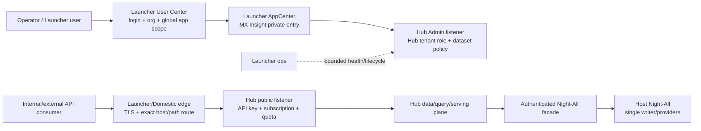

# MX Insight Hub 与 MX Launcher 集成架构

本文记录从 HDO V1 到 MX-H2I V2 的边界，并定义 MX Insight Hub 的最新接入原则。目标是在不改变现有 MX-H2I 用户联网行为的前提下，把数据产品、订阅、权限、稳定 API、ETL/ELT、BI 和 Data Agent 作为独立模块纳入 Launcher 运维与用户入口。

## 1. 三代产品边界

| 系统 | 中心 | 网络/用户真相 | 在本设计中的角色 |
| --- | --- | --- | --- |
| HDO V1：`electron-demo/hdo` + `electron-server` + HDO/WireGuard plugins | Domestic | V1 用户、JWT、DNS、mesh、WG 和服务集中在 Domestic，使用 `100.*` 地址 | 线上兼容系统，不迁入 Hub |
| MX-H2I V2：`demos/mx-h2i` standalone | Internal control plane + endpoint network owner | Internal 保存用户/权限/配置/发版/DNS desired state；客户端执行并回滚 WG/route/PAC/NRPT/resolver，使用 `10.*` 地址 | 当前 Launcher 主通道，必须保持不变 |
| Luopan standalone | 独立 ProductNetwork | 独立 `10.91/16` lease 与 `10.88.100.3` service VIP；当前不拥有 PAC/2053/system DNS | 网络/权限/用户测试项目，不是 Hub runtime |
| MX Insight Hub | 独立数据产品模块 | Hub 保存 tenant、consumer、API key、grant、subscription、usage、dataset 和查询发布；不拥有系统网络 | AppCenter 私有应用 + 独立 API/data plane |

V1 `100.*` 与 V2 `10.*` 继续共存；Hub 不参与两者地址、DNS 或用户迁移。Luopan 也不能被当作 Hub 的网络 owner。

## 2. 已有安全接入点

当前代码已经提供最小薄集成：

- Launcher Server 注册 `server/src/modules/insight-hub`；
- `/internal/v1/insight-hub/overview` 在短 timeout 内读取 Hub Admin readiness/dashboard，失败归一成 offline；
- AppCenter 内建 `mx-insight-hub`，采用 `embed + private + permission grant`；
- Launcher 生命周期可以显式委托到 sibling `mx-insight-hub/scripts/manage.sh`；
- Hub 默认不随 Launcher production deploy 启动，只有显式 `MX_INSIGHT_HUB_DEPLOY=1` 才联合部署；
- Hub Admin 可选接入 Launcher opaque token introspection，并在 Hub 本地保存
  member/tenant membership；这条身份路径与 overview 使用的 service admin
  token 是两条独立链路；
- Hub 已有 PostgreSQL canonical/revision/outbox、外部 PostgreSQL 拉取 worker，
  以及 Telegram monitor 的固定数据集读取 API。

这证明运维隔离和可选的 Launcher 身份内省已经落地，但不代表 OIDC/JWKS、
共享用户库、Launcher organization 自动等同 Hub tenant，或公共 DNS/TLS 路由已经
上线。

## 3. 目标拓扑



Launcher 只做：

- 人员/组织身份、AppCenter 可见性和全局 scope；
- K8s 生命周期、DNS/TLS 和 host/method/path 路由；
- offline-safe 健康摘要和 Admin 入口。

Hub 自己做：

- tenant membership、consumer/service app、API key；
- 平台/能力/字段/数据集授权；
- 套餐、订阅、额度、余额、幂等和 usage/billing evidence；
- Night-All/文件/未来来源接入、规范化、数据发布、查询缓存和 stale 回退；
- 用户侧稳定 API、Hub Admin、BI/Data Agent 治理。

Night-All 继续做 provider、抓取、上游凭据、source contract、raw/normalized evidence 和 provider quota。

## 4. 人员账号与影子身份

外部用户只登录 Launcher User Center，不在 Hub 再维护密码。Hub 保存的是产品授权所需的本地 member 和绑定，而不是第二套认证真相。

当前 opaque-token introspection 绑定：

```text
(trusted issuer, stable subject, hub audience)
  -> external_identity_binding
  -> Hub member
  -> tenant_membership(role, status)
```

Launcher organization/tenant ID 作为观测元数据保存，不自动创建、选择或授权 Hub
tenant。

规则：

- `sub` 使用稳定不透明 ID，不能用 email 作为身份 key；
- Launcher User Center 校验 opaque token；Hub 只信明确的 introspection contract，
  并再次核对 active user、`issuer/subject/audience`，不能只信 gateway header。若未来
  改成 JWT，再单独落地签名、`exp/nbf/kid/algorithm` 和 JWKS 轮换契约；
- Launcher 账号停用与 Hub tenant membership suspension 是两个显式生命周期；
- Hub 不复制 Launcher password/MFA/session 表，也不共享数据库；
- API consumer key 仍由 Hub 发行、hash、轮换和吊销，不由 Launcher 用户 token 替代；
- Hub Admin Token 是不受 tenant 限制的全局 break-glass/自动化凭据；当前管理台
  可以显式使用它，但它不是普通用户身份，也不能当交互式 SSO 分发。Launcher
  overview 的 service 调用和 Launcher 用户 token introspection 不能混为一条会话。

Hub 当前是多租户，而不是“登录一次只能有一个 tenant”：

- tenant 是 Hub 的独立产品授权命名空间，可以有多个；
- consumer 只属于一个 tenant，其 API key、grant、policy 和 usage 随 consumer
  归属；
- 同一 Launcher 人员可以在多个 Hub tenant 拥有不同 membership role；每次操作
  按目标 tenant 的 role 校验，不能把 A tenant 的 owner 权限合并到 B tenant；
- 新建顶层 tenant 只允许 platform admin；tenant owner 只能重命名和管理自己拥有
  的 tenant；
- Admin Token 与显式 Launcher platform-admin scope 可以管理所有 tenant。普通
  tenant 用户只看到自己有有效 membership 的 tenant。

## 5. 数据 API 路由

建议入口：

| Host | Reachability | Upstream |
| --- | --- | --- |
| `insight.mxinfo-inc.cn` | MX-H2I private | Hub Admin Service only |
| `gate.night-all.mxinfo-inc.cn` 或评审后一级私网名称 | MX-H2I private | Hub public Service only |
| 独立 `minsight-ai.com` 公共 API 名 | future public TLS | Domestic edge → WireGuard → Hub public Service |

不得创建到 Night-All `13141/18141` 的同名临时 route。公共/私有 data route 都只做粗粒度 admission；Hub 仍逐请求校验 API key、tenant、consumer、platform、dataset、quota 和 balance。

`gate.night-all.mxinfo-inc.cn` 是两级子域，普通 `*.mxinfo-inc.cn` 证书不覆盖。启用 HTTPS 前使用 exact SAN/子域 wildcard，或改成一级名称。Kibana、Elasticsearch、Hub Admin 和 Night-All 原始 route 都不进入公共 data allowlist。

### Telegram monitor 数据路径

外部程序写入的
`night_all.public.tg_monitor_chats` / `tg_monitor_messages` 不是 Hub 直接公开的
表 API。Hub 以只读 PostgreSQL 会话分批拉取，写入固定 canonical 数据集：

| Public resource | Hub dataset | 授权 |
| --- | --- | --- |
| `GET /api/v1/data/telegram/chats` | `telegram.monitor.chats.v1` | consumer 显式 `telegram` grant |
| `GET /api/v1/data/telegram/messages` | `telegram.monitor.messages.v1` | consumer 显式 `telegram` grant |

外部真实 schema 不由当前 Night-All repository migration 定义，所以 Hub migration
只把两个 source 注册成 `paused` 并创建未批准的候选 mapping。生产必须先用
Admin-only schema/3-row value-free shape preview 加 writer contract 核对稳定 ID、
timestamp watermark、复合索引、映射和数据最小化，再逐表启用 full pull。候选字段名不能写成生产事实；硬删除也不会
由当前前向游标自动传播。详细门禁见
[Telegram monitor ingestion](../../mx-insight-hub/docs/operations/telegram-monitor-ingestion.md)。

### Telegram SQLite 只读 API 数据路径

当独立采集端只在本地 SQLite 留有 PostgreSQL 故障回退数据时，Hub 通过 Admin
管理的固定 `telegram-sqlite` 管线在服务端调用 GET-only HTTP API。Token 不进入
Launcher、浏览器、MX-H2I 登录或网络配置；两个子任务分别写入
`telegram.sqlite.chats.v1` 与 `telegram.sqlite.messages.v1`，不会与现有
`telegram.monitor.*` canonical 行互相覆盖。

当前源 API 只有 `message_at DESC` 的页码分页，没有覆盖编辑、软删除和迟到回填的
单调 change cursor。因此该管线采用首次全量、24 小时重叠读取和每日全量对账，只把
显式 `deleted_at` 当作删除，管理面必须标为最终一致而不是精确增量。Hub 内部的 raw、
revision、outbox 和 Elasticsearch 幂等链路保持不变，正文不做词汇过滤，检索投影继续
优先 HanLP 并按既有链路降级。操作细节见
[Telegram SQLite read-API ingestion](../../mx-insight-hub/docs/operations/telegram-sqlite-api-ingestion.md)。

公共响应只返回严格 allowlist 的 normalized chat/message 字段和 opaque keyset
cursor，不返回 DSN、source table、raw/extensions、provider、endpoint 或
`businessId`。Hub public Service 只读 Hub 自己的 PostgreSQL，不获得 Night-All 通用
数据库路由。

这里的多租户隔离是 identity、consumer ownership、grant、quota 和 usage 的控制面
隔离，不是 Telegram 行级隔离。两个 canonical dataset 当前没有 `tenant_id`；任何
获得 `telegram` grant 的 consumer 都读取同一份完整 chats/messages corpus。若后续
要求不同 tenant 看不同子集，必须新增显式 dataset/row-scope 模型和迁移，不能从
membership 自动推导。

## 6. 绝不能影响的 MX-H2I 链路

Hub 不获得 Launcher network lease，不注册 endpoint ProductNetwork，不创建 WireGuard peer，不修改 route plan，也不拥有系统 PAC/DNS/NRPT/resolver。

以下文件和状态机属于联网红线，Hub 功能不应修改：

- `demos/mx-h2i/src/main-runtime.cjs` 的 connect/disconnect/recovery；
- `packages/electron-launcher/src/wireguard.ts`；
- `standalone-data-plane.ts`、`system-domain-proxy.ts`、`network-ownership-registry.ts`；
- `electron-plugin/packages/electron-core-wireguard`；
- Launcher Server 的 lease/route、Domestic peer sync、CoreDNS/gateway；
- HDO V1 DNS 与 `100.*` 路径。

尤其 Windows disconnect 顺序不能因为 Hub 页面或 health call 改变：保留 WG/local edge 时恢复 PAC，停止 WG，验证 route/NRPT 清理，再关闭 local edge，最后释放 ownership。Hub offline/timeout 不能插入这个状态机或阻止 teardown。

## 7. 部署隔离

- Hub 使用 sibling project、独立 namespace、ServiceAccount、Secret 和 release；
  Hub 在共享 `mx-common` PostgreSQL 实例中拥有独立 database/role，不再部署自己的
  PostgreSQL StatefulSet/PVC；
- public/admin listener 使用不同 Deployment/Service，公共路由永远不能到 admin；
- ingest/search/ES/Kibana 都是 Hub 自己的 optional workload，不加入 Launcher readiness；
- Launcher health proxy 使用短 timeout，Hub down 返回 offline summary；
- 独立 Hub deploy 不 rollout Launcher；只有明确 managed sync 才同步 token/entrypoint；
- Hub `down` 只缩容 Hub workloads，保留数据，不停止 Night-All/Launcher；
- 路由变更 additive、host-specific，可独立回滚；不修改现有 MX-H2I host/route。

生产 Night-All 继续宿主单写者，Hub 经 workload-authenticated host facade 访问。Docker full Night-All 只用于本地受控快照和解析测试，不能作为第二个生产 writer。

## 8. 故障语义

| 故障 | Launcher/MX-H2I | Hub |
| --- | --- | --- |
| Hub namespace 不存在 | 启动和联网成功；AppCenter card offline | 不可用 |
| Hub Admin down | 其他 Admin/用户/网络正常，overview 快速 offline | data public 可独立健康 |
| Hub public down | 只有 Hub data host 失败 | Admin/已发布数据存储可诊断 |
| Night-All down | MX-H2I 正常 | Hub 返回明确 fresh/stale/历史或 202/503 |
| ES/Kibana down | MX-H2I 正常 | PG 精确查询/已有数据继续，全文 degraded |
| 单一平台 down | MX-H2I 正常 | 只隔离该 capability，其他数据可用 |

任何 Hub 依赖失败都不能让 Launcher connect gate、route plan、WG、PAC、DNS 或 ownership 状态变化。

## 9. 发布顺序

1. 保持现有 overview/lifecycle 集成，验证 Hub absent/offline 不影响 MX-H2I。
2. 完成 Hub PG 权限角色、PITR、API pagination、SLO/metrics 和 Night-All workload identity。
3. 按 Telegram 运行手册验证真实 schema、水位/ID/索引和三行 shape preview；一次
   只启用一个 source，保留候选 mapping 未批准/来源 paused 的默认安全状态。
4. 在 Internal 验证已实现的 Launcher opaque-token introspection、Hub identity
   binding、多 tenant membership、登出/吊销与 Admin Token break-glass；不要把它
   宣称为 JWKS。
5. 开私网 Admin/data route，做 exact host/path、NetworkPolicy、TLS 和跨租户测试。
6. 在已实现的 Telegram GET request/unit evidence 基础上补齐 price-book、对账、
   append-only 商业账本、缓存/回退，再评审公共 API。
7. BI/Data Agent 只消费 Hub dataset/tool contract，不获得 Night-All 通用 route 或 provider credential。

## 10. 回归门槛

- Hub namespace 删除、Hub Admin 超时、Night-All/ES/Redis down 时，MX-H2I guest/staff connect/disconnect 全部通过；
- route plan、lease、WireGuard config、PAC、NRPT、resolver、2053 listener 在 Hub 发布前后 diff 为零；
- Windows PAC → WG → route/NRPT → local edge → ownership teardown 顺序测试通过；
- macOS LaunchDaemon、supplemental resolver 和 route 回滚通过；
- HDO V1 `100.*` DNS/联网和 MX-H2I V2 `10.*` 同时通过；
- Luopan 保持独立 `10.88.100.3` VIP/`10.91/16` lease，Hub 不创建第三个本机 network owner；
- Hub AppCenter 可见性、SSO/tenant role 和 API consumer grant 是三道独立授权；
- 同一用户在 tenant A 为 owner、tenant B 为 viewer 时，不能在 B 重命名 tenant、
  新建 consumer/API key、改 grant 或成员；Admin Token/platform admin 的全局操作仍
  可用；
- Telegram source schema/preview/sync 只允许 platform admin；tenant owner 返回
  403；public chats/messages 无 `telegram` grant 返回 403，任意 `q`/raw/source
  参数返回 400；
- Telegram pull/Hub public API 的超时、失败或下线不能改变 Launcher login、
  connect/disconnect、route、WG、PAC、NRPT、resolver 或 ownership 状态；
- 公共 route 不能访问 Hub Admin、Kibana、Elasticsearch、Night-All raw/provider/credential route。

Hub 的详细数据架构位于 sibling `../../mx-insight-hub/docs/`，重点参考 [数据存储与服务](../../mx-insight-hub/docs/architecture/data-platform-storage-and-serving.md)、[增量接入与缓存回退](../../mx-insight-hub/docs/architecture/ingestion-cache-and-fallback.md)、[Telegram monitor ingestion](../../mx-insight-hub/docs/operations/telegram-monitor-ingestion.md)、[Telegram SQLite read-API ingestion](../../mx-insight-hub/docs/operations/telegram-sqlite-api-ingestion.md) 和 [`/shared_dir` 导入](../../mx-insight-hub/docs/operations/shared-directory-ingestion.md)。

## 11. 2026-08-12 Hub 管理台口径与文件源入口

- Neon Void 已在 `demos/ui-design-neon-void` 和 `mx-launcher/ui-design`
  沉淀 `qp-dropdown` 的 trigger/menu/option 规范。Hub 数据中心应使用该
  自定义 listbox，不依赖 macOS/Chromium 无法稳定换肤的原生
  `<select>` 展开层。这是 Hub 页面内组件选择，不改 Launcher 共享样式
  包、身份会话或 MX-H2I 网络状态机。
- 数据中心的“已删除记录”是 Hub PostgreSQL current truth 中
  `deleted_at IS NOT NULL` 的当前逻辑记录数，不是 Hub 物理删除次数，
  也不是 Elasticsearch delete 请求或 import-run 累计。当时的源库
  semantic probe 记录 `tg_monitor_messages` 163,401 行中 7,480 行
  `deleted_at` 非空，且均在首次采集后标记。Hub 保留 raw/revision/
  canonical 证据，只从 current search projection 隐藏 tombstone。当前源
  schema 没有已证明的 `delete_reason/deleted_by`，因此不能从 Hub 推断
  是作者、管理员、Telegram 还是 collector 对账行为。
- 当前可立即使用的文件源是 Admin Console 单文件直传：“外部数据源”
  注册 file source，上传小样预览，审核并批准版本化 mapping，再选文件
  正式导入。支持 `xlsx/xlsm` 首个工作表、`csv/tsv`、`jsonl/ndjson`
  和 `txt/md`；HanLP 在 canonical 入库后的 ES 投影阶段运行，不是文件导入
  前置条件。`/shared_dir` watcher/landing agent 仍是设计，不得将手册中的
  拟议批量命令当作已实现入口。
