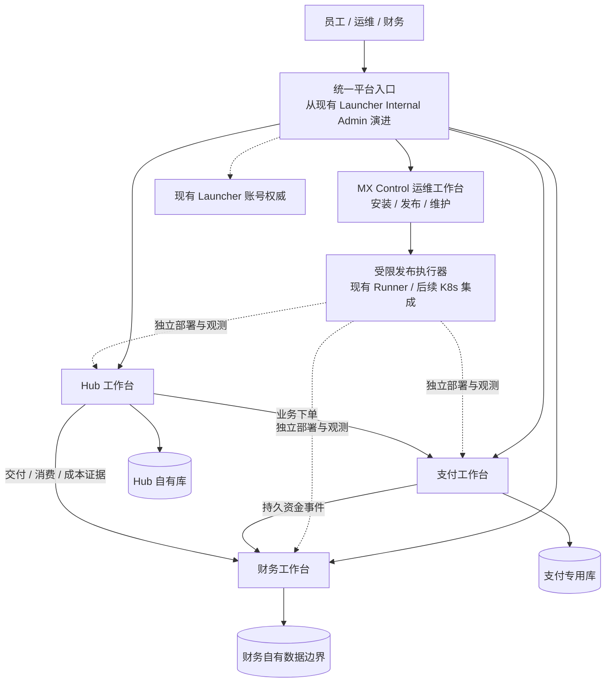

# 平台业务分域、统一管理入口与运维中心演进

日期：2026-10-02。状态：宏观分层与运维产品仍为架构建议，独立支付增量见下一段；未执行目标环境迁库、注册应用或部署。本文承接 [Internal 运维规划](13-platform-ops-and-admin-design-system-roadmap.md)、[Hub 集成](26-mx-insight-hub-integration-architecture.md)、[支付服务边界](../../mx-insight-hub/docs/architecture/payment-center-service-boundaries-and-reliability.md)与[身份和存量租户过渡](../../mx-insight-hub/docs/architecture/platform-identity-and-product-consoles.md)。

同日后续详细设计见 [33 平台统一身份与可持续架构](33-mx-platform-identity-and-sustainable-architecture.md)和[34 总部署与恢复](34-platform-deploy-and-recovery-contract.md)。用户已进一步确认邀请码自助注册、后台可切开放注册、复用现有 Hub 租户、复用 H2I 飞书并支持账号绑定。本文“沿用 Launcher 账号权威”描述兼容阶段；长期按 33 渐进形成独立身份领域。本文 C5 的“不开放自由注册”仅代表此前阶段不执行开放操作，后续注册能力与模式以 33 为准，现网开关未变。

同日实现增量：[mx-pay](../../mx-base/mx-pay/README.md)已具备独立服务及 `scripts/manage.sh deploy`，先迁移、后发布、失败返回非零，可作为后续运维执行器的首个接入目标。尚未接入 Admin 页面、切换 Hub 存量或执行集群部署；本文其他运维/财务产品仍是规划。

## 1. 建议：沿用现有入口，逐步形成独立运维产品

2026-10-07 商业产品增量见 [Hub 商城、订阅权益与 IP 风险画像 v2](../../mx-insight-hub/docs/product/commerce-and-ip-risk-v2.md)：销售先作为 Hub 内独立 Commerce 模块与 schema，支付事实由 mx-pay 独立提供。到账事件在 Hub 事务中自动发放订阅；调用授权和年度次数由 Hub 执行。未来跨应用销售可抽离 mx-commerce，Launcher/Internal 仍只负责统一入口和账号，不参与支付、额度事务或供应商调用。此增量不修改 MX-H2I 登录与联网。

保留 mx-launcher 的桌面运行时、SDK、登录、网络、AppCenter 和现有发版能力；以当前 Internal Admin 为起点，形成统一平台工作台。其中安装、发布、维护各中心的能力，逐步成为可独立发布的运维控制台，暂称 **MX Control**。名称是规划用语，本轮不创建 `mx-control` 工程。

用户可以继续在熟悉的 Launcher 界面管理所有中心。实现上分开三件事：

1. **平台入口**：按人员职责展示应用、组织上下文、待办、授权摘要和跨中心导航。
2. **技术运维**：安装、升级、配置部署、容量、健康、告警、备份与恢复任务。由运维中心协调现有发布/Runner 与后续 Kubernetes 执行能力。
3. **业务管理**：数据治理、支付核实、财务审批等由相应业务中心拥有，可在平台入口内展示，也能直接访问独立工作台。

财务人员使用财务工作台，不需要先取得集群运维权限。平台运维员维护支付服务，不因此获得退款或修改账目的业务授权。具有部署与密钥访问权限的基础设施管理员仍可能间接影响业务，需单独控制此类高权限并审计，不能把界面角色隔离宣称为绝对隔离。

| 路线 | 对当前项目的影响 | 建议 |
| --- | --- | --- |
| 所有中心后端、数据库、页面继续加入 Launcher 主进程 | 初期接入快，但业务发布、报表负载和登录/网络故障相互牵连 | 不作为长期目标 |
| 立即重建完整运维中心、用户中心、发版中心 | 重复能力多，出现两套配置写入者，迁移面过大 | 不采用一次性重建 |
| 保留 Launcher 能力，演进现有 Admin；运维与业务模块按边界逐步独立 | 保留入口和现有身份；可分批替换后端与发布单元 | 推荐路线 |

“中心”首先是业务职责，不自动对应一个微服务、数据库或新仓库。拆分由独立发布、故障隔离、数据责任、使用人群和规模决定。mx-pay 的独立运行已是明确目标；其他领域先建立模块边界与 API，避免为名称提前部署大量空服务。

## 2. 当前基础与尚未具备的能力

| 本地证据 | 能说明什么 |
| --- | --- |
| `server/src/db/entities.ts` 与 `store/postgres.ts` | 多类平台记录使用 `mx_platform_records`，按 kind/id/environment 保存 JSONB；现有用户、发版、应用目录、网络等领域确实共用平台存储 |
| `server/src/modules/insight-hub/insight-hub.client.ts` | Launcher 通过 HTTP 并发获取 Hub readiness/dashboard，默认超时 2.5 秒，失败显示 offline；跨库管理已经有实例 |
| `server/src/types.ts` 的 AppCenterApp/Manifest | 已有 appId、入口、类别、版本、能力和访问策略；不是已经实现通用财务/运维插件协议 |
| [Hub 集成文档](26-mx-insight-hub-integration-architecture.md) | Hub 生命周期可以显式委托独立脚本，默认不随 Launcher 生产部署自动启动 |
| [Rig 产品边界](30-mx-rig-product-boundary.md) | 已有独立产品工作区、角色/任务数据独立、统一入口接入的先例 |

现有 Hub overview 使用服务端 Admin Token，适合当前受限运维概览，不应扩展为所有员工调用财务写操作的通用凭据。当前 AppCenter 也不能直接等同于已经建成“选择中心后一键安全安装”的应用市场。

既有平台数据本轮保留。未来若拆用户、网络或发布存储，必须另做单写入方迁移和兼容设计；本规划不搬动这些现有记录。

## 3. 从业务职责归纳各中心

| 业务领域 | 主要对象与职责 | 建议归属与阶段 |
| --- | --- | --- |
| 身份与组织 | 平台账号、认证、组织目录、应用登记 | 沿用 Launcher User Center；各产品保留本地成员与业务授权 |
| 平台运维 | 安装实例、环境、部署计划、制品、运行状态、变更审计 | 从现有 Internal Admin/Release/Runner 演进；逐步形成 MX Control |
| 网络与设备 | VPN、产品网络、设备、连接准入与运行策略 | 保留 Launcher Network；运维入口统一不改变现有网络 owner |
| 数据与智能 | 数据接入、ETL/ELT、查询、AI/BI、数据权限 | mx-insight-hub 的主业务 |
| 产品经营与计费 | 商品/服务、定价、折扣资格、订阅、权益、客户钱包、用量账单 | 首期由各产品负责；Hub 保留已有钱包和计费。出现真实跨产品复用后再考虑共享商业模块 |
| 支付 | 收款单、渠道、支付尝试、退款执行、渠道结算核对、资金子账 | mx-base/mx-pay；独立服务与专用 PostgreSQL |
| 财务 | 应收应付、票据、费用、财务审批、核算口径、关账和财务报表 | 独立业务领域；先少量模块，后续可形成独立财务产品，不纳入 Launcher 平台记录或支付执行核心 |
| 采购与渠道经营 | 供应商合同、采购价格、代理合同、佣金规则、结算条件 | 首期由发生业务的产品保存；财务管理应付/审批，支付执行已授权资金指令 |
| Agent 与自动化 | Agent 工作流、执行任务、测试证据 | Rig 等独立产品；发布门禁仍由平台发布流程使用相应证据 |

此表是职责地图，不是本期工程创建清单。公司经营管理、技术运维与客户产品工作台具有不同导航和权限，可共享平台入口及设计系统。

财务账不等于支付流水：充值、实际消费、赠送、退款、供应商费用分别提供证据，由财务模块按经确认的口径处理。Hub 可提供 BI 技术和授权数据投影，但不能成为财务原始账或支付事实的第二写入方。本文件不制定税务处理或收入确认政策。

## 4. 管理界面和数据不必放在一起

图中的工作台对应所属服务，箭头表示职责关系，不表示所有请求都经过门户。应用支付 API、渠道回调、Hub 数据请求直接访问目标服务；门户或运维控制台不是交易必经代理。

| 平台/运维中心可以保存 | 由业务中心保存 |
| --- | --- |
| 应用目录、入口、兼容版本、安装位置、环境、运维负责人 | 订单、钱包、退款、财务账、发票、数据集与业务任务 |
| 部署申请、批准版本、执行记录、资源引用、健康摘要 | 业务配置、业务状态机、产品角色及资源授权 |
| 密钥引用、连接配置、有限审计索引、通知和带时间戳的汇总缓存 | 渠道密钥、原始业务审计与敏感材料，按所属服务控制访问 |

平台显示配置表单时，可以调用中心 API 获取字段和当前版本，由中心 API 校验并保存。**配置可以统一管理，写入责任仍归配置所属领域。** Internal 继续是受控操作与权威服务所在的管理环境，不意味着未来所有业务表只能放进 Launcher 数据库。部署参数与业务参数分开，例如副本数属于部署，渠道收款账户属于支付。

跨中心通过稳定 ID 和版本化 API/事件关联，禁止门户跨库直写或为统一页面复制一套可编辑账本。平台 org、Hub tenant、收款主体、财务核算主体分开建模，显式映射；不按名称或发票税号自动合并。测试/正式环境贯穿目录、实例、凭据、订单及事件；现有单库 test/live 隔离在迁移前继续保持。

## 5. 界面集成分级

| 层次 | 使用方式 | 本期优先级 |
| --- | --- | --- |
| 统一入口 | 应用卡片、菜单、深链接，直接打开中心工作台 | 优先，复用 AppCenter 概念 |
| 统一体验 | 共用设计规范、组织切换约定与身份客户端，逐步加入标准 SSO | 与身份兼容计划分批推进 |
| 有界聚合 | 门户展示已授权指标、待办和运行摘要，超时单独降级 | 先只读；汇总带 asOf，不把不可达显示为金额 0 |
| 嵌入业务页面 | 平台内呈现中心提供的页面，中心也保留直接入口 | 可选；按成熟度接入，不作为交易或登录前置条件 |
| 跨中心流程 | 各中心执行自己负责的步骤，门户聚合进度和待办 | 待契约、幂等、审计和补偿成熟后加入 |

初期优先独立页面加统一导航；需要同屏时再考虑受控 iframe 或版本化前端模块。iframe 明确允许来源、CSP/frame-ancestors 与消息协议，不向 URL/postMessage 注入平台 bearer token；登录通过中心自己的受信任会话完成。微前端共享浏览器执行权限，远程代码需可信、固定版本和回退机制，不能把它当成安全隔离边界。部分页面加载失败仅影响对应工作区。

统一待办只保存来源、摘要、范围和链接。批准退款、修改渠道、调整预算等命令仍由业务服务检查当前权限、对象版本与业务前置条件；不能把前端“待办已完成”当作真实执行成功。运维审批与财务审批分别属于各自领域。

## 6. 中心接入契约（目标能力）

扩展现有应用目录时，分开 **产品目录记录**、**部署实例** 和 **业务工作空间**：同一中心可能有测试/正式、多个安装实例和多个租户，不能靠一个 appId 隐式混用。

最小契约分批建设：

- 产品：稳定 appId/centerId、类别、负责人、版本兼容范围、工作台入口、文档与可声明能力。
- 实例：环境、实例 ID、部署目标、管理 API 地址、受信任来源和凭据引用；凭据不放可下载 manifest。
- 身份：明确客户端/audience；平台入口资格、运维动作授权、业务角色与数据范围分别校验。
- 只读：版本、健康、运行/业务摘要 API，固定超时与分页、数据时间、环境、授权范围及错误语义。
- 命令：仅开放已注册动作，声明幂等键、对象版本、异步 operationId、审计关联与结果查询。目标服务保留最终校验。
- 运维包：不可变制品版本/摘要、配置 schema、资源需求、外部依赖、迁移步骤、兼容区间、健康及备份恢复说明。
- 事件：来源、事件 ID、版本、环境、对象 ID、发生时间、关联 ID；按至少一次投递设计去重与补偿，不许丢失后靠重新扣款重建。

目录登记权限不能变成任意内网代理或任意脚本执行权。只接受受信任中心与明确网络目标；安装包需要独立的制品授权，默认不授予集群级权限。平台 BFF 使用有界服务能力或可验证的用户委派，目标服务核验真实操作者与范围，不信任浏览器自行填写 actorId。

现有 AppCenter 字段继续兼容，不把这些目标字段假称为当前已实现协议。先完成一个中心的只读接入和独立发布验证，再推广模板。

## 7. 在界面上安装、维护和控制中心

目标支持“选择中心 → 选择环境/集群 → 填写配置引用 → 查看计划 → 发起部署 → 查看执行与验收”。安装是持久化运维任务，浏览器关闭或门户重启后仍可按 operationId 查询与恢复。

后台执行顺序：

1. 检查操作者、环境范围、资源容量、版本兼容与所需依赖；生成具体变更计划。
2. 固定制品和配置版本，建立唯一任务；迁移按中心/环境受锁控制，新旧副本不得竞相运行迁移。
3. 执行器提交部署，持续记录执行状态与目标资源引用；对响应未知的动作先查询已有任务，不盲目再次执行。
4. 检查就绪、流量与业务探针；通过才标记成功，失败保留旧版本和证据，按中心定义的兼容规则处理。
5. 支持停止后续步骤和恢复任务；停止任务不承诺撤销已完成外部效果。

优先复用现有 Release/Runner，后续为 Kubernetes 增加受限执行适配器。若采用 GitOps，每个安装实例明确一个部署期望状态写入者：Git 为选定实例的声明式部署真相，控制台提交版本化变更并跟踪提交/同步状态；不能再让另一条直接写集群的流程持续覆盖同一资源。未采用 GitOps 的实例也要明确对应的唯一管理方。Launcher 继续拥有制品及发布审批记录，集群对象报告实际运行状态。

Kubernetes 控制器负责持续协调其对象的期望与实际状态；运维页面只是管理入口，不能把维护循环放在浏览器内。[Kubernetes Controllers](https://kubernetes.io/docs/concepts/architecture/controller/)

执行器按环境、命名空间和动作限制权限，部署普通中心不默认拿 cluster-admin，也不向浏览器传 kubeconfig；拥有工作负载创建权限仍可间接使用该命名空间的敏感资源，需配合密钥边界与准入限制。[Kubernetes RBAC 实践](https://kubernetes.io/docs/concepts/security/rbac-good-practices/)

“控制”需要显示具体业务含义：隐藏入口、停止接收新单、暂停后台任务、缩容进程、卸载服务是不同动作。支付服务维护时保留查单、回调与在途交易处理；卸载默认保留数据库与备份，删库不是卸载附带步骤。财务关账、退钱和改余额不属于通用运维命令。

Deployment 回滚处理工作负载模板；不能把它理解为会撤销数据库迁移或资金事实。中心采用先扩展后收缩的兼容迁移，应用回退不还原已发生的付款/账务事件。[Kubernetes Deployments](https://kubernetes.io/docs/concepts/workloads/controllers/deployment/)

## 8. 独立运维中心的故障与自举边界

- 控制台不可用：暂停新的管理变更；已经部署的中心按自己的服务、数据库与必要基础设施运行，不能依赖门户心跳存活。
- 某个中心故障：目录与其他中心保持可用；门户不把所有中心 readiness 串联成自己的 readiness。
- 身份服务故障：新登录/重新验证受限；支付机器调用和渠道回调不依赖员工登录服务，已有会话遵守有效期与撤销策略。
- 执行器重启：按持久任务、资源版本和租约恢复，校验执行权，避免重复迁移、重复任务和失效 worker 回写。
- 自身维护：保留仓库中的安装清单、受限 CLI/外部发布入口和独立备份恢复说明。运维中心不能成为恢复它自己时唯一可用的工具。

独立服务不代表完全没有基础设施依赖。支付继续采用已确认的专用 PostgreSQL和至少两个 Kubernetes 工作节点规划，并单独核验数据库、入口、控制面和存储故障域。两台 worker 不自动提供数据库或 Kubernetes 控制面高可用，细节沿用[支付稳定性规划](../../mx-insight-hub/docs/architecture/payment-center-service-boundaries-and-reliability.md)。

监控、财务导出、BI 计算采用独立并发与连接预算。门户按当前可见中心有界获取摘要，避免每次打开页面遍历全部中心；业务大报表在所属中心异步生成并按当前权限交付。

## 9. 贯穿支付、业务与财务的示例

Hub 决定充值金额和赠送规则 → mx-pay 创建收款单 → 管理员核实渠道真实到账 → mx-pay 持久化收款事实与事件 → Hub 幂等记入原租户钱包 → 财务模块读取付款及后续消费/退款证据 → 平台入口呈现各工作台的授权摘要。

门户停机时，业务仍可直达 Hub/mx-pay。Hub 暂不可用时，支付成功与“钱包交付待完成”分别显示，恢复后补交付，不能再次向用户收款。财务模块暂不可用时，已授权的收款与业务交付继续；需要财务审批的新退款/支出等待审批，不以故障为由绕过规则。

退款按业务层资格/冻结 → 所需审批 → mx-pay 执行/查证 → 业务冲正 → 财务票据及核算调整进行。金额、范围、对象版本与审批依据固定关联，重复通知去重；渠道结果未知保持待核实，不当作失败重付。具体资金状态机沿用支付服务规划。

## 10. 平滑实施顺序

| 阶段 | 实际交付 | 保留的边界 |
| --- | --- | --- |
| C0 文档与职责地图（本轮） | 明确入口/运维/业务分层、数据归属、接入契约和迁移顺序 | 不修改运行时、登录、网络、数据库或权限 |
| C1 在现有 Admin 增量接入 | 独立产品入口、版本/健康、受限摘要；先 Hub 和 mx-pay | 复用现有账号与目录，不先重建全平台；客户仍在 Hub 充值 |
| C2 独立支付服务 | 按支付方案补事件、迁库、独立部署与管理台，保留原业务入账标识 | 单写入方切换；充值闭环不等待运维中心或 SSO 完成 |
| C3 运维控制模块 | 标准部署实例、安装包、计划/执行/验证；现有发版适配器接入 | 原 H2I/Launcher 的发布和网络管理继续兼容，不统一重启所有产品 |
| C4 运维独立发布 | 将成熟运维模块抽为独立部署单元，可保留原入口反向路由 | 先迁页面/只读聚合，再迁运维任务；不同时迁账号/网络主数据 |
| C5 财务与身份扩展 | 财务独立工作台、标准 SSO、经核实的组织/租户映射分别灰度 | 不自动扩大权限、不改原用户/租户/钱包/Key；不开放自由注册 |

C1–C4 不要求每个阶段一次完成全部中心；优先完成 Hub 充值与支付独立性的实际价值，再推广安装维护契约。保留原 Launcher 路由作为兼容入口，确认使用流量和回滚能力后再退役旧页面，不一次搬走原菜单。

验收重点：一处入口操作、目标中心准确授权；中心离线不拖垮门户/H2I；门户停机不阻断业务；重复安装请求只产生一个任务；新旧服务版本可共存；财务故障不丢收款事实；新登录仍映射原成员；不扩充租户、Key、网络或财务权限。

本轮的结果是规划与文档归纳，不代表统一运维中心、财务中心、通用嵌入框架、跨中心安装或 SSO 已经实现。
