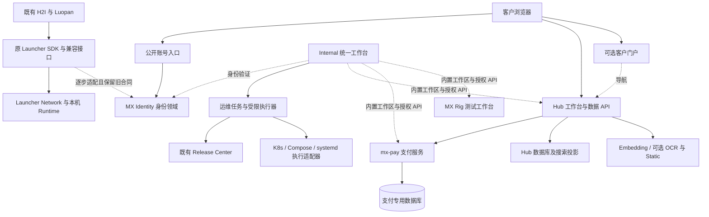
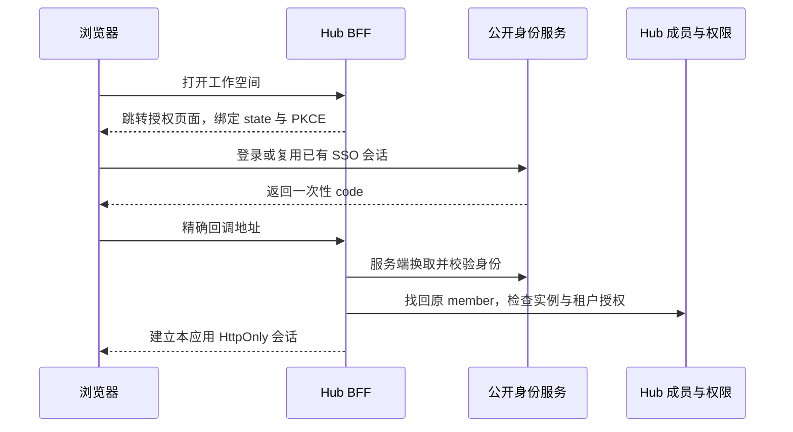

# MX 平台统一身份与可持续架构设计

日期：2026-10-02。状态：已确认目标设计，开始分阶段实现；不是运行状态报告。配套：[总部署与恢复设计](34-platform-deploy-and-recovery-contract.md)、[实现与验收进度](35-platform-implementation-and-acceptance.md)。

本设计面向已有 MX-H2I、Luopan、Hub 客户的系统演进。建议将身份与组织、运维控制、桌面网络、业务产品明确分域：**Launcher 保留桌面 Runtime/SDK、网络与现有兼容接口；身份成为可独立演进的基础领域；现有 Internal Admin 演进为统一工作台和运维入口；各业务中心保留自己的数据、授权与直接入口。** 先建立边界和兼容层，再按必要性独立部署，最后才迁移数据。

设计编制阶段只更新文档；随后已实现首期 Admin 工作台与导航，具体范围及验证见文档 35。没有调用生产接口或修改登录、网络、权限、数据库、AWX 或部署脚本。本文中的新身份字段、接口和时限仍是目标设计，不能视为已实现。

用户已确认：支持自助注册，首期邀请码模式，后台可切换全面开放；复用现有 Hub 租户，现有用户无需重新注册、换 Key、重新绑定或调整客户端；完善 SSO，复用 MX-H2I 现有飞书应用，后续扩展钉钉等身份源；支持已有本地账号与第三方身份绑定，以及重复账号的受控归并。以下设计已按这些选择修订。

补充确认：**管理者始终在 MX Launcher 界面完成开户、授权和日常运维，不需到各中心补录；用户按注册入口自动获得该应用的默认能力，公开应用按其政策自动准入。Luopan 继续自动获得自身产品网络能力。** 运维范围包括域名/HTTPS 证书、潜在风险，以及可验证的重启、重新部署和恢复操作。

线上 Luopan 是 `/Users/qpjoy/workspace/mingxi/luopan/po-frontend` 的 `feat/yjj/hdo_v2` 分支；`demos/luopan` 仅为集成演示。本轮不修改线上 Luopan，将其作为 standalone launcher 的既有消费者保护。统一账号新流程不能要求它立即更换业务登录、升级 SDK 或重新入网。

## 1. 设计依据与当前事实

核对基线为本仓库 `123d807a` 和 Night-All `5359297` 的本地文件。用户提供的截图用于理解当前导航与工作方式，不用于证明线上健康。历史 docs/specs 是设计输入；其中的操作命令不构成本轮执行请求，早期规划也不覆盖较新的实现事实。

| 核对对象 | 当前事实 | 对本设计的影响 |
| --- | --- | --- |
| Launcher SDK 登录 | `sdk-gateway.controller.ts` 支持 password/client_credentials 及专门的飞书流程；普通用户 token 新签发默认期限为 30 天（2026-10-04 更新） | 不是通用 OIDC Provider；新 SSO 不能直接把现有接口换个公网域名 |
| Launcher 管理入口 | SDK 创建用户需要 Internal Ops Token；截图也以服务器地址与 Ops Token 接入 | 要新增面向人的管理会话，保留受控应急通道，不能把公共注册接到此接口 |
| 飞书账号解析 | 当前按 `tenant_key:open_id` 找 `profile.externalIds.feishuSubject`，未命中可创建 `usr_feishu_*`；会补 H2I/AppCenter/H2O 访问 | 已有外部身份定位基础，但不是完整绑定/归并系统；新公开飞书登录不能照搬员工自动开通 |
| Launcher 存储 | `mx_platform_records` 按 kind/id/environment 存储身份、网络、发布等记录；`PostgresPlatformStore` 聚合多个领域 | 先收敛写入接口和领域依赖，不能复制一套库并让两边同时修改用户 |
| 默认开户 | `createUserCenterUser` 默认 `tenant_default`、`org_default`、`mx-user`；空 roleIds 也会回退默认值；管理员输入还可触发 Oversea 开通 | 公共注册需要单独最小权限路径；传空数组不等于零权限 |
| Hub 身份 | 后端代理 Launcher 密码登录；opaque token 在线内省，成功缓存默认 30 秒 | 目前是同账号登录，尚不是完整浏览器 SSO；Launcher 故障仍会影响现有控制台 |
| Hub 成员 | 按 `(issuer, subject, audience)` 绑定 member；首次登录只建 member/binding，不建租户或 membership | 手工步骤来自缺少开通流程，不应通过移走 Hub 授权表来解决 |
| 产品网络 | H2I 与 Luopan 独立 ProductNetwork/lease；Luopan 使用自身 VIP；现有产品 ban 不保证真实 peer 已删除 | 身份变更与网络下线必须分别执行、分别报告，不改变现有连接行为 |
| Luopan 公开准入 | Launcher 内置 `luopan` 为 `public`、`requirePermissionGrant=false`；网络另查产品启用、绑定、能力和匿名准入 | 已有自动准入基础；无需改成逐人审批，公开准入仍遵循该产品的有效策略 |
| 线上 Luopan 消费者 | 本地所指分支 `a4cc5de`，依赖 Launcher `2.3.18` 并有本地补丁；业务登录与 Launcher 网络认证分开，启动可恢复用户或走匿名网络 | 演示成功不能替代线上兼容验收；原 token、补丁、启动顺序、业务主体与 MX 主体映射保持兼容 |
| Release Center | 已有制品、更新、灰度与产品发布能力 | 保留并适配运维入口，避免再建一套客户端发布系统 |
| MX Rig | 当前 README 明确已有 Rig 自有账号、可撤销会话及可选 Launcher 联邦登录 | 保留现有独立登录；统一身份不能以删除 Rig 账号为前提 |
| mx-pay | 已有独立 API、专用 PostgreSQL、事件、SDK 和 deploy；Hub 仍用原内嵌充值路径 | “独立服务已实现”与“Hub 已切换”分开；现有独立 API 尚无人工 SSO 控制台 |
| mx-common | 既有技术库，也有 PG/ES/Redis 等共享部署；Hub 用独立产品库/角色 | 代码复用不等于必须共用运行时；共用 PG 实例仍有共同故障域 |
| mx-static / OCR / embedding | 用户确认 static 服务尚未上线，OCR 已验证，embedding 被 Hub 使用；OCR/embedding 与 Launcher 同机，首批服务运维接入见 36，业务工具集成另行推进 | 采用逐项接入；NAS 迁移完成不能等同静态服务上线，也不由总 deploy 自动触发归档迁移 |
| Night-All | 旧 specs 有过时的“Hub 待实现”描述；Hub 最新源码/文档已有 Web Search 直连与部分社媒迁移 | 按能力迁移清单推进，不能依据旧总图宣布必须保留或可以整体下线 |

身份证据：[Launcher SDK](../server/src/modules/sdk-gateway/sdk-gateway.controller.ts)、[用户构造](../server/src/store/domain.ts)、[平台存储](../server/src/store/postgres.ts)、[Hub 客户端](../../mx-insight-hub/server/identity/launcher-client.mjs)、[Hub 身份服务](../../mx-insight-hub/server/identity/index.mjs)、[Hub 绑定表](../../mx-insight-hub/migrations/007_launcher_identity.sql)。

线上 Luopan 只读核对了指定本地分支的 `package.json`、`src-electron/luopan-launcher-manager.ts` 和 `src/stores/auth.ts`；未切分支、安装依赖、运行构建或连接线上服务。源码证明存在匿名 bootstrap 和双认证路径，不证明线上配置与当前发布包完全一致；P0 需登记真实已发布版本及对应服务端契约。

## 2. 回答最关键的架构选择

### 2.1 用户中心应不应该从 Launcher 抽离

**逻辑边界现在就抽离，面向公网的认证运行单元在开放前隔离，存量账号存储逐步迁移。** 暂称该领域为 MX Identity，名称不要求立即创建仓库或搬动代码。Launcher User Center 是它的现有实现和账号来源，不再把它视为只有 Launcher 才能使用的功能。

| 方案 | 近期成本 | 长期问题 | 结论 |
| --- | --- | --- | --- |
| 身份、业务、运维继续全塞 Launcher | 表面接入快 | 公共登录负载、运维发布与 VPN 控制相互影响 | 不作为目标 |
| 立即重建身份库，所有客户端一起换登录 | 改造与验证面大 | 旧账号、飞书、Hub binding、网络租约同时有风险 | 不采用 |
| 保留账号真相，增加标准身份入口与兼容层，逐项隔离 | 多一个过渡阶段 | 需要明确唯一写入者与退出条件 | 推荐 |

身份服务目标负责账号、认证方式、验证信息、登录会话、组织目录、OIDC 客户端与应用级准入。**Hub 的数据权限、支付的资金权限、Rig 的任务权限、Launcher 的网络准入仍由各领域负责。** 中央“权限管理”页面是统一查询和委派操作入口，不是一张替代所有产品权限的超级表。

职责分开不等于操作分散。`MX Identity` 是后台能力的名称，日常操作入口仍叫 Launcher 的“成员与访问”。管理员一次选择账号、产品/工作空间和有效期，由开通用例调用所属中心的幂等 API，统一展示结果；没有“先去 Identity 建人，再去 Launcher 绑设备，再去 Hub 补成员”的人工流程。该用例先作为模块实现，只有隔离和扩容需要时才成为独立进程。

### 2.2 Launcher 是否必须开放公网

不需要开放 Launcher Admin。需要公网可达的是窄身份入口和确实要交付的产品入口。浏览器登录时必须能到达身份授权页面；只做一个外部门户、仍重定向到 `10.*` 的身份地址，无法让未联网客户完成 SSO。

公网 `accounts` 可经受控 edge 访问 Internal 内的身份服务。Internal 仍是配置与管理操作面，但登录运行时不是员工的 H2I 客户端，也不能依赖先启动某个人的桌面 VPN。服务间需要专用隧道或受控内网；沿用现有 Domestic fabric 时按 host/path/service 限定转发范围。

建议域名角色如下，实际公司域名、DNS/TLS 与入口机器需在实施前确认，示例不代表已注册：

| 入口 | 暴露范围 | 职责 |
| --- | --- | --- |
| `accounts.<public-domain>` | 公网窄认证面 | 登录、标准授权、邀请/注册、账号恢复 |
| `portal.<public-domain>` | 公网客户门户，可后置 | 产品目录、我的工作空间、账号与支持入口 |
| `hub.<public-domain>` | 按需公网 | Hub 客户工作台；不默认暴露所有 Internal 管理 API |
| `api.<public-domain>` | 按需公网 | 明确登记的 Hub/其他产品 API，按 audience/Key 验证 |
| `control.<private-domain>` | Internal/受限管理网络 | 平台工作台、运维、发布、服务器和网络管理 |
| 支付/财务管理入口 | 初期 Internal | 财务经办与支付运维；收银页面和渠道回调另行公开 |

公开面、人员管理面、机器 API 分开监听/路由与限流。只隐藏菜单不能保护管理接口。新增公网路由不修改 H2I/Luopan 现有 VIP、DNS 或网络所有权。

### 2.3 注册一次能否用全套服务

目标是“一个 MX 账号、各产品不再重复输入密码、正常开通无需人工补录”。后台区分开户、产品资格、资源授权、网络资格和商业权益，前台用应用配置的默认开通方案一次完成。**公开应用自动准入，注册来源应用自动开通默认能力，受限应用才要求邀请或审批。** 已有账号访问另一个公开应用时也自动进入，不要求重新注册。

Luopan 的默认方案包含自身 ProductNetwork 的内网能力，保留现有自动化行为；纯 Web Hub 的默认方案可以只有 Hub 成员和指定工作空间。是否自动开网络取决于应用明确配置，不能一律禁止，也不能把任意公开账号变成所有 Internal 网络的管理员。产品确需哪些可达网段/服务以现有配置为准，本设计不趁身份改造重写网络 ACL。公开应用的普通使用资格不等同于支付核实、全局人员管理等后台权限。

还要区分两种“注册”：用户注册建立自然人账号；应用注册建立可信客户端、回调地址和允许的能力。新网站完成应用登记、标准登录接入和本地授权后，才能加入平台。不能仅添加一个注册按钮便访问内部所有服务。

## 3. 目标职责地图

虚线表示身份、导航或管理关联，不表示业务流量必须经过门户。图是目标边界，不把所有框视为首期微服务。

| 领域 | 拥有的数据与能力 | 不承担的责任 | 部署方向 |
| --- | --- | --- | --- |
| MX Identity | 稳定 accountId、认证凭据/外部身份、会话、组织关系、客户端登记 | 产品账本、VPN peer、数据集权限 | 从 User Center 渐进独立；新公开认证有独立资源预算 |
| MX Launcher | Runtime/SDK、standalone/embed、设备网络、ProductNetwork、AppCenter 客户端集成 | 跨产品全部业务与财务 | 现有进程先保留；网络稳定优先 |
| 平台工作台 | 统一管理界面、中心工作区、开通用例、收藏、工作空间选择、有界摘要 | 业务最终授权、交易中转 | 从现有 Admin 演进，可独立构建发布 |
| 运维中心 MX Control | 部署实例、计划、受限动作、健康、告警、备份恢复任务、操作审计 | 替业务中心决定退款、授权数据、直接改账 | 先模块化，再独立 API/worker；不要求再造执行系统 |
| Release Center | 制品、校验、渠道、灰度、回滚决策、更新协议 | GPU 调度、财务审批 | 保留现有产品 ID 和发布记录，先由运维接入 |
| Hub | 数据接入、治理、检索、AI/BI、产品租户、成员、Key、配额、用量和钱包 | 全平台账号密码、全部产品财务主账 | 独立产品；可同账号接多个独立 Hub 实例 |
| mx-pay | 应用支付凭据、收款事实、渠道核实、事件与对账；退款执行为后续能力 | Hub 钱包、产品套餐、组织管理员身份 | 专用 PG、独立 API/worker/发布；门户故障不影响交易 |
| 财务领域 | 票据、应收应付、审批、核算与报表 | 重新创造支付事实或直接修改 Hub 钱包 | 先业务边界，出现实际需求再独立产品 |
| MX Rig | 测试资产、Runner、执行证据、Agent 编排与产品角色 | 替代所有系统的运维执行器或认证中心 | 已有独立产品，保留本地账号和可选联邦 |
| mx-base | Static、OCR、Embedding 等独立服务及管理入口 | 新的总业务数据库 | 每个服务独立配置、资源、凭据和故障状态 |
| mx-common | 通用代码、数据库/队列工具和明确登记的共享设施 | 统一所有业务表或作为所有请求的中央代理 | 拆清库依赖与运行依赖；不用其部署的产品可独立运行 |
| Night-All | 尚未迁走的采集、历史数据/状态与兼容执行 | 新增公网客户身份与商业入口 | 过渡依赖；以逐能力退出清单退役 |

Internal 是管理边界，不是“只能有一个服务、一个数据库”。配置可以在一个页面编辑，但支付渠道配置由 Pay 校验保存、Hub 供应商配置由 Hub 保存、VPN desired state 由 Launcher 保存、部署参数由运维记录。跨中心不直写数据库。

## 4. 身份与权限模型

### 4.1 稳定身份与产品本地成员

目标对象为 `Account`、`ExternalIdentity`、`Organization`、`OrgMembership`、`Application`、`ApplicationInstance`、`ApplicationAccess`、`Session`。这些是逻辑模型，不是本轮数据库变更。

Account 使用不可变 ID。现有 Launcher userId 原样保留；新公开账号建议使用不依赖可变用户名的随机 ID，通过兼容映射接入。不要重新规范化旧 account 大小写后批量重算 userId。

Hub 保留自己的 `member_id → tenant_membership → tenant/consumer/Key`。新 OIDC 的 issuer/sub/client 先映射到原 member；不因新 issuer 或 audience 创建同一个人的第二份业务身份。邮箱、公司名称、发票抬头只能辅助核对，不能作为自动合并依据。标准 OIDC 身份应按受信任 issuer 与 sub 识别；pairwise sub 可能因客户端而不同。[OIDC 身份稳定性](https://openid.net/specs/openid-connect-core-1_0.html#ClaimStability)

平台 Organization 与 Hub tenant 显式关联，可以一对多；支付收款主体也不是客户 tenant。私有 Hub 与公网 Hub 若独立部署，各自拥有 tenant、Key、钱包、授权与数据。统一账号不自动复制这些对象，也不共享余额。

### 4.2 权限统一管理但由所属服务执行

一次 Hub 操作通常需要：账号/会话有效、可进入该 Hub 实例、当前租户 membership、该操作能力、目标资源范围、有效商业权益。数据 API 仍按 Hub 的 Key、consumer、tenant 和实时授权检查，不改为接受人员 SSO token。

平台入口聚合权限时记录来源与范围，例如“客户甲 / Hub 正式实例 / 数据导出 / 至 10 月 31 日”，不能只显示“MX User”。同一个人在租户 A 的 owner 权限不能提升他在租户 B 的 viewer 权限。

服务账号、人员账号、设备身份分开显示和管理。平台停用某个人默认撤销其人员访问；该公司的机器 Key 是否停用，要由产品根据明确业务动作执行。人员离职不应无声中断企业服务，若属于安全事件可通过有影响预览的流程同时撤销指定机器凭据。

角色模板可以集中展示；产品定义 role 与 action 的真实含义。组织管理员只管理获授权的组织关系，不自动成为 Hub owner 或支付管理员。公共新账号采用明确的 `customer-basic` 身份基础模板，再自动叠加应用自己的普通使用方案，Luopan 方案可以包含产品网络。新公开注册不能盲目复用现有 `mx-user` 构造默认值，更不能把既有员工默认值全局改掉；旧客户端依赖的角色/scope 由兼容层按原契约保留。

注册写入必须采用独立的 create-only 事务与唯一约束；当前管理员创建方法具有查找旧用户并更新的 upsert 语义，不能公开复用。账号/外部主体已存在时进入登录或经过验证的找回/绑定流程，不能借注册覆盖旧密码、显示名、角色或状态。新用户、凭据、身份绑定与事件在身份领域内原子提交，避免半建账号。

### 4.3 访问时间和撤销时效

将四类时间分别建模：登录会话期限、某产品资格期限、具体授权期限、商业权益期限；VPN 另有 enrollment/lease/运行 peer 生命周期。token 未过期不代表套餐仍有效，账号未退出不代表仍可导出数据。

目标授权记录至少包含：主体、产品实例、资源范围、动作、`validFrom`、`validUntil`、状态、来源、版本与审计原因。服务端使用 UTC，按 `validFrom <= now < validUntil` 判断；页面显示本地时间和时区。已知的到期时间直接在请求上判断，不依赖定时任务准时执行。撤销采用递增版本、持久事件、消费者确认与定期对账；旧事件不得覆盖新状态。

| 场景 | 建议目标 | 执行与故障行为 |
| --- | --- | --- |
| 新权限或定时生效 | 目标服务提交成功后可用；普通跨中心传播目标 ≤60 秒 | 未收到目标确认显示“同步中”；通过只读状态查询追踪，不能显示全局已成功 |
| 授权自然到期 | 下一次受保护请求拒绝；缓存不能越过 validUntil | 再检查服务端时钟，不靠浏览器计时和 token 刷新 |
| 人员禁用/全局撤销 | 新网页登录/普通写操作跨产品目标 ≤60 秒 | 授权状态新鲜度超过上限时停止受保护写操作；需要此保证的读取同样拒绝 |
| 普通低风险读取 | 可配置最多 5 分钟的最近有效状态容忍 | 必须仍在本地会话/授权期限内；只对明确批准的低风险页面启用，数据导出不属于此类 |
| 支付核实、退款、改权限、查看密钥、部署/恢复 | 当前本地授权 + 不超过 5 分钟的重新认证；最终执行再次检查 | 关键身份状态无法确认时不执行，已有付款查证/回调继续 |
| 长连接、流式返回、长任务 | 开始、续订/心跳、交付敏感结果前复核 | 到期停止新派发与后续交付；已发生的采购/付款保留并结算，不能假装被取消 |
| Hub 数据 Key | 保留现有产品过期/撤销语义，新增统一观测 | 不使用网页登录 TTL 替换 Key；未来改变缓存要单独验证 |
| H2I/Luopan 网络 | 本轮沿用现有语义；后续单独制定可验证的真实下线时限 | 当前 ban/release 不是 peer 删除；必须等执行与共享 peer 引用核验后才能显示已断开 |

2026-10-04 实施更新：按用户要求，新的人类登录会话及 SDK 用户 Token 统一采用 30 天期限，原到期时间不追溯改写；管理写操作仍需最近 5 分钟身份验证。以下旧会话期限仅保留为前期候选，当前实现以 [公网身份部署说明](41-public-identity-and-certificates.md#2026-10-04-登录入口与-30-天会话更新) 为准。

上述数字是设计候选与验收目标，不是现网 SLA，不追溯改变旧 token 的 7 天默认值。新普通 Web 会话建议空闲 12 小时、绝对 7 天；高权限管理会话空闲 30 分钟、绝对 12 小时；OIDC access token 建议 5 分钟，refresh token 轮换并检测重放。它们是不同层次：短 token 不能替代实时产品授权，长会话不能延长权益。

Hub 早期文档中的“空闲 7 天、绝对 30 天”与本设计的新 Web 候选不同；只有新会话方案落地时选定一个版本统一生效，存量本轮不变。撤销状态失联时，“始终可用”和“立刻得知撤销”不能同时承诺。正向内省缓存需要 `min(缓存TTL, token剩余期限, 授权剩余期限, 新鲜度预算)`；当前 Hub 客户端仍需专门验证 expiresAt 边界，不能把目标逻辑当作已经具备。[RFC 7662 的缓存取舍](https://www.rfc-editor.org/rfc/rfc7662.html#section-4)

退出当前应用只销毁本应用会话；“退出全部应用”撤销统一会话并通知各应用，页面展示仍待确认的应用。不得静默把退出 Hub 转成断开 H2I 或关闭 Luopan；网络断开是另一个有明确范围的用户动作。

## 5. SSO 与公开身份入口

### 5.1 新应用登录流程

新 Web 采用 OIDC Authorization Code + PKCE S256，各产品 BFF 持有服务端凭据与 token，浏览器使用 host-only Secure/HttpOnly Cookie，并实施 CSRF、state/nonce、精确 redirect URI 和会话固定防护。产品 API 验证 access token 的正确 audience；ID token 不当通用 API 凭据。公开面使用允许列表，内省/管理 API 仅供经认证的后台调用。新设计不采用 password grant。[OIDC Code Flow](https://openid.net/specs/openid-connect-core-1_0.html#CodeFlowAuth)、[OAuth 安全最佳实践](https://www.rfc-editor.org/rfc/rfc9700.html)

不同网站有各自会话，跨站跳转通过身份服务完成 SSO，不共享全域万能 Cookie，不在 URL 或 iframe 消息中传 bearer token。新 Electron 登录如需接入，优先系统浏览器加 PKCE、受约束的回调；现有 H2I/Luopan 不因此强制升级。[原生应用 OAuth](https://www.rfc-editor.org/rfc/rfc8252.html)

### 5.2 标准协议实现选择

实施更新（2026-10-03）：内网试点最终采用成熟的 `oidc-provider@9.12.2`，作为独立 Node/Kubernetes 进程，直接只读适配现有账号凭据，避免本批增加 Java SPI、第二套账号和运维控制台。以下 Keycloak 为最初候选分析，未部署；最新接入、边界与恢复方案见 [文档 37](37-managed-internal-identity.md)。协议引擎选择不改变稳定 userId、唯一凭据写入者与业务权限分域原则。

建议优先验证成熟 OIDC 引擎，**Keycloak 作为首个验证候选**，MX 自己维护账号兼容、组织/产品目录与领域权限。不自行从头实现授权服务器、密码找回、MFA 和 token 安全协议。Keycloak 提供 User Storage SPI，可对接外部用户和凭据存储；这只证明存在扩展机制，不证明已经兼容本项目的 scrypt、飞书绑定和账户禁用语义。[Keycloak User Storage SPI](https://www.keycloak.org/docs/latest/server_development/index.html#_user-storage-spi)

验证阶段保持当前 Launcher 为唯一账号/凭据写入者。候选 IdP 通过受限的身份适配验证既有用户，暂不启用第二套密码修改/注册；IdP 自己保存标准会话与客户端配置，这不等于复制业务账号真相。适配接口需要独立服务凭据、客户端限流和稳定主体映射，不能持有全局 Ops Token。

进入对外阶段前，公开认证处理与旧 H2I API 至少有独立部署、资源和连接池预算；若仍调用原 Launcher 验证密码，其可用性依赖须明确记录，不能称为完全隔离。较长期将身份仓储与验证从聚合 store 抽成同一领域，旧 SDK 委派给它；完成旧账号、禁用、改密、飞书、用户 ID 与签名/opaque token 兼容后，才能移交唯一凭据写入权。新旧账号不能同时由两个系统分别改密。

候选引擎上线门槛：原密码不重置、账户大小写不变化、双身份绑定可追溯、旧 Hub member 不分裂、旧 token 仍按原协议校验、撤销事件不漏、IdP 不可用不修改 VPN、认证负载不耗尽旧服务资源。验证不通过就保留现有登录并继续邀请式试点，不仓促开放注册。

### 5.3 完整 SSO 的交付清单

| 能力 | 目标验收 |
| --- | --- |
| 客户端登记 | 区分 Web BFF、原生客户端、机器调用；固定 redirect URI/audience/允许流程；应用登记不向任何产品授管理员权限 |
| 标准发现与验签 | 稳定 HTTPS issuer、discovery/JWKS、允许的算法；验证签名、iss/aud/exp/nonce 等，不从任意 token 的 jku 动态信任签名源 |
| 会话与续期 | 随机会话标识、服务端撤销、空闲/绝对期限、refresh rotation/replay 检测；并发刷新不误踢正常设备 |
| 密钥轮换 | 新旧签名 key 有验证重叠期，旧 key 的退出覆盖所有已发 token 的最长有效期；异常泄露另走紧急撤销 |
| 跨应用切换 | 顶层重定向复用身份会话；不依赖第三方 Cookie 或 iframe 静默登录一定成功；被阻止时正常登录回跳 |
| 全局退出 | 当前应用退出、所有应用退出、单设备撤销三种动作；后端撤销通知幂等，断线应用恢复对账，展示未确认状态 |
| 账号安全 | 密码/验证联系方式管理、找回、MFA 或 passkey、恢复码、登录设备记录；平台/财务/运维高权限要求分阶段启用强验证 |
| 多身份源 | 飞书先行、钉钉等按适配器扩展；不同提供方交易分开，回调不能串换；绑定和登录交易用途不可混用 |
| 人机分离 | 支付应用凭据、Hub Key、运维执行器身份独立；人员会话不充当长期机器密钥 |
| 审计与恢复 | 登录/绑定/恢复/管理员操作可追溯，敏感字段脱敏；账号中心不可用时有受限管理恢复入口 |

以上是新身份方案的验收要求，不是当前 Launcher 已支持的列表。公共注册与身份源的启用取决于该客户端对应能力完成；后台不能选择尚未实现的钉钉适配后显示“已接入”。

## 6. 从手工开户到可追踪的开通流程

### 6.1 邀请加入现有企业

目标流程：有 `membership.write` 的 Hub owner 或平台管理员选择租户、角色与截止时间 → 建立一次性邀请 → 收件人验证身份并登录/注册 → Hub 在事务中绑定原 member 和该租户 → 用户直接进入工作空间。普通 Hub admin 不因流程改造自动获得 membership.write。

邀请固定产品实例、租户、拟授角色、邀请人权限、接收约束与有效期，接受时重新检查邀请人及租户当前状态。验证联系方式证明邀请归属，不用相同邮箱自动合并两个既有账号。登录的是另一账号时显示具体对象，不能静默绑定。发送邮件/短信需要后续配置渠道，本轮没有发送邀请。

### 6.2 自助注册与开新工作空间

用户已选择邀请码自助注册，后续开放注册。平台在 Internal 后台维护版本化 `RegistrationPolicy`，提供 `closed / invite_code / open` 三种模式，首期发布使用 `invite_code`。可按应用实例进一步收紧；实例不能绕过平台关闭政策，实际可用规则取平台与实例限制的交集。当前生产开关本轮不修改。

该政策管理新接入的统一注册流程，不能通过开启它顺带改掉线上 Luopan 的既有独立业务注册、原 H2I 飞书开户或匿名入网行为。旧产品只有完成明确适配和兼容验收后才接入新政策；届时仍由原注册入口引导，不要求老用户迁账号。

用户流程为：打开 Hub“注册” → 在邀请码模式填写有效邀请码 → 验证联系方式或使用允许的飞书身份 → 创建最小账号 → 加入明确邀请的工作空间，或按 onboarding policy 建立新的受限个人空间 → 直接进入 Hub。管理员不再需要等待用户先登录后手工找成员。

已有账号登录不检查新注册邀请码，不因注册模式关闭失效；已登录的人兑换同一邀请码不能制造第二个账号或重复领取权益。切换模式只影响新开户，已存在账号、会话、租户和网络资格不变。处于注册中的请求携带策略版本；提交时以当前策略重验，不因拿到旧网页绕过关闭。

Hub 个人空间可以自动授予该空间 owner；其默认方案不授予其他客户数据、供应商管理、支付管理权或未声明的付费额度。Luopan 则按自身方案自动开通产品网络，见 6.7。试用套餐如需赠送，必须是显式版本化权益政策，具有去重、预算、到期和审计。企业空间的组织认领另行核验，不能根据邮箱后缀自动认领现存公司。

注册与开通跨服务不用数据库大事务。Hub 示例记录 `onboardingId`，经过 `pending_identity → pending_workspace → pending_membership → ready`，失败记录具体阶段并幂等重试；其他产品按其所需步骤执行，不强制每个应用建工作空间。账号成功、Hub 暂停时显示“账号已创建，工作空间开通中”；不能删除账号补偿，也不能每次重试再建租户/发额度。通知失败不回滚已经有效的成员关系。

邀请码管理页面提供创建、批次、标签、有效起止时间、总名额、单主体使用上限、允许的产品实例、可选接收约束、停用和兑换审计。码使用高熵随机值，服务端存摘要，日志与列表遮罩；创建时可复制，不能把可猜测的短流水号作为秘密。后台可明确选择“注册并使用应用默认方案”或“注册并加入指定空间”，后者显示目标租户、角色、期限和授权人权限。邀请码是开户门槛；Luopan 默认网络等能力由产品方案授予，不要求邀请码另勾一次，也不附送未声明的财务权限。

名额采用原子预占和唯一兑换记录：`available → reserved → redeemed`。预占有期限并与 onboardingId/主体绑定；并发最后一个名额只能成功一次。确认账号已建后即记为兑换，后续 Hub 失败重试不再扣名额；仅在确认没有创建账号时释放过期预占。设置邀请角色的管理员权限被收回后，接受时不能继续凭旧邀请码提权。批次停用不撤销过去已合法加入的成员，若需撤权必须是另一个影响明确的动作。

注册限制按来源、联系方式、第三方主体与邀请码分别限速，有最小化反滥用验证和人工处理入口；新公开入口使用独立预算，不耗尽旧 H2I 登录限额。密码找回、联系方式更换、MFA/恢复码、设备会话与全局退出属于完整账号能力；上线前完成恢复流程，不能只交付注册表单。

### 6.3 管理员无需等待用户先登录

新增受限的可信主体查询与预绑定能力：管理员选择已有 MX 账号、目标 Hub 实例与租户，Hub 验证主体来源后创建/复用 member 和 membership。只为指定用户建立映射，不把整个 Launcher 用户表同步成 Hub 成员；公开接口不提供跨组织用户枚举。

Launcher 提供“新建/邀请成员”一个表单：可选已有账号或新账号、产品方案、既有租户、有效期。提交后自动完成身份、产品成员和声明的网络资格；初始密码通过受控激活流程设置，页面不暴露全局 Ops Token。管理员在同一详情页看到各项已就绪/处理中/需处理原因并重试失败项，无需理解中心调用顺序。

对于已存在的 Hub 用户，先新增新协议 binding 指向原 member，再开启其 OIDC 登录。缺少映射或映射冲突时进入处理状态或回到旧登录，不能走普通 JIT 创建来“先用起来”。新增用户可走 JIT，但 JIT 本身仍不自动取得任意旧租户。

### 6.4 复用 H2I 飞书并扩展其他身份源

复用现有飞书 App ID、App Secret、租户允许列表与已登记用户主体。新 Web SSO 添加独立的 HTTPS callback，保留 MX-H2I 现有 `127.0.0.1:17891` 回调、mxfx1/mxfx2、PKCE 与飞书 lease profile；不替换旧回调，不为接入 Web 旋转原 Secret。添加回调需要在现有飞书应用后台配置并验收，当前应用可见范围与企业限制保持原样。[飞书 Web 接入流程](https://open.feishu.cn/community/articles/7317091221654224898?lang=zh-CN)

新客户端只对接 MX OIDC；飞书、后续钉钉等作为 MX Identity 的上游身份源。每个 provider adapter 负责授权、回调验证、换码、用户信息和稳定 subject 解析；组织映射、开通与绑定由 MX 自己的受控流程决定。不得假设所有供应商都原生支持同一 OIDC 合同。

外部身份键设计为 `(provider, providerInstanceId, upstreamTenantId, subjectType, subject)`；保留实际 app/developer 范围，不能比较飞书与钉钉的裸 ID，也不能将 open_id 和 union_id 混用。现有 `tenant_key:open_id` 增量绑定到原飞书应用实例；保留原字段及原 userId，不批量重算。跨应用/开发商关联仅在官方身份范围与验证证据充分时进行；当前复用同一飞书应用降低了这个变化面。

**新增公共飞书注册不能直接调用当前 H2I 自动建用户流程。** 现有 `resolveUser/ensureFeishuAppAccess` 会授予/补充 H2I、AppCenter、H2O 访问，这是员工通道的既有行为。目标中按已登记 client/flow 选择 onboarding policy：旧 H2I 保持原政策；新 accounts 公共客户流使用最小账号和邀请码规则。策略选择由服务端已认证客户端与交易绑定决定，不能信任浏览器传 `employee=true`。

现有绑定用户用飞书登录是“登录”，不再要求邀请码；未绑定且不存在的飞书主体才进入“注册”，邀请码模式下不能用第三方登录绕过码。只复用现有企业自建应用不意味着任意外部企业或个人飞书账号都能登录；客户暂可使用本地账号，跨企业身份源另按应用能力和企业授权接入，不为了开放注册放宽原 H2I 租户白名单。

### 6.5 本地账号与飞书绑定以及重复账号处理

可以绑定，且这是本轮目标能力。需要区分两种情况：给一个账号增加登录方式；两个已经使用过的账号归到同一人。当前源码的 `linkIdentity` 是匿名安装关联用户并申请网络 lease，不是第三方账号合并接口，不能复用该操作来完成此需求。

**新增登录方式：** 用户在“账号安全 → 登录方式 → 绑定飞书”发起，先对当前 MX 账号重新验证，再完成新的飞书授权。绑定事务固定当前 account、provider、用途和一次性随机状态；回调不能当普通注册处理。服务端核验飞书主体未被其他账号占用后，原子建立唯一绑定，记录证据并通知用户。后续密码和飞书登录解析到同一 canonical account。

**外部主体已被另一账号占用：** 停止自动绑定，进入“已有账号关联”流程。验证两边账号的控制权，或由授权管理员依据受信任企业身份材料作出可审计认定。姓名、相同邮箱、相似账号只能生成候选，不自动认定同一人。管理员操作也不允许只填一个 open_id 便接管另一个人的权限。

归并先生成可审阅计划：主账号、保留的旧 userId/issuer/sub、两边身份源、Hub member/tenant/角色、机器 Key 归属、网络产品及租约、支付/Rig 权限、活跃会话、停用状态与冲突。没有冲突的已核验绑定可后台预建；涉及权限或数据冲突的项停在待处理，不要求全体老用户参与一次迁移。

采用 **canonical account + legacy alias + product principal binding**：对人展示一个账号，旧 userId、Hub member_id、lease、账务和审计 ID 继续保留。旧 H2I 密码与飞书入口暂按原协议返回原网络主体和 authProvider，映射层将其关联到同一 canonical account；不因 UI 归并就换 IP、换 profile 或断开连接。新 SSO 使用统一账号，再按目标产品找既有主体。

| 重复账号情形 | 处理规则 |
| --- | --- |
| 只有主账号在 Hub 有 member/租户 | 两种登录方式指向原 member，不创建新租户 |
| 两边在 Hub 属于不同租户 | 保留两边业务主体和原角色；经核验的关联让同一人切换工作空间，记录每个来源，不复制或迁走 Key/钱包 |
| 两边在同一租户角色不同 | 生成明确权限冲突，按产品批准的结果建立目标映射；不自动取最高角色、不默默删掉原有权限 |
| 某一账号被停用或封禁 | 区分全人安全封禁、产品封禁与旧账号停用；全人封禁覆盖 canonical 与全部 alias，产品封禁覆盖对应产品主体；原因不明时先解决冲突，不能经另一个登录方式绕过 |
| 两边均有 H2I/Luopan 租约 | 保留现有产品与安装/身份路径；旧网络 principal alias 不能随登录方式迁移而消失 |
| Rig 既有本地账号 | 验证后加联邦绑定，保留原 Rig principal 和本地恢复路径 |
| 余额、付款、API Key、历史订单 | 不随身份归并合并钱包、重签 Key 或重放付款 |

跨产品归并记录 `linkOperationId`，各中心幂等落自己的 mapping，返回 applied/pending/conflict。待处理时只对已核验、无冲突的产品启用新统一入口；旧路径继续正常使用。不会把一部分完成显示成“所有产品已合并”。链接有版本、双主体锁/唯一约束和撤销日志，避免与第三方首次 JIT 注册竞态产生第三个账号。

解绑需要重新认证，并保证至少一种可恢复的登录方式；移除最后一种有效方式时先配置替代方式。解除关联不能抹去审计或自动拆分钱包；已发生的业务事实保留。高权限关联应撤销旧的敏感操作确认凭证，要求下次敏感动作重新验证；普通升级不清除现有用户会话。对于确有账户被盗的事件，可按明确安全处置范围撤销会话，不能把它作为常规升级动作。

用户无感的验收含义：原密码与原飞书继续可用、旧版本客户端不用更新配置、原 Key/租户/角色/余额不变、已建立网络不受影响。可验证的历史主体由后台预绑定；缺证据时保留旧路径。选择绑定新身份的人可主动进行一次验证，这是新增账号安全操作，不是所有存量用户的升级前置条件。

### 6.6 存量会话和访问地址的无感过渡

保留原 Hub 地址、原登录 API 和旧 bearer 验证直到兼容流量退出。先让新 BFF 支持原 token 与新本地会话双路径，验证规则分别固定；已有页面继续按原协议请求，不在升级时全量清缓存或强制退出。需要换成本地 Cookie 的版本，可在原 origin 内以原有效 bearer、一次性交易和 CSRF 防护完成会话交换，映射仍指向原 member；不把 token 放进跨域 URL。

新域名的 Cookie 不能凭空读取旧域名会话。因此默认保留老 URL 的反向路由；新公网域名是增量入口，不强制老用户迁地址。首次使用新入口或原会话自然到期时走标准 SSO，不能承诺绕过身份提供方要求的必要验证。现有客户端的 issuer/audience/token 存储和飞书回调不因 UI 升级改变。

如果独立新进程更好维护，可在稳定入口后逐步替换无状态实例，仍使用同一权威 Hub 数据与成员映射；禁止旧/新 worker 同时领取同一无 fencing 的任务。完整独立数据库属于另一场迁移，只有证明 Key 哈希/pepper、会话、幂等记录、钱包和增量写入连续性之后才切流量，不能把双写两个独立 Hub 库当高可用方案。

### 6.7 按应用自动开通，运行时自动登记

将“在哪里注册、哪些应用公开、默认能做什么”配置在 Launcher 的“应用与工作空间 → 应用 → 访问与开通”。先由应用负责人设一次政策，之后对用户自动执行，不增加逐人审批。目标 `ApplicationOnboardingPolicy` 至少包含实例、准入模式、默认成员角色、工作空间策略、可选 ProductNetwork、权益模板、有效期、策略版本与发布状态；字段属于规划。

准入模式沿用 `public / authenticated / private` 的含义，注册政策仍是独立的 `closed / invite_code / open`。公开可访问不强迫匿名访客注册，关闭新注册也不关闭原匿名 bootstrap 或已注册用户登录。开通只授予应用所需的能力；源应用的注册成功不是任意目标应用的万能通行证，目标公开政策才决定自动接纳。

| 用户动作 | 系统自动完成 | 操作者要做什么 |
| --- | --- | --- |
| 从 Hub 注册 | 建立/复用账号、Hub member，加入明确邀请的原租户；没有邀请时按政策建立个人空间或进入空间选择 | 用户完成注册；管理员不等待首次登录再绑租户 |
| 使用 Luopan | 保持现有普通用户自动网络准入；沿用产品匿名 bootstrap、用户网络切换和业务登录 | 本轮线上产品无需改动；未来统一注册适配另行验收，不要求用户补绑定 |
| 已有账号打开另一公开应用 | SSO 后按目标政策自动准入，首次需要时幂等建本地成员 | 不再注册或提交普通访问审批 |
| 打开受限应用或加入已有企业 | 兑现有效邀请或已授资格，复用原成员/租户 | 仅缺少准入时申请，不自动取得其他企业数据 |
| 管理员为客户开户 | 一个表单完成账号、产品、原租户绑定和指定期限 | Launcher 一次提交，查看统一结果 |
| 从支付相关页面登录 | 按产品政策访问自己的订单/收银功能 | 支付经办、渠道配置等权限仍明确授予 |

可信注册事务记录 `clientId/appInstanceId/policyVersion`；从允许的登录客户端和服务端交易中确定来源。`registeredByAppId` 是归因与政策输入，不是浏览器可自报的授权凭据，也不决定用户今后只能使用一个应用。不能信任可改的 URL 参数、Referer 或裸 `sourceAppId` 来领取权益。

账号成功后，在原注册页面自动完成来源应用开通并回跳。其他公开应用按政策动态判断资格，首次访问时再创建必要本地记录；不要注册一次就替几十个应用建租户、钱包、设备或占 IP。`accountId + appInstanceId + onboardingPurpose` 提供幂等唯一性，政策版本用于审计和受控升级，不因每改一个版本重复开空间或赠额。既有账号无需填写新用户邀请码；新建公司、领取试用等独立业务门槛仍按其用途核验。

持久化开通任务记录各中心 `pending / ready / failed / blocked`，短流程在同一页直接完成，暂时失败可后台重试。账号与事件在身份域原子提交，各中心按唯一键消费并定期对账；不依赖浏览器持续在线。必要能力未就绪时明确显示“账号已创建，网络/工作空间开通中”，不能误报全部完成。已成功成员不因另一个中心离线被回滚或删除。

**网络资格与设备运行状态分开：** 自动开通授予产品入网资格，首次启动时 SDK 自动提交既有 install/device identity、生成或复用本机密钥、申请/续租并恢复连接。管理员无需填写用户设备 ID、IP 或 lease。旧客户端已有这套自动登记能力时直接保留；操作系统要求的首次网络组件授权仍按系统规则完成，不变成人工后台开通。不能在网页开户时伪造设备或预分配所有运行时记录。

产品停用、有效期、组织范围、显式撤权/封禁优先于新自动开通；任务提交和最终授予时都重验。已撤销记录不能因再次登录、收到旧事件或策略版本更新被重新授予，解封/续期是明确动作。此规则是新政策的验收要求；当前 AppCenter 管理员特例和产品网络 ban/peer 行为须另行兼容核实，不在本次文档变更中改写。

应用政策发布界面预览新增、保留和受影响对象。调整“新用户默认方案”默认只影响新开通；批量变更老用户需单独选择范围和证明无回归。Luopan 的现有准入配置与实际可达网络作为纳管基线保存，SSO/身份升级不自动重算其全部访问记录。

## 7. 平台工作台与界面结构

用户提供的截图说明当前界面以平台内部模块、服务器连接和 token 为主。建议保留熟悉的品牌与入口，将导航改成用户要完成的任务；无需让每个人先选择“开发/测试/运维/财务”角色。

| 一级入口 | 二级内容与典型任务 |
| --- | --- |
| 工作台 | 我的常用、待处理、最近访问、授权范围内的服务状态 |
| 应用与工作空间 | Hub、Luopan、Rig、支付及未来产品；进入产品、管理自己的空间 |
| 成员与访问 | 人员、组织、邀请码/成员邀请、账号关联、应用资格、访问期限、会话；服务账号/设备另设标签 |
| 网络与设备 | 产品连接、设备、入网资格、节点、连接诊断；按 ProductNetwork 过滤 |
| 发布与交付 | 应用版本、制品、灰度、回滚、Rig 测试证据 |
| 运行与维护 | 服务实例、域名与证书、健康、日志、风险、部署任务、资源、备份恢复 |
| 账户与费用 | 当前产品账单；授权范围内的支付/财务工作区 |
| 平台设置 | 应用接入、注册模式、飞书/钉钉等身份源、环境、密钥引用、审计与通知规则 |

这是一个任务地图，不要求所有人看到全部入口，也不要求每个入口对应一个新服务。页面按能力可见；公开且符合条件的应用直接显示“打开”，仅确需授权的产品显示“申请访问”。直接访问 URL 时后端仍需授权。

公共客户门户只呈现应用、自己的工作空间/账户、安全和费用；Internal 工作台可以聚合完整任务地图。外部用户不能因为同一登录页面而进入部署、服务器或全局人员管理。

顶部显示当前组织/工作空间，管理页额外显示环境和实例。进入危险操作时重新固定环境、实例与资源，避免用户切换租户后提交旧表单。全局搜索同时支持名称和任务，如“为客户开通 Hub”“查看 Luopan 连接”“找本次失败发布”。收藏与最近访问提升常用入口，不改变权限。

截图中的 MX Server/Ops Token 移入“连接与应急访问”；常规人员改用个人登录和短会话。过渡阶段保留原入口与 token 路径，不通过 UI 改造轮换 token 或禁用现有管理员。应急访问需要独立审计和受限暴露，不作为所有员工共享密码。

用户列表固定姓名/账号，支持筛选和详情抽屉；服务账号与设备不再混在人员数量中。人员详情按“基本信息、组织、应用访问、网络资格、会话、审计”展开。访问期限用业务语义展示，说明某项来自邀请、套餐或管理员授权，而不是只显示一个泛化 role。

运维首页先回答“哪里异常、影响谁、上次何时正常、下一步是什么”。状态至少区分 `healthy/degraded/unreachable/unknown/maintenance`，带观测时间和来源。查不到日志不是没有风险，静态 lease 数不是在线人数，搜索投影延迟不是账本丢失。拓扑是辅助入口，关键对象保留可搜索表格。

**最终验收是从 Launcher 界面完成各系统的日常管理，目录跳转只是过渡交付。** 每个中心提供“概览、业务管理、成员与访问、配置、运行、版本与发布、日志与任务、备份恢复”的适用页签，不支持的能力显示原因而不伪造按钮。用户可从业务任务进入，也可从运维的实例列表进入同一对象，权限和环境一致。

公共的人员/实例/任务页面由 Launcher 提供，产品特有表单与业务页由所属中心维护并接入 Launcher 工作区。初期采用现有前端框架的模块、受控路由和版本化 API；确需嵌入时核验目标页授权、CSP、来源和会话，不为了统一外观先引入复杂微前端。深链接保留为兼容和故障备用，各中心直接入口继续可用。浏览器/BFF 使用当前人的委派权限，不用全局 Admin Token 替所有用户操作。

线上 Luopan 此轮只纳管其 AppCenter、产品网络、健康摘要及 Release Center 中既有发布信息，业务客户端保持原样；“统一管理”不意味着把客户安装包远程重启，或把 Luopan 全部业务页面重写到 Launcher。未来产品业务页接入应由独立适配提供，不以它作为本次平台升级的前置条件。

## 8. 运维中心与中心接入协议

运维先做资产登记和只读可观测，再做可追踪动作。观测采用现有日志/指标能力，逐步标准化 OpenTelemetry 关联 ID、指标和告警；初期不同时安装多套监控、事件总线、GitOps 和服务网格。

中心登记区分产品、实例、业务工作空间：同一 Hub 可以有私有正式、公开正式、测试三个实例，各有数据库与权限；同一实例可以承载多个租户。web 产品声明 `networkAccess=none` 也可接 SSO，不因加入 AppCenter 而强制采用 standalone/embed 或得到 VPN。

目标最小接入契约：稳定 center/app/instance ID，工作台和文档入口，精确身份 audience，健康/版本 API，配置 schema 和密钥引用，部署适配器，资源需求，依赖类型，备份恢复方式，有限运维动作。命令需要幂等键、对象版本、真实操作者、环境、operationId 与结果查询。目录登记只开放可信地址，不能成为任意内网请求或任意 root shell 的入口。

启停区分：停止接收新任务、暂停 worker、维护只读、重启进程、缩容、卸载。各中心定义 drain 和恢复：Hub 停采集不等于停止查历史；Pay 停接新单仍需处理在途结果与通知；OCR 当前内存任务在停止时可能丢失，必须先导出/排空或明确报告；网络系统不得使用通用“重启全部”动作。

运维任务在后台持久执行，浏览器关闭不丢失。执行器只拿所需命名空间/主机/动作权限，不把 SSH key、kubeconfig 或 root shell 交给页面。持有部署与密钥权限的基础设施管理员仍可能间接影响业务，需管理此信任边界，不能仅凭业务角色隔离宣称绝对安全。

Release Center 继续管理桌面版本和灰度；运维中心管理服务实例的部署；Rig 提供可追溯测试证据。三者关联同一制品摘要与发布记录，不重复造三套发布状态机。灰度桶稳定按产品/安装或明确用户集合，避免登录迁移改变用户 ID 后重分配灰度。

### 8.1 域名、证书和服务质量

运维资产建立 `应用 → 实例 → 入口域名 → 代理/负载均衡 → 工作负载 → 数据/网络依赖` 的关联。一个证书可以覆盖多个域名，一个域名也可能经过多层 TLS 终止；从受管清单登记探测目标，不能让客户输入任意内网 URL 触发探测。证书私钥和 DNS API 密钥只保留 Secret 引用，不出现在页面或日志。

| 对象 | 页面信息与可操作内容 |
| --- | --- |
| 域名/入口 | DNS 解析、内外网探测、预期后端、HTTP/TLS 可达性；域名注册到期与 HTTPS 到期分别展示，注册到期无法可靠读取时标未知 |
| HTTPS 证书 | SAN、签发方、有效起止、剩余时间、管理者、部署位置；同时记录磁盘/Secret 证书和实际握手证书，发现续签后未部署或局部节点仍旧证书 |
| 自动续期 | Certbot 等实际 owner、timer/cron 状态、最近尝试/成功、下次计划、挑战方式、失败及部署/重载结果；接入“检查状态/续期任务” |
| 应用服务质量 | 可用性、关键请求成功率与延迟、错误趋势、队列积压、worker 心跳、配置漂移；按已有探针和脱敏证据定义指标 |
| 数据与资源 | 磁盘容量/inode、DB 连接与复制延迟、备份时间/恢复演练、CPU/内存/GPU、索引延迟和模型加载状态 |
| 依赖与运行安全 | 证书/凭据到期、受信制品漏洞来源、暴露面变化、上游故障、发布未完成、恢复能力缺口；未接数据源就标“未接入” |

告警期限按证书实际有效期和续期策略配置，不能假定都为固定 90 天。预警建议结合“续期已失败/持续时间/距离到期”而非仅倒数天数。观测记录 `observedAt/source/freshUntil`，采集器失联变为过期或未知；正常状态必须有新鲜证据。

Certbot `renew` 返回成功并不证明发生了续签，可能只是尚未需要；`deploy-hook` 才针对成功续签触发。运维需分别核验新证书、部署/重载和外部握手；`--dry-run` 可能执行 hook 或重载服务，不能当只读健康探针。[Certbot 官方说明](https://eff-certbot.readthedocs.io/en/stable/using.html#renewing-certificates)

风险统一进入待处理列表：影响的应用/用户、证据、严重度、发生/观测时间、处理建议、关联动作、负责人和进展。按根因聚合，例如同一入口证书异常影响多个中心时合并主事件，保留各中心影响；可维护静默窗口、认领、解决和复发。首期提供可解释规则和人工处理，后续只对已演练且限定范围的动作配置自动修复，不能根据一个红色指标自动重启全部服务。

### 8.2 在界面执行原来的内网命令

“重启服务”“重新部署当前版本”“部署指定版本”“暂停/恢复任务”“备份”“恢复”“续期证书”是目标正式能力，不停留在显示 shell 命令。它们使用与总 CLI 相同的动作目录、计划、执行器和任务结果；细节见 [部署规格第 9 节](34-platform-deploy-and-recovery-contract.md#9-运维页面如何使用同一套能力)。

已登记环境中的常规动作一次点击即可预检和执行；权限、制品、目标或影响改变时才需要处理具体差异。页面显式区分只重启某个 API、重启其数据库、重启整台主机，禁止一个含糊按钮连带操作共享设施。没有安全滚动条件的现有生产实例先补齐能力，不能为了让按钮可用违反 H2I/Luopan 无影响要求。

### 8.3 AWX 退出路径

按用户方向从目标依赖中移除 AWX；保留现有 Runner、受限 SSH 与 K8s/Compose/systemd 适配即可。代码中仍有 provider、worker mode、管理入口与部署脚本，不能只删菜单就宣称已去除。

实施时先只读检查真实 provider 配置、引用、在途任务与历史证据；确认不再接新任务 → 隐藏新建入口/关闭选择 → 处理存量任务 → 删除无引用执行代码与部署定义。历史事件可继续只读。未知的线上使用情况需要核实，本设计不执行 down、卸载、删凭据或删 PVC。原文档 13 的 AWX 优先路线在本设计中不再作为近期目标。

## 9. 业务中心接入顺序与剩余耦合

### 9.1 Hub 和 Night-All

Hub 是数据产品、数据治理与服务交付中心，超出纯展示职责。统一身份后仍可独立管理成员、Key、数据授权和业务配置；人员登录联邦到账号中心，Hub 的 emergency admin 和机器 API 维持独立。

截至本次本地核对，Web Search 已有 Hub 直连百度及七家 HTTP 供应商；Twitter 独立社媒接口已实现第一批，微信另有新的接入与迁移规则；仍有 `NightAllAdapter`、兼容分页、历史数据源与 Night-All-A 管理接入。源码实现/策略启用/真实验收/线上迁完是四种状态，逐项记录。

迁移台账按“接口 × 平台 × 请求形状 × 消费者”建项，至少记录现执行者、合同版本、凭据/采购策略、权限/价格、分页状态、历史交付和数据写入者。先覆盖新请求；已受理请求、旧游标、幂等重放仍由原执行者服务到明确退出点。只读比较使用既有脱敏样本，不能为影子验证默认再调用付费上游。

切换按能力逐项 canary，保持 Key/consumer/tenant、请求与计费身份；结果未知不改供应商重付，不能因 HTTP 迁完就停掉仍有采集 worker 或历史表读者的 Night-All。具体清单承接 [Web Search](../../mx-insight-hub/docs/integrations/web-search.md)、[社媒接口](../../mx-insight-hub/docs/integrations/hub-social-data.md)、[微信](../../mx-insight-hub/docs/integrations/wechat-services.md)及[依赖评估](../../mx-insight-hub/docs/architecture/night-all-search-replacement-assessment-2026-09-28.md)。

### 9.2 Pay 与业务计费

Pay 的独立服务已经存在，首个业务调用方仍是 Hub。采用“Hub 下单 → Pay 持久收款事实与 outbox → Hub inbox 与原钱包账同事务 → 确认交付”；跨库不承诺 exactly-once 传输，通过至少一次事件与幂等账务确保不重复入账。财务投影独立消费，不消费掉 Hub 的业务交付队列。

旧充值流程与新 Pay 切换单独安排唯一写入方；历史付款导入不得再向旧钱包充值，保留原 receipt/credit ID。Pay 默认不开真实收款，不把新 deploy 等同资金切换。既有双 API worker 规划仍需独立验证 PG、入口、磁盘、控制面故障域；当前托管 PG 单副本不能称为支付高可用。

### 9.3 基础服务和 Rig

Embedding 故障只影响相关向量化/RAG，保留 Hub 其他可用能力与已有结果；不能作为登录 readiness 前提。OCR 先通过 Hub 的受控工具适配接入，明确作业身份、限额、输入输出存储和保留期，不直接把 GPU 调参接口公开给客户。

Static 先独立上线、鉴权、文件权限与恢复验收，再接 Hub。NAS 迁移工具是运维作业，不成为 Static/Hub 每次启动的依赖，也不在部署时重复搬文件。敏感材料的读取仍需要产品授权，签名链接有短有效期，存储网络位置不能替代权限。

Rig 保留本地账号及恢复路径；对需要跨中心工作的人员增加可验证的账号关联与联邦登录，不按同名账号自动合并。旧 mx-auto-server/mx-test-framework 为历史来源，不重复部署成另一套测试中心。

### 9.4 必须治理的耦合及拆分触发条件

| 耦合 | 近期动作 | 何时必须独立 |
| --- | --- | --- |
| 身份/网络/发布共进程和聚合 store | 领域接口、依赖方向、独立池/限流、禁止新业务直接写平台表 | 公开身份上线前隔离认证处理；迁凭据需独立验证与写入移交 |
| 管理页面使用全局 Ops/Admin Token | 个人会话、授权委派、受控应急入口 | 面向多岗位开放管理操作前 |
| 公共登录与 VPN bootstrap 相互依赖 | 公共身份窄入口、独立服务连通性 | 第一个无需 VPN 的客户产品上线前 |
| Hub/shared PG/ES/批处理争资源 | 产品库与角色、池限额、任务并发与配额、分级 readiness | 资源竞争导致既定 SLO 不达标时拆实例/节点 |
| 部署脚本隐式启动兄弟服务 | 总清单 + 明确 provider owner + 子适配器副作用声明 | 总 deploy 正式启用前 |
| 同一服务由手工脚本、UI、GitOps 同时写期望状态 | 每实例一个写入者，其他入口提交受控任务 | 引入第二个发布入口前 |
| 付费请求跨新旧执行器重试 | 固定意图/执行者/游标，未知结果保留 | 每批 Night-All 迁移前 |
| 各产品重复设计 SDK/协议 | 小型协议/错误/追踪库，独立版本兼容 | 不把 mx-common 变成装载所有业务模块的大依赖 |

不因为目录叫“中心”就立刻拆库。支付独立、公开身份隔离、运维入口独立发布的收益明确；财务全套、商业中心、统一策略引擎、事件总线集群和微前端可以等待真实规模。

## 10. 迁移计划与验收

所有阶段以可回退的小交付推进，不把身份协议、账号数据库、组织映射、支付写入者、网络地址和操作系统迁移放在同一批。当前阶段没有这些运行变更。

| 阶段 | 可交付结果 | 放行与回退边界 |
| --- | --- | --- |
| P0 基线与恢复 | 版本/实例/存储/凭据恢复清单；真实 H2I/Luopan/Hub 回归基线；备份恢复演练 | 先验证可恢复；本地测试通过不能替代真实员工/飞书和联网验收 |
| P1 入口与只读运维 | 在当前 Admin 增加中心工作区、任务导航、健康、域名/证书和风险清单；深链接为过渡 | 新页面开关可退；目标中心离线不影响原登录/网络；线上 Luopan 只纳管 |
| P2 开通与关联流程 | 默认应用方案、自动开通、可信预绑定、邀请码、成员邀请、账号关联；完善个人管理会话 | 无需跨中心人工补录；不改变旧用户角色、member、tenant、Key 或 Luopan 准入 |
| P3 SSO 试点 | OIDC 引擎验证、公开窄入口、原飞书复用、原成员预绑定、应用自有会话 | 先一个非关键 Web 客户端，再指定 Hub 租户；旧登录/地址/会话继续可用 |
| P4 公共产品 | 邀请码自助注册，后台可切换开放注册；飞书复用原应用，预留其他身份源 | 严格最小注册 profile；关闭新注册不封禁既有客户，不改旧 H2I 飞书开户政策 |
| P5 运行与存储分离 | 运维 API/worker 独立；身份仓储抽离与单写入方移交 | 逐域迁移，不能靠复制旧库回滚已发生的新身份变更 |
| O1 统一管理与执行 | 与 P2–P4 分批接入业务管理页、现有命令适配、重启/部署/备份/证书任务 | 各已纳管中心日常管理在 Launcher 完成；普通动作不反复要求手动 SSH；缺乏无中断能力的动作不得进入生产可用列表 |
| 独立并行路线 | Pay 切换、Night-All 按能力退出、OCR/Static 接入、总部署契约 | 各自有版本、验证、回退，不以全部完成作为 H2I 上线条件 |

身份数据切换采用扩展兼容 schema → 只读快照与增量追踪 → 对账 → 阻止旧写入并追平 → 新唯一写入者 → 旧协议转发。需要短暂停写的步骤必须作为独立维护变更，不能包装成“无影响普通升级”。切换后出现新写入时，回退应让兼容入口继续使用新权威，或进行经核验的反向增量交接，不能直接切回过时副本。

| 回归场景 | 必须证明 |
| --- | --- |
| H2I 旧账号/密码、飞书、既有访客连接 | userId、lease、联网行为和原应用权限不变；公开注册不扩大 H2I 员工资格，既有访客准入照旧 |
| H2I 与 Luopan 同机并存、各自关闭/重连、Clash 开关 | 各产品 routes/VIP/owner 隔离，退出 Hub 或关闭门户不动系统网络 |
| 线上 Luopan 原发布包与 SDK 补丁 | 匿名 bootstrap、业务登录、用户网络恢复、leaseCapability、升级检查及旧 endpoint 兼容；demo 验证不替代实包验证 |
| 公开应用自动开通、跨应用首次访问、撤权后再登录 | 无重复注册/人工绑定；Luopan 保留产品网络；显式撤权不被 JIT 重新授予，不串其他租户或网络 |
| Hub 现有 owner/admin/viewer、多租户、被停用成员 | 新旧登录解析同一 member；每租户权限相同，Key/余额/历史不变 |
| 新注册、重试、邀请到期、邀请人权限撤销 | 不重复建账号/空间/赠额，不越权；失败有可继续的阶段 |
| 邀请码并发、注册模式切换、第三方首次登录 | 最后名额不超发；飞书不能绕过邀请码；既有账号不受新注册政策影响 |
| 本地账号与飞书绑定、重复账号归并 | 双方证明、唯一绑定、无自动提权；原 H2I 飞书 profile/lease 与 Hub member/Key 保留 |
| 人员撤销、自然到期、事件丢失/乱序、时钟偏差 | 符合明确时限；敏感操作失联拒绝；不把过时缓存无限续命 |
| Identity、门户、Rig、OCR、Embedding、Pay 各自故障 | 只影响真实依赖分支；当前 Hub 内省限制如实呈现，不声称已离线化 |
| Pay 重复回调/事件、Hub 暂停、未知结果 | 一次收款事实、一笔业务入账、待交付可恢复，无自动重付 |
| 总部署中断、DB 身份错、恢复到另一主机 | 保留原凭据和数据，失败有据、可续跑；错误库不会被当新装 |
| UI 重启/重部署、Control 自更新、证书部分部署失败 | UI/CLI 同一 operation 可恢复；不会重启共享依赖；证书磁盘已更新但入口旧证书时仍报风险 |

P0 记录当前登录成功率、登录延迟、掉线/重连次数、原版本回归结果。每批升级先内部测试账号，再明确客户白名单；认证失败、越权、身份分裂、其他产品路由被改均为立即停止条件。性能阈值根据基线设定，不能在未测量前编造现网 SLA。

## 11. 本轮建议与待确认事项

建议先做 P0/P1 和总部署 `discover/plan`，同时以独立测试环境验证身份引擎、邀请码和账号绑定流程。这样先降低运维负担、解决“找入口”和“管理员等用户先登录”的问题，再开放新登录方式；无需等全部中心拆完才能交付价值。

已确认决策：邀请码自助注册首发、后台可切开放；保留现有 Hub 租户与用户体验；复用现有飞书应用并支持账号关联；按来源应用自动开通，公开应用自动准入；Luopan 保留自身网络能力且本轮不修改实际产品；日常管理和执行统一在 Launcher。默认复用现有 Hub 服务及数据，身份/门户可以独立部署。若为运维隔离增加无状态实例，需共享同一权威产品数据与兼容会话；若另建完整数据实例，必须有经核验的后台迁移和稳定旧入口，不能要求客户换 Key、转余额或重新开户。

实施前需要确定：公开域名与入口、新客户的默认产品套餐/个人空间政策、恢复目标与备份保留、身份引擎验证结论。HA 节点与磁盘能力需现场清点。注册、租户复用和飞书方向不再作为未定项重复询问；后台模式配置和部署配置承担后续选择。

相关既有依据：[平台分域](32-platform-business-centers-and-management-integration.md)、[身份与产品控制台](../../mx-insight-hub/docs/architecture/platform-identity-and-product-consoles.md)、[网络不变量](14-mx-h2i-standalone-launcher-architecture.md)、[安全下线边界](28-mx-h2i-connection-operations-and-anonymous-governance.md)、[Rig 当前能力](../../mx-rig/README.md)、[Pay 当前实现](../../mx-base/mx-pay/README.md)。
