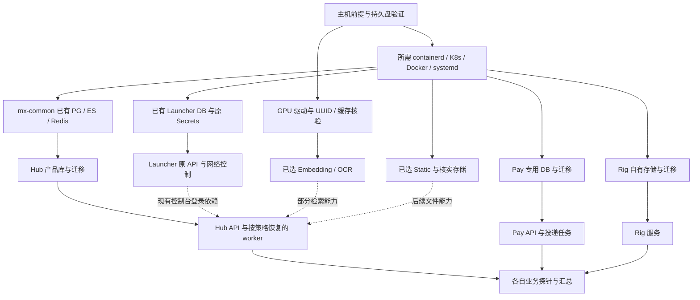

# MX 总部署命令与重启换机恢复设计

日期：2026-10-02。状态：设计规格，未实现总部署入口、未运行部署。配套：[平台架构与统一身份](33-mx-platform-identity-and-sustainable-architecture.md)。

目标是让操作者在完成一次安装配置后，通过一个总 `deploy` 命令，将已选择的 MX 子系统恢复或收敛到确定版本。子系统继续处理自己的环境、数据库迁移和就绪检查；总入口负责发现、依赖顺序、目标一致性、状态和故障归因。**重复 deploy 不代表重启全部系统，也不代表自动选择最新版本、自动恢复备份或初始化新的空数据库。**

用户已要求现有 H2I、Luopan、Hub 用户无感升级。总入口不能将更换 token、重建账号、重签 Key、换网络地址或用户重新登录作为正常升级步骤。现有架构尚不支持宣称所有发布零中断；不满足条件的子系统必须在计划中明确维护影响，先补能力或安排独立变更，不能用脚本掩盖。

统一管理 UI 与总命令是同一套能力的两个入口：用户可在 MX Launcher 查看所有已登记中心的状态、风险和配置，并执行其已验证的日常动作。线上 Luopan 位于 `/Users/qpjoy/workspace/mingxi/luopan/po-frontend`、分支 `feat/yjj/hdo_v2`，本轮只保护其 standalone launcher 接口，不修改该产品、不更新其依赖，也不把本仓库 demo 当成线上产品部署。

## 1. 现有部署入口与可复用能力

下表命令均为当前源码入口，执行前仍需使用各产品已核实的目标配置。本轮只检查文件，没有执行这些命令。

| 子系统 | 已有入口 | 已有边界与总编排适配要求 |
| --- | --- | --- |
| Launcher/Internal | `mx-launcher/scripts/manage.sh ops internal-production deploy` | 已有单节点 kubeadm 重启恢复、磁盘/PG/Secret 身份保护；不是任意新系统一键恢复工具 |
| Hub | `mx-insight-hub/scripts/manage.sh deploy` | 已调用 mx-common ensure、准备产品库与迁移；有停止条件，不能绕过存储身份错误 |
| mx-common 运行设施 | `mx-common/scripts/manage.sh ensure` | 管理共享 PG/ES/Redis，已保存存储身份；现有单节点/hostPath 假设需按目标核验 |
| mx-pay | `mx-base/mx-pay/scripts/manage.sh deploy` | 已有 discover、独立 PG、迁移后发布、凭据保留、结果 JSON；可作为新契约第一批适配 |
| MX Rig | `mx-rig/scripts/manage.sh deploy` | 自有迁移、配置和凭据；不能另启旧 auto-server/test-framework |
| Static/OCR/Embedding | `mx-base/scripts/manage.sh deploy <app>` | 各自 Docker/Compose、磁盘/GPU/凭据保护；当前部分命令要求交互确认，需显式机器接口适配 |
| Night-All | 现有宿主机流程/专用 Docker Adapter | 先登记为外部受管依赖，只读检测；不由总 deploy 隐式启动第二套 worker/采集 |
| 线上 Luopan | 外部产品仓库与既有 Release Center 消费协议 | 本轮不纳入自动构建/改码；记录当前制品、SDK 与补丁、渠道和产品网络，保持已安装客户端可用 |
| Portal/Identity/Control | 尚无本设计对应的独立安装包 | 后续独立适配；不能将逻辑名称写入清单后声称已可部署 |

现有脚本 `deploy` 有的构建镜像、有的 ensure 依赖、有的迁移时冻结写入口、有的会替换单容器。总部署第一版必须明确这些实际副作用，不能简单循环所有脚本后宣称幂等、零中断或故障隔离。

## 2. 命令体验

建议未来在 sibling `electron-dock/mx-platform` 放薄编排器；这是基础安装工具，不是又一个业务中心，不依赖 Launcher/Hub/SSO 已启动。该目录和命令本轮尚未创建。日常使用的目标接口：

```bash
# 以下均为待实现的设计接口，当前不能执行。
bash electron-dock/mx-platform/scripts/manage.sh deploy
```

第一次运行会读取指定安装清单；存在多套配置而未指定目标时停止并列出候选，不猜生产环境。确定后保存路径和安装 ID，后续日常 deploy 使用同一清单与锁定版本；可显式 `--installation <id>` 切换已登记安装。

```bash
# 设计接口：辅助操作与总 deploy 使用同一份计划模型。
bash electron-dock/mx-platform/scripts/manage.sh discover --inventory /etc/mx/installation.yaml
bash electron-dock/mx-platform/scripts/manage.sh plan --inventory /etc/mx/installation.yaml
bash electron-dock/mx-platform/scripts/manage.sh deploy --inventory /etc/mx/installation.yaml
bash electron-dock/mx-platform/scripts/manage.sh deploy --release /etc/mx/releases/approved.lock.yaml
bash electron-dock/mx-platform/scripts/manage.sh status --json
bash electron-dock/mx-platform/scripts/manage.sh doctor
```

普通 deploy 自动完成预检、计划、执行和验证；不要求每次重复回答同一批确认。首次缺少必要输入时集中提示字段、原因和影响范围，提供私有配置文件写入位置，不把秘密写进命令行或日志。已保存的安装决定和产品配置保持优先，默认值变化不覆盖旧值。

`deploy` 默认使用已锁定 release；重启恢复不拉 `latest`、不更新操作系统/数据库主版本。新版本通过明确的 release 文件进入计划。只改变某中心版本时只更新该中心及确有兼容要求的依赖，不默认连带更新 Launcher。

新增子适配器的无人值守调用使用可信计划 ID、输入摘要与明确非交互参数。当前 mx-base 交互脚本仍须适配，不能通过 `yes | ...` 绕过其未知输入、GPU 或存储检查；配置完整且动作已经明确授权后，目标应能无交互执行。

## 3. 安装清单与配置责任

安装清单保存目标与引用，产品仍保存自己的领域配置；秘密保存在受限文件/secret store，清单只记录引用。示意 schema 如下，不是可应用配置，版本和摘要需由发布过程填入：

```yaml
apiVersion: mx.platform/v1alpha1
kind: Installation
metadata:
  id: internal-main
spec:
  lifecycle: existing               # fresh | existing | restore
  releaseLockRef: /etc/mx/releases/approved.lock.yaml
  targets:
    internal:
      executor: local
      osProfile: verified-linux-profile
      kubeContextRef: /etc/mx/refs/internal-context
      expectedClusterUidRef: /etc/mx/state/internal-cluster-id
    gpu:
      executor: ssh
      connectionRef: /etc/mx/secrets/gpu-host
  proxies:
    buildRef: /etc/mx/secrets/build-proxy
    runtimePolicy: product-owned
  centers:
    launcher:
      enabled: true
      target: internal
      mode: adopt-existing
    common:
      enabled: true
      target: internal
      mode: adopt-existing
    hub:
      enabled: true
      target: internal
      databaseRef: common/hub-existing
      tenantMigration: none
    pay:
      enabled: false                 # 登记代码不等于要在这次新部署
      target: internal
      databaseRef: pay/dedicated
    rig:
      enabled: false
      target: internal
    embedding:
      enabled: false
      target: gpu
      gpuBindingRef: /etc/mx/state/embedding-gpu
  externalDependencies:
    nightAll:
      mode: observe-only
      endpointRef: /etc/mx/refs/night-all
```

示例中的 enabled 值不反映当前生产。第一次采用总入口时只读盘点实际运行服务，再由安装清单明确纳管；已经运行的 embedding 等不因示例 `false` 被停掉。`enabled=false` 表示不新增/不调度部署，**不代表自动卸载或停止现有实例**。期望运行状态使用另一个明确字段，避免“从目录移除”变成误删。

`adopt-existing` 必须核实资源标签、实例/集群/数据库身份、卷和版本后登记；不能将匹配名称视为所有权证明。既有未安装 pay/Static/OCR 等仅作可选产品，除非被清单显式选中，不自动启动或购买依赖。

### 配置分层

| 配置 | 权威归属 | 如何保持单一写入责任 |
| --- | --- | --- |
| 主机、集群、存储、release digest、资源预算 | 安装清单/锁文件 | 运维 UI 与 CLI 写同一版本化计划，不直接互相覆盖 |
| 账号、邀请码政策、身份源、组织 | Identity 管理领域 | Internal 页面调用身份 API；部署不重置注册政策 |
| 网络/VPN、产品 VIP、DNS desired state | Launcher | 总编排只检查依赖；网络变更单独计划，不混入普通服务 deploy |
| Hub 数据源、能力、预算、价格 | Hub | 由 Hub 校验保存；启动投影不成为第二份可编辑真相 |
| 支付渠道、应用凭据、收款开关 | Pay | 自有配置和审计；首次部署默认不启用真实收款 |
| Secrets | 每领域受限 Secret/恢复包 | 保留原值与版本，只透传引用；通用运维日志不打印明文 |

环境变量、数据库和界面配置有冲突时，报告实际来源与覆盖关系。显式迁移配置可改变来源；普通 deploy 不靠“最近修改时间”选择权威，也不删除未知配置来换默认值。

## 4. 子系统部署契约

每个中心提供薄适配器，复用原脚本，不复制它的业务迁移逻辑。第一批支持只读发现和计划，再分批启用执行。

| 操作 | 输入与输出契约 |
| --- | --- |
| discover | 不变更目标，返回版本、安装身份、实际依赖、支持动作、当前能力与 unknown 项 |
| preflight | 校验目标、版本、资源、网络、Secret 存在性、备份前提；只读，输出缺失项 |
| plan | 生成本次动作、将重启哪些进程、数据库迁移、停机/排空影响、前后版本与计划摘要 |
| deploy/ensure | 明确输入版本、目标与配置引用；持锁执行；退出码和持久 result.json 一致 |
| health | 分别返回 live、coreReady、capability readiness 与 evidence 时间，不能只返回绿色 |
| drain/start/stop | 描述是否接新任务、在途任务处理、worker/回调保留，按产品实现 |
| backup | 生成一致性备份、校验摘要与恢复配置引用；不等同已完成恢复演练 |
| restore | 只接受指定恢复集和新的/明确的目标，单独计划；不在普通 deploy 内自动触发 |

最小任务状态为 `planned/preflight_failed/running/blocked/succeeded/failed/unknown/cancelled`，另保留 `skipped_unchanged`。记录 installation/center/instance、release/config digest、步骤、开始结束时间、依赖状态、命令版本、目标资源 UID 和脱敏证据。`unknown` 表示未能确认外部执行结果，不能立即再发同一有副作用命令。

总任务锁按安装/目标协调，子任务保留产品自己的部署锁。固定锁顺序，禁止父锁等待子任务、子任务又回调获取父锁的循环。数据库迁移使用独立分布式锁；执行权带 generation/claim token，重启后的旧 worker 不能继续写完成状态。现有脚本若只支持人工确认释放死锁，先照实报告，不能因引入总入口就按时间盲抢锁。

部署计划与配置输入固定摘要，执行前再检查实际状态，变化则重新计划。中断恢复先核查 Job/Pod/目标版本和步骤凭据，再决定跳过、继续或待核验；不能凭本地文件写着“running”判断远程任务一定失败。

## 5. 依赖顺序与持续运行

启动依赖、业务能力依赖和管理关联是三类关系。将“可选模型故障”写成全平台启动依赖，会让所有中心都起不来；将“数据库不可确认”写成可忽略降级，则可能连错库。



图中 Identity 尚在 Launcher 内的兼容阶段。将来独立后，它拥有自己的存储/认证依赖；Hub 机器 Key 路径和 Pay 机器交易不依赖人员登录。门户与 Control 可最后启动，不能形成“需要登录运维页面才能启动身份服务”的环。

具体执行顺序：

1. 读取清单和锁文件，只读核验机器/集群/磁盘/凭据身份；汇总缺失项和计划。
2. 对显式受管主机准备必要 runtime；只启动 inactive 必要服务，健康服务不重启。
3. 按资源所有者准备存储与数据库，核实原数据后再启动；首次空库走独立 bootstrap。
4. 构建或拉取已锁定制品，验证 digest/来源；生产优先预构建镜像，避免恢复时依赖 npm/PyPI 在线。
5. 每中心按 prepare → migrate → rollout → readiness → verify 执行；数据库 owner 迁移权限与运行权限分开。
6. 恢复原计划中允许的 worker/scheduler；停用任务保持停用，恢复演练时全部禁用外部写入/付费派发。
7. 汇总每个中心结果，required 中心任一失败返回非零；依赖它的任务标 blocked，不伪装整体成功。

独立分支可有界并行，数据库迁移和同目标资源写入串行。默认不因 OCR 失败重启 Launcher，也不因为 Hub 部署失败回滚 Pay 的已发生事实。可选分支失败给出 degraded，required 分支失败使整次 deploy 失败；被明确选为必需的服务不能悄悄降为 optional。

当前 Hub 自己 ensure mx-common，总入口需指定共同依赖唯一协调方。过渡阶段可将“Hub+common ensure”封装成一个适配单元；之后再补 `externally-managed dependency` 模式，先由总入口 ensure，再让 Hub 只验证兼容。不要让两个并行脚本同时发布 shared PG/ES，也不能通过跳过原存储保护来实现拆分。

### 重启后不应依赖人手运行 deploy

常规进程/节点重启由 K8s 控制器、systemd、Docker restart policy 恢复原服务；mount 依赖和数据库身份保护必须存在于实际工作负载入口，而不只存在于部署脚本。deploy 是统一恢复/收敛入口，不是唯一保活机制。

应用对数据库/依赖恢复采用有界退避、连接池重建和任务租约恢复。启动探针处理慢启动，readiness 表示能否接对应请求，liveness 只反映自身无法继续工作，不能因某供应商离线而触发全站重启。K8s readiness 不就绪会停止常规服务路由，liveness 失败会重启容器，需要分别设计。[Kubernetes 探针](https://kubernetes.io/docs/concepts/workloads/pods/pod-lifecycle/#container-probes)

Compose 可按 health 条件安排初次启动，但不替代应用运行期间的断线重连和故障恢复。[Docker Compose 启动顺序](https://docs.docker.com/compose/how-tos/startup-order/)

## 6. 不同操作系统和首次配置

“换个系统部署”应解释为经验证的 Linux 安装 profile，不是任意发行版/版本都能自动兼容。优先验证一个 Linux LTS 主线，再保留现有 CentOS/其他已用环境的明确兼容 profile。macOS/Windows 是开发及桌面产品目标，不自动宣称与生产宿主机 WireGuard/systemd/GPU 能力等价。

Host adapter 负责识别发行版、架构、包管理器、cgroup、内核、时间同步、磁盘、DNS、端口、runtime；产品容器封装 Node/Python/依赖。已有 runtime/kubeadm/CNI 不因为默认版本更新而替换。GPU 驱动属于宿主前提，不能为了部署 OCR 自动杀其他模型、升级驱动或换 GPU。

| 前提 | 可以自动做什么 | 需要用户/运维提供什么 |
| --- | --- | --- |
| 机器与安装目标 | 发现并校验唯一目标，已有安装后固定 | 首次选择机器/集群；受限 SSH、known_hosts 与 sudo 权限 |
| 数据盘 | 验证 UUID、挂载点、读写与容量；新装明确目录 | 原盘/备份恢复集、目标路径；不自动格式化/选择旧副本 |
| 数据库 | 新装自有库可生成独立凭据；已有安装保留 | 外部托管 DB 的连接引用、迁移权限和备份能力 |
| 初始管理员 | 真正空安装生成一次性管理员凭据到私有文件 | 领取并完成账号安全配置；既有库缺 Secret 时恢复原值 |
| 飞书 | 检查原 App ID/Secret/allowlist 存在、保留旧回调 | 现有应用的新增 Web HTTPS callback、应用可见范围/发布配置 |
| 注册与找回 | 安装策略、邀请码管理、验证渠道适配 | 邮件/短信渠道、域名与防滥用策略；未就绪时明确阻断相应新开户能力 |
| 代理与下载 | 对本次构建、镜像/模型拉取使用指定代理 | 可用代理地址/凭据引用和镜像仓库；不修改全局系统代理 |
| 公开入口 | 生成计划和精确路由，验证证书 | 域名控制权、DNS/TLS、入口地址与已批准公开范围 |
| GPU | 验证型号、UUID、驱动和现有归属 | 安装 profile 支持的驱动与可用显存；不把 0% 利用率当可抢占 |

构建代理、服务调用出网策略、H2I 用户代理是三份配置。运行时 `NO_PROXY` 覆盖明确内网/集群目标，不把本机 `127.0.0.1` 代理地址原样分发到远端容器。子系统不会为了下载模型去改变 H2I 的 DNS、PAC、NRPT 或 WireGuard。

初始管理员仅在“从未安装、明确 fresh、无既有业务数据”的安装中创建。已有账号库、旧 Secret 查询超时、挂载丢失都不是创建新 admin 或跑历史 seed 的理由。安装重跑不轮换身份凭据、不打开注册、不重新发邀请码、不导入演示账号。

## 7. 三种恢复模式

### 7.1 同机重启

使用原 installation ID、cluster UID、文件系统 UUID、PV/PVC、PG system identifier 与 Secret 引用。deploy 核验后恢复 inactive 服务和缺失但可重建的工作负载。数据库/密钥/挂载不明时停止对应分支；API timeout/权限不足显示 unknown，不能当成资源不存在。

Launcher 已有恢复程序应继续作为其 owner，不由总入口再次实现 kubelet/Flannel/证书修复。其现有单节点前提、恢复检查点和停止条件保留。[Launcher 恢复说明](31-internal-reboot-recovery.md)

### 7.2 全新环境

明确 `lifecycle=fresh` 后创建新安装 ID、持久卷、产品库、独立凭据和初始管理员。只启动清单选择的中心；provider 调用、真实收款、公共注册、外部通知按已配置业务政策开启，不因容器启动成功自动开放全部能力。

### 7.3 换机器或重装系统接管旧业务

一个命令可以承载整个恢复流程，但需要明确恢复集和新目标，不能凭空推断原账号、密钥、钱包和网络状态。目标形式如下，仍为待实现接口：

```bash
bash electron-dock/mx-platform/scripts/manage.sh deploy \
  --inventory /etc/mx/new-host.yaml \
  --restore-set /mnt/recovery/mx-recovery-set.json
```

恢复集记录每个中心的备份版本、校验、时间点/WAL 范围、镜像 digest、schema、配置与密钥恢复引用、消费事件水位和依赖。解密密钥独立保存，不与加密包放在同一丢失故障域。清单相同不代表各库跨服务事务一致，要对账在途事件。

流程为：验证备份可读/可解密/时间与版本 → 在隔离新卷恢复 → 恢复原产品凭据和稳定标识 → 禁止外部派发的验收 → 对齐最后增量和事件 → 确认旧写入方停止/隔离 → 切入口 → 有序恢复 worker。恢复演练不允许副本调用真实供应商、通知客户或重复确认收款。

新机器的磁盘 UUID/节点/集群 UID 如实登记，保存旧到新的来源链；不伪造旧身份记录来绕过 guard。PG 物理备份不能直接跨主版本/不兼容平台启动，换架构或扩展环境需独立逻辑迁移与验收。[Hub 换机恢复规格](../../mx-insight-hub/docs/operations/new-host-restore.md)

### 恢复集必须覆盖什么

| 领域 | 需要保留的事实 |
| --- | --- |
| Launcher/Identity | 用户 ID、密码验证材料、原飞书配置与绑定、token/会话策略、必要签名密钥、角色与账号关联版本 |
| 网络 | ProductNetwork、lease、peer/站点配置与密钥、VIP/DNS desired state、所有权与恢复记录；不恢复另一机器的瞬时客户端路由快照 |
| Hub | tenant/member/binding/consumer/Key、pepper/加密材料、钱包/账本/幂等请求、数据目录/原始证据、outbox/inbox/检查点 |
| Pay | 资金事实、收款唯一标识、订单、应用凭据、outbox、交付水位、原加密材料 |
| Release | 制品及 hash/签名、渠道/灰度记录、对应版本清单；不能只备份数据库而丢安装包 |
| Rig/Static/AI | 产品数据、证据/文件、任务状态、模型版本/维度/缓存；恢复模型不能改历史向量兼容性 |
| 安装与配置 | 原部署档案、版本锁、可信主机清单、Secret 恢复引用、原数据库与存储身份 |

对产品机器身份的更换设置明确双凭据过渡；旧客户端 endpoint、Key、账号与租户保持兼容。K8s 旧 resourceVersion/运行状态/ServiceAccount token 不作为可直接应用的新集群配置。已有文件、索引与 outbox 的恢复点差异需要对账，不能因为搜索有结果就宣布恢复完成。

## 8. 数据、可用性与资源隔离

当前“Launcher 有自己的 K8s、Hub 用 mx-common”不足以证明是否物理上两个集群。盘点应记录实际 cluster UID、节点、盘和 DB instance，设计不提前合并或迁移现有集群。

近期普通中心可共享现有集群但分 namespace、ServiceAccount、数据库/角色、连接池和资源限额。Pay 保留专用 PG 和至少两个工作节点的生产规划；Identity 与既有 H2I 关键服务有保留资源预算，GPU/构建/批采集不挤占登录网络。

两个 API 副本不等于高可用：hostNetwork 端口、Recreate 策略、单节点 local PV、单 PG、单入口、单控制面和共同电源都可能形成单点。先测故障影响，再为关键服务拆节点/持久盘、完善数据库主备与入口冗余，不为所有小服务立刻建设独立集群。

以下是待确认和演练的目标，不是现网承诺：

| 领域 | 建议恢复目标 | 达成条件 |
| --- | --- | --- |
| 身份与关键网络控制 | RPO ≤5 分钟，RTO ≤30 分钟 | 可恢复 DB/Secret、有效网络备用路径、实测登录/联网；已连接数据面是否继续需实测 |
| Hub 身份/Key/钱包 | RPO ≤5 分钟，RTO ≤60 分钟 | 连续备份与 WAL、保留加密材料、完整对账；不能将 5 分钟账务丢失视为允许静默丢账 |
| Pay 已确认付款事实 | 目标故障模型内 RPO 0、RTO ≤30 分钟 | 同步复制/可靠故障切换与异地备份，收款外部事实可核对；跨地域灾难另定 RPO |
| 搜索投影与离线任务 | 先恢复可用能力，再追平投影 | PG/canonical 权威、检查点可重放、删除/撤权优先；索引恢复不重买数据 |

当前 Pay 单 PG 和现有单节点设施不能满足这些目标。需要以故障演练验证，不把“备份命令 exit 0”当恢复 SLA。资金/用量恢复出现缺口时冻结受影响结算并对账渠道/交付记录，不凭估计补余额。

数据库迁移采用扩展后收缩，保持前一应用版本可运行的窗口。回滚应用镜像不能撤销数据库更改或现实付款，破坏性 schema 收缩在旧版本完全退役后单独安排。[Kubernetes Deployment 回滚范围](https://kubernetes.io/docs/concepts/workloads/controllers/deployment/)

## 9. 运维页面如何使用同一套能力

### 9.1 单一界面、统一动作目录

最终用户体验不是一张链接列表。Launcher 每个中心工作区提供适用的业务管理、配置和运维页，常用启停、发布、日志、备份任务在当前界面完成；产品保留直接入口作为兼容和故障备用。线上 Luopan 的业务客户端按本轮范围保持原样，平台管理其已经属于 Launcher 的网络/发布对象。尚未实现的新中心和动作如实标为规划/未接入。

页面上的动作来自版本化 `ActionDefinition`：所属中心、目标资源类型、动作名、参数 schema、授权能力、影响等级、可执行环境、依赖前置、所需锁、幂等规则、超时、排空/取消边界、验收探针、回退方式、适配器版本。它是规划合同；仅声明支持不足以上线，需有真实适配和回归证据。

| 界面按钮 | 精确含义 | 必须保持的边界 |
| --- | --- | --- |
| 检查状态 / 诊断 | 读取状态和允许的只读探针，生成有时间戳的证据 | 不安装组件、不跑会改配置的演练、不因为红灯自动重启 |
| 重启服务 | 对选定工作负载按当前版本/配置有序替换进程 | 不自动重启数据库、共享网络或整台主机；目标有多个副本时按可用预算逐个处理 |
| 重新部署当前版本 | 使用锁定镜像/制品和现有配置重新收敛指定实例 | 不拉 latest、不构建当前分支未知代码、不初始化空库 |
| 部署指定版本 | 校验已选制品、依赖与迁移，执行可审阅升级计划 | 只改选择的中心及声明的必要依赖，不默默升级所有 SDK/服务 |
| 回退版本 | 对验证兼容的应用版本执行回退 | 不把应用回退当数据库回滚，更不撤销已经发生的资金事实 |
| 暂停/恢复任务 | 停止领取新任务，按产品合同完成或交接在途工作 | 采集、队列、支付回调分别定义，不能杀进程代替排空 |
| 启动 / 停止实例 | 收敛选定实例状态，展示其受影响的消费者 | 停止中心与停共享依赖不同；无人使用的证据不能由空日志推断 |
| 创建备份 | 执行产品备份合同、校验并登记恢复集 | 不重置业务，不将备份完成冒充恢复演练通过 |
| 恢复备份 | 指定恢复集、隔离目标、校验、唯一写入方交接 | 独立影响计划；不可混入重启/重新部署的失败补偿 |
| 续期并验证证书 | 交由已登记证书管理者检查/续期、部署并验证入口 | 一个证书一个 owner，保留现有挑战配置，不无条件强制重签 |

普通已授权动作使用已保存配置，一次点击自动预检、计划、执行、验证；不要求每次去终端复制命令或重新填数据库/代理。页面先显示固定目标和简短影响，状态变化导致计划失效才重新处理。恢复覆盖、停生产网络、主机重启等具有实际影响的动作才要求明确范围与维护安排，不对每个只读检查弹相同确认框。

### 9.2 现有命令如何变成受管动作

复用项目管理脚本的环境检测、资源和恢复保护，外加严格参数和结构化结果适配。适配器按已登记的动作 ID 构造固定程序与参数数组，不执行前端传来的任意 shell。仍含交互、隐式构建最新代码、启动兄弟服务等行为的脚本，先补明确模式与副作用声明；不能仅把原命令包进 HTTP 接口就宣称完成。

| 接入对象 | Launcher 中的目标管理能力 | 首期保护点 |
| --- | --- | --- |
| Launcher / H2I 网络 | 用户与网络诊断、控制服务状态、独立实例部署、原发布/灰度工作区 | 固定现有 SDK 协议、ProductNetwork、token、lease 与 peer；控制服务和网络数据面分别建动作 |
| Hub | 租户/成员、来源配置、服务与 worker 状态、部署、备份、任务排空 | 原租户/Key/钱包不变；shared DB 不是 Hub 的“重启全部”子步骤 |
| mx-pay | 应用接入与现有订单/事件状态、独立服务部署、通知积压与恢复证据 | 保持专用数据库；运维身份不自动成为支付经办，退款等未实现能力不展示可用按钮 |
| MX Rig | 测试工作区、任务/Runner 健康、部署与证据查询 | 保留本地账户、已有任务与产品权限，不重复启动旧测试系统 |
| Static / OCR / Embedding | 各服务配置、资源/模型/存储状态、启停部署和任务排空 | Static 上线单独验收；OCR 排空能力不足须标明；GPU/模型问题不连带重启身份 |
| mx-common 与主机 | 实际依赖拓扑、磁盘/DB/缓存、备份和已实现维护动作 | 影响范围由所有消费者计算；数据库/主机维护独立授权、版本与恢复计划 |
| 线上 Luopan | 已有产品网络、SDK 消费合同、当前版本/渠道和更新健康 | 本轮不改业务客户端、不升级 SDK/补丁、不主动推送新包；demo 不是验收替代品 |
| Night-All | 剩余依赖、健康、执行者和迁移进度 | 初期只读；有限动作需后续适配，不重新激活迁走的采集/计费路径 |
| 域名与证书 | 入口与到期、续期/部署状态、证据和允许的续期任务 | 先确认 Certbot/cert-manager/网关各自 owner，不创建第二个续期写入者 |

运维角色可按中心/环境授权重启或部署；产品成员、财务经办仍由目标业务服务校验。页面组合统一，不以隐藏按钮替代后端检查。API、日志和配置展示按调用者权限过滤，敏感 Secret 用引用/轮换动作管理，不通过 UI 下载全套服务器凭据。

### 9.3 后台任务、续跑和自更新

UI 与 CLI 调用同一 `plan/operation` 合同。计划固定 `installationId/instanceId/action/versionDigest/configRevision/actor/authorization/planExpiry`，显示精确影响、前置步骤和验证结果；执行前重新核验权限、目标版本和锁，避免浏览器切换环境或服务已升级后执行旧计划。

目标任务状态为 `queued → preflight → draining → applying → verifying → succeeded`，异常为 `blocked/failed/needs_reconciliation`；可取消阶段标明 `cancelled`，已安全回退另记 `rolled_back`。界面用自然语言显示当前步骤、耗时、实时脱敏日志、影响范围和下一步。取消不会直接 kill 正在提交数据库迁移的进程，超时或未知结果先查实际状态，再决定重试。

任务服务持久保存步骤、幂等键、预期/实际版本及证据。执行器按资源锁和 fencing 控制并发，重复点击返回同一未完成 operation；执行器重启后对账，而非把所有步骤盲目再跑。跨中心任务按依赖图推进，独立分支可继续，受失败依赖影响的分支明确阻塞。原来已经健康且没有变更的 H2I/Luopan 支撑服务不随总 deploy 反复滚动。

Control 和 Launcher 自身的重部署由独立主机/集群执行器完成，任务状态不能只放在即将重启的 UI 进程或浏览器。执行结果先写持久日志和受保护状态，UI 回来后重连；必要的主机启动 agent 不依赖 SSO 已启动。网络任务的控制连接若可能切断自身，必须有独立可达的恢复路径和经演练恢复步骤，否则不开放远程生产动作。

门户、身份或 Control 停机时，受限主机 CLI 和恢复材料仍可用。执行器机器身份不依赖员工浏览器会话续期；但只接续已授权且在执行有效期内的原计划，过期、超范围或新的危险动作不能据此绕过授权。身份失联按风险和撤权新鲜度策略停止新敏感动作；在途不可中断的事务到安全检查点，不因网页退出破坏数据库。

未来采用 GitOps 时，对选定实例由 Git 单独持有部署期望状态，UI/总命令提交同一变更并观察实际收敛；不能继续让脚本在其背后改同一资源。

### 9.4 稳定性决定按钮何时可用于生产

“按一下重启”可以实现，但原地重启单个进程、先停后启的单容器替换会产生服务窗口；单台服务器重启也不能由一个 UI 按钮变成持续在线。达到日常无感需先验证副本/入口容量、readiness、连接排空、会话外置、数据库迁移兼容及真实故障域。只配置 PDB 不能保证滚动更新零中断，更新行为还受工作负载控制器和发布策略影响。[Kubernetes 中断说明](https://kubernetes.io/docs/concepts/workloads/pods/disruptions/)

面向当前 H2I/Luopan 的约束，未满足这些条件的网络/认证重启动作在生产显示“需要先补齐无影响发布能力”，可在隔离环境演练；不通过确认框把无影响承诺转嫁给操作者。确需停机维护时属于后续单独明确的变更。故障已发生后的恢复也有独立的应急语义，不能把日常“重新部署”当任意破坏性自愈入口。

证书状态采集为只读；续期任务使用已有管理者和证书/部署目标锁，避免与 cron/timer 并发争抢。检查现有挑战是否需要暂停入口；有影响的方案先治理或进入明确维护流程。UI 展示“检查完成无需续期 / 已签发待部署 / 已部署待入口验证 / 全部验证成功 / 部分失败”，不能只依据命令退出码把所有入口标绿。具体 Certbot 语义参见 [架构设计 8.1](33-mx-platform-identity-and-sustainable-architecture.md#81-域名证书和服务质量)。

### 9.5 服务质量与完整接入验收

日志关联 `installationId/instanceId/operationId/requestId`，保留 center/product/tenant 范围。运行日志与业务审计独立保存；日志采集失败告警但不默认阻断已授权付款，审计/账务事务本身仍必须成功。风险首页显示真正影响与观测时间，不将未采集显示为正常。

统一管理完成需同时证明：所有现用中心进入资产清单；每个中心的常用管理任务有 Launcher 内入口；支持动作有适配与授权证据；未支持/外部托管能力明确标示；UI 关闭后任务不丢；单中心失败不误改其他中心；证书和风险有观测新鲜度；原 H2I、线上 Luopan 实包与 Hub 使用回归通过。仅增加菜单链接或写几个 shell 按钮不能作为“所有系统已整合”的验收。

### 9.6 服务与部署：菜单归属和现有生产档案

2026-10-02 用户补充现用 Launcher、Hub 部署命令，希望在 Launcher 界面更新自身及各服务；随后明确要求实现，并确认 OCR 已验证、四服务同机。以下为实际入口和目标合同；首批表单、命令预览和独立执行器已本地实现，具体支持范围见 [服务与部署使用说明](36-service-operations.md)，没有安装生产执行器或执行部署。

二级入口定为 **运行与维护 → 服务与部署**。选择环境及服务实例后，在同一工作区查看概览、部署版本、运行配置、依赖与任务记录。Launcher、Hub、Embedding 是该工作区的服务条目，不各占一个新的顶层中心。常用操作按实际支持能力显示；版本更新区明确区分“重启当前实例”“重新部署当前版本”“部署指定版本”。

| 运行与维护下的二级入口 | 内容及与现有入口的关系 |
| --- | --- |
| 运行概览 | 服务健康、观测时间、风险及消费者影响；承接现有概览和 Observability 能力 |
| 服务与部署 | Launcher、Hub、Embedding、OCR 的参数、命令、任务与独立执行器已本地实现；真实生产接入待安装验收 |
| 主机与站点 | 后续归纳现有 Internal/Domestic/Oversea 与主机 Runner 页面，保留原部署功能和路由 |
| 域名与证书 | 域名、HTTPS 到期、Certbot 等现有管理者、续期及入口验证；待接入 |
| 备份与恢复 | 恢复集、备份新鲜度、恢复演练和受控恢复；待接入 |

“发布与交付”继续负责 MX-H2I、Luopan 等客户端制品、版本渠道和灰度。服务器服务部署属于“运行与维护”。动作的最近任务在服务详情中展示，完整执行证据链接既有“日志与记录”，共用 operation ID，不维护两份任务状态。

**Launcher 现用档案（用户提供）**：

```bash
cd /root/mx/workspace/de-llaaddddeerr/electron-dock/mx-launcher
TMPDIR=/data/tmp \
MX_K8S_OS_HOSTNAME=mx-internal-server \
MX_K8S_APISERVER_ADVERTISE_ADDRESS=192.168.1.2 \
MX_SHADOW_BUILDKIT_KEEP_STORAGE=2GB \
MX_SHADOW_BUILDKIT_PRUNE_UNTIL=24h \
MX_LAUNCHER_BUILD_PROXY=http://127.0.0.1:7789 \
bash scripts/manage.sh ops internal-production deploy
```

该入口在当前源码中会执行 predeploy、主机/集群恢复检查、镜像构建、已有数据库迁移任务、Internal API rollout、默认安装/重启 native host runner、网关收敛和登录配置验收。Admin 三份资源由 `shadow_image_admin_assets` 装入服务镜像，因此这条命令不是单独替换网页。API 当前采用 `RollingUpdate`、`maxUnavailable: 0`、`maxSurge: 1`，有保留旧副本的发布策略，但不构成网关、Runner、网络及真实会话全部无中断的证明。本批 UI 没有新增数据库迁移，不代表完整 deploy 不会执行已有迁移任务。

当前 Launcher 仅在 `MX_INSIGHT_HUB_DEPLOY=1` 时追加 Hub 部署。未来“仅部署 Launcher”的适配器应显式限定为 `0`，不继承终端的隐藏联动选择。`ops internal-production status` 与 `gateway-smoke` 在带有 apiserver address 时可能进入 endpoint 修复分支；只读状态适配器必须隔离动作环境、禁用自动修复，不能把整个 deploy 环境原样用于定时状态采集。

**Hub 现用档案（用户提供）**：

```bash
cd /root/mx/workspace/de-llaaddddeerr/electron-dock/mx-insight-hub
MX_INSIGHT_BUILD_PROXY=http://127.0.0.1:7789 \
bash scripts/manage.sh ops internal-production deploy
```

独立 Hub 部署在未显式指定时令 `MX_INSIGHT_SYNC_LAUNCHER=0`，不会默认要求滚动 Launcher；后续适配器仍显式固定该边界。它会确保共享基础设施、执行 Hub 迁移和部署 API/worker，不能将其标为“仅重启网页”。生产状态和日志使用 `ops internal-production status` / `ops internal-production logs`；不能用裸 `status` / `logs` 代替，因为后者走本地环境入口。`smoke` 是显式验收任务，不归入自动状态轮询。当前此命令族没有通用 `restart`，后续需按具体工作负载适配，不能假造一个按钮命令。

**Embedding / OCR 实例档案**：用户随后确认与 Launcher 同机同项目，预填目录为 `/root/mx/workspace/de-llaaddddeerr/electron-dock/mx-base`。依据 [Embedding README](../../mx-base/mx-embedding/README.md)、[OCR README](../../mx-base/mx-ocr/README.md) 和 [根管理入口](../../mx-base/scripts/manage.sh)，实际执行仍须主机登记和预检。

| 页面操作 | 已有命令 | 接入约束 |
| --- | --- | --- |
| 状态 | `bash scripts/manage.sh status mx-embedding` | Docker 不可访问可能输出 UNKNOWN 但退出码为 0，不能仅据退出码标绿；结合采集时间与健康探针 |
| GPU 诊断 / 资源用量 | `bash scripts/manage.sh doctor mx-embedding` / `bash scripts/manage.sh stats mx-embedding` | 记录 UUID、显存与容器归属；只读状态不自动触发修复 |
| 日志 | `bash scripts/manage.sh logs mx-embedding` | 当前为持续 follow，需流式传输、脱敏、断线取消与保留期限 |
| 启动 / 重启 | `bash scripts/manage.sh start mx-embedding` / `bash scripts/manage.sh restart mx-embedding` | 复用已保存配置，执行现有 GPU 占用与 UUID 检查；不等于更新版本 |
| 停止 | `bash scripts/manage.sh stop mx-embedding` | 展示 Hub 向量化/RAG 消费影响；保留模型缓存、配置和 Key |
| 部署 | `bash scripts/manage.sh deploy mx-embedding` | 可能替换单容器；现有交互需适配为受控非交互合同，不能使用 `yes \| ...` 绕过 |
| 沿用现有共享 GPU 更新 | `bash scripts/manage.sh deploy mx-embedding --keep-gpu` | 仅部署动作支持，须核验正在运行且归属正确的实例；保留原 UUID、模型参数、资源上限和 Key |
| 模型验收 / 压测 | `bash scripts/manage.sh test mx-embedding` / `bash scripts/manage.sh bench mx-embedding --requests 20` | 显式消耗真实 GPU；不作为后台高频探针，不自动启动 Hub 历史向量化 |

README 记载现有实例沿用共享 GPU 3；接入时仍需读取实际 UUID/容器归属。普通 start/restart 保留严格占用检查，可能拒绝共享实例，`--keep-gpu` 不能用于 restart。构建时旧容器可继续服务，但替换仍有短暂窗口，不能声称共享模式支持无感重启或自动回滚。Embedding 的代理进入构建/运行容器，不能直接复制 Launcher/Hub 的 `127.0.0.1:7789`；应读取既有保存配置并核实容器可达地址。

依赖图把 Embedding 标为 Hub 向量化和 RAG 的能力依赖，动作只影响明确的消费者，不因其更新连带重启 Launcher、Hub 登录或全部 Hub 服务。部署不修改 Hub Provider、默认 Sequence、预算、索引维度，也不触发历史数据批量向量化。

上述档案以后保存为服务端受管配置：`instanceId / hostId / cwd / environmentProfile / secretRefs / sourceRevision / artifactDigest`。用户平时选择实例和动作即可复用配置，缺少主机路径、代理或凭据时一次性补齐。当前脚本会构建目录中的代码，界面必须在计划中固定可核验的代码/制品版本；不能把“重新部署当前版本”实现为对未知工作目录直接执行 deploy，或隐式 `git pull`。

**Launcher 自更新的特别条件**：现用 deploy 默认重启 native host runner，所以只把命令发给这个 Runner 仍不足以实现可靠自更新。任务需先交接到本次部署不会终止的受限执行器（例如独立 systemd 执行服务），持久保存 operation、日志、锁和验收结果；Launcher/Runner 回来后重新读取结果。不可在浏览器连接断开时取消部署，也不可仅由即将被更新的 API/Runner 判断任务成功。先做只读档案与状态，再做隔离自更新演练，通过后逐项开放生产动作。

当前已将独立执行器幂等接入 `ops internal-production deploy/cycle`，在镜像构建/API rollout 前安装并登记连接；同版本保留进程，新版本暂存后由旧执行器等待任务结果落盘再切换。主机地址、令牌、实例与任务保留，安装失败停止后续发布；正常更新已通过本机真实子进程验证，systemd 实际托管与生产连通仍待验收。详见文档 36。

## 10. 实施顺序与放行条件

| 阶段 | 交付 | 验收 |
| --- | --- | --- |
| D0 | 只读盘点、统一配置/结果 schema、原安装及域名/证书纳管档案 | 不改运行服务；unknown 不误报不存在；不输出秘密；外部 Luopan 与 demo 分开 |
| D1 | 总 discover/plan，先接 Pay，再接 Launcher/Hub/Rig/基础服务 | 精确列出副作用、版本、迁移、资源和依赖；循环依赖拒绝 |
| D2 | 总 deploy 与持久步骤、已授权非交互适配 | 重跑无额外变更；失败非零；无重复迁移；只更新选择的中心 |
| D3 | 同机重启恢复演练、健康与业务探针 | 原账号/飞书/Key/钱包不变，H2I/Luopan 同机连接回归通过 |
| D4 | 加密恢复集、隔离换机演练、唯一写入方接管 | 原数据/身份/密钥保留，副本不发付费请求，不双写 |
| D5 | Internal UI 接入同一 operation、中心工作区、证书和风险任务 | UI 关闭或自更新后可查结果；Control 挂掉可从 CLI 恢复；日常动作无手动跨中心补录 |

D5 的只读界面和动作目录可与 D0/D1 同步做；某动作完成适配及隔离验收后逐项开放，不要求全部换机恢复功能完成才允许安全的日常管理，也不提前开放未经验证的生产重启。

最低故障测试：磁盘未挂载、Secret 缺失与 API 超时、错误 cluster context、迁移失败/超时、部分 rollout、执行器 SIGKILL、镜像不可达、GPU 不匹配、依赖循环、Pay 独立失败、注册政策被改、旧/新身份绑定冲突、UI 重复点击与关闭、Control 自更新、证书已续但入口未切换。根据产品使用隔离数据库与替身执行器；真实同机重启、飞书授权、VPN 路由、线上 Luopan 发布包兼容及换机需要在可恢复测试环境或受控发布中验收。

本轮没有实现上述总命令。下一步最小工程交付应是 **D0/D1 只读 discover/plan + P1 平台入口**，并在隔离环境验证 SSO/飞书/邀请码/账号绑定；不直接从新总入口一键发布所有生产系统。
