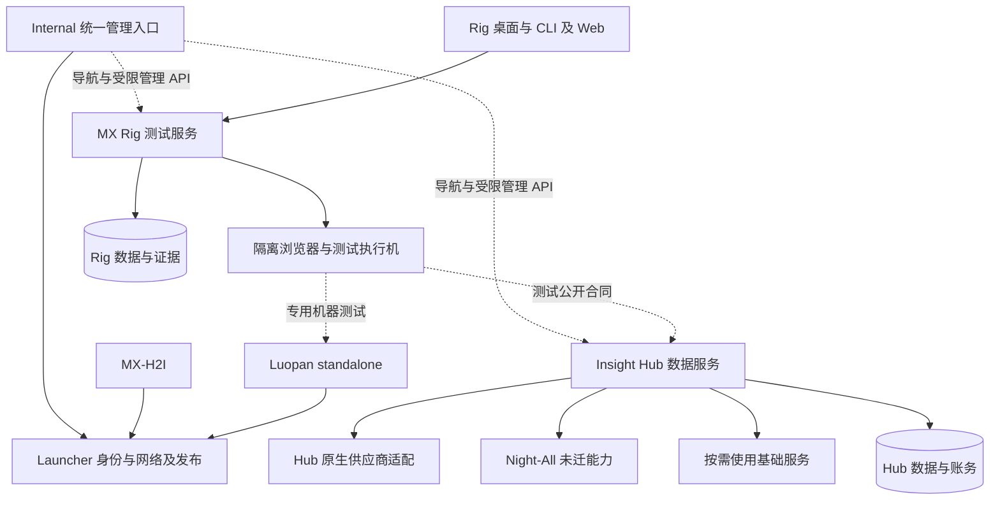

# MX 项目全景解读与测试工作台规划

日期：2026-10-02。源码基线：本仓库 `cbbab348`，Night-All `5359297`。本文是架构走读和后续规划；本次仅更新文档，没有改变运行代码或执行部署。

结论：MX 已经形成平台基础设施、桌面产品、数据产品、独立基础服务和测试产品五个边界。MX Rig 已超过“集成几个测试框架”的阶段，具备自己的 Agent Runtime、测试资产、确定性规程和执行机。下一步应围绕一次可复现、可审阅的测试任务，把需求、环境、执行、证据、修复与复验连接起来。

“类 Codex”在本文中指用户希望的项目内对话、工具执行、过程可见和变更审阅体验，不是对 Codex 当前功能的逐项比较，也不要求引入其 SDK。沿用 Rig 后续已经确认的独立账号、自有 Runtime 与可选平台集成方向。

## 阅读范围与事实等级

本次查看 Launcher 设计索引及核心边界文档、MX-H2I/Luopan 的接入代码与说明、Hub 的迁移合同和关键路由、Night-All docs/specs 及部分 provider 代码，以及 Rig 客户端、Runtime、存储、模型、规程、执行机、评测和部署代码。它是跨项目架构走读，未逐行审计全部代码，也未对当前界面进行视觉或可用性测试。

以下三个状态必须分开：

| 状态 | 本文含义 |
| --- | --- |
| 源码已有 | 找到对应实现和相关测试；不等于已部署、已启用或线上健康 |
| 本次验证 | 在当前机器实际执行并得到结果 |
| 建议规划 | 后续需要实现或验收，不作为现有能力展示 |

当前目录需要先澄清：`mx-rig` 位于 `electron-dock/mx-rig`，与 `mx-base` 平级。`mx-base` 是独立基础服务集合；Rig 是产品。二者可以通过同一 Internal 运维入口管理，无需移动目录或合并数据库。

## 整个项目的职责地图

| 模块 | 当前职责与实现 | 规划中的边界 |
| --- | --- | --- |
| `mx-launcher/packages` | core 协议、standalone/embed SDK、Electron 门面和本机能力 | 给产品提供稳定合同；包的设计说明与实际导出分别核验 |
| `mx-launcher/server` | 用户、权限、AppCenter、ProductNetwork、配置、发布、测试门禁与运维 API | Internal 统一管理入口；按领域演进，不把各产品业务搬入 Launcher |
| `demos/mx-h2i` | 以 Internal 为权威配置面的 VPN 产品；本机负责网络执行、验证、恢复 | 保持已有登录、访客/员工切换、网络 owner 与更新链路 |
| `demos/luopan` | Quasar/Vue/Electron 消费 standalone Launcher，验证网络、用户、发布等能力 | 作为 SDK 集成测试对象；不能用 demo 通过替代实际业务产品兼容验收 |
| `mx-insight-hub` | 数据来源、固定供应商合同、租户/Key/授权、计量与账务、归档、canonical、检索、Agent Studio 静态设计 | 逐能力接管 Night-All，独立持有数据产品事实与产品授权 |
| Night-All | 原有采集、搜索、资料/活动编排、Python/技能执行及历史数据 | 未迁能力与旧状态的过渡来源；按合同退出依赖 |
| `mx-rig` | Electron/Web/CLI、Agent Runtime、测试控制面、Runner、规程、证据与报告 | 面向测试的项目工作台，独立运行，消费产品公开合同 |
| `mx-base` | pay、static、OCR、embedding、可选 Jenkins 等独立服务 | 各自部署、凭据、存储和生命周期；按需要接入产品 |
| `mx-common` | 可复用技术实现，以及既有共享基础设施部署资料 | 技术复用不改变业务数据归属，也不自动实现故障隔离 |

仓库根部还保留 V1 HDO、VPN、插件等历史系统。本规划聚焦上述 MX 主线，不把 V1 和现有客户端做一次性重写。

### Internal 是权威操作面

用户提出“所有配置都在 Internal”，应落实为：组织策略、网络 desired state、模型连接、工具策略和审计由所属 Internal 服务管理；客户端只保存运行所需的本地身份、缓存、路径与状态。

统一入口可以展示并提交各产品的配置，但由所属产品校验和保存。模型密钥属于 Rig 服务端，Hub 供应商密钥属于 Hub，ProductNetwork 属于 Launcher。无需让 Launcher 成为所有业务请求的中转或数据库写入者。

文档 [32](32-platform-business-centers-and-management-integration.md)、[33](33-mx-platform-identity-and-sustainable-architecture.md) 已明确这个方向；[36](36-service-operations.md) 已有四服务运维入口和独立执行器的本地实现。Rig 接入该入口仍需自己的动作合同，不能把已有 Launcher/Hub/OCR/Embedding 目录当作已经支持 Rig 部署。

### 平台与产品的关系

图中 Rig 对 Hub/Luopan 的测试属于目标接入；没有表示本次已完成这些测试包。MX-H2I 登录和联网不依赖 Rig、Hub 或模型可用性。

## 四条主要运行链路

### Launcher 与桌面网络

Internal 维护用户、权限、产品网络、lease、版本和配置；Domestic 承担受控 bootstrap、中继及产品服务映射；standalone 在本机应用自己的网络配置。MX-H2I 和 Luopan 拥有独立的产品身份与网络资源。AppCenter/H2O 等 embed 通过选定 broker 使用能力。

“lease 已分配”“路由已安装”“服务可达”是三个结果。测试需要分别记录，不能拿 HTTP 健康成功推断 DNS/PAC/NRPT 正确，也不能拿 Luopan route smoke 推断 MX-H2I 全链路正常。

Luopan README 还明确没有专门的 permission/grant 测试 IPC 或页面，因此它适合作为集成试验场，但不应被描述为权限功能已完整覆盖。具体权限用例需补在 API 合同和 UI 两侧。

### Hub 数据请求

客户请求经 Hub 身份与当前授权、参数合同、配额/预算、幂等及账务检查，进入固定操作或兼容适配，最后形成交付快照、请求证据及需要的存储投影。浏览已有记录、重新获取数据、历史重放是不同动作。

Hub 源码已经具有较多数据产品与治理能力，不能再按 Night-All 八月 specs 中“Hub 尚待创建”的结论规划。另一方面，目录中有端点不等于凭据、价格、授权、启用和真实调用都已就绪。

### Rig Agent 任务

桌面主进程或 CLI 创建本地 Runtime，Web 使用服务端 Runtime。Runtime 取得 Rig 策略，调用 Rig 模型网关，验证工具输入和权限，执行观察或动作，保存任务、断言与证据。浏览器、Electron 和终端文件/命令在有对应能力的客户端执行。

桌面 renderer 不持有 bearer；模型密钥在服务端。CLI 已能识别项目、读文件、运行命令、审阅后修改测试。不能再把“Agent 无法写测试代码”作为当前缺口。

### Rig 确定性测试

现有 Suite/Task 经 Runner 或 K8s Job 执行，通过 JUnit/summary/事件/产物形成 Run。Procedure 使用同一浏览器工具确定性重放，失败时可交 Agent 提出修正，验证后审批为新版本。两条路径都应进入同一测试事实和质量报告。

Agent Mission 完成只表示工作流完成；测试 Run 可以仍然失败。修复建议、规程新版本验证、正式复验和平台发布门禁各有自己的结论。

## Rig 的现有基础与实际缺口

| 能力 | 源码事实 | 下一步重点 |
| --- | --- | --- |
| 产品客户端 | Electron、共享 Web、独立 CLI 包 | 同一项目与任务上下文，能力差异在入口显式展示 |
| 测试内核 | App/Suite/Task/Case/Run/Runner、JUnit、产物、通知、取消 | 用真实项目形成完整验收链，保留既有结果语义 |
| 自有 Agent | 自建 StateGraph，agent/workflow/orchestration，策略和工具白名单 | 稳定工具与证据合同；暂不换引擎、不嵌套第二套状态机 |
| 浏览器与 Electron | ref 快照、动作、断言、trace、视觉帧、人工接管与回放 | 复杂登录、环境数据、长流程和实际产品场景验证 |
| 原生桌面 | macOS 辅助功能预览 | 实机权限/生命周期验收；Windows UIA 尚待实现 |
| 试验规程 | 草稿、重放、失败修正、验证与批准 | 加强测试意图和断言变更审阅；接入真实回归资产 |
| 终端代码能力 | 项目识别、RIG.md、读搜写改、命令、会话续接 | 测试变更与 Run 关联、受控工作区、测试目录写入范围 |
| 持久化 | PostgreSQL 控制面、版本化配置、审批 CAS、本地同步 outbox | 失联恢复、旧执行者写入、证据上传和团队检索验收 |
| 调度 | 计划、定时规程、station、hooks | 环境占用、清理、容量与长期运行可观测性 |
| 模型 | Chat Completions 兼容 Provider、顺序降级、流式、token 计量 | 真实模型基线；失败尝试与未知费用单列；按需扩协议 |
| 上下文 | 工具结果压缩，保留引用 ID | 保存测试目标、失败签名和决策依据；不是无限长任务记忆 |
| MCP | 对外 stdio 服务，写能力显式开关 | 只暴露稳定测试合同；不当作 Runtime 外包机制 |
| 评测 | 固定场景，脚本模式与真实模型模式 | 脚本通过与 Agent 成功率分开报表 |
| 平台身份 | Rig 自有账号，可选 Launcher 联邦 | 保留账号；未来 SSO 以显式身份绑定增量接入 |

旧 `mx-test-framework`、`mx-auto-server`、`demos/mx-autotest` 是历史线。测试内核已迁入 `mx-rig/packages/test-platform`，后续只在这个内核演进，避免四处同步实现。

## 应优先解决的工程问题

### 证据需要从本机记录变成可交付结果

`packages/runtime/sync.mjs` 同步的是任务投影，去掉 transcript/checkpoint/raw evidence，超过 512 KiB 会裁剪事件。它解决了“网页能看到本机任务”，不等于团队能完整读取截图、trace、命令输出或恢复浏览器现场。

建议复用测试内核产物接口，增加带 hash、来源 Run/Mission、保留期限、访问范围和上传状态的 EvidenceManifest。报告遇到仅本机存在的证据应说明不可远程读取；不能显示一个看似可用的跨设备链接。

### 执行授权需要与测试环境绑定

当前已有按工具与策略版本审批、站点授权和任务级浏览器预授权。下一步将授权明确绑定项目、环境、目标构建、可写路径、命令、截止时间和测试预算。既定范围内连续执行，超出范围再审阅。

源码 `workspace.mjs` 的文件工具拒绝凭据文件，但 shell 执行是另一条边界：macOS 沙箱主要限制写入，Linux 使用根目录只读挂载，网络保持开放；Windows 没有同等命令沙箱。不要把文件工具的拒读规则描述成 shell 也无法读取同类文件。团队无人值守执行应优先使用专用工作区/执行身份，并单独设计凭据注入和可读范围。这是静态代码观察，本次未读取真实凭据或进行攻击验证。

### 多副本支持仍需要故障验证

已存在 PostgreSQL 任务、审批与调度认领，不需要重新开发这些能力。本次因未设置测试数据库而跳过 14 项 PG 测试。尤其应覆盖暂停超过失联时限后旧实例恢复、取消与迟到结果竞争、滚动升级及数据库短暂不可用。

具体审阅点：`PgMissionStore.save()` 的整行 UPDATE 当前按 `id` 定位，`sweep()` 会清除失联 holder。需要用故障注入验证旧执行者恢复后不能覆盖已回收状态，并按结果补持有者/代次校验；本文不把未复现的竞争路径写成已发生事故。

### 任务体积与模块复杂度正在增加

本次源码中 `apps/web/views.js` 为 6295 行、Runtime `engine.mjs` 为 1861 行、`browser.mjs` 为 1581 行。文件长度本身不是缺陷，但同时容纳项目、规程、任务和管理功能会提高后续改动的验证成本。

按功能增量拆项目入口、任务对话、规程、证据、管理视图；保持现有原生 ES modules 和 Neon Void。用户目标不要求把 Rig 重写为 Quasar/React，也不要求立即引入另一套图引擎。

## Night-All 迁移的当前基线

迁移单位采用“平台 × 操作 × 请求形状 × 合同版本”。按供应商名字整体切换，会漏掉默认参数、账号解析、补详情、分页缓存和多次付费调用。

| 能力组 | 当前源码与后续文档 | 下一步 |
| --- | --- | --- |
| Web Search HTTP | Hub 已直接适配百度及七家 HTTP 搜索供应商，不经过 Night-All | 验证合同、授权、幂等、响应和实际已启用渠道；不再列为从零开发 |
| 微信搜索 | `/search/raw` 与 `/data/search` 微信分支转到 Hub native 合同；显式 `/night-all/search/raw` 微信分支返回 410 | 对新响应、明确不支持参数和旧游标拒绝做迁移验收；不能套用“旧三个接口一律保持原样” |
| 小红书 | 已有原生端点及部分 legacy raw/crawl/user-info 形状的条件直连 | 按条件、cursor 和运行配置列清覆盖范围；不能宣称全量已替换 |
| 其他 TikHub/JustOne | 固定原生合同目录与治理链已有；旧兼容语义并未因此自动迁完 | 补映射、投影、请求图和分页回归，逐形状切换 |
| RapidAPI Twitter/Facebook | 当前迁移清单仍列为 deferred，兼容路径保留 | 先确认流量与合同样本，再做 HTTP 适配和兼容投影 |
| TGStat、SearXNG/搜索技能、正文抽取 | 当前迁移清单仍列后续组 | HTTP 能力直接适配；确需 Python/浏览器的工作放独立受控 worker |
| 旧记录和后台采集 | HTTP 接口迁移不能证明所有旧库读者、scheduler、文件和游标依赖消失 | 另列数据读者、写者、历史记录与后台任务退出清单 |

这里的“已有”不代表生产操作已启用。`server/data/provider-migration.mjs` 是规划快照，仍返回固定 `legacyCutovers: 0` 与通用旧路由文案；它与微信的后续实现并非同一时间基线。应将规划库存、代码支持、配置启用、现场证据分列，避免把该数字当运行实况。

迁移验收由 Rig 执行测试，Hub 持有路由、授权、费用、数据和最终切换决策。Rig 不应为了测试而保存一套可调用供应商的生产密钥，或成为另一个数据采购入口。

建议流程：冻结脱敏样本 → 离线合同对照 → 模拟上游与故障 → 隔离环境验收 → 有界真实调用 → 按形状切换新请求 → 排空旧游标和在途状态 → 核对旧读者 → 退役对应依赖。影子比较使用已有归档，避免新旧路径双发付费请求。微信等已明确改合同的路径按新合同验收，不能强制旧响应等价。

## 测试工作台的产品方向

用户入口围绕“测试一个项目或一项变更”：选择项目与环境，描述目标，查看计划，运行，阅读证据，审阅修复并复验。Agent 市场、模型与编排配置退为辅助入口；保留测试用例、计划和报告的直接操作能力。

测试任务同时连接三种执行方式：

1. **确定性套件**：现有代码测试、API 合同、性能与 Electron 包，通过现有 Runner 接入。
2. **确定性规程**：稳定 UI 流程按版本重放，不消耗模型来决定每一步。
3. **Agent 工作**：理解需求、探索未知页面、定位失败、生成或修复测试，并提交可审阅结果。

Rig 的独特价值是把第三类工作持续转化为前两类资产，同时保留测试意图和证据。实现任务对话后，不能用模型说“通过了”代替断言或测试报告。

Hub Agent Studio 当前有静态 Draft/Compile/Artifact 能力，源码仍把 Sandbox/Eval/Release/Deployment 标为 unavailable。Rig 可以从外部测试 Hub 公开行为；Hub 内部 Agent 数据集、trace、eval 和发布事实仍由 Hub 自己持有。不要为复用而合并两套产品状态机。

## 分阶段路线与完成标准

默认建议先用 Hub API 与 Night-All 迁移做验收，再扩展 Luopan/Electron，最后是影响系统网络的 MX-H2I 专用机矩阵。这是优先级建议，尚不是用户已经选择的实施顺序。

| 阶段 | 主要交付 | 完成标准 |
| --- | --- | --- |
| P0 现状与可靠性基线 | 能力矩阵、测试基线、文档时效、PG 故障场景、证据现状清单 | 源码/部署/启用/验收分开；真实数据库回归有记录；关键未知状态不伪装成通过 |
| P1 项目测试任务闭环 | 项目与环境引用、已有套件接入、统一 Run/命令/断言证据、失败分析 | 一个真实项目从新建任务到复验可追踪；模型不可用仍可跑套件 |
| P2 可维护测试资产 | 规程/代码变更审阅、隔离工作区、版本与断言变化、定时回归 | Agent 修复需可复现；测试缺陷和产品缺陷分开；正式回归不依赖模型临场判断 |
| P3 跨产品验收 | Hub 迁移合同包、Luopan Electron 包、MX-H2I 专用机矩阵、平台摘要接入 | 产品权限和网络边界均有负例；Rig 故障不影响被测产品正常运行 |
| P4 扩展交付 | 真实模型效果基线、跨平台安装、容量/备份恢复、按需 Windows 原生工位 | 目标机器与模型有可重复证据；容量和失败恢复达到团队确认的指标 |

每阶段以验收证据结束，不按新增页面数或 Agent 数结束。详细对象、任务拆分和首轮 backlog 见 [Rig 下一阶段实施规划](../../mx-rig/docs/19-test-workbench-plan.md)。

## 本次验证与尚未验证

| 检查 | 本次结果 | 限制 |
| --- | --- | --- |
| `npm run check` | 189 个 JavaScript 模块通过 | 语法与现有网络耦合守卫，不证明行为正确 |
| `npm test` | 567 项：553 passed、0 failed、14 skipped；约 59 秒 | 未配置测试数据库，14 项 PG 多副本测试跳过 |
| 评测 harness | 全套测试中的脚本场景测试通过 | 不代表真实模型成功率；未调用模型供应商 |
| 初次受限环境回归 | 本地监听 EPERM、嵌套沙箱能力等导致失败 | 后在允许本地服务/浏览器的环境复跑得到上述结果，初次结果不作产品失败统计 |

没有执行生产登录、数据库迁移、Docker/K8s 部署、付费数据请求、MX-H2I/Luopan 网络操作、Windows/Linux 真机或新安装包验收。历史验证文档中的安装包结果只作为已有记录，本次未复验。

## 证据入口与文档维护

主要源码入口：

- Launcher：[SDK 包边界](../packages/README.md)、[Luopan 宿主](../demos/luopan/src-electron/electron-main.ts)、[MX-H2I Runtime](../demos/mx-h2i/src/main-runtime.cjs)、[Hub 薄集成](../server/src/modules/insight-hub/insight-hub.client.ts)。
- Rig：[服务入口](../../mx-rig/apps/server/index.mjs)、[任务引擎](../../mx-rig/packages/runtime/engine.mjs)、[工具目录](../../mx-rig/packages/runtime/tools.mjs)、[工作区执行](../../mx-rig/packages/runtime/workspace.mjs)、[PG 任务](../../mx-rig/apps/server/pg-missions.mjs)、[同步](../../mx-rig/packages/runtime/sync.mjs)、[评测](../../mx-rig/evals/README.md)。
- Hub：[兼容服务](../../mx-insight-hub/server/hub-service.mjs)、[微信合同](../../mx-insight-hub/server/contracts/wechat-search-alias.mjs)、[Web Search](../../mx-insight-hub/server/web-search/contract.mjs)、[迁移库存](../../mx-insight-hub/server/data/provider-migration.mjs)、[Agent Studio 状态](../../mx-insight-hub/server/agent-studio/store.mjs)。
- Night-All：本地 `/Users/qpjoy/workspace/mingxi/Night-All/specs/README.md`、`NIGHT_ALL_RUNTIME_AND_BOUNDARIES.md`、`MX_INSIGHT_HUB_TARGET_ARCHITECTURE.md`，以及 `lib/domains/search/providers/provider-registry.js`、`provider-fallback.js`。本次只读。

后续维护沿用现有目录：Launcher docs 保存跨产品边界，Rig docs 保存测试产品设计，Hub docs 保存数据能力与迁移合同，Night-All specs 保留其本身运行边界。对过时说明增加明确的后续入口，不抹去历史决策，也不把规划改写为已交付事实。
