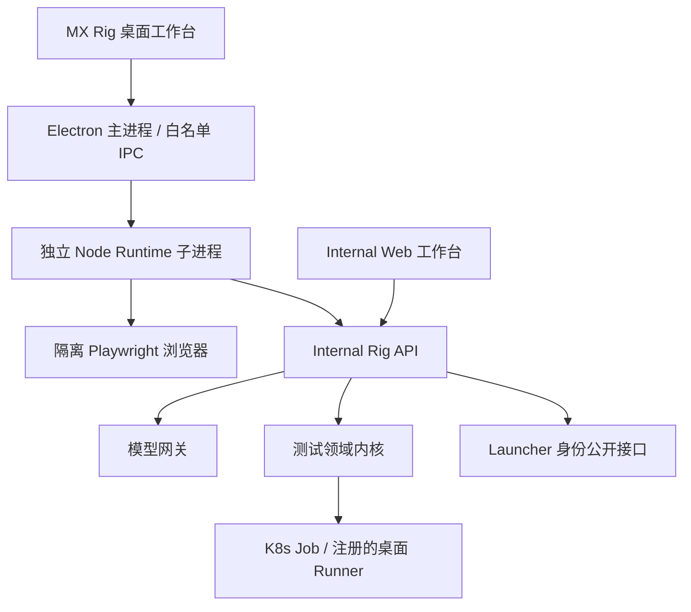

# 架构与迁移决策

状态：MX Rig 0.1 已实现的边界；2026-09-14。

## 产品边界

MX Rig 是一个工作区、一个桌面产品、一个独立 Internal 服务。无需在 Launcher demos 放产品副本。桌面通过稳定 API 使用身份和任务；未来消费 Launcher SDK 时使用已发布包，不相对导入 MX-H2I 主进程。

桌面身份、测试平台 Runner 身份和任务执行身份不同。模型密钥仅在 Internal，Runner 获得的是测试范围凭据。网页内容、测试输出不作为新的授权来源。允许列表由 Internal 管理，实际动作前重新取得当前策略并检查角色。

UI 采用本地 HTML/CSS/ES modules，无远端脚本、无 Node 集成，不依赖 Quasar 构建。桌面与 Web 共用 UI 以减少首版两套客户端维护成本。原测试管理台继续消费 Neon Void 包，后续组件化不涉及身份合同。

## Mission 与测试 Run

Mission 状态：queued / running / awaiting_approval / completed / blocked / cancelled；reserved failed 用于后续区分确定的任务失败。当前工具/环境/预算错误均为 blocked。

一次写工具调用必须先落盘待确认的工具名、完整参数、approvalId 和 policy revision。确认不可重用。执行前策略改变即拒绝。用户、服务地址不同，桌面工作目录不同。历史不会储存登录 token 或模型 key。

测试 Run 保留旧平台的 passed / failed / flaky / blocked / expired / cancelled 等语义。Agent 的 completed 只说明编排结束。测试失败仍可产生一个成功完成分析的 Mission，二者通过 testRunId 或工具结果关联。

模型提供者通过 Internal `/api/rig/v1/model/turn` 接口替换，不进入测试框架。首版只适配 Chat Completions 工具协议；LangGraph、Codex App Server、MCP 可在真实需求出现后接入，不能同时引入多套顶层恢复状态机。

## 历史代码迁入

`mx-test-framework` 的 server/bin/contracts/migrations/web/tests 迁入 `packages/test-platform`，保留已验证的业务模型、JUnit、调度、Runner 认领和报告。`mx-auto-server` 的独立环境映射用于新服务，外部命名为 MX_RIG_*，清除旧 MXT_* 注入，不继承旧 namespace/数据库。

旧目录暂存作历史，不作为新服务依赖；不在两个内核同时开发。现阶段不删除旧目录，因为它们的历史脚本、文档及其他引用仍有价值。待新产品真实验收后，可单独提交归档删除。

迁入后有意保留 `mxt_*` 数据表、Runner HTTP 路径和运行环境合同，以免仅为品牌更名破坏测试包。Cookie 改为 mx_rig_session，CLI 本机身份目录改为 `.mx-rig-runner`，服务资源改为 mx-rig。

## 生命周期

Runtime 退出只关闭自己的隔离浏览器；不操作其他进程树和任何系统网络。待确认任务重启后为 blocked，防止在原页面上下文丢失后执行旧点击。服务端已提交的测试取消由测试 API 单独执行，Agent 取消不假装将远端任务撤销。

模型调用最多 4 个并发、每用户 1 个，单请求 60 秒，任务最多 30 轮；工具及网络响应有大小上限。测试 artifact 延续字节、文件/目录数量和剩余磁盘双预算。Windows 没有 Unix inode 指标时不把 0/0 误判为耗尽；Unix inode 保护仍有效。

## 尚待交付的能力

原生 Windows/macOS 自动化、移动 App Runner、工具包缓存管理 UI、MCP、Hub 工具与持久流程模板尚未交付。首版已具备工具注册/参数/权限边界，扩展这些能力不需要进入 Launcher 的登录或联网模块。
