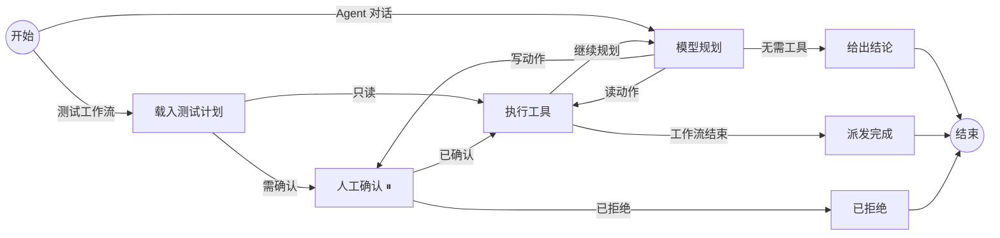

# Agent 中心与编排运行时

状态：MX Rig 0.7 已实现的边界；2026-09-16（0.2 起持续更新）。

本文说明 Agent 中心的数据模型、编排运行时的语义，以及为什么这一版选择自建而不是直接依赖 LangChain / LangGraph 的 npm 包。

## 借鉴了什么，自建了什么

运行时的形状直接借鉴 LangGraph 的 Node.js 版本：State（带 reducer 的通道）、Node（返回增量的函数）、Edge 与条件边、`interrupt()` 暂停 + checkpoint 恢复。结构化校验借鉴 LangChain 的 zod 用法：工具参数、状态通道、HTTP 请求体全部由 schema 约束，而不是手写 if。

实现是自建的，装在 `packages/graph/`，原因有三条：

- 桌面端把 Runtime 打进 asar，`@langchain/langgraph` + `@langchain/core` 的依赖树太重，且与 Playwright 一起分发会显著放大安装包。
- 审批、策略版本校验、取消语义是这个产品的安全边界，必须能逐行审计；套一层通用框架会把这些规则藏进它的恢复状态机里。
- 编排中心要画的是"真实在跑的那张图"。自建后 `describe()` 与执行同源，图不会和实现漂移。

对应关系：

| LangGraph 概念 | MX Rig 实现 | 位置 |
| --- | --- | --- |
| `Annotation` / reducer | `channel(schema, { reducer, initial })` | `packages/graph/state.mjs` |
| `StateGraph` / `addConditionalEdges` | 同名 API，编译期校验入口、悬空节点、重名 | `packages/graph/graph.mjs` |
| `interrupt()` / `Command({resume})` | `ctx.interrupt(payload)` + `run({ next, resume })` | `packages/graph/graph.mjs` |
| `MemorySaver` checkpointer | `MissionStore` 上的 `row.graph = { next, state }` | `packages/runtime/store.mjs` |
| `createAgent` 的 middleware | 策略重校验、步数预算、Provider 序列降级 | `tools.mjs` / `engine.mjs` / `model.mjs` |

刻意没有实现的：并行分支（每步只允许一个工具调用）、子图、跨任务共享 checkpoint、MCP 客户端。

## 任务编排图



状态通道：`mode`、`turns`、`call`、`write`、`approved`、`answer` 用覆盖合并，`trace` 用追加合并。节点只返回增量；通道 schema 不匹配时在产生它的节点当场失败，而不是几步之后在路由函数里才暴露。

`approve` 是唯一的暂停点。暂停时把 `{ next, state }` 写进任务记录，同时落盘工具名、完整参数、`approvalId` 与策略版本。恢复时 `approve` 节点重跑，`ctx.interrupt()` 返回人的答复而不是再次抛出。进程重启后未完成任务变为 blocked 并清除 checkpoint —— 页面上下文已经不同，重放一次"已经被人看过"的点击是不可接受的。

节点名不能与状态通道重名，这条在编译期就会报错（`answer` 通道对应的节点因此叫 `conclude`）。

## Agent

一个 Agent 是配置，不是代码：

```
key / displayName / summary / category / surface
tools[]      想用的工具（意图）
persona      角色说明，作为第二条 system 消息附加在固定规则之后
starter      示例问题
enabled      是否出现在工作台
builtin      是否内置（可改写、可停用，不可删除）
```

两条硬规则：

1. **persona 由服务端按 key 解析。** 客户端只能传 `agentKey`。能自带人设的客户端，等于 Internal 的允许列表是装饰品。
2. **tools 是意图，不是授权。** 实际可用集合 = Agent 的 tools ∩ Internal 允许列表。中心关掉一个工具，所有 Agent 同时失去它。

内置六个：冒烟领航员（编排执行）、结果分析师 / 失败定级员（结果定级）、覆盖审计员（覆盖与资产）、执行机医生（执行机与环境）、页面巡检员（页面巡检，仅桌面端）。角色说明在 Agent 市场页可以直接读到原文——被告知了什么，操作者应该看得见。

## Provider 与调用序列

Provider：`id / displayName / baseUrl / model / apiKeyEnv / timeoutMs / enabled`。**界面里只填环境变量名，不填密钥值**；值由部署注入，配置文件里不会出现凭据。

调用序列就是 Provider 列表顺序。上一个失败才尝试下一个；用户取消不会继续向下尝试——那是用户的决定，不是 Provider 故障；缺少凭据环境变量的 Provider 被跳过，并在最后一个失败时报告。返回结果里带上实际应答的 Provider，便于对账。

连通性检查调用 `GET {baseUrl}/models`，不消耗补全额度。它证明端点可达、凭据被接受，不证明那个模型名一定可用。上游错误正文一律不回显——网关常把凭据放进 URL 查询参数再原样回吐。

## 出网：观测只读，通道可切换

观测那一半仍然只读，并且启用通道后也不会被改写：这一页只报告本进程看到的 `HTTP_PROXY / HTTPS_PROXY / ALL_PROXY / NO_PROXY`（大小写两种拼写都读）。0.6 增加的是 Rig 自己那两个出网面（服务端的模型调用、桌面的隔离浏览器）可以指定一条通道并实时切换，详见[出网通道](09-egress-channels.md)。MX Rig 依然不设置系统代理、路由、DNS、PAC 或 NRPT，也不接管其他应用的网络归属。

两个容易出错的地方这里说清楚：

- 凭据被隐藏，但"有没有凭据"如实报告。无法按代理 URL 解析的值只报形状，不回显原文——`user:pass@host:7788` 用 `new URL()` 解析会变成 scheme 为 `user:` 的合法 URL，密码留在 path 里。
- Node 22 的 `fetch` **不读**代理环境变量。环境里配了代理不等于服务走代理；页面因此区分"已配置"与"是否生效"，避免把"直连"说成"已代理"。

## 流式输出

模型回复边生成边显示。链路有两段，都是 HTTP，没有引入第二种传输：

```text
上游网关 ──SSE──▶ Internal 模型网关 ──NDJSON──▶ Runtime ──写进任务记录──▶ 工作台轮询渲染
```

- **上游那一段是 SSE。** 网关按 `stream: true` 回 `text/event-stream`，服务端解析增量，把 `content` 拼起来，把 `tool_calls` 的 `arguments` 片段按 index 拼回完整 JSON。最终消息要过**和非流式完全相同**的那道检查：最多一个工具调用、名字必须来自本地注册表、参数必须是我们自己解析的字符串。
- **服务端到 Runtime 那一段是 NDJSON**（`POST /api/rig/v1/model/turn:stream`）：任意多行 `{"delta":"…"}`，最后一行 `{"message":…}`。响应头在第一次写入时才发出，所以"第一个 token 之前就失败"仍然是正常的状态码加 JSON 错误，而不是一个 200 里夹一句道歉。
- **Runtime 到工作台没有推送。** 增量写在任务记录的 `stream` 字段上（最多保留 6000 字符，最快每 250ms 落一次盘），工作台用它本来就在跑的轮询渲染：流式时 0.7 秒一次，运行中 2.8 秒，空闲 11 秒。桌面与 Web 因此走同一套代码——代价是读者看到的是"分块"而不是逐字，这一条写在这里而不是留给人猜。

三条边界：

- 草稿不是结论。回答（或失败）一到就把 `stream` 清空，半句话不会留在记录里；重启时未完成任务的草稿一并丢弃。
- **已经吐出第一个增量之后的失败不再向下一个 Provider 降级。** 把第二个模型的回答接在第一个的半句话后面，比直说"第一个断了"更糟。
- 网关可以不支持。Provider 上有 `stream` 开关（默认开），而"声称支持却回了一个普通 JSON body"的网关按 `content-type` 识别，直接当普通响应读完——不会把一次性返回说成流式。

## 结构化结论

自由文本仍然保留（一段话才是人读判断的方式），但多了一个形状：`finding_submit` 工具。

```text
verdict     product-defect / environment-blocked / case-issue / flaky / inconclusive
confidence  high / medium / low
summary     一句话结论
evidence    支持它的具体证据，写明真的读到过的 run / 用例 ID
nextStep    一条可执行的下一步（可选）
```

它是一个普通工具：受 Internal 允许列表约束、schema 在服务端、枚举在进门时就校验（`validateArgs` 现在认 `enum`，模型写"还行"会被当场拒绝，而不是变成一条看起来可审的结论）。`effect: 'read'`，因为它只写进本次任务记录、不调用任何外部接口，所以不需要额外确认。

两条让它不至于变成装饰的规则：

- **它是 Agent 的判断，不是平台的结论。** 分类只回答"这次为什么没通过"，永远不说产品是好的；卡片上明写"不是测试结论"，也不碰任何测试 Run 的状态。
- **引用会被核对。** `evidence` 里出现的 `trun_*` / `tsk_*` / UUID 会与**本次任务真的读到过的工具结果**比对：Agent 任务查模型对话里的 tool 消息，作者编排查 `evidence` 数组。没读到就标「未读到」，需要人工复核。核对发生在把这次提交写进对话之前——否则它会拿自己的引用给自己作证（这正是回归测试盯着的那条）。

界面上没有可核对 ID 时说"没有可核对的引用"，而不是给一个干净的通过标记。

## 工具集

15 个工具，三组。测试领域十个（`tests_apps`、`tests_list`、`tests_runs`、`tests_result`、`tests_cases`、`tests_case_results`、`tests_artifacts`、`tests_runners` 只读，`tests_run`、`tests_cancel` 需确认），浏览器四个（仅桌面端，默认全部关闭），结论一个（`finding_submit`，只读效果）。

工具 schema 永远来自本地注册表，不接受客户端提交的描述或参数定义。执行前重新拉取策略并比对版本号：策略变了，等待中的确认立即作废。

新增工具的位置是 `packages/runtime/tools.mjs` 的 `DEFINITIONS` 与 `TOOL_NAMES`，不需要改动登录或联网模块。后续的 OCR、分词、操作系统自动化按同样方式接入：声明 effect，写动作自动进入确认流程。

## 解析一句话：为什么这一环故意不用模型

任务工作台的「解析成任务」把一句话变成候选派发。它不调用模型，实现见 `apps/server/dispatch-intent.mjs`，理由与取舍写在[系统层](08-system-layer.md#对话式下任务)。一句话概括：派发是写动作，确认页上的计划 ID 必须来自可核对的地方；而且这个功能必须在还没有 Provider 的第一天就能用。

Agent 那条路径仍然是模型规划循环。两者的分工是明确的：解析器决定"可能是哪一件事"，模型决定"这件事怎么一步步做"，人决定"到底做不做"。

## 还差哪些环

"任意概念少一环，做出来的 agent 都像玩具"这句话值得认真对待，所以这里逐环对账，而不是笼统说"已借鉴 LangGraph"。

| 环 | 现状 | 缺的部分与代价 |
| --- | --- | --- |
| 状态与 reducer | 有：通道带 schema 与合并策略，节点只返回增量 | 通道是扁平的，没有命名空间；子编排靠前缀隔离变量 |
| 图与条件边 | 有：编译期校验入口、悬空节点、重名、可达性 | — |
| 暂停与恢复 | 有：`interrupt()` + checkpoint，含分叉时的路径队列与汇合计数 | 重启后不自动恢复待确认动作（有意），跨任务不共享 checkpoint |
| 持久化 | 有：单实例文件存储 | 没有多副本共享状态，没有历史压缩/归档 |
| 工具 | 有：注册表、zod 参数校验、read/write effect、允许列表、逐动作确认 | 每步只允许一个工具调用；没有工具重试与退避策略 |
| 结构化输出 | 有：`finding_submit` 的枚举与字段受 schema 约束，引用与本次任务读到的证据比对 | 仍然不是"最终答案必须符合某个 schema"：模型可以只答文本，编排的 `analyze` 节点不提供工具因此没有结论卡 |
| 并行 | 部分：分叉汇合按顺序依次执行 | 真正的并发只来自测试平台那一侧的多台执行机 |
| 子图 | 有：子编排内联，带前缀与深度/环检测 | 子编排是编译期内联，不是独立运行的子图实例 |
| 流式输出 | 有：SSE → NDJSON → 任务记录 → 轮询渲染 | 不是 token 级推送，工作台看到的是分块；上游必须支持 SSE，否则退回整段返回 |
| 记忆 | 没有跨任务记忆 | 只有单任务内的消息历史与证据摘要，且有长度预算 |
| 多 Agent 交接 | 没有 | 一个任务一个 Agent；编排里的 `analyze` 节点可以指定不同 Agent，但它们不互相对话 |
| 重试与告警 | 没有 | 定时编排失败就是失败，没有重试、没有告警 |
| MCP / 外部工具协议 | 没有 | 工具只能来自本地注册表 |
| 可观测性 | 部分：任务事件、轨迹、出网观测、质量报告 | 没有 token/费用计量，没有 trace 导出 |
| 评测 | 没有 | 模型效果没有回归基线；本地测试用的是受控替身，不构成效果评测 |

这张表就是后续版本的排期依据。0.7 落了前两行（流式输出与结构化结论）；下一步是重试与告警（定时编排目前不敢用在关键路径上）、token/费用计量（有了流式之后，用量是下一个说不清的东西），MCP 与多 Agent 交接放在真实需求出现之后——同时引入多套顶层恢复状态机是这一版一开始就拒绝的事。
