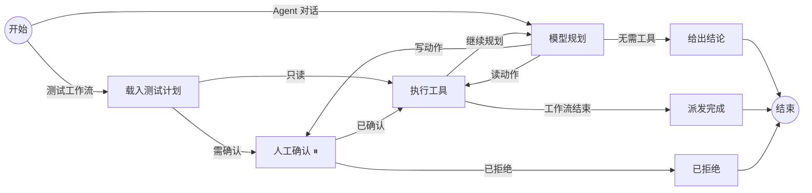

# Agent 中心与编排运行时

状态：MX Rig 0.2 已实现的边界；2026-09-15。

本文说明 Agent 中心的数据模型、编排运行时的语义，以及为什么这一版选择自建而不是直接依赖 LangChain / LangGraph 的 npm 包。

## 借鉴了什么，自建了什么

运行时的形状直接借鉴 LangGraph 的 Node.js 版本：State（带 reducer 的通道）、Node（返回增量的函数）、Edge 与条件边、`interrupt()` 暂停 + checkpoint 恢复。结构化校验借鉴 LangChain 的 zod 用法：工具参数、状态通道、HTTP 请求体全部由 schema 约束，而不是手写 if。

实现是自建的，装在 `packages/graph/`，原因有三条：

- 桌面端把 Runtime 打进 asar，`@langchain/langgraph` + `@langchain/core` 的依赖树太重，且与 Playwright 一起分发会显著放大安装包。
- 审批、策略版本校验、取消语义是这个产品的安全边界，必须能逐行审计；套一层通用框架会把这些规则藏进它的恢复状态机里。
- 编排中心要画的是"真实在跑的那张图"。自建后 `describe()` 与执行同源，图不会和实现漂移。

对应关系：

| LangGraph 概念 | MX Rig 实现 | 位置 |
| --- | --- | --- |
| `Annotation` / reducer | `channel(schema, { reducer, initial })` | `packages/graph/state.mjs` |
| `StateGraph` / `addConditionalEdges` | 同名 API，编译期校验入口、悬空节点、重名 | `packages/graph/graph.mjs` |
| `interrupt()` / `Command({resume})` | `ctx.interrupt(payload)` + `run({ next, resume })` | `packages/graph/graph.mjs` |
| `MemorySaver` checkpointer | `MissionStore` 上的 `row.graph = { next, state }` | `packages/runtime/store.mjs` |
| `createAgent` 的 middleware | 策略重校验、步数预算、Provider 序列降级 | `tools.mjs` / `engine.mjs` / `model.mjs` |

刻意没有实现的：并行分支（每步只允许一个工具调用）、子图、跨任务共享 checkpoint、MCP 客户端。

## 任务编排图



状态通道：`mode`、`turns`、`call`、`write`、`approved`、`answer` 用覆盖合并，`trace` 用追加合并。节点只返回增量；通道 schema 不匹配时在产生它的节点当场失败，而不是几步之后在路由函数里才暴露。

`approve` 是唯一的暂停点。暂停时把 `{ next, state }` 写进任务记录，同时落盘工具名、完整参数、`approvalId` 与策略版本。恢复时 `approve` 节点重跑，`ctx.interrupt()` 返回人的答复而不是再次抛出。进程重启后未完成任务变为 blocked 并清除 checkpoint —— 页面上下文已经不同，重放一次"已经被人看过"的点击是不可接受的。

节点名不能与状态通道重名，这条在编译期就会报错（`answer` 通道对应的节点因此叫 `conclude`）。

## Agent

一个 Agent 是配置，不是代码：

```
key / displayName / summary / category / surface
tools[]      想用的工具（意图）
persona      角色说明，作为第二条 system 消息附加在固定规则之后
starter      示例问题
enabled      是否出现在工作台
builtin      是否内置（可改写、可停用，不可删除）
```

两条硬规则：

1. **persona 由服务端按 key 解析。** 客户端只能传 `agentKey`。能自带人设的客户端，等于 Internal 的允许列表是装饰品。
2. **tools 是意图，不是授权。** 实际可用集合 = Agent 的 tools ∩ Internal 允许列表。中心关掉一个工具，所有 Agent 同时失去它。

内置六个：冒烟领航员（编排执行）、结果分析师 / 失败定级员（结果定级）、覆盖审计员（覆盖与资产）、执行机医生（执行机与环境）、页面巡检员（页面巡检，仅桌面端）。角色说明在 Agent 市场页可以直接读到原文——被告知了什么，操作者应该看得见。

## Provider 与调用序列

Provider：`id / displayName / baseUrl / model / apiKeyEnv / timeoutMs / enabled`。**界面里只填环境变量名，不填密钥值**；值由部署注入，配置文件里不会出现凭据。

调用序列就是 Provider 列表顺序。上一个失败才尝试下一个；用户取消不会继续向下尝试——那是用户的决定，不是 Provider 故障；缺少凭据环境变量的 Provider 被跳过，并在最后一个失败时报告。返回结果里带上实际应答的 Provider，便于对账。

连通性检查调用 `GET {baseUrl}/models`，不消耗补全额度。它证明端点可达、凭据被接受，不证明那个模型名一定可用。上游错误正文一律不回显——网关常把凭据放进 URL 查询参数再原样回吐。

## 出网观测

只读。MX Rig 不设置代理、路由、DNS、PAC 或 NRPT，也不接管其他应用的网络归属；这一页只报告本进程看到的 `HTTP_PROXY / HTTPS_PROXY / ALL_PROXY / NO_PROXY`（大小写两种拼写都读）。

两个容易出错的地方这里说清楚：

- 凭据被隐藏，但"有没有凭据"如实报告。无法按代理 URL 解析的值只报形状，不回显原文——`user:pass@host:7788` 用 `new URL()` 解析会变成 scheme 为 `user:` 的合法 URL，密码留在 path 里。
- Node 22 的 `fetch` **不读**代理环境变量。环境里配了代理不等于服务走代理；页面因此区分"已配置"与"是否生效"，避免把"直连"说成"已代理"。

## 工具集

14 个工具，两组。测试领域十个（`tests_apps`、`tests_list`、`tests_runs`、`tests_result`、`tests_cases`、`tests_case_results`、`tests_artifacts`、`tests_runners` 只读，`tests_run`、`tests_cancel` 需确认），浏览器四个（仅桌面端，默认全部关闭）。

工具 schema 永远来自本地注册表，不接受客户端提交的描述或参数定义。执行前重新拉取策略并比对版本号：策略变了，等待中的确认立即作废。

新增工具的位置是 `packages/runtime/tools.mjs` 的 `DEFINITIONS` 与 `TOOL_NAMES`，不需要改动登录或联网模块。后续的 OCR、分词、操作系统自动化按同样方式接入：声明 effect，写动作自动进入确认流程。
