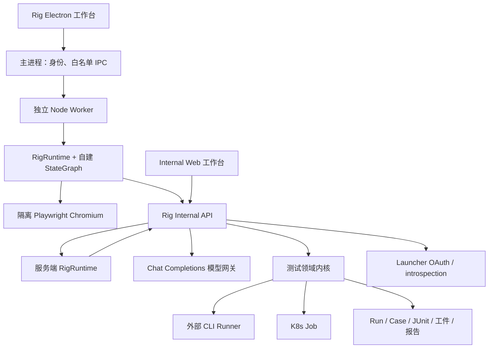
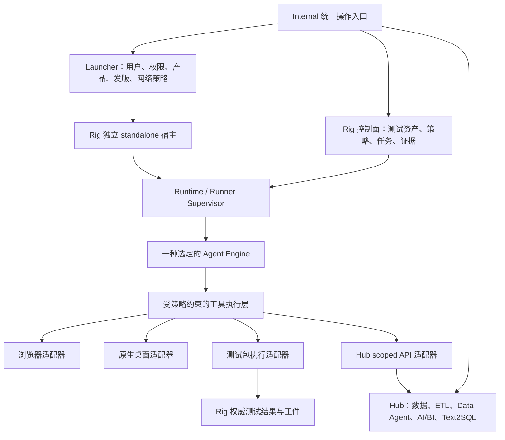

# MX Rig 实现评估、Codex Harness 对比与演进建议

日期：2026-09-20。代码基线：`aa4b7faf`。

状态：分析与建议，**不是已交付功能声明，也不授权生产部署**。本次只增加分析文档，没有修改 MX-H2I、Luopan、Launcher SDK、Hub、Night-All 或 Rig 的运行代码。

后续实现更新（2026-09-21）：本文保留初次走读时的事实与缺陷记录。已完成的 MCP 工具入口、有界等待及可靠性修复，以及尚未完成的 standalone/电脑操作能力，见 [工具接口与可靠性改进](11-tool-interface-and-reliability.md)。

## 1. 结论

MX Rig 已经具备一套有实际测试支撑的测试控制面、桌面工作台和受限 Agent Runtime。它最有价值的部分是测试资产、执行机调度、结果语义、证据归档和权限边界。

但它与本次提出的目标仍有两项基础差距：

1. **当前没有基于 standalone launcher 包实现产品宿主。** 独立 Electron 应用已经存在，但没有安装或调用 `@qpjoy/mx-launcher-standalone` / `@qpjoy/electron-launcher`。身份接入来自迁入测试内核中的 HTTP 适配器。
2. **当前没有通用电脑操作能力。** Agent 只有四种隔离浏览器工具；测试内核可以启动预先编写的 Electron 测试包，但这不等于 Agent 可以观察和操作原生 Windows/macOS 应用。

因此，当前更准确的定位是：**测试管理与执行平台 + Agent 测试助手的 Preview**。目标则可以明确为：**基于 Launcher standalone 的自动化测试客户端与执行平台，支持确定性测试、浏览器探索及受控原生桌面操作**。

建议保留测试领域内核，优先补齐执行与验证闭环。不要仅增加 Agent 角色、编排节点或页面数量；这些变化不会自动带来电脑操作能力。

本文的 Codex 对比对象是可公开核实的 agent harness、SDK/App Server 和工具执行机制。没有拿到某个指定的 OpenAI 内部 test harness 仓库，也没有做同模型、同任务的性能对照实验，因此不提供臆测的成功率或成本排名。

## 2. 查看与验证范围

本次查看了 Rig 的桌面主进程/preload、浏览器工具、任务引擎、图运行时、存储、HTTP API、模型网关、配置、出网、身份客户端、测试内核、Runner、调度、证据处理、测试包、部署与验证文档。对 UI 的判断来自代码，没有在本次重新进行界面视觉验收。

同时核对了 Launcher 的 packages、Luopan standalone 接入代码，以及文档 09/14/20/26/30 等产品边界；读取了 Night-All 的历史/目标架构与 Hub 的相关设计和 ADR。它们用于判定边界，不代表本次全面审计了 Hub 或 Night-All 的运行代码。

本次实际执行：

| 验证 | 结果 | 能证明什么 |
| --- | --- | --- |
| `npm run check` | 116 个 JavaScript 模块通过 | 语法与现有网络耦合字符串检查通过 |
| `npm test` | 416 passed，0 failed/skipped | Runtime/API/迁入测试内核的现有回归通过 |
| test-pack 两个脚本测试文件 | 3 passed | Catalog digest 与非空 artifact 根目录保护通过 |
| 流式响应最小样例 | 复现缺失结束标记仍被接受 | §5.3 |
| 结论引用最小样例 | 复现前一结论为后一结论作证 | §5.4 |
| 指标窗口最小样例 | 复现窗口外失败进入当前风险 | §5.5 |

第一次回归受执行沙箱禁止监听 `127.0.0.1` 影响；获得工具批准后在允许本地监听的环境重跑，416 项全部通过。第一次的 EPERM 不归类为产品缺陷。

未执行：真实模型调用、真实账号登录、MX-H2I/Luopan 启停、系统网络操作、生产 API、数据库迁移、Docker/K8s 实跑、签名安装包验收。本地单元回归通过不等于上述链路已通过。

## 3. 当前实际架构

### 3.1 桌面产品与安全隔离

`apps/desktop/main.mjs` 使用自己的 `dev.qpjoy.mx-rig` 标识和 userData，按服务 origin 与用户 ID 分隔任务目录。renderer 开启 context isolation/sandbox、关闭 Node integration，IPC 使用动作白名单并核对发送 frame。登录 bearer 保留在主进程/worker，退出关闭自己的 Runtime。

这些隔离设计值得保留。但是 **Electron renderer sandbox 不等于 Node worker 或测试 Runner 的操作系统沙箱**。worker 是普通子进程；目前因为工具集合封闭，其暴露面有限。以后加入任意脚本、文件、进程或桌面控制时，必须另建执行权限边界。

证据：`apps/desktop/main.mjs:81` 的登录/worker 创建，`:142` 的可信 IPC 校验，文件后部的 BrowserWindow 配置。

### 3.2 Launcher 的实际复用程度

Rig 根 `package.json` 没有 Launcher SDK 依赖，桌面主进程也没有 SDK 初始化。`packages/test-platform/server/identity/launcher-client.mjs:302` 调用 Launcher OAuth password grant，随后进行 opaque token introspection；Rig 本地数据库维护 viewer/operator/admin。

作为对照，Luopan 在 `mx-launcher/demos/luopan/src-electron/electron-main.ts:918` 明确调用 `createElectronLauncher({ mode: 'standalone', ... })`。

这里要分清三个命题：

- 独立安装的 Electron 应用：Rig 已有。
- 消费 Launcher 用户中心：Rig 已有 HTTP 适配。
- Launcher standalone 产品宿主：Rig 尚未接入。

当前 `launcher-standalone/src/index.ts` 的实装 API 主要是产品、enrollment、lease、snapshot 与 network session；packages README 中更完整的 broker/session 愿景不能全部视为可用实现。后续接入必须按实际导出逐项核验，不能只给 Rig 增加一个依赖就宣称完成。

“所有配置在 Internal”可以保留为统一操作入口与策略权威，而不必把 Rig Runtime 放进 Launcher server。当前模型、Agent、工具、origin 和出网策略保存在 Rig Internal 的 `settings.json`；组织级整合入口、统一配置审计与分发仍需进一步设计。

### 3.3 Runtime 与 Agent

有三条执行路径：

| 模式 | 已实现行为 | 边界 |
| --- | --- | --- |
| workflow | 把已有 Task 派发为测试 Run | 派发完成即 Mission completed，不等待测试通过 |
| agent | 模型规划 → 工具 → 再规划 | 一步一个工具；无测试代码生成工具 |
| orchestration | 配置编译为固定节点的流程 | 分叉依次执行；子编排编译期内联 |

六个内置 Agent 是 persona/工具配置，不是六个相互协作的自主进程。`analyze` 节点只做一次无工具的模型调用。

审批记录绑定工具、参数、approval ID 和 policy revision，批准前与执行前再次核验。新策略使旧批准失效。设计清晰，但页面本身的变化没有绑定到批准记录；相同按钮名称在等待期间可能代表不同对象，需要观察版本与执行前置条件。

模型支持至多八个 OpenAI-compatible Provider 顺序降级、SSE 转 NDJSON。没有 Responses 适配、上下文压缩、token/费用账本、跨任务记忆或 MCP。工作台以轮询读取流式草稿，频繁写入整个任务 JSON。

证据：`packages/runtime/engine.mjs:219`、`:455`、`:588`，`apps/server/model.mjs:122`、`:195`。

### 3.4 浏览器能力

已实现 `browser_open / browser_snapshot / browser_click / browser_fill`。临时 context、origin allowlist、阻止 service worker/WebSocket、限制 popup/download 和敏感表单是明确的保护措施。

当前观察结果只有 `url/title/body.innerText/screenshot 相对路径`。截图保存在本机供人查看，**没有以图像内容传给模型**。`innerText` 也不能可靠提供输入框 label、ARIA role、可访问名称、元素状态、frame、遮挡或坐标。

因此，模型需要给出精确 role/name/label，却没有配套的结构化元素观察。它可以操作部分简单页面，但不适合直接承诺任意网页。还缺少可靠的 select/check/scroll/key/wait、frame/tab、上传/下载及断言能力。

证据：`packages/runtime/browser.mjs:98`、`:103`、`:118`；`packages/runtime/tools.mjs:106`。

### 3.5 测试平台内核

这是当前相对扎实的部分：应用、Suite、Task、Case Catalog、Run、Runner placement/认领、JUnit/summary、artifact、报告、审计、secrets、webhook 和通知都已有实现与回归。K8s Job 有资源预算、运行期限和不自动挂载 ServiceAccount token 等保护。

`blocked` 与产品 `failed` 分离；没有样本时比率为 null；派发成功与测试通过分离。这些领域语义适合长期保留。

需要区分通知能力：**测试内核已有通知模块；新 Mission/定时编排层尚无完整重试与告警**。不能笼统说整个 Rig 没有通知。

Compass Electron test-pack 用 Playwright Electron 控制被测应用的 renderer，并有 bootstrap/formal auth 双轨、临时 profile、预检及证据约束。OS 安装器、UAC、Keychain、系统权限弹窗和真实 VPN 行为仍不属于自动覆盖。

当前桌面 UI 没有托管本地测试 Runner；用户还需独立注册/启动 CLI。Agent 的浏览器 worker 与测试 Runner 是两条不同的执行链。

### 3.6 持久化、界面与运维

Mission/策略/教学进度使用单实例文件状态，测试领域可选 PostgreSQL。重启后未完成 Mission 变为 blocked，不恢复旧动作；每个 Runtime 一次一项任务，服务端最多 40 个已登记用户 Runtime，每用户最多 500 个 Mission。

本地和 Internal Mission 历史不互通，桌面截图也未纳入统一证据仓库。这会限制跨设备排查、团队审计与长任务恢复。

共用 Web/Electron UI 可以减少两套界面漂移；但 `views.js` 约 3500 行、测试内核 `app.mjs` 约 3000 行，后续适合随功能按域拆分。现在不建议为改框架而整体重写成 Quasar/React。

README 产品标为 0.7 Preview，根 package version 仍是 0.1.0。正式接入 Release Center 前，应统一发行版本、协议版本、能力版本和证据中的版本标识。

## 4. 与 Codex harness 的优劣

Codex harness 的公开定位是管理模型上下文、工具、审批、流式事件与多轮任务状态的执行系统；测试只是它能够完成的一类工作。它与 Rig 测试平台并不处于完全相同的层级。[官方 harness 说明](https://developers.openai.com/blog/codex-as-a-platform)

| 维度 | MX Rig 当前实现 | Codex 公开机制 / 对比判断 |
| --- | --- | --- |
| 测试资产治理 | 原生 App/Suite/Case/Run/Runner/报告 | Codex 通用运行时需要接入领域系统；Rig 在 MX 场景的开箱适配上占优 |
| 测试结果语义 | 明确 passed/failed/flaky/blocked、真实 Run 证据 | Codex 回答或任务完成不能替代测试框架结果；建议仍以 Rig 结果为准 |
| 自主解决未知问题 | 只用已有工具、计划与编排 | Codex 可通过代码/命令等能力调查、编写测试并迭代；覆盖面更广 |
| 长任务与上下文 | 消息/字符/轮次上限，达到预算就受阻 | Codex 提供会话延续与恢复，harness 处理上下文；Rig 当前差距明显 |
| 浏览器/电脑操作 | 四个简单浏览器工具，无原生桌面适配 | Codex 产品/环境的可用工具和底层 harness 应分开看；嵌入 runtime 不自动带来桌面控制 |
| 授权 | 明确工具白名单与逐写动作审批 | Codex 沙箱、审批与规则可独立配置，适合更宽执行面；Rig 当前更容易逐动作审计但人工打断多 |
| 隔离 | renderer/浏览器 context 隔离，Node/本地 Runner 无同等 OS 沙箱 | Codex 有操作系统级沙箱；其权限仍取决于具体工具与宿主配置 |
| 模型替换 | OpenAI-compatible Provider 顺序降级 | Rig 现有接口更贴合多网关部署；不代表任意模型都有相同工具能力 |
| 结构化结论 | 可选 finding 工具，引用检查较弱 | Codex 非交互模式支持最终 JSON Schema；schema 合法依然不等于内容真实 |
| 可观测性 | 测试事件/工件扎实，Agent usage/trace 不完整 | Codex 有流式事件；业务证据、留存与报表仍需宿主产品负责 |
| 扩展成本 | 新工具/协议/上下文/恢复语义主要自行维护 | 复用 Codex 可减少通用 Agent 引擎开发，但引入版本、运行时与供应商适配成本 |
| 可预测性 | 固定测试包与声明式工作流容易复现 | 自由探索更灵活，但模型选择和路径会变；正式回归仍应固化测试包 |

Codex 的会话/事件/审批集成见 [App Server](https://learn.chatgpt.com/docs/app-server)；批处理和 CI 的官方接入建议见 [Codex SDK](https://learn.chatgpt.com/docs/codex-sdk)。当前文档对 App Server 命令/WebSocket 部分标注 experimental/unsupported，不能未经验证把远程接口作为生产关键依赖。

沙箱差异依据 [Sandbox](https://learn.chatgpt.com/docs/sandboxing) 与 [审批机制](https://learn.chatgpt.com/docs/agent-approvals-security)。最终结构化响应依据 [Non-interactive mode](https://learn.chatgpt.com/docs/non-interactive-mode)。这些能力不意味着自动化成功率已被本次实测证明。

OpenAI 的 [Computer use 文档](https://developers.openai.com/api/docs/guides/tools-computer-use) 描述了由宿主执行浏览器/桌面动作并返回观察的循环。对 Rig 的直接启示是补齐持续会话、结构化观察/图像、执行约束和结果检查；接入模型接口本身不能代替这一层。

## 5. 应先解决的具体问题

### 5.1 P1：取消测试 Run 没有闭合到停止执行进程

`packages/test-platform/server/app.mjs:1946` 的 cancel 路由只把 Run 改为 cancelled。CLI Runner 的 `:794` 心跳吞掉失败，`:535` 的 `runCommand()` 没有取消信号/运行期限处理。运行中的测试因此可能在平台显示取消后继续操作被测应用。

这是对取消调用链的静态确认，本次没有启动真实被测应用复现。它与“取消 Agent 不撤销已派发 Run”的已知产品语义不同：即使再调用测试 Run cancel，也没有看到本地进程终止闭环。K8s Job 有 deadline，但 cancel 路由也未提交 Job 终止请求。

建议：增加 cancel-requested → executor-acknowledged → stopped 的状态；给 worker 传 AbortSignal/deadline，管理自己创建的进程组或 Windows Job Object。只终止本 Run 拥有的进程，禁止按应用名全机查杀。无法确认停机时显示 stop-unconfirmed，并保留清理证据。

### 5.2 P1：干净构建的只读容器存在启动冲突

`deploy/Dockerfile:14` 复制 Web 源码，`:18` 依赖服务启动时同步设计资源；`:26` 切换普通 node 用户。`deploy/compose.yaml` 的 server 使用 `read_only: true`，仅 `/data` 与 `/tmp` 可写。

与此同时，`apps/server/index.mjs:92` 启动前调用 `syncDesignAssets()`，后者在 `scripts/design-assets.mjs:28` 创建 `apps/web/vendor` 并写 CSS。这个目录是 gitignore 生成物，干净 checkout 不自带它。缺失或内容不同时，写入会与容器权限/只读根文件系统冲突。

这是部署文件与启动代码的静态矛盾，**没有宣称 Docker 已实跑失败**；开发机恰好存在同版本 vendor 可能掩盖它。

建议在镜像构建阶段生成静态资源，运行时只校验/读取；增加干净 checkout + 非 root + read-only rootfs 的启动验收，不靠放宽整个容器权限修复。

### 5.3 P1：不完整 SSE 可能被当作完整回答

`apps/server/model.mjs:244` 读到 EOF 后直接合成 message，忽略 `[DONE]`，也没有校验 finish_reason；无法解析的帧被跳过。

最小样例仅返回一帧 `delta.content = "incomplete answer"` 后正常关闭 body，没有结束标记，`ModelGateway.turn()` 仍返回成功。该文本进入 Runtime 后可使 Mission completed。上游半截 JSON 参数有后续校验，但半截自然语言没有同等保护。

建议为不同 provider 明确完成协议，识别完整结束、length 截断、上游 error 和异常 EOF；不完整回答保留为草稿/诊断，不能生成正式结论。另补跨行 SSE、无尾换行、终止前断流及背压测试。

### 5.4 P2：多次 finding 提交可污染引用核验

`packages/runtime/finding.mjs:67` 把所有 role=tool 内容作为“读到过的证据”。虽然 Runtime 在当前 finding 写入对话之前审计，但 `engine.mjs:533` 仍会把它存为 tool 消息，下一次 finding 会读到前一次的自述。

最小样例：从未读取 `trun_never_read`，第一次核验为 `seen:false`；把该 finding 的工具输出放进 messages 后，再次核验变成 `seen:true`。`haystack.includes()` 也没有严格 ID 边界。

建议独立维护有类型的 Observation/Evidence Registry，记录来源工具、实体类型/ID、工件 digest、观察时间和权限上下文；finding 只能引用登记过的 observation ID。所有 finding 输出始终排除在一手证据之外。读过 ID 与读过结果/日志也要分级，不能混为“已验证”。

### 5.5 P2：用例健康度没有应用所选时间窗口

`apps/server/index.mjs:301` 先取最近 400 个 Run，再从中选择最近 40 个有结论 Run 读取 cases，未先限定所选日期。`insights.mjs:268` 只过滤总量，`:273` 对整个 `runCasesByRun` 计算健康度。

最小样例输入两个 8 月失败 Run，查询 9 月 20 日最近 7 天：执行总量为 0，但风险仍显示“窗口内跑了 2 次，一次都没通过”。此外，400 条上限意味着高频部署的 90 天报表可能只是样本，当前文案不足以说明这一点。

建议数据库按时间窗口聚合总量；健康度从同窗口选样，再明示 sample count、截断和覆盖范围。跨应用用例还应确认复合标识，避免只按 caseId 合并。

## 6. 目标架构与产品职责

该图是目标，不是现状。建议边界如下：

| 系统 | 应拥有 | 不应接管 |
| --- | --- | --- |
| Launcher/Internal | 平台身份、产品注册、能力合同、网络与发版策略 | Rig 的模型循环、业务测试结果 |
| MX-H2I | 现有用户会话与自身网络 owner 生命周期 | Rig 的必需宿主/重启依赖 |
| Luopan | standalone 能力的独立验证对象 | Rig 或 Hub 的共享网络 owner |
| Rig | 测试资产、自动化操作、执行机、测试证据与任务治理 | Hub canonical data、ETL、计费、Data Agent 内部发布真相 |
| Hub | 数据源、清洗、检索、AI/BI、受治理 Data Agent/Text2SQL | 通用桌面控制或 Rig 测试资产管理 |
| Night-All | 现有来源与兼容调用合同 | Rig 绕过 Hub 授权/配额直接访问付费来源的入口 |

Hub 的历史 build-vs-buy 文档已被 `docs/adr/0012-hub-native-agent-studio.md` 取代；不能继续按旧文档推荐引入 Promptfoo/Langfuse/LangSmith 管理面。Rig 可以借鉴其数据版本、trace 和 eval 概念，自身 Agent 评测也不应冒充 Hub 业务 Agent 的内部 Eval。

### 6.1 standalone 接入应采用薄适配层

建议在 Rig 内增加产品自有的 Launcher 适配模块，消费固定版本的发布包，负责启动发现、产品/安装身份、已提供的 session/权限合同及 updater。先做实际导出能力清单，再决定是否需要 SDK 的兼容增量。

本次目标要求 Rig 成为 standalone 产品，但这不能等同于启动时自动申请 WG 或夺取系统代理。网络能力应单独配置和验收；需要独立私网时，由 Internal 为 Rig 分配独立 ProductNetwork/VIP/lease，并仅操作自己的 profile/owner/路由。

现有 `scripts/check.mjs` 把 data-plane 调用直接视为耦合，所以未来合法接入也需要重写这条守卫：**禁止 Runtime/Agent 调网络 owner；只有专门的宿主适配层能在明确合同下调用**。配合依赖检查与行为测试，不能简单删除检查。

### 6.2 工具执行层应比 Agent 引擎更稳定

先稳定以下语义，再更换模型或引擎：

- `Observation`：surface、session、page/window、revision、元素、截图/文本 evidence refs。
- `Action`：工具、目标引用、参数、effect、预期状态与批准范围。
- `ExecutionReceipt`：action ID、attempt、开始/结束、真实结果、副作用状态、证据。
- `Assertion`：明确的可验证条件，独立于 Agent 的口头结论。

每个 Mission 固定一个引擎。可先保留 Native Rig Engine，再增加可选 Codex adapter；两者共享工具合同、权限与证据，但不互相嵌套拥有同一任务的恢复状态。外层 Rig 管测试生命周期，内层引擎管一次 Agent 会话，并保存 ID 映射。

复用 Codex 的建议是可替换试点，不是整体重写或生产依赖承诺。适配器需要检查版本、认证、模型路由、沙箱和工具能力，尤其不能假定 Codex 桌面插件能力会随 SDK 一同提供。

## 7. 按收益排序的优化路线

| 阶段 | 优先工作 | 可验收结果 |
| --- | --- | --- |
| P0：可靠性基线 | §5 的取消、容器、流式、引用、指标问题；统一发行版本 | 取消可确认停机，干净容器可启动，半截回答不完成，引用与时间窗口正确 |
| P1：产品宿主 | standalone 薄适配、独立产品/安装身份、Internal 配置入口、Runner 托管 | 用户登录后能发现本机能力、注册专用 Runner 并运行一个隔离测试包 |
| P1：浏览器闭环 | ARIA/DOM 元素观察、稳定 ref、图像输入、常用控件、等待与断言 | 本地 fixture 的表单、弹窗、导航、frame 能自动完成并出确定性结果 |
| P2：原生桌面 | 按目标 OS 分别实现可访问性/窗口/输入/截图适配；能力缺失显式受阻 | 一种目标 OS 的选择文件、打开应用、窗口切换等小套件可重复通过 |
| P2：持久执行与证据 | PostgreSQL 中央任务/event ledger、本地 outbox、分页与保留策略、只读步骤恢复 | 断网重连不重复写入，跨设备可追踪，旧批准不在新页面重放 |
| P2：受控自动化 | 在专用测试环境引入任务范围预授权、预算、期限和取消；tests_wait | 无需逐次批准同一已批准测试流程的低风险步骤，越界仍停止 |
| P3：Agent 评测与引擎 | 固定数据集/工具版本、真实模型评测、token/成本、Native/Codex A/B | 相同任务与约束下比较成功率、人工介入、成本与违规率 |
| P3：按需求扩展 | Hub scoped API、MCP、独立资源上的并行任务、通知与重试 | 受治理调用可追踪，不增加第二套平台事实 |

这里的 P0/P1/P2/P3 是实施顺序，不是给所有问题套用事故级别。

### 浏览器先补观察，再补动作

返回可访问树/元素表，包含 role、name、label、状态、frame 和稳定 ref；动作使用观察产生的引用，并在执行前校验页面/元素版本。保留失败截图、trace、console/network 摘要和业务断言；明确哪些截图进入模型，哪些只保留给用户。

增加 `tests_wait` 等确定性等待，避免 Agent 用模型轮次反复查询测试是否结束。把“运行 → 等待 → 断言 → 归档 → 分析”做成真正的测试工作流。

UI 功能可先走确定性 Playwright；无法从 DOM 获得信息时才使用视觉观察。桌面自动化也应先使用平台可访问性能力，视觉坐标用于受控补充。相关库的兼容性与分发选型须另做实际平台验证。

### 自动化需要范围授权，不宜永远逐次点确认

保留未知写动作逐次批准，同时为明确授权的测试包定义范围：目标环境、测试账号、origin/app、可写路径、允许动作、预算和期限。既有测试计划本来就已通过一次批准运行多步脚本，可把这一原则推广到受限浏览器流程。

权限由确定性策略执行。生产发送、删除、付费调用、系统网络修改等动作不能因为 persona 写了“自动完成”就获得授权。用户授权范围内也不应被无意义重复确认打断。

### 可靠恢复不等于重放外部写动作

持久记录 action ID、参数 digest、attempt、幂等键与 receipt。查询/观察可重新执行；已确认的远端 Run 可重新附着；结果未知的提交先做对账，无法证明时进入 effect-unknown。浏览器页面和身份变化后，旧批准必须作废。

设置 usage/token/费用与 wall-clock 双预算；Provider 降级记录真实调用序列与成本。对只读、可证明幂等的失败做退避重试，对测试派发/付费请求禁止无幂等键重试。

### 评测应检验行为结果

建议首批构造约 30–50 个本地/隔离场景，覆盖网页操作、专用 Electron/原生桌面、异步任务等待、策略变化、取消、断流、错误来源、提示注入与证据引用。

固定 app build、fixture/data snapshot、工具/策略/Agent 版本、模型与 provider revision；一项任务重复多次。记录 task success、assertion success、人工介入次数、工具失败、超时、token/费用、证据完整度和越权次数。采用确定性 assertion 为主、人工标注为辅；模型自评只作为补充。

Native/Codex 比较应尽量使用相同模型与相同工具权限；无法一致时明确记录混杂因素。本次 416 项程序回归不是这样的 Agent 效果评测。

## 8. MX-H2I 登录与联网不回归的具体要求

1. **依赖方向单向。** Rig 可消费 Launcher 公共合同；MX-H2I 登录、ready、断开、退出不能等待 Rig、Hub、模型或测试 Runner。
2. **身份分开。** Rig 使用自己的 session/设备/安装身份，不读取 MX-H2I profile、renderer token、WG 私钥或 Luopan 身份。登录流改造先限定 Rig。
3. **网络归属分开。** Rig 默认仅管理自身请求出网；未来独立网络由专门宿主适配与 Internal 产品策略启用。不能用 `10.88.88.88` 等历史地址作为新产品共享 owner 的捷径。
4. **发版可回退。** Rig 固定 SDK 版本；如需 SDK 增量，按兼容方式发布，不能因 workspace 联动自动升级 MX-H2I 的已发布构建。
5. **执行环境隔离。** 带联网副作用的被测客户端先放专用机器/隔离构建。原生自动化权限不授予正在承载真实用户 MX-H2I 会话的随意脚本。
6. **回归矩阵固定。** MX-H2I 单独运行、先启 Rig/后启 Rig、Rig 崩溃/升级/退出、模型失败、Runner 停止、代理切换均覆盖；另验密码/飞书登录、访客员工切换、已有会话、断开/退出与重连。
7. **比较可观测事实。** 校验 H2I API 错误率与延迟、身份/会话连续性、WG 接口/路由、DNS、PAC/NRPT 和 owner registry；Rig 失败不能改变其结果。

这些是后续实施验收要求，本次没有操作现网完成该矩阵。静态字符串检查与本地回归只证明一部分，不足以保证任何未来 SDK/原生自动化改动都不会影响 H2I。

## 9. 建议决策

把 MX Rig 建设为 MX 产品体系内的自动化执行与测试证据平台。Launcher 提供产品基础设施，Rig 持有测试事实，Hub 持有数据产品事实；统一入口与能力合同，分别部署和控制故障影响。

先完成可靠执行、standalone 宿主、浏览器与原生桌面观察/动作/断言。随后以可替换适配器评测 Codex 是否值得成为通用 Agent 引擎。这个顺序能保留已经投入的测试平台能力，并使新增能力直接对应“客户端能自动操作电脑和网页”的目标。
