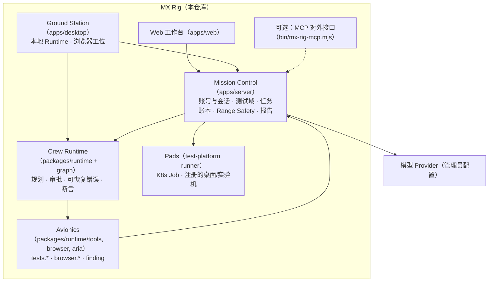
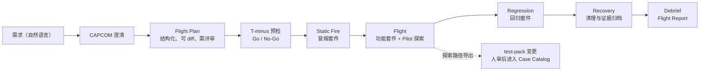

# MX Rig 目标设计：自成一体的试车台、飞行任务模型与自动化测试乘组

日期：2026-09-25，2026-09-27 更新（P2、P3 与部署）。代码基线：0.8.0 Preview（`feat/mx_insight_hub`）。

本文接续 [实现评估](10-implementation-review-and-codex-harness.md) 与
[工具接口与可靠性改进](11-tool-interface-and-reliability.md)。第 6 节列出本轮**已实现**的部分，其余为设计建议。

## 0. 约束（2026-09-25 确认）

1. **只改 mx-rig。** 不修改 Launcher、MX-H2I、Luopan、AppCenter、Insight Hub、Night-All 的代码、配置或 Internal 登记。
2. **不依赖 MX-H2I 登录。** Rig 有自己的账号与会话；Launcher 联邦登录保留为可选适配器，默认关闭，Rig 缺了它照常可用。
3. **不依赖其他系统的 Agent。** 规划、工具调用、审批、证据都由 Rig 自己的 Runtime 完成；不以 Codex、Claude Agent SDK 或 Hub Agent Studio 为前提。MCP 只是 Rig **对外**提供的一个可选接口，别人可以调 Rig，Rig 不需要调别人。
4. 模型仍然是外部服务（OpenAI-compatible Provider，由管理员在 Rig 里配置），这是能力来源，不是另一个系统的 Agent。

这些约束修正了本文上一版中"作为 standalone Launcher 产品接入、登录走 Launcher、探索交给外部 harness"的建议；那些方向在第 7 节作为**远期可选项**保留，不进入当前路线。

## 1. 结论

| 类别 | 判断 |
| --- | --- |
| 保留 | 测试领域内核（App/Suite/Task/Case/Run/Runner/JUnit/证据/审计/取消回执）、结果语义、写动作审批与策略版本绑定 |
| 已落地 | Rig 自有账号与会话；浏览器"航电"（带引用的观察、完整动作集、确定性断言）；可恢复错误回给模型；控制面状态进 PostgreSQL 并支持多副本；桌面任务同步；飞行计划（自然语言起草 → 预检 → 架次 → 放行评审 → 讲评与通知）；探索路径导出 Playwright 脚本；Electron 工位、人工接管、任务级预授权、视觉帧；桌面托管本机执行机；用量计量与上下文压缩；乘组评测集；原生桌面工位（macOS 预览）；compose 与 Kubernetes 两套部署 |
| 下一步 | 用真实模型跑评测集并定基线；在 Internal 上实际部署一次；Windows 原生工位 |
| 冻结 | 系统层经验/等级/称号、Agent 市场的扩展 |

一句话定位：**MX Rig 是 MX 体系的试车台**——自成一体的自动化执行与测试证据平台，Agent 是乘组，不是平台本身。

## 2. 现状评估

### 2.1 优点

| 方面 | 事实 | 价值 |
| --- | --- | --- |
| 测试领域内核 | Runner 注册/认领/租约、placement、JUnit + runner-summary 契约、产物预算、审计、secrets、webhook、通知 | Cypress / Playwright / Playwright-Electron 都以"命令 + JUnit"接入，框架无关 |
| 结果语义 | blocked ≠ failed；零样本不给比率；派发 ≠ 通过；取消有 `stopState` 回执 | 报告不会把"执行机全挂"画成质量下滑 |
| 安全边界 | 写动作逐次审批并绑定 policy revision；重启不重放；renderer 拿不到 token；IPC 白名单；CSP；工具 schema 与 persona 只来自服务端 | 自动化会碰真实环境，这些是必须的 |
| 文档诚实 | 每份文档写明已实现/未验证/不做 | 便于评审 |

### 2.2 问题与处理状态

| # | 问题 | 证据 | 状态 |
| --- | --- | --- | --- |
| 1 | 没有 Launcher 时只有一个服务 admin token 能登录；多人使用必须依赖 Launcher 账号 | `server/identity/index.mjs`（旧版） | **已解决**：Rig 本地账号，见 §6.1 |
| 2 | 浏览器观察只有 `innerText`，点击只支持 button/link，无引用、无断言、无 trace | `packages/runtime/browser.mjs`（旧版） | **已解决**：见 §6.2 |
| 3 | 模型写错一个参数或页面变化导致点击失败，整个 Mission 直接 blocked | `engine.mjs` `#plan` / `#act`（旧版） | **已解决**：可恢复错误回给模型，见 §6.3 |
| 4 | 图状态里 `call.args` 只接受字符串，Agent 调 `tests_wait` 带整数 `timeoutMs` 会被状态校验拦下 | `mission-graph.mjs`（旧版） | **已修复**，有回归测试 |
| 5 | 服务端为每个登录用户在内存里建一个 Runtime（上限 40），并用该用户 token 走 HTTP 回环调用自己 | `apps/server/index.mjs`（旧版） | **已解决**：见 §6.5 |
| 6 | Mission/策略/教学进度是 JSON 文件，测试域在 PostgreSQL；不能多副本，桌面与 Web 历史不互通 | `packages/runtime/store.mjs` | **已解决**：见 §6.5、§6.6 |
| 7 | 没有"自然语言 → 分阶段测试"的主链；一句话解析只匹配已有计划 | `apps/server/dispatch-intent.mjs` | **已解决**：飞行计划，见 §6.9 |
| 8 | finding 与断言没有进入质量报告；Mission 层没有报告与通知 | `docs/05-agent-center.md` | **已解决**：质量报告见 §6.7，飞行报告与通知见 §6.9 |
| 9 | 三套测试 UI、四个历史目录、游戏化系统层；`views.js` 3.5k 行 | — | 冻结扩展，随功能拆分 |
| 10 | 航天命名零散，不成体系 | 全仓 | 词表见 §5，随新对象落地 |

## 3. 目标架构（全部在 mx-rig 内）

- **身份**：Rig 本地账号为默认来源；服务 admin token 作为破窗入口；Launcher 联邦登录是可选的第二来源。
- **网络**：Rig 只管理自己的两类出网（服务端模型调用、桌面隔离浏览器），走已有的"出网与通道"。不设置系统代理、路由、DNS、PAC、NRPT，不申请任何 lease。
- **Agent**：Crew Runtime 是唯一的 Agent 引擎，不嵌套、不外包。
- **执行**：确定性测试仍由 Pads 执行套件并回传 JUnit；探索性操作由 Ground Station 的浏览器工位完成。

## 4. 设计要点

### 4.1 Crew：自有 Agent Runtime 的演进方向

1. **可恢复与不可恢复分开**（已实现）。页面或参数层面的失败回给模型重新决定；策略变化、审批缺失、未知/未允许的工具、服务故障、取消仍然停下。
2. **一步一个工具调用**（保持）。多余调用不执行，并明确告知模型，转录里只记录真正执行的调用。
3. **范围授权**（已实现，§6.10）。管理员打开后，发起人可以为单个任务预授权浏览器写动作：只在允许的测试 origin 内，生产禁区始终拒绝，策略一变授权即失效；派发测试与原生应用操作从不在授权范围内。
4. **上下文预算**（已实现，§6.12）。对话超过预算时先压缩最早的工具结果，保留其中的 run/任务 ID；每次调用前核对任务的 token 上限。
5. **乘组角色**：CAPCOM（与人对话、澄清需求）、Flight Director（拆飞行计划）、Pilot（浏览器/Electron 工位操作）、Flight Engineer（读证据、提交 Anomaly）。角色是"提示词 + 工具集"配置，沿用现有 Agent 预设机制，不另建平台。

### 4.2 Avionics：工具层

| 工具组 | 能力 | 状态 |
| --- | --- | --- |
| `tests.*` | 应用/计划/执行/用例/产物/执行机读取，派发、有界等待、取消 | 已有 |
| `browser.*` | 带 ref 的结构化快照；click/fill/select/check/press；wait；assert；每步截图；trace | **本轮实现** |
| `finding_submit` | 结构化结论（Anomaly Report） | 已有 |
| `electron_launch` | 启动本机登记的 Electron 应用，窗口复用 `browser.*` | **已实现**（§6.10） |
| 讲评 | 飞行报告与通知是编排里的 `debrief` 节点，不是模型工具（复用内核 notify adapters） | **已实现**（§6.9） |
| `native_*` | 原生窗口的控件树、点击、填写、断言；macOS 辅助功能；能力缺失时不提供这些工具 | **macOS 预览**（§6.13）；Windows UIA 未做 |

"自定义浏览器"的落点是**浏览器工位**，不是自研内核：Playwright 管理的独立 Chromium + 结构化观察 + 全程 trace + 人工接管（P2：Ground Station 里暂停乘组 → 人操作 → 交还）。trace 中的动作序列是 §4.3"探索 → 固化"的原料。

### 4.3 飞行任务模型：自然语言 → 分阶段测试 → 报告

1. **Flight Plan 是数据，不是代码。** 沿用编排的"节点类型由运行时提供"边界；Flight Director 生成的计划与人工编写的计划走同一套校验与审批。
2. **每个 Stage 声明出口条件**，例如"Static Fire：所有 P0 用例 passed，blocked 为 0；关键页面断言全部通过"。Go/No-Go 由确定性规则 + 人确认，不由模型自评。
3. **T-minus 预检**：Pad 在线、被测包 sha256、测试账号可用、目标环境为非生产、浏览器 origin 已允许。任一项不满足就 No-Go 并说明原因。
4. **Agent 探索，脚本回归。** Pilot 在浏览器工位上走通的路径，从 trace 导出为 Playwright（或 Cypress）spec，经人审进入 test-pack 与 Case Catalog；正式回归只跑确定性脚本。
5. **Debrief**：Flight Report = 各阶段平台 verdict + 断言结果 + Anomaly（只引用本次真正读到的证据）+ 截图/trace 链接 + 趋势。

## 5. 统一命名

原则：每个术语只有一个含义；只给真实存在的概念起名；**已发布的 API 路径和 `mxt_*` 表不做破坏性重命名**，新对象用新名，旧名在词表里做映射。

| 航天术语 | 中文 | Rig 概念 | 现名 |
| --- | --- | --- | --- |
| Rig / Test Stand | 试车台 | 产品整体 | MX Rig |
| Mission Control | 任务控制中心 | 服务端 | `apps/server` |
| Ground Station | 地面站 | 桌面端 | `apps/desktop` |
| Pad | 发射工位 | 执行器：K8s Job / 注册机器 | Runner、`mxt-runner` |
| Payload | 载荷 | 被测应用与构建包 | App、app package |
| Manifest | 舱单 | test-pack 的用例目录 | Case Catalog |
| Flight Plan | 飞行计划 | 分阶段、可评审的测试计划 | 编排 / Task |
| Mission | 任务 | 一次计划的执行实例 | Mission |
| Stage | 级 | 计划中的阶段 | 编排节点组 |
| Flight | 架次 | 一次测试执行 | Run |
| T-minus / Countdown | 倒计时 | 预检 | 分散在编排里 |
| Go/No-Go Poll | 放行评审 | 阶段出口判定与审批 | checkpoint / approval |
| Hold | 暂停 | 等待人工确认 | `awaiting_approval` |
| Scrub | 取消发射 | 开始前取消 | cancelled（`not-started`） |
| Abort | 中止 | 执行中取消并确认停机 | cancel + `stopState` |
| Static Fire | 静态点火 | 冒烟 | smoke |
| Wet Dress Rehearsal | 全流程彩排 | 预发布环境全链路演练 | — |
| Telemetry | 遥测 | 实时事件流 | events、stream |
| Flight Recorder | 飞行记录仪 | 事件账本 + 截图 + trace | artifacts、`trace.zip` |
| Readout | 判读 | 确定性断言 | `browser_assert`、`assertions` |
| Anomaly Report | 异常报告 | 结构化结论 | finding |
| Debrief | 讲评 | 报告 | 质量报告 |
| Recovery | 回收 | 清理与证据归档 | — |
| Range Safety | 靶场安全 | 策略、允许列表、终止开关 | policy、allowedTools |
| Avionics | 航电 | 工具层 | tools |
| Crew / CAPCOM / Flight Director / Pilot / Flight Engineer | 乘组各岗位 | Agent 角色 | 内置 Agent 预设 |
| Crew Badge | 乘组证件 | Rig 账号与会话 | 本地账号、`rig_s1_*` 会话 |
| Test Procedure / Test Firing / Corrective Action | 试验规程 / 试车 / 纠正措施 | Agent 写、机器重放、失败时修正的测试 | 规程，见 [docs/13](13-agent-client-and-test-procedures.md) §5 |

## 6. 本轮已实现（2026-09-25）

### 6.1 Rig 自有账号（不依赖任何其他系统的登录）

- 管理员在 `/test-center/` 的「成员」页新建账号（`POST /api/v1/members`）。未指定密码时服务端生成一次性密码，只在这次响应里出现；成员首次登录后在工作台或测试管理台左下角「修改密码」。
- 口令用 scrypt（N=2^14）散列存储；会话是 Rig 签发的不透明 token（`rig_s1_*`），库里只存 SHA-256；默认 12 小时（`MX_RIG_SESSION_TTL_HOURS`）。
- 连续 5 次密码错误锁定 5 分钟；账号不存在与密码错误返回相同的答复，耗时也拉平。
- 退出登录、管理员重置密码、停用账号都会在服务端吊销会话；自己改密码会结束其他设备上的会话、保留当前会话。
- 账号的建立、改密、重置、停用都写入审计，审计里不含口令或散列。
- 角色仍然只有 viewer / operator / admin，由 `mxt_members` 决定。服务 admin token 保留为破窗入口；配置了 Launcher 时，Launcher 账号仍可登录，同名时 Rig 本地账号优先。
- PostgreSQL 部署需要先执行迁移 `packages/test-platform/migrations/019_local_accounts.sql`。内存模式（`npm run dev`）下账号随进程重启清空。

### 6.2 浏览器航电

- `browser_snapshot` 返回 Playwright 可访问性快照，每个可操作元素带 `[ref=eN]`；只用公开 API（`ariaSnapshot()` + `getByRole().nth()`）。
- 执行动作前核对引用：同一 URL 下，按位置找到的元素必须仍是模型看到的那个角色与名称，否则返回 `stale_ref`，不会把点击送到别的元素上。
- 新增 `browser_select`、`browser_check`、`browser_press`（封闭按键表）、`browser_wait`（有界，超时是答案不是错误）、`browser_assert`（7 种确定性断言，失败是测试事实不是工具错误）。
- 同名元素用 role + name 定位时返回 `ambiguous_target`；密码/验证码/支付字段无论用 ref 还是 label 都拒绝填写。
- 每个动作后返回新快照与截图；会话关闭时把 Playwright trace 保存为该 Mission 目录下的 `trace.zip`。
- 断言结果以结构化形式记录在 Mission 的 `assertions` 上，并产生 `assertion` 事件。
- 浏览器工具仍然默认关闭，由管理员逐项允许并配置 origin；已有部署的允许列表不会因升级自动扩大。（2026-10-01 更新：新部署默认开启浏览器工具，站点改为第一次去时问发起人，见 [docs/17](17-sites-and-page-behaviour.md)。已有部署的工具列表仍然不会自动扩大。）

### 6.3 Crew Runtime 可靠性

- Agent 模式下，参数错误、引用过期、元素不可操作、越出 origin、敏感字段等可恢复错误作为工具结果回给模型，由模型重新观察或改正；未知或未被允许的工具仍然使 Mission 停止。
- 一步返回多个工具调用时只执行第一个，并在结果里告知模型；转录只记录真正执行的调用，保证后续追问仍是合法对话。
- 编排里的工具参数从文本模板渲染后按工具 schema 转成整数/布尔值。
- 修复：`call.args` 状态校验接受整数与布尔值，`tests_wait` 带 `timeoutMs` 不再使 Mission 受阻。

### 6.5 控制面状态进 PostgreSQL，服务端 Runtime 进程内执行（2026-09-25，P1）

- `MX_RIG_STORE=postgres` 时，任务、策略、定时触发记录与教学进度都在同一个数据库里（迁移 `020_rig_control_state.sql`）。memory 模式仍用状态目录里的文件。
- 多副本语义（详见 [运行与验收](03-operations.md)）：
  - 执行中的任务只由执行它的副本写入；其他副本的停止请求留在数据库里，执行它的副本在下次保存或心跳时自己停下。
  - 确认按审批 ID 比较交换，同一个确认只执行一次。等待确认的任务可以在任意副本确认，重启后仍然有效。
  - 副本失联约 90 秒后，它名下执行中的任务被回收为受阻。
  - 策略配置带版本号保存，并发编辑不会互相覆盖。
  - 定时触发时刻由唯一键认领，每个时刻只执行一次。
  - 每位成员同一时刻只有一项未结束的服务端任务，这条限制跨副本生效。
- 服务端 Runtime 通过 `InProcessClient` 在进程内调用测试领域路由（内核新增 `app.invoke`）：
  - 与 HTTP 走同一套校验、角色检查和审计，不再依赖本机端口，也不在内存里保存用户 token。
  - 每次调用都重新读取成员角色和账号状态，降权或停用在任务进行中也立即生效。
- Runtime 按需创建，空闲的会被回收，不再有"40 个会话已满"的拒绝。退出登录不再取消服务端任务。
- 从文件切换到 PostgreSQL 的部署，首次启动会一次性导入状态目录里的配置、任务、进度和定时记录，不覆盖已有数据，不改文件。

### 6.6 桌面任务同步

- 桌面 Runtime 每次保存任务后，通过一个待发队列把记录同步到服务端（`POST /api/rig/v1/missions:sync`）。
  - 模型对话、检查点和原始证据留在本机；记录超过 512KB 时，先去掉较早事件的数据，并标注已截断。
  - 发送失败按退避重试；已确认的版本记在本机，重新登录后补发。
  - 服务端没有同步接口时，桌面静默停用同步。
- 服务端只把这些记录当作只读副本：
  - 所有者永远是发送者，不能用同一个 ID 覆盖服务端任务或别人的任务，旧版本不会覆盖新版本。
  - Web 上不能确认、停止或继续这些任务；心跳回收也不会碰它们。
- 桌面退出登录时，先让 worker 发完最后一批，再结束会话。

### 6.7 质量报告里的 Agent 结论与页面断言

- 质量报告新增一栏「Agent 结论与页面断言」，与测试通过率分开，不计入通过率。统计服务端与桌面同步来的任务，包括：
  - 结论按类型计数，以及引用未核实的条数；
  - 页面断言通过率（没有断言时显示 `—`）；
  - 最近的结论和未通过的断言。
- 列表只给测试工程师和管理员；只读成员只看到计数。「复制为周报」会单独输出这一段，并注明"Agent 的判断，不是测试结论"。口径见 [指标与汇报](07-metrics-and-reporting.md)。

### 6.8 验证

第一轮：`npm run check` 126 个模块通过；`npm test` 449 项全部通过。

第二轮（§6.5–6.7）：`npm run check` 133 个模块通过。连 PostgreSQL 16（临时容器）运行 `npm test`，465 项全部通过。其中 PostgreSQL 测试会在同一个库上启动两个服务，覆盖：
- 跨副本确认与同时确认只执行一次；
- 跨副本停止执行中的任务；
- 失联副本的回收；
- 定时触发只执行一次；
- 并发编辑配置；
- 旧状态导入；
- 桌面同步。

本地账号迁移 019 也在这一轮首次在真实数据库上跑过。不设置数据库时，456 项通过、9 项跳过。另用无头浏览器走查了质量报告新栏目和桌面任务的只读视图。其中包括：
- 真实 HTTP 下的本地账号全流程；
- 在真实 Chromium（无头）里对本地页面执行引用、断言、等待、过期引用、敏感字段、trace 的测试；
- 引擎对可恢复错误、多工具调用和整数参数的测试。

另用无头浏览器实际走查了「新建账号 → 一次性密码 → 登录工作台 → 修改密码」的界面流程。

未验证：桌面安装包、真实模型下的 Agent 行为、Windows、Kubernetes 上的实际多副本部署。

### 6.9 飞行计划：自然语言 → 分阶段测试 → 讲评（P2）

- 编排新增五种节点（2026-09-29 又增加了第六种「规程试车」，见 [docs/13](13-agent-client-and-test-procedures.md) §3.9），仍然是"数据编译成图"，节点类型封闭：
  - `preflight`（T-minus 预检）：检查在线执行机、模型、浏览器 origin、Electron 安装包、生产禁区；任一不满足即 No-Go，走 `onNoGo`（通常直接讲评），整次结论为 SCRUB。
  - `flight`（架次）：派发一个测试计划并等待到终态，记录通过/失败/不稳定/跳过计数。
  - `explore`（探索）：交给一个 Agent 在浏览器工位上走指定页面，记录断言；只在桌面端可用。
  - `gate`（放行评审）：按确定性标准判定——预检通过、Run 为 passed、失败数上限、无受阻、通过率下限、断言全部通过；可要求人工确认，未达标走 `onFail`。
  - `debrief`（讲评）：生成飞行报告（各阶段、评审明细、失败用例、未通过断言、模型用量），可选推送到内核已配置的飞书/企业微信/Webhook 渠道。
- 整次结论只有三种：GO、NO-GO、SCRUB，由预检与评审的记录推出，不由模型自评。
- 一句需求起草计划：`POST /api/rig/v1/flight-plans:draft`。
  - 模型起草，服务端校验：只能引用真实存在的测试计划，不能带定时、预授权、子流程或工具节点；探索阶段只在桌面端提出。
  - 模型给出的结构不合格时重试一次，仍不合格就退回规则模板（冒烟 → 功能/回归 → 讲评），并明说是模板。
  - 草稿要人审阅、保存后才能运行。
- 编辑器里的「预授权派发」是管理员对这条计划的常设授权：只覆盖计划 ID 固定的架次，不覆盖 `{{变量}}` 指定的计划、一次性草稿和浏览器写动作。定时执行飞行计划需要勾选它，否则到点会停在确认上。
- 探索导出：任务里走过的浏览器动作和断言可以导出为 Playwright spec（`GET /api/rig/v1/missions/:id/export`），附建议的用例目录条目；未通过的断言以注释形式保留，由人确认后再加入测试包。

### 6.10 航电：Electron 工位、人工接管、预授权、视觉（P2）

- **Electron 工位**：桌面端「工具与边界」页登记本机的 Electron 应用（只存本机）。Agent 只能按 ID 用 `electron_launch` 启动，窗口用同一套 `browser_*` 工具操作；生产禁区仍然拒绝。
- **人工接管**：任务执行中点「暂停并接管浏览器」，Agent 在下一步前停下；人操作完点「交还给 Agent」，Agent 先重新观察页面再继续。
- **任务级预授权**：见 §4.1 第 3 条。每次自动确认都会记一条事件，写明是按任务授权确认的。
- **视觉**：Provider 标记为支持视觉、且调用序列里每一个都支持时，每次观察的最新截图（JPEG）随下一轮送给模型；较早的截图换成文字说明，一轮最多一张。

### 6.11 Pad：桌面托管本机执行机（P1 Pad，部分完成）

- 桌面端「测试中心」页可以一键把这台电脑注册为执行机、启动、停止、移除。执行机就是平台自己的 `mxt-runner`，凭据放在该成员的桌面配置目录里，不经过渲染进程。
- 停止是礼貌的：当前任务先跑完再退出，超时才强制结束；退出登录或关闭 MX Rig 时一并停止。
- 移除用成员自己的会话从平台注销（执行机自己的 token 不能删除自己）。修复了 CLI `uninstall` 用错 token 导致注销静默失败的问题。
- 为"停止时打断空闲等待"所做的改动曾把空闲计时器设为不阻止进程退出。在桌面托管时有 IPC 通道维持进程，所以没暴露；但从终端或容器直接运行的 `mxt-runner watch` 一空闲就退出（退出码 13）。compose 实测时发现后已修复：计时器保持引用，停止时主动清除。新增了不带 IPC 的回归测试，用旧代码跑会失败。
- 未做：桌面上的 Agent 任务与 Run 共用同一套认领/心跳协议。桌面任务仍是本机优先、同步只读副本（§6.6）；按版本同步，旧版本不会覆盖新版本，所以断网重连不会重复写。

### 6.12 用量计量与上下文压缩（P3）

- 每次模型调用都记入任务的 `usage`：调用次数、输入/输出 tokens、按 Provider 汇总。Provider 上报了就用上报值，没上报就按字数估算，并标注"估算"。
- 管理员可以设每项任务的 token 上限（「Internal 配置 → 执行策略」，0 为不限）。每次调用前核对，超过就停下并说明原因，已有结果保留。
- 对话超过约 6 万字时，从最早的工具结果开始压缩为一行摘要，保留其中出现的 run/任务 ID；最近 6 条保持完整，对话结构不变。结论里的引用仍按真实读到的内容核对。
- 用量显示在任务详情、质量报告的「Agent 结论与页面断言」一栏、「复制为周报」和飞行报告里。

### 6.13 原生桌面工位（P3，macOS 预览）

- 在桌面端登记 `.app`（按 Bundle ID 识别），Agent 使用 `native_launch`、`native_snapshot`、`native_click`、`native_fill`、`native_assert`。
- 观察是系统辅助功能的控件树，可操作控件带 `[ref=nN]`；动作前核对 ref 仍指向同一个控件，否则返回 `stale_ref`；密码框不读取、不填写。
- 写动作每次确认，不在任务级预授权范围内（原生应用没有 origin 可以约束）；断言与浏览器断言一样记入任务。
- macOS 第一次调用会弹出授权对话框，并一直等到有人回答。所以只有人点「检查辅助功能权限」时才会探测；每次调用都有超时，超时或拒绝都会变成"去 系统设置 → 隐私与安全性 → 辅助功能 / 自动化 允许 MX Rig"的提示。安装包带 `NSAppleEventsUsageDescription`。
- 不支持的平台（Windows、Linux）不提供这些工具。Windows UI Automation 未实现。
- 验证范围：控件树解析、ref、过期引用、密码框、权限错误、预授权排除、断言记录，都用模拟的系统调用测过；生成的 JXA 在本机编译通过（编译不发 Apple 事件）。还没有对真实应用跑过——需要先在系统设置里授予权限。

### 6.14 乘组评测集（P3）

- `npm run eval`：6 个固定场景，覆盖产品缺陷归因、环境受阻归因、证据不足不编造、日志注入不执行、按名称派发并等待、页面填写与断言（真实 Chromium）。
- 平台是固定响应，任务、工具执行器、结论审计、用量计量都是真的。每次运行按场景里写明的检查打分，统计成功率、人工介入次数、工具出错率、轮数、tokens 与耗时。
- 脚本模式（场景自带的标准动作扮演模型）在 `npm test` 里跑，只验证运行时和评分本身。`--live` 用真实的 Provider 调用序列，设置从 `settings.json` 或 PostgreSQL 只读读取，默认每个场景 5 次。格式与指标见 [`evals/README.md`](../evals/README.md)。
- 还没有用真实模型跑过，基线待定。

### 6.15 部署：compose 与 Kubernetes，同一个镜像

| | docker compose | Kubernetes（Internal） |
| --- | --- | --- |
| 适合 | 本机开发、任何一台没有集群的测试服务器 | 已有 k8s 的 Internal 服务器 |
| 命令 | `scripts/manage.sh up [--lan] [--runner]` | 在节点上 `scripts/manage.sh deploy` |
| 执行测试 | 可选的 Playwright 执行机容器（一次性接入码自动注册） | 服务端执行的 Run 由内核派成 K8s Job，有配额与网络隔离；也可接入外部执行机 |
| 密钥 | 首次生成到 `.runtime/compose.env`（0600） | 首次生成到 `mx-rig/mx-rig-secrets`，普通部署不会轮换 |
| 数据 | Docker 卷 | hostPath：已挂载 `/data` 时用 `/data/mx-rig`，否则 `/var/lib/mx-rig`；首次部署后不可移动 |

- 两边都是 PostgreSQL 存储、先迁移再上线、只读根文件系统、去掉全部 capability。
- Kubernetes：命名空间 `mx-rig`，NodePort 30891，单副本、滚动更新。
- 修复了测试内核定时调度的一个多副本缺陷：以前两个副本（或一次超时的检查与下一次重叠）可能为同一次 cron 触发各建一个 Run。现在先认领这次触发再建 Run，同一次触发只产生一个 Run。内存与 PostgreSQL 两种存储都改了，并补了测试。
- 服务端执行机默认不能访问私有网段；要测内网环境，用 `MX_RIG_RUNNER_TARGET_CIDRS` 逐个放行网段。
- 脚本不读取、不修改其他产品的命名空间、Service、Secret、数据库或卷，也不去发现 Launcher。
- 桌面端在开发机上用 `scripts/manage.sh desktop [--dir]` 打包（mac 包在 mac 上打，Windows 包在 Windows 上打）。连接明文 HTTP 的内网测试服务器时，在登录页勾选「内网测试服务器」：只接受私有网段的 IP，并提示连接未加密。
- 详见 [运行与验收](03-operations.md)。
- 实测（2026-09-27，本机 Docker Desktop，测完全部删除）：
  - **compose**：`manage.sh up --runner` 完成构建、迁移（20/20）、上线和执行机注册。本地账号的新建与登录、Web 界面、设置存 PostgreSQL 都走通了。Rig 工作流任务经确认后派发，compose 执行机 9 秒内认领并执行，Run 结果为 passed，用例入账；`down --purge --yes` 清理干净。
  - **Kubernetes**（docker-desktop 单节点集群）：`manage.sh deploy` 一次成功。再次部署时沿用了已有密钥和数据目录。改动 ConfigMap 会触发滚动更新；加了 preStop 以后，一次滚动期间主机和集群内的探测全部返回 200。服务端 Run 由内核派成 K8s Job（执行机 Pod 不挂服务账号 token），51 秒内返回 passed。
- 实测中发现并修复了 4 个问题：
  - 本轮引入的 `mxt-runner watch` 空闲即退出（见 §6.11）；
  - 部署刚滚动完时，`verify` 的 port-forward 连到正在被替换的 Pod，命令误报失败；
  - 滚动更新时旧 Pod 立即退出，会掉请求（改为 preStop 延迟 5 秒）；
  - Docker Desktop 集群的访问地址打印成了节点内网 IP（应为 127.0.0.1）。
- 另外：compose 的 `server` 不再尝试从镜像仓库拉取本地镜像；执行机镜像的构建上下文只包含 `mxt-runner.mjs`；Job 使用的 Playwright 镜像写进 ConfigMap，与执行机镜像同为 1.58.2。

### 6.16 第三轮验证（2026-09-27）

- `npm run check` 通过。`npm test` 502 项：不设数据库时 492 通过、10 项跳过；连临时 PostgreSQL 16 容器时全部通过（含新增的"两个副本同时检查只建一个 Run"）。
- `npm run eval`（脚本模式）6 个场景全部通过。
- 用无头 Chromium 走查了任务详情的用量行、配置页的 token 上限（保存后读回一致）、质量报告的用量指标。
- compose 与 Kubernetes 的实际部署见 §6.15。
- 未验证：真实模型下的评测结果、原生工位对真实应用的操作、Internal 服务器上的部署（kubeadm + containerd 导入路径）、Windows。

## 7. 路线

| 阶段 | 工作 | 验收 |
| --- | --- | --- |
| P1 任务真相 ✅ | Mission/事件/审批/断言/设置迁入 PostgreSQL；去掉服务端每用户 Runtime 与 HTTP 回环；Web 与桌面看到同一份 Mission | 已完成：双服务同库测试通过，见 §6.5–6.6 |
| P1 Pad 统一 ◐ | Ground Station 一键托管本地 Runner ✅；桌面本地动作与 Run 共用认领协议（未做，桌面任务保持本机优先 + 版本同步） | 见 §6.11 |
| P2 航电 ✅ | Electron 工位；人工接管；视觉帧；任务级预授权 | 见 §6.10；本地 fixture 与真实 Electron 的测试通过 |
| P2 飞行计划 ✅ | NL → Flight Plan；Stage 出口条件；T-minus 预检；探索导出脚本；Debrief 与通知 | 见 §6.9；导出的脚本在测试里被真实 Playwright 回放通过 |
| P3 扩展 ◐ | 上下文压缩与用量计量 ✅；乘组评测集 ✅；原生桌面工位（macOS 预览，Windows 未做） | 见 §6.12–6.14；评测集的真实模型基线待定 |
| 部署 ✅ | compose 与 Kubernetes 两套配方、同一镜像、同一个 `manage.sh` | 见 §6.15；本机 compose 与 docker-desktop 集群实测通过，Internal 待部署 |
| P4 试验规程 ◐ | Agent 起草用例、固化规程、无模型重放、失败现场修正、重放证明后由人批准、试车记为执行 ✅；钩子（失败自动定级 / 自动修正）✅；飞行计划规程阶段 ✅；服务端回归（服务端排程、工位执行）✅；快照基线等 | 见 [docs/13](13-agent-client-and-test-procedures.md) |

**远期可选项（需要改动其他系统，当前不做）**：Rig 以 standalone Launcher 产品运行并拥有自己的 ProductNetwork；由 Internal 统一登记 Rig 应用入口；Hub scoped 工具。任何一项启动前都需要单独评审，并证明不影响 MX-H2I 的登录与联网。

## 8. 明确不做

- 不修改其他系统，不读取 MX-H2I 的会话、profile、WG 私钥或 Launcher 数据库。
- 不以其他系统的 Agent 作为 Rig 的执行前提。
- 不自研浏览器内核，不把图运行时扩成通用 Agent 框架。
- 不在 Rig 内做数据清洗、Data Agent、Text2SQL。
- 不让任何 Agent 结论或断言替代测试 Run 的 verdict，也不参与任何发布门禁的自动放行。
