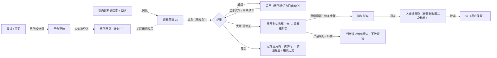

# MX Rig 的定位与「试验规程」：Agent 写、机器跑、失败时修正

日期：2026-09-28。代码基线：0.8.0 Preview（`feat/mx_insight_hub`）。

本文回答两个问题：mx-rig 到底是什么（它和一个通用 Agent 客户端是什么关系），以及在已有的自动化测试集成之上，我们自己独有的测试工具应该是什么。第 3 节的「试验规程」已经实现，第 4 节是下一步。

## 0. 结论

- **mx-rig 是一个面向测试的 Agent 客户端。**
  - 结构上它有 Agent 客户端的全部部件：对话与任务、模型连接、浏览器 / 电脑操控、快照、插件式的框架接入、对外接口。
  - 与通用客户端不同的是，它自带测试领域的系统，这些不是"集成"：用例目录、计划、执行机、执行与证据、任务账本、飞行计划、质量报告。
- **现在的自动化测试（Cypress / Playwright 套件经执行机运行）只相当于客户端里的一个"集成"。**
  - 它把测试框架接进来并跑起来，但 Agent 对这些测试资产既写不了，也维护不了。
  - Agent 的产出止于一段对话、一次性的脚本草稿，或者一条判断。
- **我们独有的工具是「试验规程」（Procedure）。** Agent 负责写：从对话起草用例，把走通的路径固化为规程。机器按原样重放，重放时没有模型参与。某一步失败时，重放停在那一步，把页面交给 Agent 提出修正；修正先经过重放证明，再由人批准。每次重放都记为所属应用的一次执行，进入同一套报告。

## 1. mx-rig 是不是一个 Agent 客户端

把通用 Agent 客户端的设置项（集成：电脑操控、历史记录、应用快照、插件、浏览器；编码：钩子、连接、Git、环境、Worktrees）逐项对到 mx-rig：

| 客户端部件 | mx-rig 里的对应 | 状态 |
| --- | --- | --- |
| 对话与任务 | 任务工作台：Agent 对话、测试工作流、飞行计划；追问、流式输出、人工确认与接管 | 已有 |
| 连接（模型） | 模型 Provider、调用序列、视觉、用量与上限、出网通道 | 已有 |
| 浏览器 | 浏览器工位（隔离 Chromium、带引用的快照、确定性断言、trace）与 Electron 工位 | 已有 |
| 电脑操控 | 原生桌面工位（macOS 辅助功能，预览） | 预览 |
| 应用快照 | 可访问性快照 + 截图 + trace；规程失败时保存当时的页面 | 已有；基线对比未做 |
| 插件 | 测试框架经执行机接入（Cypress / Playwright / pytest / k6 / 通用命令）；MCP 对外接口 | 已有 |
| 钩子 | 事件触发的自动化：执行失败 → 自动定级；规程失败 → 自动修正 | 已有，见 §3.8 |
| 环境 | 允许的测试 origin、生产禁区、应用密钥、执行机能力 | 部分 |
| Git / Worktrees | 执行机按提交检出测试仓库；Rig 本身不写仓库 | 只读 |
| 历史记录 | 任务账本（PostgreSQL）、执行历史、用例历史、审计 | 已有 |

**区别在于第二层。** 通用客户端围绕模型组织工具。mx-rig 在客户端之下还有一套自己的测试领域：
- 用例目录（Case Catalog）、计划（Task）、执行（Run）、执行机（Runner）；
- JUnit / summary 契约、证据与产物；
- 结果语义：受阻不等于失败，零样本不给比率；
- 飞行计划的放行评审，以及质量报告。

Agent 在这里是乘组，平台才是"试车台"。

## 2. 现状：哪些是集成，哪些是我们的系统，缺了什么

| 层 | 内容 | 性质 |
| --- | --- | --- |
| 工具集成 | 浏览器 / Electron / 原生工位、执行机上的测试框架、模型网关、通知渠道、MCP | 把外部能力接进来 |
| 我们的系统 | 测试领域内核、任务账本与审批、飞行计划与放行评审、质量报告与飞行报告、乘组评测集、用量计量 | 我们的规则与数据 |
| Agent | 定级、分析、巡检、领航、起草飞行计划 | 读证据、给判断、按确认执行 |

在"Agent 对话出测试用例、优化修改流程"这个目标下，缺口是：

1. **用例是文字，自动化在别人的仓库里。** 目录里的用例只有「动作 ⇒ 期望」，能跑的是仓库里的 Playwright / Cypress 代码。Agent 既不能安全地改这些代码，也不能自己运行它们。
2. **Agent 的探索用完就没了。** 巡检员走通的路径最多导出一份 Playwright 草稿，要人手工落进仓库；下次还要再请模型走一遍。
3. **没有闭环。** 执行失败以后，Agent 能判断是产品缺陷还是用例问题，但判断就是终点：没有"改测试 → 验证 → 批准 → 再跑"。
4. **回归只能靠代码套件。** 没有一种不经模型、可以确定性重放的 Agent 产物。
5. **对话出用例缺位。** 一句话解析只匹配已有计划，飞行计划起草只编排已有计划；还没有"为这个需求写用例"。

## 3. 独有的工具：试验规程（Procedure）

### 3.1 原则

- **规程是数据，不是代码。** 规程是一张有序的步骤表，步骤词汇就是浏览器工位的语言：打开、点击、填写、选择、勾选、按键、等待、断言。元素按人的说法指定：角色与可访问名称（重名时加序号），或者字段的标签。因此：
  - 固化不需要生成代码；
  - 修正是一张能逐步审阅的表；
  - 重放与 Agent 走的是同一套安全规则：站点范围（规程带着自己的站点，见 [docs/17](17-sites-and-page-behaviour.md)）、生产禁区、不填密码。
- **重放没有模型。** 同一版本每次做同样的事，所以红了就是页面变了，不是模型变了。
- **结果语义不变。**
  - 找不到元素、元素不可操作、断言不成立，判为失败（failed），并标注"可修正"。
  - 打不开页面、origin 不允许、浏览器或应用缺失、要填密码，判为受阻（blocked）：既不算通过，也不算产品失败。
- **修正必须被证明。** Agent 提出的修正先完整重放一遍，通过了才能被批准。
- **断言只增不减。** 验证重放看不出删掉或放宽了断言（断言没了，就没有东西会失败），所以服务端会数出修正丢了几条原有断言。界面上会明说，批准要多点一次确认。
- **结果进同一个报告系统。** 关联了用例的规程，每次试车都记为该应用的一次执行，只按这一条用例计分。

### 3.2 生命周期

### 3.3 和常见做法的区别

| 做法 | 问题 | 规程的做法 |
| --- | --- | --- |
| 录制回放 / codegen | 产物是代码，维护靠人；失败后没人接手 | 产物是步骤表；失败后 Agent 在现场接手 |
| 自愈定位器（运行时自动换选择器） | 悄悄改变了测试在测什么，报告仍是绿的 | 不自动改；修正是一个有差异、有验证、要人批准的新版本 |
| 纯 Agent 测试（每次让模型跑） | 结果随模型波动，成本高，无法作回归基线 | 模型只在写和修的时候出现，回归是确定性重放 |
| 代码套件 + 执行机 | 可靠，但 Agent 写不了、改不了 | 并存：成熟的路径仍可导出为 Playwright 进仓库 |

### 3.4 已实现（2026-09-28）

**规程本身**（`packages/runtime/procedure.mjs`）：
- 步骤词汇：open（可相对 baseUrl）、launch（Electron）、click、fill、select、check、press、wait、assert（7 种断言）。每一步都能附一段说明。
- 规程级别有变量 `{{name}}`；最多 80 步；带逐项校验，出错时指出是第几步、哪里不对。

**重放器**（`ProcedurePlayer` + `BrowserTools.perform`）：
- 逐步执行，区分三种失败：找不到元素（`target_missing`）、有多个（`ambiguous_target`）、找到了但不能操作（`element_not_actionable`）。
- 失败时保存当时的截图和可访问性快照。
- 可以只重放到指定步骤之前，把页面留在那里，这是修正的起点。

**存储**（`apps/server/procedure-store.mjs`，迁移 `021_rig_procedures.sql`）：
- memory 模式用文件，共享部署用 PostgreSQL 行锁。
- 每个规程保留版本历史 20 个、试车记录 30 条（最近 3 条带页面快照）、修正提议 20 条。
- 所有修改都做版本比较：旧版本上的修改会被拒绝；规程被修改后，未处理的提议自动失效。

**接口**：

| 接口 | 作用 |
| --- | --- |
| `GET /api/rig/v1/procedures`、`GET …/:id` | 所有成员可读 |
| `POST /api/rig/v1/procedures`、`POST …/:id:revise`、`POST …/:id:status` | 新建、修改（生成新版本）、启用 / 停用 |
| `POST …/:id/runs` | 记录一次试车；关联了用例时同时记为应用的一次执行 |
| `POST …/:id/proposals`、`POST …/:id/proposals/:pid:decide` | 提交修正、批准 / 驳回 |
| `POST /api/rig/v1/procedures:capture` | 从服务端任务固化 |
| `POST /api/rig/v1/cases:import` | 用例草稿导入用例目录 |
| 内核新增 `POST /api/v1/apps/:app/results:record` | 把 Rig 执行的结果记为一次执行，只按上报的用例计分，走与执行机相同的入库路径 |

**启用规则**：当前版本最近一次试车通过，才能启用。启用时如果关联的是在平台里写的用例，这条用例会被标记为"已自动化"；来自仓库目录的用例由仓库负责，不会被改。

**桌面试验台**（`packages/runtime/procedure-bench.mjs`）：
- 试车、全部试车（逐条执行启用的规程并各自记录）、固化（读本机完整的任务记录）、修正。
- 修正的流程：重放到失败的那一步 → 以规程维护员身份启动任务，把规程原文附在第一条消息里 → 任务结束后在干净的工位上验证试车 → 连同验证结果提交。
- 工位同一时刻只做一件事。

**Agent 与工具**：
- `case_draft`：把一条用例写成草稿记在任务上，人勾选后才导入用例目录。
- `procedure_propose`：提交修正判断；只在修正任务里提供，给出的步骤要能通过规程校验。
- 这两个工具都只写本次任务记录，新部署默认允许；已有部署需要管理员在允许列表里勾上。
- 新增两个内置 Agent：
  - **用例设计师**：先读已有用例，编号接着排，每条只验证一件事，写「动作 ⇒ 期望」。
  - **规程维护员**：区分用例问题、产品缺陷、环境问题；不许删断言凑绿，改动尽量少。

**界面**：
- 「测试 → 试验规程」页：列表、步骤、试车 / 全部试车 / 启用 / 停用 / 编辑、试车记录（逐步结果、失败时的页面、截图、对应的执行）、待审修正（差异、验证结果、断言删改警告）、修订历史。
- 任务详情的「测试资产」：用例草稿导入、固化为规程、修正结论。

**评测**：
- 评测集新增两个修正场景：按钮改名（应判用例问题、验证通过、断言保留、改动不超过 2 步），以及保存真的坏了（应判产品缺陷、不改规程）。
- 另有反例测试：删断言凑绿、把错误提示改成期望值来掩盖缺陷，都会被扣分。

### 3.5 怎么用

1. **起草用例**：
   - 在任务工作台选「用例设计师」，描述需求，例如"为登录页写用例：正常、密码错、账号停用、会话过期"。
   - 在任务详情的「用例草稿」里勾选要的几条，点「加入用例目录」。
2. **固化**：
   - 在桌面端用「页面巡检员」走一遍对应页面，每个检查点做断言。
   - 任务完成后，在「固化为规程」里填应用和用例编号，保存为草稿。
3. **试车与启用**：到「试验规程」页试车，通过后启用。之后需要回归时点「全部试车」。
4. **修正**：
   - 某条试车失败（可修正）时，点「交给规程维护员修正」。它在失败的那一步看页面，提出修正或判断为产品缺陷。
   - 修正经验证试车后回到规程页，由你看差异并批准。
5. **看结果**：每次试车都在测试中心和质量报告里，是该应用的一次执行（触发方式 `rig-procedure`）；用例历史和不稳定检测照常工作。

### 3.6 验证

- 真实 Chromium（无头）测试：
  - 通过、按钮改名后停在那一步（找不到元素、可修正、保留了当时的页面）、断言不成立、origin 不允许（受阻）、拒填密码（受阻）、只重放到指定步骤；
  - 固化、差异、校验、交给内核的执行摘要能被内核的入库逻辑接受。
- 端到端（真实服务 + 真实 Chromium，模型为脚本）：
  - 写用例 → 建规程 → 未试车不能启用 → 试车通过并记为执行 → 启用、用例变为已自动化；
  - 按钮改名 → 试车失败并记为失败的执行 → 修正（重放到失败步、Agent 看到的是改名后的页面、提出修正）→ 验证试车通过 → 旧版本上的修改被拒绝 → 批准得到 v2（状态保持启用）→ 再次试车通过 → 全部试车；
  - 内核里 4 次执行，每次只含这一条用例。
- 规则：未经证明的修正不能批准；只读成员能看不能写；用例草稿逐条导入，编号冲突只影响那一条。
- 无头浏览器走查了网页端：规程列表与详情、差异、批准为 v2、用例草稿导入、固化后跳到新规程，页面没有报错。
- PostgreSQL（临时容器，测完删除）：两个副本共享规程，同时批准同一个修正只生效一次（迁移 021 实际执行）。

### 3.7 限制

- **服务端本身不执行规程。** 服务端镜像不带浏览器；定时回归由服务端排程、由工位执行，见 §3.10。
- **Electron 规程**：步骤词汇支持 `launch`，但还没有对真实 Electron 应用验证过。
- **没有这些步骤**：iframe、多标签页、文件上传、下载、拖拽、悬停。
- **变量不能放密钥**，遇到密码框一律拒绝，所以需要登录的规程要用测试环境里免密或预置会话的方式。
- **修正的质量取决于模型。** 用 `npm run eval -- --live --only repair-renamed-button,repair-real-defect` 度量；评测集还没有真实模型的基线。
- **修正的验证结果由提交修正的桌面上报。** 能提交修正的成员本来也能直接改规程，所以这不扩大权限，但它不是独立的证明。

### 3.8 钩子（2026-09-28）

钩子让 Rig 在事件发生时自己动手，对应 Agent 客户端的"钩子"设置。现在有两种：

| 钩子 | 在哪里执行 | 做什么 |
| --- | --- | --- |
| 执行结束 → 自动定级 | 服务端 | 执行以失败、受阻、不稳定、超时或过期结束时，启动一个只读的定级 Agent（默认「失败定级员」）：读结果、失败用例与步骤、产物和执行机，提交结构化结论。结论进入质量报告；可选地通过订阅了「讲评」事件的通知渠道推送，并注明是 Agent 的判断、不是测试结论。 |
| 规程在全部试车中失败 → 自动修正 | 执行这次试车的桌面端 | 「全部试车」结束后，对每条可修正的失败，重放到失败的那一步并交给规程维护员。修正经验证试车后进入待审，仍然要人批准。 |

**为什么能放心开着**：
- **只读**：定级钩子只能选所有工具都是只读的 Agent，保存时校验。钩子任务不派发、不取消、不点击，所以不会等人确认。万一停在确认上，会被停止并记为未完成。
- **只触发一次**：每个「钩子 × 执行」只有一条记录（PostgreSQL 主键）。几个服务副本同时发现同一次失败，也只启动一个任务。
- **有上限**：每条钩子有每小时上限，超出的记为跳过，不排队补跑。钩子任务以独立身份（`rig-hooks`）逐个执行，不占用任何成员的任务额度。
- **不回头**：只处理钩子建立之后结束的执行，打开钩子不会回头处理历史失败。
- **规程试车默认不重复处理**：规程试车记下的失败执行默认由修正流程处理，不再额外定级，需要时可以勾选。
- **修正要能无人值守**：自动修正只在管理员允许任务级预授权时启动，否则记为跳过并说明原因。每个修正任务最多 15 分钟，超时就停止。

**界面**：「AGENT 中心 → 钩子」。所有成员都能看到规则和「钩子做了什么」（时间、对象、状态、结论或原因）；管理员可以新建、启用 / 停用、删除钩子，以及「立即检查一次」。

**接口**：
- `GET /api/rig/v1/hooks`：规则、最近的触发记录、可选的只读 Agent；
- `POST /api/rig/v1/hooks`：管理员整体保存，按版本号比较；
- `POST /api/rig/v1/hooks:tick`：管理员立即检查一次；
- `POST /api/rig/v1/hooks/fires:report`：桌面端上报自动修正的结果。

**存储与调度**：
- 规则存在控制面文档 `hooks` 里，触发记录在 `rig_hook_fires`（迁移 `022_rig_hooks.sql`）；memory 模式用文件。
- 服务端每 20 秒检查一次（`MX_RIG_HOOK_TICK_MS`），只看最近一小时结束的执行。

**验证**：
- 服务 + 真实网关 + 脚本模型：写入型 Agent 被拒绝；非管理员不能保存；按版本号保存；
- 建钩子之前的失败不处理；每小时上限生效（一条定级、一条跳过）；同一次执行不重复；
- 结论核实了引用，进入质量报告，通知里有 Agent 判断；
- 端到端（真实 Chromium）：按钮第三次改名后，全部试车失败，钩子自动交给规程维护员，修正验证通过并进入待审，规程保持原版本；
- PostgreSQL：两个副本同时检查三次，只认领一次、只启动一个任务；
- 网页端用无头浏览器走查了新建钩子、立即检查和结论展示。

### 3.9 飞行计划里的规程阶段（2026-09-29）

**节点**：飞行计划新增「规程试车」节点（`type: procedure`），列出要重放的规程编号，必须是固定编号，不能用变量。
- 执行时逐条按原样重放，不经模型、不需要逐次确认；
- 每条都记在该规程的试车记录里，关联了用例的同时记为应用的一次执行；
- 节点写出变量 `<id>_passed / _failed / _blocked / _total`。

**放行**：可以用这两个指标：
- 「规程全部通过」：至少一条且全部通过；
- 「规程通过率不低于（%）」：受阻的不计入分母。

没有浏览器工位的服务端运行到这个阶段时，整个阶段记为受阻，并写明原因。所以含这个节点的计划不能定时，定时计划跑在服务端。要定时回归规程，用 §3.10 的定时回归。

**飞行报告**：各阶段表里有一行「规程试车 x/y 通过」；另有「未通过的规程」一节，写明每条停在第几步、为什么，以及是否可以交给规程维护员修正。

**起草**：一句话起草计划时，如果句子提到了已启用规程的名称、应用或用例编号，桌面端会自动加入一个规程试车阶段和对应的放行评审。
- 模型起草时能看到已启用规程的清单；
- 引用不存在、未启用的规程，或者在非桌面端引用，都会被拒绝。

**编辑器**：「编排中心」新增节点按钮，在表单里勾选要重放的规程。

**验证**：
- 规则：重复的规程、变量编号、评审引用了错误类型的节点，都会被拒绝；含规程阶段的计划不能定时；
- 起草：模板只选已启用的规程，非桌面端给出警告；模型草稿引用未启用的规程或在非桌面端时被拒绝；
- 真实 Chromium：计划里两条规程一过一败，阶段计数正确，放行评审判 NO-GO，报告写明「改版后的设置保存」第 3 步失败，内核里各有一次执行；同一计划在服务端运行时整个阶段记为受阻；
- 网页端走查了编排图、编辑器里的规程勾选和任务详情里的阶段结果。

### 3.10 服务端回归：服务端排程，工位执行（2026-09-29）

**原则：服务端只做协调，浏览器的活放到客户端。** 一个 Chromium 要几百 MB 内存和整核 CPU，而且应当靠近被测环境；服务端只保存排程、排队和结果。执行的一方叫「工位」（Station），它是一台只会执行试验规程的执行机，走的是所有执行机共用的认领、租约、心跳、完成协议：
- 服务端不开浏览器，也不增加新的调度器；
- 工位用的是桌面端试车用的同一个规程播放器，同样受靶场安全策略约束。

**一批回归是怎么走的**：
1. 每个应用自动有一个套件 `rig-procedures`，引擎是 `rig-procedure`。回归任务就是内核里挂在这个套件上的计划，cron 由内核的调度器负责。
2. 到点（或点「立即回归」）时，内核排入一次执行，状态为「等待执行机」。K8s 派发器跳过这个引擎，所以不会为它起容器。
3. 能力声明里有 `rig-procedure` 的工位认领这次执行。只会跑 Playwright 的执行机领不到它，工位也领不到 Cypress 套件。
4. 工位用这次执行的令牌读取这一批规程：该应用下已启用、关联了用例、面向网页的规程，按用例编号排序。安全策略随批次一起下发，所以无人登录的工位也照样只访问允许的地址。
5. 每条规程在新页面上按原样重放，实时上报用例和步骤。失败时的停止截图作为这次执行的产物上传。每条规程的试车记录里都记下这次重放，并关联这次执行的编号（`kernelRunId`）。
6. 工位完成这次执行，每条规程对应一个用例。内核只拿这批重放过的用例做对比，不会把应用里其他用例算成缺失。

**三种工位，同一个程序 `mx-rig station`**：

| 形态 | 怎么开 | 适合 |
| --- | --- | --- |
| 桌面值守 | 桌面端「试验规程 → 本机工位值守」：登记后开始值守。在独立进程里用无头浏览器执行，不占用你的任务 | 个人电脑空闲时帮团队跑回归 |
| 命令行 | `mx-rig station enroll --server … --code …`，之后 `mx-rig station watch` | 放在被测环境旁边的测试机 |
| 容器 | `scripts/manage.sh up --station`：用 Playwright 镜像起一个工位，一次性接入码自动登记 | 与服务同机的团队工位 |

**放到哪里跑**：
- 「任意工位」：个人工位和团队工位都可以领；
- 「团队工位」：只有登记为 `server` 的工位能领，也就是命令行用 `--kind server` 登记的工位或容器。

**停止与异常**：
- **取消**：取消一次执行后，工位在下一次心跳时发现，在两步之间停下，发送停止回执，已停下的这条规程不记录试车；
- **停止值守**：第一次停止时，当前这批跑完再退出；第二次停止时立即停下，这次执行记为受阻并写明原因；
- **无法执行**：批次为空或者读不到规程时，执行记为受阻并写明原因，不会等到租约过期。

**服务端的负担**：
- 每批大约是 1 次认领、1 次读批次；
- 每条规程 2 到 3 次小请求：事件、试车记录，失败时再加一张截图；
- 最后 1 次完成，外加租约心跳。

**钩子**：工位批次失败时算作「规程试车记下的执行」，默认不自动定级，需要时在钩子里勾选。批次里失败的规程可以在规程详情里看到停止位置，再交给规程维护员修正。修正目前在桌面端进行。

**接口**：
- `GET /api/rig/v1/procedure-tasks`：列出回归任务（含最近一次执行）、工位，以及可以回归的应用；
- `POST /api/rig/v1/procedure-tasks`：operator 新建回归任务，参数 `{app, name, cronExpr?, timezone?, runsOn}`；
- `POST /api/rig/v1/procedure-tasks/:taskId:run`：立即回归；
- 工位专用，使用执行令牌：
  - `GET /api/rig/v1/station/runs/:runId/procedures`
  - `POST /api/rig/v1/station/runs/:runId/procedures/:id/runs`
- 内核：`POST /api/v1/apps/:app/procedure-suite`，确保该应用有规程套件。

**验证**：
- **服务 + 真实 Chromium**（`tests/station.test.mjs`）：
  - 一批两条规程一过一败，执行按用例记为「失败」，步骤实时上报，停止截图作为产物上传，两条试车记录都关联了这次执行；
  - 只会跑 Playwright 的执行机领不到这批；
  - 没有规程的应用，这次执行记为受阻；
  - 取消后在两步之间停下，发送停止回执，第二步没有执行。
- **桌面值守**：用成员会话登记，能力固定为 `rig-procedure × web`，不能被放宽；真实 `mx-rig station watch` 子进程领到一批并通过；停止值守时空闲等待被打断，进程以 0 退出；注销后平台上不再有这个工位。
- **桌面端冒烟**（`npm run test:desktop`）：在真实桌面端点「登记 → 开始值守 → 停止值守 → 注销」，所有调用都经过主进程的白名单。
- **命令行**：取到一批后发 SIGTERM（和 Ctrl-C、`docker stop` 相同），这一批照样跑完、判定正确、证据完整，进程以 0 退出。
- **网页端**：无头浏览器走查了新建定时回归（cron、团队工位）、立即回归和工位列表，页面没有报错。
- **PostgreSQL**（临时容器，测完删除）：
  - 两个副本、两个工位争同一批，只有一个领到；
  - 执行令牌在另一个副本上同样有效，结果从另一个副本读到；
  - 内核记录时如果收到读不懂的时间，改用服务端时间，不会留下永远「执行中」的执行。
- **Docker 实测**（compose + 工位容器，测完删除全部容器、卷和镜像）：
  - `manage.sh up --station` 一次性接入码自动登记；
  - 每分钟的 cron 由内核调度器触发，放在团队工位上，工位容器用镜像里的 Chromium 重放以 Rig 自己的登录页为目标的两条规程，一过一败；
  - 停止截图（约 300 KB）作为产物上传；
  - 工位停机期间排队的批次，工位回来后依次领走；
  - `docker stop` 恰好发生在一批中间时，这批仍然跑完才退出；
  - 回归进行中，服务端内存约 33–42 MB，工位约 330 MB（空闲时 77 MB）。

**实测中发现并修复的问题**：
- **停止值守会关掉工位的浏览器。** Playwright 默认在 SIGTERM / SIGINT 时关闭浏览器，所以「这一批跑完再停」其实做不到：Docker 实测里一批在中间被停止，失败规程的截图和 trace 都丢了；信号早一步的话，还会把通过的规程判成失败。现在工位关掉了 Playwright 的信号处理，浏览器由工位自己关。新增的测试在关回默认设置时确实失败。
- **放到团队工位的批次会永远排队。** 内核里「服务器静默跑」意味着由平台执行，所以这类执行既不会过期，也不需要执行机出现。但规程批次只有工位能执行，没有团队工位时只会一直排队，而 cron 还会不断往队列里加。现在规程批次一律「等待执行机」，并有认领期限（默认 12 小时）；「团队工位」仍然只让 `server` 类型的工位认领。
- **读不懂的时间会留下永远「执行中」的执行。** 这是内核记录接口原有的问题：先建执行再完成，完成时 PostgreSQL 拒收时间就会留下孤儿执行，Docker 实测里就出现了两条。现在的处理是：读不懂的时间换成服务端时间；完成失败时把这次执行关为受阻；Rig 这一侧的试车记录要求 ISO 时间。

**限制**：
- 工位只执行网页规程；Electron 规程不进批次。
- 工位上没有自动修正：批次里失败的规程要在桌面端交给规程维护员。
- 只提供了 compose 的工位容器，Internal 的 Kubernetes 上还没有工位 Deployment。
- 服务器用 SIGKILL 强杀工位进程时，Chromium 可能残留；容器里随容器一起结束。

## 4. 下一步

| 编号 | 工作 | 说明 |
| --- | --- | --- |
| P4.1 钩子 ✅ | 执行失败 → 自动定级；规程在全部试车中失败 → 自动修正 | 见 §3.8；下一步可以增加更多事件（安装包上传后跑飞行计划、执行机离线告警） |
| P4.2 飞行计划里的规程阶段 ✅ | 编排新增 `procedure` 节点，放行指标「规程全部通过」「规程通过率」 | 见 §3.9 |
| P4.3 服务端回归 ✅ | 服务端排程，工位执行（桌面值守 / `mx-rig station` / 工位容器） | 见 §3.10；下一步是工位上的自动修正、K8s 上的工位 Deployment |
| P4.4 快照基线 | 把关键页面的可访问性结构存为基线，结构漂移时告警并建议修正 | 对应"应用快照" |
| P4.5 集成页 | 统一展示工位、执行机、Provider、通道、MCP 的状态与配置入口 | 对应客户端的"集成"设置 |
| P4.6 导出进仓库 | 成熟的规程导出为 Playwright spec，作为分支提交到测试包仓库 | 需要写仓库的凭据，启动前单独评审 |
| P6 看得见的工作过程 ✅ | 对话式工作过程、领航光标、实时画面与画中画、确认前在页面上标出元素、回放与导出 | 见 [docs/15](15-agent-workbench-and-replay.md)；下一步是工位批次回放 |
| P6.2 开箱即用的站点范围 ✅ | 浏览器工具新部署默认开启；站点第一次去时问发起人；页面自己的请求、新标签页、对话框、下载、WebSocket 都按页面的方式工作；接管时可以去任何站点、回答对话框、复制、拖拽；Electron 与原生应用也能接管 | 见 [docs/17](17-sites-and-page-behaviour.md)；下一步是本机测试凭据 |
| P6.1 实时画面里接管 ✅ | 在实时画面里直接操作页面；Agent 碰到密码、验证码、扫码、支付时用 `browser_handoff` 请人来做；人输入的内容不记录、不给模型 | 见 [docs/16](16-live-takeover.md)；同时修复了密码框的值会进入模型快照的问题 |
| P5 终端 Agent ✅ | `mx-rig`：在项目目录里的测试工程师。读代码、跑测试、修测试，改动逐条确认；同一会话里可以查平台、开页面、起草用例、导出草稿、固化并试车规程 | 见 [docs/14](14-terminal-agent.md)；已有命令沙箱、终端里的规程修正、`-c` 续接和独立安装包；下一步是真实模型基线、Linux 沙箱实测、发布到内部 registry |

## 5. 命名补充

| 航天术语 | 中文 | Rig 概念 |
| --- | --- | --- |
| Test Procedure | 试验规程 | 规程（Procedure） |
| Test Firing | 试车 | 一次确定性重放 |
| Capture | 固化 | 探索任务 → 规程草稿 |
| Regression pass | 全部试车 | 逐条重放启用的规程 |
| Test Stand / Station | 工位 | 只执行试验规程的执行机（桌面值守、命令行、容器） |
| On duty | 值守 | 桌面端在后台认领回归批次 |
| Corrective Action（FRACAS） | 纠正措施 | 修正提议：判断 + 修正步骤 + 验证试车 |
| Change Board | 变更评审 | 人批准修正、生成新版本 |
