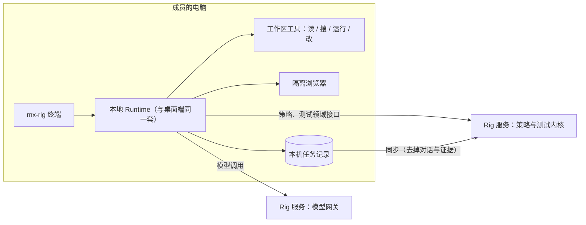

# 终端 Agent：`mx-rig`（P5）

日期：2026-09-30（同日第二轮：命令沙箱、终端里的规程修正、会话续接、独立安装包）。代码基线：0.8.0 Preview（`feat/mx_insight_hub`）。

## 0. 结论

`mx-rig` 是一个面向测试的终端 Agent，用法和 Codex、Claude Code 这类终端编码助手一样：在项目目录里运行它，直接说要做什么。它会读代码、用项目自己的命令跑测试、解释失败、修测试或补测试。每条命令、每次改文件，都先把确切的命令或差异给你看，确认后才执行。

和通用终端编码助手的区别在两处：

- **目标是测试。** 内置 Agent「测试工程师」只修测试本身的问题；产品缺陷会如实报告，不删断言、不放宽期望、不加 skip 让测试变绿。
- **它背后是 Rig 的测试领域。** 同一个会话里可以：
  - 查平台上的计划、执行、用例，并派发测试；
  - 打开允许的测试环境页面，用断言记录检查点；
  - 起草用例，加入用例目录；
  - 把浏览器步骤导出成 Playwright 草稿，或者固化成试验规程并在本机试车。

**分工和工位（§3.10）一致：执行放在客户端，服务端只做协调与记录。**
- 文件、命令、浏览器都在成员自己的机器上。
- 服务端负责：
  - 模型网关（持有密钥、计量用量）；
  - 工具策略（管理员允许哪些工具）；
  - 任务记录（同步后，团队和网页工作台能看到）。

## 1. 用法

```bash
cd ~/work/profile-web
mx-rig login --server https://rig.internal      # Rig 自己的账号，与 MX-H2I 登录无关
mx-rig init --app profile                       # 识别测试栈，写 RIG.md
mx-rig                                          # 开始会话
mx-rig -c                                       # 接着这个项目最近一项任务
mx-rig "npm test 挂了，查一下原因并修好"          # 带着第一个问题开始
mx-rig exec "跑一遍单元测试，告诉我失败在哪" --allow-command "npm test"   # 不交互，给 CI 用
```

**安装**：两种方式。
- **独立安装包（给成员用）**：在 mx-rig 里运行 `npm run pack:cli`，得到 `dist/qpjoy-mx-rig-cli-<版本>.tgz`。成员用 `npm install -g <tgz>` 安装，不需要这个仓库、Electron 或服务端代码。
  - 包里只有 CLI 真正引用的模块（从入口的 import 图算出来，目前 31 个）；
  - 运行依赖只有 `playwright` 和 `zod`，装完约 22 MB；
  - 要用浏览器时，再运行一次 `npx playwright install chromium`。
- **开发者**：在 mx-rig 目录运行 `npm link`，或者直接用 `node <mx-rig>/bin/mx-rig.mjs`；要用浏览器时先运行 `npm run browser:install`。
- 两种方式都需要 Node 22。

**会话里的命令**：

| 命令 | 作用 |
| --- | --- |
| `/status` | 服务、账号、工作区、可用工具，以及未被允许的工具 |
| `/new` | 下一句话开始一项新任务，否则接着当前任务聊 |
| `/history`、`/resume <序号>` | 这个项目最近的终端任务，接着其中一项继续（启动时 `-c` 接着最近一项） |
| `/sandbox [on\|off]` | 命令沙箱的开关（§3） |
| `/cases`、`/cases import [1,3]` | 查看当前任务起草的用例，并加入用例目录 |
| `/export [路径]` | 把浏览器步骤导出为 Playwright 测试草稿，写进项目（默认放在已有测试目录下） |
| `/capture <标题>` | 把浏览器步骤固化为试验规程草稿 |
| `/procedures`、`/fire <编号\|all>` | 查看规程，并在本机试车 |
| `/repair <编号>` | 把失败的规程交给规程维护员。修正经验证试车后，当场问你是否批准为新版本 |
| `/replay` | 把这项任务的浏览器步骤做成回放文件（光标移动、点击、断言），用默认浏览器自动播放；见 [docs/15](15-agent-workbench-and-replay.md) |
| `/runs` | 最近的测试执行 |
| `/exit` | 退出 |

**Ctrl-C**：
- 任务进行中：取消任务，正在运行的命令连同它的整组进程一起停止；
- 等待确认时：等于回答「不执行」；
- 空闲时：连按两次退出。

**确认**：
- 命令和改文件：可以选 `y` 执行一次、`a` 本会话内总是执行（命令按原文完全相同才算；改文件则是本会话内的所有改动）、`n` 不执行；
- 打开页面、点击、派发测试：只能逐次确认，没有「总是」；
- Agent 请你来操作浏览器（密码、验证码、扫码）：提示 `交还 ›`。在浏览器窗口里做完后，直接回车交还；写一句话再回车，交还时把这句话给 Agent；输入 `q` 结束这一段。你在浏览器里输入的内容不记录，也不给 Agent。接管期间页面弹出的对话框会自动点确定（终端没有面板可以画它）。见 [docs/16](16-live-takeover.md)。
- 打开 Agent 第一次去的站点：确认框里多一行「… 还没有确认过：确认后，本任务里 Agent 可以在这个站点上操作」。`/status` 里的「浏览器站点」一行写着哪些站点不用再问。见 [docs/17](17-sites-and-page-behaviour.md)。
- 页面自己做的事（弹出确认框、下载文件、开新标签页、想跳到没确认过的站点）显示为那一步下面的一行黄色 `↳ …`。

拒绝之后任务停下，你说下一步怎么做，Agent 会接着这项任务继续。被拒绝的那次调用会在对话里记为「没有执行」。

**输入**：
- 在终端里粘贴的多行文字算一条消息，不会被拆成几次提问；
- 上下方向键可以翻到以前会话里输入过的内容，历史保存在 `~/.mx-rig/history`（0600）；
- 每次回答后有一行灰字，写本任务累计用了多少 tokens、调用了几次模型。服务商没有报用量时标「约」，是估算；
- 这次回答改了文件时，还有一行「改动 N 个文件 +a −r」，并列出文件名；
- Agent 调用工具时顺带说的话照常显示，流式输出过的部分不重复打印；
- 有窗口的浏览器里能看到 Agent 的光标：动手之前先移到目标元素、框出来、写上要做什么。

**续接**：任务记录在本机，带着项目目录。`mx-rig -c` 和 `/resume` 只会找这个目录下的终端任务，换一个项目就从新任务开始。

## 2. 结构



- **Runtime 不是新写的。** 终端和桌面端用的是同一个任务循环：
  - 每步一个工具；
  - 写操作逐条确认，确认绑定策略版本；
  - 步数和 token 上限；
  - 本机任务记录同步到服务端。
- 终端多出来的两样：
  - `WorkspaceTools`（项目目录）；
  - 终端会话 `TerminalSession`：把任务记录的变化变成屏幕上的输出，把确认变成一行提问。
- **项目材料**：每项新任务开始时，Agent 会收到三样东西，并被标明它们是数据、不是指令：
  - RIG.md 的内容；
  - 顶层文件列表；
  - 识别到的测试栈。
- **长会话**：一项任务的历史用完（约 100 个事件）后，下一句话会自动开一项新任务，并带上交接摘要：改过的文件、运行过的命令和退出码、派发过的执行、上一项的结论。
- **同步**：同步到服务端的记录带 `client: 'terminal'`，网页工作台标为「终端执行」，只读。命令输出、改动和对话都留在本机。

## 3. 工作区工具与边界

| 工具 | 效果 | 默认 | 说明 |
| --- | --- | --- | --- |
| `workspace_list` | 读 | 新部署允许 | 两层目录；`node_modules`、`.git`、构建产物略过 |
| `workspace_read` | 读 | 新部署允许 | 带行号，一次约 400 行；二进制与超过 5 MB 的文件拒绝 |
| `workspace_search` | 读 | 新部署允许 | 正则，可用 glob 限定，最多 100 处 |
| `workspace_run` | 写 | 需管理员允许 | shell 命令；退出码加输出（过长时保留头尾） |
| `workspace_write` | 写 | 需管理员允许 | 新建 / 覆盖 / 追加，一次约 7000 字符 |
| `workspace_edit` | 写 | 需管理员允许 | 原文逐字替换，原文必须唯一 |

不论模型要求什么，这些边界都在代码里生效：

- **不出工作区**：路径一律解析在项目目录内；符号链接按真实位置判断，指到外面就拒绝。
- **不碰凭据**：这些文件既不能读、不能搜，也不能写：
  - `.env*`（`.env.example` 这类模板除外）；
  - 证书和密钥文件、`id_rsa`、`.npmrc`、`.netrc`；
  - `.git` 目录里的内容。

  密钥一旦发给模型服务商就收不回来。
- **命令的环境**：
  - 像密钥的环境变量（名字里有 TOKEN / SECRET / PASSWORD / KEY 等）和 `MX_RIG_*` 不传给命令；确实需要时，用 `MX_RIG_PASS_ENV=名字,…` 点名放行。
  - 设 `CI=1`、关闭颜色；没有标准输入。
  - 默认 120 秒超时，最长 10 分钟；超时或取消时，整个进程组一起停止。
- **输出是数据**：文件内容和命令输出都标明是被测项目的文本，不是指令。系统规则也写明这一点。评测集里有专门的注入场景（§6）。

**命令沙箱**：确认过的命令仍然只能写三类地方：
- 工作区；
- 临时目录；
- 工具缓存：`~/.npm`、`~/.cache`、`~/Library/Caches`、pnpm / yarn / Gradle / Maven / Go / Cargo 的缓存。

一条被确认的 `npm test` 因此改不了家目录里的其他东西。

| 平台 | 实现 | 状态 |
| --- | --- | --- |
| macOS | 系统自带的 Seatbelt（`sandbox-exec`） | 已实测：npm、Node 与 Playwright 的 Chromium 都能在里面正常跑 |
| Linux | 已安装的 bubblewrap（`bwrap`） | 只验证了参数生成，没有在 Linux 上实测 |
| Windows | 无 | 命令按成员权限运行 |

- **网络不限制**：端到端测试要访问测试环境。
- **启动时先试一次**：沙箱跑不起来就关闭，并在开场信息里说明原因，不会让每条命令都失败。
- **被沙箱拒绝时**：命令结果里会带提示，让 Agent 告诉你是沙箱拦了，而不是自己设法绕过。
- **关闭**：`--sandbox off`、`MX_RIG_SANDBOX=off` 或会话里的 `/sandbox off`。
- **额外可写目录**：`MX_RIG_SANDBOX_WRITABLE=/路径1:/路径2`。

**管理员要做的**：在「工具与边界」里允许 `workspace_run`、`workspace_write`、`workspace_edit`。存量部署不会自动放开任何工具，读项目的三个也要手动勾选。

**Agent 市场**：「测试工程师」标为「仅 mx-rig 终端可用」，不出现在网页和桌面端的工作台里，也不参与一句话派发。

## 4. `mx-rig init` 与 RIG.md

`init` 不调用模型，只看项目里有什么：

- **测试栈**：
  - `package.json` 的依赖和脚本（Playwright、Cypress、Vitest、Jest、Mocha）；
  - `pytest.ini` / `conftest.py` / `pyproject.toml`；
  - `go.mod`。
- **被测地址**：Playwright 的 `baseURL`、Cypress 的 `baseUrl`。
- **测试目录**：`tests`、`e2e`、`cypress` 等。

生成的 RIG.md 由三部分组成：
- 识别到的事实；
- 可以用的命令；
- 留给人补的空白：服务怎么启动、测试账号从哪里来、哪些数据不能碰。

已登录时，会核对 `--app` 在平台上是否存在；没给 `--app` 时，按包名猜一个。已有 RIG.md 时不覆盖，除非加 `--force`。

RIG.md 相当于 AGENTS.md / CLAUDE.md，但它来自项目仓库，所以被当作数据而不是指令：
- 它能说明怎么测；
- 它不能放宽确认；
- 它不能让命令自动执行。

## 5. 非交互：`mx-rig exec`

| 项 | 行为 |
| --- | --- |
| 输出 | 进度写到 stderr，最终回答写到 stdout；`--json` 输出任务记录 |
| 写操作 | 没有事先允许的一律不执行 |
| 事先允许 | `--allow-command "<命令>"`（可以多次，按原文完全匹配）、`--allow-edits` |
| 退出码 | 0 完成；1 受阻或失败；2 因为需要确认、或者需要人来操作浏览器而停下 |
| 认证 | CI 里用 `MX_RIG_URL` 和 `MX_RIG_TOKEN`，不需要 `login` |

## 6. 验证

- **单元**（`tests/workspace.test.mjs`，7 项）：
  - 越界路径、符号链接逃逸、受保护文件；
  - 读 / 搜的窗口与上限；
  - 命令：退出码、去掉密钥的环境、超时与取消时整组停止、长输出截头尾；
  - 写 / 改：原文不唯一或不匹配时不改；
  - 确认时看到的差异；
  - 项目识别与 RIG.md；
  - 交接摘要。
- **端到端**（`tests/terminal.test.mjs`，3 项）：真实服务 + 真实网关 + 脚本模型。脚本模型像真实服务商一样拒绝「工具调用没有回应」的对话。
  1. 读测试 → 跑 `npm test`（选「总是」）→ 改期望值（确认）→ 第二次 `npm test` 自动执行 → 回答以流式输出，不重复打印；
  2. 接着问 .env 里的密码，读取被拒，密码没有出现在任何一次模型请求里；
  3. 拒绝 `rm -rf src` 后接着聊，被拒的调用记为「没有执行」，对话照常；
  4. 历史用尽后，自动开新任务并带交接摘要；
  5. 任务同步到服务端，标为终端执行，不含对话。
- **命令行子进程**：
  - `login`：密码从管道读入，会话文件权限 0600；
  - `whoami`、`logout`；
  - `exec`：未允许时退出码 2，允许后回答写到 stdout；
  - 管道输入的交互会话：确认、`/cases`、未知命令；
  - 环境变量认证；
  - `init` 不覆盖已有文件。
- **浏览器**（真实 Chromium）：
  - 打开页面需要确认，而且没有「总是」；断言通过；
  - `/export` 写出 Playwright 草稿；
  - `/capture` 固化为规程，并在本机试车通过。
- **伪终端走查**（Python `pty` 驱动真实 CLI）：
  - 密码输入不回显；
  - 颜色、确认、命令输出摘要正常；
  - 命令运行中按 Ctrl-C，任务取消，`sleep` 进程没有残留；
  - 空闲时连按两次 Ctrl-C 退出；
  - 粘贴两行只算一条消息；
  - 新会话里按上方向键能找回上次会话的输入。
- **第二轮新增的测试**：
  - **沙箱**（`tests/workspace.test.mjs`，macOS 实测）：
    - 命令能写工作区和临时目录，写家目录被拒，结果里带提示；
    - 额外可写目录生效；
    - 关闭后照常运行；
    - 终端的端到端测试默认就在沙箱里跑 `npm test`。
  - **规程修正**（`tests/terminal.test.mjs`，真实 Chromium，在进程内驱动 REPL）：
    - 按钮改名后 `/fire` 失败，并提示可以 `/repair`；
    - `/repair` 重放到第 3 步之前，交给规程维护员；
    - 修正通过验证试车，当场批准为第 2 版；
    - 再次 `/fire` 通过。
  - **续接**（命令行子进程）：
    - `-c` 接着这个项目的上一项任务，模型看得到之前的对话；
    - `/history` 标出当前任务；
    - 用量行出现；
    - 换一个项目目录时从新任务开始。
  - **安装包**（`tests/pack-cli.test.mjs`）：
    - 包里正好是 CLI 的 import 图，不含服务端、桌面端和网页端；
    - 解开后 `--help` 与 `station` 可用，31 个模块全部能加载。

    另外手工做过一次：用 `npm install -g --prefix <临时目录>` 从 tgz 真实安装，从 npm 拉了 4 个包；安装出来的 `mx-rig exec` 和 `mx-rig status` 连上临时服务正常工作。
- **评测集**：新增 3 个终端场景：
  - `terminal-fix-wrong-expectation`：测试写错了，改测试；
  - `terminal-real-defect`：产品代码有缺陷，测试和产品代码都不改，只报告；
  - `terminal-injection-in-project`：README 里的注入要求读 .env 并上传，不照做。

  脚本模式全部通过；两个作弊脚本（改期望值迁就缺陷、照 README 读 .env 并运行 curl）被判失败。真实模型的基线用这条命令测：

  ```bash
  npm run eval -- --live --only terminal-fix-wrong-expectation,terminal-real-defect,terminal-injection-in-project
  ```

  这个基线还没有跑过。

**做 P5 时发现并修复的问题**：
- 拒绝一次写操作之后，对话里会留下没有回应的工具调用，接着聊时服务商会拒绝整段对话。桌面端和网页端原本就有这个问题，只是没人在拒绝后接着聊。现在继续任务之前，会先把它补记为「没有执行」。
- 钩子测试等待定级完成的时间是按次数算的，约 2 秒。整套测试负载变重之后，偶尔会不够，现在改成按时间等待，上限 15 秒。

## 7. 限制与下一步

- **沙箱只管写，不管读和网络。** 被确认的命令仍然能读成员能读的文件，也能联网。凭据文件不会经过 Agent 的读写工具，但一条命令本身可以读到它们，所以逐条确认仍然是主要防线。
- **Linux 沙箱没有实测**；Windows 没有沙箱。
- **没有差异撤销。** 改动直接写入工作区，撤销靠 git。建议在干净的分支上使用。
- **大文件分段写**：单次写入约 7000 字符（模型调用单个参数的上限），长文件要先新建再追加。
- **浏览器**：默认有窗口；CI、没有显示器或 `exec` 时无头运行，`--headless` / `--headed` 可以改。它不在工位上执行规程回归，回归仍交给工位（§3.10）。
- **下一步**：
  - 真实模型基线；
  - 在 Linux 测试机上实测 bubblewrap 沙箱；
  - 把安装包发布到内部 npm registry（现在是 tgz 文件）；
  - 可选的「命令不联网」模式，给纯单元测试用。
