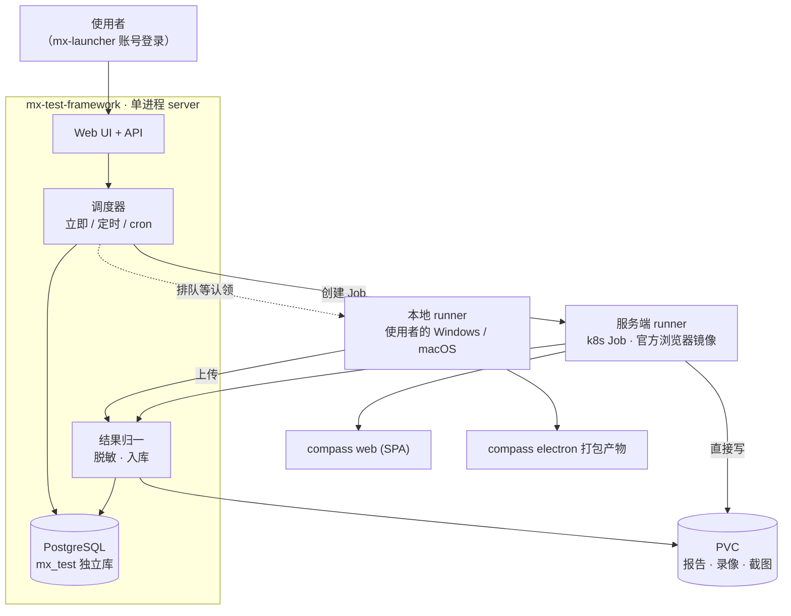
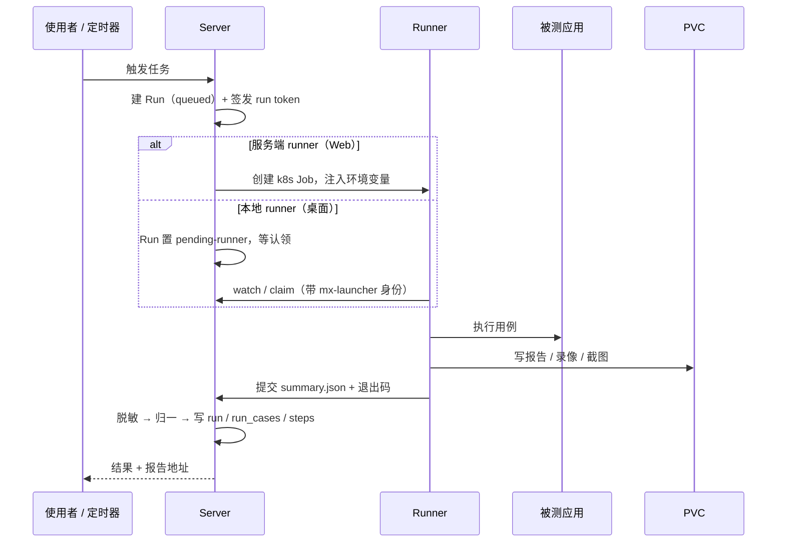

# 01 · 架构

## 全貌



**一个 server 进程**承载 UI、API 和调度器。规模到不了需要拆的程度，也不应该为了
"看起来像微服务"而拆。

## 核心模型

```
Task（任务）  ──调度──>  Run（执行）  ──>  RunCase（用例结果） + 产物
```

**Task** 是使用者创建的东西：测哪个应用的哪条 suite、用什么 profile、打哪个地址、
在哪跑。它有三种调度方式：

| 调度 | 说明 |
| --- | --- |
| `manual` | 建好放着，点一下跑一次 |
| `once` | 指定时刻跑一次 |
| `cron` | 按 cron 表达式重复跑 |

**Run** 是一次实际执行。同一个 Task 反复执行产生一串 Run，于是有了历史与趋势。

## 一次执行的流程



**runner 不直接写数据库。** 它提交 `summary.json`，归一与脱敏都在 server 做。
理由是 runner 跑的是被测应用仓库里的代码，不能当作可信数据源。

## 两种 runner

见 [11-runner-environments.md](11-runner-environments.md)。要点：

- **服务端 runner**：k8s Job + 官方浏览器镜像，Internal 的 RHEL 服务器上全自动跑无头
  Web e2e。产物直接写 PVC，不走网络上传。
- **本地 runner**：使用者自己机器上的 CLI，mx-launcher 账号登录后认领任务。
  用于 Electron 打包产物这类服务器上跑不了的场景。产物通过 API 上传。

平台按 runner 上报的能力（os / engine / surface）派活，两类任务不会派错。

## 部署

`bash scripts/manage.sh deploy` 一条命令：镜像 → 迁移 → 服务 → 冒烟。
清单与配置见 [10-deployment.md](10-deployment.md)。

普通 ClusterIP + Ingress，**不需要 service VIP，不进 AppCenter**。
它是内部通用测试框架，不是分发给终端用户的产品。

## 与其他系统的边界

| 系统 | 关系 |
| --- | --- |
| `mx-launcher` | **只用它的账号登录**。不接管它的 test-center，不参与它的发版流程 |
| `mx-insight-hub` | 无耦合。共用 PostgreSQL 实例但不同库，共用 `@qpjoy/mx-common` 代码 |
| 被测应用仓库 | 单向：MXT 读它的用例目录与执行结果，不改它的代码 |
| MX-H2I 联网 | **不介入**。e2e 在 SPA 页面或 Electron 界面上操作，网络由 launcher 自己分配 |

MXT 挂掉时，被测应用仓库的 `pnpm e2e:local` 必须仍能独立跑通。
