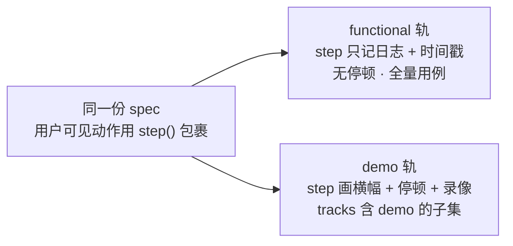

# 05 · 轨道设计与产物

## 存量：compass 的四轨

compass 的 `cypress.config.ts` 定义了 `E2E_TRACK`，与 `E2E_PROFILE`（mock/real）正交：

| track | 视频 | 节奏 | spec 目录 | 用途 |
| --- | --- | --- | --- | --- |
| `functional` | 有 | 无停顿 | `smoke/` + `core/` | P0/P1 断言主轨 |
| `demo` | 有 | 每步停 900ms + 屏幕横幅 | `demo/mock/`、`demo/real/` | 管理员/客户 review |
| `perf` | 无 | 无 | `perf/` | 真实 API 计时 |
| `capture` | 无 | 无 | `capture/` | 一次性人工登录态捕获 |

这个判断是对的：**给机器看的和给人看的是两种产物，不该互相迁就**。
functional 为了快牺牲可读性，demo 为了可读性牺牲速度，各得其所。

平台保留 `functional` 和 `demo` 两轨。`perf` 降级为后续规划（先做 e2e 平台）；
`capture` 从平台移除，只保留为本地开发命令。

## 存量的问题：双轨是两份代码

`cypress/e2e/demo/real/real-tour.demo.cy.ts` 和 `cypress/e2e/real/*.cy.ts` 是**独立编写的
两套 spec**。业务改一次要改两处；改漏一处，demo 录像演示的就是已经不存在的流程。
这是双轨目前最大的维护成本。

而 `cy.step()` 其实已经解决了一半——它在 functional 轨只写日志、在 demo 轨才画横幅
并停顿。缺的是**让同一个 spec 跑两条轨**。

## 优化：单一 spec，双轨执行



规则：

1. spec 里**每个用户可见的动作都要 `step()` 包裹**。这是 lint 可查的约定，
   也是 demo 轨旁白的唯一来源。
2. 用例参与哪些轨道由**目录的 `tracks` 字段**决定（[03](03-case-catalog.md)），
   不再由 spec 所在目录决定。
3. `demo/` 目录逐步清空。存量的 `real-tour.demo.cy.ts` 是第一个迁移对象——
   它的三个步骤本来就是 real 轨用例的子集。

## step 的第二个职责：录像时间轴

compass 的 `cy.step()` 画了横幅，但时间戳没交出来，录像只能从头看。

平台要求 runner 在 `summary.json` 的 `cases[].steps[]` 里给出 `offsetMs`
（相对该用例录像起点的毫秒偏移），据此在报告里生成可点击的时间轴：

```
▸ 演示 · 真实链路走查            [ 00:00 ─────────────── 01:12 ]
   1  以已登录身份进入罗盘首页        00:02  ✓
   2  首页正在加载真实情报数据        00:11  ✓
   3  进入策略中心                    00:29  ✓
   4  策略中心正在加载真实策略列表    00:38  ✗  ← 点击跳转
```

**这是 review 体验的核心提升**：从"看完 72 秒录像"变成"直接跳到失败那一步"。
放缓节奏的价值仍在（人能看清页面），但不再需要从头顺着看。

## flaky 处理

compass 设的是 `retries: { runMode: 0 }`——不重试，一抖就红。单机手跑时这是对的
（信号纯净），但定时任务跑起来后会被噪声淹没。

平台策略：suite 可配 `retryPolicy: { maxAttempts: 2 }`。

- 第一次失败 → 只重跑该用例，不是整个 suite
- 重跑通过 → `flaky`，run 仍算通过，但单独计数
- 重跑仍失败 → `failed`

**flaky 不被静默吞掉**：平台按 `mxt_run_cases` 算每个用例的 flaky 率，
连续 5 次里 flaky ≥ 3 次的用例自动进"待修复"列表并标记 `quarantine`——
仍然执行、仍然记录，只是不再制造噪声告警。修好后手动解除。

## 产物

**没有 evidence 抽象。** 产物就是 PVC 上的文件：

```
<MXT_ARTIFACTS_DIR>/runs/<runId>/
  summary.json
  report/index.html
  videos/**
  screenshots/**
```

数据库里 `mxt_runs.artifacts` 存一个路径索引：

```json
{
  "report": "report/index.html",
  "videos": ["videos/smoke/auth.cy.ts.mp4"],
  "screenshots": ["screenshots/home-failed.png"],
  "expired": false
}
```

没有对象存储、没有 sha256 校验链、没有分级保留策略。默认保留 30 天，
`manage.sh clean` 按天删目录并把 `expired` 置 true——**run 记录保留**，
报告显示"产物已过期"而不是 404，历史与趋势不断档。详见 [10](10-deployment.md)。

### 报告路径不由 runner 决定

compass 现在有一段 `reconcileVideoPaths`，在修补 mochawesome 生成的相对路径与
Cypress 实际写出位置不一致的问题。根因是报告与执行耦合。

平台的做法：**runner 只报相对 `MXT_ARTIFACTS_DIR` 的路径，报告由平台渲染。**
runner 侧那段路径修补代码因此可以删掉（存量阶段先保留，不阻塞接入）。

## 脱敏与对外分享

### 入库脱敏

runner 跑的是被测应用仓库的代码，平台**不假设它做过脱敏**。
compass 的 `redactSensitiveText` 很好，但它在 runner 侧。平台 ingest 时再做一遍：

- 所有文本字段（title、error、blockedReason、targetUrl）过脱敏管道
- URL 剥离 username/password/query/fragment
- 匹配 `Bearer\s+\S+`、`(authorization|cookie|password|token|secret|api[-_]?key)\s*[:=]\s*\S+` 的片段替换
- 超长截断（error 4KB、title 300 字符）

### 对外分享：脱敏按钮 + 品牌层

默认所有报告**仅内部可见**，信息完整。要给客户看时，点"生成分享报告"：

| 内部视图 | 分享副本 |
| --- | --- |
| 内网 URL、主机名、IP | 替换为产品名 |
| spec 文件路径、错误堆栈 | 移除 |
| 测试账号、runner 名称 | 移除 |
| 用例标题、步骤旁白、截图、录像、通过率 | **保留**——这才是要给人看的 |
| — | 套品牌层：logo、配色、产品名 |

分享副本是独立产物，有独立链接、有效期（默认 7 天）、可随时撤销。
API 见 [06](06-api-contract.md)。

录像与截图的内容**不做自动扫描**——成本过高。防线在前置：`real` profile 用测试账号，
测试账号不接触真实客户数据。这是策略约束，不是技术约束。
