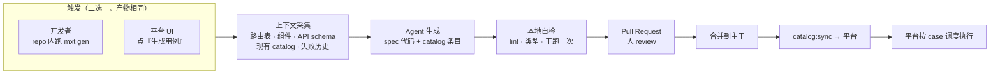

# 07 · Agent 编写用例

## 你的问题：上传还是平台生成

> "spec 代码和 case 是固定的，只不过是生成好后上传到平台让平台按 case 执行，
> 还是平台能够前置通过 agent 生成各个 case，然后运行。"

**这两件事不冲突，因为它们是同一条流水线的两端。** 分歧只在于"谁按下生成按钮"，
而不在于产物去哪里。答案是：

- **产物永远进 git**（被测应用仓库），平台从不存储可执行的测试代码。
- **生成动作可以在两处发起**：开发者在仓库里跑 CLI，或运维在平台 UI 点按钮。
  平台发起时，它做的也是"在仓库里生成 → 开 PR"，不是"在平台里存一份"。

理由见 [ADR-0003](adr/0003-git-owned-case-source-of-truth.md)。一句话：
**没有经过 code review 的测试代码，它的绿色是没有意义的**——测试的价值来自
"人确认过它测的是正确的东西"。同时，平台运行未经审核的代码等于给了任意仓库
在 runner 上的执行权。

## 流水线

平台侧发起时，第 4 步之后的流程完全一样——它只是把 `mxt gen` 跑在了一个带仓库
写权限的 job 里，产出 PR 交给人。**平台永远不会跳过 PR 直接执行新生成的代码。**

## Agent 拿到什么上下文

生成质量取决于上下文，不是取决于模型。`mxt gen` 采集：

| 来源 | 内容 | 作用 |
| --- | --- | --- |
| 路由表 | quasar/vue router 定义 | 知道有哪些页面、哪些受守卫保护 |
| API 契约 | OpenAPI / 接口调用点 | 知道该断言什么请求与参数 |
| 现有 catalog | 已有 Case ID、域、优先级 | 避免重复、延续命名 |
| 现有 spec | 选择器与自定义命令的写法 | 生成风格一致的代码 |
| 失败历史 | `mxt_run_cases` 里最近的失败与 flaky | 优先补薄弱区域 |
| 需求引用 | `requirementRef` 关联的 story | 让新用例可追溯 |

`mxt gen` 是 MXT 提供的 CLI，装在被测应用仓库里（devDependency）。

## 生成什么

一次生成产出三样，缺一不可：

1. **spec 文件** —— 确定性代码，无 AI 运行时依赖。所有用户可见动作用 `step()` 包裹
   （[05](05-tracks-and-artifacts.md) 的硬性约定）。
2. **catalog 条目** —— 含 `id`、`priority`、`tracks`、`requirementRef`
   （[03](03-case-catalog.md)）。
3. **fixture（mock profile 时）** —— 拦截数据。

## 护栏

Agent 生成的用例最常见的失败模式是"看起来测了很多，其实只断言了元素存在"。
针对性护栏：

| 护栏 | 规则 |
| --- | --- |
| 禁止空断言 | 每个用例至少一个非 `.should('exist')` / `.should('be.visible')` 的断言 |
| 禁止裸等待 | 不允许 `cy.wait(<number>)`，必须等具体的请求别名或元素状态。demo 轨的停顿由 `step()` 统一控制 |
| 选择器约束 | 优先 `data-test` 属性；禁止依赖文案以外的深层 CSS 路径 |
| 契约断言 | 涉及接口的用例必须断言 method + 路径 + 关键参数，而不只是状态码 |
| 幂等 | `real` profile 生成的用例默认只读；要写必须显式声明并附清理 |
| ID 唯一 | 生成前从平台拉当前 catalog，新 ID 不得与历史（含 retired）冲突 |
| 干跑必过 | PR 里必须附一次本地 run 的 `summary.json`，`blocked` 不算通过 |

这些护栏做成 `mxt lint` 的规则，CI 里强制，不依赖 review 时人眼发现。

## Agent 的第二个位置：失败分诊

这是低风险高价值的用法，与生成完全独立：

run 失败后，平台把**结构化上下文**交给 agent——失败步骤、错误文本、该用例最近 20 次
结果、同 run 内其他用例的状态、本次 `sourceRef` 与上次通过时的 diff 范围——让它产出：

- 归因猜测：产品缺陷 / 测试代码过时 / 环境问题 / flaky
- 建议动作：改代码 / 改用例 / 重跑 / quarantine
- 给管理员看的中文摘要（demo 轨报告的开场白）

**它只是建议，单独展示，不改变 run 状态。**
判定永远来自确定性的断言结果。

## 明确不做

**运行时 AI 驱动浏览器**（用自然语言描述意图，agent 现场看页面决定下一步）不进本平台。
它不可复现、成本按次计、同一份用例两次运行结果可能不同。一条今天绿明天红
而代码没变的用例，没有人会再相信它。

如果将来要做探索性测试（自动发现未覆盖路径），它应该是一个**独立的产物生成器**：
探索完输出候选用例的 PR，回到上面的流水线，而不是直接充当日常任务的执行器。
